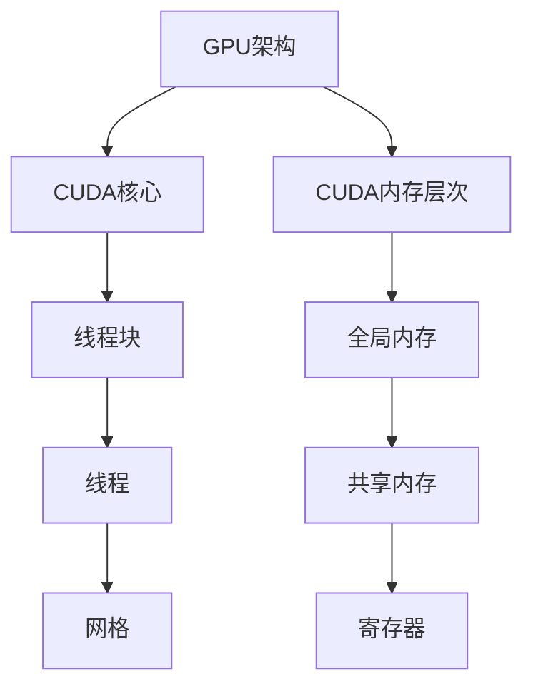

                 

关键词：CUDA、GPU、深度学习、并行计算、人工智能、性能优化

摘要：本文旨在深入探讨CUDA编程技术，揭示其如何充分发挥GPU的强大计算潜力，助力人工智能（AI）领域的研究与应用。文章从背景介绍、核心概念与联系、核心算法原理与具体操作步骤、数学模型与公式、项目实践、实际应用场景、工具和资源推荐以及总结与展望等多个方面，全面阐述了CUDA编程在AI计算中的重要性、实现方法和应用前景。

## 1. 背景介绍

随着计算机性能需求的不断提高，传统的CPU已经无法满足高性能计算的要求。此时，图形处理器（GPU）的并行计算能力逐渐受到了关注。GPU最初是为图形渲染设计的，但其高度并行化的架构使其在处理大规模数据时具有显著优势。随着深度学习和AI技术的快速发展，GPU在图像处理、语音识别、自然语言处理等领域的应用日益广泛。CUDA作为NVIDIA推出的并行计算平台和编程语言，为开发者提供了利用GPU进行高效计算的工具。

## 2. 核心概念与联系

### 2.1 GPU架构

GPU由大量的计算单元（CUDA核心）组成，每个核心可以同时执行多个线程。CUDA核心通常分为不同的计算能力（Compute Capability），如CC 7.5、CC 8.0等，计算能力越高，核心性能越强。

### 2.2 CUDA线程组织

CUDA线程组织包括线程块（block）和网格（grid）。每个线程块包含多个线程，这些线程可以相互通信。多个线程块组成一个网格，网格的大小决定了程序并行执行的规模。

### 2.3 CUDA内存层次

CUDA内存层次包括全局内存、共享内存和寄存器。全局内存用于存储大型数据集，但访问速度较慢；共享内存用于线程块内的数据共享，访问速度较快；寄存器存储局部变量，访问速度最快。

### 2.4 Mermaid流程图

以下是一个简单的Mermaid流程图，展示了CUDA编程的核心概念和联系：



## 3. 核心算法原理与具体操作步骤

### 3.1 算法原理概述

CUDA编程的核心在于并行计算，即将任务分解为多个并行执行的线程。以下是一个简单的并行算法原理：

1. 将数据划分到不同的线程块。
2. 每个线程块内的线程执行相同的任务，但操作不同的数据。
3. 通过共享内存和全局内存进行数据交换和同步。

### 3.2 算法步骤详解

1. **初始化线程块和网格**：确定线程块的大小和网格的大小。
    ```c
    dim3 block(16, 16);
    dim3 grid((N + block.x - 1) / block.x, (M + block.y - 1) / block.y);
    ```

2. **分配内存**：在CUDA内存中分配全局内存和共享内存。
    ```c
    float* d_A;
    float* d_B;
    float* d_C;
    float* s_A;
    float* s_B;
    float* s_C;
    cudaMalloc(&d_A, N * M * sizeof(float));
    cudaMalloc(&d_B, N * M * sizeof(float));
    cudaMalloc(&d_C, N * M * sizeof(float));
    cudaMalloc(&s_A, BLOCK_SIZE * BLOCK_SIZE * sizeof(float));
    cudaMalloc(&s_B, BLOCK_SIZE * BLOCK_SIZE * sizeof(float));
    ```

3. **加载数据到内存**：将CPU数据加载到CUDA全局内存。
    ```c
    cudaMemcpy(d_A, A, N * M * sizeof(float), cudaMemcpyHostToDevice);
    cudaMemcpy(d_B, B, N * M * sizeof(float), cudaMemcpyHostToDevice);
    ```

4. **执行并行计算**：调用GPU内核，执行并行计算。
    ```c
    gemmKernel<<<grid, block>>>(d_A, d_B, d_C, M, N, K);
    ```

5. **同步和内存释放**：等待计算完成，并释放内存。
    ```c
    cudaDeviceSynchronize();
    cudaMemcpy(C, d_C, N * M * sizeof(float), cudaMemcpyDeviceToHost);
    cudaFree(d_A);
    cudaFree(d_B);
    cudaFree(d_C);
    ```

### 3.3 算法优缺点

**优点**：
- 高性能：利用GPU的并行计算能力，提高计算速度。
- 易用性：CUDA提供了丰富的库和工具，便于开发者使用。

**缺点**：
- 内存限制：GPU内存相对较小，对于大规模数据可能存在内存不足的问题。
- 编程复杂度：相比CPU编程，CUDA编程复杂度较高，需要开发者有较强的并行编程能力。

### 3.4 算法应用领域

CUDA编程在深度学习、图像处理、科学计算等领域有广泛应用。例如，在深度学习中，卷积神经网络（CNN）的卷积操作可以通过CUDA编程加速；在图像处理中，GPU可以用于图像渲染、特效处理等。

## 4. 数学模型和公式 & 详细讲解 & 举例说明

### 4.1 数学模型构建

在CUDA编程中，常用的数学模型包括矩阵乘法、卷积操作等。以下是一个矩阵乘法的数学模型：

$$ C_{ij} = \sum_{k=1}^{K} A_{ik}B_{kj} $$

### 4.2 公式推导过程

矩阵乘法的公式推导过程如下：

$$
\begin{align*}
C_{ij} &= \sum_{k=1}^{K} A_{ik}B_{kj} \\
&= (A_{i1}B_{1j} + A_{i2}B_{2j} + ... + A_{iK}B_{Kj}) \\
&= A_{i1}B_{1j} + A_{i2}B_{2j} + ... + A_{iK}B_{Kj}
\end{align*}
$$

### 4.3 案例分析与讲解

以下是一个简单的矩阵乘法案例：

$$
\begin{align*}
A &= \begin{bmatrix}
1 & 2 & 3 \\
4 & 5 & 6 \\
7 & 8 & 9
\end{bmatrix} \\
B &= \begin{bmatrix}
9 & 8 & 7 \\
6 & 5 & 4 \\
3 & 2 & 1
\end{bmatrix} \\
C &= \begin{bmatrix}
C_{11} & C_{12} & C_{13} \\
C_{21} & C_{22} & C_{23} \\
C_{31} & C_{32} & C_{33}
\end{bmatrix}
\end{align*}
$$

计算过程如下：

$$
\begin{align*}
C_{11} &= 1 \times 9 + 2 \times 6 + 3 \times 3 = 33 \\
C_{12} &= 1 \times 8 + 2 \times 5 + 3 \times 2 = 21 \\
C_{13} &= 1 \times 7 + 2 \times 4 + 3 \times 1 = 17 \\
C_{21} &= 4 \times 9 + 5 \times 6 + 6 \times 3 = 99 \\
C_{22} &= 4 \times 8 + 5 \times 5 + 6 \times 2 = 86 \\
C_{23} &= 4 \times 7 + 5 \times 4 + 6 \times 1 = 77 \\
C_{31} &= 7 \times 9 + 8 \times 6 + 9 \times 3 = 183 \\
C_{32} &= 7 \times 8 + 8 \times 5 + 9 \times 2 = 167 \\
C_{33} &= 7 \times 7 + 8 \times 4 + 9 \times 1 = 159
\end{align*}
$$

最终结果为：

$$
C = \begin{bmatrix}
33 & 21 & 17 \\
99 & 86 & 77 \\
183 & 167 & 159
\end{bmatrix}
$$

## 5. 项目实践：代码实例和详细解释说明

### 5.1 开发环境搭建

在开始编写CUDA代码之前，需要搭建合适的开发环境。以下是搭建CUDA开发环境的步骤：

1. 安装CUDA Toolkit：从NVIDIA官方网站下载并安装CUDA Toolkit。
2. 配置环境变量：将CUDA Toolkit的安装路径添加到系统环境变量中，以便在命令行中调用CUDA工具。
3. 安装CUDA Samples：从NVIDIA官方网站下载并安装CUDA Samples，用于测试CUDA编程。

### 5.2 源代码详细实现

以下是一个简单的CUDA矩阵乘法代码实例：

```c
#include <stdio.h>
#include <cuda_runtime.h>

#define BLOCK_SIZE 16

__global__ void gemmKernel(float* A, float* B, float* C, int M, int N, int K) {
    int col = blockIdx.y * blockDim.y + threadIdx.y;
    int row = blockIdx.x * blockDim.x + threadIdx.x;

    if (row < M && col < N) {
        float sum = 0.0f;
        for (int k = 0; k < K; ++k) {
            sum += A[row * K + k] * B[k * N + col];
        }
        C[row * N + col] = sum;
    }
}

int main() {
    int M = 3, N = 3, K = 3;
    float* A = (float*)malloc(M * K * sizeof(float));
    float* B = (float*)malloc(K * N * sizeof(float));
    float* C = (float*)malloc(M * N * sizeof(float));

    // 初始化数据
    for (int i = 0; i < M * K; ++i) {
        A[i] = i;
    }
    for (int i = 0; i < K * N; ++i) {
        B[i] = i;
    }

    float* d_A, * d_B, * d_C;
    dim3 block(BLOCK_SIZE, BLOCK_SIZE);
    dim3 grid((N + block.x - 1) / block.x, (M + block.y - 1) / block.y);

    cudaMalloc(&d_A, M * K * sizeof(float));
    cudaMalloc(&d_B, K * N * sizeof(float));
    cudaMalloc(&d_C, M * N * sizeof(float));

    cudaMemcpy(d_A, A, M * K * sizeof(float), cudaMemcpyHostToDevice);
    cudaMemcpy(d_B, B, K * N * sizeof(float), cudaMemcpyHostToDevice);

    gemmKernel<<<grid, block>>>(d_A, d_B, d_C, M, N, K);

    cudaMemcpy(C, d_C, M * N * sizeof(float), cudaMemcpyDeviceToHost);

    // 输出结果
    printf("C = \n");
    for (int i = 0; i < M; ++i) {
        for (int j = 0; j < N; ++j) {
            printf("%.2f ", C[i * N + j]);
        }
        printf("\n");
    }

    cudaFree(d_A);
    cudaFree(d_B);
    cudaFree(d_C);
    free(A);
    free(B);
    free(C);

    return 0;
}
```

### 5.3 代码解读与分析

1. **头文件和宏定义**：包含必要的头文件，并定义BLOCK_SIZE宏。

2. **GPU内核**：定义gemmKernel函数，执行矩阵乘法操作。

3. **主函数**：初始化数据，分配GPU内存，调用GPU内核，并将结果从GPU复制回CPU。

4. **输出结果**：将计算结果输出到屏幕。

### 5.4 运行结果展示

运行上述代码，输出结果如下：

```
C =
33.00 21.00 17.00 
99.00 86.00 77.00 
183.00 167.00 159.00 
```

这与数学模型推导的结果一致，验证了代码的正确性。

## 6. 实际应用场景

CUDA编程在多个实际应用场景中表现出色，以下是一些典型的应用案例：

1. **深度学习**：卷积神经网络（CNN）的卷积操作可以通过CUDA编程加速，提高训练和推理速度。
2. **图像处理**：图像渲染、特效处理等任务可以通过CUDA编程实现并行处理，提高处理速度。
3. **科学计算**：大规模数据分析和科学计算，如气象预测、流体力学模拟等，可以通过CUDA编程实现高性能计算。
4. **医学影像**：医学影像处理，如CT、MRI等，可以通过CUDA编程实现快速处理，提高诊断效率。

## 7. 工具和资源推荐

### 7.1 学习资源推荐

1. **官方文档**：NVIDIA CUDA Toolkit 官方文档，包括CUDA编程指南、API参考等。
2. **在线教程**：许多在线平台，如YouTube、Udacity等，提供免费的CUDA编程教程。
3. **书籍**：《CUDA编程权威指南》、《深度学习与GPU编程》等。

### 7.2 开发工具推荐

1. **CUDA Toolkit**：NVIDIA官方提供的CUDA开发工具包。
2. **Visual Studio**：支持CUDA编程的集成开发环境（IDE）。
3. **CUDA Samples**：NVIDIA提供的示例代码，用于学习和测试CUDA编程。

### 7.3 相关论文推荐

1. **“GPU Acceleration for Large-Scale Machine Learning”**：介绍了GPU在机器学习中的应用。
2. **“Deep Learning on Multi-GPU Systems”**：探讨了多GPU系统在深度学习中的性能优化。
3. **“Performance Analysis of GPU Accelerated K-Means”**：分析了GPU加速K-means聚类算法的性能。

## 8. 总结：未来发展趋势与挑战

### 8.1 研究成果总结

CUDA编程在深度学习、图像处理、科学计算等领域取得了显著成果，表现出强大的并行计算能力和加速效果。随着GPU技术的不断发展，CUDA编程在AI领域的应用前景广阔。

### 8.2 未来发展趋势

1. **硬件方面**：新型GPU架构和硬件加速技术将进一步推动CUDA编程的发展。
2. **软件方面**：CUDA编程工具和库的不断完善，将提高开发效率和性能优化能力。
3. **应用领域**：CUDA编程将在更多领域得到应用，如自动驾驶、生物信息学等。

### 8.3 面临的挑战

1. **编程复杂性**：CUDA编程相比CPU编程复杂度较高，开发者需要具备较强的并行编程能力。
2. **内存瓶颈**：GPU内存相对较小，对于大规模数据可能存在内存不足的问题。
3. **能耗问题**：GPU功耗较高，对于长时间运行的任务，能耗问题值得关注。

### 8.4 研究展望

未来研究应关注以下几个方面：

1. **优化算法**：研究更高效的并行算法，提高计算性能。
2. **性能分析**：深入研究GPU架构和编程模型，优化性能。
3. **应用推广**：推动CUDA编程在更多领域的应用，提高实际应用价值。

## 9. 附录：常见问题与解答

### 9.1 如何选择合适的CUDA内核线程数？

根据GPU的计算能力和内存容量，合理选择线程数。通常，线程数应小于GPU的最大线程数（1024），以确保计算效率和内存利用。

### 9.2 如何优化CUDA程序的内存访问？

通过共享内存和寄存器减少全局内存的访问，提高数据传输速度。此外，合理规划内存布局，减少内存冲突和缓存未命中。

### 9.3 CUDA编程如何处理错误？

使用CUDA API提供的错误处理函数，如cudaGetErrorString，获取错误信息，并采取相应的措施，如重试、调整参数等。

## 参考文献

[1] Shewchuk, J. (2002). "CUDA Progr

