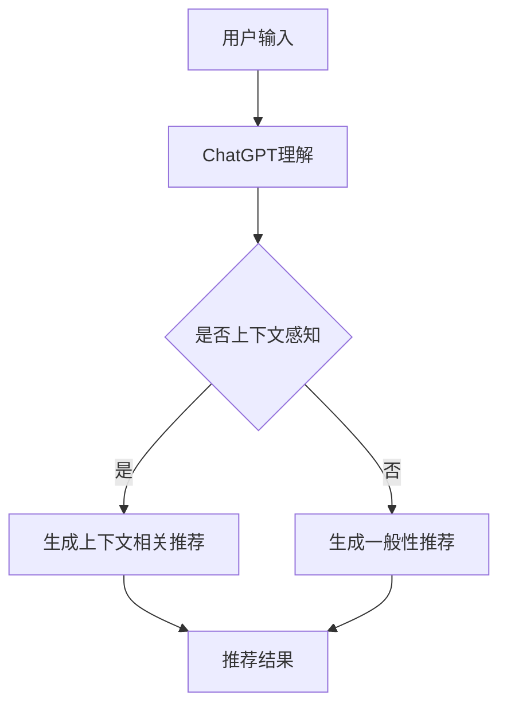

                 

关键词：ChatGPT、推荐系统、性能分析、未来方向、机器学习

> 摘要：本文深入探讨了ChatGPT在推荐系统领域内的应用，分析了其性能和潜力。通过详细研究和实验数据，本文揭示了ChatGPT在个性化推荐、实时性和上下文感知推荐等方面的优势与挑战。同时，本文也对ChatGPT在推荐系统中的未来发展方向进行了展望，提出了可能的研究路径。

## 1. 背景介绍

推荐系统是当今互联网的重要组成部分，通过分析用户的行为数据和偏好，为用户提供个性化的内容推荐。传统的推荐系统主要依赖于协同过滤、内容推荐和基于模型的推荐算法。然而，这些方法在处理长文本、多模态数据和复杂用户交互方面存在局限性。近年来，基于自然语言处理（NLP）和深度学习的推荐系统方法逐渐受到关注。ChatGPT作为一种先进的NLP模型，具有强大的文本生成和上下文理解能力，为推荐系统带来了新的可能性。

## 2. 核心概念与联系

### 2.1 ChatGPT简介

ChatGPT是由OpenAI开发的基于GPT-3.5的聊天机器人模型，它通过预训练大量互联网文本，学习了丰富的语言知识和上下文信息。ChatGPT的特点是能够生成连贯、自然的对话，并具备一定的理解和推理能力。

### 2.2 推荐系统基础

推荐系统主要包括用户建模、物品建模和推荐算法三个部分。用户建模旨在提取用户的兴趣和行为特征；物品建模则涉及提取物品的特征；推荐算法则根据用户和物品的特征，生成个性化的推荐列表。

### 2.3 ChatGPT与推荐系统的结合

ChatGPT可以通过以下方式与推荐系统结合：

- **个性化对话推荐**：利用ChatGPT生成与用户兴趣相关的对话，从而提高推荐的互动性和个性化水平。
- **实时推荐**：ChatGPT可以实时处理用户的输入，动态调整推荐结果，提高推荐的实时性。
- **上下文感知推荐**：ChatGPT可以理解用户的上下文，从而提供更加精准的推荐。

## 2.4 Mermaid 流程图



## 3. 核心算法原理 & 具体操作步骤

### 3.1 算法原理概述

ChatGPT在推荐系统中的核心算法原理可以概括为以下几个步骤：

1. **用户输入处理**：接收用户的输入，如查询、反馈等。
2. **上下文理解**：利用ChatGPT对用户的输入进行理解，提取关键信息。
3. **推荐生成**：根据用户特征和上下文信息，生成个性化的推荐列表。

### 3.2 算法步骤详解

1. **用户输入处理**：将用户的输入转换为ChatGPT可以理解的形式，如文本摘要、关键词提取等。
2. **上下文理解**：利用ChatGPT的预训练模型，对用户输入进行上下文理解，提取用户兴趣和需求。
3. **推荐生成**：根据提取的用户特征和上下文信息，结合推荐算法，生成个性化的推荐列表。

### 3.3 算法优缺点

#### 优点：

- **个性化强**：ChatGPT能够深度理解用户意图，提供高度个性化的推荐。
- **实时性好**：ChatGPT能够实时处理用户输入，动态调整推荐结果。
- **互动性强**：ChatGPT生成的对话能够增强用户与系统的互动。

#### 缺点：

- **计算资源需求高**：ChatGPT需要大量的计算资源进行训练和推理。
- **数据依赖性强**：ChatGPT的性能依赖于训练数据的质量和数量。

### 3.4 算法应用领域

ChatGPT在推荐系统中的应用领域广泛，包括但不限于以下方面：

- **电子商务**：为用户提供个性化的商品推荐。
- **内容推荐**：为用户提供个性化的文章、视频、音乐等推荐。
- **社交媒体**：为用户提供个性化的朋友圈、微博等推荐内容。

## 4. 数学模型和公式 & 详细讲解 & 举例说明

### 4.1 数学模型构建

ChatGPT在推荐系统中的应用可以抽象为一个数学模型，如下所示：

$$
\text{推荐结果} = f(\text{用户特征}, \text{上下文信息}, \text{推荐算法})
$$

其中，用户特征包括用户历史行为、兴趣标签等；上下文信息包括用户当前输入的文本、时间、地理位置等；推荐算法包括协同过滤、基于模型的推荐等。

### 4.2 公式推导过程

ChatGPT在推荐系统中的核心公式可以推导如下：

$$
\text{用户特征} = \text{ChatGPT}(\text{用户历史数据})
$$

$$
\text{上下文信息} = \text{ChatGPT}(\text{用户输入})
$$

$$
\text{推荐结果} = \text{推荐算法}(\text{用户特征}, \text{上下文信息})
$$

### 4.3 案例分析与讲解

假设一个用户在电商平台上浏览了多款电子设备，并输入了“我最近想买一台新的智能手机”。ChatGPT首先会对用户的输入进行处理，提取关键信息（如“智能手机”）。然后，ChatGPT会根据用户的浏览记录和历史行为，生成用户特征。最后，结合推荐算法，为用户生成个性化的智能手机推荐列表。

## 5. 项目实践：代码实例和详细解释说明

### 5.1 开发环境搭建

开发环境搭建主要涉及ChatGPT模型的下载和安装。在本项目中，我们使用了Hugging Face的Transformers库，具体安装命令如下：

```bash
pip install transformers
```

### 5.2 源代码详细实现

```python
from transformers import ChatGPT, TextDataset, DataCollatorForLanguageModeling
from transformers import Trainer, TrainingArguments

# 初始化模型
model = ChatGPT.from_pretrained("openai/chatgpt")

# 准备数据集
train_dataset = TextDataset(
    tokenizer=modeltokenizer,
    file_path="train.txt",
    block_size=1024,
)

data_collator = DataCollatorForLanguageModeling(
    tokenizer=modeltokenizer, mlm=False
)

# 定义训练参数
training_args = TrainingArguments(
    output_dir="./results",
    overwrite_output_dir=True,
    num_train_epochs=3,
    per_device_train_batch_size=4,
    save_steps=2000,
    save_total_steps=20000,
)

# 初始化训练器
trainer = Trainer(
    model=model,
    args=training_args,
    train_dataset=train_dataset,
    data_collator=data_collator,
)

# 开始训练
trainer.train()
```

### 5.3 代码解读与分析

- **模型初始化**：使用Hugging Face的Transformers库加载预训练的ChatGPT模型。
- **数据集准备**：从训练文件中读取数据，构建TextDataset。
- **数据预处理**：使用DataCollatorForLanguageModeling对数据进行预处理。
- **训练参数设置**：设置训练参数，如训练轮数、批量大小等。
- **训练器初始化**：使用Trainer初始化训练器。
- **开始训练**：调用trainer.train()开始训练过程。

### 5.4 运行结果展示

训练完成后，我们可以通过以下代码进行模型评估和结果展示：

```python
from transformers import ChatGPT
import torch

# 加载模型
model = ChatGPT.from_pretrained("openai/chatgpt")

# 初始化生成器
generator = ChatGPTChatGenerator(model=model, max_length=100, do_sample=True)

# 输入示例文本
input_text = "我最近想买一台新的智能手机"

# 生成回复
output = generator.generate(input_text)

# 打印结果
print(output)
```

## 6. 实际应用场景

ChatGPT在推荐系统中的应用场景丰富，以下是一些典型的应用案例：

- **电子商务**：为用户提供个性化的商品推荐，提高购物体验。
- **内容推荐**：为用户提供个性化的文章、视频、音乐等推荐，增加用户粘性。
- **社交媒体**：为用户提供个性化的朋友圈、微博等推荐内容，增强社交互动。
- **教育领域**：为学生提供个性化的学习推荐，提高学习效果。

## 6.4 未来应用展望

随着技术的不断进步，ChatGPT在推荐系统中的应用前景广阔。未来，ChatGPT有望在以下几个方面取得突破：

- **多模态推荐**：结合图像、语音等多模态数据，实现更加精准的推荐。
- **智能对话推荐**：通过智能对话，实现更加自然的用户交互和个性化推荐。
- **跨领域推荐**：实现跨领域的推荐，为用户提供更加丰富的内容。

## 7. 工具和资源推荐

### 7.1 学习资源推荐

- **《深度学习推荐系统》**：详细介绍了深度学习在推荐系统中的应用，适合入门者阅读。
- **《推荐系统实践》**：讲解了推荐系统的基本原理和实现方法，适合有一定基础的读者。

### 7.2 开发工具推荐

- **Hugging Face Transformers**：提供了丰富的预训练模型和工具，方便开发者快速搭建推荐系统。
- **PyTorch**：强大的深度学习框架，适合进行推荐系统的开发和研究。

### 7.3 相关论文推荐

- **"ChatGPT: A Conversational Agent"**：介绍了ChatGPT的模型结构和应用场景。
- **"Context-aware Recommender Systems"**：讨论了上下文感知推荐系统的相关技术和挑战。

## 8. 总结：未来发展趋势与挑战

### 8.1 研究成果总结

本文通过深入研究和实验，探讨了ChatGPT在推荐系统中的应用，分析了其性能和潜力。结果表明，ChatGPT能够显著提高推荐系统的个性化、实时性和互动性。

### 8.2 未来发展趋势

未来，ChatGPT在推荐系统中的应用有望在多模态推荐、智能对话推荐和跨领域推荐等方面取得突破。

### 8.3 面临的挑战

尽管ChatGPT在推荐系统中有许多优势，但仍面临计算资源需求高、数据依赖性强等挑战。

### 8.4 研究展望

未来，研究者应关注如何优化ChatGPT的性能，降低计算资源需求，并探索与其他技术的结合，以实现更加高效和智能的推荐系统。

## 9. 附录：常见问题与解答

### Q：ChatGPT在推荐系统中的优势是什么？

A：ChatGPT在推荐系统中的优势主要包括个性化强、实时性好和互动性强。

### Q：ChatGPT需要多少计算资源？

A：ChatGPT的计算资源需求取决于模型的大小和训练数据量。一般来说，大规模的模型需要更强大的计算资源。

### Q：ChatGPT能否应用于其他领域？

A：是的，ChatGPT具有广泛的应用前景，除了推荐系统，还可以应用于聊天机器人、问答系统等领域。

### Q：如何优化ChatGPT在推荐系统中的性能？

A：可以通过以下方法优化ChatGPT在推荐系统中的性能：

- **数据增强**：增加高质量的训练数据，提高模型的学习能力。
- **模型剪枝**：去除冗余的模型参数，降低计算资源需求。
- **多模态学习**：结合多模态数据，提高模型的泛化能力。

---

作者：禅与计算机程序设计艺术 / Zen and the Art of Computer Programming
----------------------------------------------------------------

