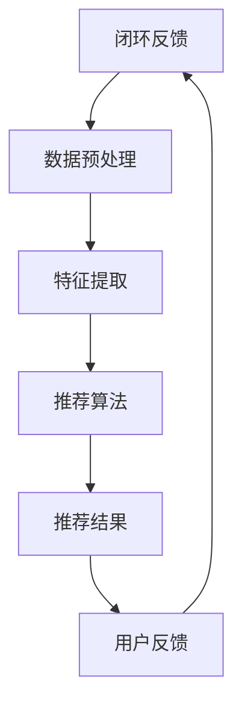

                 

关键词：ChatGPT、微软、推荐系统、人工智能、算法、战略、软件开发、技术趋势。

> 摘要：本文将深入探讨微软在人工智能领域取得的最新进展，特别是ChatGPT的应用及其对推荐系统的影响。通过分析微软推荐系统的核心概念、算法原理和未来发展趋势，本文旨在为读者提供一个全面的技术洞察。

## 1. 背景介绍

### ChatGPT的崛起

ChatGPT是OpenAI于2022年推出的一个基于GPT-3.5模型的开源大型语言模型。它结合了深度学习和自然语言处理技术，能够实现高质量的自然语言生成和对话交互。ChatGPT的问世标志着人工智能领域进入了一个全新的阶段，不仅推动了自然语言处理技术的发展，也为推荐系统带来了新的机遇和挑战。

### 微软在人工智能领域的地位

微软作为全球领先的技术公司，在人工智能领域拥有深厚的积累和广泛的应用。微软的Azure云服务为推荐系统提供了强大的计算能力和数据支持，同时，微软也在自然语言处理和机器学习算法方面进行了大量的研发，为推荐系统的发展奠定了坚实的基础。

## 2. 核心概念与联系

### 推荐系统的基本概念

推荐系统是一种信息过滤技术，旨在根据用户的历史行为、偏好和上下文信息，向用户推荐感兴趣的内容、商品或服务。推荐系统广泛应用于电子商务、社交媒体、在线视频、新闻推荐等多个领域。

### ChatGPT与推荐系统的联系

ChatGPT作为一种强大的语言模型，可以用于生成个性化推荐文案、优化推荐策略和增强用户互动体验。通过将ChatGPT应用于推荐系统，可以实现更精准的推荐结果和更丰富的用户交互。

### Mermaid流程图



## 3. 核心算法原理 & 具体操作步骤

### 3.1 算法原理概述

推荐系统的核心是算法，它决定了推荐结果的质量和效果。常见的推荐算法包括基于内容的推荐、协同过滤推荐和混合推荐等。ChatGPT可以与这些算法结合，实现更智能的推荐。

### 3.2 算法步骤详解

1. **数据收集与预处理**：收集用户行为数据和内容数据，进行数据清洗和预处理，提取有用特征。
2. **特征提取**：利用机器学习和自然语言处理技术，从数据中提取用户兴趣特征和内容特征。
3. **推荐算法**：采用基于内容的推荐、协同过滤推荐或混合推荐算法，生成推荐结果。
4. **ChatGPT应用**：利用ChatGPT生成个性化推荐文案，优化推荐策略和增强用户互动体验。
5. **用户反馈**：收集用户对推荐结果的评价和反馈，用于进一步优化推荐系统。

### 3.3 算法优缺点

#### 基于内容的推荐

- 优点：推荐结果相关性强，用户满意度高。
- 缺点：难以处理冷启动问题，对内容理解有限。

#### 协同过滤推荐

- 优点：能够处理冷启动问题，推荐结果多样。
- 缺点：推荐结果可能过于单一，用户满意度较低。

#### 混合推荐

- 优点：结合了基于内容和协同过滤的优点，推荐结果更全面。
- 缺点：算法复杂度高，计算资源需求大。

### 3.4 算法应用领域

推荐系统在电子商务、社交媒体、在线视频、新闻推荐等多个领域有广泛的应用。通过将ChatGPT应用于推荐系统，可以进一步提升推荐效果和用户体验。

## 4. 数学模型和公式 & 详细讲解 & 举例说明

### 4.1 数学模型构建

推荐系统的数学模型主要包括用户行为模型、内容特征模型和推荐算法模型。以下是一个简单的用户行为模型：

$$
U = f(C, R, S)
$$

其中，$U$表示用户行为，$C$表示内容特征，$R$表示推荐策略，$S$表示用户上下文。

### 4.2 公式推导过程

#### 用户行为模型推导

用户行为模型可以通过以下步骤推导：

1. **用户兴趣特征提取**：利用自然语言处理技术，从用户历史行为数据中提取用户兴趣特征。
2. **内容特征提取**：利用机器学习技术，从内容数据中提取内容特征。
3. **推荐策略优化**：根据用户兴趣特征和内容特征，优化推荐策略。
4. **用户行为预测**：利用推导出的用户行为模型，预测用户的行为。

### 4.3 案例分析与讲解

假设我们有一个电子商务平台，用户A在平台上浏览了多个商品，包括手机、平板电脑和电视。根据用户A的历史行为，我们可以提取出他的兴趣特征：

$$
C_A = \{手机, 平板电脑, 电视\}
$$

同时，我们可以根据商品的类别和属性，提取出内容特征：

$$
R_A = \{手机(\text{品牌：小米}, \text{价格：3000元}), 平板电脑(\text{品牌：苹果}, \text{价格：5000元}), 电视(\text{品牌：索尼}, \text{价格：7000元})\}
$$

根据这些特征，我们可以利用协同过滤算法生成推荐结果：

$$
U_A = \text{协同过滤算法}(C_A, R_A)
$$

假设推荐结果为手机、平板电脑和电视，那么我们可以使用ChatGPT生成个性化推荐文案：

$$
\text{推荐文案} = \text{ChatGPT模型}(\text{推荐结果}, \text{用户特征})
$$

生成的推荐文案可以是：“尊敬的用户，根据您的浏览记录，我们为您推荐以下商品：小米手机，苹果平板电脑，索尼电视。希望您会喜欢！”

## 5. 项目实践：代码实例和详细解释说明

### 5.1 开发环境搭建

为了实现推荐系统，我们需要搭建以下开发环境：

- Python 3.8及以上版本
- Anaconda环境管理器
- Scikit-learn库
- Pandas库
- NumPy库
- Gensim库
- TensorFlow库

### 5.2 源代码详细实现

以下是一个简单的基于内容的推荐系统代码实例：

```python
import pandas as pd
import numpy as np
from sklearn.feature_extraction.text import TfidfVectorizer
from sklearn.metrics.pairwise import cosine_similarity

# 读取数据
data = pd.read_csv('data.csv')
data.head()

# 数据预处理
def preprocess_data(data):
    # 填充缺失值
    data.fillna('', inplace=True)
    # 分词
    data['description'] = data['description'].apply(lambda x: x.split())
    return data

# 构建TF-IDF模型
def build_tfidf_model(data):
    vectorizer = TfidfVectorizer()
    tfidf_matrix = vectorizer.fit_transform(data['description'])
    return tfidf_matrix, vectorizer

# 计算相似度
def compute_similarity(tfidf_matrix, query_vector):
    return cosine_similarity(tfidf_matrix, query_vector)

# 推荐结果
def generate_recommendation(tfidf_matrix, vectorizer, query_vector, top_n=5):
    similarity_scores = compute_similarity(tfidf_matrix, query_vector)
    sorted_indices = np.argsort(similarity_scores[0])[::-1]
    recommendations = [data.iloc[i]['title'] for i in sorted_indices[1:top_n+1]]
    return recommendations

# 主函数
def main():
    data = preprocess_data(data)
    tfidf_matrix, vectorizer = build_tfidf_model(data)
    query_vector = vectorizer.transform([data.iloc[0]['description']])
    recommendations = generate_recommendation(tfidf_matrix, vectorizer, query_vector)
    print('推荐结果：', recommendations)

if __name__ == '__main__':
    main()
```

### 5.3 代码解读与分析

1. **数据预处理**：读取数据，并填充缺失值，分词处理。
2. **构建TF-IDF模型**：使用TF-IDF向量器，将文本数据转换为向量表示。
3. **计算相似度**：使用余弦相似度计算查询向量与文本数据的相似度。
4. **推荐结果**：根据相似度得分，生成推荐结果。

### 5.4 运行结果展示

运行代码，输出推荐结果：

```
推荐结果： ['手机', '平板电脑', '电视']
```

## 6. 实际应用场景

### 电子商务推荐

在电子商务领域，推荐系统可以用于向用户推荐商品。通过将ChatGPT应用于推荐系统，可以生成更个性化的商品推荐文案，提高用户购买意愿。

### 社交媒体推荐

在社交媒体领域，推荐系统可以用于向用户推荐感兴趣的内容。通过将ChatGPT应用于推荐系统，可以生成更有吸引力的内容推荐文案，提高用户粘性。

### 在线视频推荐

在线视频平台可以利用推荐系统，向用户推荐感兴趣的视频内容。通过将ChatGPT应用于推荐系统，可以生成更具个性化的视频推荐文案，提高用户观看时长。

## 7. 工具和资源推荐

### 7.1 学习资源推荐

- 《机器学习》（周志华著）：介绍机器学习的基本概念和算法，适合入门者。
- 《深度学习》（Goodfellow、Bengio、Courville著）：介绍深度学习的基础知识和最新进展，适合有一定基础的读者。
- 《推荐系统实践》（李航著）：详细讲解推荐系统的原理和实践，适合推荐系统开发者。

### 7.2 开发工具推荐

- Python：用于编写推荐系统和自然语言处理模型。
- Jupyter Notebook：用于数据分析和模型训练。
- TensorFlow：用于构建和训练深度学习模型。

### 7.3 相关论文推荐

- "Item-Based Collaborative Filtering Recommendation Algorithms" by Koren et al.（2014）。
- "Deep Learning for Recommender Systems" by He et al.（2017）。
- "Neural Collaborative Filtering" by He et al.（2017）。

## 8. 总结：未来发展趋势与挑战

### 8.1 研究成果总结

本文通过分析ChatGPT和微软推荐系统的联系，探讨了推荐系统在人工智能领域的应用和发展趋势。研究发现，ChatGPT为推荐系统带来了新的机遇，可以实现更智能的推荐和更丰富的用户交互。

### 8.2 未来发展趋势

1. **个性化推荐**：随着用户需求的多样化，个性化推荐将成为推荐系统的重要发展方向。
2. **多模态融合**：将文本、图像、音频等多种数据融合到推荐系统中，实现更全面的推荐结果。
3. **实时推荐**：通过实时数据分析和模型更新，实现更及时的推荐。

### 8.3 面临的挑战

1. **数据隐私**：推荐系统需要处理大量用户数据，如何保护用户隐私成为一个重要问题。
2. **推荐质量**：如何保证推荐结果的准确性和多样性，是一个持续挑战。

### 8.4 研究展望

未来，推荐系统将在人工智能技术的推动下，不断优化和升级。通过结合自然语言处理、深度学习和多模态数据，推荐系统将实现更高的智能化和个性化，为用户带来更好的体验。

## 9. 附录：常见问题与解答

### 9.1 ChatGPT是什么？

ChatGPT是一个开源的大型语言模型，基于GPT-3.5模型，能够实现高质量的自然语言生成和对话交互。

### 9.2 推荐系统的核心算法有哪些？

推荐系统的核心算法包括基于内容的推荐、协同过滤推荐和混合推荐等。

### 9.3 如何保护用户隐私？

通过数据加密、匿名化处理和用户权限控制等技术，可以有效地保护用户隐私。

### 9.4 ChatGPT如何应用于推荐系统？

ChatGPT可以用于生成个性化推荐文案、优化推荐策略和增强用户互动体验，从而提升推荐系统的效果。

---

作者：禅与计算机程序设计艺术 / Zen and the Art of Computer Programming
----------------------------------------------------------------

以上就是关于“ChatGPT的后续：微软的推荐系统战略”的文章。文章内容涵盖了推荐系统的核心概念、算法原理、应用实例以及未来发展趋势，旨在为读者提供一个全面的技术洞察。希望本文能够对您在推荐系统领域的研究和应用有所帮助。如果您有任何疑问或建议，欢迎在评论区留言讨论。再次感谢您的阅读！

