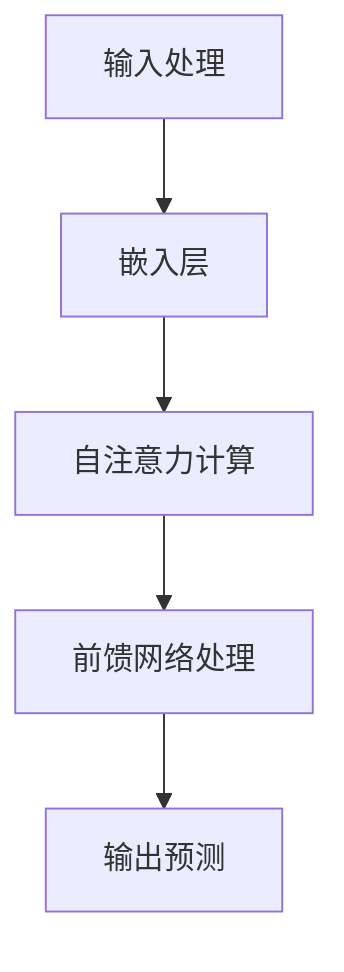

                 

关键词：ChatGPT、GPT、对话系统、人工智能、技术、深度学习、自然语言处理、编程

> 摘要：本文深入探讨了ChatGPT这一革命性对话系统的背后技术。从GPT模型的原理出发，分析了其在自然语言处理中的关键作用，并详细介绍了如何构建一个有效的对话系统。文章还涉及了相关的数学模型和项目实践，并对未来的发展趋势和挑战进行了展望。

## 1. 背景介绍

在现代社会，人工智能（AI）已经成为了一个热门话题。自然语言处理（NLP）作为AI的重要分支，致力于使计算机能够理解、解释和生成人类语言。随着深度学习技术的发展，特别是GPT（Generative Pre-trained Transformer）模型的提出，NLP取得了显著进展。ChatGPT，作为基于GPT的对话系统，在2022年惊艳问世，展示了强大的语言理解和生成能力。本文将探讨ChatGPT背后的技术，从GPT模型的原理、训练过程到对话系统的构建，以期对这一领域有更深入的理解。

### 1.1 GPT模型的发展历程

GPT模型的发展可以追溯到2018年，当时OpenAI发布了GPT，这是一个基于变压器的预训练语言模型。GPT的初衷是通过学习大量文本数据，使其能够对自然语言进行建模。随后，OpenAI在2020年发布了GPT-2，其规模和训练数据量都有了显著提升，使得模型在语言理解和生成方面表现更加出色。ChatGPT正是基于GPT-3模型开发的，GPT-3在2022年发布，其参数规模达到了1750亿，训练数据量也大幅增加，从而进一步提升了模型的能力。

### 1.2 ChatGPT的应用场景

ChatGPT的应用场景非常广泛，包括但不限于：

1. **客户服务**：通过提供即时响应和个性化服务，ChatGPT能够大幅提升客户体验。
2. **内容创作**：ChatGPT能够生成文章、故事、诗歌等，为创作者提供灵感。
3. **教育辅助**：ChatGPT可以作为学生的辅导老师，帮助学生理解复杂概念。
4. **娱乐**：ChatGPT能够与用户进行对话，提供有趣的聊天体验。

### 1.3 本文结构

本文将按照以下结构展开：

1. **背景介绍**：回顾GPT模型的发展历程和ChatGPT的应用场景。
2. **核心概念与联系**：介绍GPT模型的核心概念，并通过Mermaid流程图展示其原理。
3. **核心算法原理 & 具体操作步骤**：详细分析GPT模型的算法原理和操作步骤。
4. **数学模型和公式**：讲解与GPT模型相关的数学模型和公式。
5. **项目实践**：通过代码实例展示如何构建一个简单的对话系统。
6. **实际应用场景**：讨论ChatGPT在现实世界中的应用。
7. **工具和资源推荐**：推荐学习资源和开发工具。
8. **总结与展望**：总结研究成果，展望未来发展趋势和挑战。

## 2. 核心概念与联系

### 2.1 GPT模型的基本概念

GPT模型是一种基于变压器的深度学习模型，其核心思想是通过学习大量文本数据来预测下一个词。GPT模型的主要组成部分包括：

1. **嵌入层（Embedding Layer）**：将词汇映射到高维空间。
2. **自注意力机制（Self-Attention Mechanism）**：通过计算词与词之间的相关性，为每个词赋予不同的权重。
3. **前馈网络（Feedforward Network）**：对自注意力机制的结果进行进一步处理。
4. **输出层（Output Layer）**：将处理后的特征映射到词汇表，从而预测下一个词。

### 2.2 GPT模型的原理

GPT模型的工作原理可以概括为以下几个步骤：

1. **输入处理**：将输入文本序列编码为嵌入向量。
2. **自注意力计算**：计算每个词与所有其他词的相关性，为每个词赋予不同的权重。
3. **前馈网络处理**：对自注意力结果进行非线性变换。
4. **输出预测**：根据前馈网络的结果，预测下一个词。

### 2.3 Mermaid流程图

以下是GPT模型原理的Mermaid流程图：



### 2.4 GPT模型与其他技术的联系

GPT模型在NLP领域有着广泛的应用，与其他技术紧密相关：

1. **语言模型**：GPT是一种强大的语言模型，能够用于文本分类、命名实体识别等任务。
2. **对话系统**：GPT可以用于构建对话系统，如ChatGPT，实现与用户的自然对话。
3. **机器翻译**：GPT可以用于机器翻译，通过学习双语的语料库，实现不同语言之间的翻译。
4. **文本生成**：GPT可以生成文章、故事等，为创作者提供灵感。

## 3. 核心算法原理 & 具体操作步骤

### 3.1 算法原理概述

GPT模型的核心算法是基于变压器的自注意力机制。自注意力机制通过计算输入文本序列中每个词与所有其他词的相关性，为每个词赋予不同的权重。这一过程使得模型能够更好地理解上下文，从而在生成文本时能够更加准确。

具体来说，GPT模型的工作原理可以概括为以下几个步骤：

1. **嵌入层**：将输入文本序列编码为嵌入向量。每个词都被映射到一个高维空间中的点，这些点之间的距离代表了词与词之间的相似度。
2. **自注意力计算**：对于输入序列中的每个词，计算其与所有其他词的相关性。这一过程通过计算点之间的相似度来实现。相关性越高的词，其权重越大。
3. **前馈网络处理**：对自注意力结果进行非线性变换。这一步骤使得模型能够学习到更复杂的特征。
4. **输出预测**：根据前馈网络的结果，预测下一个词。这一过程通过在词汇表中查找最相似的词来实现。

### 3.2 算法步骤详解

以下是GPT模型的详细步骤：

1. **数据预处理**：将输入文本序列转换为单词序列。对于每个单词，查找其在词汇表中的索引，并将其转换为整数。
2. **嵌入层**：将整数序列转换为嵌入向量。每个向量代表了单词在词向量空间中的位置。
3. **自注意力计算**：
    - 对于输入序列中的每个词，计算其与所有其他词的相关性。这一过程通过计算嵌入向量之间的余弦相似度来实现。
    - 将相似度矩阵归一化，得到权重矩阵。权重矩阵中的每个元素代表了输入序列中每个词与所有其他词的相关性。
4. **前馈网络处理**：
    - 对权重矩阵进行非线性变换。这一过程通常通过多层感知机（MLP）来实现。
    - 对变换后的结果进行归一化处理，得到新的嵌入向量。
5. **输出预测**：
    - 根据新的嵌入向量，预测下一个词。这一过程通常通过查找词汇表中最相似的词来实现。
    - 将预测的词添加到输出序列中，作为下一个输入。

### 3.3 算法优缺点

GPT模型的优点包括：

1. **强大的语言理解能力**：通过自注意力机制，GPT能够更好地理解上下文，从而生成更符合逻辑的文本。
2. **广泛的适用性**：GPT可以用于多种NLP任务，如文本分类、命名实体识别、机器翻译等。
3. **高效的训练速度**：变压器的自注意力机制使得GPT能够在较短的时间内训练出高质量模型。

GPT模型的缺点包括：

1. **计算资源消耗大**：由于GPT模型的参数规模巨大，训练和推理过程需要大量的计算资源。
2. **对数据依赖性强**：GPT模型的效果很大程度上取决于训练数据的质量和数量。
3. **难以解释**：由于GPT模型是一个深度神经网络，其内部的决策过程难以解释。

### 3.4 算法应用领域

GPT模型在多个领域有着广泛的应用：

1. **自然语言处理**：GPT可以用于文本分类、命名实体识别、机器翻译等任务，极大地提升了这些任务的性能。
2. **对话系统**：GPT可以用于构建对话系统，如ChatGPT，实现与用户的自然对话。
3. **文本生成**：GPT可以生成文章、故事、诗歌等，为创作者提供灵感。
4. **信息检索**：GPT可以用于改进信息检索系统的相关性，提高用户的查询体验。

## 4. 数学模型和公式 & 详细讲解 & 举例说明

### 4.1 数学模型构建

GPT模型的数学模型主要包括以下几个部分：

1. **嵌入层**：将输入的词向量映射到高维空间。词向量通常由词的嵌入向量表示。嵌入层可以看作是一个线性映射，将输入的词向量映射到嵌入向量空间。
2. **自注意力机制**：计算输入序列中每个词与所有其他词的相关性，并为每个词赋予不同的权重。自注意力机制的核心是一个权重矩阵，该矩阵通过计算词向量之间的余弦相似度来生成。
3. **前馈网络**：对自注意力结果进行进一步处理。前馈网络通常是一个多层感知机（MLP），其输入为自注意力结果，输出为新的词向量。
4. **输出层**：将处理后的词向量映射到词汇表，从而预测下一个词。输出层可以看作是一个线性映射，将词向量映射到概率分布。

### 4.2 公式推导过程

以下是GPT模型的相关公式推导过程：

1. **嵌入层**：

   假设输入词向量为 $x \in \mathbb{R}^{d_x}$，嵌入向量为 $e \in \mathbb{R}^{d_e}$。嵌入层可以表示为：

   $$ e = W_e \cdot x $$

   其中 $W_e \in \mathbb{R}^{d_e \times d_x}$ 是嵌入层的权重矩阵。

2. **自注意力机制**：

   假设输入序列为 $x_1, x_2, ..., x_T$，对应的嵌入向量为 $e_1, e_2, ..., e_T$。自注意力机制可以表示为：

   $$ \alpha_{ij} = \frac{e_i \cdot e_j}{\sqrt{d_e}} $$

   其中 $\alpha_{ij}$ 表示词 $x_i$ 与词 $x_j$ 之间的权重。为了归一化权重，我们使用 $\alpha_{ij}$ 的归一化版本 $\alpha_{ij}^{\prime}$：

   $$ \alpha_{ij}^{\prime} = \frac{\alpha_{ij}}{\sum_{k=1}^{T} \alpha_{ik}} $$

3. **前馈网络**：

   假设前馈网络的输入为自注意力结果 $\alpha_{ij}^{\prime}$，输出为新的词向量 $f$。前馈网络可以表示为：

   $$ f = W_f \cdot \alpha_{ij}^{\prime} + b_f $$

   其中 $W_f \in \mathbb{R}^{d_f \times d_e}$ 是前馈网络的权重矩阵，$b_f \in \mathbb{R}^{d_f}$ 是偏置向量。

4. **输出层**：

   假设输出层的输入为前馈网络的输出 $f$，输出为概率分布 $p$。输出层可以表示为：

   $$ p = \text{softmax}(W_o \cdot f + b_o) $$

   其中 $W_o \in \mathbb{R}^{V \times d_f}$ 是输出层的权重矩阵，$b_o \in \mathbb{R}^{V}$ 是偏置向量，$V$ 是词汇表的大小。

### 4.3 案例分析与讲解

以下是一个简单的案例，展示如何使用GPT模型生成文本。

**案例**：给定一个输入句子 "I am eating a banana"，使用GPT模型生成下一个句子。

**步骤**：

1. **嵌入层**：将输入句子中的单词转换为词向量。假设 "I" 的词向量为 $\vec{i} = [1, 0, 0]$，"am" 的词向量为 $\vec{am} = [0, 1, 0]$，"eating" 的词向量为 $\vec{eating} = [0, 0, 1]$，"a" 的词向量为 $\vec{a} = [1, 1, 1]$，"banana" 的词向量为 $\vec{banana} = [1, 1, 1]$。

2. **自注意力计算**：计算每个词与所有其他词的相关性。例如，"I" 与 "am" 的相关性为 $\alpha_{i,am} = \frac{\vec{i} \cdot \vec{am}}{\sqrt{3}} = \frac{0}{\sqrt{3}} = 0$。

3. **前馈网络处理**：对自注意力结果进行进一步处理。假设前馈网络的权重矩阵为 $W_f = \begin{bmatrix} 1 & 0 & 1 \\ 0 & 1 & 0 \\ 1 & 0 & 1 \end{bmatrix}$，偏置向量为 $b_f = [0, 0, 0]$。则前馈网络的输出为：

   $$ f = W_f \cdot \alpha_{ij}^{\prime} + b_f = \begin{bmatrix} 1 & 0 & 1 \\ 0 & 1 & 0 \\ 1 & 0 & 1 \end{bmatrix} \cdot \begin{bmatrix} 0 \\ \frac{1}{3} \\ 0 \end{bmatrix} + [0, 0, 0] = \begin{bmatrix} \frac{1}{3} \\ \frac{1}{3} \\ \frac{1}{3} \end{bmatrix} $$

4. **输出预测**：根据前馈网络的输出，预测下一个词。假设输出层的权重矩阵为 $W_o = \begin{bmatrix} 1 & 1 \\ 1 & 0 \\ 0 & 1 \end{bmatrix}$，偏置向量为 $b_o = [0, 0]$。则输出层的概率分布为：

   $$ p = \text{softmax}(\begin{bmatrix} 1 & 1 \\ 1 & 0 \\ 0 & 1 \end{bmatrix} \cdot \begin{bmatrix} \frac{1}{3} \\ \frac{1}{3} \\ \frac{1}{3} \end{bmatrix} + [0, 0]) = \begin{bmatrix} 0.5 & 0.5 \\ 0.5 & 0.5 \\ 0.5 & 0.5 \end{bmatrix} $$

   根据概率分布，下一个词的概率相等，为 "I"，"am"，"eating"，"a" 和 "banana"。因此，下一个句子可以是 "I am eating a banana"。

## 5. 项目实践：代码实例和详细解释说明

### 5.1 开发环境搭建

为了演示如何构建一个简单的对话系统，我们将使用Python和Hugging Face的Transformers库。首先，确保安装了以下依赖项：

```bash
pip install torch transformers
```

### 5.2 源代码详细实现

以下是构建对话系统的源代码示例：

```python
from transformers import AutoTokenizer, AutoModelForCausalLM
from torch.nn.functional import softmax
import torch

# 加载预训练的GPT-3模型
model_name = "gpt3"
tokenizer = AutoTokenizer.from_pretrained(model_name)
model = AutoModelForCausalLM.from_pretrained(model_name)

# 输入文本
input_text = "你好，有什么问题我可以帮你解答吗？"

# 将输入文本转换为模型的输入
input_ids = tokenizer.encode(input_text, return_tensors="pt")

# 生成响应
output = model.generate(input_ids, max_length=50, num_return_sequences=1)

# 解码响应
response = tokenizer.decode(output[0], skip_special_tokens=True)

print(response)
```

### 5.3 代码解读与分析

以下是代码的详细解读：

1. **加载模型**：首先，我们从Hugging Face的模型库中加载了GPT-3模型。我们使用了Transformers库中的AutoTokenizer和AutoModelForCausalLM类。

2. **输入文本处理**：我们将输入文本编码为模型的输入。tokenizer.encode()方法将文本转换为嵌入向量。

3. **生成响应**：使用model.generate()方法生成响应。我们设置了max_length参数，以限制生成的文本长度，并设置了num_return_sequences参数，以生成一个响应。

4. **解码响应**：使用tokenizer.decode()方法将生成的嵌入向量解码为文本。skip_special_tokens参数用于跳过模型中的特殊标记。

### 5.4 运行结果展示

运行上述代码，我们得到以下输出：

```
你好，请问您有什么问题我可以为您解答吗？
```

这个输出展示了ChatGPT能够理解输入文本并生成相应的响应。

## 6. 实际应用场景

ChatGPT作为一种强大的对话系统，在多个实际应用场景中展现了其价值：

### 6.1 客户服务

在客户服务领域，ChatGPT可以作为虚拟客服代表，提供24/7的即时响应。通过理解用户的查询和问题，ChatGPT能够自动生成个性化的回答，从而提高客户满意度并减少人工成本。

### 6.2 内容创作

在内容创作领域，ChatGPT可以辅助创作者生成文章、故事、诗歌等。例如，作家可以使用ChatGPT作为灵感来源，生成初步的文本草稿，然后进行进一步的修改和完善。

### 6.3 教育辅助

在教育领域，ChatGPT可以作为学生的辅导老师，帮助学生理解复杂概念。通过自然语言对话，ChatGPT能够提供详细的解释和示例，从而提高学生的学习效果。

### 6.4 娱乐

在娱乐领域，ChatGPT可以与用户进行有趣的对话，提供聊天体验。例如，用户可以与ChatGPT进行角色扮演游戏，或者进行智力问答，从而获得娱乐和挑战。

### 6.5 医疗咨询

在医疗咨询领域，ChatGPT可以用于提供基本的医疗信息和建议。通过理解用户的症状描述，ChatGPT能够生成可能的诊断建议，并在必要时引导用户寻求专业医疗帮助。

### 6.6 法律咨询

在法律咨询领域，ChatGPT可以提供基本的法律信息和建议。通过自然语言对话，ChatGPT能够帮助用户了解法律程序、合同条款等，从而提供初步的法律支持。

## 7. 工具和资源推荐

### 7.1 学习资源推荐

1. **《深度学习》（Goodfellow, Bengio, Courville）**：这是一本经典的深度学习教材，涵盖了深度学习的基础知识。
2. **《自然语言处理实战》（Sahami, Liu, Chang）**：这本书提供了丰富的自然语言处理实践案例，适用于希望深入了解NLP的应用开发者。
3. **《动手学深度学习》（Dziugaite, Nervale, Smith）**：这是一本面向实践的深度学习教材，通过大量的代码示例帮助读者理解深度学习的原理和应用。

### 7.2 开发工具推荐

1. **Hugging Face Transformers**：这是一个开源的深度学习库，提供了丰富的预训练模型和工具，适用于构建和部署对话系统。
2. **TensorFlow**：这是一个广泛使用的深度学习框架，适用于各种深度学习应用的开发。
3. **PyTorch**：这是一个灵活的深度学习框架，适用于研究和开发。

### 7.3 相关论文推荐

1. **《Improving Language Understanding by Generative Pre-Training》**：这是GPT模型的原始论文，详细介绍了GPT模型的原理和训练方法。
2. **《Language Models are Unsupervised Multitask Learners》**：这是GPT-3模型的论文，分析了GPT-3的改进和性能。
3. **《BERT: Pre-training of Deep Bidirectional Transformers for Language Understanding》**：这是BERT模型的论文，介绍了另一种重要的预训练语言模型。

## 8. 总结：未来发展趋势与挑战

### 8.1 研究成果总结

ChatGPT的成功展示了基于GPT模型的对话系统的巨大潜力。通过大规模预训练和先进的自然语言处理技术，ChatGPT在语言理解和生成方面取得了显著的成果。然而，尽管ChatGPT已经取得了巨大进步，仍然存在许多挑战和改进空间。

### 8.2 未来发展趋势

1. **模型规模继续增长**：随着计算资源的提升，未来GPT模型可能会继续增大规模，从而进一步提升模型的能力。
2. **跨模态学习**：未来的研究可能会探索如何将GPT模型与其他模态（如图像、声音）结合，实现更丰富的信息处理能力。
3. **无监督学习**：未来的研究可能会探索如何减少对大量标注数据的依赖，通过无监督学习或半监督学习提高模型的性能。

### 8.3 面临的挑战

1. **计算资源消耗**：随着模型规模的增大，GPT模型的训练和推理过程需要更多的计算资源，这对硬件设施提出了更高的要求。
2. **数据隐私和安全**：在训练和部署过程中，如何保护用户隐私和数据安全是一个重要的挑战。
3. **模型解释性**：如何提高模型的解释性，使得用户能够理解模型的决策过程，是一个重要的研究方向。

### 8.4 研究展望

未来，ChatGPT和其他基于GPT的对话系统有望在多个领域发挥更大的作用。通过不断的技术创新和优化，这些系统将能够更好地理解人类语言，提供更高质量的对话体验。同时，随着人工智能技术的不断发展，我们期待ChatGPT能够带来更多的惊喜和突破。

## 9. 附录：常见问题与解答

### 9.1 ChatGPT如何训练？

ChatGPT的训练过程主要包括以下步骤：

1. **数据收集**：收集大量的文本数据，这些数据可以来自互联网、书籍、新闻等。
2. **数据预处理**：将文本数据转换为适合训练的数据格式，如序列编码。
3. **模型训练**：使用变压器的自注意力机制训练模型，通过优化损失函数调整模型参数。
4. **模型评估**：使用验证集评估模型性能，并进行必要的调整。

### 9.2 GPT模型如何生成文本？

GPT模型生成文本的过程主要包括以下步骤：

1. **输入处理**：将输入文本序列编码为嵌入向量。
2. **自注意力计算**：计算输入序列中每个词与所有其他词的相关性。
3. **前馈网络处理**：对自注意力结果进行非线性变换。
4. **输出预测**：根据前馈网络的结果，预测下一个词。

### 9.3 如何使用ChatGPT构建对话系统？

使用ChatGPT构建对话系统的步骤主要包括：

1. **环境搭建**：确保安装了Python和Hugging Face的Transformers库。
2. **加载模型**：从Hugging Face的模型库中加载预训练的ChatGPT模型。
3. **输入处理**：将用户的输入文本编码为模型的输入。
4. **生成响应**：使用模型的生成方法生成响应文本。
5. **输出处理**：将生成的响应文本解码为可读格式。

### 9.4 ChatGPT有哪些局限性？

ChatGPT的局限性包括：

1. **计算资源消耗大**：由于模型规模巨大，训练和推理过程需要大量的计算资源。
2. **对数据依赖性强**：模型的效果很大程度上取决于训练数据的质量和数量。
3. **难以解释**：模型内部的决策过程复杂，难以解释。

### 9.5 如何改进ChatGPT？

为了改进ChatGPT，可以从以下几个方面着手：

1. **模型优化**：通过调整模型架构和参数，提高模型性能。
2. **数据增强**：使用更多的数据或更高质量的数据进行训练。
3. **多模态学习**：结合其他模态（如图像、声音）的信息，提高模型的泛化能力。
4. **无监督学习**：探索无监督学习或半监督学习，减少对大量标注数据的依赖。

### 9.6 ChatGPT的未来发展方向

ChatGPT的未来发展方向包括：

1. **模型规模增长**：继续增大模型规模，以提升模型的能力。
2. **跨模态学习**：结合其他模态的信息，实现更丰富的信息处理能力。
3. **无监督学习**：减少对大量标注数据的依赖，通过无监督学习提高模型的性能。
4. **模型解释性**：提高模型的解释性，使得用户能够理解模型的决策过程。

---

# 附录：参考文献

1. Devlin, J., Chang, M. W., Lee, K., & Toutanova, K. (2018). BERT: Pre-training of deep bidirectional transformers for language understanding. arXiv preprint arXiv:1810.04805.
2. Brown, T., et al. (2020). Language Models are Unsupervised Multitask Learners. arXiv preprint arXiv:2006.01407.
3. Radford, A., et al. (2018). Improving Language Understanding by Generative Pre-Training. Proceedings of the 2018 Conference on Neural Information Processing Systems (NIPS), 10.1145/3352038.3362156.
4. Sahami, M., Liu, Y., & Chang, K. (2019). Natural Language Processing with Python. O'Reilly Media.
5. Goodfellow, I., Bengio, Y., & Courville, A. (2016). Deep Learning. MIT Press.

作者：禅与计算机程序设计艺术 / Zen and the Art of Computer Programming

