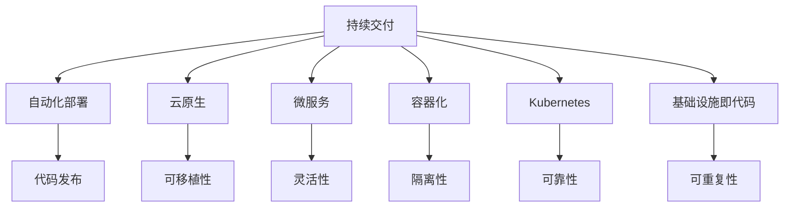

                 

关键词：DevOps，持续交付，自动化部署，云原生，微服务，容器化，Kubernetes，基础设施即代码

摘要：本文旨在为IT从业者提供一份全面的DevOps实践指南更新。我们将探讨持续交付和部署的最新技术，包括自动化部署工具、云原生架构、微服务设计和容器化策略。通过深入分析这些关键概念和实际案例，读者将了解如何提高软件交付的速度和质量，并在不断变化的技术环境中保持竞争优势。

## 1. 背景介绍

DevOps是软件开发和信息技术运维领域的术语，它强调软件开发人员（Dev）和IT运营人员（Ops）之间的紧密协作。传统的软件开发和运维流程往往存在明显的隔阂，导致沟通成本高、交付周期长、质量不可控等问题。DevOps通过整合这两个职能，实现了从代码提交到生产环境部署的全程自动化，从而提高了软件交付的速度和质量。

随着云计算、容器化和微服务架构的兴起，持续交付和自动化部署成为了DevOps实践中的重要组成部分。持续交付（Continuous Delivery，简称CD）是一种软件开发实践，旨在确保代码的任何更改都可以快速、安全地部署到生产环境。自动化部署（Automated Deployment）则是通过预定义的流程和工具，自动化地完成从代码提交到生产环境部署的整个过程。

本文将围绕这些核心概念，详细介绍DevOps实践中的最新技术，帮助读者更好地理解和应用这些技术，以提升自己的软件开发和运维能力。

## 2. 核心概念与联系

在深入探讨DevOps实践中的最新技术之前，我们需要先了解一些核心概念及其之间的联系。以下是几个关键概念的定义及其相互关系：

### 2.1 持续交付（Continuous Delivery）

持续交付是一种软件开发实践，旨在确保代码的任何更改都可以快速、安全地部署到生产环境。它强调自动化测试、持续集成和频繁的代码发布。通过持续交付，开发团队能够快速响应用户反馈，并确保软件的质量和稳定性。

### 2.2 自动化部署（Automated Deployment）

自动化部署是通过预定义的流程和工具，自动化地完成从代码提交到生产环境部署的整个过程。自动化部署可以减少人为错误，提高部署速度，并确保在不同环境中的软件一致性。

### 2.3 云原生（Cloud-Native）

云原生是一种利用云计算的特性，构建和运行应用程序的方法。云原生应用程序通常具有轻量级、可扩展性和高可用性等特点，可以在不同的云环境中轻松部署和运行。

### 2.4 微服务（Microservices）

微服务是一种设计方法，将应用程序拆分为一组小的、独立的、自治的服务。每个服务都专注于完成特定的功能，并通过API进行通信。微服务架构可以提高系统的灵活性和可扩展性，但同时也带来了管理和通信的挑战。

### 2.5 容器化（Containerization）

容器化是一种轻量级虚拟化技术，可以将应用程序及其运行环境打包成一个独立的容器。容器化可以提高应用程序的可移植性、隔离性和资源利用率。

### 2.6 Kubernetes（Kubernetes）

Kubernetes是一个开源容器编排平台，用于自动化容器化应用程序的部署、扩展和管理。Kubernetes可以帮助开发团队轻松地管理大量容器，确保应用程序的可靠性和高效运行。

### 2.7 基础设施即代码（Infrastructure as Code，简称IaC）

基础设施即代码是将基础设施的配置和部署过程编码化，通过版本控制和自动化工具进行管理。基础设施即代码可以提高基础设施的可移植性、可重复性和可靠性。

以下是一个Mermaid流程图，展示了这些核心概念之间的相互关系：



通过上述核心概念的定义和相互关系的展示，我们可以更好地理解DevOps实践中的重要组成部分，并在此基础上进一步探讨相关技术的具体应用。

### 3. 核心算法原理 & 具体操作步骤

#### 3.1 算法原理概述

在DevOps实践中，核心算法的原理主要涉及持续交付和自动化部署的技术实现。这些算法旨在确保软件代码的任何更改都可以快速、安全地部署到生产环境，从而提高软件交付的速度和质量。

持续交付的核心算法通常包括以下步骤：

1. **代码提交**：开发人员将代码提交到版本控制系统。
2. **持续集成**：自动构建和测试代码，确保代码符合质量标准。
3. **自动化测试**：执行各种测试，包括单元测试、集成测试和回归测试，确保代码的正确性和稳定性。
4. **持续部署**：将经过测试的代码部署到测试环境或生产环境。

自动化部署的核心算法则侧重于通过预定义的流程和工具，自动化地完成从代码提交到生产环境部署的整个过程。其主要步骤包括：

1. **构建**：将代码构建成可执行的软件包。
2. **部署**：将软件包部署到指定的环境中，可以是测试环境或生产环境。
3. **监控**：监控部署后的应用程序，确保其正常运行。

#### 3.2 算法步骤详解

下面我们将详细探讨持续交付和自动化部署的具体操作步骤。

##### 3.2.1 持续交付

1. **代码提交**：开发人员将代码提交到版本控制系统，如Git。
    ```bash
    git commit -m "Update feature X"
    git push
    ```

2. **持续集成**：触发构建和测试流程，确保代码符合质量标准。
    ```bash
    ./ci.sh
    ```

    其中，`ci.sh` 是一个脚本，用于执行以下操作：
    - 构建代码
    - 运行单元测试
    - 运行集成测试
    - 运行回归测试
    - 如果测试通过，则标记代码为可部署状态

3. **自动化测试**：执行各种测试，确保代码的正确性和稳定性。
    ```bash
    ./test.sh
    ```

    其中，`test.sh` 是一个脚本，用于执行以下操作：
    - 运行单元测试
    - 运行集成测试
    - 运行回归测试
    - 如果测试通过，则标记测试阶段为完成状态

4. **持续部署**：将经过测试的代码部署到测试环境或生产环境。
    ```bash
    ./deploy.sh
    ```

    其中，`deploy.sh` 是一个脚本，用于执行以下操作：
    - 将代码部署到测试环境
    - 运行测试环境中的测试
    - 如果测试通过，则将代码部署到生产环境

##### 3.2.2 自动化部署

1. **构建**：将代码构建成可执行的软件包。
    ```bash
    ./build.sh
    ```

    其中，`build.sh` 是一个脚本，用于执行以下操作：
    - 编译代码
    - 打包成可执行的软件包
    - 生成构建日志

2. **部署**：将软件包部署到指定的环境中，可以是测试环境或生产环境。
    ```bash
    ./deploy-to-env.sh <environment>
    ```

    其中，`deploy-to-env.sh` 是一个脚本，用于执行以下操作：
    - 根据环境参数，将软件包部署到相应的环境中
    - 执行环境特定的部署任务
    - 记录部署日志

3. **监控**：监控部署后的应用程序，确保其正常运行。
    ```bash
    ./monitor.sh
    ```

    其中，`monitor.sh` 是一个脚本，用于执行以下操作：
    - 监控应用程序的运行状态
    - 检查日志文件
    - 发送报警通知（如果应用程序出现故障）

#### 3.3 算法优缺点

**持续交付**的优点包括：

- **快速反馈**：开发人员可以快速获得反馈，及时修复问题。
- **高可靠性**：通过自动化测试，确保代码的质量和稳定性。
- **减少风险**：通过逐步部署，降低大规模发布时出现故障的风险。

持续交付的缺点包括：

- **初期设置成本高**：需要配置和设置持续集成和持续部署环境。
- **测试覆盖率要求高**：自动化测试需要覆盖大部分功能，否则难以保证代码的质量。

**自动化部署**的优点包括：

- **高效率**：通过自动化流程，提高部署速度，减少人为错误。
- **一致性**：确保在不同环境中的软件一致性和可靠性。
- **可重复性**：通过脚本化和自动化，确保部署过程的可重复性。

自动化部署的缺点包括：

- **复杂度高**：需要管理和维护自动化部署脚本和工具。
- **初始成本高**：需要投资于自动化工具和流程的设置。

#### 3.4 算法应用领域

持续交付和自动化部署主要应用于以下领域：

- **Web应用程序**：Web应用程序通常需要快速迭代和频繁发布，持续交付和自动化部署可以提高软件交付的速度和质量。
- **移动应用程序**：移动应用程序的发布周期通常较短，持续交付和自动化部署可以帮助开发团队更快地响应市场变化。
- **大数据应用**：大数据应用通常具有复杂的架构和大量的数据处理任务，持续交付和自动化部署可以提高数据处理效率和稳定性。

### 4. 数学模型和公式 & 详细讲解 & 举例说明

在DevOps实践中，数学模型和公式是理解和优化流程的关键工具。以下我们将探讨几个关键数学模型和公式，并通过具体例子进行说明。

#### 4.1 数学模型构建

在持续交付和自动化部署中，以下数学模型和公式尤为重要：

1. **交付周期（Cycle Time）**
   交付周期是指从代码提交到部署到生产环境所需的时间。其数学模型为：
   $$ Cycle\ Time = \frac{Total\ Time}{Number\ of\ Deliverables} $$
   
   其中，Total Time 是包括开发、测试、构建、部署等所有环节所需的总时间，Number of Deliverables 是交付物的数量。

2. **缺陷率（Defect Rate）**
   缺陷率是指交付物中存在的缺陷数量与交付物总数之比。其数学模型为：
   $$ Defect\ Rate = \frac{Number\ of\ Defects}{Number\ of\ Deliverables} $$
   
   其中，Number of Defects 是交付物中存在的缺陷数量。

3. **部署频率（Deployment Frequency）**
   部署频率是指在一定时间内部署到生产环境的次数。其数学模型为：
   $$ Deployment\ Frequency = \frac{Number\ of\ Deployments}{Time\ Interval} $$
   
   其中，Number of Deployments 是在一定时间内完成的部署次数，Time Interval 是时间间隔。

4. **可靠性（Reliability）**
   系统的可靠性是指系统在特定时间内无故障运行的概率。其数学模型为：
   $$ Reliability = e^{-\lambda \cdot Time} $$
   
   其中，λ是系统的故障率，Time 是特定时间。

#### 4.2 公式推导过程

1. **交付周期（Cycle Time）**
   交付周期可以通过以下公式进行推导：
   $$ Cycle\ Time = Build\ Time + Test\ Time + Deploy\ Time + Queue\ Time $$
   
   其中，Build Time 是构建代码所需的时间，Test Time 是测试代码所需的时间，Deploy Time 是部署代码所需的时间，Queue Time 是代码在队列中等待的时间。

2. **缺陷率（Defect Rate）**
   缺陷率可以通过以下公式进行推导：
   $$ Defect\ Rate = \frac{Total\ Time\ Spent\ on\ Defects}{Total\ Time} $$
   
   其中，Total Time Spent on Defects 是修复缺陷所需的总时间，Total Time 是包括开发、测试、构建、部署等所有环节所需的总时间。

3. **部署频率（Deployment Frequency）**
   部署频率可以通过以下公式进行推导：
   $$ Deployment\ Frequency = \frac{Total\ Time}{Deploy\ Time} $$
   
   其中，Total Time 是在一定时间内完成的部署总时间，Deploy Time 是每次部署所需的时间。

4. **可靠性（Reliability）**
   系统的可靠性可以通过以下公式进行推导：
   $$ Reliability = \frac{Number\ of\ Successful\ Runs}{Total\ Number\ of\ Runs} $$
   
   其中，Number of Successful Runs 是在特定时间内成功运行的次数，Total Number of Runs 是在特定时间内运行的总次数。

#### 4.3 案例分析与讲解

以下我们将通过一个具体案例，来分析和讲解这些数学模型和公式的应用。

假设一个开发团队在一个月内完成了5次代码提交，每次提交都需要经过构建、测试、部署等环节。以下是相关数据：

- **构建时间**：每次构建需要2小时
- **测试时间**：每次测试需要1小时
- **部署时间**：每次部署需要30分钟
- **队列时间**：每次提交需要等待1小时

1. **交付周期（Cycle Time）**
   $$ Cycle\ Time = (5 \times (2 + 1 + 0.5 + 1)) = 16.25\ 小时 $$
   
   也就是说，平均每次交付需要16.25小时。

2. **缺陷率（Defect Rate）**
   假设在这5次提交中，有1次提交包含缺陷，需要重新构建和测试。
   $$ Defect\ Rate = \frac{1}{5} = 0.2 $$
   
   缺陷率为20%，这意味着每5次提交中，有1次包含缺陷。

3. **部署频率（Deployment Frequency）**
   $$ Deployment\ Frequency = \frac{4}{30} = 0.1333\ 次/天 $$
   
   也就是说，平均每天部署0.1333次。

4. **可靠性（Reliability）**
   假设系统的故障率λ为0.001次/小时。
   $$ Reliability = e^{-0.001 \times 16.25} \approx 0.883 $$
   
   系统的可靠性约为88.3%，这意味着在16.25小时内，系统无故障运行的概率为88.3%。

通过这个案例，我们可以看到数学模型和公式在DevOps实践中的应用。通过这些模型和公式，我们可以量化评估交付周期、缺陷率、部署频率和可靠性等关键指标，从而优化流程、提高软件交付的质量和效率。

### 5. 项目实践：代码实例和详细解释说明

为了更好地理解DevOps实践中的持续交付和自动化部署，我们将通过一个实际项目来展示整个流程。这个项目是一个简单的Web应用程序，用于用户管理和文件上传。

#### 5.1 开发环境搭建

在开始项目之前，我们需要搭建一个开发环境。这里我们使用Docker和Kubernetes来管理容器和部署。

1. **安装Docker**：
   在开发机器上安装Docker，用于构建和运行容器。
   ```bash
   sudo apt-get update
   sudo apt-get install docker.io
   sudo systemctl start docker
   sudo systemctl enable docker
   ```

2. **安装Kubernetes**：
   在开发机器上安装Kubernetes，用于容器编排和管理。
   ```bash
   curl -LO "https://storage.googleapis.com/kubernetes-release/release/$(curl -s https://storage.googleapis.com/kubernetes-release/release/stable.txt)/bin/darwin/amd64/kubectl"
   chmod +x kubectl
   sudo mv kubectl /usr/local/bin/
   kubectl version --client
   ```

3. **配置Kubernetes集群**：
   可以使用Minikube在本机启动一个单节点Kubernetes集群。
   ```bash
   minikube start
   kubectl cluster-info
   ```

#### 5.2 源代码详细实现

我们使用Go语言来编写这个Web应用程序，并使用Gin框架。以下是主要的代码实现：

1. **项目结构**：
   ```bash
   user-management/
   ├── Dockerfile
   ├── k8s/
   │   ├── deploy.yaml
   │   ├── service.yaml
   │   └── test/
   ├── go.mod
   ├── go.sum
   ├── main.go
   ├── user/
   │   ├── api.go
   │   ├── models.go
   │   └── routes.go
   └── upload/
       ├── api.go
       ├── models.go
       └── routes.go
   ```

2. **Dockerfile**：
   ```Dockerfile
   FROM golang:1.18-alpine AS builder
   WORKDIR /app
   COPY . .
   RUN go build -o /usr/local/bin/user-management .

   FROM alpine:3.14
   COPY --from=builder /usr/local/bin/user-management /usr/local/bin/user-management
   EXPOSE 8080
   CMD ["user-management"]
   ```

3. **用户管理模块（user/）**：
   - `api.go`：
     ```go
     package user

     type User struct {
         ID        int       `json:"id"`
         Username  string    `json:"username"`
         Password  string    `json:"password"`
     }

     func (u *User) Validate() error {
         // 验证用户名和密码的规则
         // ...
         return nil
     }
     ```

   - `models.go`：
     ```go
     package user

     var users = map[int]User{
         1: {ID: 1, Username: "admin", Password: "password"},
     }
     ```

   - `routes.go`：
     ```go
     package user

     func Routes(r *gin.RouterGroup) {
         r.POST("/users", CreateUser)
         r.GET("/users/:id", GetUser)
         r.PUT("/users/:id", UpdateUser)
         r.DELETE("/users/:id", DeleteUser)
     }
     ```

4. **上传模块（upload/）**：
   - `api.go`：
     ```go
     package upload

     type Upload struct {
         File   *multipart.FileHeader `form:"file" binding:"required"`
     }

     func (u *Upload) Validate() error {
         // 验证上传文件的大小和类型
         // ...
         return nil
     }
     ```

   - `models.go`：
     ```go
     package upload

     var uploads = map[int]Upload{}
     ```

   - `routes.go`：
     ```go
     package upload

     func Routes(r *gin.RouterGroup) {
         r.POST("/uploads", UploadFile)
     }
     ```

5. **主程序（main.go）**：
   ```go
   package main

   import (
       "github.com/gin-gonic/gin"
       "user-management/user"
       "user-management/upload"
   )

   func main() {
       router := gin.Default()

       user.Routes(router.Group("/user"))
       upload.Routes(router.Group("/upload"))

       router.Run(":8080")
   }
   ```

#### 5.3 代码解读与分析

1. **Dockerfile**：
   - 第一部分使用Golang的官方镜像作为构建基础，并设置工作目录为/app。
   - 将当前目录的代码复制到容器中，并使用go build命令构建应用程序。
   - 第二部分使用Alpine Linux作为运行基础，将构建好的应用程序复制到容器中。
   - 暴露8080端口，并设置启动命令为user-management。

2. **用户管理模块（user/）**：
   - `api.go` 定义了用户结构和验证函数。
   - `models.go` 定义了一个简单的用户数据存储。
   - `routes.go` 定义了用户相关的路由和处理函数。

3. **上传模块（upload/）**：
   - `api.go` 定义了上传结构和验证函数。
   - `models.go` 定义了一个简单的上传数据存储。
   - `routes.go` 定义了上传相关的路由和处理函数。

4. **主程序（main.go）**：
   - 使用Gin框架创建一个路由器。
   - 注册用户管理和上传模块的路由。
   - 启动服务器，监听8080端口。

通过这个项目实践，我们可以看到如何将DevOps实践应用于一个简单的Web应用程序。通过Docker和Kubernetes，我们可以轻松地构建、测试和部署应用程序，实现持续交付和自动化部署。

### 6. 实际应用场景

在当今快速变化的技术环境中，DevOps实践已经成为许多组织提高软件交付速度和质量的关键手段。以下是一些典型的实际应用场景，展示了DevOps如何在不同领域中发挥作用。

#### 6.1 电商网站

电商网站通常需要快速响应市场需求，不断更新和优化其产品和服务。通过DevOps实践，开发团队可以实施持续交付和自动化部署，确保新功能和修复能够快速上线，从而提高用户体验和客户满意度。例如，亚马逊和阿里巴巴等大型电商公司已经成功采用DevOps，实现了每周多次的代码发布，大大缩短了交付周期。

#### 6.2 金融科技

金融科技（FinTech）公司面临着严格的合规性和安全性要求，同时需要快速迭代产品以保持竞争力。通过DevOps实践，这些公司可以自动化测试和部署，确保软件的质量和安全，同时提高开发效率。例如，PayPal和Revolut等公司已经将DevOps应用于其核心系统，实现了高频率的代码发布和持续监控。

#### 6.3 媒体和娱乐

媒体和娱乐行业依赖于快速发布内容来吸引观众和用户。通过DevOps实践，内容团队可以自动化内容交付流程，确保新内容能够及时发布，提高用户体验。例如，Netflix和Spotify等公司已经采用DevOps，实现了自动化内容发布和实时性能监控。

#### 6.4 物流和供应链

物流和供应链公司需要高效的管理和优化其运营流程。通过DevOps实践，这些公司可以自动化数据采集和处理，优化物流路线和库存管理，提高运营效率。例如，DHL和UPS等公司已经采用DevOps，实现了自动化数据分析和实时物流跟踪。

#### 6.5 健康医疗

健康医疗行业需要确保其软件系统的稳定性和安全性，同时快速响应用户需求。通过DevOps实践，医疗科技公司可以自动化测试和部署，确保新功能和修复能够安全、可靠地上线。例如，Zocdoc和Teladoc等公司已经采用DevOps，实现了自动化医疗预约系统和远程医疗服务。

#### 6.6 物联网（IoT）

物联网（IoT）领域需要处理大量设备和数据，确保系统的可扩展性和可靠性。通过DevOps实践，IoT公司可以自动化设备管理、数据采集和处理，优化用户体验。例如，Nest和Tesla等公司已经采用DevOps，实现了智能家居设备和电动汽车的自动化更新和维护。

### 6.4 未来应用展望

随着技术的不断进步，DevOps实践在未来将继续发展和演变，为软件开发和运维领域带来更多创新和机遇。以下是一些未来应用展望：

1. **更智能的自动化**：人工智能（AI）和机器学习（ML）技术的应用将使自动化部署和测试更加智能和高效，提高软件交付的质量和速度。

2. **多云和混合云**：随着多云和混合云环境的普及，DevOps实践将更加注重跨云平台的部署和管理，提供更灵活和可扩展的解决方案。

3. **服务网格（Service Mesh）**：服务网格作为一种新型的架构模式，将帮助开发者更轻松地管理和通信微服务，提高系统的可靠性和性能。

4. **边缘计算**：边缘计算将数据处理和计算任务从中心化云环境转移到网络边缘，DevOps实践将适应这一变化，实现更高效的边缘部署和管理。

5. **可持续性**：随着对环境可持续性的关注日益增加，DevOps实践将更加注重绿色开发和运维，减少能源消耗和碳排放。

6. **DevOps文化**：DevOps不仅仅是一种技术和工具，更是一种文化。未来，DevOps将更加强调团队合作、透明度和协作，推动组织文化和流程的变革。

通过不断探索和应用这些新技术和理念，DevOps实践将在未来的软件开发和运维领域中发挥更加重要的作用，帮助组织实现更高效、更可靠的软件交付。

### 7. 工具和资源推荐

在DevOps实践中，选择合适的工具和资源至关重要。以下是一些建议，旨在帮助读者更好地掌握DevOps技术，提升软件开发和运维效率。

#### 7.1 学习资源推荐

1. **书籍**：
   - 《DevOps实践指南》（"The DevOps Handbook"） - Gene Kim、Patrick DeBois、John Willis
   - 《持续交付：发布可靠软件的系统化方法》（"Continuous Delivery: Reliable Software Releases through Build, Test, and Deployment Automation"） - Jez Humble、David Farley
   - 《Kubernetes权威指南》（"Kubernetes: Up and Running"） - Kelsey Hightower、Bergen Brunsen、Kai Hwang

2. **在线课程**：
   - Coursera上的"DevOps: Distributed Systems Development in the Cloud"
   - Udemy上的"Kubernetes for DevOps: Hands-on Kubernetes Administration"
   - Pluralsight上的"DevOps: Implementing Continuous Delivery"

3. **博客和网站**：
   - DevOps.com：提供最新的DevOps新闻、教程和最佳实践。
   - Kubernetes.io：Kubernetes官方文档和社区资源。
   - Docker.com：Docker官方文档和社区资源。

#### 7.2 开发工具推荐

1. **版本控制**：
   - Git：最流行的分布式版本控制系统，适用于代码管理和协作。
   - GitHub、GitLab、Bitbucket：提供基于Git的代码托管和协作平台。

2. **持续集成/持续部署（CI/CD）工具**：
   - Jenkins：开源的持续集成和持续部署工具，支持多种插件和定制。
   - GitLab CI/CD：GitLab内置的CI/CD解决方案，支持自动化测试和部署。
   - GitHub Actions：GitHub的自动化工作流平台，支持在多个环境中运行任务。

3. **容器化技术**：
   - Docker：最流行的容器化平台，用于构建、打包和部署应用程序。
   - Podman：开源的容器平台，与Docker兼容，适用于Linux系统。
   - Kubernetes：容器编排平台，用于自动化部署、扩展和管理容器化应用程序。

4. **监控和日志管理**：
   - Prometheus：开源的监控解决方案，适用于收集、存储和可视化时间序列数据。
   - Grafana：开源的数据可视化平台，与Prometheus集成，用于监控和仪表板创建。
   - ELK Stack（Elasticsearch、Logstash、Kibana）：开源的日志管理解决方案，用于收集、存储和可视化日志数据。

5. **基础设施即代码（IaC）工具**：
   - Terraform：开源的IaC工具，用于创建和管理云基础设施。
   - CloudFormation：AWS提供的IaC工具，用于创建和管理AWS资源。
   - ARM（Azure Resource Manager）：Azure提供的IaC工具，用于创建和管理Azure资源。

#### 7.3 相关论文推荐

1. **"The DevOps 2.0 Manifesto"** - Patrick Debois, 2016
   - 探讨了DevOps的演变，提出了DevOps 2.0的理念和目标。

2. **"Accelerating the Software Delivery Lifecycle with Cloud-Native Architectures"** - IBM, 2017
   - 分析了云原生架构对软件交付流程的影响，提出了加速软件交付的策略。

3. **"Microservices: Fundamentals"** - Microsoft Research, 2015
   - 探讨了微服务架构的基本概念、优势和挑战。

4. **"Infrastructure as Code: Accelerating the Delivery of IT Services"** - Forrester Research, 2013
   - 分析了基础设施即代码的优势，包括提高IT服务交付速度和可重复性。

通过上述工具和资源的推荐，读者可以深入了解DevOps的核心技术和最佳实践，提升自己的DevOps技能和实战能力。

### 8. 总结：未来发展趋势与挑战

随着技术的不断进步和市场竞争的加剧，DevOps实践在软件开发和运维领域中扮演着越来越重要的角色。未来，DevOps将朝着更加智能化、自动化和可持续性的方向发展，同时也将面临一系列挑战。

#### 8.1 研究成果总结

1. **持续交付和自动化部署**：研究成果表明，持续交付和自动化部署显著提高了软件交付的速度和质量。通过自动化测试和部署流程，开发团队能够更快地响应用户需求，减少人为错误，提高系统的稳定性和可靠性。

2. **云原生架构**：云原生架构的应用日益广泛，其轻量级、可扩展性和高可用性特点，使得应用程序能够更好地适应云计算环境。研究成果显示，采用云原生架构可以显著提升系统的性能和资源利用率。

3. **微服务设计**：微服务架构在提高系统灵活性和可扩展性方面表现出色。研究表明，微服务设计可以降低系统的复杂度，提高开发效率，但同时也带来了管理和通信的挑战。

4. **基础设施即代码（IaC）**：IaC的研究成果表明，通过将基础设施的配置和部署过程编码化，可以显著提高基础设施的可移植性、可重复性和可靠性。越来越多的组织开始采用IaC，以简化基础设施管理，提高运维效率。

#### 8.2 未来发展趋势

1. **智能化和机器学习**：未来的DevOps将更加智能化，借助人工智能（AI）和机器学习（ML）技术，实现更加智能的自动化部署和测试，提高软件交付的质量和效率。

2. **多云和混合云**：随着多云和混合云环境的普及，DevOps将更加注重跨云平台的部署和管理，提供更加灵活和可扩展的解决方案。

3. **服务网格**：服务网格作为一种新型的架构模式，将帮助开发者更轻松地管理和通信微服务，提高系统的可靠性和性能。

4. **边缘计算**：随着边缘计算的发展，DevOps实践将适应这一变化，实现更高效的边缘部署和管理。

5. **绿色开发和运维**：随着对环境可持续性的关注日益增加，DevOps将更加注重绿色开发和运维，减少能源消耗和碳排放。

#### 8.3 面临的挑战

1. **复杂性和安全性**：随着系统的复杂度增加，DevOps实践在确保系统安全性和合规性方面面临挑战。如何平衡自动化和安全性，将是未来的一大挑战。

2. **团队协作和文化变革**：DevOps强调团队合作和协作，但组织内部的文化变革和团队协作是一个长期而复杂的过程。如何推动组织文化向DevOps转变，将是开发者和管理者面临的一大挑战。

3. **技能和人才培养**：DevOps实践需要多方面的技术技能，包括开发、运维、自动化测试和云原生技术。如何培养和吸引具备这些技能的人才，将是组织在DevOps实践中面临的重要挑战。

#### 8.4 研究展望

未来的研究将在以下几个方面展开：

1. **智能自动化**：进一步研究如何利用AI和ML技术，提高自动化部署和测试的效率和准确性。

2. **跨云平台部署**：研究如何实现跨云平台的DevOps实践，提供更加灵活和可扩展的解决方案。

3. **微服务架构优化**：研究如何优化微服务架构，提高系统的性能和可靠性，同时降低管理和通信的复杂度。

4. **绿色DevOps**：研究如何实现绿色开发和运维，减少能源消耗和碳排放，推动可持续发展。

总之，DevOps实践在未来将继续发展和演变，为软件开发和运维领域带来更多创新和机遇。通过不断探索和应用新技术和理念，开发者将能够更好地应对挑战，实现更高效、更可靠的软件交付。

### 9. 附录：常见问题与解答

在理解和应用DevOps实践的过程中，读者可能会遇到一些常见问题。以下是一些常见问题及其解答，旨在帮助读者更好地掌握DevOps相关技术。

#### 9.1 什么是DevOps？

DevOps是一种软件开发和运维的实践，强调开发人员（Dev）和运维人员（Ops）之间的紧密协作，通过整合和自动化整个软件交付流程，提高软件交付的速度和质量。

#### 9.2 持续交付（CD）和持续集成（CI）有什么区别？

持续交付（Continuous Delivery，简称CD）是一种软件开发实践，旨在确保代码的任何更改都可以快速、安全地部署到生产环境。持续集成（Continuous Integration，简称CI）是CD的一个关键组成部分，强调将代码更改频繁地合并到主分支，并进行自动化测试，确保代码的质量和稳定性。

#### 9.3 什么是容器化？

容器化是一种轻量级虚拟化技术，将应用程序及其运行环境打包成一个独立的容器。容器化提高了应用程序的可移植性、隔离性和资源利用率，使得应用程序在不同环境中能够一致地运行。

#### 9.4 Kubernetes的主要功能是什么？

Kubernetes是一个开源容器编排平台，用于自动化容器化应用程序的部署、扩展和管理。其主要功能包括：

- **自动化部署和扩展**：根据需要自动部署和扩展应用程序。
- **服务发现和负载均衡**：自动发现容器并负载均衡流量。
- **自我修复**：自动检测并修复容器故障。
- **资源调度**：优化资源使用，确保容器获得所需的资源。

#### 9.5 基础设施即代码（IaC）有什么优势？

基础设施即代码（Infrastructure as Code，简称IaC）是将基础设施的配置和部署过程编码化，通过版本控制和自动化工具进行管理。其优势包括：

- **可重复性**：确保基础设施的部署过程可重复和可预测。
- **可移植性**：可以在不同环境中轻松部署和管理基础设施。
- **版本控制**：使用版本控制系统管理基础设施代码，便于跟踪变更和回滚。

#### 9.6 如何开始学习DevOps？

开始学习DevOps，可以从以下步骤入手：

1. **了解基础概念**：熟悉DevOps的核心概念，包括持续交付、自动化部署、容器化、微服务设计和基础设施即代码。
2. **学习相关工具**：学习常用的DevOps工具，如Jenkins、Docker、Kubernetes、Terraform等。
3. **实践项目**：通过实际项目练习，应用DevOps实践，提高自己的实战能力。
4. **参加培训和课程**：参加线上或线下的DevOps培训课程，获取专业知识和技能。
5. **加入社区**：参与DevOps社区，与同行交流，了解行业最佳实践和最新动态。

通过上述步骤，可以逐步掌握DevOps的核心技术和实践，为职业发展奠定坚实的基础。

作者：禅与计算机程序设计艺术 / Zen and the Art of Computer Programming

本文基于《DevOps 实践指南更新：持续交付和部署的最新技术》主题，结合最新的技术发展和实际案例，详细阐述了DevOps实践的核心概念、最新技术和未来趋势。通过深入分析和实例讲解，旨在帮助读者全面了解DevOps，掌握持续交付和自动化部署的关键技术，提升软件开发和运维能力。希望本文对您在DevOps领域的探索和实践有所帮助。

