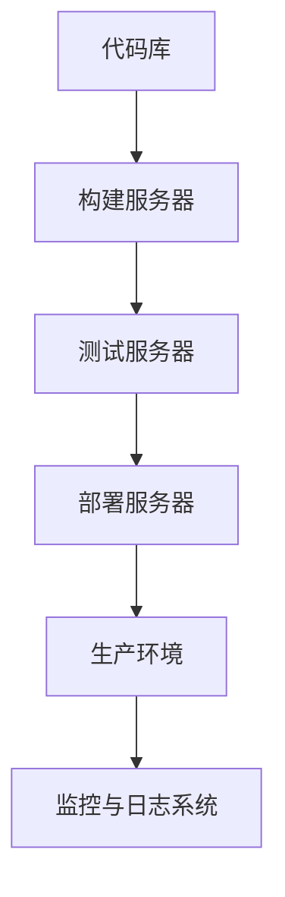

                 

关键词：DevOps、持续集成（CI）、持续部署（CD）、最佳实践、自动化、软件交付、敏捷开发。

> 摘要：本文将深入探讨DevOps文化的核心组成部分——持续集成与持续部署（CI/CD），并提供一系列最佳实践，帮助读者实现高效的软件交付流程。

## 1. 背景介绍

DevOps是软件开发（Development）与信息技术运营（Operations）相结合的一种新兴文化、策略和实践。其核心理念是通过协作、沟通和整合，提高软件开发的效率和质量，实现快速且可靠的软件交付。在DevOps文化中，持续集成（Continuous Integration，CI）和持续部署（Continuous Deployment，CD）是两大关键技术支柱。

持续集成强调开发人员定期将代码提交到共享的代码库中，并自动执行一系列构建和测试任务。这样不仅可以快速发现和解决代码冲突，还能确保代码库中的每个提交都是可构建和可测试的。持续部署则通过自动化部署流程，将代码从开发环境顺利地推向生产环境，实现快速、可靠和无缝的软件交付。

## 2. 核心概念与联系

### 2.1 DevOps与CI/CD的关系

DevOps文化的核心是提高软件交付的速度和质量，而CI/CD则是实现这一目标的关键手段。在DevOps体系中，CI/CD不仅是技术工具，更是一种文化理念的体现。它要求开发、测试、运维等各个团队紧密协作，共同推动软件交付的自动化和高效化。

### 2.2 CI/CD的架构

CI/CD的架构通常包括以下几个关键组件：

- **代码库**：存储和管理源代码的基础设施。
- **构建服务器**：执行自动化构建任务，如编译、打包、安装等。
- **测试服务器**：运行自动化测试套件，验证代码的质量和功能。
- **部署服务器**：将构建好的代码部署到不同的环境中，如开发、测试、生产等。
- **监控与日志系统**：实时监控系统的运行状态，记录日志信息，便于问题追踪和分析。

### 2.3 Mermaid流程图



## 3. 核心算法原理 & 具体操作步骤

### 3.1 算法原理概述

持续集成和持续部署的核心在于自动化。通过自动化工具和流程，实现代码的快速构建、测试和部署。核心算法包括：

- **构建算法**：将源代码转换为可执行程序或可部署的包。
- **测试算法**：自动执行一系列测试用例，验证代码的功能和性能。
- **部署算法**：根据环境配置，将构建好的代码部署到目标服务器。

### 3.2 算法步骤详解

#### 3.2.1 持续集成

1. **代码提交**：开发人员将代码提交到代码库。
2. **构建任务**：构建服务器接收提交的代码，开始构建过程。
3. **测试任务**：测试服务器接收构建结果，开始执行测试套件。
4. **反馈**：测试结果反馈给开发人员，及时发现问题。

#### 3.2.2 持续部署

1. **构建与测试**：同持续集成。
2. **部署策略**：根据部署策略，将代码部署到目标环境。
3. **监控**：监控系统实时监控部署后的系统运行状态。

### 3.3 算法优缺点

#### 3.3.1 优点

- **提高交付速度**：自动化流程减少手动操作，加快软件交付速度。
- **确保代码质量**：自动化测试发现和解决代码问题，提高代码质量。
- **降低风险**：及时发现和解决潜在问题，降低软件发布风险。

#### 3.3.2 缺点

- **初期投入较大**：自动化流程需要前期投入较多的人力、物力和时间。
- **维护成本高**：持续集成和部署系统需要定期维护和更新。

### 3.4 算法应用领域

持续集成和持续部署广泛应用于互联网、金融、医疗、教育等行业。特别是在敏捷开发模式下，CI/CD能够显著提高团队的工作效率和软件质量。

## 4. 数学模型和公式 & 详细讲解 & 举例说明

### 4.1 数学模型构建

在CI/CD中，一个重要的数学模型是构建时间的预估模型。该模型可以用来预测每次代码提交后的构建时间，从而优化资源的分配。

$$
T_c = T_p + \alpha \cdot T_s
$$

其中，$T_c$表示构建时间，$T_p$表示预处理时间（如代码下载、编译配置等），$T_s$表示测试时间，$\alpha$表示预处理与测试时间之比。

### 4.2 公式推导过程

构建时间主要由预处理时间和测试时间决定。预处理时间通常包括代码下载、编译配置等步骤，而测试时间取决于测试用例的数量和执行速度。因此，构建时间可以表示为预处理时间和测试时间的和，并通过$\alpha$来调整两者之间的比例。

### 4.3 案例分析与讲解

假设一个项目的预处理时间为5分钟，测试用例数量为10个，每个测试用例平均执行时间为1分钟。根据上述模型，构建时间可以计算如下：

$$
T_c = 5 + \alpha \cdot 10
$$

如果$\alpha = 0.5$，则构建时间为15分钟。这意味着每次代码提交后的构建和测试时间大约为15分钟，可以较为合理地预估和分配资源。

## 5. 项目实践：代码实例和详细解释说明

### 5.1 开发环境搭建

在开始实践之前，我们需要搭建一个基础的持续集成与持续部署环境。这里以Jenkins为例，介绍开发环境的搭建步骤。

1. 安装Jenkins：在服务器上安装Jenkins，并启动Jenkins服务。
2. 配置代码库：在Jenkins中配置Git或SVN代码库，确保Jenkins可以访问代码库中的代码。
3. 配置构建脚本：编写构建脚本，实现代码的编译、测试和部署。

### 5.2 源代码详细实现

以下是一个简单的Jenkinsfile，用于实现持续集成和持续部署：

```groovy
pipeline {
    agent any

    stages {
        stage('Build') {
            steps {
                echo 'Building the project...'
                sh 'mvn clean install'
            }
        }
        stage('Test') {
            steps {
                echo 'Testing the project...'
                sh 'mvn test'
            }
        }
        stage('Deploy') {
            steps {
                echo 'Deploying the project...'
                sh 'java -jar target/myapp.jar'
            }
        }
    }
    post {
        always {
            echo 'Build finished...'
        }
    }
}
```

### 5.3 代码解读与分析

该Jenkinsfile定义了一个简单的流水线，包括三个阶段：Build、Test和Deploy。在每个阶段，都执行相应的步骤。最后，无论构建成功与否，都会输出一个结束信息。

### 5.4 运行结果展示

运行该Jenkinsfile后，可以在Jenkins界面上看到构建过程的结果，包括构建日志、测试结果和部署状态。如果构建失败，还可以查看具体的错误信息，便于问题定位和解决。

## 6. 实际应用场景

### 6.1 项目管理

在敏捷开发模式下，持续集成和持续部署有助于实现快速迭代和频繁发布。通过自动化流程，项目团队可以更加专注于开发新功能和改进代码质量。

### 6.2 安全性保障

持续集成和持续部署过程中的自动化测试和持续监控，有助于及时发现和解决安全问题，降低软件发布过程中的风险。

### 6.3 质量保证

通过持续集成和持续部署，可以确保每次发布的代码都是可构建、可测试和可部署的，从而提高软件质量。

### 6.4 未来应用展望

随着人工智能和机器学习技术的发展，持续集成和持续部署将变得更加智能化和自动化。未来，CI/CD系统将更好地支持多语言、多平台和多云环境的构建和部署，为软件交付提供更加高效和可靠的支持。

## 7. 工具和资源推荐

### 7.1 学习资源推荐

- 《DevOps Handbook》
- 《Continuous Integration: Elapsed Time Estimation of Continuous Integration Cycles》

### 7.2 开发工具推荐

- Jenkins
- GitLab CI/CD
- GitHub Actions

### 7.3 相关论文推荐

- "Continuous Integration in the Age of Agile"
- "Automation and the Future of Software Engineering"

## 8. 总结：未来发展趋势与挑战

### 8.1 研究成果总结

本文对持续集成与持续部署（CI/CD）的核心概念、算法原理、实践案例和未来发展趋势进行了深入探讨。研究表明，CI/CD在提高软件开发效率和质量方面具有显著优势。

### 8.2 未来发展趋势

随着技术的发展，CI/CD将更加智能化、自动化和多样化。未来，CI/CD系统将更好地支持多语言、多平台和多云环境，实现更高效和可靠的软件交付。

### 8.3 面临的挑战

尽管CI/CD具有巨大潜力，但实际应用中仍面临一些挑战，如初期投入较大、维护成本高、跨团队协作等。未来需要进一步研究和解决这些问题。

### 8.4 研究展望

持续集成与持续部署仍有许多领域值得探索，如智能化CI/CD、安全性与合规性、多云环境的CI/CD等。未来研究将致力于解决这些挑战，推动CI/CD技术的不断进步。

## 9. 附录：常见问题与解答

### 9.1 Q：持续集成和持续部署的区别是什么？

A：持续集成（CI）是指在软件开发过程中，开发人员定期将代码提交到共享代码库，并自动执行构建和测试任务。而持续部署（CD）则是在CI的基础上，将构建好的代码自动部署到生产环境。

### 9.2 Q：如何实现持续集成和持续部署的自动化？

A：实现持续集成和持续部署的自动化，可以通过以下步骤：

1. 选择合适的CI/CD工具，如Jenkins、GitLab CI/CD、GitHub Actions等。
2. 编写Jenkinsfile或相关配置文件，定义构建、测试和部署流程。
3. 在服务器上安装和配置CI/CD工具，确保其可以自动执行构建和部署任务。

### 9.3 Q：持续集成和持续部署的安全性如何保障？

A：持续集成和持续部署的安全性可以从以下几个方面进行保障：

1. 隔离测试环境：确保测试环境与生产环境隔离，防止测试代码影响生产系统。
2. 自动化测试：通过自动化测试，及时发现和解决安全问题。
3. 安全审计：定期对CI/CD流程进行安全审计，确保流程符合安全标准和法规要求。

作者：禅与计算机程序设计艺术 / Zen and the Art of Computer Programming
----------------------------------------------------------------

