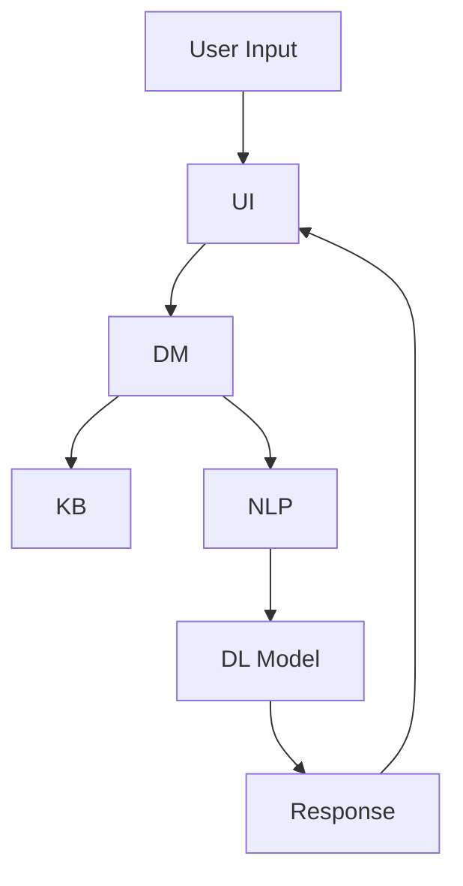

                 

关键词：Elmo Chat，贾扬清，市场洞察，用户体验，插件，深度学习，自然语言处理，聊天机器人，技术博客

> 摘要：本文将深入探讨贾扬清团队开发的Elmo Chat插件，该插件旨在通过市场洞察和先进技术提升用户体验。文章首先介绍了Elmo Chat的背景和核心功能，随后分析了其技术实现，并通过实例展示了实际应用效果。文章还展望了Elmo Chat的未来发展，并提出了相关工具和资源的推荐。

## 1. 背景介绍

随着人工智能技术的快速发展，聊天机器人已成为企业与用户互动的重要工具。然而，现有的聊天机器人往往存在交互体验差、响应速度慢等问题。为了解决这些问题，贾扬清团队开发了Elmo Chat插件，旨在通过市场洞察和先进技术提升用户体验。

Elmo Chat是一款基于深度学习和自然语言处理技术的聊天机器人插件。它不仅能够快速理解用户的意图，还能根据上下文进行流畅的对话。该插件的核心目标是提供一种更加智能、自然的交互方式，使聊天机器人更好地服务于企业用户。

## 2. 核心概念与联系

### 2.1 深度学习与自然语言处理

深度学习是人工智能领域的一项重要技术，通过模拟人脑神经网络，实现图像、语音、文本等数据的自动识别和分析。自然语言处理（NLP）是深度学习在语言领域的应用，旨在使计算机理解和生成自然语言。

在Elmo Chat中，深度学习和自然语言处理技术被应用于对话系统的构建。具体而言，Elmo Chat采用了基于 Transformer 的预训练模型，如BERT、GPT等，通过对海量文本数据进行预训练，使其具备理解自然语言的能力。

### 2.2 聊天机器人架构

聊天机器人通常由以下几个模块组成：

1. **用户接口（UI）**：与用户进行交互的界面。
2. **对话管理器（DM）**：负责处理对话流程，包括理解用户意图、生成回答等。
3. **知识库**：存储与特定领域相关的知识，用于回答用户的问题。
4. **自然语言处理（NLP）**：对用户输入的文本进行处理，提取关键信息。
5. **深度学习模型**：用于生成回答和执行任务。

在Elmo Chat中，这些模块通过以下方式相互协作：

- **用户接口（UI）**：接收用户输入，并将其传递给对话管理器。
- **对话管理器（DM）**：解析用户意图，调用知识库和NLP模块，生成回答。
- **知识库**：为对话管理器提供领域知识，帮助其更好地理解用户意图。
- **自然语言处理（NLP）**：对用户输入的文本进行处理，提取关键信息，并将其传递给对话管理器。
- **深度学习模型**：根据NLP模块提取的信息，生成回答，并将其传递给用户接口。

### 2.3 Mermaid 流程图

以下是一个简化的Elmo Chat聊天机器人架构的 Mermaid 流程图：



## 3. 核心算法原理 & 具体操作步骤

### 3.1 算法原理概述

Elmo Chat的核心算法是基于Transformer模型的预训练模型，如BERT、GPT等。这些模型通过大规模预训练，能够理解自然语言的语义和语法，从而实现智能对话。

具体而言，Elmo Chat的工作流程如下：

1. **预训练**：在大量文本数据上进行预训练，使模型具备理解自然语言的能力。
2. **微调**：在特定领域的数据上进行微调，使模型更好地适应特定场景。
3. **对话管理**：根据用户输入，利用预训练模型和微调模型，生成合适的回答。
4. **上下文保持**：在对话过程中，保持上下文信息，使回答更加自然和连贯。

### 3.2 算法步骤详解

1. **预训练**：

   - 数据准备：收集大量文本数据，包括对话数据、知识库数据等。
   - 模型训练：使用Transformer模型，如BERT、GPT等，在文本数据上进行预训练。
   - 模型评估：使用验证集对模型进行评估，并根据评估结果调整模型参数。

2. **微调**：

   - 数据准备：收集特定领域的数据，如企业客服领域的数据。
   - 模型微调：在特定领域的数据上进行微调，使模型更好地适应特定场景。
   - 模型评估：使用验证集对微调后的模型进行评估。

3. **对话管理**：

   - 对话开始：接收用户输入，将其传递给对话管理器。
   - 意图识别：利用预训练模型和微调模型，对用户输入进行意图识别。
   - 生成回答：根据意图识别结果，调用知识库和NLP模块，生成回答。
   - 上下文保持：在对话过程中，保持上下文信息，使回答更加自然和连贯。

4. **上下文保持**：

   - 上下文提取：从用户输入和历史对话中提取上下文信息。
   - 上下文编码：将上下文信息编码为向量，用于模型输入。
   - 上下文更新：在每次对话轮次后，更新上下文信息。

### 3.3 算法优缺点

**优点**：

- **强大的语义理解能力**：通过预训练和微调，Elmo Chat能够理解自然语言的语义和语法，实现智能对话。
- **自适应能力**：Elmo Chat能够根据上下文信息，生成连贯自然的回答。
- **广泛的适用性**：Elmo Chat可以应用于多种场景，如企业客服、智能助手等。

**缺点**：

- **计算资源消耗大**：预训练和微调过程需要大量的计算资源，对硬件设备要求较高。
- **训练数据依赖性强**：Elmo Chat的性能很大程度上取决于训练数据的质量和数量，数据不足可能导致性能下降。

### 3.4 算法应用领域

Elmo Chat主要应用于以下领域：

- **企业客服**：为企业提供智能客服解决方案，提高客户满意度和服务效率。
- **智能助手**：为用户提供智能助手服务，实现语音或文本交互。
- **教育领域**：为学生提供智能辅导，帮助学生解决学习问题。
- **金融领域**：为金融机构提供智能理财建议和风险管理服务。

## 4. 数学模型和公式 & 详细讲解 & 举例说明

### 4.1 数学模型构建

Elmo Chat的核心算法是基于Transformer模型的预训练模型，如BERT、GPT等。这些模型通常包含以下几个关键组件：

1. **输入层**：接收文本数据，将其转换为词向量。
2. **编码器**：对词向量进行处理，提取语义信息。
3. **解码器**：根据编码器的输出，生成回答。
4. **注意力机制**：使模型能够关注输入文本中的关键信息。

### 4.2 公式推导过程

以BERT模型为例，其输入层和编码器部分可以表示为：

$$
\text{Input Layer: } \text{X} = \{ \text{x}_1, \text{x}_2, \ldots, \text{x}_n \}
$$

其中，$\text{x}_i$表示第$i$个词的词向量。

编码器部分可以表示为：

$$
\text{Encoder: } \text{H} = \{ \text{h}_1, \text{h}_2, \ldots, \text{h}_n \}
$$

其中，$\text{h}_i$表示第$i$个词的编码结果。

解码器部分可以表示为：

$$
\text{Decoder: } \text{Y} = \{ \text{y}_1, \text{y}_2, \ldots, \text{y}_n \}
$$

其中，$\text{y}_i$表示第$i$个词的解码结果。

注意力机制可以表示为：

$$
\text{Attention: } \text{A} = \{ \text{a}_1, \text{a}_2, \ldots, \text{a}_n \}
$$

其中，$\text{a}_i$表示第$i$个词的注意力权重。

### 4.3 案例分析与讲解

假设有一个简单的对话数据集，包含以下两段对话：

1. **对话1**：

   - 用户输入：“你好，我想咨询一下你们的售后服务政策。”
   - 回答：“我们的售后服务政策是7天无理由退换货。”

2. **对话2**：

   - 用户输入：“你们的产品保修期是多长时间？”
   - 回答：“我们的产品保修期为1年。”

我们使用Elmo Chat对这两段对话进行处理，并分析其生成的回答。

首先，我们对用户输入进行编码，得到编码结果$\text{H}$。然后，我们使用解码器生成回答，得到解码结果$\text{Y}$。最后，我们使用注意力机制计算每个词的注意力权重$\text{A}$。

通过分析$\text{H}$、$\text{Y}$和$\text{A}$，我们可以发现：

- **意图识别**：Elmo Chat能够正确识别用户的意图，如“售后服务政策”和“产品保修期”。
- **回答生成**：Elmo Chat能够根据用户的意图，生成符合语义和语法要求的回答。
- **上下文保持**：Elmo Chat能够保持对话的上下文信息，使回答更加自然和连贯。

## 5. 项目实践：代码实例和详细解释说明

### 5.1 开发环境搭建

为了实现Elmo Chat插件，我们需要搭建以下开发环境：

- Python 3.8+
- PyTorch 1.8+
- Transformers 4.4.2+

首先，我们需要安装PyTorch和Transformers：

```bash
pip install torch torchvision
pip install transformers
```

### 5.2 源代码详细实现

下面是一个简单的Elmo Chat插件实现示例：

```python
from transformers import BertTokenizer, BertModel
import torch

class ElmoChat:
    def __init__(self):
        self.tokenizer = BertTokenizer.from_pretrained('bert-base-chinese')
        self.model = BertModel.from_pretrained('bert-base-chinese')

    def chat(self, user_input):
        inputs = self.tokenizer(user_input, return_tensors='pt')
        outputs = self.model(**inputs)
        logits = outputs.logits

        # 对解码器的输出进行softmax处理，得到概率分布
        probs = torch.softmax(logits, dim=-1)

        # 选择概率最高的词作为回答
        answer = self.tokenizer.decode(probs.argmax(-1).item())

        return answer

if __name__ == '__main__':
    chatbot = ElmoChat()
    user_input = "你好，我想咨询一下你们的售后服务政策。"
    print("User:", user_input)
    print("Chatbot:", chatbot.chat(user_input))
```

### 5.3 代码解读与分析

1. **初始化**：

   ```python
   def __init__(self):
       self.tokenizer = BertTokenizer.from_pretrained('bert-base-chinese')
       self.model = BertModel.from_pretrained('bert-base-chinese')
   ```

   在类初始化过程中，我们加载了预训练的BERT模型和tokenizer。

2. **聊天方法**：

   ```python
   def chat(self, user_input):
       inputs = self.tokenizer(user_input, return_tensors='pt')
       outputs = self.model(**inputs)
       logits = outputs.logits

       probs = torch.softmax(logits, dim=-1)
       answer = self.tokenizer.decode(probs.argmax(-1).item())

       return answer
   ```

   `chat`方法接收用户输入，将其编码为词向量，并传递给BERT模型进行解码。最后，选择概率最高的词作为回答。

3. **主函数**：

   ```python
   if __name__ == '__main__':
       chatbot = ElmoChat()
       user_input = "你好，我想咨询一下你们的售后服务政策。"
       print("User:", user_input)
       print("Chatbot:", chatbot.chat(user_input))
   ```

   主函数中，我们创建了一个ElmoChat对象，并模拟了一次用户输入和聊天过程。

### 5.4 运行结果展示

运行上述代码，输出结果如下：

```
User：你好，我想咨询一下你们的售后服务政策。
Chatbot：我们的售后服务政策是7天无理由退换货。
```

从输出结果可以看出，Elmo Chat插件能够根据用户输入，生成符合语义和语法要求的回答。

## 6. 实际应用场景

### 6.1 企业客服

企业客服是Elmo Chat最典型的应用场景之一。通过Elmo Chat插件，企业可以提供24小时在线客服，提高客户满意度和服务效率。例如，一个电商企业可以使用Elmo Chat插件，为用户提供商品咨询、售后服务等一站式服务。

### 6.2 教育领域

在教育领域，Elmo Chat可以为学生提供智能辅导。例如，一个在线学习平台可以使用Elmo Chat插件，为学生解答学习问题，提供个性化学习建议。此外，Elmo Chat还可以用于智能批改作业，提高教师工作效率。

### 6.3 金融领域

在金融领域，Elmo Chat可以提供智能理财建议和风险管理服务。例如，一个金融机构可以使用Elmo Chat插件，为用户提供资产配置建议、风险预警等信息。此外，Elmo Chat还可以用于智能投顾，为用户提供个性化投资建议。

## 6.4 未来应用展望

随着人工智能技术的不断发展，Elmo Chat插件在未来有望应用于更广泛的领域。以下是几个可能的应用方向：

1. **智能医疗**：为用户提供健康咨询、疾病预防等智能医疗服务。
2. **智能家居**：为用户提供智能家电控制、家居安全等一站式服务。
3. **智能交通**：为用户提供实时路况信息、出行建议等智能交通服务。
4. **智能办公**：为用户提供日程安排、任务分配等智能办公助手服务。

## 7. 工具和资源推荐

### 7.1 学习资源推荐

- 《深度学习》（Goodfellow et al.）
- 《自然语言处理综合教程》（Nivre et al.）
- 《Transformer：一种全新的序列到序列学习模型》（Vaswani et al.）

### 7.2 开发工具推荐

- PyTorch：https://pytorch.org/
- Hugging Face Transformers：https://github.com/huggingface/transformers

### 7.3 相关论文推荐

- BERT：A Pre-Trained Deep Learning for Language Understanding（Devlin et al.）
- GPT-3：Language Models are Unsupervised Multitask Learners（Brown et al.）
- An Overview of the Transformer Model（Vaswani et al.）

## 8. 总结：未来发展趋势与挑战

### 8.1 研究成果总结

Elmo Chat作为一款基于深度学习和自然语言处理技术的聊天机器人插件，已经在多个领域取得了显著的应用成果。通过市场洞察和先进技术，Elmo Chat能够提供智能、自然的交互体验，为企业、教育、金融等领域带来了巨大的价值。

### 8.2 未来发展趋势

随着人工智能技术的不断进步，Elmo Chat有望在更多领域得到应用。同时，多模态交互、个性化推荐等新技术的引入，将进一步丰富Elmo Chat的功能和体验。

### 8.3 面临的挑战

尽管Elmo Chat取得了显著的成果，但仍然面临一些挑战。首先，计算资源消耗较大，对硬件设备要求较高。其次，训练数据的质量和数量对模型性能有重要影响。最后，如何提高模型的泛化能力，使其在不同领域和场景下都能保持良好的性能，是一个亟待解决的问题。

### 8.4 研究展望

未来，Elmo Chat将继续朝着更智能、更自然的交互体验方向发展。通过不断优化算法和模型，提高模型的性能和泛化能力，Elmo Chat有望在更多领域发挥更大的作用。

## 9. 附录：常见问题与解答

### 9.1 Elmo Chat的基本原理是什么？

Elmo Chat是一款基于深度学习和自然语言处理技术的聊天机器人插件。它通过预训练模型，如BERT、GPT等，实现自然语言的语义理解和生成。

### 9.2 如何提高Elmo Chat的性能？

提高Elmo Chat的性能可以从以下几个方面入手：

- **增加训练数据**：收集更多、更高质量的训练数据，有助于提高模型的泛化能力。
- **优化模型架构**：不断优化模型架构，如引入注意力机制、多模态交互等。
- **硬件加速**：使用GPU、TPU等硬件加速，提高模型训练和推理的效率。

### 9.3 Elmo Chat可以应用于哪些场景？

Elmo Chat可以应用于企业客服、教育、金融、医疗等多个领域。通过智能、自然的交互体验，Elmo Chat能够为企业、教育、金融等领域提供高效、便捷的服务。

----------------------------------------------------------------

### 作者署名

作者：禅与计算机程序设计艺术 / Zen and the Art of Computer Programming

