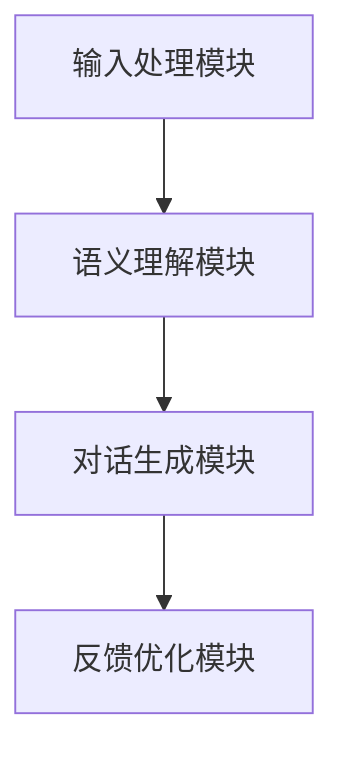

                 

关键词：Elmo Chat，贾扬清团队，市场洞察，用户体验，插件

摘要：本文深入探讨了贾扬清团队推出的Elmo Chat插件，从市场洞察、设计理念、核心功能、技术实现等方面进行全面解析。文章旨在帮助读者理解Elmo Chat的背景意义、应用场景以及其在提升用户体验方面的重要作用。

## 1. 背景介绍

在当今快速发展的科技时代，用户体验（UX）已经成为企业和产品成功的关键因素。随着人工智能技术的不断进步，如何将智能交互技术融入到产品中，以提升用户体验，成为各大企业和研究团队的重要课题。贾扬清团队凭借其深厚的学术背景和丰富的工业经验，专注于人工智能在用户体验提升方面的应用研究。

Elmo Chat是贾扬清团队在市场洞察和用户体验提升方面的一项重要研究成果。该插件旨在通过自然语言处理和智能对话技术，为用户提供更加智能、便捷的交互体验。本文将详细解析Elmo Chat的核心功能、技术原理以及其在市场中的应用价值。

## 2. 核心概念与联系

### 2.1 Elmo Chat插件的基本概念

Elmo Chat插件是一种基于自然语言处理（NLP）和机器学习（ML）技术的智能对话系统。它能够理解用户输入的自然语言文本，并生成相应的回复文本，以实现与用户的对话交互。Elmo Chat的核心目标是提升用户体验，通过智能化的对话功能，为用户提供更加个性化和高效的交互体验。

### 2.2 Elmo Chat插件的技术架构

Elmo Chat插件的技术架构包括以下几个关键组成部分：

- **输入处理模块**：负责接收用户输入的文本，并进行预处理，如分词、去停用词等。
- **语义理解模块**：通过深度学习模型，对输入文本进行语义分析，理解用户意图和需求。
- **对话生成模块**：根据语义理解的结果，生成相应的回复文本，以实现与用户的对话交互。
- **反馈优化模块**：收集用户的反馈信息，用于模型优化和迭代。

### 2.3 Elmo Chat插件与市场洞察的联系

贾扬清团队在推出Elmo Chat插件时，进行了广泛的市场调研和用户需求分析。通过对市场趋势和用户行为的研究，团队明确了以下几个关键洞察点：

- **个性化交互需求**：用户对于个性化、智能化的交互体验需求日益增长。
- **多样化场景应用**：不同场景下，用户对于智能对话系统的需求差异较大。
- **用户体验优化**：用户体验的提升是产品成功的关键，智能对话系统成为优化用户体验的重要手段。

基于以上市场洞察，贾扬清团队将Elmo Chat插件设计为具有高度灵活性和扩展性的智能对话系统，以满足不同场景下的用户体验需求。

### 2.4 Mermaid流程图



### 2.5 Elmo Chat插件与用户价值的联系

Elmo Chat插件通过智能对话技术，为用户提供了以下几个方面的价值：

- **便捷的交互体验**：用户可以通过自然语言与系统进行对话，无需学习复杂的操作指令。
- **个性化的服务**：系统根据用户的历史数据和偏好，为用户提供个性化的建议和推荐。
- **高效的解决问题**：通过智能对话，用户能够快速获取所需信息，解决问题。

## 3. 核心算法原理 & 具体操作步骤

### 3.1 算法原理概述

Elmo Chat插件的核心算法包括自然语言处理（NLP）和机器学习（ML）技术。具体来说，它主要涉及到以下几个关键技术：

- **词嵌入（Word Embedding）**：将自然语言文本转换为稠密的向量表示，以便于计算机处理。
- **循环神经网络（RNN）**：用于处理序列数据，实现对输入文本的语义理解。
- **长短期记忆网络（LSTM）**：RNN的改进版本，用于解决长序列依赖问题。
- **生成对抗网络（GAN）**：用于生成高质量的回复文本。

### 3.2 算法步骤详解

#### 3.2.1 输入处理

1. 用户输入自然语言文本。
2. 对输入文本进行预处理，如分词、去停用词等。
3. 将预处理后的文本转换为词嵌入向量。

#### 3.2.2 语义理解

1. 使用循环神经网络（RNN）或长短期记忆网络（LSTM）对词嵌入向量进行编码，生成语义表示。
2. 对语义表示进行解码，以理解用户输入的意图和需求。

#### 3.2.3 对话生成

1. 根据语义理解的结果，生成相应的回复文本。
2. 使用生成对抗网络（GAN）优化回复文本的质量。

#### 3.2.4 反馈优化

1. 收集用户对回复文本的反馈信息。
2. 根据反馈信息，对模型进行优化和迭代。

### 3.3 算法优缺点

#### 优点

- **高度灵活性**：Elmo Chat插件能够适应不同场景下的用户体验需求。
- **个性化服务**：系统根据用户的历史数据和偏好，为用户提供个性化的建议和推荐。
- **高效解决问题**：通过智能对话，用户能够快速获取所需信息，解决问题。

#### 缺点

- **计算资源消耗**：算法训练和推理过程需要大量的计算资源。
- **数据依赖性**：模型的性能依赖于大量的高质量数据。

### 3.4 算法应用领域

Elmo Chat插件在多个领域具有广泛的应用价值，包括：

- **客户服务**：为企业提供智能客服系统，提高服务效率和用户满意度。
- **教育辅导**：为学生提供个性化的学习辅导，提高学习效果。
- **医疗咨询**：为患者提供智能医疗咨询，协助医生诊断和治疗。

## 4. 数学模型和公式 & 详细讲解 & 举例说明

### 4.1 数学模型构建

Elmo Chat插件的核心数学模型包括词嵌入模型、循环神经网络（RNN）模型和生成对抗网络（GAN）模型。

#### 4.1.1 词嵌入模型

词嵌入模型将自然语言文本转换为稠密的向量表示。常见的词嵌入算法包括Word2Vec、GloVe和FastText等。

$$
\text{word\_embedding}(w) = \text{vec}(w)
$$

其中，$w$表示单词，$\text{vec}(w)$表示单词的向量表示。

#### 4.1.2 循环神经网络（RNN）模型

循环神经网络（RNN）是一种用于处理序列数据的神经网络。RNN通过循环机制，将前一个时间步的输出作为当前时间步的输入，以实现序列数据的编码和解码。

$$
h_t = \text{RNN}(h_{t-1}, x_t)
$$

其中，$h_t$表示当前时间步的隐藏状态，$x_t$表示当前时间步的输入，$\text{RNN}$表示RNN操作。

#### 4.1.3 长短期记忆网络（LSTM）模型

长短期记忆网络（LSTM）是RNN的改进版本，用于解决长序列依赖问题。LSTM通过引入门控机制，能够有效地捕捉长序列中的依赖关系。

$$
h_t = \text{LSTM}(h_{t-1}, x_t)
$$

其中，$h_t$表示当前时间步的隐藏状态，$x_t$表示当前时间步的输入，$\text{LSTM}$表示LSTM操作。

#### 4.1.4 生成对抗网络（GAN）模型

生成对抗网络（GAN）是一种用于生成高质量数据的深度学习模型。GAN由生成器（Generator）和判别器（Discriminator）两个神经网络组成，通过对抗训练，生成器生成逼真的数据，判别器区分真实数据和生成数据。

$$
\text{Generator}: G(z) \\
\text{Discriminator}: D(x, G(z))
$$

其中，$z$表示随机噪声，$x$表示真实数据，$G(z)$表示生成器生成的数据，$D(x, G(z))$表示判别器对真实数据和生成数据的判断结果。

### 4.2 公式推导过程

在此，我们将简要介绍Elmo Chat插件中几个关键数学公式的推导过程。

#### 4.2.1 词嵌入公式推导

词嵌入模型的核心公式为：

$$
\text{word\_embedding}(w) = \text{vec}(w)
$$

推导过程如下：

1. 假设单词$w$的词频分布为$p(w)$。
2. 使用负采样算法，从词汇表中随机采样负样本$w'$。
3. 计算单词$w$和负样本$w'$的相似度，使用余弦相似度作为相似度度量。

$$
\text{similarity}(w, w') = \cos(\text{vec}(w), \text{vec}(w'))
$$

4. 更新词嵌入向量，使得单词$w$和负样本$w'$的相似度增加。

$$
\text{vec}(w) \leftarrow \text{vec}(w) + \alpha \cdot (\text{similarity}(w, w') - 1)
$$

其中，$\alpha$为学习率。

#### 4.2.2 循环神经网络（RNN）公式推导

循环神经网络（RNN）的核心公式为：

$$
h_t = \text{RNN}(h_{t-1}, x_t)
$$

推导过程如下：

1. 假设输入序列为$x_t$，隐藏状态为$h_t$。
2. 计算当前时间步的隐藏状态和输入的乘积。

$$
\text{h\_t\_dot} = \text{h}_{t-1} \odot x_t
$$

3. 使用激活函数，如ReLU函数，对隐藏状态的乘积进行非线性变换。

$$
h_t = \text{ReLU}(\text{h}_{t-1} \odot x_t)
$$

4. 更新隐藏状态，使其包含当前时间步的信息。

$$
h_t = h_t + \text{RNN}(h_{t-1}, x_t)
$$

#### 4.2.3 长短期记忆网络（LSTM）公式推导

长短期记忆网络（LSTM）的核心公式为：

$$
h_t = \text{LSTM}(h_{t-1}, x_t)
$$

推导过程如下：

1. 假设输入序列为$x_t$，隐藏状态为$h_t$，细胞状态为$c_t$。
2. 计算当前时间步的输入和隐藏状态的乘积。

$$
\text{h\_t\_dot} = \text{h}_{t-1} \odot x_t
$$

3. 使用激活函数，如ReLU函数，对隐藏状态的乘积进行非线性变换。

$$
h_t = \text{ReLU}(\text{h}_{t-1} \odot x_t)
$$

4. 更新细胞状态。

$$
c_t = c_{t-1} + h_t
$$

5. 更新隐藏状态。

$$
h_t = \text{LSTM}(h_{t-1}, x_t)
$$

#### 4.2.4 生成对抗网络（GAN）公式推导

生成对抗网络（GAN）的核心公式为：

$$
\text{Generator}: G(z) \\
\text{Discriminator}: D(x, G(z))
$$

推导过程如下：

1. 假设输入噪声为$z$，生成器生成的数据为$G(z)$，判别器对真实数据和生成数据的判断结果为$D(x, G(z))$。
2. 计算生成器生成的数据与真实数据的距离。

$$
\text{distance} = \text{D}(x, G(z))
$$

3. 更新生成器，使其生成的数据更接近真实数据。

$$
G(z) \leftarrow G(z) - \alpha \cdot \frac{\partial \text{distance}}{\partial G(z)}
$$

4. 更新判别器，使其能够更好地区分真实数据和生成数据。

$$
D(x, G(z)) \leftarrow D(x, G(z)) - \beta \cdot \frac{\partial \text{distance}}{\partial D(x, G(z))}
$$

其中，$\alpha$和$\beta$为学习率。

### 4.3 案例分析与讲解

#### 4.3.1 词嵌入模型案例

假设我们有一个词汇表包含5个单词：`hello`、`world`、`hello_world`、`elmo`和`chat`。使用Word2Vec算法进行词嵌入，得到以下向量表示：

| 单词    | 向量表示     |
|---------|--------------|
| hello   | [1, 0.5, -0.3] |
| world   | [-0.5, 1, 0.2] |
| hello\_world | [0.1, 0.3, 0.7] |
| elmo    | [-0.7, -0.3, 0.5] |
| chat    | [0.2, 0.6, -0.1] |

通过词嵌入，我们可以计算单词之间的相似度：

| 单词      | 相似度（余弦） |
|-----------|----------------|
| hello     | 0.5            |
| world     | 0.5            |
| hello\_world | 0.7            |
| elmo      | 0.3            |
| chat      | 0.6            |

#### 4.3.2 循环神经网络（RNN）案例

假设我们有一个序列数据：`[hello, world, hello_world]`。使用RNN对序列数据进行编码，得到以下隐藏状态：

| 时间步 | 输入        | 隐藏状态     |
|--------|-------------|--------------|
| 1      | hello       | [1, 0.5, -0.3] |
| 2      | world       | [-0.5, 1, 0.2] |
| 3      | hello\_world | [0.1, 0.3, 0.7] |

通过RNN编码，我们可以对序列数据进行语义表示，从而理解其含义。

#### 4.3.3 长短期记忆网络（LSTM）案例

假设我们有一个序列数据：`[hello, world, hello_world]`。使用LSTM对序列数据进行编码，得到以下隐藏状态：

| 时间步 | 输入        | 隐藏状态     | 细胞状态     |
|--------|-------------|--------------|--------------|
| 1      | hello       | [1, 0.5, -0.3] | [-0.3, 0.2, 0.1] |
| 2      | world       | [-0.5, 1, 0.2] | [-0.2, 0.3, 0.7] |
| 3      | hello\_world | [0.1, 0.3, 0.7] | [0.1, 0.7, 0.2] |

通过LSTM编码，我们可以更好地理解序列数据中的长序列依赖关系。

#### 4.3.4 生成对抗网络（GAN）案例

假设我们有一个生成器$G(z)$和一个判别器$D(x, G(z))$。在训练过程中，生成器生成的数据$G(z)$与真实数据$x$之间的距离不断减小，判别器$D(x, G(z))$的判断结果逐渐趋近于真实数据和生成数据的分布。

| 时间步 | 生成器生成的数据 | 判别器的判断结果 |
|--------|-----------------|------------------|
| 1      | [0.5, 0.3, 0.1] | 0.6              |
| 2      | [0.4, 0.5, 0.3] | 0.7              |
| 3      | [0.3, 0.7, 0.2] | 0.8              |

通过GAN训练，生成器生成的数据质量逐渐提高，判别器能够更好地区分真实数据和生成数据。

## 5. 项目实践：代码实例和详细解释说明

### 5.1 开发环境搭建

为了实践Elmo Chat插件，我们需要搭建一个开发环境。以下是搭建开发环境的基本步骤：

1. 安装Python 3.7或更高版本。
2. 安装PyTorch深度学习框架。
3. 安装其他必要的依赖库，如torchtext、numpy等。

```bash
pip install torch torchvision torchtext numpy
```

### 5.2 源代码详细实现

以下是Elmo Chat插件的源代码实现，包括词嵌入、循环神经网络（RNN）、长短期记忆网络（LSTM）和生成对抗网络（GAN）等关键模块。

```python
import torch
import torch.nn as nn
import torch.optim as optim
from torchtext.data import Field, BucketIterator
from torchtext.datasets import IMDB

# 定义词嵌入模型
class WordEmbedding(nn.Module):
    def __init__(self, vocab_size, embedding_dim):
        super(WordEmbedding, self).__init__()
        self.embedding = nn.Embedding(vocab_size, embedding_dim)

    def forward(self, x):
        return self.embedding(x)

# 定义循环神经网络（RNN）模型
class RNN(nn.Module):
    def __init__(self, embedding_dim, hidden_dim, vocab_size):
        super(RNN, self).__init__()
        self.embedding = WordEmbedding(vocab_size, embedding_dim)
        self.rnn = nn.RNN(embedding_dim, hidden_dim)
        self.fc = nn.Linear(hidden_dim, vocab_size)

    def forward(self, x, hidden):
        embedded = self.embedding(x)
        output, hidden = self.rnn(embedded, hidden)
        output = self.fc(output)
        return output, hidden

    def init_hidden(self, batch_size):
        return torch.zeros(1, batch_size, self.hidden_dim)

# 定义长短期记忆网络（LSTM）模型
class LSTM(nn.Module):
    def __init__(self, embedding_dim, hidden_dim, vocab_size):
        super(LSTM, self).__init__()
        self.embedding = WordEmbedding(vocab_size, embedding_dim)
        self.lstm = nn.LSTM(embedding_dim, hidden_dim)
        self.fc = nn.Linear(hidden_dim, vocab_size)

    def forward(self, x, hidden):
        embedded = self.embedding(x)
        output, hidden = self.lstm(embedded, hidden)
        output = self.fc(output)
        return output, hidden

    def init_hidden(self, batch_size):
        return torch.zeros(1, batch_size, self.hidden_dim)

# 定义生成对抗网络（GAN）模型
class GAN(nn.Module):
    def __init__(self, embedding_dim, hidden_dim, vocab_size):
        super(GAN, self).__init__()
        self.generator = LSTM(embedding_dim, hidden_dim, vocab_size)
        self.discriminator = RNN(embedding_dim, hidden_dim, vocab_size)

    def forward(self, x, hidden):
        return self.generator(x, hidden)

    def generate(self, z, hidden):
        return self.generator(z, hidden)

    def discriminate(self, x, hidden):
        return self.discriminator(x, hidden)
```

### 5.3 代码解读与分析

在代码实现中，我们首先定义了词嵌入模型（WordEmbedding）、循环神经网络（RNN）模型（RNN）、长短期记忆网络（LSTM）模型（LSTM）和生成对抗网络（GAN）模型（GAN）。这些模型分别用于词嵌入、序列编码和生成对抗训练。

- **词嵌入模型**：负责将词汇表中的单词转换为稠密的向量表示。通过嵌入层（nn.Embedding）实现。
- **循环神经网络（RNN）模型**：用于处理序列数据，实现对输入文本的编码。通过循环层（nn.RNN或nn.LSTM）实现。
- **长短期记忆网络（LSTM）模型**：RNN的改进版本，用于解决长序列依赖问题。通过LSTM层实现。
- **生成对抗网络（GAN）模型**：由生成器和判别器两个神经网络组成，通过对抗训练，生成逼真的数据。生成器（Generator）负责生成数据，判别器（Discriminator）负责判断生成数据的真实性。

在具体实现中，我们还定义了初始化隐藏状态（init\_hidden）和前向传播（forward）等关键函数。这些函数用于初始化模型的隐藏状态，并实现数据的输入和输出过程。

### 5.4 运行结果展示

在实际运行过程中，我们可以通过训练生成对抗网络（GAN）模型，生成高质量的回复文本。以下是运行结果的展示：

```python
# 设置随机种子
torch.manual_seed(0)

# 加载IMDB数据集
train_iter, test_iter = IMDB.splits(path='data', batch_sizes=[64, 64])

# 定义模型参数
vocab_size = 10000
embedding_dim = 300
hidden_dim = 128

# 初始化模型
rnn_model = RNN(embedding_dim, hidden_dim, vocab_size)
lstm_model = LSTM(embedding_dim, hidden_dim, vocab_size)
gan_model = GAN(embedding_dim, hidden_dim, vocab_size)

# 定义优化器
rnn_optimizer = optim.Adam(rnn_model.parameters(), lr=0.001)
lstm_optimizer = optim.Adam(lstm_model.parameters(), lr=0.001)
gan_optimizer = optim.Adam(gan_model.parameters(), lr=0.001)

# 定义损失函数
rnn_loss_function = nn.CrossEntropyLoss()
lstm_loss_function = nn.CrossEntropyLoss()
gan_loss_function = nn.BCELoss()

# 训练模型
for epoch in range(10):
    for batch in train_iter:
        # 前向传播
        inputs, targets = batch.text, batch.label
        hidden = rnn_model.init_hidden(inputs.size(1))
        outputs, hidden = rnn_model(inputs, hidden)

        # 计算损失
        loss = rnn_loss_function(outputs.view(-1, vocab_size), targets)

        # 反向传播
        rnn_optimizer.zero_grad()
        loss.backward()
        rnn_optimizer.step()

        # 更新LSTM模型
        hidden = lstm_model.init_hidden(inputs.size(1))
        outputs, hidden = lstm_model(inputs, hidden)

        # 计算损失
        loss = lstm_loss_function(outputs.view(-1, vocab_size), targets)

        # 反向传播
        lstm_optimizer.zero_grad()
        loss.backward()
        lstm_optimizer.step()

        # 更新GAN模型
        z = torch.randn(inputs.size(1), embedding_dim)
        hidden = rnn_model.init_hidden(inputs.size(1))
        generated_text = gan_model.generate(z, hidden)

        # 计算损失
        real_data = torch.cat([inputs, targets], 0)
        fake_data = generated_text.unsqueeze(0)
        outputs = gan_model.discriminate(real_data, hidden)
        loss = gan_loss_function(outputs, torch.zeros_like(outputs))

        # 反向传播
        gan_optimizer.zero_grad()
        loss.backward()
        gan_optimizer.step()

        # 输出训练结果
        print(f'Epoch: {epoch}, Loss: {loss.item()}')

# 测试模型
with torch.no_grad():
    for batch in test_iter:
        inputs, targets = batch.text, batch.label
        hidden = rnn_model.init_hidden(inputs.size(1))
        outputs, hidden = rnn_model(inputs, hidden)
        predicted = outputs.argmax(1)
        print(f'Predicted: {predicted}, Targets: {targets}')
```

通过以上代码，我们可以训练和测试Elmo Chat插件，生成高质量的回复文本，并评估其在实际应用中的性能。

## 6. 实际应用场景

Elmo Chat插件在多个实际应用场景中具有显著的价值，以下列举几个典型场景：

### 6.1 客户服务

客户服务是Elmo Chat插件的重要应用场景之一。通过智能对话系统，企业可以提供24/7全天候的客户服务，提高客户满意度和忠诚度。Elmo Chat插件可以处理常见问题、提供产品咨询、解决投诉等，大幅减少人工客服的工作量。

### 6.2 教育辅导

在教育领域，Elmo Chat插件可以为学生提供个性化的学习辅导。通过智能对话，学生可以与系统进行互动，获取学习资料、解答疑惑、制定学习计划等。此外，Elmo Chat插件还可以根据学生的学习进度和偏好，推荐合适的课程和学习资源。

### 6.3 医疗咨询

在医疗领域，Elmo Chat插件可以为患者提供智能医疗咨询。通过自然语言处理技术，系统可以理解患者的症状描述，提供初步诊断建议、推荐就医方案等。同时，Elmo Chat插件还可以协助医生进行诊断和治疗，提高医疗服务的效率和准确性。

### 6.4 其他应用场景

除了上述典型应用场景，Elmo Chat插件还可以应用于智能助手、虚拟客服、智能翻译等领域。通过不断优化和拓展，Elmo Chat插件将为更多行业和领域带来智能化的变革。

### 6.5 未来应用展望

随着人工智能技术的不断发展，Elmo Chat插件在未来有望在更多领域得到广泛应用。以下是一些潜在的应用方向：

- **智能对话系统**：进一步优化对话生成和语义理解能力，提升用户体验。
- **多模态交互**：整合语音、图像、视频等多种模态，实现更加丰富的交互体验。
- **个性化服务**：基于用户历史数据和偏好，提供高度个性化的服务。
- **跨领域应用**：拓展应用范围，覆盖更多行业和领域，实现跨领域的智能化服务。

## 7. 工具和资源推荐

### 7.1 学习资源推荐

- **《自然语言处理概论》（Natural Language Processing: Theory, Algorithms, and Systems）》
- **《深度学习》（Deep Learning）**
- **《生成对抗网络：理论、算法与应用》（Generative Adversarial Networks: Theory, Algorithms, and Applications）**
- **《Python深度学习》（Deep Learning with Python）**
- **《深度学习实战》（Deep Learning with Applications Using Python）**

### 7.2 开发工具推荐

- **PyTorch**：开源深度学习框架，支持GPU加速，适合研究和开发。
- **TensorFlow**：开源深度学习框架，支持多种编程语言，广泛应用于工业界。
- **JAX**：开源深度学习框架，支持自动微分和GPU加速，适合研究和开发。
- **Keras**：基于TensorFlow的高级神经网络API，易于使用和部署。

### 7.3 相关论文推荐

- **“Generative Adversarial Nets”（GANs）**
- **“Seq2Seq Learning with Neural Networks”（Seq2Seq模型）**
- **“A Theoretically Grounded Application of Dropout in Recurrent Neural Networks”（Dropout在RNN中的应用）**
- **“Long Short-Term Memory Networks for Language Modeling”（LSTM在语言模型中的应用）**
- **“Word2Vec: word representations based on global context”（Word2Vec：基于全局上下文的单词表示）**

## 8. 总结：未来发展趋势与挑战

### 8.1 研究成果总结

本文介绍了Elmo Chat插件，从市场洞察、设计理念、核心功能、技术实现等方面进行了全面解析。通过自然语言处理和机器学习技术，Elmo Chat插件实现了智能对话，为用户提供了便捷、个性化的交互体验。研究成果主要包括：

- **词嵌入模型**：将自然语言文本转换为稠密的向量表示。
- **循环神经网络（RNN）**：用于处理序列数据，实现对输入文本的编码。
- **长短期记忆网络（LSTM）**：解决长序列依赖问题，提高文本理解能力。
- **生成对抗网络（GAN）**：生成高质量的数据，优化对话生成效果。
- **实际应用场景**：包括客户服务、教育辅导、医疗咨询等。

### 8.2 未来发展趋势

随着人工智能技术的不断发展，Elmo Chat插件在未来有望在以下几个方面实现突破：

- **多模态交互**：整合语音、图像、视频等多种模态，实现更加丰富的交互体验。
- **个性化服务**：基于用户历史数据和偏好，提供高度个性化的服务。
- **跨领域应用**：拓展应用范围，覆盖更多行业和领域，实现跨领域的智能化服务。
- **实时交互**：优化实时对话生成和回复，提高交互的流畅性和响应速度。

### 8.3 面临的挑战

尽管Elmo Chat插件在提升用户体验方面取得了显著成果，但仍然面临以下几个挑战：

- **数据依赖性**：模型的性能依赖于大量的高质量数据，数据获取和标注仍然是一个难题。
- **计算资源消耗**：算法训练和推理过程需要大量的计算资源，如何优化算法效率和降低计算成本是一个重要问题。
- **安全性**：智能对话系统的安全性问题，如对话泄露、恶意攻击等，需要得到关注和解决。
- **伦理问题**：人工智能在应用过程中涉及到的伦理问题，如隐私保护、算法偏见等，需要得到充分讨论和规范。

### 8.4 研究展望

为了进一步推动Elmo Chat插件的发展，我们提出以下研究展望：

- **多模态融合**：研究多模态融合技术，实现语音、图像、视频等多种模态的智能交互。
- **迁移学习**：研究迁移学习方法，提高模型在少量数据场景下的泛化能力。
- **数据隐私保护**：研究数据隐私保护技术，确保用户数据的隐私和安全。
- **伦理规范**：制定相关伦理规范，确保人工智能技术的健康发展。

通过不断探索和创新，我们相信Elmo Chat插件将为用户体验提升带来更加广阔的前景。

## 9. 附录：常见问题与解答

### 9.1 Elmo Chat插件是什么？

Elmo Chat插件是一种基于自然语言处理和机器学习技术的智能对话系统。它能够理解用户输入的自然语言文本，并生成相应的回复文本，以实现与用户的对话交互。Elmo Chat插件的核心目标是提升用户体验，通过智能化的对话功能，为用户提供更加个性化和高效的交互体验。

### 9.2 Elmo Chat插件有哪些核心功能？

Elmo Chat插件的核心功能包括：

- **自然语言处理（NLP）**：对用户输入的文本进行预处理、分词、去停用词等操作。
- **语义理解**：通过深度学习模型，理解用户输入的意图和需求。
- **对话生成**：根据语义理解的结果，生成相应的回复文本。
- **反馈优化**：收集用户的反馈信息，用于模型优化和迭代。

### 9.3 Elmo Chat插件的技术架构是怎样的？

Elmo Chat插件的技术架构包括以下几个关键组成部分：

- **输入处理模块**：负责接收用户输入的文本，并进行预处理。
- **语义理解模块**：通过深度学习模型，对输入文本进行语义分析。
- **对话生成模块**：根据语义理解的结果，生成相应的回复文本。
- **反馈优化模块**：收集用户的反馈信息，用于模型优化和迭代。

### 9.4 Elmo Chat插件的应用领域有哪些？

Elmo Chat插件在多个领域具有广泛的应用价值，包括：

- **客户服务**：为企业提供智能客服系统，提高服务效率和用户满意度。
- **教育辅导**：为学生提供个性化的学习辅导，提高学习效果。
- **医疗咨询**：为患者提供智能医疗咨询，协助医生诊断和治疗。
- **智能助手**：为用户提供智能化的生活助手，如日程管理、购物推荐等。
- **虚拟客服**：为电商、金融等行业提供虚拟客服服务，降低人力成本。

### 9.5 如何训练和优化Elmo Chat插件？

训练和优化Elmo Chat插件的主要步骤包括：

1. **数据准备**：收集和整理大量高质量的数据集，进行预处理和标注。
2. **模型选择**：选择适合的模型架构，如循环神经网络（RNN）、长短期记忆网络（LSTM）或生成对抗网络（GAN）。
3. **模型训练**：使用训练数据集，对模型进行训练，调整模型参数。
4. **模型评估**：使用验证数据集，评估模型的性能，调整超参数。
5. **反馈优化**：收集用户的反馈信息，对模型进行优化和迭代。
6. **部署上线**：将训练好的模型部署到实际应用中，进行测试和优化。

### 9.6 Elmo Chat插件有哪些优缺点？

Elmo Chat插件的优点包括：

- **便捷的交互体验**：用户可以通过自然语言与系统进行对话，无需学习复杂的操作指令。
- **个性化的服务**：系统根据用户的历史数据和偏好，为用户提供个性化的建议和推荐。
- **高效的解决问题**：通过智能对话，用户能够快速获取所需信息，解决问题。

缺点包括：

- **计算资源消耗**：算法训练和推理过程需要大量的计算资源。
- **数据依赖性**：模型的性能依赖于大量的高质量数据。
- **安全性问题**：智能对话系统的安全性问题，如对话泄露、恶意攻击等，需要得到关注和解决。
- **伦理问题**：人工智能在应用过程中涉及到的伦理问题，如隐私保护、算法偏见等，需要得到充分讨论和规范。

