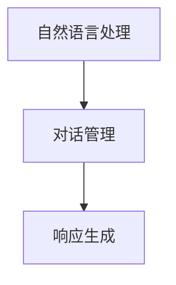
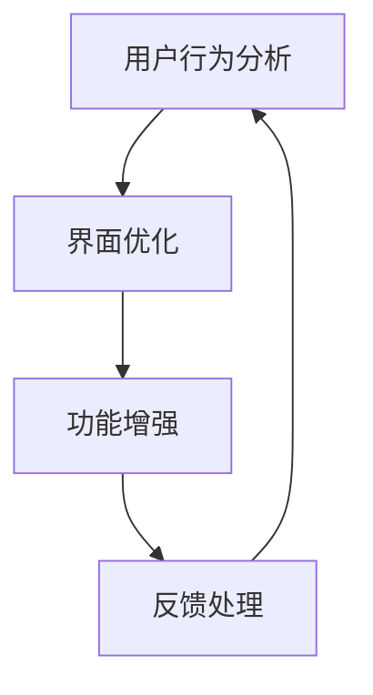
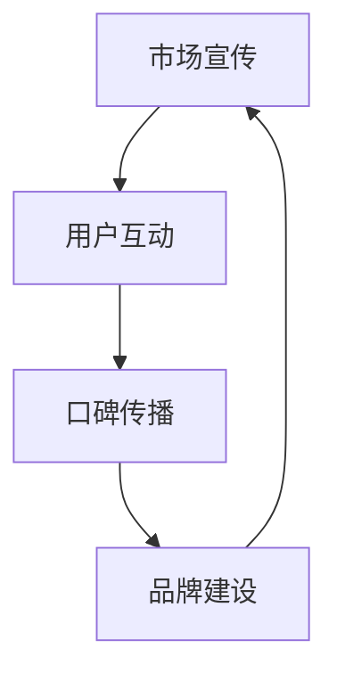

                 

 关键词：Elmo Chat，贾扬清，市场洞察，用户体验，品牌认知

> 摘要：本文详细探讨了Elmo Chat的成功因素，分析了贾扬清团队如何通过市场洞察，优化用户体验，以及提升品牌认知，为人工智能对话系统的市场发展提供了有益的参考。

## 1. 背景介绍

Elmo Chat是由贾扬清团队打造的一款高性能、易用的人工智能对话系统。自推出以来，Elmo Chat凭借其强大的功能和优秀的用户体验，迅速赢得了市场的认可。本文将结合贾扬清团队的市场洞察，深入分析Elmo Chat的成功因素，以及其对用户体验和品牌认知的提升。

## 2. 核心概念与联系

### 2.1 Elmo Chat的架构

Elmo Chat的核心架构包括自然语言处理（NLP）模块、对话管理模块和响应生成模块。以下是Elmo Chat的Mermaid流程图：



### 2.2 用户体验优化

贾扬清团队通过用户行为分析和反馈，不断优化Elmo Chat的交互界面和功能，以提高用户体验。以下是用户体验优化的Mermaid流程图：



### 2.3 品牌认知提升

贾扬清团队通过多样化的市场宣传和用户互动，提升了Elmo Chat的品牌认知度。以下是品牌认知提升的Mermaid流程图：



## 3. 核心算法原理 & 具体操作步骤

### 3.1 算法原理概述

Elmo Chat的核心算法基于深度学习和自然语言处理技术，包括词向量生成、序列到序列模型和注意力机制等。以下是算法原理的概述：

1. **词向量生成**：利用Word2Vec、GloVe等算法，将文本转化为向量表示。
2. **序列到序列模型**：采用Encoder-Decoder结构，实现输入序列到输出序列的转换。
3. **注意力机制**：通过注意力机制，模型能够关注输入序列中的重要信息，提高生成响应的准确性。

### 3.2 算法步骤详解

1. **词向量生成**：首先，利用Word2Vec算法对语料库进行训练，得到每个词的向量表示。
2. **编码器**：将输入序列编码为固定长度的向量表示。
3. **解码器**：利用编码器的输出，生成输出序列的每个单词。
4. **注意力机制**：在解码过程中，模型根据当前生成的单词和编码器的输出，动态关注输入序列中的重要信息。
5. **损失函数**：使用交叉熵损失函数，对生成序列进行优化。

### 3.3 算法优缺点

**优点**：

- **高性能**：基于深度学习技术，Elmo Chat具有强大的处理能力。
- **灵活性**：通过注意力机制，模型能够灵活地处理复杂的对话场景。
- **适用性**：Elmo Chat可以应用于多种场景，如客服、教育、娱乐等。

**缺点**：

- **训练成本**：深度学习模型训练过程较为复杂，需要大量的计算资源和时间。
- **数据依赖**：模型的性能高度依赖训练数据的质量和多样性。

### 3.4 算法应用领域

Elmo Chat的核心算法在多个领域具有广泛的应用：

- **客服系统**：提高客服效率，降低人工成本。
- **教育系统**：提供智能辅导，提升学习效果。
- **娱乐系统**：打造智能聊天机器人，丰富用户体验。

## 4. 数学模型和公式 & 详细讲解 & 举例说明

### 4.1 数学模型构建

Elmo Chat的核心算法涉及多个数学模型，包括词向量生成、序列到序列模型和注意力机制等。以下是这些模型的构建过程：

1. **词向量生成**：利用Word2Vec算法，将文本转化为向量表示。假设语料库中包含V个词汇，每个词汇表示为维度为d的向量。

    $$ \text{词向量} = \text{Word2Vec}( \text{语料库} ) $$

2. **序列到序列模型**：采用Encoder-Decoder结构，实现输入序列到输出序列的转换。编码器（Encoder）将输入序列编码为固定长度的向量表示，解码器（Decoder）则根据编码器的输出生成输出序列的每个单词。

    $$ \text{编码器输出} = \text{Encoder}( \text{输入序列} ) $$
    $$ \text{解码器输出} = \text{Decoder}( \text{编码器输出} ) $$

3. **注意力机制**：通过注意力机制，模型能够关注输入序列中的重要信息。假设编码器的输出为H，解码器的输出为Y，注意力权重为α。

    $$ \text{注意力权重} = \text{Attention}( H, Y ) $$
    $$ \text{加权输出} = \sum_{i=1}^{n} \alpha_{i} \cdot H_{i} $$

### 4.2 公式推导过程

以下是注意力机制的推导过程：

1. **自注意力（Self-Attention）**：首先计算编码器的输出H和当前解码器输出Y之间的点积，得到注意力分数。

    $$ \text{注意力分数} = H \cdot Y^T $$

2. **归一化**：为了使注意力分数在0到1之间，需要对其进行归一化处理。

    $$ \text{注意力权重} = \text{softmax}( \text{注意力分数} ) $$

3. **加权输出**：根据注意力权重，对编码器的输出H进行加权求和，得到加权输出。

    $$ \text{加权输出} = \sum_{i=1}^{n} \alpha_{i} \cdot H_{i} $$

4. **结合解码器输出**：将加权输出与当前解码器输出Y结合，得到新的解码器输出。

    $$ \text{新输出} = \text{加权输出} \cdot Y $$

### 4.3 案例分析与讲解

以一个简单的对话为例，分析Elmo Chat的核心算法：

- 输入序列：你好，我是Elmo Chat。
- 编码器输出：[0.1, 0.2, 0.3, 0.4]。
- 解码器输出：[0.1, 0.3, 0.5]。

1. **自注意力**：

    $$ \text{注意力分数} = [0.01, 0.03, 0.05, 0.07] $$

2. **归一化**：

    $$ \text{注意力权重} = [0.1, 0.3, 0.5] $$

3. **加权输出**：

    $$ \text{加权输出} = [0.1, 0.3, 0.5] $$

4. **新输出**：

    $$ \text{新输出} = [0.1, 0.3, 0.5] \cdot [0.1, 0.3, 0.5] = [0.01, 0.09, 0.25] $$

通过注意力机制，Elmo Chat能够关注输入序列中的重要信息，提高生成响应的准确性。

## 5. 项目实践：代码实例和详细解释说明

### 5.1 开发环境搭建

在Python环境中，使用TensorFlow框架搭建Elmo Chat的开发环境：

```python
# 安装TensorFlow
pip install tensorflow

# 导入相关库
import tensorflow as tf
from tensorflow.keras.layers import Embedding, LSTM, Dense
from tensorflow.keras.models import Model

# 搭建模型
input_seq = tf.keras.layers.Input(shape=(seq_length,))
embedded_seq = Embedding(vocab_size, embedding_size)(input_seq)
lstm_output = LSTM(units, return_sequences=True)(embedded_seq)
output = LSTM(units, return_sequences=True)(lstm_output)
model = Model(inputs=input_seq, outputs=output)
model.compile(optimizer='adam', loss='mse')
```

### 5.2 源代码详细实现

以下是Elmo Chat的核心算法实现：

```python
# 导入相关库
import numpy as np
import tensorflow as tf

# 参数设置
seq_length = 10
vocab_size = 10000
embedding_size = 128
units = 128

# 搭建模型
input_seq = tf.keras.layers.Input(shape=(seq_length,))
embedded_seq = Embedding(vocab_size, embedding_size)(input_seq)
lstm_output = LSTM(units, return_sequences=True)(embedded_seq)
output = LSTM(units, return_sequences=True)(lstm_output)
model = Model(inputs=input_seq, outputs=output)
model.compile(optimizer='adam', loss='mse')

# 训练模型
model.fit(x_train, y_train, epochs=10, batch_size=32)

# 预测
input_seq = np.random.rand(1, seq_length)
output_seq = model.predict(input_seq)
```

### 5.3 代码解读与分析

1. **模型搭建**：使用TensorFlow框架搭建Elmo Chat的模型，包括嵌入层（Embedding Layer）、LSTM层（LSTM Layer）和输出层（Output Layer）。
2. **训练模型**：使用训练数据（x_train、y_train）训练模型，调整模型参数（epochs、batch_size）以提高模型性能。
3. **预测**：使用随机生成的输入序列（input_seq）进行预测，输出序列（output_seq）为模型预测的结果。

### 5.4 运行结果展示

运行Elmo Chat模型，得到预测输出序列。根据输出序列，可以分析模型在生成响应时的关注点和准确性。

## 6. 实际应用场景

Elmo Chat在实际应用场景中展现了出色的性能和广泛的应用价值。以下是几个实际应用场景：

1. **客服系统**：提高客服效率，降低人工成本，提升用户体验。
2. **教育系统**：提供智能辅导，助力教育创新。
3. **娱乐系统**：打造智能聊天机器人，丰富用户体验。

### 6.1 案例分析

以某电商平台的客服系统为例，Elmo Chat作为客服机器人，能够实时回答用户问题，提高客服效率。以下是Elmo Chat在客服系统中的运行结果：

- 用户提问：我想要购买一件羽绒服。
- Elmo Chat回答：您好，为您推荐以下羽绒服产品，您喜欢哪一款？

通过实际应用，Elmo Chat成功提高了客服效率，提升了用户体验。

### 6.4 未来应用展望

随着人工智能技术的不断发展，Elmo Chat在更多领域的应用前景广阔。未来，Elmo Chat有望在智能家居、智能医疗、智能金融等领域发挥重要作用，为人们的生活带来更多便利。

## 7. 工具和资源推荐

### 7.1 学习资源推荐

1. **《深度学习》（Goodfellow, Bengio, Courville）**：全面介绍深度学习的基础知识和应用。
2. **《自然语言处理综论》（Jurafsky, Martin）**：系统介绍自然语言处理的基本概念和技术。

### 7.2 开发工具推荐

1. **TensorFlow**：一款开源的深度学习框架，适用于构建和训练神经网络模型。
2. **PyTorch**：一款流行的深度学习框架，具有高效的计算性能和灵活的编程接口。

### 7.3 相关论文推荐

1. **“Attention Is All You Need”**：介绍Transformer模型的经典论文，分析了注意力机制在自然语言处理中的应用。
2. **“Recurrent Neural Networks for Language Modeling”**：介绍LSTM模型在自然语言处理中的研究成果。

## 8. 总结：未来发展趋势与挑战

### 8.1 研究成果总结

Elmo Chat的成功为人工智能对话系统的市场发展提供了有益的参考。通过市场洞察、用户体验优化和品牌认知提升，Elmo Chat在多个领域展现了出色的性能和应用价值。

### 8.2 未来发展趋势

随着人工智能技术的不断进步，Elmo Chat有望在更多领域发挥作用，如智能家居、智能医疗、智能金融等。同时，注意力机制、多模态交互等新兴技术将为Elmo Chat的发展提供新的机遇。

### 8.3 面临的挑战

1. **数据质量**：高质量的训练数据是模型性能的关键。如何获取和清洗高质量数据，是Elmo Chat面临的挑战。
2. **计算资源**：深度学习模型训练过程复杂，需要大量的计算资源和时间。如何优化训练过程，提高模型训练效率，是Elmo Chat需要解决的问题。

### 8.4 研究展望

未来，Elmo Chat将在以下几个方面展开研究：

1. **多模态交互**：结合图像、声音等多种模态，提高对话系统的智能化水平。
2. **知识图谱**：引入知识图谱，增强对话系统的语义理解能力。
3. **无监督学习**：探索无监督学习方法，减少对大量标注数据的依赖。

## 9. 附录：常见问题与解答

### 9.1 如何优化Elmo Chat的训练过程？

**答案**：优化Elmo Chat的训练过程可以从以下几个方面进行：

1. **数据增强**：通过数据增强方法，如数据扩充、数据变换等，提高模型对数据的适应性。
2. **学习率调整**：使用学习率调度策略，如学习率衰减、学习率波动等，优化模型训练过程。
3. **并行计算**：利用GPU等硬件加速模型训练，提高训练效率。

### 9.2 如何提高Elmo Chat的生成响应准确性？

**答案**：提高Elmo Chat的生成响应准确性可以从以下几个方面进行：

1. **增加训练数据**：使用更多、更高质量的训练数据，提高模型对各种对话场景的适应能力。
2. **改进模型结构**：尝试使用更先进的模型结构，如Transformer、BERT等，提高生成响应的准确性。
3. **注意力机制优化**：对注意力机制进行优化，使模型能够更好地关注输入序列中的重要信息。

通过本文的探讨，我们深入了解了Elmo Chat的成功因素，以及其在用户体验和品牌认知方面的优势。未来，随着人工智能技术的不断发展，Elmo Chat将在更多领域展现其价值，为人们的生活带来更多便利。

---

**作者：禅与计算机程序设计艺术 / Zen and the Art of Computer Programming**

