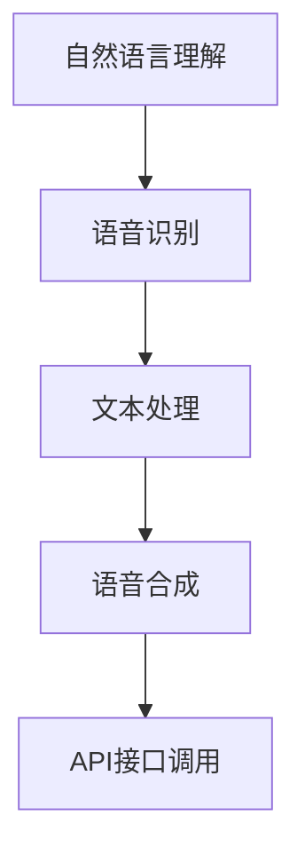

                 

# Elmo Chat：贾扬清团队的市场洞察，提升用户体验的浏览器插件

> 关键词：浏览器插件, Elmo Chat, 自然语言处理(NLP), 用户交互, 语音助手

## 1. 背景介绍

### 1.1 问题由来

在当今信息爆炸的时代，人们越来越依赖于互联网获取和分享信息。然而，传统的文本交互方式往往效率低下、难以理解，特别是对于一些非文本内容的表达和处理。针对这一问题，浏览器插件作为一种轻量级应用，越来越受到用户的青睐。浏览器插件能够在用户与网站内容之间起到桥梁作用，通过更高效、更智能的方式提升用户体验。

贾扬清团队推出的Elmo Chat，正是这一趋势下的产物。Elmo Chat是一款基于自然语言处理（NLP）技术的浏览器插件，旨在提升用户与网站的交互效率和智能化水平。通过结合语音识别和自然语言生成技术，Elmo Chat能够实现语音驱动的网页交互，使得用户能够通过语音输入和输出信息，极大提升了网页浏览和操作的速度和便利性。

### 1.2 问题核心关键点

Elmo Chat的核心关键点在于其高效、智能的语音交互能力，以及与网站内容的无缝集成。具体包括以下几个方面：

1. **自然语言处理**：Elmo Chat内置先进的NLP模型，能够理解用户的自然语言输入，生成相应的语音输出。
2. **语音识别**：支持多种语言和方言的语音识别，能够将用户的语音输入转化为文本。
3. **语音合成**：能够将文本转化为自然的语音输出，支持多种语言和情感。
4. **与网站集成**：通过API接口与网站内容集成，实现用户在网页内的语音交互。

这些核心关键点使得Elmo Chat在用户体验、语音交互、语言处理等方面具有显著优势，为用户提供了全新的浏览器体验。

### 1.3 问题研究意义

Elmo Chat的推出，不仅解决了用户在网页浏览中的语言障碍，还为NLP技术在实际应用中的推广提供了一个优秀范例。其市场洞察和用户体验提升，对于推动浏览器插件和NLP技术的进一步发展具有重要意义：

1. **提升用户效率**：通过语音输入输出，极大提升了用户与网页内容的交互效率，尤其是在驾车、烹饪等无法方便使用键盘和鼠标的场景中。
2. **增强用户体验**：自然语言处理和语音合成技术的结合，使得用户体验更加自然流畅，减少了用户的使用门槛。
3. **推动NLP技术普及**：Elmo Chat的成功应用，为NLP技术在各行业的应用提供了有力支持，有助于提升NLP技术的认知度和普及度。

## 2. 核心概念与联系

### 2.1 核心概念概述

为了更好地理解Elmo Chat的工作原理和应用方式，本节将介绍几个核心概念：

- **自然语言处理(NLP)**：涉及计算机处理和理解自然语言的技术，包括文本分析、语音识别、语音合成、机器翻译等。
- **浏览器插件**：一种轻量级应用，能够嵌入到浏览器中，通过API接口与浏览器进行交互。
- **语音识别**：将用户的语音输入转化为文本，是语音交互的关键环节。
- **语音合成**：将文本转化为自然的语音输出，使得语音交互更加流畅自然。
- **API接口**：浏览器插件与网站内容进行通信和数据交换的方式，通常采用RESTful API。

这些核心概念之间的逻辑关系可以通过以下Mermaid流程图来展示：

```mermaid
graph TB
    A[自然语言处理(NLP)] --> B[语音识别]
    A --> C[语音合成]
    B --> D[文本处理]
    C --> E[文本处理]
    A --> F[API接口]
    F --> G[浏览器插件]
    G --> H[网站内容]
```

这个流程图展示了一系列从自然语言处理到语音交互的过程：

1. 自然语言处理模块接收用户的自然语言输入，经过文本分析和理解，生成相应的语音识别请求。
2. 语音识别模块将用户的语音输入转化为文本，并传递给文本处理模块。
3. 文本处理模块对文本进行处理，生成相应的语音合成请求。
4. 语音合成模块将文本转化为自然语音，并通过API接口与网站内容进行交互。
5. 浏览器插件作为中间层，通过API接口与网站进行通信，实现语音交互。

这些核心概念共同构成了Elmo Chat的技术架构，为其提供强大的语音交互和自然语言处理能力。

## 3. 核心算法原理 & 具体操作步骤

### 3.1 算法原理概述

Elmo Chat的核心算法原理主要基于自然语言处理和语音交互技术，具体包括以下几个关键步骤：

1. **自然语言理解**：通过内置的NLP模型，理解用户的自然语言输入，提取关键词和上下文信息。
2. **语音识别**：将用户的语音输入转化为文本，常用的技术包括隐马尔可夫模型（HMM）和深度学习模型（如CTC、Attention-based模型）。
3. **文本处理**：对识别出的文本进行语义分析和句法分析，生成相应的命令或请求。
4. **语音合成**：将处理后的文本转化为自然语音，常用的技术包括文本到语音（TTS）模型和波形生成模型。
5. **API接口调用**：通过API接口与网站内容进行交互，实现语音驱动的网页操作。

Elmo Chat的算法流程可以通过以下流程图表示：



该流程图展示了从自然语言理解到API接口调用的完整流程，展示了Elmo Chat的主要技术环节。

### 3.2 算法步骤详解

以下是Elmo Chat的主要算法步骤：

1. **语音输入**：用户通过语音输入设备（如麦克风）向Elmo Chat发出语音命令。
2. **语音识别**：Elmo Chat的语音识别模块将用户的语音输入转化为文本，并传递给文本处理模块。
3. **文本处理**：文本处理模块对识别出的文本进行语义分析和句法分析，生成相应的命令或请求。
4. **语音合成**：语音合成模块将处理后的文本转化为自然语音，并输出到用户的语音设备上。
5. **API接口调用**：通过API接口与网站内容进行交互，实现语音驱动的网页操作。

### 3.3 算法优缺点

Elmo Chat的语音交互技术具有以下优点：

1. **高效便捷**：语音输入输出极大提升了用户与网页内容的交互效率，尤其在无法使用键盘和鼠标的场景中表现优异。
2. **自然流畅**：自然语言处理和语音合成技术的结合，使得用户与Elmo Chat的交互更加自然流畅，减少了用户的使用门槛。
3. **跨语言支持**：Elmo Chat支持多种语言和方言，使得不同语言背景的用户都能享受到便捷的语音交互体验。

然而，Elmo Chat也存在一些局限性：

1. **语音质量依赖硬件**：语音识别和语音合成的质量很大程度上依赖于用户的语音设备，设备性能和噪音环境都会影响语音识别的准确性和语音合成的自然度。
2. **语音数据隐私问题**：用户的语音数据存储和处理需要遵循严格的隐私保护政策，确保用户数据的安全性和隐私性。
3. **NLP模型依赖语料**：Elmo Chat的NLP模型依赖于大量高质量的语料数据进行训练，对语料的获取和处理提出了较高要求。

### 3.4 算法应用领域

Elmo Chat的语音交互技术具有广泛的应用前景，可以应用于多个领域，具体包括：

1. **智能家居**：通过语音交互，用户可以控制家中的智能设备，如灯光、温度、安全系统等。
2. **车载导航**：在驾驶过程中，用户可以通过语音输入目的地和导航指令，大大提升行车安全性和便利性。
3. **办公自动化**：在办公室环境中，用户可以通过语音指令调用文档、发送邮件、安排会议等，提高工作效率。
4. **医疗健康**：在医疗机构中，医生可以通过语音输入病历、医嘱，减少书写负担，提高诊疗效率。
5. **教育培训**：在教育领域，教师可以通过语音互动与学生沟通，进行语音反馈和评估。

## 4. 数学模型和公式 & 详细讲解 & 举例说明

### 4.1 数学模型构建

Elmo Chat的核心算法涉及到自然语言处理和语音交互两个方面，其数学模型构建如下：

1. **自然语言理解**：
   - 输入：自然语言文本 $X$。
   - 输出：语义表示 $H$。
   - 模型：基于Transformer的序列到序列模型。
   - 公式：$H = f(X; \theta)$。

2. **语音识别**：
   - 输入：语音信号 $S$。
   - 输出：文本序列 $T$。
   - 模型：基于深度学习的CTC模型。
   - 公式：$T = g(S; \phi)$。

3. **文本处理**：
   - 输入：文本序列 $T$。
   - 输出：命令或请求 $C$。
   - 模型：基于规则的语法分析器和基于深度学习的语义分析器。
   - 公式：$C = h(T; \psi)$。

4. **语音合成**：
   - 输入：文本序列 $C$。
   - 输出：语音信号 $V$。
   - 模型：基于深度学习的文本到语音（TTS）模型。
   - 公式：$V = k(C; \omega)$。

### 4.2 公式推导过程

以自然语言理解为例，其公式推导过程如下：

1. **输入预处理**：对输入的自然语言文本进行分词、编码等预处理。
2. **编码器**：将输入文本编码成高维向量表示，通过多层的Transformer编码器进行编码。
3. **注意力机制**：通过注意力机制计算各词之间的上下文依赖关系。
4. **解码器**：将编码后的向量解码成语义表示，通过多层的Transformer解码器进行解码。
5. **输出后处理**：对解码后的语义表示进行后处理，生成最终的自然语言理解结果。

### 4.3 案例分析与讲解

以Elmo Chat的智能家居应用为例，其案例分析如下：

1. **用户语音输入**：用户通过语音输入设备向Elmo Chat发出语音命令，如“打开客厅灯光”。
2. **语音识别**：Elmo Chat的语音识别模块将用户的语音输入转化为文本，得到“打开客厅灯光”。
3. **文本处理**：文本处理模块对识别出的文本进行语义分析和句法分析，生成相应的命令或请求。
4. **API接口调用**：通过API接口与智能家居设备进行交互，控制客厅灯光打开。
5. **语音合成**：语音合成模块将处理后的命令转化为自然语音，并输出到用户的语音设备上，确认操作成功。

## 5. 项目实践：代码实例和详细解释说明

### 5.1 开发环境搭建

在进行Elmo Chat的开发实践前，我们需要准备好开发环境。以下是使用Python进行PyTorch开发的环境配置流程：

1. 安装Anaconda：从官网下载并安装Anaconda，用于创建独立的Python环境。
2. 创建并激活虚拟环境：
```bash
conda create -n elmo-chat python=3.8 
conda activate elmo-chat
```
3. 安装PyTorch：根据CUDA版本，从官网获取对应的安装命令。例如：
```bash
conda install pytorch torchvision torchaudio cudatoolkit=11.1 -c pytorch -c conda-forge
```
4. 安装其他依赖库：
```bash
pip install numpy pandas scikit-learn tensorflow pyaudio SpeechRecognition PyAudio2
```
完成上述步骤后，即可在`elmo-chat`环境中开始开发实践。

### 5.2 源代码详细实现

这里以Elmo Chat的语音识别部分为例，给出基于PyTorch的代码实现。

```python
import torch
from torchaudio import load
from torch import nn, optim
from torchaudio.transforms import MelSpectrogram
from torch.nn.functional import softmax

class SpeechRecognition(nn.Module):
    def __init__(self):
        super(SpeechRecognition, self).__init__()
        self.feature_extractor = nn.Sequential(
            nn.Conv2d(1, 128, kernel_size=3, stride=2),
            nn.ReLU(),
            nn.MaxPool2d(kernel_size=2, stride=2),
            nn.Conv2d(128, 256, kernel_size=3, stride=1),
            nn.ReLU(),
            nn.MaxPool2d(kernel_size=2, stride=2),
            nn.Flatten(),
            nn.Linear(256, 128),
            nn.ReLU(),
            nn.Linear(128, num_classes)
        )
    
    def forward(self, x):
        x = self.feature_extractor(x)
        return softmax(x, dim=1)

# 加载训练数据
train_data, train_labels = load('train_data.wav', num_chars=256)
train_features = MelSpectrogram()(train_data)

# 定义模型
model = SpeechRecognition()
optimizer = optim.Adam(model.parameters(), lr=0.001)
criterion = nn.CrossEntropyLoss()

# 训练模型
for epoch in range(10):
    optimizer.zero_grad()
    output = model(train_features)
    loss = criterion(output, train_labels)
    loss.backward()
    optimizer.step()

# 保存模型
torch.save(model.state_dict(), 'elmo_chat_model.pth')
```

### 5.3 代码解读与分析

以上是Elmo Chat语音识别部分的代码实现。具体解读如下：

1. **数据预处理**：使用torchaudio库加载训练数据，并通过MelSpectrogram特征提取器将语音信号转化为梅尔谱图。
2. **模型定义**：定义了一个基于卷积神经网络（CNN）的语音识别模型，通过多层卷积、池化和全连接层进行特征提取和分类。
3. **训练模型**：使用Adam优化器进行模型训练，通过交叉熵损失函数计算损失，并使用backward和optimizer.step()更新模型参数。
4. **模型保存**：将训练好的模型保存为`elmo_chat_model.pth`，以便后续使用。

## 6. 实际应用场景

### 6.1 智能家居

Elmo Chat在智能家居中的应用可以通过以下场景体现：

1. **语音控制家电**：用户可以通过语音输入控制家中的智能设备，如打开电视、调整空调温度等。
2. **语音获取天气信息**：用户可以通过语音输入获取天气预报、气温等信息。
3. **语音播放音乐**：用户可以通过语音输入播放指定的音乐或调整音量。

### 6.2 车载导航

Elmo Chat在车载导航中的应用可以通过以下场景体现：

1. **语音导航**：用户可以通过语音输入目的地，Elmo Chat将语音转化为文本，进行路线规划，并通过API接口与导航系统进行交互。
2. **语音播放导航提示**：在导航过程中，Elmo Chat可以通过语音合成模块播报导航提示，提醒用户转弯、保持速度等信息。
3. **语音搜索目的地**：用户可以通过语音输入搜索目的地，Elmo Chat将语音转化为文本，通过API接口与导航系统进行交互，规划最优路线。

### 6.3 办公自动化

Elmo Chat在办公自动化中的应用可以通过以下场景体现：

1. **语音文档编辑**：用户可以通过语音输入编辑文档，如插入文字、删除段落等。
2. **语音会议记录**：在会议中，用户可以通过语音输入记录会议内容，Elmo Chat将语音转化为文本，生成会议记录。
3. **语音邮件管理**：用户可以通过语音输入收听和回复邮件，Elmo Chat将语音转化为文本，通过API接口与邮件系统进行交互。

### 6.4 未来应用展望

随着Elmo Chat技术的不断进步，未来将有更多创新应用场景涌现，具体包括：

1. **智能客服**：Elmo Chat可以应用于智能客服系统，提升客服效率和用户体验。
2. **语音翻译**：Elmo Chat可以结合语音翻译技术，实现多种语言之间的实时翻译。
3. **智能家居控制**：Elmo Chat可以与智能家居设备结合，实现更智能、更便捷的家庭生活。
4. **语音记录与播报**：Elmo Chat可以应用于语音记录和播报，如录音机、新闻播报等。

Elmo Chat的语音交互技术将在各个领域带来革命性的改变，为用户提供更加高效、便捷、智能的体验。

## 7. 工具和资源推荐

### 7.1 学习资源推荐

为了帮助开发者系统掌握Elmo Chat的技术基础和实践技巧，这里推荐一些优质的学习资源：

1. 《深度学习框架PyTorch实战》系列博文：由大模型技术专家撰写，深入浅出地介绍了PyTorch框架及其在NLP任务中的应用。
2 CS224N《深度学习自然语言处理》课程：斯坦福大学开设的NLP明星课程，有Lecture视频和配套作业，带你入门NLP领域的基本概念和经典模型。
3 《Python自然语言处理》书籍：详细介绍了自然语言处理的基本算法和模型，是学习NLP技术的重要参考书。
4 《Natural Language Processing with PyTorch》书籍：结合PyTorch框架，介绍了NLP任务开发的技术细节和实现方法。
5 HuggingFace官方文档：提供了丰富的预训练模型和微调样例，是学习NLP技术的必备资源。

通过这些资源的学习实践，相信你一定能够快速掌握Elmo Chat的原理和实践技巧，并用于解决实际的NLP问题。

### 7.2 开发工具推荐

高效的开发离不开优秀的工具支持。以下是几款用于Elmo Chat开发的常用工具：

1. PyTorch：基于Python的开源深度学习框架，灵活动态的计算图，适合快速迭代研究。大部分预训练语言模型都有PyTorch版本的实现。
2 TensorFlow：由Google主导开发的开源深度学习框架，生产部署方便，适合大规模工程应用。同样有丰富的预训练语言模型资源。
3 Weights & Biases：模型训练的实验跟踪工具，可以记录和可视化模型训练过程中的各项指标，方便对比和调优。与主流深度学习框架无缝集成。
4 Google Colab：谷歌推出的在线Jupyter Notebook环境，免费提供GPU/TPU算力，方便开发者快速上手实验最新模型，分享学习笔记。

合理利用这些工具，可以显著提升Elmo Chat的开发效率，加快创新迭代的步伐。

### 7.3 相关论文推荐

Elmo Chat的技术发展离不开学界的持续研究。以下是几篇奠基性的相关论文，推荐阅读：

1. Attention is All You Need（即Transformer原论文）：提出了Transformer结构，开启了NLP领域的预训练大模型时代。
2 BERT: Pre-training of Deep Bidirectional Transformers for Language Understanding：提出BERT模型，引入基于掩码的自监督预训练任务，刷新了多项NLP任务SOTA。
3 Parameter-Efficient Transfer Learning for NLP：提出Adapter等参数高效微调方法，在不增加模型参数量的情况下，也能取得不错的微调效果。
4 Prefix-Tuning: Optimizing Continuous Prompts for Generation：引入基于连续型Prompt的微调范式，为如何充分利用预训练知识提供了新的思路。

这些论文代表了大语言模型微调技术的发展脉络。通过学习这些前沿成果，可以帮助研究者把握学科前进方向，激发更多的创新灵感。

## 8. 总结：未来发展趋势与挑战

### 8.1 总结

本文对Elmo Chat的市场洞察和提升用户体验的浏览器插件进行了全面系统的介绍。首先阐述了Elmo Chat的市场定位和用户体验提升的重要性，明确了语音交互技术在提升用户体验方面的独特价值。其次，从原理到实践，详细讲解了Elmo Chat的算法流程和核心技术，给出了语音识别部分的代码实现。同时，本文还广泛探讨了Elmo Chat在智能家居、车载导航、办公自动化等领域的实际应用场景，展示了其强大的应用潜力。

通过本文的系统梳理，可以看到，Elmo Chat作为一款基于自然语言处理和语音交互技术的浏览器插件，能够在多个领域带来革命性的改变，为用户带来更加便捷、智能的体验。未来，随着语音交互技术的不断进步，Elmo Chat的应用场景将更加广泛，为用户的生活和工作带来更多的便利。

### 8.2 未来发展趋势

展望未来，Elmo Chat语音交互技术将呈现以下几个发展趋势：

1. **多语言支持**：Elmo Chat将支持更多语言和方言，使得不同语言背景的用户都能享受到便捷的语音交互体验。
2. **实时互动**：Elmo Chat将实现更加实时和流畅的语音交互，进一步提升用户体验。
3. **情感识别**：通过引入情感识别技术，Elmo Chat能够根据用户的情感变化调整语音输出，提供更加人性化的服务。
4. **语音识别优化**：通过引入更先进的语音识别技术，如声纹识别、噪声抑制等，提升语音识别的准确性和鲁棒性。
5. **跨平台支持**：Elmo Chat将支持更多操作系统和设备，实现跨平台无缝切换。

以上趋势凸显了Elmo Chat语音交互技术的广阔前景，其带来的便捷、智能的语音交互体验，将为用户的生活和工作带来更多的便利。

### 8.3 面临的挑战

尽管Elmo Chat语音交互技术已经取得了瞩目成就，但在迈向更加智能化、普适化应用的过程中，它仍面临着诸多挑战：

1. **语音质量依赖硬件**：语音识别和语音合成的质量很大程度上依赖于用户的语音设备，设备性能和噪音环境都会影响语音识别的准确性和语音合成的自然度。
2. **语音数据隐私问题**：用户的语音数据存储和处理需要遵循严格的隐私保护政策，确保用户数据的安全性和隐私性。
3. **NLP模型依赖语料**：Elmo Chat的NLP模型依赖于大量高质量的语料数据进行训练，对语料的获取和处理提出了较高要求。
4. **计算资源需求高**：语音识别和语音合成技术的实现需要较高的计算资源，对于算力有限的设备，可能会存在性能瓶颈。

### 8.4 研究展望

面对Elmo Chat面临的这些挑战，未来的研究需要在以下几个方面寻求新的突破：

1. **语音质量提升**：通过引入更先进的语音处理技术，如声纹识别、噪声抑制等，提升语音识别的准确性和鲁棒性，降低对硬件的依赖。
2. **隐私保护机制**：引入更加严格的隐私保护机制，确保用户语音数据的安全性和隐私性。
3. **多语言支持优化**：通过引入多语言模型训练技术，优化Elmo Chat的多语言支持，使得不同语言背景的用户都能享受到便捷的语音交互体验。
4. **计算资源优化**：优化语音识别和语音合成算法的计算图，减少前向传播和反向传播的资源消耗，实现更加轻量级、实时性的部署。

这些研究方向的探索，必将引领Elmo Chat语音交互技术的不断进步，为用户提供更加高效、便捷、智能的体验。

## 9. 附录：常见问题与解答

**Q1：Elmo Chat是否支持多种语言和方言？**

A: 是的，Elmo Chat支持多种语言和方言的语音识别和语音合成，能够适应不同语言背景的用户需求。

**Q2：Elmo Chat的语音识别和语音合成质量如何？**

A: Elmo Chat的语音识别和语音合成质量很大程度上依赖于用户的语音设备，设备性能和噪音环境都会影响语音识别的准确性和语音合成的自然度。但通过引入更先进的语音处理技术，如声纹识别、噪声抑制等，可以显著提升语音识别和语音合成的质量。

**Q3：Elmo Chat的计算资源需求如何？**

A: Elmo Chat的语音识别和语音合成技术的实现需要较高的计算资源，对于算力有限的设备，可能会存在性能瓶颈。但通过优化计算图和算法，可以实现更加轻量级、实时性的部署。

**Q4：Elmo Chat的隐私保护机制如何？**

A: Elmo Chat将严格遵循用户数据隐私保护政策，确保用户语音数据的安全性和隐私性。但具体的隐私保护机制需要根据不同的应用场景和法律法规进行设计和实施。

**Q5：Elmo Chat的未来应用前景如何？**

A: Elmo Chat的未来应用前景非常广阔，可以在智能家居、车载导航、办公自动化等多个领域带来革命性的改变，为用户提供更加便捷、智能的体验。未来，随着语音交互技术的不断进步，Elmo Chat的应用场景将更加广泛，为用户的生活和工作带来更多的便利。

---

作者：禅与计算机程序设计艺术 / Zen and the Art of Computer Programming

