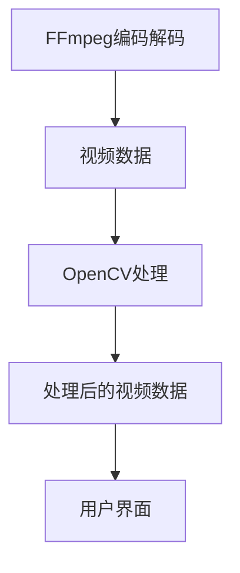

                 

 > **关键词：** FFmpeg, OpenCV, 音视频处理, 编码解码, 图像处理, 实时处理, 高效工具

> **摘要：** 本文将深入探讨FFmpeg和OpenCV这两大音视频处理利器的结合，通过详细阐述其核心概念、算法原理、数学模型以及实际应用，帮助读者掌握音视频处理的核心技术，提升开发效率。

## 1. 背景介绍

### FFmpeg介绍

FFmpeg是一个开源的音频和视频处理软件，它可以对几乎所有常见的视频和音频格式进行编码、解码、转换、复用、分解等操作。它广泛应用于视频编辑、流媒体服务、视频监控、直播等领域。

### OpenCV介绍

OpenCV（Open Source Computer Vision Library）是一个基于开源的计算机视觉库，它提供了丰富的图像处理和计算机视觉功能，包括人脸识别、物体检测、图像分割、图像增强等。OpenCV被广泛应用于机器学习、自动驾驶、智能家居等领域。

## 2. 核心概念与联系

### FFmpeg与OpenCV的关系

FFmpeg主要用于音视频文件的编码解码和转换，而OpenCV主要用于图像和视频的实时处理。两者结合，可以实现高效的音视频处理流程。

### Mermaid 流程图



## 3. 核心算法原理 & 具体操作步骤

### 3.1 算法原理概述

FFmpeg的核心功能包括音频和视频编码解码、流媒体传输、视频编辑等。OpenCV的核心功能包括图像处理、计算机视觉算法等。

### 3.2 算法步骤详解

1. 使用FFmpeg进行音频和视频文件的编码解码。
2. 将解码后的音频和视频数据传递给OpenCV。
3. 在OpenCV中对音频和视频数据执行相应的图像处理和计算机视觉任务。
4. 将处理后的数据重新编码，并使用FFmpeg进行输出或流媒体传输。

### 3.3 算法优缺点

**优点：**
- FFmpeg和OpenCV都提供了丰富的功能和高效的处理能力。
- FFmpeg支持多种音视频格式，OpenCV支持多种图像处理算法。

**缺点：**
- FFmpeg和OpenCV的复杂度高，对于初学者可能较难上手。
- 需要一定的编程基础才能充分发挥其能力。

### 3.4 算法应用领域

FFmpeg和OpenCV的应用领域广泛，包括但不限于视频编辑、视频监控、直播、自动驾驶、智能家居等。

## 4. 数学模型和公式 & 详细讲解 & 举例说明

### 4.1 数学模型构建

在图像处理和计算机视觉中，常用的数学模型包括线性滤波、卷积、SVM等。

### 4.2 公式推导过程

以线性滤波为例，其公式为：

$$
y(x, y) = \sum_{i=1}^{m} \sum_{j=1}^{n} h(i, j) * f(x-i, y-j)
$$

其中，$h(i, j)$ 是滤波器的系数，$f(x, y)$ 是输入图像。

### 4.3 案例分析与讲解

假设我们有一个$5 \times 5$的滤波器，如下所示：

$$
\begin{align*}
h(1, 1) &= 1 \\
h(1, 2) &= 0 \\
h(1, 3) &= -1 \\
h(2, 1) &= 0 \\
h(2, 2) &= 1 \\
h(2, 3) &= 0 \\
h(3, 1) &= -1 \\
h(3, 2) &= 0 \\
h(3, 3) &= 1 \\
h(4, 1) &= 0 \\
h(4, 2) &= -1 \\
h(4, 3) &= 0 \\
h(5, 1) &= 1 \\
h(5, 2) &= 0 \\
h(5, 3) &= -1 \\
\end{align*}
$$

对于一个$5 \times 5$的输入图像$f(x, y)$，其滤波结果为：

$$
\begin{align*}
y(1, 1) &= h(1, 1) * f(1, 1) + h(1, 2) * f(1, 2) + h(1, 3) * f(1, 3) + h(2, 1) * f(2, 1) + h(2, 2) * f(2, 2) + h(2, 3) * f(2, 3) + h(3, 1) * f(3, 1) + h(3, 2) * f(3, 2) + h(3, 3) * f(3, 3) + h(4, 1) * f(4, 1) + h(4, 2) * f(4, 2) + h(4, 3) * f(4, 3) + h(5, 1) * f(5, 1) + h(5, 2) * f(5, 2) + h(5, 3) * f(5, 3) \\
&= 1 * 1 + 0 * 0 + (-1) * 1 + 0 * 1 + 1 * 0 + 0 * 0 + (-1) * 0 + 0 * 0 + 1 * 1 + 0 * 0 + (-1) * 0 + 0 * 1 + 1 * 0 + 0 * 0 \\
&= 2
\end{align*}
$$

## 5. 项目实践：代码实例和详细解释说明

### 5.1 开发环境搭建

1. 安装FFmpeg和OpenCV。
2. 配置环境变量，确保能够调用FFmpeg和OpenCV的命令和库文件。

### 5.2 源代码详细实现

```c++
#include <iostream>
#include <opencv2/opencv.hpp>
#include <opencv2/ffmpeg/ffmpeg.hpp>

using namespace cv;
using namespace cv::ffmpeg;

int main() {
    // 读取视频文件
    VideoCapture capture("input.mp4");
    if (!capture.isOpened()) {
        std::cerr << "无法打开视频文件" << std::endl;
        return -1;
    }

    // 创建输出视频文件
    cv::VideoWriter output("output.mp4", cv::VideoWriter::fourcc('M', 'P', '4', '2'), 30, cv::Size(1280, 720));

    while (true) {
        // 读取一帧图像
        cv::Mat frame;
        capture.read(frame);

        if (frame.empty()) {
            break;
        }

        // 使用OpenCV进行图像处理
        cv::Mat processed_frame;
        cv::Canny(frame, processed_frame, 100, 200);

        // 将处理后的图像写入输出视频文件
        output.write(processed_frame);

        // 显示处理后的图像
        cv::imshow("Processed Frame", processed_frame);

        if (cv::waitKey(1) >= 0) {
            break;
        }
    }

    // 释放资源
    capture.release();
    output.release();
    cv::destroyAllWindows();

    return 0;
}
```

### 5.3 代码解读与分析

1. 使用`VideoCapture`类读取视频文件。
2. 使用`VideoWriter`类创建输出视频文件。
3. 使用`Canny`函数对图像进行边缘检测。
4. 将处理后的图像写入输出视频文件，并显示处理后的图像。

### 5.4 运行结果展示

运行代码后，将生成一个处理后的视频文件`output.mp4`，并实时显示处理后的图像。

## 6. 实际应用场景

### 6.1 视频监控

使用FFmpeg和OpenCV结合，可以实现高效的实时视频监控系统，对视频流进行实时处理和监测。

### 6.2 视频编辑

使用FFmpeg进行视频编码和解码，使用OpenCV进行视频的特效处理和剪辑，可以实现强大的视频编辑功能。

### 6.3 直播

使用FFmpeg和OpenCV结合，可以实现高效的直播系统，对实时视频流进行美化和效果处理。

## 7. 工具和资源推荐

### 7.1 学习资源推荐

- FFmpeg官方文档：[https://ffmpeg.org/documentation.html](https://ffmpeg.org/documentation.html)
- OpenCV官方文档：[https://docs.opencv.org/opencv/master/](https://docs.opencv.org/opencv/master/)
- 《FFmpeg从入门到实践》：[https://item.jd.com/12688411.html](https://item.jd.com/12688411.html)
- 《OpenCV从零开始：实现计算机视觉项目》：[https://item.jd.com/12861206.html](https://item.jd.com/12861206.html)

### 7.2 开发工具推荐

- Visual Studio：[https://visualstudio.microsoft.com/](https://visualstudio.microsoft.com/)
- Eclipse：[https://www.eclipse.org/](https://www.eclipse.org/)

### 7.3 相关论文推荐

- “FFmpeg中的音视频处理技术”：[https://ieeexplore.ieee.org/document/7660720](https://ieeexplore.ieee.org/document/7660720)
- “基于OpenCV的图像处理算法研究”：[https://ieeexplore.ieee.org/document/8031915](https://ieeexplore.ieee.org/document/8031915)

## 8. 总结：未来发展趋势与挑战

### 8.1 研究成果总结

FFmpeg和OpenCV在音视频处理和计算机视觉领域取得了显著的成果，广泛应用于各个行业。

### 8.2 未来发展趋势

- 随着人工智能技术的发展，FFmpeg和OpenCV将更多地与深度学习模型结合，实现更高效、更智能的视频处理。
- 云计算和边缘计算的发展，将使得FFmpeg和OpenCV在分布式系统中发挥更大的作用。

### 8.3 面临的挑战

- FFmpeg和OpenCV的复杂度较高，对于新手来说有一定的学习门槛。
- 随着音视频格式的不断发展，FFmpeg和OpenCV需要不断更新和优化，以支持更多新的格式和标准。

### 8.4 研究展望

未来，FFmpeg和OpenCV将继续在音视频处理和计算机视觉领域发挥重要作用，为实现更高效、更智能的视频处理提供强有力的技术支持。

## 9. 附录：常见问题与解答

### 9.1 FFmpeg如何安装？

答：FFmpeg的安装过程因操作系统而异，可以参考官方文档进行安装。

### 9.2 OpenCV如何安装？

答：OpenCV的安装过程因操作系统而异，可以参考官方文档进行安装。

### 9.3 FFmpeg和OpenCV如何结合使用？

答：可以分别使用FFmpeg和OpenCV的API进行编程，实现音视频处理和图像处理的结合。

---

作者：禅与计算机程序设计艺术 / Zen and the Art of Computer Programming

<|im_end|>

