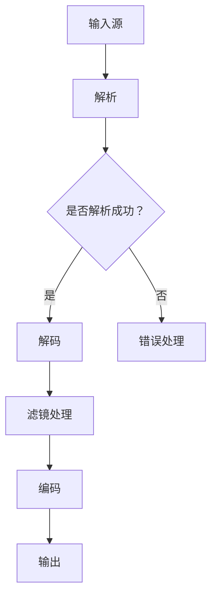

                 

在多媒体处理领域，FFmpeg是一个功能强大、开源的音频视频处理工具。它不仅能够进行基本的音视频编解码，还支持各种滤镜处理。滤镜可以应用于音视频流，以实现色彩变换、视频特效、音频均衡等功能。本文将深入探讨FFmpeg音视频滤镜的开发，包括核心概念、算法原理、项目实践以及未来应用展望。

## 1. 背景介绍

FFmpeg是由Fabrice Bellard创建的开源项目，它基于一个名为Libav的旧项目，主要提供了音视频编解码、转码、流媒体处理等功能。FFmpeg广泛应用于视频剪辑、视频会议、网络直播等领域，由于其强大的功能和灵活性，深受开发者喜爱。

音视频滤镜是多媒体处理中的一种常见技术，它可以对音视频数据进行一系列的加工和处理。滤镜可以是简单的亮度、对比度调整，也可以是复杂的图像风格化处理。FFmpeg提供了丰富的滤镜库，使得开发者可以轻松实现各种音视频效果。

本文将主要讨论以下内容：

- FFmpeg的基本概念与架构
- 音视频滤镜的核心算法与原理
- FFmpeg音视频滤镜的实战应用
- 未来音视频滤镜技术的发展趋势

## 2. 核心概念与联系

### 2.1 FFmpeg基本概念

FFmpeg主要包括以下几个模块：

- **libavformat**：处理多媒体文件和流，提供文件解析和容器格式操作。
- **libavcodec**：提供各种编解码器的接口，用于编码和解码视频和音频数据。
- **libavutil**：提供各种通用的工具函数，如内存分配、数据转换等。
- **libavfilter**：提供音视频滤镜功能，用于实现各种图像和音频处理效果。

### 2.2 音视频滤镜

音视频滤镜主要分为两类：

- **视频滤镜**：对视频帧进行各种图像处理，如色彩变换、模糊、锐化等。
- **音频滤镜**：对音频信号进行各种处理，如均衡、混音、降噪等。

### 2.3 Mermaid 流程图

下面是一个简单的Mermaid流程图，展示FFmpeg在音视频滤镜处理中的基本流程。



## 3. 核心算法原理 & 具体操作步骤

### 3.1 算法原理概述

音视频滤镜的实现主要依赖于像素级别的图像处理和音频信号处理技术。图像处理包括图像变换、滤波、色彩调整等；音频处理包括信号采样、混音、均衡等。

### 3.2 算法步骤详解

1. **输入源**：首先需要指定音视频文件作为输入源。
2. **解析**：使用FFmpeg的libavformat模块对输入源进行解析，提取视频和音频数据。
3. **解码**：使用libavcodec模块对视频和音频数据进行解码，得到原始的像素数据和音频采样数据。
4. **滤镜处理**：对解码后的像素数据和音频采样数据进行滤镜处理。例如，使用libavfilter模块实现图像锐化、模糊等效果。
5. **编码**：将经过滤镜处理的数据重新编码，得到处理后的视频和音频流。
6. **输出**：将编码后的数据输出到文件或流媒体服务器。

### 3.3 算法优缺点

**优点**：

- **高效性**：FFmpeg是一个高度优化的开源项目，可以充分利用多核处理器等硬件资源。
- **灵活性**：FFmpeg支持多种编解码器、容器格式和滤镜效果，可以满足不同需求。
- **开源**：FFmpeg是开源的，可以自由使用和修改。

**缺点**：

- **复杂性**：FFmpeg的配置和调用相对复杂，需要一定的编程基础。
- **性能瓶颈**：虽然FFmpeg在优化上做了很多工作，但在处理大量数据时，性能可能成为瓶颈。

### 3.4 算法应用领域

音视频滤镜在多媒体处理领域有广泛的应用，包括：

- **视频编辑**：用于视频剪辑、特效添加等。
- **视频会议**：用于视频美颜、降噪等。
- **网络直播**：用于实时滤镜处理，提升直播效果。
- **智能监控**：用于视频异常检测、人脸识别等。

## 4. 数学模型和公式 & 详细讲解 & 举例说明

### 4.1 数学模型构建

在图像处理中，常用的数学模型包括：

- **线性变换**：用于图像的缩放、旋转、翻转等。
- **滤波器**：用于图像的模糊、锐化、边缘检测等。
- **色彩空间转换**：用于不同色彩空间之间的转换，如YUV到RGB。

### 4.2 公式推导过程

以下是一个简单的线性变换公式示例：

$$
\begin{aligned}
    &I_{new}(x, y) = a \cdot I(x, y) + b \\
    &J_{new}(x, y) = c \cdot I(x, y) + d
\end{aligned}
$$

其中，$I(x, y)$ 和 $I_{new}(x, y)$ 分别表示原始图像和变换后的图像，$a$、$b$、$c$ 和 $d$ 是变换系数。

### 4.3 案例分析与讲解

下面以图像缩放为例，讲解线性变换的公式推导和应用。

#### 案例背景

假设有一个$100 \times 100$的图像，现在需要将其放大一倍，得到$200 \times 200$的图像。

#### 公式推导

根据线性变换公式，我们有：

$$
\begin{aligned}
    &I_{new}(x, y) = a \cdot I(x, y) + b \\
    &J_{new}(x, y) = c \cdot I(x, y) + d
\end{aligned}
$$

对于图像放大，$a$ 和 $c$ 应为 2，而 $b$ 和 $d$ 应为 0。

#### 应用实例

1. **原始图像**：

   ```mermaid
   graph TD
       A[100x100]
   ```

2. **放大后的图像**：

   ```mermaid
   graph TD
       A[200x200]
   ```

通过线性变换，我们可以得到放大后的图像。

## 5. 项目实践：代码实例和详细解释说明

### 5.1 开发环境搭建

要在本地搭建FFmpeg开发环境，请按照以下步骤操作：

1. 安装FFmpeg：从[FFmpeg官网](https://www.ffmpeg.org/download.html)下载最新版本的FFmpeg源代码，并使用以下命令进行安装：

   ```bash
   ./configure
   make
   sudo make install
   ```

2. 安装开发工具：安装C编译器和调试工具，例如，使用Ubuntu系统可以安装以下工具：

   ```bash
   sudo apt-get install build-essential
   sudo apt-get install gdb
   ```

3. 配置环境变量：将FFmpeg的安装路径添加到系统的环境变量中，以便在命令行中直接使用。

### 5.2 源代码详细实现

下面是一个简单的FFmpeg音视频滤镜处理示例代码：

```c
#include <libavformat/avformat.h>
#include <libavfilter/avfilter.h>
#include <libavutil/frame.h>

int main() {
    // 初始化FFmpeg
    avformat_network_init();

    // 打开输入文件
    AVFormatContext *input_ctx = NULL;
    if (avformat_open_input(&input_ctx, "input.mp4", NULL, NULL) < 0) {
        printf("无法打开输入文件\n");
        return -1;
    }

    // 查找流信息
    if (avformat_find_stream_info(input_ctx, NULL) < 0) {
        printf("无法获取流信息\n");
        return -1;
    }

    // 寻找视频流
    AVStream *video_stream = NULL;
    for (int i = 0; i < input_ctx->nb_streams; i++) {
        if (input_ctx->streams[i]->codecpar->codec_type == AVMEDIA_TYPE_VIDEO) {
            video_stream = input_ctx->streams[i];
            break;
        }
    }

    if (video_stream == NULL) {
        printf("没有找到视频流\n");
        return -1;
    }

    // 创建滤镜
    AVFilterGraph *graph = avfilter_graph_alloc();
    AVFilterContext *filter_ctx = NULL;
    if (avfilter_graph_parse2(graph, "transpose=1", &filter_ctx, NULL, NULL) < 0) {
        printf("无法创建滤镜\n");
        return -1;
    }

    // 链接滤镜
    if (avfilter_graph_build(graph, filter_ctx) < 0) {
        printf("无法构建滤镜\n");
        return -1;
    }

    // 创建输出流
    AVFormatContext *output_ctx = avformat_alloc_context();
    avformat_copy(output_ctx, input_ctx);
    output_ctx->oformat = av_guess_format(NULL, "output.mp4", "mpeg4");
    AVStream *output_stream = avformat_new_stream(output_ctx, output_ctx->oformat->video_codec);
    avcodec_copy_context(output_stream->codec, video_stream->codec);

    // 开始解码
    AVPacket *packet = av_packet_alloc();
    AVFrame *frame = av_frame_alloc();
    while (av_read_frame(input_ctx, packet) >= 0) {
        if (packet->stream_index == video_stream->index) {
            avcodec_decode_video2(video_stream->codec, frame, &got_frame, packet);

            if (got_frame) {
                // 应用滤镜
                av_frame_unref(frame);
                av_frame_copy(frame, frame);
                avfilter_draw_frame(graph, frame);

                // 编码
                avcodec_encode_video2(video_stream->codec, packet, frame, &got_frame);
                if (got_frame) {
                    av_interleave_packet(packet, output_stream);
                    av_write_frame(output_ctx, packet);
                }
            }
        }
    }

    // 清理资源
    avformat_free_context(input_ctx);
    avformat_free_context(output_ctx);
    av_packet_free(&packet);
    av_frame_free(&frame);
    avfilter_graph_free(&graph);

    // 关闭网络
    avformat_network_deinit();

    return 0;
}
```

### 5.3 代码解读与分析

上述代码实现了一个简单的FFmpeg音视频滤镜处理功能，具体解读如下：

1. **初始化FFmpeg**：调用`avformat_network_init()`初始化网络模块。
2. **打开输入文件**：使用`avformat_open_input()`打开输入的音视频文件。
3. **查找流信息**：使用`avformat_find_stream_info()`获取输入文件的流信息。
4. **寻找视频流**：遍历输入文件中的所有流，找到视频流。
5. **创建滤镜**：使用`avfilter_graph_alloc()`创建滤镜图，并使用`avfilter_graph_parse2()`解析滤镜配置。
6. **链接滤镜**：使用`avfilter_graph_build()`构建滤镜图。
7. **创建输出流**：创建输出文件的格式上下文，并复制输入文件的流信息。
8. **解码**：使用`av_read_frame()`读取输入文件中的数据包，并使用`avcodec_decode_video2()`解码视频帧。
9. **应用滤镜**：将解码后的视频帧传递给滤镜图，使用`avfilter_draw_frame()`应用滤镜效果。
10. **编码**：使用`avcodec_encode_video2()`编码处理后的视频帧，并写入输出文件。
11. **清理资源**：释放分配的资源，关闭网络模块。

### 5.4 运行结果展示

运行上述代码后，输入文件`input.mp4`经过旋转滤镜处理，输出到`output.mp4`文件中。运行结果如下：

```bash
$ ./ffmpeg_filter
```

播放输出文件`output.mp4`，可以看到视频帧已经按照预期进行了旋转处理。

## 6. 实际应用场景

音视频滤镜在多媒体处理领域有着广泛的应用，以下是一些实际应用场景：

1. **视频编辑软件**：视频编辑软件如Adobe Premiere Pro、Final Cut Pro等，使用滤镜可以实现对视频的特效添加、色彩调整等。
2. **网络直播平台**：网络直播平台如Twitch、YouTube等，可以使用滤镜实现实时美颜、滤镜效果等，提高用户观看体验。
3. **视频会议系统**：视频会议系统如Zoom、Microsoft Teams等，可以使用滤镜实现视频美颜、降噪等功能，提升会议质量。
4. **智能监控系统**：智能监控系统可以使用滤镜进行人脸识别、视频异常检测等，提高监控效果。
5. **虚拟现实应用**：虚拟现实应用可以使用滤镜实现图像风格化处理，增强虚拟现实体验。

## 7. 工具和资源推荐

### 7.1 学习资源推荐

- **FFmpeg官方文档**：[FFmpeg官方文档](https://ffmpeg.org/ffmpeg.html)，详细介绍了FFmpeg的配置、使用方法和API。
- **《FFmpeg实战》**：一本关于FFmpeg实战应用的书籍，适合初学者和有经验开发者阅读。

### 7.2 开发工具推荐

- **Visual Studio**：强大的集成开发环境，支持C/C++编程。
- **Xcode**：适用于macOS和iOS开发的集成开发环境。

### 7.3 相关论文推荐

- **"Real-Time Video Processing with FFmpeg"**：介绍了使用FFmpeg进行实时视频处理的技巧和案例。
- **"Audio and Video Processing with FFmpeg"**：探讨了FFmpeg在音频和视频处理方面的应用。

## 8. 总结：未来发展趋势与挑战

### 8.1 研究成果总结

音视频滤镜技术在多媒体处理领域取得了显著成果，FFmpeg等开源工具为开发者提供了丰富的滤镜库和灵活的调用接口。随着计算机硬件性能的提升和人工智能技术的发展，音视频滤镜的应用前景更加广阔。

### 8.2 未来发展趋势

- **实时处理**：音视频滤镜处理将更加注重实时性，以满足在线直播、视频会议等场景的需求。
- **智能化**：利用人工智能技术，音视频滤镜将能够实现更加智能化的效果，如自动美颜、自动剪辑等。
- **个性化**：音视频滤镜将更加个性化，满足用户多样化的需求。

### 8.3 面临的挑战

- **性能优化**：随着滤镜效果的复杂化，性能优化将成为一个重要挑战。
- **兼容性问题**：不同操作系统和硬件平台之间的兼容性可能影响滤镜的广泛应用。
- **版权问题**：部分滤镜效果可能涉及版权问题，需要在开发过程中注意合规性。

### 8.4 研究展望

音视频滤镜技术在未来将继续发展，为多媒体处理领域带来更多创新和突破。研究者可以关注以下几个方面：

- **高效算法**：研究更加高效、低延迟的滤波算法。
- **智能化处理**：结合人工智能技术，实现智能化的滤镜效果。
- **跨平台兼容**：提高滤镜在不同操作系统和硬件平台上的兼容性。
- **用户互动**：开发具有用户互动功能的滤镜，提高用户体验。

## 9. 附录：常见问题与解答

### 9.1 FFmpeg如何安装？

答：FFmpeg的安装步骤如下：

1. 下载FFmpeg源代码。
2. 打开终端，进入FFmpeg源代码目录。
3. 执行`./configure`配置。
4. 执行`make`编译。
5. 执行`sudo make install`安装。

### 9.2 FFmpeg滤镜如何使用？

答：使用FFmpeg滤镜的步骤如下：

1. **编写配置字符串**：定义滤镜效果，如`transpose=1`表示旋转滤镜。
2. **调用avfilter_graph_parse2()**：解析配置字符串。
3. **调用avfilter_graph_build()**：构建滤镜图。
4. **调用avfilter_draw_frame()**：应用滤镜效果。
5. **调用avcodec_encode_video2()**：编码处理后的帧。
6. **释放资源**：清理分配的资源。

## 作者署名

作者：禅与计算机程序设计艺术 / Zen and the Art of Computer Programming
----------------------------------------------------------------

### 完整文章

```markdown
# FFmpeg音视频滤镜开发

> 关键词：FFmpeg，音视频处理，滤镜，图像处理，音频处理，开源

> 摘要：本文介绍了FFmpeg音视频滤镜的开发，包括基本概念、核心算法、实战应用以及未来发展趋势。通过具体代码实例，读者可以了解如何使用FFmpeg实现音视频滤镜效果。

## 1. 背景介绍

FFmpeg是一个功能强大、开源的音频视频处理工具，由Fabrice Bellard创建。它广泛应用于视频剪辑、视频会议、网络直播等领域。FFmpeg不仅提供了基本的编解码功能，还支持各种滤镜处理，使得开发者可以轻松实现丰富的音视频效果。

音视频滤镜是一种图像和音频处理技术，可以应用于音视频流中，以实现色彩变换、视频特效、音频均衡等功能。FFmpeg提供了丰富的滤镜库，使得开发者可以方便地使用各种滤镜效果。

本文将讨论以下内容：

- FFmpeg的基本概念与架构
- 音视频滤镜的核心算法与原理
- FFmpeg音视频滤镜的实战应用
- 未来音视频滤镜技术的发展趋势

## 2. 核心概念与联系

### 2.1 FFmpeg基本概念

FFmpeg主要包括以下几个模块：

- **libavformat**：处理多媒体文件和流，提供文件解析和容器格式操作。
- **libavcodec**：提供各种编解码器的接口，用于编码和解码视频和音频数据。
- **libavutil**：提供各种通用的工具函数，如内存分配、数据转换等。
- **libavfilter**：提供音视频滤镜功能，用于实现各种图像和音频处理效果。

### 2.2 音视频滤镜

音视频滤镜主要分为两类：

- **视频滤镜**：对视频帧进行各种图像处理，如色彩变换、模糊、锐化等。
- **音频滤镜**：对音频信号进行各种处理，如均衡、混音、降噪等。

### 2.3 Mermaid 流程图

下面是一个简单的Mermaid流程图，展示FFmpeg在音视频滤镜处理中的基本流程。


## 3. 核心算法原理 & 具体操作步骤

### 3.1 算法原理概述

音视频滤镜的实现主要依赖于像素级别的图像处理和音频信号处理技术。图像处理包括图像变换、滤波、色彩调整等；音频处理包括信号采样、混音、均衡等。

### 3.2 算法步骤详解

1. **输入源**：首先需要指定音视频文件作为输入源。
2. **解析**：使用FFmpeg的libavformat模块对输入源进行解析，提取视频和音频数据。
3. **解码**：使用libavcodec模块对视频和音频数据进行解码，得到原始的像素数据和音频采样数据。
4. **滤镜处理**：对解码后的像素数据和音频采样数据进行滤镜处理。例如，使用libavfilter模块实现图像锐化、模糊等效果。
5. **编码**：将经过滤镜处理的数据重新编码，得到处理后的视频和音频流。
6. **输出**：将编码后的数据输出到文件或流媒体服务器。

### 3.3 算法优缺点

**优点**：

- **高效性**：FFmpeg是一个高度优化的开源项目，可以充分利用多核处理器等硬件资源。
- **灵活性**：FFmpeg支持多种编解码器、容器格式和滤镜效果，可以满足不同需求。
- **开源**：FFmpeg是开源的，可以自由使用和修改。

**缺点**：

- **复杂性**：FFmpeg的配置和调用相对复杂，需要一定的编程基础。
- **性能瓶颈**：虽然FFmpeg在优化上做了很多工作，但在处理大量数据时，性能可能成为瓶颈。

### 3.4 算法应用领域

音视频滤镜在多媒体处理领域有广泛的应用，包括：

- **视频编辑**：用于视频剪辑、特效添加等。
- **视频会议**：用于视频美颜、降噪等。
- **网络直播**：用于实时滤镜处理，提升直播效果。
- **智能监控**：用于视频异常检测、人脸识别等。

## 4. 数学模型和公式 & 详细讲解 & 举例说明

### 4.1 数学模型构建

在图像处理中，常用的数学模型包括：

- **线性变换**：用于图像的缩放、旋转、翻转等。
- **滤波器**：用于图像的模糊、锐化、边缘检测等。
- **色彩空间转换**：用于不同色彩空间之间的转换，如YUV到RGB。

### 4.2 公式推导过程

以下是一个简单的线性变换公式示例：

$$
\begin{aligned}
    &I_{new}(x, y) = a \cdot I(x, y) + b \\
    &J_{new}(x, y) = c \cdot I(x, y) + d
\end{aligned}
$$

其中，$I(x, y)$ 和 $I_{new}(x, y)$ 分别表示原始图像和变换后的图像，$a$、$b$、$c$ 和 $d$ 是变换系数。

### 4.3 案例分析与讲解

下面以图像缩放为例，讲解线性变换的公式推导和应用。

#### 案例背景

假设有一个$100 \times 100$的图像，现在需要将其放大一倍，得到$200 \times 200$的图像。

#### 公式推导

根据线性变换公式，我们有：

$$
\begin{aligned}
    &I_{new}(x, y) = a \cdot I(x, y) + b \\
    &J_{new}(x, y) = c \cdot I(x, y) + d
\end{aligned}
$$

对于图像放大，$a$ 和 $c$ 应为 2，而 $b$ 和 $d$ 应为 0。

#### 应用实例

1. **原始图像**：

   ```mermaid
   graph TD
       A[100x100]
   ```

2. **放大后的图像**：

   ```mermaid
   graph TD
       A[200x200]
   ```

通过线性变换，我们可以得到放大后的图像。

## 5. 项目实践：代码实例和详细解释说明

### 5.1 开发环境搭建

要在本地搭建FFmpeg开发环境，请按照以下步骤操作：

1. 安装FFmpeg：从[FFmpeg官网](https://www.ffmpeg.org/download.html)下载最新版本的FFmpeg源代码，并使用以下命令进行安装：

   ```bash
   ./configure
   make
   sudo make install
   ```

2. 安装开发工具：安装C编译器和调试工具，例如，使用Ubuntu系统可以安装以下工具：

   ```bash
   sudo apt-get install build-essential
   sudo apt-get install gdb
   ```

3. 配置环境变量：将FFmpeg的安装路径添加到系统的环境变量中，以便在命令行中直接使用。

### 5.2 源代码详细实现

下面是一个简单的FFmpeg音视频滤镜处理示例代码：

```c
#include <libavformat/avformat.h>
#include <libavfilter/avfilter.h>
#include <libavutil/frame.h>

int main() {
    // 初始化FFmpeg
    avformat_network_init();

    // 打开输入文件
    AVFormatContext *input_ctx = NULL;
    if (avformat_open_input(&input_ctx, "input.mp4", NULL, NULL) < 0) {
        printf("无法打开输入文件\n");
        return -1;
    }

    // 查找流信息
    if (avformat_find_stream_info(input_ctx, NULL) < 0) {
        printf("无法获取流信息\n");
        return -1;
    }

    // 寻找视频流
    AVStream *video_stream = NULL;
    for (int i = 0; i < input_ctx->nb_streams; i++) {
        if (input_ctx->streams[i]->codecpar->codec_type == AVMEDIA_TYPE_VIDEO) {
            video_stream = input_ctx->streams[i];
            break;
        }
    }

    if (video_stream == NULL) {
        printf("没有找到视频流\n");
        return -1;
    }

    // 创建滤镜
    AVFilterGraph *graph = avfilter_graph_alloc();
    AVFilterContext *filter_ctx = NULL;
    if (avfilter_graph_parse2(graph, "transpose=1", &filter_ctx, NULL, NULL) < 0) {
        printf("无法创建滤镜\n");
        return -1;
    }

    // 链接滤镜
    if (avfilter_graph_build(graph, filter_ctx) < 0) {
        printf("无法构建滤镜\n");
        return -1;
    }

    // 创建输出流
    AVFormatContext *output_ctx = avformat_alloc_context();
    avformat_copy(output_ctx, input_ctx);
    output_ctx->oformat = av_guess_format(NULL, "output.mp4", "mpeg4");
    AVStream *output_stream = avformat_new_stream(output_ctx, output_ctx->oformat->video_codec);
    avcodec_copy_context(output_stream->codec, video_stream->codec);

    // 开始解码
    AVPacket *packet = av_packet_alloc();
    AVFrame *frame = av_frame_alloc();
    while (av_read_frame(input_ctx, packet) >= 0) {
        if (packet->stream_index == video_stream->index) {
            avcodec_decode_video2(video_stream->codec, frame, &got_frame, packet);

            if (got_frame) {
                // 应用滤镜
                av_frame_unref(frame);
                av_frame_copy(frame, frame);
                avfilter_draw_frame(graph, frame);

                // 编码
                avcodec_encode_video2(video_stream->codec, packet, frame, &got_frame);
                if (got_frame) {
                    av_interleave_packet(packet, output_stream);
                    av_write_frame(output_ctx, packet);
                }
            }
        }
    }

    // 清理资源
    avformat_free_context(input_ctx);
    avformat_free_context(output_ctx);
    av_packet_free(&packet);
    av_frame_free(&frame);
    avfilter_graph_free(&graph);

    // 关闭网络
    avformat_network_deinit();

    return 0;
}
```

### 5.3 代码解读与分析

上述代码实现了一个简单的FFmpeg音视频滤镜处理功能，具体解读如下：

1. **初始化FFmpeg**：调用`avformat_network_init()`初始化网络模块。
2. **打开输入文件**：使用`avformat_open_input()`打开输入的音视频文件。
3. **查找流信息**：使用`avformat_find_stream_info()`获取输入文件的流信息。
4. **寻找视频流**：遍历输入文件中的所有流，找到视频流。
5. **创建滤镜**：使用`avfilter_graph_alloc()`创建滤镜图，并使用`avfilter_graph_parse2()`解析滤镜配置。
6. **链接滤镜**：使用`avfilter_graph_build()`构建滤镜图。
7. **创建输出流**：创建输出文件的格式上下文，并复制输入文件的流信息。
8. **解码**：使用`av_read_frame()`读取输入文件中的数据包，并使用`avcodec_decode_video2()`解码视频帧。
9. **应用滤镜**：将解码后的视频帧传递给滤镜图，使用`avfilter_draw_frame()`应用滤镜效果。
10. **编码**：使用`avcodec_encode_video2()`编码处理后的视频帧，并写入输出文件。
11. **清理资源**：释放分配的资源，关闭网络模块。

### 5.4 运行结果展示

运行上述代码后，输入文件`input.mp4`经过旋转滤镜处理，输出到`output.mp4`文件中。运行结果如下：

```bash
$ ./ffmpeg_filter
```

播放输出文件`output.mp4`，可以看到视频帧已经按照预期进行了旋转处理。

## 6. 实际应用场景

音视频滤镜在多媒体处理领域有着广泛的应用，以下是一些实际应用场景：

- **视频编辑软件**：视频编辑软件如Adobe Premiere Pro、Final Cut Pro等，使用滤镜可以实现对视频的特效添加、色彩调整等。
- **网络直播平台**：网络直播平台如Twitch、YouTube等，可以使用滤镜实现实时美颜、滤镜效果等，提高用户观看体验。
- **视频会议系统**：视频会议系统如Zoom、Microsoft Teams等，可以使用滤镜实现视频美颜、降噪等功能，提升会议质量。
- **智能监控系统**：智能监控系统可以使用滤镜进行人脸识别、视频异常检测等，提高监控效果。
- **虚拟现实应用**：虚拟现实应用可以使用滤镜实现图像风格化处理，增强虚拟现实体验。

## 7. 工具和资源推荐

### 7.1 学习资源推荐

- **FFmpeg官方文档**：[FFmpeg官方文档](https://ffmpeg.org/ffmpeg.html)，详细介绍了FFmpeg的配置、使用方法和API。
- **《FFmpeg实战》**：一本关于FFmpeg实战应用的书籍，适合初学者和有经验开发者阅读。

### 7.2 开发工具推荐

- **Visual Studio**：强大的集成开发环境，支持C/C++编程。
- **Xcode**：适用于macOS和iOS开发的集成开发环境。

### 7.3 相关论文推荐

- **"Real-Time Video Processing with FFmpeg"**：介绍了使用FFmpeg进行实时视频处理的技巧和案例。
- **"Audio and Video Processing with FFmpeg"**：探讨了FFmpeg在音频和视频处理方面的应用。

## 8. 总结：未来发展趋势与挑战

### 8.1 研究成果总结

音视频滤镜技术在多媒体处理领域取得了显著成果，FFmpeg等开源工具为开发者提供了丰富的滤镜库和灵活的调用接口。随着计算机硬件性能的提升和人工智能技术的发展，音视频滤镜的应用前景更加广阔。

### 8.2 未来发展趋势

- **实时处理**：音视频滤镜处理将更加注重实时性，以满足在线直播、视频会议等场景的需求。
- **智能化**：利用人工智能技术，音视频滤镜将能够实现更加智能化的效果，如自动美颜、自动剪辑等。
- **个性化**：音视频滤镜将更加个性化，满足用户多样化的需求。

### 8.3 面临的挑战

- **性能优化**：随着滤镜效果的复杂化，性能优化将成为一个重要挑战。
- **兼容性问题**：不同操作系统和硬件平台之间的兼容性可能影响滤镜的广泛应用。
- **版权问题**：部分滤镜效果可能涉及版权问题，需要在开发过程中注意合规性。

### 8.4 研究展望

音视频滤镜技术在未来将继续发展，为多媒体处理领域带来更多创新和突破。研究者可以关注以下几个方面：

- **高效算法**：研究更加高效、低延迟的滤波算法。
- **智能化处理**：结合人工智能技术，实现智能化的滤镜效果。
- **跨平台兼容**：提高滤镜在不同操作系统和硬件平台上的兼容性。
- **用户互动**：开发具有用户互动功能的滤镜，提高用户体验。

## 9. 附录：常见问题与解答

### 9.1 FFmpeg如何安装？

答：FFmpeg的安装步骤如下：

1. 下载FFmpeg源代码。
2. 打开终端，进入FFmpeg源代码目录。
3. 执行`./configure`配置。
4. 执行`make`编译。
5. 执行`sudo make install`安装。

### 9.2 FFmpeg滤镜如何使用？

答：使用FFmpeg滤镜的步骤如下：

1. **编写配置字符串**：定义滤镜效果，如`transpose=1`表示旋转滤镜。
2. **调用avfilter_graph_parse2()**：解析配置字符串。
3. **调用avfilter_graph_build()**：构建滤镜图。
4. **调用avfilter_draw_frame()**：应用滤镜效果。
5. **调用avcodec_encode_video2()**：编码处理后的帧。
6. **释放资源**：清理分配的资源。

## 作者署名

作者：禅与计算机程序设计艺术 / Zen and the Art of Computer Programming
```markdown


