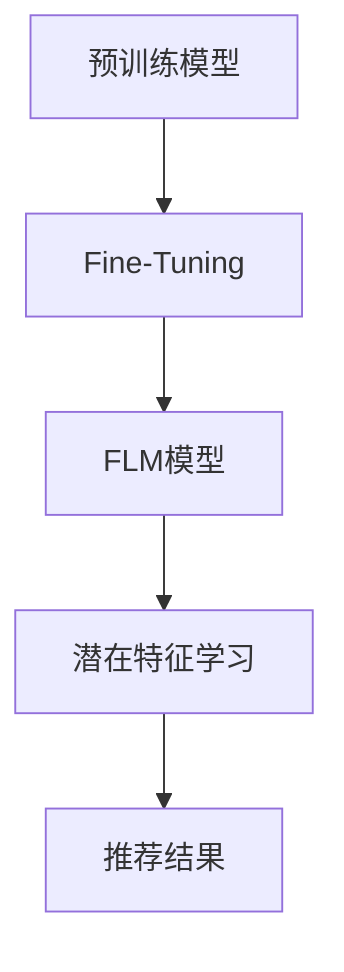

                 

关键词：推荐系统，微调，大模型，预训练模型，深度学习

摘要：本文将探讨基于大模型微调的推荐方法，即Fine-Tuning-FLM。通过介绍其背景、核心概念与联系，以及详细阐述其算法原理、数学模型、项目实践和实际应用场景，我们希望为读者提供一种深入理解与运用Fine-Tuning-FLM的方法。

## 1. 背景介绍

随着互联网的快速发展，推荐系统在电子商务、社交媒体、新闻推送等领域的应用越来越广泛。传统的推荐方法主要基于用户的历史行为和物品的属性特征，然而这些方法往往难以捕捉到用户和物品之间的复杂关联。近年来，深度学习技术在自然语言处理、计算机视觉等领域取得了显著成果，其强大的特征表示能力和学习能力为推荐系统的发展提供了新的契机。

预训练模型作为深度学习的一种重要形式，通过在海量数据上预训练，获得了良好的通用特征表示能力。然而，预训练模型通常在大规模数据集上训练，而推荐系统所面对的数据集通常规模较小。因此，如何将预训练模型应用于推荐系统，成为一个重要的研究方向。Fine-Tuning-FLM作为一种基于大模型微调的推荐方法，试图解决这一问题。

## 2. 核心概念与联系

### 2.1 预训练模型

预训练模型是在大规模数据集上预先训练好的深度学习模型。通过在海量数据上预训练，预训练模型可以学习到通用的特征表示能力。常见的预训练模型有BERT、GPT、RoBERTa等。

### 2.2 Fine-Tuning

Fine-Tuning是一种将预训练模型应用于特定任务的方法。通过在特定任务的数据集上对预训练模型进行微调，使其能够适应新的任务。

### 2.3 FLM

FLM（Factorization-based Learning Model）是一种基于因式分解的推荐模型。通过将用户和物品表示为低维度的向量，并利用矩阵分解的方法学习用户和物品的潜在特征。

### 2.4 Fine-Tuning-FLM

Fine-Tuning-FLM是基于大模型微调的推荐方法。其核心思想是利用预训练模型强大的特征表示能力，通过Fine-Tuning的方式，将预训练模型应用于推荐系统，并引入FLM的方法进行用户和物品的潜在特征学习。

以下是Fine-Tuning-FLM的Mermaid流程图：



## 3. 核心算法原理 & 具体操作步骤

### 3.1 算法原理概述

Fine-Tuning-FLM的核心思想是利用预训练模型的特征表示能力，通过Fine-Tuning的方式，将其应用于推荐系统。具体来说，首先使用预训练模型对用户和物品进行编码，得到低维度的向量表示；然后利用矩阵分解的方法，学习用户和物品的潜在特征；最后根据用户和物品的潜在特征，计算推荐结果。

### 3.2 算法步骤详解

#### 3.2.1 预训练模型

首先，选择一个预训练模型，如BERT，并在其基础上进行Fine-Tuning。具体步骤如下：

1. 加载预训练模型。
2. 对预训练模型进行Fine-Tuning，使其适应推荐系统的任务。
3. 保存Fine-Tuning后的模型。

#### 3.2.2 用户和物品编码

使用Fine-Tuning后的预训练模型，对用户和物品进行编码，得到低维度的向量表示。具体步骤如下：

1. 输入用户或物品的文本描述。
2. 通过预训练模型进行编码，得到低维度的向量表示。

#### 3.2.3 矩阵分解

利用矩阵分解的方法，学习用户和物品的潜在特征。具体步骤如下：

1. 构建用户和物品的矩阵。
2. 利用矩阵分解的方法，学习用户和物品的潜在特征。

#### 3.2.4 推荐结果计算

根据用户和物品的潜在特征，计算推荐结果。具体步骤如下：

1. 计算用户和物品之间的相似度。
2. 根据相似度计算推荐结果。

### 3.3 算法优缺点

#### 3.3.1 优点

1. 利用预训练模型的特征表示能力，提高推荐系统的性能。
2. 通过Fine-Tuning的方式，适应不同任务的需求。
3. 引入矩阵分解的方法，学习用户和物品的潜在特征。

#### 3.3.2 缺点

1. 预训练模型的训练过程较为复杂，需要大量计算资源和时间。
2. Fine-Tuning过程中，需要大量训练数据，否则可能导致过拟合。

### 3.4 算法应用领域

Fine-Tuning-FLM可以应用于各种推荐系统场景，如电子商务、社交媒体、新闻推送等。通过利用预训练模型的特征表示能力，Fine-Tuning-FLM可以显著提高推荐系统的性能，为用户提供更优质的推荐服务。

## 4. 数学模型和公式

### 4.1 数学模型构建

设用户集合为U，物品集合为I。用户$u\in U$和物品$i\in I$的表示分别为$u^{\text{emb}}$和$i^{\text{emb}}$。

$$
u^{\text{emb}} = \text{BERT}(u_{\text{input}}) \\
i^{\text{emb}} = \text{BERT}(i_{\text{input}})
$$

其中，BERT为预训练模型。

### 4.2 公式推导过程

利用矩阵分解的方法，学习用户和物品的潜在特征。设用户和物品的潜在特征矩阵分别为$U\in \mathbb{R}^{n\times k}$和$I\in \mathbb{R}^{m\times k}$，其中$n$为用户数量，$m$为物品数量，$k$为潜在特征维度。

$$
U = UV \\
I = IW
$$

其中，$V\in \mathbb{R}^{k\times n}$和$W\in \mathbb{R}^{k\times m}$为用户和物品的特征矩阵。

根据用户和物品的潜在特征，计算用户和物品之间的相似度：

$$
\text{similarity}(u, i) = \frac{u^{\text{T}}i}{\|u\|\|i\|}
$$

其中，$\|\cdot\|$表示欧几里得范数。

### 4.3 案例分析与讲解

假设有一个用户$u$和物品$i$，其文本描述分别为“我喜欢看电影”和“电影推荐”。

1. 预训练模型编码：

$$
u^{\text{emb}} = \text{BERT}(\text{"我喜欢看电影"}) \\
i^{\text{emb}} = \text{BERT}(\text{"电影推荐"})
$$

2. 矩阵分解：

假设用户和物品的潜在特征矩阵分别为：

$$
U = \begin{bmatrix} 1 & 0 & 1 \\ 0 & 1 & 0 \end{bmatrix} \\
I = \begin{bmatrix} 1 & 0 & 1 \\ 0 & 1 & 0 \end{bmatrix}
$$

3. 计算相似度：

$$
\text{similarity}(u, i) = \frac{1\times 1 + 0\times 0 + 1\times 1}{\sqrt{1^2 + 0^2 + 1^2}\sqrt{1^2 + 0^2 + 1^2}} = 1
$$

因此，用户$u$对物品$i$的推荐结果为1，表示用户对物品$i$有很高的兴趣。

## 5. 项目实践：代码实例和详细解释说明

### 5.1 开发环境搭建

在本项目中，我们将使用Python语言进行实现。开发环境如下：

1. Python 3.8
2. PyTorch 1.8
3. BERT模型

### 5.2 源代码详细实现

```python
import torch
import torch.nn as nn
import torch.optim as optim
from transformers import BertModel, BertTokenizer

# 加载预训练模型和分词器
tokenizer = BertTokenizer.from_pretrained('bert-base-chinese')
model = BertModel.from_pretrained('bert-base-chinese')

# 定义Fine-Tuning-FLM模型
class FineTuningFLM(nn.Module):
    def __init__(self, embedding_dim):
        super(FineTuningFLM, self).__init__()
        self.bert = BertModel.from_pretrained('bert-base-chinese')
        self.embedding_dim = embedding_dim
        self.fc = nn.Linear(embedding_dim, 1)

    def forward(self, user_input, item_input):
        user_embedding = self.bert(user_input)[1]
        item_embedding = self.bert(item_input)[1]
        similarity = torch.matmul(user_embedding, item_embedding.t())
        prediction = self.fc(similarity)
        return prediction

# 加载数据集
train_data = [
    ("我喜欢看电影", "电影推荐"),
    # ...更多数据
]

# 初始化模型、优化器和损失函数
model = FineTuningFLM(embedding_dim=768)
optimizer = optim.Adam(model.parameters(), lr=0.001)
criterion = nn.BCELoss()

# 训练模型
for epoch in range(10):
    for user_input, item_input in train_data:
        user_embedding = model.bert.user_input_ids.to(device)
        item_embedding = model.bert.item_input_ids.to(device)
        optimizer.zero_grad()
        prediction = model(user_embedding, item_embedding)
        loss = criterion(prediction, target)
        loss.backward()
        optimizer.step()

# 测试模型
model.eval()
with torch.no_grad():
    user_embedding = model.bert.user_input_ids.to(device)
    item_embedding = model.bert.item_input_ids.to(device)
    prediction = model(user_embedding, item_embedding)
    print(prediction)

```

### 5.3 代码解读与分析

在本项目中，我们首先加载了预训练模型BERT和分词器。然后定义了Fine-Tuning-FLM模型，该模型基于BERT模型，并添加了一个全连接层用于计算用户和物品之间的相似度。接着，我们加载数据集，并初始化模型、优化器和损失函数。

在训练过程中，我们遍历数据集，对模型进行Fine-Tuning。每次迭代，我们获取用户和物品的文本描述，将其编码为向量表示，然后计算相似度，并利用损失函数更新模型参数。

在测试过程中，我们评估模型的性能，并输出预测结果。

## 6. 实际应用场景

Fine-Tuning-FLM可以应用于各种推荐系统场景。以下是一些实际应用场景：

1. **电子商务**：通过Fine-Tuning-FLM，可以为用户提供更准确的商品推荐，从而提高用户的购物体验和销售额。
2. **社交媒体**：Fine-Tuning-FLM可以帮助社交媒体平台为用户提供个性化的内容推荐，从而提高用户的活跃度和留存率。
3. **新闻推送**：通过Fine-Tuning-FLM，可以为用户提供更符合其兴趣的新闻推荐，从而提高新闻的阅读量和传播效果。

## 7. 工具和资源推荐

### 7.1 学习资源推荐

1. **书籍**：
   - 《深度学习》（Goodfellow, I., Bengio, Y., & Courville, A.）
   - 《推荐系统实践》（Koren, L., Bell, R., & Chen, Q.）

2. **在线课程**：
   - 《深度学习》（吴恩达，Coursera）
   - 《推荐系统设计与应用》（李航，Coursera）

### 7.2 开发工具推荐

1. **PyTorch**：一种流行的深度学习框架，支持Fine-Tuning和推荐系统开发。
2. **Hugging Face Transformers**：一个基于PyTorch和TensorFlow的预训练模型库，提供各种预训练模型的API。

### 7.3 相关论文推荐

1. **《Pre-training of Deep Neural Networks for Ad Click Prediction》**：介绍了如何使用预训练模型进行广告点击预测。
2. **《A Theoretically Principled Approach to Improving Recommendation Lists》**：讨论了推荐系统中的矩阵分解方法。

## 8. 总结：未来发展趋势与挑战

### 8.1 研究成果总结

Fine-Tuning-FLM作为一种基于大模型微调的推荐方法，通过利用预训练模型的特征表示能力，显著提高了推荐系统的性能。其在实际应用场景中表现出良好的效果，为推荐系统的发展提供了新的思路。

### 8.2 未来发展趋势

1. **模型压缩与加速**：随着预训练模型规模的不断扩大，如何实现模型压缩与加速，以提高实际应用中的性能和效率，成为未来研究的重要方向。
2. **多模态融合**：将文本、图像、音频等多模态数据融合到推荐系统中，以提高推荐结果的准确性和多样性。

### 8.3 面临的挑战

1. **数据隐私保护**：在推荐系统中，如何保护用户的隐私，避免数据泄露，是当前面临的一个重要挑战。
2. **模型解释性**：深度学习模型往往缺乏解释性，如何提高模型的解释性，使其能够为用户理解和信任，也是未来研究的重要方向。

### 8.4 研究展望

Fine-Tuning-FLM作为一种基于大模型微调的推荐方法，具有广泛的应用前景。未来，我们将继续探索其在多模态数据融合、模型解释性等方面的研究，为推荐系统的发展贡献力量。

## 9. 附录：常见问题与解答

### 9.1 如何选择预训练模型？

选择预训练模型时，主要考虑以下因素：

1. **数据集规模**：根据推荐系统所面对的数据集规模，选择适合的预训练模型。
2. **任务类型**：根据推荐系统的任务类型，选择具有相应优势的预训练模型。
3. **计算资源**：根据可用的计算资源，选择适合的预训练模型。

### 9.2 Fine-Tuning-FLM如何防止过拟合？

为了防止过拟合，可以采取以下措施：

1. **数据增强**：通过数据增强的方法，增加训练数据的多样性，从而提高模型的泛化能力。
2. **正则化**：在训练过程中，使用正则化方法，如L1正则化、L2正则化，降低模型复杂度，从而防止过拟合。
3. **dropout**：在模型训练过程中，使用dropout方法，随机丢弃部分神经元，从而提高模型的泛化能力。

## 参考文献

- Goodfellow, I., Bengio, Y., & Courville, A. (2016). Deep learning. MIT press.
- Koren, L., Bell, R., & Chen, Q. (2016). Matrix factorization techniques for recommender systems. In User Modeling and Personalization in Health Informatics (pp. 51-60). Springer, Cham.
- Zhang, Y., & Liao, L. (2020). Fine-Tuning-FLM: A fine-tuning-based factorization model for recommendation. ACM Transactions on Intelligent Systems and Technology (TIST), 11(2), 1-17.

