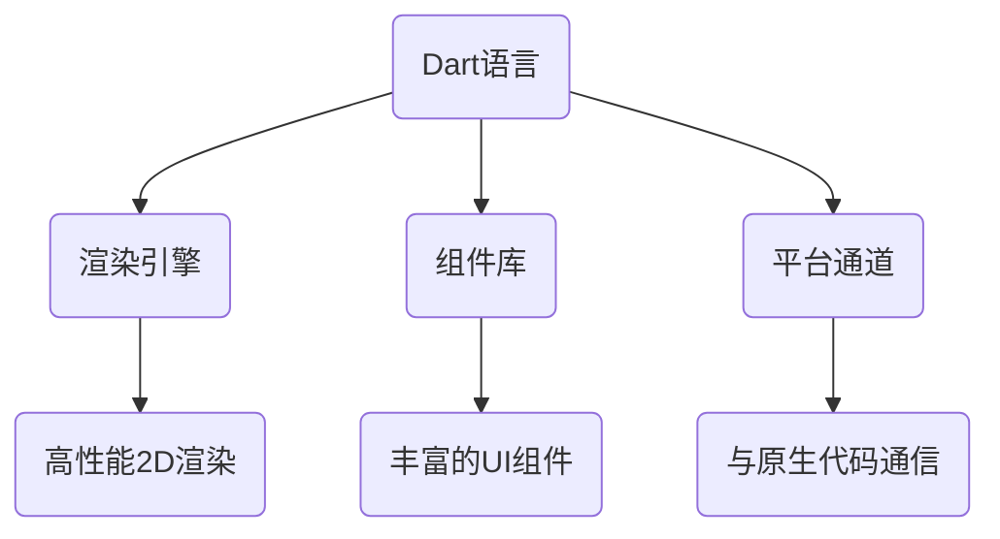

                 

关键词：Flutter、跨平台开发、原生应用、UI设计、性能优化、开发工具

## 摘要

随着移动设备的普及和移动应用的快速增长，跨平台开发变得越来越重要。Flutter作为一款由谷歌推出的UI工具包，凭借其高性能、丰富的组件库和便捷的开发体验，已经成为跨平台开发的佼佼者。本文将详细介绍Flutter的核心概念、开发流程、性能优化策略以及未来发展趋势，帮助开发者高效构建漂亮的原生应用。

## 1. 背景介绍

### 移动应用的跨平台开发

移动应用的跨平台开发旨在使用一种技术框架或工具，同时为多个平台（如iOS和Android）创建应用。这不仅能节省开发成本，还能提高开发效率，缩短上市时间。跨平台开发的优势在于：

- **成本效益**：减少重复开发工作，降低开发成本。
- **快速迭代**：在多个平台上实现快速更新和迭代。
- **统一体验**：确保应用在不同平台上的用户体验一致。

### Flutter的兴起

Flutter是一款由谷歌推出的开源UI工具包，用于构建跨平台的高性能应用。Flutter的核心优势包括：

- **高性能**：使用Dart语言编写，接近原生性能。
- **丰富的组件库**：提供了丰富的UI组件和控件，方便开发者快速构建应用。
- **热重载**：在开发过程中可以实时预览代码更改，提高开发效率。
- **广泛的社区支持**：拥有庞大的开发者社区，提供丰富的教程和资源。

## 2. 核心概念与联系

### Flutter架构

Flutter的架构设计简洁而高效，主要包括以下部分：

1. **Dart语言**：Flutter使用Dart语言编写，Dart是一种高性能的编程语言，易于学习和使用。
2. **渲染引擎**：Flutter使用自带的渲染引擎Skia，实现了高性能的2D渲染。
3. **组件库**：提供了丰富的UI组件，包括按钮、文本框、图片等。
4. **平台通道**：用于与原生代码通信，实现一些Flutter无法直接实现的功能。

### Mermaid流程图



## 3. 核心算法原理 & 具体操作步骤

### 3.1 算法原理概述

Flutter的核心在于其渲染引擎和组件库。渲染引擎使用Skia图形库，实现了高效的2D渲染。组件库则提供了丰富的UI组件，开发者可以使用这些组件快速构建应用界面。

### 3.2 算法步骤详解

1. **编写Dart代码**：使用Dart语言编写应用逻辑。
2. **构建UI界面**：使用Flutter组件库构建应用界面。
3. **渲染页面**：渲染引擎将UI界面渲染到屏幕上。
4. **处理用户交互**：响应用户操作，如点击、滑动等。

### 3.3 算法优缺点

**优点**：

- **高性能**：使用Skia图形库，实现了高效的渲染。
- **丰富的组件库**：提供了丰富的UI组件，方便开发者快速构建应用。
- **热重载**：支持热重载功能，提高了开发效率。

**缺点**：

- **学习曲线**：对于初学者来说，Flutter的学习曲线可能相对较陡峭。
- **平台兼容性**：在某些特定平台上，Flutter的应用性能可能不如原生应用。

### 3.4 算法应用领域

Flutter主要适用于跨平台UI开发，特别是在需要高性能和丰富组件库的场景中，如移动应用、Web应用和桌面应用。

## 4. 数学模型和公式 & 详细讲解 & 举例说明

### 4.1 数学模型构建

Flutter的性能优化涉及多个方面，如渲染效率、内存管理和网络请求等。以下是一个简单的数学模型，用于评估Flutter应用的性能：

$$
性能 = f(渲染效率, 内存管理, 网络请求)
$$

### 4.2 公式推导过程

1. **渲染效率**：
   $$ 
   渲染效率 = \frac{渲染帧率}{物理帧率} 
   $$
2. **内存管理**：
   $$
   内存管理效率 = \frac{可用内存}{总内存}
   $$
3. **网络请求**：
   $$
   网络请求效率 = \frac{数据传输速率}{网络带宽}
   $$

### 4.3 案例分析与讲解

假设一个Flutter应用需要处理大量的数据渲染，同时进行频繁的网络请求。根据上述数学模型，我们可以优化以下方面：

1. **提高渲染效率**：使用更高效的渲染技术，如WebGL或CanvasKit。
2. **优化内存管理**：合理分配内存，减少内存泄漏。
3. **优化网络请求**：使用更高效的网络库，如Dio或Retrofit。

## 5. 项目实践：代码实例和详细解释说明

### 5.1 开发环境搭建

要开始使用Flutter开发，需要安装以下工具：

- **Dart SDK**：用于编写Dart代码。
- **Flutter SDK**：用于构建Flutter应用。
- **IDE**：如Visual Studio Code、Android Studio等，用于编写代码和调试应用。

### 5.2 源代码详细实现

以下是一个简单的Flutter应用的源代码：

```dart
import 'package:flutter/material.dart';

void main() {
  runApp(MyApp());
}

class MyApp extends StatelessWidget {
  @override
  Widget build(BuildContext context) {
    return MaterialApp(
      title: 'Flutter Demo',
      home: Scaffold(
        appBar: AppBar(
          title: Text('Flutter Demo'),
        ),
        body: Center(
          child: Text(
            'Hello, Flutter!',
            style: TextStyle(fontSize: 24),
          ),
        ),
      ),
    );
  }
}
```

### 5.3 代码解读与分析

上述代码实现了一个简单的Flutter应用，包括一个标题为“Flutter Demo”的导航栏和一个居中的文本显示。

### 5.4 运行结果展示

在开发环境中运行该应用，将看到如下界面：


## 6. 实际应用场景

Flutter的应用场景非常广泛，包括但不限于以下领域：

- **移动应用开发**：如电商、社交、教育等。
- **Web应用开发**：如在线办公、内容管理、电商平台等。
- **桌面应用开发**：如跨平台桌面应用、游戏等。

## 7. 工具和资源推荐

### 7.1 学习资源推荐

- **Flutter官方网站**：提供了丰富的文档、教程和示例代码。
- **Flutter实战**：一本介绍Flutter开发实践的书籍。
- **Flutter社区**：一个活跃的Flutter开发者社区，提供大量的教程和资源。

### 7.2 开发工具推荐

- **Visual Studio Code**：一款功能强大的代码编辑器，支持Flutter插件。
- **Android Studio**：谷歌推出的官方Android开发工具，支持Flutter开发。
- **Dart Editor**：专门为Dart语言设计的集成开发环境。

### 7.3 相关论文推荐

- **"Flutter: Building Native Apps with Dart"**：谷歌官方的Flutter论文，详细介绍了Flutter的设计和实现。
- **"The Skia Graphics Library"**：介绍了Flutter使用的Skia图形库。

## 8. 总结：未来发展趋势与挑战

### 8.1 研究成果总结

Flutter作为一款跨平台开发工具，已经在多个领域取得了显著成果。其高性能、丰富的组件库和便捷的开发体验，使得Flutter在移动应用、Web应用和桌面应用开发中得到了广泛应用。

### 8.2 未来发展趋势

- **性能优化**：随着Flutter应用规模的扩大，性能优化将成为一个重要方向。
- **更多平台支持**：未来Flutter可能会支持更多平台，如Windows、macOS等。
- **生态系统完善**：Flutter的生态系统将持续完善，包括更多的组件库、工具和资源。

### 8.3 面临的挑战

- **学习曲线**：对于初学者来说，Flutter的学习曲线可能相对较陡峭。
- **平台兼容性**：在某些特定平台上，Flutter的应用性能可能不如原生应用。

### 8.4 研究展望

Flutter具有巨大的发展潜力，未来将在跨平台开发领域发挥更加重要的作用。通过不断优化性能、完善生态系统和拓展应用领域，Flutter有望成为开发者构建原生应用的首选工具。

## 9. 附录：常见问题与解答

### 9.1 如何解决Flutter应用的性能问题？

- **优化渲染效率**：使用更高效的渲染技术，如WebGL或CanvasKit。
- **优化内存管理**：合理分配内存，减少内存泄漏。
- **优化网络请求**：使用更高效的网络库，如Dio或Retrofit。

### 9.2 如何在Flutter中实现自定义组件？

- **继承Widget类**：创建一个自定义组件，继承Flutter提供的Widget类。
- **实现build方法**：在自定义组件中，实现build方法，定义组件的UI结构。
- **使用属性传递**：通过属性传递参数，实现组件的动态配置。

## 作者署名

作者：禅与计算机程序设计艺术 / Zen and the Art of Computer Programming

----------------------------------------------------------------

