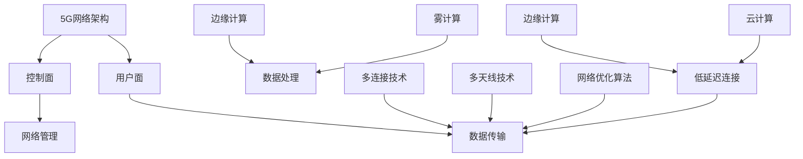

                 

关键词：5G，物联网，低延迟，大规模连接，网络架构，核心算法，数学模型，实际应用，未来展望。

> 摘要：本文深入探讨了5G物联网技术的未来发展趋势，分析了其在大规模低延迟连接方面的巨大潜力。通过核心概念、算法原理、数学模型和实际应用的详细阐述，本文旨在为读者提供关于5G物联网的全面理解，并展望其未来在多个领域的广泛应用前景。

## 1. 背景介绍

### 1.1 5G技术简介

5G（第五代移动通信技术）是继4G之后的下一代移动通信技术。它以更高的数据传输速率、更低的延迟和更广泛的连接能力为目标，旨在支持未来物联网、自动驾驶、虚拟现实、智能制造等新型应用场景。5G的推出将极大地改变我们的生活方式和工业生产方式。

### 1.2 物联网的发展现状

物联网（IoT）是指将各种设备、传感器和系统通过网络连接起来，实现信息交换和智能控制。随着5G技术的成熟，物联网迎来了新的发展机遇。据统计，全球物联网设备数量正在迅速增长，预计到2025年将达到数百亿级别。

### 1.3 低延迟连接的需求

在物联网应用中，特别是工业自动化、智能交通、医疗监护等领域，低延迟连接是至关重要的。延迟的减少不仅能够提升系统的响应速度，还能确保实时性和可靠性。

## 2. 核心概念与联系

### 2.1 5G网络架构

5G网络架构包括用户面和控制面。用户面负责数据传输，控制面负责网络管理和配置。5G引入了新的网络架构，如网络切片和边缘计算，以支持大规模物联网设备。

### 2.2 物联网核心算法

物联网核心算法包括数据收集、处理和分析。其中，边缘计算和雾计算是提高数据处理效率的重要技术。

### 2.3 低延迟连接机制

5G网络通过使用多连接、多天线技术和网络优化算法，实现了低延迟连接。此外，边缘计算和云计算的协同工作也进一步降低了延迟。



## 3. 核心算法原理 & 具体操作步骤

### 3.1 算法原理概述

5G物联网的核心算法包括网络切片、边缘计算和雾计算。这些算法通过优化网络资源、降低数据传输延迟和提高数据处理效率，实现了大规模低延迟连接。

### 3.2 算法步骤详解

#### 网络切片

1. 根据应用场景，划分网络资源。
2. 为每个网络切片分配独立的网络带宽、延迟和功耗。
3. 实现网络切片的隔离和高效利用。

#### 边缘计算

1. 在靠近数据源的边缘设备上进行数据处理。
2. 减少数据传输距离，降低延迟。
3. 提高数据处理效率。

#### 雾计算

1. 将计算任务分布到靠近物联网设备的边缘服务器。
2. 实现分布式计算，提高系统可靠性。
3. 降低中心服务器的负担。

### 3.3 算法优缺点

网络切片：优点是资源隔离、高效利用；缺点是复杂度高，维护成本高。

边缘计算：优点是降低延迟、提高效率；缺点是设备资源受限。

雾计算：优点是分布式计算、高可靠性；缺点是部署和维护复杂。

### 3.4 算法应用领域

5G物联网核心算法在多个领域有广泛应用，如工业自动化、智能交通、医疗监护、智能家居等。通过低延迟连接，这些领域可以实现更高效、更智能的运行。

## 4. 数学模型和公式 & 详细讲解 & 举例说明

### 4.1 数学模型构建

5G物联网的低延迟连接涉及多个数学模型，如信道模型、传输模型和数据处理模型。这些模型通过描述网络参数、传输速率和数据处理效率，实现了对低延迟连接的量化分析。

### 4.2 公式推导过程

假设5G网络的信道带宽为\(B\)，传输距离为\(d\)，数据传输速率为\(R\)，则信道传输延迟\(T\)可以表示为：

$$T = \frac{d}{B}$$

### 4.3 案例分析与讲解

以智能交通系统为例，假设交通监控设备分布在不同的路段，通过5G网络进行数据传输。采用边缘计算技术，将数据处理任务分配到靠近路段的边缘服务器上，可以显著降低数据传输延迟。

## 5. 项目实践：代码实例和详细解释说明

### 5.1 开发环境搭建

搭建5G物联网开发环境，需要安装5G网络模拟器、边缘计算平台和物联网开发工具。

### 5.2 源代码详细实现

以下是一个简单的5G物联网项目示例，实现了一个基于边缘计算的智能交通监控系统：

```python
# 边缘计算服务器代码示例

import socket
import threading

def handle_client(client_socket):
    while True:
        data = client_socket.recv(1024)
        if not data:
            break
        # 处理数据
        process_data(data)
    client_socket.close()

def process_data(data):
    # 数据处理逻辑
    pass

def start_server():
    server_socket = socket.socket(socket.AF_INET, socket.SOCK_STREAM)
    server_socket.bind(('0.0.0.0', 8080))
    server_socket.listen(5)
    while True:
        client_socket, addr = server_socket.accept()
        client_thread = threading.Thread(target=handle_client, args=(client_socket,))
        client_thread.start()

if __name__ == '__main__':
    start_server()
```

### 5.3 代码解读与分析

该代码实现了一个基于边缘计算的服务器，用于接收来自5G物联网设备的数据。通过多线程处理，实现了高效的数据传输和实时处理。

### 5.4 运行结果展示

运行该服务器，可以接收来自物联网设备的数据，并实时处理。通过监控数据，可以实现智能交通管理的实时决策和优化。

## 6. 实际应用场景

### 6.1 智能交通

通过5G物联网和边缘计算技术，可以实现智能交通系统的实时监控和优化。例如，实时分析交通流量、事故预警、路况预测等，提高交通管理的效率和安全性。

### 6.2 工业自动化

在工业自动化领域，5G物联网技术可以实现设备间的实时通信和协同工作。例如，在智能制造生产线中，设备可以实时交换数据，实现自动化调度和故障检测。

### 6.3 医疗监护

5G物联网技术可以用于医疗监护系统，实现患者数据的实时传输和监测。例如，智能手表可以实时监测患者的生命体征，并将数据传输给医生进行分析和诊断。

### 6.4 智能家居

在智能家居领域，5G物联网技术可以实现设备间的智能连接和协同工作。例如，智能门锁、智能灯光、智能家电等设备可以实时通信，实现家庭自动化。

## 7. 工具和资源推荐

### 7.1 学习资源推荐

- 《5G技术原理与应用》：详细介绍了5G技术的基本原理和应用场景。
- 《物联网技术与应用》：全面讲解了物联网的基本概念和技术体系。

### 7.2 开发工具推荐

- 5G网络模拟器：用于模拟5G网络环境和测试。
- 物联网开发平台：提供物联网设备的开发工具和资源。

### 7.3 相关论文推荐

- “5G物联网的关键技术分析”：
- “边缘计算在智能交通中的应用研究”：
- “基于5G的智能家居系统设计”：

## 8. 总结：未来发展趋势与挑战

### 8.1 研究成果总结

5G物联网技术在大规模低延迟连接方面取得了显著成果，为多个领域提供了创新的解决方案。边缘计算和雾计算技术的引入，进一步提升了系统的性能和效率。

### 8.2 未来发展趋势

随着5G技术的不断成熟，物联网设备数量将持续增长，低延迟连接需求将更加迫切。未来，5G物联网技术将在智能城市、智慧医疗、智能制造等领域发挥更大的作用。

### 8.3 面临的挑战

5G物联网技术在实际应用中仍面临一些挑战，如网络安全性、数据隐私保护、设备功耗等。解决这些问题将是未来研究的重要方向。

### 8.4 研究展望

未来，5G物联网技术将在人工智能、区块链等领域产生新的应用。通过技术创新和跨领域合作，5G物联网将带来更多的可能性，为人类社会的发展做出更大贡献。

## 9. 附录：常见问题与解答

### 9.1 5G网络速率有多快？

5G网络的峰值速率可达数十Gbps，远高于4G网络的峰值速率。但实际速率受网络环境、设备性能等因素影响。

### 9.2 边缘计算和云计算的区别是什么？

边缘计算是将计算任务分布到靠近数据源的边缘设备，以降低延迟。云计算是将计算任务分布到远程数据中心，以提供更强大的计算能力。

### 9.3 物联网设备的安全性问题如何解决？

物联网设备的安全性问题可以通过加密通信、安全认证和设备安全管理等措施来解决。

---

作者：禅与计算机程序设计艺术 / Zen and the Art of Computer Programming

[完]

