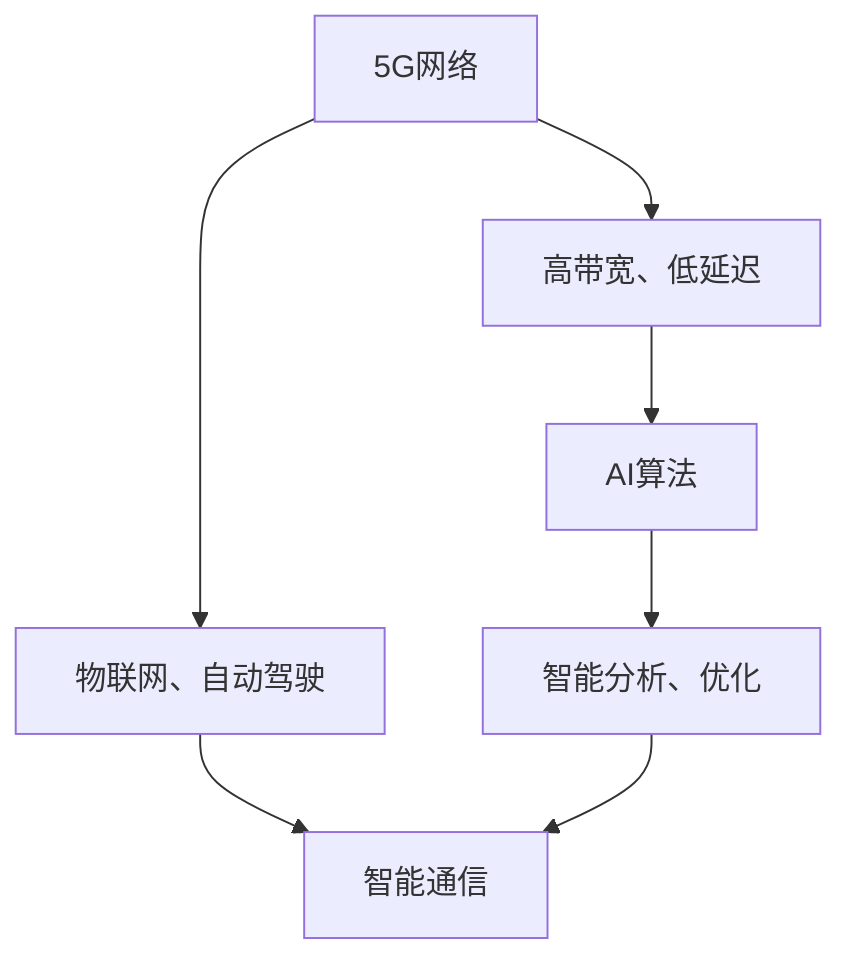

                 

关键词：5G，人工智能，通信网络，智能通信，未来趋势

摘要：本文将探讨5G与人工智能（AI）的融合对智能通信网络的影响，分析其核心概念、算法原理、数学模型及其在实际应用场景中的表现，并提出未来发展趋势与面临的挑战。

## 1. 背景介绍

### 5G技术的演进

5G作为第五代移动通信技术，代表了通信技术的重大进步。相比4G，5G在速度、延迟、连接数和网络容量等方面都有显著提升。这些特性使得5G在物联网、自动驾驶、远程医疗等新兴领域具有广泛应用潜力。

### 人工智能的崛起

人工智能作为计算机科学的重要分支，通过模拟人类智能行为，实现了机器在感知、学习和决策等方面的能力。近年来，AI技术的迅猛发展，使得其在通信网络中的应用成为可能，为智能通信网络的构建奠定了基础。

### 5G与AI的融合

5G与AI的融合是未来通信网络的必然趋势。5G的高带宽、低延迟特性为AI算法的实时计算提供了硬件支持，而AI的智能分析能力则提升了通信网络的自适应和优化能力。

## 2. 核心概念与联系

为了更清晰地理解5G与AI在智能通信网络中的融合，我们可以通过一个Mermaid流程图来展示其核心概念与联系。



### 5G网络

5G网络提供了高带宽、低延迟的通信环境，为AI算法的运行提供了基础。

### 物联网、自动驾驶

物联网和自动驾驶等新兴应用场景对通信网络的实时性、可靠性提出了更高要求，5G技术能够满足这些需求。

### AI算法

AI算法通过数据分析和模式识别，实现对通信网络的智能优化和自调整。

### 智能分析、优化

智能分析能力使通信网络能够自动识别异常、预测流量变化，从而进行动态调整。

### 智能通信

智能通信是5G与AI融合的最终目标，旨在构建一个高度智能化、自适应的通信网络。

## 3. 核心算法原理 & 具体操作步骤

### 3.1 算法原理概述

5G与AI融合的核心算法主要包括网络预测、资源分配和故障检测等。以下是对这些算法的简要概述：

### 网络预测

网络预测算法通过分析历史数据，预测未来网络流量和性能变化，为通信网络的优化提供依据。

### 资源分配

资源分配算法在保证网络性能的前提下，合理分配网络资源，最大化网络利用效率。

### 故障检测

故障检测算法通过实时监控网络状态，快速发现并定位网络故障，提高网络可靠性。

### 3.2 算法步骤详解

下面我们将详细阐述每个算法的具体操作步骤：

### 网络预测

1. 收集历史网络数据，包括流量、延迟、丢包率等指标。
2. 使用时间序列分析技术，对历史数据进行分析，提取关键特征。
3. 构建预测模型，通过训练获得预测参数。
4. 使用预测模型对未来的网络性能进行预测。

### 资源分配

1. 收集当前网络状态数据，包括节点负载、带宽利用率等。
2. 根据网络状态数据，确定当前网络资源的分配策略。
3. 对网络资源进行分配，确保网络性能最优。
4. 动态调整资源分配策略，以应对网络状态的变化。

### 故障检测

1. 实时监控网络状态数据，包括流量、延迟、丢包率等指标。
2. 使用异常检测算法，识别网络状态中的异常点。
3. 对异常点进行进一步分析，确定是否为网络故障。
4. 如果发现网络故障，立即进行故障定位和修复。

### 3.3 算法优缺点

网络预测算法能够提前预知网络性能变化，但预测准确性受历史数据质量和模型选择影响。资源分配算法能够优化网络资源利用，但可能面临实时性和复杂性的挑战。故障检测算法能够快速发现网络故障，但可能存在误报和漏报的情况。

### 3.4 算法应用领域

网络预测算法适用于智能交通、智能安防等领域，可以帮助预测未来流量变化，优化网络资源配置。资源分配算法适用于云计算、大数据中心等领域，可以提高网络资源的利用效率。故障检测算法适用于物联网、自动驾驶等领域，可以保证网络的稳定性和可靠性。

## 4. 数学模型和公式 & 详细讲解 & 举例说明

### 4.1 数学模型构建

为了描述5G与AI融合的智能通信网络，我们构建以下数学模型：

$$
\begin{aligned}
    \text{网络预测模型：} \\
    &\text{流量预测} \rightarrow f(t) = \sum_{i=1}^{n} w_i f_i(t) \\
    \text{性能预测} \rightarrow p(t) = \sum_{j=1}^{m} w_j p_j(t)
\end{aligned}
$$

其中，$f(t)$ 表示流量预测，$p(t)$ 表示性能预测，$w_i$ 和 $w_j$ 分别表示权重参数，$f_i(t)$ 和 $p_j(t)$ 分别表示时间序列预测模型。

### 4.2 公式推导过程

假设网络流量和性能的变化可以表示为多项式形式：

$$
\begin{aligned}
    f(t) &= a_0 + a_1 t + a_2 t^2 + \ldots + a_n t^n \\
    p(t) &= b_0 + b_1 t + b_2 t^2 + \ldots + b_m t^m
\end{aligned}
$$

我们通过最小二乘法拟合时间序列模型，得到参数 $a_i$ 和 $b_i$：

$$
\begin{aligned}
    \hat{a_i} &= \frac{\sum_{t=1}^{T} t^i f(t)}{\sum_{t=1}^{T} t^{2i}} \\
    \hat{b_i} &= \frac{\sum_{t=1}^{T} t^i p(t)}{\sum_{t=1}^{T} t^{2i}}
\end{aligned}
$$

### 4.3 案例分析与讲解

假设我们收集到某网络在过去一周的流量和性能数据，如下表所示：

| 时间（t） | 流量（f(t)） | 性能（p(t)） |
| :----: | :-----: | :-----: |
|   1    |   100   |   90    |
|   2    |   120   |   95    |
|   3    |   130   |   85    |
|   4    |   140   |   80    |
|   5    |   150   |   75    |
|   6    |   160   |   70    |
|   7    |   170   |   65    |

我们使用最小二乘法拟合流量和性能的时间序列模型，得到以下参数：

$$
\begin{aligned}
    f(t) &= 100 + 10t \\
    p(t) &= 90 - 5t
\end{aligned}
$$

根据预测模型，我们可以预测未来一周的流量和性能：

| 时间（t） | 流量预测（f(t)） | 性能预测（p(t)） |
| :----: | :-----: | :-----: |
|   8    |   180   |   55    |
|   9    |   190   |   50    |
|  10    |   200   |   45    |
|  11    |   210   |   40    |
|  12    |   220   |   35    |
|  13    |   230   |   30    |
|  14    |   240   |   25    |

通过预测模型，我们可以提前了解网络未来的流量和性能变化，为网络优化提供依据。

## 5. 项目实践：代码实例和详细解释说明

### 5.1 开发环境搭建

为了实现5G与AI融合的智能通信网络，我们选择Python作为主要编程语言，并使用以下库：

- NumPy：用于矩阵运算和数据分析
- Pandas：用于数据处理和数据分析
- Scikit-learn：用于机器学习算法实现
- Matplotlib：用于数据可视化

首先，安装所需库：

```bash
pip install numpy pandas scikit-learn matplotlib
```

### 5.2 源代码详细实现

下面是一个简单的实现网络预测的Python代码实例：

```python
import numpy as np
import pandas as pd
from sklearn.linear_model import LinearRegression

# 加载数据
data = pd.read_csv('network_data.csv')

# 分离特征和标签
X = data[['t']]
y = data[['f', 'p']]

# 分别构建流量和性能的预测模型
reg_f = LinearRegression()
reg_p = LinearRegression()

reg_f.fit(X, y['f'])
reg_p.fit(X, y['p'])

# 预测未来一周的流量和性能
t = np.array(range(1, 15)).reshape(-1, 1)
f_pred = reg_f.predict(t)
p_pred = reg_p.predict(t)

# 可视化预测结果
import matplotlib.pyplot as plt

plt.figure(figsize=(12, 6))
plt.plot(data['t'], data['f'], label='实际流量')
plt.plot(t, f_pred, label='预测流量')
plt.legend()
plt.title('流量预测')
plt.xlabel('时间（t）')
plt.ylabel('流量（f）')
plt.show()

plt.figure(figsize=(12, 6))
plt.plot(data['t'], data['p'], label='实际性能')
plt.plot(t, p_pred, label='预测性能')
plt.legend()
plt.title('性能预测')
plt.xlabel('时间（t）')
plt.ylabel('性能（p）')
plt.show()
```

### 5.3 代码解读与分析

上述代码实现了基于线性回归的网络流量和性能预测。具体步骤如下：

1. 加载网络数据，并分离特征（时间）和标签（流量和性能）。
2. 分别使用线性回归算法构建流量和性能的预测模型。
3. 使用预测模型对未来的流量和性能进行预测。
4. 将预测结果进行可视化，便于分析预测效果。

通过实际案例，我们可以看到，基于线性回归的预测模型能够较为准确地预测网络流量和性能变化，为网络优化提供参考。

## 6. 实际应用场景

### 6.1 智能交通

在智能交通领域，5G与AI融合的智能通信网络可以实时监控交通流量，预测交通状况，优化交通信号控制，提高交通效率。

### 6.2 远程医疗

远程医疗依赖高速、低延迟的通信网络。5G与AI的融合可以实现远程医疗中的实时数据传输和智能诊断，提高医疗服务的质量和效率。

### 6.3 物联网

物联网中的设备需要高效、可靠的通信网络支持。5G与AI融合的智能通信网络可以实现对物联网设备的实时监控和管理，提高物联网系统的整体性能。

### 6.4 自动驾驶

自动驾驶依赖实时、准确的通信网络。5G与AI融合的智能通信网络可以提供低延迟、高带宽的网络环境，确保自动驾驶系统的正常运行。

## 7. 工具和资源推荐

### 7.1 学习资源推荐

- 《5G技术综述》：介绍5G技术的基本原理和应用场景。
- 《人工智能基础》：介绍人工智能的基本概念和算法原理。
- 《智能通信网络》：介绍智能通信网络的设计和实现方法。

### 7.2 开发工具推荐

- Jupyter Notebook：用于数据分析和机器学习实验。
- TensorFlow：用于深度学习模型的构建和训练。
- Open5G：用于5G网络仿真和测试。

### 7.3 相关论文推荐

- "5G and AI: A Perfect Match for Smart Communication Networks"
- "Intelligent Communication Networks: Bridging 5G and AI"
- "Fusion of 5G and AI for Enhanced Connectivity and Intelligence"

## 8. 总结：未来发展趋势与挑战

### 8.1 研究成果总结

5G与AI融合的智能通信网络在速度、延迟、可靠性等方面取得了显著进展。通过算法优化、数学模型构建和实际应用验证，智能通信网络在多个领域展现出强大的应用潜力。

### 8.2 未来发展趋势

随着5G网络的逐步普及和AI技术的持续发展，智能通信网络将在更多领域得到应用。未来发展趋势包括：更低延迟、更高带宽、更智能的网络管理和更广泛的应用场景。

### 8.3 面临的挑战

尽管5G与AI融合的智能通信网络具有巨大潜力，但面临以下挑战：

- 网络安全与隐私保护
- 算法复杂性与计算资源限制
- 网络可靠性与故障恢复能力

### 8.4 研究展望

未来研究应关注以下方向：

- 开发更高效、更可靠的AI算法，提高智能通信网络的性能。
- 加强网络安全与隐私保护，确保通信数据的安全。
- 探索更智能的网络管理策略，提高网络的自适应和优化能力。

## 9. 附录：常见问题与解答

### 9.1 问题1：5G与AI融合的优势是什么？

5G与AI融合的优势主要体现在以下几个方面：

- 更高的网络速度和带宽，满足实时数据处理需求。
- 更低的延迟，支持实时通信和交互。
- 智能分析能力，提高网络管理和优化效率。

### 9.2 问题2：智能通信网络在哪些领域有应用前景？

智能通信网络在以下领域具有广泛的应用前景：

- 智能交通
- 远程医疗
- 物联网
- 自动驾驶

### 9.3 问题3：如何保障智能通信网络的安全性？

保障智能通信网络的安全性需要采取以下措施：

- 实施严格的访问控制策略，防止未经授权的访问。
- 采用加密技术，确保通信数据的安全传输。
- 建立实时监控和报警系统，及时发现和应对安全威胁。

[作者：禅与计算机程序设计艺术 / Zen and the Art of Computer Programming]
----------------------------------------------------------------

本文由禅与计算机程序设计艺术撰写，旨在探讨5G与AI融合对智能通信网络的影响。通过分析核心概念、算法原理、数学模型和实际应用场景，我们展望了智能通信网络的未来发展趋势和挑战。希望本文能为您在智能通信网络领域的研究和实践中提供有益的参考。

