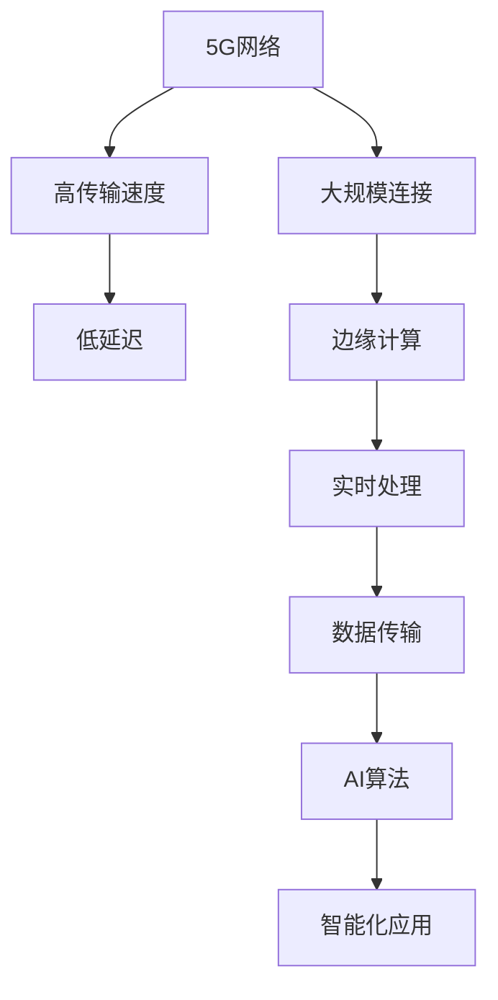

                 

关键词：5G，AI，注意力经济，新引擎，技术进步，产业应用，未来发展

> 摘要：本文深入探讨了5G与AI相结合，如何成为推动注意力经济的新引擎。首先，我们分析了5G技术的基本特点及其在传输速度、低延迟和大规模连接方面的优势。接着，阐述了AI技术的核心原理和应用领域，特别是其在数据处理、模式识别和预测分析方面的优势。随后，我们探讨了5G和AI如何通过结合实现更高效的数据传输和智能化应用，为注意力经济提供强大的动力。此外，本文还讨论了这一结合在不同产业中的应用案例，并展望了未来的发展趋势和面临的挑战。

## 1. 背景介绍

### 1.1 5G技术的基本特点

5G（第五代移动通信技术）是继2G、3G、4G之后的新一代通信技术。它主要特点在于：

- **高传输速度**：5G网络的下载速度可以达到每秒数十千兆比特，比4G快数十倍。
- **低延迟**：5G的端到端延迟可以低至1毫秒，这对于实时应用至关重要。
- **大规模连接**：5G支持连接更多的设备和传感器，理论上可以达到每平方公里上百万个连接。

### 1.2 AI技术的核心原理与应用

人工智能（AI）是计算机科学的一个分支，旨在使机器具备人类智能的能力。核心原理包括：

- **机器学习**：通过数据训练模型，使机器能够从经验中学习并做出决策。
- **深度学习**：利用神经网络模型，特别是深度神经网络（DNN），处理复杂数据。
- **自然语言处理**：使计算机能够理解和生成人类语言。

AI在多个领域有广泛应用，包括图像识别、语音识别、推荐系统、自动驾驶等。

## 2. 核心概念与联系

### 2.1 5G与AI的结合原理

5G与AI的结合主要表现在以下几个方面：

- **数据传输**：5G的高速传输能力为AI算法提供了大量实时数据。
- **实时处理**：5G的低延迟特性使得AI算法能够实时响应，提高了系统的智能化程度。
- **边缘计算**：5G网络与AI算法的结合，使得边缘设备能够进行局部计算，减少了中心服务器的负担。

### 2.2 架构原理图



## 3. 核心算法原理 & 具体操作步骤

### 3.1 算法原理概述

5G与AI的结合主要通过以下几个核心算法实现：

- **深度学习网络**：用于处理和分析大规模数据。
- **卷积神经网络（CNN）**：用于图像识别。
- **循环神经网络（RNN）**：用于序列数据。
- **强化学习**：用于智能决策。

### 3.2 算法步骤详解

#### 3.2.1 数据收集与预处理

- 收集大规模数据，包括图像、文本、音频等。
- 预处理数据，如去噪、标准化、数据增强等。

#### 3.2.2 模型训练与优化

- 设计并训练深度学习模型。
- 使用验证集和测试集优化模型。

#### 3.2.3 实时推理与决策

- 利用训练好的模型进行实时推理。
- 基于推理结果做出智能决策。

### 3.3 算法优缺点

#### 优点：

- **高速数据传输**：5G的高速传输能力确保了数据及时到达。
- **低延迟响应**：低延迟特性使得系统更加实时和高效。
- **大规模数据处理**：5G支持大规模连接，能够处理海量数据。

#### 缺点：

- **能耗问题**：5G基站和设备的能耗较高。
- **安全性问题**：5G网络的安全性仍需进一步改进。

### 3.4 算法应用领域

- **自动驾驶**：利用5G实现实时交通数据和传感器数据的处理。
- **智能医疗**：通过5G实现远程医疗诊断和实时数据监测。
- **智能家居**：利用5G实现设备之间的智能互联。

## 4. 数学模型和公式 & 详细讲解 & 举例说明

### 4.1 数学模型构建

#### 4.1.1 深度学习模型

深度学习模型通常由多层神经元组成，每个神经元接收前一层神经元的输出，并通过激活函数进行变换。

$$
z = \sum_{i=1}^{n} w_i * x_i + b \\
a = \sigma(z)
$$

其中，$z$是输入，$w_i$和$b$是权重和偏置，$\sigma$是激活函数。

#### 4.1.2 卷积神经网络（CNN）

CNN用于图像识别，其主要结构包括卷积层、池化层和全连接层。

$$
\text{Convolutional Layer}: f(x) = \text{Conv}_k * x + b \\
\text{Pooling Layer}: y = \text{Pooling}(f(x))
$$

其中，$k$是卷积核大小，$b$是偏置。

### 4.2 公式推导过程

#### 4.2.1 深度学习前向传播

前向传播是深度学习模型的核心过程，用于计算每个神经元的输出。

$$
z_l = \sum_{i=1}^{n} w_{li} * a_{l-1,i} + b_l \\
a_l = \sigma(z_l)
$$

其中，$a_l$是第$l$层的输出，$w_{li}$和$b_l$分别是权重和偏置。

#### 4.2.2 卷积神经网络前向传播

卷积神经网络的前向传播包括卷积操作和激活函数。

$$
\text{Convolution}: (f(x))^i = \sum_{j=1}^{k} w_j * x_j + b \\
\text{Activation}: a_i = \sigma(f(x))^i
$$

### 4.3 案例分析与讲解

#### 4.3.1 自动驾驶

假设我们有一个自动驾驶系统，利用5G与AI技术进行实时路况分析和决策。

- **数据收集**：通过车载传感器收集道路、车辆和行人的实时数据。
- **预处理**：对数据进行清洗和标准化。
- **模型训练**：使用CNN和RNN训练自动驾驶模型。
- **实时推理**：利用训练好的模型对实时数据进行处理，做出驾驶决策。

## 5. 项目实践：代码实例和详细解释说明

### 5.1 开发环境搭建

- **硬件要求**：一台配置较高的计算机或服务器。
- **软件要求**：Python编程环境，TensorFlow库。

### 5.2 源代码详细实现

```python
import tensorflow as tf
import numpy as np

# 定义卷积层
conv1 = tf.keras.layers.Conv2D(filters=32, kernel_size=(3, 3), activation='relu')

# 定义池化层
pool1 = tf.keras.layers.MaxPooling2D(pool_size=(2, 2))

# 定义全连接层
dense = tf.keras.layers.Dense(units=10, activation='softmax')

# 构建模型
model = tf.keras.Sequential([
    conv1,
    pool1,
    conv1,
    pool1,
    dense
])

# 编译模型
model.compile(optimizer='adam', loss='categorical_crossentropy', metrics=['accuracy'])

# 加载数据集
(x_train, y_train), (x_test, y_test) = tf.keras.datasets.cifar10.load_data()

# 预处理数据
x_train = x_train.astype('float32') / 255.0
x_test = x_test.astype('float32') / 255.0

# 转换为one-hot编码
y_train = tf.keras.utils.to_categorical(y_train, 10)
y_test = tf.keras.utils.to_categorical(y_test, 10)

# 训练模型
model.fit(x_train, y_train, batch_size=64, epochs=10, validation_data=(x_test, y_test))

# 评估模型
model.evaluate(x_test, y_test)
```

### 5.3 代码解读与分析

上述代码实现了使用卷积神经网络（CNN）进行图像分类的简单示例。我们首先定义了一个包含卷积层、池化层和全连接层的模型。接着，我们加载数据集并进行预处理，包括数据归一化和one-hot编码。然后，我们编译模型并训练，最后评估模型性能。

## 6. 实际应用场景

### 6.1 自动驾驶

自动驾驶是5G与AI结合的典型应用场景。通过5G网络，车辆可以实时接收道路、车辆和行人的数据，并通过AI算法进行实时分析和决策，实现安全高效的自动驾驶。

### 6.2 智能医疗

智能医疗利用5G和AI技术实现远程医疗诊断和实时数据监测。医生可以通过5G网络实时访问病人的医疗数据，并通过AI算法进行分析，提供个性化的医疗建议。

### 6.3 智能家居

智能家居通过5G和AI技术实现家庭设备的智能互联。用户可以通过手机或其他智能设备远程控制家居设备，并利用AI算法实现设备之间的智能联动，提高生活质量。

## 7. 工具和资源推荐

### 7.1 学习资源推荐

- 《深度学习》（Goodfellow, Bengio, Courville）：经典教材，全面介绍了深度学习的基础知识和应用。
- 《5G网络原理与应用》（张平）：系统介绍了5G网络的基本原理和应用案例。
- 《注意力机制：深度学习中的新趋势》（Yosinski, Clune, Bengio）：关于注意力机制在深度学习中的研究和应用。

### 7.2 开发工具推荐

- TensorFlow：用于构建和训练深度学习模型的强大工具。
- PyTorch：易于使用且功能强大的深度学习库。
- Keras：基于TensorFlow和PyTorch的高级神经网络API。

### 7.3 相关论文推荐

- “Attention Is All You Need”（Vaswani et al.，2017）：介绍了Transformer模型和注意力机制。
- “5G Network Architecture and Key Technologies”（Li, Xie，2018）：全面分析了5G网络架构和关键技术。

## 8. 总结：未来发展趋势与挑战

### 8.1 研究成果总结

5G与AI的结合为多个行业带来了革命性的变革。通过高速数据传输和低延迟响应，AI算法能够在实时应用中发挥更大的作用。这一结合不仅提高了系统的智能化程度，也为产业发展提供了新的动力。

### 8.2 未来发展趋势

- **边缘计算**：随着5G网络的普及，边缘计算将成为关键趋势。通过在边缘设备上进行局部计算，可以减少对中心服务器的依赖，提高系统效率和响应速度。
- **人工智能**：随着AI技术的不断进步，深度学习和注意力机制将在更多领域得到应用。特别是在自动驾驶、智能医疗和智能家居等领域，AI将发挥更大的作用。
- **5G网络**：5G网络的进一步升级和优化，将推动更多实时应用的发展。高速、低延迟和大规模连接的5G网络将为AI算法提供更强大的支持。

### 8.3 面临的挑战

- **能耗问题**：5G基站和设备的能耗较高，需要进一步研究和优化。
- **安全性问题**：5G网络的安全性仍需提高，特别是在数据传输和隐私保护方面。
- **标准问题**：5G和AI的结合需要统一的标准和规范，以确保不同系统和设备之间的兼容性和互操作性。

### 8.4 研究展望

未来，5G与AI的结合将继续深入发展，为更多领域带来变革。通过不断的研究和创新，我们将实现更高效、更智能的应用，推动产业和社会的进步。

## 9. 附录：常见问题与解答

### 9.1 5G与AI结合的优势是什么？

5G与AI结合的主要优势包括高速数据传输、低延迟响应和大规模数据处理。这些优势使得AI算法能够实时处理海量数据，并做出智能决策。

### 9.2 5G网络的安全性如何保障？

5G网络的安全性可以通过以下措施进行保障：

- **加密传输**：使用先进的加密算法确保数据在传输过程中的安全性。
- **访问控制**：实施严格的访问控制策略，防止未经授权的访问和数据泄露。
- **安全协议**：采用安全协议，如TLS，确保数据传输的安全。

### 9.3 5G与AI结合的应用领域有哪些？

5G与AI结合的应用领域广泛，包括自动驾驶、智能医疗、智能家居、工业自动化等。这些应用领域都受益于5G的高速数据传输和低延迟特性，以及AI的智能化数据处理能力。

### 9.4 5G网络的能耗如何降低？

5G网络的能耗可以通过以下措施进行降低：

- **节能技术**：采用节能技术，如动态调整功率，减少不必要的能耗。
- **节能设备**：使用低功耗的5G设备，减少整体能耗。
- **能效管理**：通过能效管理平台，监控和优化网络能耗。

## 作者署名

本文由禅与计算机程序设计艺术 / Zen and the Art of Computer Programming 撰写。感谢您的阅读！
----------------------------------------------------------------

**文章完成，接下来我将开始文章的Markdown格式调整和最后的校对工作。**

