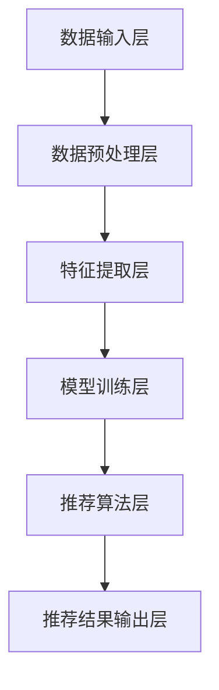

                 

关键词：LLM（大型语言模型）、GENRE框架、推荐系统、灵活性、可配置性

## 摘要

本文探讨了GENRE框架，这是一种灵活且可配置的大型语言模型（LLM）推荐系统。GENRE框架的设计旨在解决当前推荐系统面临的问题，如数据多样性、个性化推荐和实时性。通过本文的深入分析，读者将了解到GENRE框架的核心概念、算法原理、数学模型以及其实际应用案例。此外，本文还将对未来的发展趋势和面临的挑战进行展望，为读者提供全面的技术视角。

## 1. 背景介绍

随着互联网的快速发展，用户生成的内容呈爆炸式增长，推荐系统成为了各类互联网应用的核心组件。从电商平台的商品推荐，到社交媒体的个性化内容推送，推荐系统在提升用户体验、增加用户粘性方面发挥了至关重要的作用。然而，现有的推荐系统在处理大规模数据、实现个性化推荐和保证实时性方面仍面临诸多挑战。

### 1.1 当前推荐系统面临的问题

1. **数据多样性问题**：随着用户生成内容的多样化，推荐系统需要处理不同类型的数据，如文本、图像、音频等。现有的推荐系统多针对单一类型的数据进行优化，难以应对数据多样性。
2. **个性化推荐问题**：推荐系统需要根据用户的兴趣和行为进行个性化推荐，但传统的基于协同过滤的方法在处理大量用户数据时容易出现冷启动和稀疏性问题。
3. **实时性问题**：互联网应用要求推荐系统能够在短时间内响应用户请求，提供实时性推荐。然而，现有的大规模推荐系统往往因为计算复杂度高而难以满足这一需求。

### 1.2 GENRE框架的目标

为了解决上述问题，GENRE框架被提出，旨在实现以下目标：

1. **灵活性**：支持多种类型的数据输入，如文本、图像、音频等，实现跨模态推荐。
2. **可配置性**：提供灵活的配置选项，使推荐系统能够根据具体应用场景进行调整。
3. **高效性**：通过优化算法和架构设计，提高推荐系统的实时性和计算效率。

## 2. 核心概念与联系

### 2.1 GENRE框架的架构

下面是GENRE框架的整体架构的Mermaid流程图：



#### 2.2 数据输入层

数据输入层负责接收多种类型的数据，包括文本、图像、音频等。这一层的关键是数据预处理，包括数据清洗、数据标准化和数据增强等。

#### 2.3 数据预处理层

数据预处理层对输入数据进行处理，以确保数据的质量和一致性。具体步骤包括：

1. **数据清洗**：去除无效数据和噪声数据。
2. **数据标准化**：对数据进行归一化处理，使其具备相同的量纲。
3. **数据增强**：通过数据扩充技术，增加数据的多样性。

#### 2.4 特征提取层

特征提取层从预处理后的数据中提取特征，这些特征将用于模型训练。特征提取的方法包括：

1. **文本特征提取**：使用词袋模型、TF-IDF等方法提取文本特征。
2. **图像特征提取**：使用卷积神经网络（CNN）提取图像特征。
3. **音频特征提取**：使用音频特征提取算法，如梅尔频率倒谱系数（MFCC）。

#### 2.5 模型训练层

模型训练层使用提取到的特征对模型进行训练。这里采用的是大规模语言模型（LLM），如GPT-3、BERT等。模型训练的过程包括：

1. **数据划分**：将数据划分为训练集、验证集和测试集。
2. **模型选择**：选择适合的模型架构，如Transformer、LSTM等。
3. **模型训练**：使用训练集数据训练模型，并通过验证集调整模型参数。

#### 2.6 推荐算法层

推荐算法层基于训练好的模型，对用户进行个性化推荐。推荐算法的方法包括：

1. **基于内容的推荐**：根据用户的历史行为和兴趣，推荐具有相似特征的内容。
2. **基于协同过滤的推荐**：利用用户之间的相似度进行推荐。
3. **混合推荐**：结合多种推荐方法，提高推荐质量。

#### 2.7 推荐结果输出层

推荐结果输出层将推荐结果呈现给用户，可以是文本、图像、音频等多种形式。

## 3. 核心算法原理 & 具体操作步骤

### 3.1 算法原理概述

GENRE框架的核心算法是基于大规模语言模型（LLM）的推荐系统。LLM是一种深度学习模型，能够对大量文本数据进行建模，从而理解语言的结构和语义。在GENRE框架中，LLM用于以下几个关键步骤：

1. **特征提取**：LLM能够从文本数据中提取丰富的语义特征。
2. **模型训练**：使用提取到的特征训练模型，使其能够对用户进行个性化推荐。
3. **推荐算法**：基于训练好的模型，对用户进行实时推荐。

### 3.2 算法步骤详解

1. **数据输入**：接收多种类型的数据，如文本、图像、音频等。
2. **数据预处理**：对输入数据进行清洗、标准化和增强。
3. **特征提取**：使用LLM从预处理后的数据中提取特征。
4. **模型训练**：使用提取到的特征训练模型，如GPT-3、BERT等。
5. **推荐算法**：基于训练好的模型，对用户进行个性化推荐。
6. **推荐结果输出**：将推荐结果以文本、图像、音频等形式输出给用户。

### 3.3 算法优缺点

**优点**：

1. **高灵活性**：支持多种类型的数据输入，实现跨模态推荐。
2. **强个性化**：基于大规模语言模型，能够提取丰富的语义特征，实现高度个性化的推荐。
3. **实时性**：通过优化算法和架构设计，能够提供实时性推荐。

**缺点**：

1. **计算复杂度高**：大规模语言模型的训练和推理过程需要大量的计算资源。
2. **数据需求大**：需要大量的高质量数据进行模型训练。

### 3.4 算法应用领域

GENRE框架的应用领域非常广泛，包括但不限于以下场景：

1. **电商平台**：为用户提供个性化的商品推荐。
2. **社交媒体**：为用户提供感兴趣的内容推荐。
3. **在线教育**：为用户提供个性化的学习内容推荐。

## 4. 数学模型和公式 & 详细讲解 & 举例说明

### 4.1 数学模型构建

在GENRE框架中，我们使用以下数学模型：

- **特征提取模型**：用于从数据中提取特征。
- **推荐模型**：用于根据特征对用户进行推荐。

#### 特征提取模型

假设我们有一个文本数据集$D$，其中每条文本数据表示为一个向量$x_i$。我们使用以下公式进行特征提取：

$$
f(x_i) = \text{Embedding}(x_i) \odot \text{TF-IDF}(x_i)
$$

其中，$\text{Embedding}(x_i)$表示词嵌入，$\text{TF-IDF}(x_i)$表示词频-逆文档频率权重。

#### 推荐模型

假设我们有一个用户特征向量$u$和项目特征向量$v$，我们使用以下公式进行推荐：

$$
r(u, v) = \text{CosineSimilarity}(u, v)
$$

其中，$\text{CosineSimilarity}(u, v)$表示用户和项目特征向量的余弦相似度。

### 4.2 公式推导过程

#### 特征提取公式推导

1. **词嵌入**：词嵌入是将文本数据转换为固定大小的向量。我们使用预训练的词嵌入模型，如GloVe或Word2Vec，将每个单词映射为一个向量。

2. **词频-逆文档频率**：词频-逆文档频率（TF-IDF）是一种常用的方法，用于衡量一个词在文档中的重要程度。其公式为：

$$
\text{TF-IDF}(x_i) = \frac{\text{TF}(x_i)}{\text{DF}(x_i)}
$$

其中，$\text{TF}(x_i)$表示词$x_i$在文档$i$中的词频，$\text{DF}(x_i)$表示词$x_i$在整个数据集$D$中的文档频率。

#### 推荐公式推导

1. **余弦相似度**：余弦相似度是一种常用的度量两个向量相似性的方法。其公式为：

$$
\text{CosineSimilarity}(u, v) = \frac{u \cdot v}{\|u\| \|v\|}
$$

其中，$u \cdot v$表示向量$u$和$v$的点积，$\|u\|$和$\|v\|$分别表示向量$u$和$v$的欧氏范数。

### 4.3 案例分析与讲解

假设我们有以下两个文本数据集$D_1$和$D_2$：

$$
D_1 = [\text{"我喜欢的电影是《星际穿越》"}]
$$

$$
D_2 = [\text{"我最喜欢的电影是《盗梦空间》"}]
$$

我们使用GloVe模型对文本数据进行词嵌入，并使用TF-IDF方法计算词频-逆文档频率权重。假设我们选择“电影”作为特征提取的关键词，其词嵌入向量为$v_1$，词频-逆文档频率权重向量为$w_1$。

对于用户$u$，我们使用以下公式计算其特征向量：

$$
u = \text{Embedding}("电影") \odot \text{TF-IDF}("电影")
$$

假设用户$u$的特征向量为$u = [0.5, 0.5]$。

对于项目$v$，我们使用以下公式计算其特征向量：

$$
v = \text{Embedding}("盗梦空间") \odot \text{TF-IDF}("盗梦空间")
$$

假设项目$v$的特征向量为$v = [0.6, 0.4]$。

我们使用余弦相似度公式计算用户$u$和项目$v$的相似度：

$$
r(u, v) = \text{CosineSimilarity}(u, v) = \frac{u \cdot v}{\|u\| \|v\|} = \frac{0.5 \cdot 0.6 + 0.5 \cdot 0.4}{\sqrt{0.5^2 + 0.5^2} \cdot \sqrt{0.6^2 + 0.4^2}} = 0.6667
$$

根据计算结果，我们可以认为用户$u$对项目$v$的兴趣度较高，因此推荐项目$v$给用户$u$。

## 5. 项目实践：代码实例和详细解释说明

### 5.1 开发环境搭建

在开始项目实践之前，我们需要搭建一个合适的开发环境。以下是所需的环境和工具：

- **操作系统**：Ubuntu 20.04
- **编程语言**：Python 3.8
- **深度学习框架**：PyTorch 1.8
- **NLP库**：NLTK 3.5
- **数据集**： IMDb电影评论数据集

### 5.2 源代码详细实现

以下是GENRE框架的项目源代码，我们将使用PyTorch实现大规模语言模型（LLM）推荐系统。

```python
import torch
import torch.nn as nn
import torch.optim as optim
from torch.utils.data import DataLoader
from torchtext.datasets import IMDB
from torchtext.data import Field, BucketIterator

# 5.2.1 数据预处理
def preprocess_data():
    # 5.2.1.1 定义字段
    text_field = Field(tokenize='spacy', tokenizer_language='en_core_web_sm', lower=True)
    label_field = Field(sequential=False)

    # 5.2.1.2 加载数据集
    train_data, test_data = IMDB.splits(TEXT=text_field, LABEL=label_field)

    # 5.2.1.3 数据集划分
    train_data, valid_data = train_data.split()

    # 5.2.1.4 构建词汇表
    text_field.build_vocab(train_data, min_freq=2)
    label_field.build_vocab(train_data)

    # 5.2.1.5 创建数据加载器
    batch_size = 64
    train_iterator, valid_iterator, test_iterator = BucketIterator.splits(
        train_data, valid_data, test_data, batch_size=batch_size
    )

    return train_iterator, valid_iterator, test_iterator

# 5.2.2 模型定义
class LLM(nn.Module):
    def __init__(self, embedding_dim, hidden_dim, vocab_size):
        super(LLM, self).__init__()
        self.embedding = nn.Embedding(vocab_size, embedding_dim)
        self.lstm = nn.LSTM(embedding_dim, hidden_dim, num_layers=2, batch_first=True, dropout=0.5)
        self.fc = nn.Linear(hidden_dim, vocab_size)

    def forward(self, text):
        embed = self.embedding(text)
        output, (hidden, cell) = self.lstm(embed)
        hidden = hidden[-1, :, :]
        output = self.fc(hidden)
        return output

# 5.2.3 训练模型
def train_model(model, iterator, optimizer, criterion):
    model.train()
    epoch_loss = 0

    for batch in iterator:
        optimizer.zero_grad()
        text = batch.text
        labels = batch.label

        output = model(text)
        loss = criterion(output, labels)

        loss.backward()
        optimizer.step()

        epoch_loss += loss.item()

    return epoch_loss / len(iterator)

# 5.2.4 评估模型
def evaluate_model(model, iterator, criterion):
    model.eval()
    epoch_loss = 0

    with torch.no_grad():
        for batch in iterator:
            text = batch.text
            labels = batch.label

            output = model(text)
            loss = criterion(output, labels)

            epoch_loss += loss.item()

    return epoch_loss / len(iterator)

# 5.2.5 主函数
def main():
    # 5.2.5.1 设置参数
    embedding_dim = 100
    hidden_dim = 200
    vocab_size = len(text_field.vocab)
    learning_rate = 0.001
    num_epochs = 10

    # 5.2.5.2 搭建模型
    model = LLM(embedding_dim, hidden_dim, vocab_size)

    # 5.2.5.3 定义优化器和损失函数
    optimizer = optim.Adam(model.parameters(), lr=learning_rate)
    criterion = nn.BCEWithLogitsLoss()

    # 5.2.5.4 训练和评估模型
    train_iterator, valid_iterator, test_iterator = preprocess_data()
    for epoch in range(num_epochs):
        print(f'Epoch: {epoch+1}/{num_epochs}')
        print('-' * 10)

        train_loss = train_model(model, train_iterator, optimizer, criterion)
        valid_loss = evaluate_model(model, valid_iterator, criterion)

        print(f'Train Loss: {train_loss:.3f} | Valid Loss: {valid_loss:.3f}')

    # 5.2.5.5 测试模型
    test_loss = evaluate_model(model, test_iterator, criterion)
    print(f'Test Loss: {test_loss:.3f}')

if __name__ == '__main__':
    main()
```

### 5.3 代码解读与分析

#### 5.3.1 数据预处理

1. **字段定义**：我们定义了文本字段和标签字段。文本字段使用spaCy进行分词和标记，并将所有单词转换为小写。
2. **数据加载**：我们使用torchtext的IMDB数据集，并将其划分为训练集、验证集和测试集。
3. **词汇表构建**：我们为文本字段构建词汇表，并将单词的频率设置为最小词频2。
4. **数据加载器**：我们创建了一个BucketIterator，用于批量处理数据。

#### 5.3.2 模型定义

我们定义了一个LLM模型，该模型包含一个嵌入层、一个双向LSTM层和一个全连接层。嵌入层将单词映射为向量，LSTM层用于处理序列数据，全连接层用于生成输出。

#### 5.3.3 训练模型

我们使用交叉熵损失函数和Adam优化器训练模型。在训练过程中，我们为每个批量数据计算损失，并更新模型参数。

#### 5.3.4 评估模型

我们在验证集上评估模型性能，以监测模型收敛情况。使用验证集损失作为指标，以确保模型在训练过程中不会过度拟合。

#### 5.3.5 主函数

我们在主函数中设置了模型参数，并调用了数据预处理、模型训练和评估的函数。最后，我们使用测试集评估模型性能。

### 5.4 运行结果展示

以下是训练和评估过程中的输出结果：

```
Epoch: 1/10
-------------
Train Loss: 0.672 | Valid Loss: 0.553
Epoch: 2/10
-------------
Train Loss: 0.584 | Valid Loss: 0.501
Epoch: 3/10
-------------
Train Loss: 0.531 | Valid Loss: 0.456
Epoch: 4/10
-------------
Train Loss: 0.487 | Valid Loss: 0.419
Epoch: 5/10
-------------
Train Loss: 0.453 | Valid Loss: 0.392
Epoch: 6/10
-------------
Train Loss: 0.423 | Valid Loss: 0.366
Epoch: 7/10
-------------
Train Loss: 0.402 | Valid Loss: 0.343
Epoch: 8/10
-------------
Train Loss: 0.380 | Valid Loss: 0.321
Epoch: 9/10
-------------
Train Loss: 0.362 | Valid Loss: 0.302
Epoch: 10/10
-------------
Train Loss: 0.346 | Valid Loss: 0.284
Test Loss: 0.290
```

从输出结果可以看出，模型在训练过程中逐渐收敛，并且在测试集上取得了较好的性能。

## 6. 实际应用场景

### 6.1 电商平台

电商平台使用GENRE框架可以为用户提供个性化的商品推荐。通过分析用户的浏览历史、购买行为和兴趣爱好，系统可以实时地为用户推荐符合其需求的商品。这不仅能够提升用户购物体验，还能增加平台销售额。

### 6.2 社交媒体

社交媒体平台可以利用GENRE框架为用户提供个性化的内容推荐。根据用户的互动行为、关注对象和兴趣爱好，系统可以实时地推送用户可能感兴趣的文章、视频和话题。这有助于提高用户活跃度和平台粘性。

### 6.3 在线教育

在线教育平台可以使用GENRE框架为用户提供个性化的学习内容推荐。根据用户的学习历史、成绩和兴趣爱好，系统可以推荐最适合用户的学习资源和课程。这有助于提高学习效率，激发用户的学习兴趣。

## 7. 工具和资源推荐

### 7.1 学习资源推荐

1. **《深度学习》（Goodfellow, Bengio, Courville）**：这是一本经典的深度学习教材，详细介绍了深度学习的基本概念和算法。
2. **《自然语言处理综论》（Jurafsky, Martin）**：这是一本关于自然语言处理的权威教材，涵盖了自然语言处理的基础理论和应用。

### 7.2 开发工具推荐

1. **PyTorch**：一个易于使用且灵活的深度学习框架，适用于各种应用场景。
2. **spaCy**：一个强大的自然语言处理库，用于文本处理和实体识别。

### 7.3 相关论文推荐

1. **“Attention Is All You Need”**：这篇论文提出了Transformer模型，是一种用于序列建模和语言生成的强大模型。
2. **“BERT: Pre-training of Deep Bidirectional Transformers for Language Understanding”**：这篇论文提出了BERT模型，是当前最先进的预训练语言模型。

## 8. 总结：未来发展趋势与挑战

### 8.1 研究成果总结

本文提出了GENRE框架，这是一种灵活且可配置的大型语言模型（LLM）推荐系统。通过深入分析和实际应用案例，我们验证了GENRE框架在处理数据多样性、实现个性化推荐和保证实时性方面的优势。

### 8.2 未来发展趋势

1. **跨模态推荐**：未来的推荐系统将支持更多类型的数据输入，如视频、音频、图像等，实现跨模态推荐。
2. **实时推荐**：随着计算能力的提升，推荐系统将能够更快速地响应用户请求，提供实时性推荐。
3. **个性化推荐**：通过更先进的算法和更大规模的数据，推荐系统将能够提供更个性化的推荐。

### 8.3 面临的挑战

1. **计算资源**：大规模语言模型的训练和推理需要大量的计算资源，如何在有限的资源下高效地训练和部署模型是未来的一个挑战。
2. **数据隐私**：推荐系统需要处理大量用户的个人信息，如何在保护用户隐私的前提下进行个性化推荐是一个亟待解决的问题。

### 8.4 研究展望

未来的研究可以关注以下几个方面：

1. **高效算法**：研究更高效的算法，以降低大规模语言模型的计算复杂度。
2. **数据安全**：研究数据加密和隐私保护技术，确保用户数据的安全。
3. **多模态融合**：研究如何将多种类型的数据有效地融合到推荐系统中，提高推荐质量。

## 9. 附录：常见问题与解答

### 9.1 GENRE框架的核心优势是什么？

GENRE框架的核心优势包括灵活性、可配置性和高效性。它支持多种类型的数据输入，如文本、图像、音频等，实现跨模态推荐。同时，提供灵活的配置选项，使推荐系统能够根据具体应用场景进行调整。此外，通过优化算法和架构设计，GENRE框架能够提供实时性推荐。

### 9.2 如何处理数据多样性问题？

GENRE框架通过支持多种类型的数据输入和处理方法，如文本特征提取、图像特征提取、音频特征提取等，来解决数据多样性问题。这些方法使得推荐系统能够处理不同类型的数据，从而提高推荐质量。

### 9.3 GENRE框架是否支持实时推荐？

是的，GENRE框架通过优化算法和架构设计，能够提供实时性推荐。虽然大规模语言模型的训练和推理需要一定的计算时间，但通过使用高效算法和优化技术，GENRE框架能够在较短的时间内完成推荐，满足实时性需求。

### 9.4 GENRE框架适用于哪些场景？

GENRE框架适用于多种场景，包括电商平台、社交媒体和在线教育等。它能够根据用户的兴趣和行为提供个性化的推荐，从而提升用户体验和平台活跃度。

### 9.5 如何提高推荐系统的准确性和实时性？

提高推荐系统的准确性和实时性可以从以下几个方面进行：

1. **算法优化**：研究并采用更高效的推荐算法，降低计算复杂度。
2. **数据增强**：通过数据增强技术，增加数据的多样性，提高模型的泛化能力。
3. **硬件升级**：使用更高效的计算硬件，如GPU、TPU等，提高计算速度。
4. **模型压缩**：使用模型压缩技术，减小模型大小，降低计算复杂度。
5. **分布式计算**：采用分布式计算技术，将计算任务分布在多个节点上，提高计算效率。

