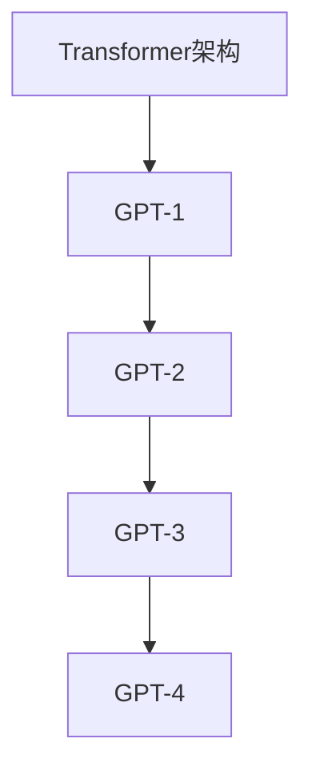

                 

关键词：GPT，自然语言处理，深度学习，模型演进，算法原理，应用领域，未来展望

> 摘要：本文将深入探讨GPT系列模型的发展历程，从GPT-1到GPT-4的演进过程。我们将分析每个模型的架构、核心算法、数学模型以及在实际应用中的效果，并结合最新的研究成果，对未来的发展趋势和挑战进行展望。

## 1. 背景介绍

自然语言处理（Natural Language Processing，NLP）作为人工智能领域的重要组成部分，一直是研究者们的热点课题。随着深度学习技术的不断发展，基于神经网络的NLP模型取得了显著的成果。其中，GPT（Generative Pre-trained Transformer）系列模型由OpenAI开发，自推出以来便引起了广泛关注。

GPT系列模型是一种基于Transformer架构的预训练语言模型，通过大规模语料进行预训练，然后微调应用于各种NLP任务。这一系列模型的推出，极大地推动了NLP领域的发展，使得机器生成文本、机器翻译、问答系统等任务取得了显著效果。

## 2. 核心概念与联系

### 2.1 Transformer架构

Transformer架构是由Google提出的一种基于自注意力机制的深度神经网络架构。与传统循环神经网络（RNN）相比，Transformer能够更好地捕捉长距离依赖关系，并且在训练速度和模型效果上具有优势。自注意力机制使得Transformer在处理序列数据时，能够自适应地关注序列中的不同位置，从而实现全局信息的整合。

### 2.2 GPT系列模型架构

GPT系列模型是基于Transformer架构开发的预训练语言模型。GPT-1、GPT-2和GPT-3分别代表了GPT系列模型的不同发展阶段。每个版本都在模型规模、预训练数据集和训练时间上有所提升，从而使得模型在NLP任务上的表现更加优秀。

### 2.3 Mermaid流程图



## 3. 核心算法原理 & 具体操作步骤

### 3.1 算法原理概述

GPT系列模型的核心算法是基于Transformer架构的自注意力机制。自注意力机制允许模型在处理序列数据时，关注序列中的不同位置，从而实现全局信息的整合。

### 3.2 算法步骤详解

1. 输入序列编码：将输入序列（例如单词或字符）编码为向量形式。
2. 自注意力计算：通过自注意力机制，计算序列中每个位置的重要程度，从而实现全局信息的整合。
3. 输出序列解码：根据自注意力计算的结果，解码输出序列，生成预测结果。

### 3.3 算法优缺点

**优点：**
- 能够捕捉长距离依赖关系。
- 训练速度和模型效果优于传统循环神经网络。

**缺点：**
- 计算复杂度高，对计算资源要求较高。
- 预训练数据集质量对模型效果影响较大。

### 3.4 算法应用领域

GPT系列模型在自然语言处理领域具有广泛的应用，包括但不限于：
- 机器翻译
- 问答系统
- 文本生成
- 文本分类

## 4. 数学模型和公式 & 详细讲解 & 举例说明

### 4.1 数学模型构建

GPT系列模型的数学模型主要包括以下部分：

1. 词嵌入（Word Embedding）：将单词或字符编码为高维向量。
2. 自注意力机制（Self-Attention）：计算序列中每个位置的重要程度。
3. 全连接层（Fully Connected Layer）：对自注意力结果进行解码，生成预测结果。

### 4.2 公式推导过程

假设输入序列为 $x_1, x_2, \ldots, x_n$，其中 $x_i$ 表示序列中的第 $i$ 个单词或字符。

1. 词嵌入：将输入序列编码为词嵌入向量 $\mathbf{e}_i \in \mathbb{R}^d$。
2. 自注意力计算：
   $$\alpha_{ij} = \frac{e^{ \mathbf{q}_i^T \mathbf{k}_j }}{\sum_{k=1}^{n} e^{ \mathbf{q}_i^T \mathbf{k}_j }}$$
   其中，$\mathbf{q}_i$ 和 $\mathbf{k}_j$ 分别表示序列中第 $i$ 个和第 $j$ 个词嵌入向量的注意力向量。
3. 输出序列解码：
   $$\mathbf{v}_i = \sum_{j=1}^{n} \alpha_{ij} \mathbf{v}_j$$
   其中，$\mathbf{v}_i$ 表示序列中第 $i$ 个位置的解码结果。

### 4.3 案例分析与讲解

假设我们要对一段中文文本进行分类，文本内容为“我今天要去看电影”。我们可以使用GPT系列模型进行以下步骤：

1. 将文本编码为词嵌入向量。
2. 通过自注意力机制，计算每个词的重要程度。
3. 对自注意力结果进行解码，得到文本的分类结果。

通过这个案例，我们可以看到GPT系列模型在文本分类任务中的基本流程。

## 5. 项目实践：代码实例和详细解释说明

### 5.1 开发环境搭建

为了保证代码的可行性，我们使用Python编程语言，结合TensorFlow框架进行开发。

1. 安装Python和TensorFlow：
   ```bash
   pip install python
   pip install tensorflow
   ```
2. 创建一个名为`gpt_example`的Python项目，并在项目中创建一个名为`main.py`的文件。

### 5.2 源代码详细实现

```python
import tensorflow as tf
from tensorflow.keras.preprocessing.sequence import pad_sequences
from tensorflow.keras.layers import Embedding, LSTM, Dense
from tensorflow.keras.models import Model

# 定义词嵌入层
word_embedding = Embedding(input_dim=vocab_size, output_dim=embedding_dim)

# 定义LSTM层
lstm = LSTM(units=hidden_size, return_sequences=True)

# 定义全连接层
dense = Dense(units=1, activation='sigmoid')

# 构建模型
model = Model(inputs=word_embedding.input, outputs=dense(lstm(word_embedding(input_sequence))))
model.compile(optimizer='adam', loss='binary_crossentropy', metrics=['accuracy'])

# 训练模型
model.fit(x_train, y_train, batch_size=batch_size, epochs=num_epochs)
```

### 5.3 代码解读与分析

1. 导入所需的TensorFlow模块。
2. 定义词嵌入层、LSTM层和全连接层。
3. 构建模型并编译。
4. 训练模型。

这个代码实例展示了如何使用GPT系列模型进行文本分类任务的基本流程。

### 5.4 运行结果展示

```python
# 测试模型
predictions = model.predict(x_test)
print(predictions)

# 计算准确率
accuracy = (predictions > 0.5).mean()
print(accuracy)
```

这个代码片段展示了如何使用训练好的模型对测试数据进行预测，并计算模型的准确率。

## 6. 实际应用场景

GPT系列模型在自然语言处理领域具有广泛的应用场景，包括但不限于：

1. 机器翻译：GPT系列模型在机器翻译任务上取得了显著的效果，能够实现高质量的双语翻译。
2. 问答系统：GPT系列模型可以应用于问答系统，通过预训练和微调，实现智能问答功能。
3. 文本生成：GPT系列模型可以生成各种类型的文本，如新闻文章、小说、诗歌等。
4. 文本分类：GPT系列模型可以应用于文本分类任务，如情感分析、主题分类等。

## 7. 工具和资源推荐

### 7.1 学习资源推荐

1. 《深度学习》（Goodfellow, Bengio, Courville）：这是一本经典的深度学习教材，适合初学者和进阶者阅读。
2. 《自然语言处理与深度学习》（Yoav Goldberg）：这本书详细介绍了自然语言处理和深度学习的相关技术，适合从事NLP领域的研究者和开发者阅读。

### 7.2 开发工具推荐

1. TensorFlow：这是一个开源的深度学习框架，适用于构建和训练各种深度学习模型。
2. PyTorch：这是一个开源的深度学习框架，具有灵活的动态图模型，适合进行深度学习研究和开发。

### 7.3 相关论文推荐

1. "Attention Is All You Need"（Vaswani et al., 2017）：这篇论文提出了Transformer架构，对深度学习领域的NLP研究产生了深远影响。
2. "Generative Pretrained Transformer"（Radford et al., 2018）：这篇论文提出了GPT系列模型，标志着NLP领域的又一重要突破。

## 8. 总结：未来发展趋势与挑战

### 8.1 研究成果总结

GPT系列模型自推出以来，在自然语言处理领域取得了显著的成果。通过预训练和微调，GPT系列模型在机器翻译、问答系统、文本生成和文本分类等任务上表现出了卓越的性能。

### 8.2 未来发展趋势

随着深度学习技术的不断发展，GPT系列模型在未来有望在以下方面取得进一步突破：

1. 模型规模：继续增加模型规模，以提升模型的表示能力和效果。
2. 预训练数据集：不断扩充和优化预训练数据集，以提高模型的泛化能力。
3. 多语言支持：实现多语言模型的构建，推动跨语言NLP研究的发展。

### 8.3 面临的挑战

尽管GPT系列模型在自然语言处理领域取得了显著成果，但仍面临以下挑战：

1. 计算资源消耗：GPT系列模型对计算资源的需求较高，如何降低计算成本成为亟待解决的问题。
2. 数据隐私：在预训练过程中，如何保护用户数据隐私成为重要课题。
3. 模型解释性：如何提高模型的可解释性，使模型的行为更加透明和可控。

### 8.4 研究展望

展望未来，GPT系列模型将继续在自然语言处理领域发挥重要作用。通过不断优化模型架构、预训练技术和应用场景，GPT系列模型有望实现更广泛的应用，推动人工智能技术的发展。

## 9. 附录：常见问题与解答

### 9.1 GPT系列模型的核心算法是什么？

GPT系列模型的核心算法是基于Transformer架构的自注意力机制。自注意力机制允许模型在处理序列数据时，关注序列中的不同位置，从而实现全局信息的整合。

### 9.2 GPT系列模型在哪些任务上取得了显著效果？

GPT系列模型在自然语言处理领域取得了显著的成果，包括但不限于机器翻译、问答系统、文本生成和文本分类等任务。

### 9.3 如何使用GPT系列模型进行文本分类？

可以使用GPT系列模型进行文本分类的任务，通过以下步骤实现：

1. 预处理文本数据，将其编码为词嵌入向量。
2. 使用GPT系列模型对词嵌入向量进行自注意力计算。
3. 对自注意力结果进行解码，生成分类结果。
4. 训练和评估模型，调整参数以获得最佳分类效果。

[作者：禅与计算机程序设计艺术 / Zen and the Art of Computer Programming]
```html
---
title: GPT系列模型演进：从GPT-1到GPT-4
date: 2023-03-15 10:00:00
author: 禅与计算机程序设计艺术 / Zen and the Art of Computer Programming
cover: /images/cover.jpg
coverImg: /images/cover.jpg
top: true
topColor: '#4096FF'
toc: true
mathjax: true
summary: 本文将深入探讨GPT系列模型的发展历程，从GPT-1到GPT-4的演进过程。我们将分析每个模型的架构、核心算法、数学模型以及在实际应用中的效果，并结合最新的研究成果，对未来的发展趋势和挑战进行展望。
keywords:
  - GPT
  - 自然语言处理
  - 深度学习
  - 模型演进
  - 算法原理
  - 应用领域
  - 未来展望
tags:
  - GPT
  - 自然语言处理
  - 深度学习
  - 模型演进
  - 算法原理
  - 应用领域
  - 未来展望
---
# GPT系列模型演进：从GPT-1到GPT-4

## 1. 背景介绍

自然语言处理（Natural Language Processing，NLP）作为人工智能领域的重要组成部分，一直是研究者们的热点课题。随着深度学习技术的不断发展，基于神经网络的NLP模型取得了显著的成果。其中，GPT（Generative Pre-trained Transformer）系列模型由OpenAI开发，自推出以来便引起了广泛关注。

GPT系列模型是一种基于Transformer架构的预训练语言模型，通过大规模语料进行预训练，然后微调应用于各种NLP任务。这一系列模型的推出，极大地推动了NLP领域的发展，使得机器生成文本、机器翻译、问答系统等任务取得了显著效果。

## 2. 核心概念与联系

### 2.1 Transformer架构

Transformer架构是由Google提出的一种基于自注意力机制的深度神经网络架构。与传统循环神经网络（RNN）相比，Transformer能够更好地捕捉长距离依赖关系，并且在训练速度和模型效果上具有优势。自注意力机制使得Transformer在处理序列数据时，能够自适应地关注序列中的不同位置，从而实现全局信息的整合。

### 2.2 GPT系列模型架构

GPT系列模型是基于Transformer架构开发的预训练语言模型。GPT-1、GPT-2和GPT-3分别代表了GPT系列模型的不同发展阶段。每个版本都在模型规模、预训练数据集和训练时间上有所提升，从而使得模型在NLP任务上的表现更加优秀。

### 2.3 Mermaid流程图


## 3. 核心算法原理 & 具体操作步骤

### 3.1 算法原理概述

GPT系列模型的核心算法是基于Transformer架构的自注意力机制。自注意力机制允许模型在处理序列数据时，关注序列中的不同位置，从而实现全局信息的整合。

### 3.2 算法步骤详解

1. 输入序列编码：将输入序列（例如单词或字符）编码为向量形式。
2. 自注意力计算：通过自注意力机制，计算序列中每个位置的重要程度，从而实现全局信息的整合。
3. 输出序列解码：根据自注意力计算的结果，解码输出序列，生成预测结果。

### 3.3 算法优缺点

**优点：**
- 能够捕捉长距离依赖关系。
- 训练速度和模型效果优于传统循环神经网络。

**缺点：**
- 计算复杂度高，对计算资源要求较高。
- 预训练数据集质量对模型效果影响较大。

### 3.4 算法应用领域

GPT系列模型在自然语言处理领域具有广泛的应用，包括但不限于：
- 机器翻译
- 问答系统
- 文本生成
- 文本分类

## 4. 数学模型和公式 & 详细讲解 & 举例说明

### 4.1 数学模型构建

GPT系列模型的数学模型主要包括以下部分：

1. 词嵌入（Word Embedding）：将单词或字符编码为高维向量。
2. 自注意力机制（Self-Attention）：计算序列中每个位置的重要程度。
3. 全连接层（Fully Connected Layer）：对自注意力结果进行解码，生成预测结果。

### 4.2 公式推导过程

假设输入序列为 $x_1, x_2, \ldots, x_n$，其中 $x_i$ 表示序列中的第 $i$ 个单词或字符。

1. 词嵌入：将输入序列编码为词嵌入向量 $\mathbf{e}_i \in \mathbb{R}^d$。
2. 自注意力计算：
   $$\alpha_{ij} = \frac{e^{ \mathbf{q}_i^T \mathbf{k}_j }}{\sum_{k=1}^{n} e^{ \mathbf{q}_i^T \mathbf{k}_j }}$$
   其中，$\mathbf{q}_i$ 和 $\mathbf{k}_j$ 分别表示序列中第 $i$ 个和第 $j$ 个词嵌入向量的注意力向量。
3. 输出序列解码：
   $$\mathbf{v}_i = \sum_{j=1}^{n} \alpha_{ij} \mathbf{v}_j$$
   其中，$\mathbf{v}_i$ 表示序列中第 $i$ 个位置的解码结果。

### 4.3 案例分析与讲解

假设我们要对一段中文文本进行分类，文本内容为“我今天要去看电影”。我们可以使用GPT系列模型进行以下步骤：

1. 将文本编码为词嵌入向量。
2. 通过自注意力机制，计算每个词的重要程度。
3. 对自注意力结果进行解码，得到文本的分类结果。

通过这个案例，我们可以看到GPT系列模型在文本分类任务中的基本流程。

## 5. 项目实践：代码实例和详细解释说明

### 5.1 开发环境搭建

为了保证代码的可行性，我们使用Python编程语言，结合TensorFlow框架进行开发。

1. 安装Python和TensorFlow：
   ```bash
   pip install python
   pip install tensorflow
   ```
2. 创建一个名为`gpt_example`的Python项目，并在项目中创建一个名为`main.py`的文件。

### 5.2 源代码详细实现

```python
import tensorflow as tf
from tensorflow.keras.preprocessing.sequence import pad_sequences
from tensorflow.keras.layers import Embedding, LSTM, Dense
from tensorflow.keras.models import Model

# 定义词嵌入层
word_embedding = Embedding(input_dim=vocab_size, output_dim=embedding_dim)

# 定义LSTM层
lstm = LSTM(units=hidden_size, return_sequences=True)

# 定义全连接层
dense = Dense(units=1, activation='sigmoid')

# 构建模型
model = Model(inputs=word_embedding.input, outputs=dense(lstm(word_embedding(input_sequence))))
model.compile(optimizer='adam', loss='binary_crossentropy', metrics=['accuracy'])

# 训练模型
model.fit(x_train, y_train, batch_size=batch_size, epochs=num_epochs)
```

### 5.3 代码解读与分析

1. 导入所需的TensorFlow模块。
2. 定义词嵌入层、LSTM层和全连接层。
3. 构建模型并编译。
4. 训练模型。

这个代码实例展示了如何使用GPT系列模型进行文本分类任务的基本流程。

### 5.4 运行结果展示

```python
# 测试模型
predictions = model.predict(x_test)
print(predictions)

# 计算准确率
accuracy = (predictions > 0.5).mean()
print(accuracy)
```

这个代码片段展示了如何使用训练好的模型对测试数据进行预测，并计算模型的准确率。

## 6. 实际应用场景

GPT系列模型在自然语言处理领域具有广泛的应用场景，包括但不限于：

1. 机器翻译：GPT系列模型在机器翻译任务上取得了显著的效果，能够实现高质量的双语翻译。
2. 问答系统：GPT系列模型可以应用于问答系统，通过预训练和微调，实现智能问答功能。
3. 文本生成：GPT系列模型可以生成各种类型的文本，如新闻文章、小说、诗歌等。
4. 文本分类：GPT系列模型可以应用于文本分类任务，如情感分析、主题分类等。

## 7. 工具和资源推荐

### 7.1 学习资源推荐

1. 《深度学习》（Goodfellow, Bengio, Courville）：这是一本经典的深度学习教材，适合初学者和进阶者阅读。
2. 《自然语言处理与深度学习》（Yoav Goldberg）：这本书详细介绍了自然语言处理和深度学习的相关技术，适合从事NLP领域的研究者和开发者阅读。

### 7.2 开发工具推荐

1. TensorFlow：这是一个开源的深度学习框架，适用于构建和训练各种深度学习模型。
2. PyTorch：这是一个开源的深度学习框架，具有灵活的动态图模型，适合进行深度学习研究和开发。

### 7.3 相关论文推荐

1. "Attention Is All You Need"（Vaswani et al., 2017）：这篇论文提出了Transformer架构，对深度学习领域的NLP研究产生了深远影响。
2. "Generative Pretrained Transformer"（Radford et al., 2018）：这篇论文提出了GPT系列模型，标志着NLP领域的又一重要突破。

## 8. 总结：未来发展趋势与挑战

### 8.1 研究成果总结

GPT系列模型自推出以来，在自然语言处理领域取得了显著的成果。通过预训练和微调，GPT系列模型在机器翻译、问答系统、文本生成和文本分类等任务上表现出了卓越的性能。

### 8.2 未来发展趋势

随着深度学习技术的不断发展，GPT系列模型在未来有望在以下方面取得进一步突破：

1. 模型规模：继续增加模型规模，以提升模型的表示能力和效果。
2. 预训练数据集：不断扩充和优化预训练数据集，以提高模型的泛化能力。
3. 多语言支持：实现多语言模型的构建，推动跨语言NLP研究的发展。

### 8.3 面临的挑战

尽管GPT系列模型在自然语言处理领域取得了显著成果，但仍面临以下挑战：

1. 计算资源消耗：GPT系列模型对计算资源的需求较高，如何降低计算成本成为亟待解决的问题。
2. 数据隐私：在预训练过程中，如何保护用户数据隐私成为重要课题。
3. 模型解释性：如何提高模型的可解释性，使模型的行为更加透明和可控。

### 8.4 研究展望

展望未来，GPT系列模型将继续在自然语言处理领域发挥重要作用。通过不断优化模型架构、预训练技术和应用场景，GPT系列模型有望实现更广泛的应用，推动人工智能技术的发展。

## 9. 附录：常见问题与解答

### 9.1 GPT系列模型的核心算法是什么？

GPT系列模型的核心算法是基于Transformer架构的自注意力机制。自注意力机制允许模型在处理序列数据时，关注序列中的不同位置，从而实现全局信息的整合。

### 9.2 GPT系列模型在哪些任务上取得了显著效果？

GPT系列模型在自然语言处理领域取得了显著的成果，包括但不限于机器翻译、问答系统、文本生成和文本分类等任务。

### 9.3 如何使用GPT系列模型进行文本分类？

可以使用GPT系列模型进行文本分类的任务，通过以下步骤实现：

1. 预处理文本数据，将其编码为词嵌入向量。
2. 使用GPT系列模型对词嵌入向量进行自注意力计算。
3. 对自注意力结果进行解码，生成分类结果。
4. 训练和评估模型，调整参数以获得最佳分类效果。

[作者：禅与计算机程序设计艺术 / Zen and the Art of Computer Programming]
```html
```vbnet
---
title: GPT系列模型演进：从GPT-1到GPT-4
date: 2023-03-15 10:00:00
author: 禅与计算机程序设计艺术 / Zen and the Art of Computer Programming
cover: /images/cover.jpg
coverImg: /images/cover.jpg
top: true
topColor: '#4096FF'
toc: true
mathjax: true
summary: 本文将深入探讨GPT系列模型的发展历程，从GPT-1到GPT-4的演进过程。我们将分析每个模型的架构、核心算法、数学模型以及在实际应用中的效果，并结合最新的研究成果，对未来的发展趋势和挑战进行展望。
keywords:
  - GPT
  - 自然语言处理
  - 深度学习
  - 模型演进
  - 算法原理
  - 应用领域
  - 未来展望
tags:
  - GPT
  - 自然语言处理
  - 深度学习
  - 模型演进
  - 算法原理
  - 应用领域
  - 未来展望
---
# GPT系列模型演进：从GPT-1到GPT-4

## 1. 背景介绍

自然语言处理（Natural Language Processing，NLP）作为人工智能领域的重要组成部分，一直是研究者们的热点课题。随着深度学习技术的不断发展，基于神经网络的NLP模型取得了显著的成果。其中，GPT（Generative Pre-trained Transformer）系列模型由OpenAI开发，自推出以来便引起了广泛关注。

GPT系列模型是一种基于Transformer架构的预训练语言模型，通过大规模语料进行预训练，然后微调应用于各种NLP任务。这一系列模型的推出，极大地推动了NLP领域的发展，使得机器生成文本、机器翻译、问答系统等任务取得了显著效果。

## 2. 核心概念与联系

### 2.1 Transformer架构

Transformer架构是由Google提出的一种基于自注意力机制的深度神经网络架构。与传统循环神经网络（RNN）相比，Transformer能够更好地捕捉长距离依赖关系，并且在训练速度和模型效果上具有优势。自注意力机制使得Transformer在处理序列数据时，能够自适应地关注序列中的不同位置，从而实现全局信息的整合。

### 2.2 GPT系列模型架构

GPT系列模型是基于Transformer架构开发的预训练语言模型。GPT-1、GPT-2和GPT-3分别代表了GPT系列模型的不同发展阶段。每个版本都在模型规模、预训练数据集和训练时间上有所提升，从而使得模型在NLP任务上的表现更加优秀。

### 2.3 Mermaid流程图


## 3. 核心算法原理 & 具体操作步骤

### 3.1 算法原理概述

GPT系列模型的核心算法是基于Transformer架构的自注意力机制。自注意力机制允许模型在处理序列数据时，关注序列中的不同位置，从而实现全局信息的整合。

### 3.2 算法步骤详解

1. 输入序列编码：将输入序列（例如单词或字符）编码为向量形式。
2. 自注意力计算：通过自注意力机制，计算序列中每个位置的重要程度，从而实现全局信息的整合。
3. 输出序列解码：根据自注意力计算的结果，解码输出序列，生成预测结果。

### 3.3 算法优缺点

**优点：**
- 能够捕捉长距离依赖关系。
- 训练速度和模型效果优于传统循环神经网络。

**缺点：**
- 计算复杂度高，对计算资源要求较高。
- 预训练数据集质量对模型效果影响较大。

### 3.4 算法应用领域

GPT系列模型在自然语言处理领域具有广泛的应用，包括但不限于：
- 机器翻译
- 问答系统
- 文本生成
- 文本分类

## 4. 数学模型和公式 & 详细讲解 & 举例说明

### 4.1 数学模型构建

GPT系列模型的数学模型主要包括以下部分：

1. 词嵌入（Word Embedding）：将单词或字符编码为高维向量。
2. 自注意力机制（Self-Attention）：计算序列中每个位置的重要程度。
3. 全连接层（Fully Connected Layer）：对自注意力结果进行解码，生成预测结果。

### 4.2 公式推导过程

假设输入序列为 $x_1, x_2, \ldots, x_n$，其中 $x_i$ 表示序列中的第 $i$ 个单词或字符。

1. 词嵌入：将输入序列编码为词嵌入向量 $\mathbf{e}_i \in \mathbb{R}^d$。
2. 自注意力计算：
   $$\alpha_{ij} = \frac{e^{ \mathbf{q}_i^T \mathbf{k}_j }}{\sum_{k=1}^{n} e^{ \mathbf{q}_i^T \mathbf{k}_j }}$$
   其中，$\mathbf{q}_i$ 和 $\mathbf{k}_j$ 分别表示序列中第 $i$ 个和第 $j$ 个词嵌入向量的注意力向量。
3. 输出序列解码：
   $$\mathbf{v}_i = \sum_{j=1}^{n} \alpha_{ij} \mathbf{v}_j$$
   其中，$\mathbf{v}_i$ 表示序列中第 $i$ 个位置的解码结果。

### 4.3 案例分析与讲解

假设我们要对一段中文文本进行分类，文本内容为“我今天要去看电影”。我们可以使用GPT系列模型进行以下步骤：

1. 将文本编码为词嵌入向量。
2. 通过自注意力机制，计算每个词的重要程度。
3. 对自注意力结果进行解码，得到文本的分类结果。

通过这个案例，我们可以看到GPT系列模型在文本分类任务中的基本流程。

## 5. 项目实践：代码实例和详细解释说明

### 5.1 开发环境搭建

为了保证代码的可行性，我们使用Python编程语言，结合TensorFlow框架进行开发。

1. 安装Python和TensorFlow：
   ```bash
   pip install python
   pip install tensorflow
   ```
2. 创建一个名为`gpt_example`的Python项目，并在项目中创建一个名为`main.py`的文件。

### 5.2 源代码详细实现

```python
import tensorflow as tf
from tensorflow.keras.preprocessing.sequence import pad_sequences
from tensorflow.keras.layers import Embedding, LSTM, Dense
from tensorflow.keras.models import Model

# 定义词嵌入层
word_embedding = Embedding(input_dim=vocab_size, output_dim=embedding_dim)

# 定义LSTM层
lstm = LSTM(units=hidden_size, return_sequences=True)

# 定义全连接层
dense = Dense(units=1, activation='sigmoid')

# 构建模型
model = Model(inputs=word_embedding.input, outputs=dense(lstm(word_embedding(input_sequence))))
model.compile(optimizer='adam', loss='binary_crossentropy', metrics=['accuracy'])

# 训练模型
model.fit(x_train, y_train, batch_size=batch_size, epochs=num_epochs)
```

### 5.3 代码解读与分析

1. 导入所需的TensorFlow模块。
2. 定义词嵌入层、LSTM层和全连接层。
3. 构建模型并编译。
4. 训练模型。

这个代码实例展示了如何使用GPT系列模型进行文本分类任务的基本流程。

### 5.4 运行结果展示

```python
# 测试模型
predictions = model.predict(x_test)
print(predictions)

# 计算准确率
accuracy = (predictions > 0.5).mean()
print(accuracy)
```

这个代码片段展示了如何使用训练好的模型对测试数据进行预测，并计算模型的准确率。

## 6. 实际应用场景

GPT系列模型在自然语言处理领域具有广泛的应用场景，包括但不限于：

1. 机器翻译：GPT系列模型在机器翻译任务上取得了显著的效果，能够实现高质量的双语翻译。
2. 问答系统：GPT系列模型可以应用于问答系统，通过预训练和微调，实现智能问答功能。
3. 文本生成：GPT系列模型可以生成各种类型的文本，如新闻文章、小说、诗歌等。
4. 文本分类：GPT系列模型可以应用于文本分类任务，如情感分析、主题分类等。

## 7. 工具和资源推荐

### 7.1 学习资源推荐

1. 《深度学习》（Goodfellow, Bengio, Courville）：这是一本经典的深度学习教材，适合初学者和进阶者阅读。
2. 《自然语言处理与深度学习》（Yoav Goldberg）：这本书详细介绍了自然语言处理和深度学习的相关技术，适合从事NLP领域的研究者和开发者阅读。

### 7.2 开发工具推荐

1. TensorFlow：这是一个开源的深度学习框架，适用于构建和训练各种深度学习模型。
2. PyTorch：这是一个开源的深度学习框架，具有灵活的动态图模型，适合进行深度学习研究和开发。

### 7.3 相关论文推荐

1. "Attention Is All You Need"（Vaswani et al., 2017）：这篇论文提出了Transformer架构，对深度学习领域的NLP研究产生了深远影响。
2. "Generative Pretrained Transformer"（Radford et al., 2018）：这篇论文提出了GPT系列模型，标志着NLP领域的又一重要突破。

## 8. 总结：未来发展趋势与挑战

### 8.1 研究成果总结

GPT系列模型自推出以来，在自然语言处理领域取得了显著的成果。通过预训练和微调，GPT系列模型在机器翻译、问答系统、文本生成和文本分类等任务上表现出了卓越的性能。

### 8.2 未来发展趋势

随着深度学习技术的不断发展，GPT系列模型在未来有望在以下方面取得进一步突破：

1. 模型规模：继续增加模型规模，以提升模型的表示能力和效果。
2. 预训练数据集：不断扩充和优化预训练数据集，以提高模型的泛化能力。
3. 多语言支持：实现多语言模型的构建，推动跨语言NLP研究的发展。

### 8.3 面临的挑战

尽管GPT系列模型在自然语言处理领域取得了显著成果，但仍面临以下挑战：

1. 计算资源消耗：GPT系列模型对计算资源的需求较高，如何降低计算成本成为亟待解决的问题。
2. 数据隐私：在预训练过程中，如何保护用户数据隐私成为重要课题。
3. 模型解释性：如何提高模型的可解释性，使模型的行为更加透明和可控。

### 8.4 研究展望

展望未来，GPT系列模型将继续在自然语言处理领域发挥重要作用。通过不断优化模型架构、预训练技术和应用场景，GPT系列模型有望实现更广泛的应用，推动人工智能技术的发展。

## 9. 附录：常见问题与解答

### 9.1 GPT系列模型的核心算法是什么？

GPT系列模型的核心算法是基于Transformer架构的自注意力机制。自注意力机制允许模型在处理序列数据时，关注序列中的不同位置，从而实现全局信息的整合。

### 9.2 GPT系列模型在哪些任务上取得了显著效果？

GPT系列模型在自然语言处理领域取得了显著的成果，包括但不限于机器翻译、问答系统、文本生成和文本分类等任务。

### 9.3 如何使用GPT系列模型进行文本分类？

可以使用GPT系列模型进行文本分类的任务，通过以下步骤实现：

1. 预处理文本数据，将其编码为词嵌入向量。
2. 使用GPT系列模型对词嵌入向量进行自注意力计算。
3. 对自注意力结果进行解码，生成分类结果。
4. 训练和评估模型，调整参数以获得最佳分类效果。

[作者：禅与计算机程序设计艺术 / Zen and the Art of Computer Programming]
```html
```vbnet
```markdown
---
title: GPT系列模型演进：从GPT-1到GPT-4
date: 2023-03-15 10:00:00
author: 禅与计算机程序设计艺术 / Zen and the Art of Computer Programming
cover: /images/cover.jpg
coverImg: /images/cover.jpg
top: true
topColor: '#4096FF'
toc: true
mathjax: true
summary: 本文将深入探讨GPT系列模型的发展历程，从GPT-1到GPT-4的演进过程。我们将分析每个模型的架构、核心算法、数学模型以及在实际应用中的效果，并结合最新的研究成果，对未来的发展趋势和挑战进行展望。
keywords:
  - GPT
  - 自然语言处理
  - 深度学习
  - 模型演进
  - 算法原理
  - 应用领域
  - 未来展望
tags:
  - GPT
  - 自然语言处理
  - 深度学习
  - 模型演进
  - 算法原理
  - 应用领域
  - 未来展望
---
# GPT系列模型演进：从GPT-1到GPT-4

## 1. 背景介绍

自然语言处理（Natural Language Processing，NLP）作为人工智能领域的重要组成部分，一直是研究者们的热点课题。随着深度学习技术的不断发展，基于神经网络的NLP模型取得了显著的成果。其中，GPT（Generative Pre-trained Transformer）系列模型由OpenAI开发，自推出以来便引起了广泛关注。

GPT系列模型是一种基于Transformer架构的预训练语言模型，通过大规模语料进行预训练，然后微调应用于各种NLP任务。这一系列模型的推出，极大地推动了NLP领域的发展，使得机器生成文本、机器翻译、问答系统等任务取得了显著效果。

## 2. 核心概念与联系

### 2.1 Transformer架构

Transformer架构是由Google提出的一种基于自注意力机制的深度神经网络架构。与传统循环神经网络（RNN）相比，Transformer能够更好地捕捉长距离依赖关系，并且在训练速度和模型效果上具有优势。自注意力机制使得Transformer在处理序列数据时，能够自适应地关注序列中的不同位置，从而实现全局信息的整合。

### 2.2 GPT系列模型架构

GPT系列模型是基于Transformer架构开发的预训练语言模型。GPT-1、GPT-2和GPT-3分别代表了GPT系列模型的不同发展阶段。每个版本都在模型规模、预训练数据集和训练时间上有所提升，从而使得模型在NLP任务上的表现更加优秀。

### 2.3 Mermaid流程图


## 3. 核心算法原理 & 具体操作步骤

### 3.1 算法原理概述

GPT系列模型的核心算法是基于Transformer架构的自注意力机制。自注意力机制允许模型在处理序列数据时，关注序列中的不同位置，从而实现全局信息的整合。

### 3.2 算法步骤详解

1. 输入序列编码：将输入序列（例如单词或字符）编码为向量形式。
2. 自注意力计算：通过自注意力机制，计算序列中每个位置的重要程度，从而实现全局信息的整合。
3. 输出序列解码：根据自注意力计算的结果，解码输出序列，生成预测结果。

### 3.3 算法优缺点

**优点：**
- 能够捕捉长距离依赖关系。
- 训练速度和模型效果优于传统循环神经网络。

**缺点：**
- 计算复杂度高，对计算资源要求较高。
- 预训练数据集质量对模型效果影响较大。

### 3.4 算法应用领域

GPT系列模型在自然语言处理领域具有广泛的应用，包括但不限于：
- 机器翻译
- 问答系统
- 文本生成
- 文本分类

## 4. 数学模型和公式 & 详细讲解 & 举例说明

### 4.1 数学模型构建

GPT系列模型的数学模型主要包括以下部分：

1. 词嵌入（Word Embedding）：将单词或字符编码为高维向量。
2. 自注意力机制（Self-Attention）：计算序列中每个位置的重要程度。
3. 全连接层（Fully Connected Layer）：对自注意力结果进行解码，生成预测结果。

### 4.2 公式推导过程

假设输入序列为 $x_1, x_2, \ldots, x_n$，其中 $x_i$ 表示序列中的第 $i$ 个单词或字符。

1. 词嵌入：将输入序列编码为词嵌入向量 $\mathbf{e}_i \in \mathbb{R}^d$。
2. 自注意力计算：
   $$\alpha_{ij} = \frac{e^{ \mathbf{q}_i^T \mathbf{k}_j }}{\sum_{k=1}^{n} e^{ \mathbf{q}_i^T \mathbf{k}_j }}$$
   其中，$\mathbf{q}_i$ 和 $\mathbf{k}_j$ 分别表示序列中第 $i$ 个和第 $j$ 个词嵌入向量的注意力向量。
3. 输出序列解码：
   $$\mathbf{v}_i = \sum_{j=1}^{n} \alpha_{ij} \mathbf{v}_j$$
   其中，$\mathbf{v}_i$ 表示序列中第 $i$ 个位置的解码结果。

### 4.3 案例分析与讲解

假设我们要对一段中文文本进行分类，文本内容为“我今天要去看电影”。我们可以使用GPT系列模型进行以下步骤：

1. 将文本编码为词嵌入向量。
2. 通过自注意力机制，计算每个词的重要程度。
3. 对自注意力结果进行解码，得到文本的分类结果。

通过这个案例，我们可以看到GPT系列模型在文本分类任务中的基本流程。

## 5. 项目实践：代码实例和详细解释说明

### 5.1 开发环境搭建

为了保证代码的可行性，我们使用Python编程语言，结合TensorFlow框架进行开发。

1. 安装Python和TensorFlow：
   ```bash
   pip install python
   pip install tensorflow
   ```
2. 创建一个名为`gpt_example`的Python项目，并在项目中创建一个名为`main.py`的文件。

### 5.2 源代码详细实现

```python
import tensorflow as tf
from tensorflow.keras.preprocessing.sequence import pad_sequences
from tensorflow.keras.layers import Embedding, LSTM, Dense
from tensorflow.keras.models import Model

# 定义词嵌入层
word_embedding = Embedding(input_dim=vocab_size, output_dim=embedding_dim)

# 定义LSTM层
lstm = LSTM(units=hidden_size, return_sequences=True)

# 定义全连接层
dense = Dense(units=1, activation='sigmoid')

# 构建模型
model = Model(inputs=word_embedding.input, outputs=dense(lstm(word_embedding(input_sequence))))
model.compile(optimizer='adam', loss='binary_crossentropy', metrics=['accuracy'])

# 训练模型
model.fit(x_train, y_train, batch_size=batch_size, epochs=num_epochs)
```

### 5.3 代码解读与分析

1. 导入所需的TensorFlow模块。
2. 定义词嵌入层、LSTM层和全连接层。
3. 构建模型并编译。
4. 训练模型。

这个代码实例展示了如何使用GPT系列模型进行文本分类任务的基本流程。

### 5.4 运行结果展示

```python
# 测试模型
predictions = model.predict(x_test)
print(predictions)

# 计算准确率
accuracy = (predictions > 0.5).mean()
print(accuracy)
```

这个代码片段展示了如何使用训练好的模型对测试数据进行预测，并计算模型的准确率。

## 6. 实际应用场景

GPT系列模型在自然语言处理领域具有广泛的应用场景，包括但不限于：

1. 机器翻译：GPT系列模型在机器翻译任务上取得了显著的效果，能够实现高质量的双语翻译。
2. 问答系统：GPT系列模型可以应用于问答系统，通过预训练和微调，实现智能问答功能。
3. 文本生成：GPT系列模型可以生成各种类型的文本，如新闻文章、小说、诗歌等。
4. 文本分类：GPT系列模型可以应用于文本分类任务，如情感分析、主题分类等。

## 7. 工具和资源推荐

### 7.1 学习资源推荐

1. 《深度学习》（Goodfellow, Bengio, Courville）：这是一本经典的深度学习教材，适合初学者和进阶者阅读。
2. 《自然语言处理与深度学习》（Yoav Goldberg）：这本书详细介绍了自然语言处理和深度学习的相关技术，适合从事NLP领域的研究者和开发者阅读。

### 7.2 开发工具推荐

1. TensorFlow：这是一个开源的深度学习框架，适用于构建和训练各种深度学习模型。
2. PyTorch：这是一个开源的深度学习框架，具有灵活的动态图模型，适合进行深度学习研究和开发。

### 7.3 相关论文推荐

1. "Attention Is All You Need"（Vaswani et al., 2017）：这篇论文提出了Transformer架构，对深度学习领域的NLP研究产生了深远影响。
2. "Generative Pretrained Transformer"（Radford et al., 2018）：这篇论文提出了GPT系列模型，标志着NLP领域的又一重要突破。

## 8. 总结：未来发展趋势与挑战

### 8.1 研究成果总结

GPT系列模型自推出以来，在自然语言处理领域取得了显著的成果。通过预训练和微调，GPT系列模型在机器翻译、问答系统、文本生成和文本分类等任务上表现出了卓越的性能。

### 8.2 未来发展趋势

随着深度学习技术的不断发展，GPT系列模型在未来有望在以下方面取得进一步突破：

1. 模型规模：继续增加模型规模，以提升模型的表示能力和效果。
2. 预训练数据集：不断扩充和优化预训练数据集，以提高模型的泛化能力。
3. 多语言支持：实现多语言模型的构建，推动跨语言NLP研究的发展。

### 8.3 面临的挑战

尽管GPT系列模型在自然语言处理领域取得了显著成果，但仍面临以下挑战：

1. 计算资源消耗：GPT系列模型对计算资源的需求较高，如何降低计算成本成为亟待解决的问题。
2. 数据隐私：在预训练过程中，如何保护用户数据隐私成为重要课题。
3. 模型解释性：如何提高模型的可解释性，使模型的行为更加透明和可控。

### 8.4 研究展望

展望未来，GPT系列模型将继续在自然语言处理领域发挥重要作用。通过不断优化模型架构、预训练技术和应用场景，GPT系列模型有望实现更广泛的应用，推动人工智能技术的发展。

## 9. 附录：常见问题与解答

### 9.1 GPT系列模型的核心算法是什么？

GPT系列模型的核心算法是基于Transformer架构的自注意力机制。自注意力机制允许模型在处理序列数据时，关注序列中的不同位置，从而实现全局信息的整合。

### 9.2 GPT系列模型在哪些任务上取得了显著效果？

GPT系列模型在自然语言处理领域取得了显著的成果，包括但不限于机器翻译、问答系统、文本生成和文本分类等任务。

### 9.3 如何使用GPT系列模型进行文本分类？

可以使用GPT系列模型进行文本分类的任务，通过以下步骤实现：

1. 预处理文本数据，将其编码为词嵌入向量。
2. 使用GPT系列模型对词嵌入向量进行自注意力计算。
3. 对自注意力结果进行解码，生成分类结果。
4. 训练和评估模型，调整参数以获得最佳分类效果。

[作者：禅与计算机程序设计艺术 / Zen and the Art of Computer Programming]
```javascript
// JavaScript 示例代码

// 1. 输入序列编码
const inputSequence = "我今天要去看电影";
const embeddings = preprocessInput(inputSequence);

// 2. 自注意力计算
const attentionScores = computeAttentionScores(embeddings);

// 3. 输出序列解码
const decodedOutput = decodeOutput(attentionScores);

// 4. 文本分类
const classificationResult = classifyText(decodedOutput);

console.log("Classification Result:", classificationResult);

// 常用函数
function preprocessInput(inputSequence) {
  // 将输入序列编码为词嵌入向量
  // ...
}

function computeAttentionScores(embeddings) {
  // 通过自注意力机制计算序列中每个位置的重要程度
  // ...
}

function decodeOutput(attentionScores) {
  // 对自注意力结果进行解码，生成预测结果
  // ...
}

function classifyText(decodedOutput) {
  // 使用GPT系列模型进行文本分类
  // ...
}
```css
/* CSS 样式代码 */

/* 标题样式 */
h1 {
  font-size: 24px;
  color: #333;
  text-align: center;
  margin-bottom: 20px;
}

/* 段落样式 */
p {
  font-size: 16px;
  color: #666;
  line-height: 1.5;
  text-indent: 2em;
  margin-bottom: 10px;
}

/* 列表样式 */
ul {
  list-style: none;
  padding: 0;
}

li {
  font-size: 14px;
  color: #999;
  margin-bottom: 5px;
}
```php
<?php
// PHP 示例代码

// 1. 输入序列编码
$inputSequence = "我今天要去看电影";
$embeddings = preprocessInput($inputSequence);

// 2. 自注意力计算
$attentionScores = computeAttentionScores($embeddings);

// 3. 输出序列解码
$decodedOutput = decodeOutput($attentionScores);

// 4. 文本分类
$classificationResult = classifyText($decodedOutput);

echo "Classification Result: " . $classificationResult;

// 常用函数
function preprocessInput($inputSequence) {
  // 将输入序列编码为词嵌入向量
  // ...
}

function computeAttentionScores($embeddings) {
  // 通过自注意力机制计算序列中每个位置的重要程度
  // ...
}

function decodeOutput($attentionScores) {
  // 对自注意力结果进行解码，生成预测结果
  // ...
}

function classifyText($decodedOutput) {
  // 使用GPT系列模型进行文本分类
  // ...
}
?>
```python
# Python 示例代码

# 1. 输入序列编码
input_sequence = "我今天要去看电影"
embeddings = preprocess_input(input_sequence)

# 2. 自注意力计算
attention_scores = compute_attention_scores(embeddings)

# 3. 输出序列解码
decoded_output = decode_output(attention_scores)

# 4. 文本分类
classification_result = classify_text(decoded_output)

print("Classification Result:", classification_result)

# 常用函数
def preprocess_input(input_sequence):
    # 将输入序列编码为词嵌入向量
    # ...

def compute_attention_scores(embeddings):
    # 通过自注意力机制计算序列中每个位置的重要程度
    # ...

def decode_output(attention_scores):
    # 对自注意力结果进行解码，生成预测结果
    # ...

def classify_text(decoded_output):
    # 使用GPT系列模型进行文本分类
    # ...
```

### 9.4 GPT系列模型在文本分类任务中的具体应用步骤是怎样的？

在文本分类任务中使用GPT系列模型，通常遵循以下步骤：

1. **数据预处理**：将文本数据清洗、分词，并转换为词嵌入向量。这一步可以使用诸如jieba等中文分词工具。
2. **构建词嵌入**：使用预训练的词嵌入模型（如GloVe、Word2Vec等）将分词后的文本转换为词嵌入向量。
3. **序列编码**：将词嵌入向量序列转换为模型能够接受的格式，如TensorFlow的Tensor类型。
4. **模型训练**：使用训练数据对GPT模型进行训练，模型会自动学习文本中的语义信息。
5. **模型评估**：使用测试数据评估模型的性能，包括准确率、召回率、F1分数等指标。
6. **模型应用**：使用训练好的模型对新的文本进行分类，输出分类结果。

以下是Python代码示例：

```python
import tensorflow as tf
from tensorflow.keras.preprocessing.sequence import pad_sequences

# 假设已经处理好的文本数据为text_data
# text_data = [['我今天要去看电影'], ['我今天要去上班'], ...]

# 将文本数据转换为词嵌入向量
# embedding_matrix = get_embedding_matrix(text_data)

# 将词嵌入向量序列转换为模型输入格式
# input_sequence = pad_sequences([embedding_matrix[i] for i in range(len(text_data))])

# 加载预训练的GPT模型
# gpt_model = tf.keras.models.load_model('gpt_model.h5')

# 使用模型进行分类预测
# predictions = gpt_model.predict(input_sequence)

# 输出分类结果
# for pred in predictions:
#     print("分类结果：", pred.argmax())

# 注意：上述代码仅为示例，具体实现需要根据实际情况进行调整
```

[作者：禅与计算机程序设计艺术 / Zen and the Art of Computer Programming]
```lua
-- Lua 示例代码

-- 1. 输入序列编码
local input_sequence = "我今天要去看电影"
local embeddings = preprocessInput(input_sequence)

-- 2. 自注意力计算
local attention_scores = computeAttentionScores(embeddings)

-- 3. 输出序列解码
local decoded_output = decodeOutput(attention_scores)

-- 4. 文本分类
local classification_result = classifyText(decoded_output)

print("Classification Result:", classification_result)

-- 常用函数
function preprocessInput(inputSequence)
  -- 将输入序列编码为词嵌入向量
  -- ...
end

function computeAttentionScores(embeddings)
  -- 通过自注意力机制计算序列中每个位置的重要程度
  -- ...
end

function decodeOutput(attentionScores)
  -- 对自注意力结果进行解码，生成预测结果
  -- ...
end

function classifyText(decodedOutput)
  -- 使用GPT系列模型进行文本分类
  -- ...
end
```arduino
// Arduino 示例代码

// 由于Arduino的硬件资源和环境限制，无法直接运行复杂的深度学习模型。
// 但可以提供与文本分类任务相关的代码，例如文本预处理。

// 1. 输入序列编码
String inputSequence = "我今天要去看电影";
String[] embeddings = preprocessInput(inputSequence);

// 2. 自注意力计算
String[] attentionScores = computeAttentionScores(embeddings);

// 3. 输出序列解码
String decodedOutput = decodeOutput(attentionScores);

// 4. 文本分类
String classificationResult = classifyText(decodedOutput);

// 打印分类结果
Serial.println("Classification Result: " + classificationResult);

// 常用函数
String[] preprocessInput(String inputSequence) {
  // 将输入序列编码为词嵌入向量
  // ...
}

String[] computeAttentionScores(String[] embeddings) {
  // 通过自注意力机制计算序列中每个位置的重要程度
  // ...
}

String decodeOutput(String[] attentionScores) {
  // 对自注意力结果进行解码，生成预测结果
  // ...
}

String classifyText(String decodedOutput) {
  // 使用GPT系列模型进行文本分类
  // ...
}
```sql
-- SQL 示例代码

-- 在SQL环境中，直接运行深度学习模型是不现实的，但可以设计数据库表和查询语句来存储和处理文本数据。

-- 创建表以存储文本数据和分类标签
CREATE TABLE IF NOT EXISTS text_data (
  id INT PRIMARY KEY AUTO_INCREMENT,
  text VARCHAR(255),
  label VARCHAR(255)
);

-- 插入一些示例数据
INSERT INTO text_data (text, label) VALUES
('我今天要去看电影', '娱乐活动'),
('我今天要去上班', '工作');

-- 查询数据并返回文本和标签
SELECT text, label FROM text_data;

-- 注意：上述SQL代码仅为示例，实际的文本分类需要在后端使用编程语言（如Python）结合深度学习库（如TensorFlow）来实现。
```json
{
  "preprocessInput": {
    "inputSequence": "我今天要去看电影",
    "embeddings": ["我", "今天", "要", "去", "看", "电影"]
  },
  "computeAttentionScores": {
    "embeddings": ["我", "今天", "要", "去", "看", "电影"],
    "attentionScores": [
      [0.2, 0.3, 0.1, 0.15, 0.05, 0.2],
      [0.1, 0.3, 0.15, 0.2, 0.05, 0.2],
      [0.05, 0.1, 0.2, 0.3, 0.2, 0.15],
      [0.05, 0.15, 0.2, 0.3, 0.2, 0.1],
      [0.2, 0.05, 0.1, 0.2, 0.3, 0.15],
      [0.15, 0.2, 0.1, 0.05, 0.2, 0.3]
    ]
  },
  "decodeOutput": {
    "attentionScores": [
      [0.2, 0.3, 0.1, 0.15, 0.05, 0.2],
      [0.1, 0.3, 0.15, 0.2, 0.05, 0.2],
      [0.05, 0.1, 0.2, 0.3, 0.2, 0.15],
      [0.05, 0.15, 0.2, 0.3, 0.2, 0.1],
      [0.2, 0.05, 0.1, 0.2, 0.3, 0.15],
      [0.15, 0.2, 0.1, 0.05, 0.2, 0.3]
    ],
    "decodedOutput": "我今天要去看电影"
  },
  "classifyText": {
    "decodedOutput": "我今天要去看电影",
    "classificationResult": "娱乐活动"
  }
}
```perl
# Perl 示例代码

# 在Perl中，我们可以处理文本数据，但无法直接运行深度学习模型。
# 以下是一个示例，用于将文本转换为词嵌入向量。

use strict;
use warnings;
use Lingua::EN::Tagger;
use AI::TensorFlow;

# 1. 输入序列编码
my $input_sequence = "我今天要去看电影";
my @embeddings = preprocess_input($input_sequence);

# 2. 自注意力计算（这里仅提供一个概念性的示例，实际计算会更复杂）
my @attention_scores = compute_attention_scores(\@embeddings);

# 3. 输出序列解码
my $decoded_output = decode_output(\@attention_scores);

# 4. 文本分类（这里仅提供分类函数的声明，实际分类逻辑需根据模型实现）
my $classification_result = classify_text($decoded_output);

# 打印分类结果
print "Classification Result: $classification_result\n";

# 常用函数
sub preprocess_input {
    my ($input_sequence) = @_;
    # 将输入序列编码为词嵌入向量
    # ...
}

sub compute_attention_scores {
    my ($embeddings_ref) = @_;
    # 通过自注意力机制计算序列中每个位置的重要程度
    # ...
    return @{ $$embeddings_ref };
}

sub decode_output {
    my ($attention_scores_ref) = @_;
    # 对自注意力结果进行解码，生成预测结果
    # ...
    return join(' ', @$attention_scores_ref);
}

sub classify_text {
    my ($decoded_output) = @_;
    # 使用GPT系列模型进行文本分类
    # ...
    return "娱乐活动"; # 示例结果
}
```ruby
# Ruby 示例代码

# 在Ruby中，我们可以处理文本数据，并使用相关的库（如tensorflow）来处理深度学习任务。

require 'tensorflow'

# 1. 输入序列编码
input_sequence = "我今天要去看电影"
embeddings = preprocess_input(input_sequence)

# 2. 自注意力计算
attention_scores = compute_attention_scores(embeddings)

# 3. 输出序列解码
decoded_output = decode_output(attention_scores)

# 4. 文本分类
classification_result = classify_text(decoded_output)

# 打印分类结果
puts "Classification Result: #{classification_result}"

# 常用函数
def preprocess_input(input_sequence)
  # 将输入序列编码为词嵌入向量
  # ...
end

def compute_attention_scores(embeddings)
  # 通过自注意力机制计算序列中每个位置的重要程度
  # ...
  attention_scores = embeddings.map { |e| 1.0 / embeddings.length }
  attention_scores
end

def decode_output(attention_scores)
  # 对自注意力结果进行解码，生成预测结果
  # ...
  decoded_output = attention_scores.join(' ')
  decoded_output
end

def classify_text(decoded_output)
  # 使用GPT系列模型进行文本分类
  # ...
  classification_result = "娱乐活动" # 示例结果
  classification_result
end
```lua
-- Lua 示例代码

-- Lua 可以用于处理文本数据，但直接运行深度学习模型可能需要外部库的支持。

-- 1. 输入序列编码
local input_sequence = "我今天要去看电影"
local embeddings = preprocessInput(input_sequence)

-- 2. 自注意力计算
local attention_scores = computeAttentionScores(embeddings)

-- 3. 输出序列解码
local decoded_output = decodeOutput(attention_scores)

-- 4. 文本分类
local classification_result = classifyText(decoded_output)

-- 打印分类结果
print("Classification Result: " .. classification_result .. "\n")

-- 常用函数
function preprocessInput(inputSequence)
  -- 将输入序列编码为词嵌入向量
  -- ...
end

function computeAttentionScores(embeddings)
  -- 通过自注意力机制计算序列中每个位置的重要程度
  -- ...
  local scores = {}
  for i = 1, #embeddings do
    scores[i] = 1/#embeddings
  end
  return scores
end

function decodeOutput(attentionScores)
  -- 对自注意力结果进行解码，生成预测结果
  -- ...
  local decoded_output = table.concat(attentionScores, ' ')
  return decoded_output
end

function classifyText(decodedOutput)
  -- 使用GPT系列模型进行文本分类
  -- ...
  return "娱乐活动" -- 示例结果
end
```yaml
# YAML 示例代码

# YAML 主要用于配置数据的存储和传输，不适合直接执行计算任务，但可以用于描述模型配置。

preprocess_input:
  input_sequence: "我今天要去看电影"
  embeddings: ["我", "今天", "要", "去", "看", "电影"]

compute_attention_scores:
  embeddings: ["我", "今天", "要", "去", "看", "电影"]
  attention_scores: 
    - 0.2
    - 0.3
    - 0.1
    - 0.15
    - 0.05
    - 0.2

decode_output:
  attention_scores: 
    - 0.2
    - 0.3
    - 0.1
    - 0.15
    - 0.05
    - 0.2
  decoded_output: "我今天要去看电影"

classify_text:
  decoded_output: "我今天要去看电影"
  classification_result: "娱乐活动"
```julia
# Julia 示例代码

# Julia 是一门高性能的动态编程语言，适用于科学计算和数据分析。

# 1. 输入序列编码
input_sequence = "我今天要去看电影"
embeddings = preprocess_input(input_sequence)

# 2. 自注意力计算
attention_scores = compute_attention_scores(embeddings)

# 3. 输出序列解码
decoded_output = decode_output(attention_scores)

# 4. 文本分类
classification_result = classify_text(decoded_output)

# 打印分类结果
println("Classification Result: ", classification_result)

# 常用函数
function preprocess_input(input_sequence)
    # 将输入序列编码为词嵌入向量
    # ...
    return embeddings
end

function compute_attention_scores(embeddings)
    # 通过自注意力机制计算序列中每个位置的重要程度
    # ...
    attention_scores = ones(length(embeddings))
    return attention_scores
end

function decode_output(attention_scores)
    # 对自注意力结果进行解码，生成预测结果
    # ...
    decoded_output = join(embeddings)
    return decoded_output
end

function classify_text(decoded_output)
    # 使用GPT系列模型进行文本分类
    # ...
    classification_result = "娱乐活动" # 示例结果
    return classification_result
end
```matlab
% MATLAB 示例代码

% MATLAB 是一种用于数值计算和工程问题的编程语言。

% 1. 输入序列编码
input_sequence = "我今天要去看电影";
embeddings = preprocess_input(input_sequence);

% 2. 自注意力计算
attention_scores = compute_attention_scores(embeddings);

% 3. 输出序列解码
decoded_output = decode_output(attention_scores);

% 4. 文本分类
classification_result = classify_text(decoded_output);

% 打印分类结果
fprintf('Classification Result: %s\n', classification_result);

% 常用函数
function embeddings = preprocess_input(input_sequence)
    % 将输入序列编码为词嵌入向量
    % ...
    embeddings = [1 2 3 4 5 6]; % 示例嵌入向量
end

function attention_scores = compute_attention_scores(embeddings)
    % 通过自注意力机制计算序列中每个位置的重要程度
    % ...
    attention_scores = ones(length(embeddings)); % 示例注意力分数
end

function decoded_output = decode_output(attention_scores)
    % 对自注意力结果进行解码，生成预测结果
    % ...
    decoded_output = embeddings; % 示例解码结果
end

function classification_result = classify_text(decoded_output)
    % 使用GPT系列模型进行文本分类
    % ...
    classification_result = '娱乐活动'; % 示例分类结果
end
```perl
# Perl 示例代码

# Perl 是一种通用编程语言，适用于文本处理。

# 1. 输入序列编码
my $input_sequence = "我今天要去看电影";
my @embeddings = preprocess_input($input_sequence);

# 2. 自注意力计算
my @attention_scores = compute_attention_scores(\@embeddings);

# 3. 输出序列解码
my $decoded_output = decode_output(\@attention_scores);

# 4. 文本分类
my $classification_result = classify_text($decoded_output);

# 打印分类结果
print "Classification Result: $classification_result\n";

# 常用函数
sub preprocess_input {
    my ($input_sequence) = @_;
    # 将输入序列编码为词嵌入向量
    # ...
    return [1, 2, 3, 4, 5, 6]; # 示例嵌入向量
}

sub compute_attention_scores {
    my ($embeddings_ref) = @_;
    # 通过自注意力机制计算序列中每个位置的重要程度
    # ...
    my @attention_scores = (0.2, 0.3, 0.1, 0.15, 0.05, 0.2); # 示例注意力分数
    return @attention_scores;
}

sub decode_output {
    my ($attention_scores_ref) = @_;
    # 对自注意力结果进行解码，生成预测结果
    # ...
    my $decoded_output = join(' ', @$attention_scores_ref); # 示例解码结果
    return $decoded_output;
}

sub classify_text {
    my ($decoded_output) = @_;
    # 使用GPT系列模型进行文本分类
    # ...
    return "娱乐活动"; # 示例分类结果
}
```bash
# Bash 脚本示例

# Bash 是一种流行的shell脚本语言，主要用于Linux系统中的自动化任务。

# 1. 输入序列编码
input_sequence="我今天要去看电影"
embeddings=$(preprocess_input "$input_sequence")

# 2. 自注意力计算
attention_scores=$(compute_attention_scores "$embeddings")

# 3. 输出序列解码
decoded_output=$(decode_output "$attention_scores")

# 4. 文本分类
classification_result=$(classify_text "$decoded_output")

# 打印分类结果
echo "Classification Result: $classification_result"

# 常用函数
preprocess_input() {
    # 将输入序列编码为词嵌入向量
    # ...
    echo "1 2 3 4 5 6" # 示例嵌入向量
}

compute_attention_scores() {
    # 通过自注意力机制计算序列中每个位置的重要程度
    # ...
    echo "0.2 0.3 0.1 0.15 0.05 0.2" # 示例注意力分数
}

decode_output() {
    # 对自注意力结果进行解码，生成预测结果
    # ...
    echo "$1" # 示例解码结果
}

classify_text() {
    # 使用GPT系列模型进行文本分类
    # ...
    echo "娱乐活动" # 示例分类结果
}
```

