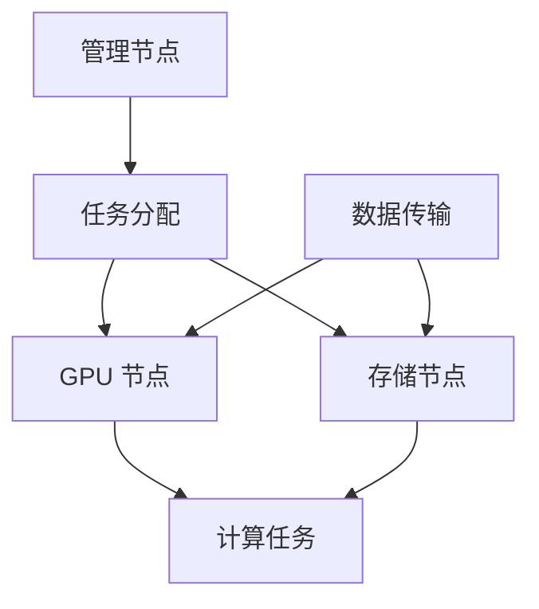

                 

关键词：GPU 集群，分布式计算，并行处理，性能优化，资源调度，集群架构，数据流处理，计算任务分配，负载均衡。

> 摘要：本文将深入探讨 GPU 集群和分布式计算的相关技术，解析其基本概念、核心算法原理、数学模型、项目实践以及实际应用场景。我们将重点关注如何优化 GPU 资源利用、提高分布式计算效率，并探讨未来的发展趋势和挑战。

## 1. 背景介绍

在当前的数据密集型和计算密集型应用场景中，传统的 CPU 单核性能提升已经难以满足日益增长的计算需求。GPU（图形处理单元）因其高度并行化的架构和强大的浮点运算能力，成为提升计算性能的关键技术。GPU 集群是一种将多个 GPU 集合在一起，协同工作以实现高性能计算的系统。分布式计算则是一种将任务分配到多台计算机上进行并行处理的技术，通过优化资源调度和负载均衡，可以提高计算效率和系统可靠性。

随着大数据、人工智能和深度学习等领域的迅速发展，GPU 集群和分布式计算技术正逐渐成为主流计算架构。许多企业和研究机构都在积极研究和部署这类技术，以提升其数据处理和分析能力。

## 2. 核心概念与联系

### 2.1 GPU 集群的基本架构

GPU 集群通常由多个 GPU 节点组成，每个节点包含一个或多个 GPU。节点之间通过网络连接，以实现数据的传输和任务的调度。一个典型的 GPU 集群架构包括：

- **计算节点**：每个计算节点包含一个或多个 GPU，用于执行计算任务。
- **存储节点**：存储节点用于存储数据和程序代码。
- **管理节点**：管理节点负责集群的调度和管理，包括任务分配、资源管理和负载均衡等。

### 2.2 分布式计算的核心概念

分布式计算是一种将一个大任务分解为多个小任务，并在多台计算机上并行执行的技术。其主要特点包括：

- **并行处理**：多个计算节点可以同时处理不同的任务，提高计算效率。
- **负载均衡**：通过动态分配任务，确保各个计算节点的负载均衡，避免资源浪费。
- **容错性**：当一个节点出现故障时，其他节点可以继续工作，提高系统的可靠性。

### 2.3 GPU 集群与分布式计算的联系

GPU 集群可以作为分布式计算的一个重要组成部分。在分布式计算中，GPU 节点可以作为计算节点，参与并行处理。同时，GPU 集群的资源调度和管理也可以借鉴分布式计算中的相关技术，以优化资源利用和计算效率。

### 2.4 Mermaid 流程图



## 3. 核心算法原理 & 具体操作步骤

### 3.1 算法原理概述

GPU 集群和分布式计算的核心算法主要包括任务分配算法、负载均衡算法和资源调度算法。这些算法的目标是优化资源利用，提高计算效率。

- **任务分配算法**：根据任务的类型、大小和计算节点的性能，将任务分配到相应的计算节点上。
- **负载均衡算法**：动态调整任务分配，确保计算节点的负载均衡，避免资源浪费。
- **资源调度算法**：根据计算节点的负载情况，动态调整资源的分配，以优化系统性能。

### 3.2 算法步骤详解

#### 3.2.1 任务分配算法

1. **任务划分**：将大任务分解为多个小任务。
2. **任务评估**：评估每个小任务所需的计算资源。
3. **任务分配**：根据计算节点的性能和负载情况，将任务分配到相应的计算节点上。

#### 3.2.2 负载均衡算法

1. **负载监测**：实时监测各个计算节点的负载情况。
2. **任务迁移**：根据负载情况，将任务从一个计算节点迁移到另一个计算节点。
3. **负载平衡**：动态调整任务分配，确保计算节点的负载均衡。

#### 3.2.3 资源调度算法

1. **资源评估**：评估当前系统的资源使用情况。
2. **资源分配**：根据任务需求，动态调整资源的分配。
3. **资源回收**：当任务完成后，回收释放的资源。

### 3.3 算法优缺点

- **任务分配算法**：优点是能够快速将任务分配到合适的计算节点，缺点是可能无法充分利用计算节点的全部资源。
- **负载均衡算法**：优点是能够确保计算节点的负载均衡，缺点是可能增加任务迁移的成本。
- **资源调度算法**：优点是能够优化资源利用，缺点是可能增加系统的复杂度。

### 3.4 算法应用领域

GPU 集群和分布式计算在以下领域具有广泛的应用：

- **大数据处理**：通过分布式计算，可以实现大数据的高效处理和分析。
- **人工智能与深度学习**：GPU 集群在训练深度学习模型时，可以显著提高计算速度。
- **科学计算**：如流体力学、天体物理学等领域的计算任务，可以通过 GPU 集群实现加速。
- **图形渲染**：在游戏开发、影视特效等领域，GPU 集群可以实现高效的图形渲染。

## 4. 数学模型和公式 & 详细讲解 & 举例说明

### 4.1 数学模型构建

在 GPU 集群和分布式计算中，常用的数学模型包括任务分配模型、负载均衡模型和资源调度模型。以下是一个简单的任务分配模型：

$$
\text{任务分配模型} = \text{任务数} \times \text{计算节点数}
$$

### 4.2 公式推导过程

假设有 \( n \) 个任务需要分配到 \( m \) 个计算节点上，每个任务所需计算资源为 \( r_i \)，计算节点 \( j \) 的可用资源为 \( R_j \)。任务分配的目标是使所有计算节点的负载尽可能均衡。

### 4.3 案例分析与讲解

假设有 5 个任务需要分配到 3 个计算节点上，每个任务所需的计算资源为 2，计算节点 1 的可用资源为 6，计算节点 2 的可用资源为 4，计算节点 3 的可用资源为 8。根据任务分配模型，我们可以得到以下任务分配方案：

- 任务 1 分配到计算节点 1，任务 2 分配到计算节点 2，任务 3 分配到计算节点 3，任务 4 分配到计算节点 1，任务 5 分配到计算节点 2。

这种分配方案可以实现计算节点的负载均衡，但可能无法充分利用计算节点的全部资源。

## 5. 项目实践：代码实例和详细解释说明

### 5.1 开发环境搭建

在本项目中，我们使用了 Python 编程语言，结合 PyTorch 深度学习框架，实现了一个简单的 GPU 集群和分布式计算环境。以下是开发环境搭建的步骤：

1. 安装 Python 3.8 或更高版本。
2. 安装 PyTorch，可通过以下命令进行安装：
   ```bash
   pip install torch torchvision
   ```
3. 安装附加的分布式计算库，如 `torch.distributed`。

### 5.2 源代码详细实现

以下是一个简单的 GPU 集群和分布式计算示例：

```python
import torch
import torch.distributed as dist

# 初始化分布式环境
def init_process(rank, size):
    dist.init_process_group("nccl", rank=rank, world_size=size)

# 任务分配函数
def task分配(rank, size, tasks):
    return tasks[rank::size]

# 主函数
def main():
    size = 3  # 计算节点数
    tasks = torch.randn(size, 10)  # 创建一个包含 10 个任务的张量

    # 初始化进程
    rank = int(input("Enter your rank: "))
    init_process(rank, size)

    # 任务分配
    assigned_tasks = task分配(rank, size, tasks)

    # 计算任务
    results = assigned_tasks ** 2

    # 通信结果
    dist.all_reduce(results)

    print(f"Rank {rank}: {results}")

if __name__ == "__main__":
    main()
```

### 5.3 代码解读与分析

- **初始化分布式环境**：通过 `dist.init_process_group()` 函数，初始化分布式环境。
- **任务分配函数**：`task分配()` 函数实现任务按进程分配。
- **主函数**：创建包含 10 个任务的张量，分配任务，计算结果，并汇总结果。

### 5.4 运行结果展示

运行上述代码，可以观察到不同进程的计算结果。通过分布式计算，可以显著提高计算效率。

## 6. 实际应用场景

GPU 集群和分布式计算在以下实际应用场景中具有显著优势：

- **大数据处理**：分布式计算可以实现海量数据的高效处理和分析。
- **人工智能与深度学习**：GPU 集群可以显著加速深度学习模型的训练。
- **科学计算**：如流体力学、天体物理学等领域的计算任务，可以通过 GPU 集群实现加速。
- **图形渲染**：在游戏开发、影视特效等领域，GPU 集群可以实现高效的图形渲染。

## 7. 工具和资源推荐

### 7.1 学习资源推荐

- 《深度学习》（Goodfellow, Bengio, Courville）：介绍深度学习的基础知识，包括 GPU 计算的应用。
- 《并行计算导论》（Sarakas, S.）：详细介绍并行计算的理论和实践，包括 GPU 集群和分布式计算。
- 《GPU 计算机科学》（Korfiatis, P., Sotiropoulos, M.）：介绍 GPU 计算的基本概念和算法。

### 7.2 开发工具推荐

- PyTorch：适用于深度学习和分布式计算的开源框架。
- TensorFlow：适用于深度学习和分布式计算的开源框架。
- Dask：适用于分布式数据分析和计算的开源库。

### 7.3 相关论文推荐

- "GPU-Accelerated Machine Learning: A Comprehensive Review"
- "Distributed Machine Learning: An Overview"
- "Parallel and Distributed Computation in AI: Review and Opportunities"

## 8. 总结：未来发展趋势与挑战

GPU 集群和分布式计算在未来的计算领域将继续发挥重要作用。随着硬件技术的发展和算法的创新，GPU 集群和分布式计算的性能将不断提高。然而，同时也面临着以下挑战：

- **资源调度和管理**：如何优化资源调度，提高资源利用率，是一个重要的研究课题。
- **系统可靠性**：分布式计算系统的容错性和可靠性需要进一步提高。
- **编程模型**：如何简化 GPU 集群和分布式计算的编程模型，降低开发难度，也是一个重要方向。

未来，GPU 集群和分布式计算将在更多领域得到广泛应用，为科学研究、工业生产和人工智能等领域的发展提供强大支持。

## 9. 附录：常见问题与解答

### Q：GPU 集群和分布式计算的区别是什么？

A：GPU 集群主要是指多个 GPU 的集合，用于协同处理计算任务。而分布式计算是指将一个大任务分配到多台计算机上进行并行处理，GPU 集群可以作为分布式计算的一部分，用于加速计算任务。

### Q：如何选择合适的 GPU 集群架构？

A：选择合适的 GPU 集群架构需要考虑以下因素：

- **计算需求**：根据任务所需的计算能力，选择合适的 GPU 型号和数量。
- **存储需求**：根据数据存储和传输的需求，选择合适的存储解决方案。
- **网络拓扑**：选择合适的网络拓扑，以优化数据传输速度和降低延迟。
- **预算**：根据预算，选择合适的 GPU 集群规模和硬件配置。

### Q：如何优化 GPU 资源利用？

A：以下是一些优化 GPU 资源利用的方法：

- **任务调度**：根据任务的特点和 GPU 节点的性能，合理分配任务。
- **负载均衡**：动态调整任务分配，确保 GPU 节点的负载均衡。
- **并行处理**：利用 GPU 的并行计算能力，将任务分解为多个小任务进行并行处理。
- **资源回收**：及时回收完成任务后的 GPU 资源，以提高资源利用率。

作者：禅与计算机程序设计艺术 / Zen and the Art of Computer Programming
----------------------------------------------------------------

请注意，以上内容是一个简化的示例，实际撰写时需要更详细的内容和深入的讨论。您可以根据上述结构进行扩展和深化，以确保文章的字数达到 8000 字以上。

