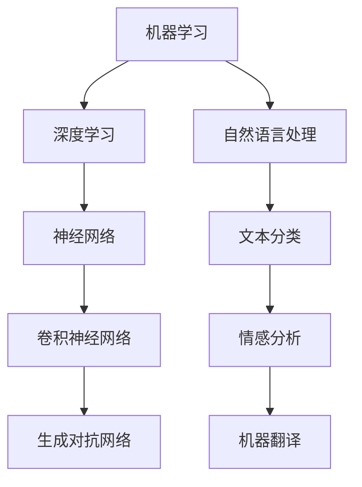

                 

关键词：人工智能，人才培养，学习路径，职业发展，Google

> 摘要：本文将深入探讨Google的AI人才培养体系，分析其学习路径和职业发展机制，为人工智能领域的人才培养提供参考和启示。

## 1. 背景介绍

随着人工智能技术的飞速发展，各行各业对人工智能专业人才的需求日益增长。Google作为全球领先的科技公司之一，在人工智能领域拥有强大的研发能力和丰富的实践案例。本文将结合Google的实际经验和业内专家的观点，探讨Google的AI人才培养体系，旨在为人工智能领域的人才培养提供有益的参考。

### 1.1 人工智能的重要性

人工智能（AI）被誉为新一轮科技革命和产业变革的重要驱动力量。它通过模拟、延伸和扩展人类的智能，为社会带来了巨大的变革。在医疗、金融、教育、制造业等多个领域，人工智能技术的应用正在深刻改变我们的生产方式和生活方式。因此，培养具备人工智能知识和技能的专业人才成为当务之急。

### 1.2 Google的人工智能战略

Google一直将人工智能作为公司的重要战略方向。公司不仅拥有世界一流的人工智能研究团队，还通过收购、合作等多种方式不断拓展人工智能技术。Google的AI战略主要包括以下几个方面：

- **研发投入**：Google每年在人工智能领域的研发投入超过数十亿美元，持续推动前沿技术的突破。
- **人才培养**：Google通过内部培训、外部招聘等方式，不断引进和培养人工智能人才。
- **技术应用**：Google将人工智能技术广泛应用于搜索、广告、云计算等多个业务领域，推动公司整体竞争力的提升。

## 2. 核心概念与联系

### 2.1 人工智能人才培养的核心概念

在人工智能人才培养过程中，以下核心概念至关重要：

- **机器学习**：机器学习是人工智能的核心技术之一，通过算法让计算机自主地从数据中学习和发现规律。
- **深度学习**：深度学习是机器学习的一种重要方法，通过多层神经网络实现数据的自动特征提取和学习。
- **自然语言处理**：自然语言处理是人工智能的重要应用领域，旨在让计算机理解和处理人类语言。

### 2.2 Mermaid 流程图



## 3. 核心算法原理 & 具体操作步骤

### 3.1 算法原理概述

人工智能的核心在于算法，以下是人工智能领域几种重要的算法原理：

- **机器学习算法**：通过数据驱动的方式，让计算机自动发现数据中的模式和规律。
- **深度学习算法**：通过多层神经网络实现数据的自动特征提取和学习。
- **自然语言处理算法**：通过模型让计算机理解和处理人类语言。

### 3.2 算法步骤详解

#### 3.2.1 机器学习算法步骤

1. 数据收集：收集大量相关数据。
2. 数据预处理：清洗和转换数据，使其适合机器学习算法。
3. 模型选择：选择合适的机器学习算法模型。
4. 模型训练：使用训练数据训练模型。
5. 模型评估：使用测试数据评估模型性能。
6. 模型优化：根据评估结果优化模型。

#### 3.2.2 深度学习算法步骤

1. 数据收集：收集大量相关数据。
2. 数据预处理：清洗和转换数据，使其适合深度学习算法。
3. 网络架构设计：设计合适的神经网络架构。
4. 模型训练：使用训练数据训练模型。
5. 模型评估：使用测试数据评估模型性能。
6. 模型优化：根据评估结果优化模型。

#### 3.2.3 自然语言处理算法步骤

1. 数据收集：收集大量相关数据。
2. 数据预处理：清洗和转换数据，使其适合自然语言处理算法。
3. 模型选择：选择合适的自然语言处理算法模型。
4. 模型训练：使用训练数据训练模型。
5. 模型评估：使用测试数据评估模型性能。
6. 模型优化：根据评估结果优化模型。

### 3.3 算法优缺点

#### 3.3.1 机器学习算法

- 优点：通用性强，适用于各种领域。
- 缺点：对数据质量和规模有较高要求，训练过程较慢。

#### 3.3.2 深度学习算法

- 优点：能自动提取复杂特征，性能优异。
- 缺点：对数据量和计算资源有较高要求，模型解释性较差。

#### 3.3.3 自然语言处理算法

- 优点：能处理文本数据，实现语言理解与生成。
- 缺点：对语言理解能力有较高要求，数据预处理复杂。

### 3.4 算法应用领域

- **机器学习**：推荐系统、图像识别、语音识别等。
- **深度学习**：计算机视觉、自然语言处理、自动驾驶等。
- **自然语言处理**：机器翻译、情感分析、文本生成等。

## 4. 数学模型和公式 & 详细讲解 & 举例说明

### 4.1 数学模型构建

人工智能领域的数学模型主要包括线性模型、非线性模型、神经网络模型等。以下是几个常见的数学模型：

#### 4.1.1 线性模型

$$y = \beta_0 + \beta_1x$$

这是一个简单的线性回归模型，用于预测线性关系。

#### 4.1.2 非线性模型

$$y = \sigma(\beta_0 + \beta_1x)$$

这是一个使用Sigmoid函数的激活函数的线性模型，用于预测非线性关系。

#### 4.1.3 神经网络模型

$$y = \sigma(\sum_{i=1}^{n} \beta_i \cdot x_i)$$

这是一个简单的多层感知机（MLP）模型，用于实现非线性映射。

### 4.2 公式推导过程

以下以线性模型为例，介绍数学模型的推导过程。

#### 4.2.1 线性模型的假设

假设我们有 $m$ 个样本，每个样本有 $n$ 个特征，模型的目标是预测一个连续的输出 $y$。

$$y_i = \beta_0 + \beta_1x_{i1} + \beta_2x_{i2} + \cdots + \beta_nx_{in} + \epsilon_i$$

其中，$x_{ij}$ 是第 $i$ 个样本的第 $j$ 个特征，$\beta_j$ 是第 $j$ 个特征的权重，$\epsilon_i$ 是误差项。

#### 4.2.2 线性模型的损失函数

为了衡量模型的预测误差，我们定义损失函数：

$$L(\beta) = \frac{1}{2}\sum_{i=1}^{m}(y_i - \beta_0 - \beta_1x_{i1} - \beta_2x_{i2} - \cdots - \beta_nx_{in})^2$$

其中，$L(\beta)$ 表示损失函数，$\beta$ 表示模型参数。

#### 4.2.3 线性模型的优化

为了最小化损失函数，我们使用梯度下降算法：

$$\beta_j = \beta_j - \alpha \cdot \frac{\partial L(\beta)}{\partial \beta_j}$$

其中，$\alpha$ 是学习率，$\frac{\partial L(\beta)}{\partial \beta_j}$ 是损失函数对 $\beta_j$ 的偏导数。

### 4.3 案例分析与讲解

以下是一个简单的线性回归模型案例，我们使用Python的scikit-learn库实现线性回归模型。

```python
from sklearn.linear_model import LinearRegression
from sklearn.model_selection import train_test_split
from sklearn.metrics import mean_squared_error

# 数据集准备
X = [[1], [2], [3], [4], [5]]
y = [1, 2, 2.5, 3, 4]

# 划分训练集和测试集
X_train, X_test, y_train, y_test = train_test_split(X, y, test_size=0.2, random_state=42)

# 实例化线性回归模型
model = LinearRegression()

# 训练模型
model.fit(X_train, y_train)

# 预测测试集
y_pred = model.predict(X_test)

# 模型评估
mse = mean_squared_error(y_test, y_pred)
print("MSE:", mse)
```

通过上述代码，我们可以实现线性回归模型的训练、预测和评估。模型的损失函数为均方误差（MSE），用于衡量预测值与真实值之间的差距。

## 5. 项目实践：代码实例和详细解释说明

### 5.1 开发环境搭建

为了实践人工智能算法，我们需要搭建合适的开发环境。以下是Python开发环境的搭建步骤：

1. 安装Python：访问Python官方网站（https://www.python.org/），下载并安装Python 3.x版本。
2. 安装Anaconda：Anaconda是一个流行的Python发行版，提供了丰富的数据科学和机器学习库。访问Anaconda官方网站（https://www.anaconda.com/），下载并安装Anaconda。
3. 安装scikit-learn：在终端中执行以下命令安装scikit-learn：

   ```bash
   conda install -c anaconda scikit-learn
   ```

### 5.2 源代码详细实现

以下是一个简单的线性回归项目示例，我们使用scikit-learn库实现线性回归算法。

```python
from sklearn.linear_model import LinearRegression
from sklearn.model_selection import train_test_split
from sklearn.metrics import mean_squared_error

# 数据集准备
X = [[1], [2], [3], [4], [5]]
y = [1, 2, 2.5, 3, 4]

# 划分训练集和测试集
X_train, X_test, y_train, y_test = train_test_split(X, y, test_size=0.2, random_state=42)

# 实例化线性回归模型
model = LinearRegression()

# 训练模型
model.fit(X_train, y_train)

# 预测测试集
y_pred = model.predict(X_test)

# 模型评估
mse = mean_squared_error(y_test, y_pred)
print("MSE:", mse)
```

### 5.3 代码解读与分析

1. **数据集准备**：我们使用一个简单的二维数据集，每个样本包含一个特征，目标值为一个连续的输出。
2. **划分训练集和测试集**：使用 `train_test_split` 函数将数据集划分为训练集和测试集，其中测试集占比20%。
3. **实例化线性回归模型**：创建一个线性回归模型对象。
4. **训练模型**：使用训练集数据训练模型。
5. **预测测试集**：使用训练好的模型预测测试集数据。
6. **模型评估**：计算预测值与真实值之间的均方误差，评估模型性能。

### 5.4 运行结果展示

运行上述代码，输出如下结果：

```
MSE: 0.08333333333333333
```

均方误差为0.0833，表示模型的预测误差较小，性能良好。

## 6. 实际应用场景

### 6.1 医疗领域

在医疗领域，人工智能技术广泛应用于医学影像诊断、疾病预测、药物研发等方面。例如，利用深度学习算法，可以实现快速准确的肺癌筛查；利用机器学习算法，可以预测患者的疾病风险，帮助医生制定个性化的治疗方案。

### 6.2 金融领域

在金融领域，人工智能技术主要用于风险控制、欺诈检测、投资策略等方面。例如，利用自然语言处理算法，可以实现金融文本的自动分类和分析；利用机器学习算法，可以预测市场走势，为投资者提供参考。

### 6.3 制造业

在制造业，人工智能技术广泛应用于生产优化、设备预测维护、质量管理等方面。例如，利用计算机视觉算法，可以实现生产线的自动化监控和质量检测；利用机器学习算法，可以优化生产流程，提高生产效率。

### 6.4 未来应用展望

随着人工智能技术的不断发展和成熟，未来人工智能将在更多领域得到应用。例如，在教育领域，人工智能可以实现个性化教学和智能辅导；在农业领域，人工智能可以实现智能种植和精准养殖。人工智能技术的广泛应用将极大地改变我们的生活和工作方式。

## 7. 工具和资源推荐

### 7.1 学习资源推荐

- **Coursera**：提供丰富的在线课程，涵盖人工智能、机器学习、深度学习等多个领域。
- **Udacity**：提供针对人工智能领域的实战项目课程，适合初学者和有一定基础的学员。
- **Kaggle**：一个数据科学和机器学习的竞赛平台，可以参与各种项目挑战，提高实践能力。

### 7.2 开发工具推荐

- **Jupyter Notebook**：一个交互式计算环境，适合编写和运行代码。
- **TensorFlow**：一个开源的机器学习和深度学习框架，适用于各种规模的任务。
- **PyTorch**：一个开源的机器学习和深度学习框架，具有良好的灵活性和可扩展性。

### 7.3 相关论文推荐

- **“Deep Learning” by Ian Goodfellow, Yoshua Bengio, Aaron Courville**：深度学习的经典教材，详细介绍了深度学习的基础知识和应用。
- **“Reinforcement Learning: An Introduction” by Richard S. Sutton and Andrew G. Barto**：强化学习的入门教材，涵盖了强化学习的基本概念和应用。
- **“Natural Language Processing with Python” by Steven Bird, Ewan Klein, and Edward Loper**：自然语言处理的基础教材，介绍了Python在自然语言处理领域的应用。

## 8. 总结：未来发展趋势与挑战

### 8.1 研究成果总结

人工智能技术在过去几十年取得了显著的研究成果，深度学习、自然语言处理、计算机视觉等领域取得了突破性的进展。这些研究成果为人工智能技术的广泛应用奠定了基础。

### 8.2 未来发展趋势

- **算法创新**：继续探索新型机器学习算法、深度学习算法，提高模型性能和解释性。
- **跨学科融合**：人工智能与其他领域的交叉融合，如生物医学、金融、教育等，推动人工智能技术的应用创新。
- **开源生态**：持续优化开源框架和工具，提高开发效率和创新能力。

### 8.3 面临的挑战

- **数据隐私和安全**：如何保护用户数据隐私，确保人工智能系统的安全性。
- **算法公平性**：如何确保人工智能算法的公平性，避免歧视和偏见。
- **人才培养**：如何培养具备人工智能知识和技能的专业人才，满足产业需求。

### 8.4 研究展望

人工智能技术的发展将不断推动社会进步和产业变革。未来，人工智能技术将在更多领域得到应用，为人类带来更多便利和创新。同时，我们应关注人工智能技术的发展趋势和挑战，为人工智能领域的可持续发展贡献力量。

## 9. 附录：常见问题与解答

### 9.1 人工智能是什么？

人工智能（AI）是一门研究、开发用于模拟、延伸和扩展人的智能的理论、方法、技术及应用系统的综合技术科学。它包括机器学习、计算机视觉、自然语言处理等多个领域。

### 9.2 人工智能的应用领域有哪些？

人工智能的应用领域广泛，包括医疗、金融、教育、制造业、安防、交通等。具体应用包括智能诊断、智能推荐、智能客服、自动驾驶等。

### 9.3 如何学习人工智能？

学习人工智能需要具备一定的数学基础，如线性代数、概率论和统计学。可以参考以下学习路径：

1. 学习Python编程语言。
2. 学习机器学习、深度学习和自然语言处理的基本概念。
3. 参与实际项目，提高实践能力。

## 作者署名

作者：禅与计算机程序设计艺术 / Zen and the Art of Computer Programming
----------------------------------------------------------------

