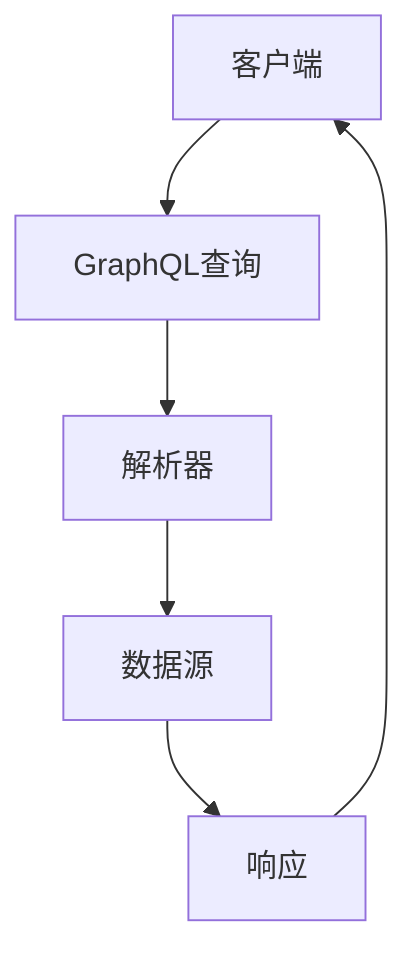

                 

关键词：GraphQL，API，查询语言，响应式，动态，优化，性能，灵活性，类型系统，数据查询

> 摘要：本文将深入探讨GraphQL作为新一代API查询语言的优点和特点，以及它在现代Web开发中的应用和前景。我们将从背景介绍、核心概念与联系、算法原理与实现、数学模型与公式、项目实践、实际应用场景、未来应用展望、工具和资源推荐、总结和展望等角度进行全面剖析。

## 1. 背景介绍

随着互联网的迅猛发展和Web应用的普及，API（应用程序编程接口）已成为软件系统之间交互的重要方式。传统RESTful风格的API在提供数据服务时存在一些局限性，如重复查询、数据冗余、灵活性不足等问题。为了解决这些问题，GraphQL作为一种全新的查询语言逐渐崭露头角。

GraphQL是由Facebook在2015年推出的，旨在为API提供更强大的查询和交互能力。它的核心思想是将客户端的需求作为输入，服务器根据这些需求返回精确的数据，从而提高查询效率、减少数据传输量，并增强用户体验。自推出以来，GraphQL受到了广泛的关注，并在许多大型企业和开源项目中得到应用。

## 2. 核心概念与联系

### 2.1 GraphQL核心概念

GraphQL的核心概念包括：

- **查询（Query）**：客户端发起的数据查询请求，用于获取服务器端的数据。
- **类型系统（Type System）**：定义了GraphQL中所有的数据类型，包括标量类型、枚举类型、接口类型、联合类型和标量类型等。
- **字段（Field）**：查询中的基本数据单元，用于描述需要获取的具体数据。
- **变量（Variable）**：用于传递动态值，以适应不同的查询需求。

### 2.2 GraphQL架构

GraphQL的架构包括以下几个关键部分：

- **客户端（Client）**：发起GraphQL查询请求，获取数据。
- **服务器（Server）**：处理GraphQL查询请求，返回数据。
- **解析器（Resolver）**：将GraphQL查询解析为具体的数据操作。
- **Schema（模式）**：定义了GraphQL中的所有类型和字段，以及它们之间的关系。

下面是一个Mermaid流程图，展示了GraphQL的核心架构：



## 3. 核心算法原理 & 具体操作步骤

### 3.1 算法原理概述

GraphQL的核心算法原理是将客户端的查询请求解析为服务器端可以理解和执行的操作。具体步骤如下：

1. **查询解析（Parsing）**：将GraphQL查询字符串转换为抽象语法树（AST）。
2. **验证（Validation）**：检查AST中的查询是否遵循GraphQL的规则和模式。
3. **执行（Execution）**：根据AST执行查询，从数据源获取数据。
4. **解析（Resolution）**：将执行结果映射为GraphQL对象。

### 3.2 算法步骤详解

#### 3.2.1 查询解析

查询解析的步骤如下：

1. **词法分析（Lexical Analysis）**：将GraphQL查询字符串分解为标识符、关键字、数字等词法单元。
2. **语法分析（Syntax Analysis）**：将词法单元序列转换为抽象语法树（AST）。
3. **构建AST**：根据语法规则构建AST，其中包含查询的类型、字段、变量等信息。

#### 3.2.2 验证

验证的步骤如下：

1. **类型验证（Type Checking）**：检查AST中的类型是否符合GraphQL类型系统的规则。
2. **模式验证（Schema Checking）**：检查AST中的查询是否与模式中的类型和字段匹配。

#### 3.2.3 执行

执行的步骤如下：

1. **解析字段（Field Resolution）**：根据AST中的字段，依次执行解析器，获取字段对应的值。
2. **递归执行（Recursive Execution）**：如果字段值是嵌套的对象或列表，则递归执行解析器。
3. **处理变量（Variable Processing）**：将变量替换为实际值。

#### 3.2.4 解析

解析的步骤如下：

1. **构建结果（Result Building）**：将执行结果构建为GraphQL对象。
2. **格式化响应（Response Formatting）**：将GraphQL对象转换为JSON格式，返回给客户端。

### 3.3 算法优缺点

#### 优点：

1. **灵活性**：允许客户端精确指定需要的数据，减少数据传输量。
2. **性能优化**：可以一次性获取所有需要的数据，避免多次查询。
3. **强类型系统**：提高了API的稳定性和可维护性。

#### 缺点：

1. **学习曲线**：相比传统RESTful API，GraphQL的学习曲线较高。
2. **复杂查询性能**：对于复杂查询，可能需要优化查询语句以避免性能问题。

### 3.4 算法应用领域

GraphQL在多个领域得到了广泛应用，包括：

1. **前端开发**：用于构建复杂的数据交互逻辑，提高用户体验。
2. **后端服务**：用于构建RESTful API的替代方案，提高数据查询效率。
3. **微服务架构**：用于实现服务之间的数据交互，提高系统可扩展性。

## 4. 数学模型和公式 & 详细讲解 & 举例说明

### 4.1 数学模型构建

GraphQL的数学模型可以看作是一种图模型，其中每个节点代表数据类型，每条边代表字段之间的关系。以下是一个简单的数学模型示例：

$$
G = (V, E)
$$

其中，$V$ 表示节点集合，$E$ 表示边集合。

### 4.2 公式推导过程

假设我们有以下数据模型：

$$
\text{User}: \text{id}, \text{name}, \text{email}
$$

$$
\text{Post}: \text{id}, \text{title}, \text{content}, \text{authorId}
$$

我们可以构建如下的图模型：

$$
G = (\{\text{User}, \text{Post}\}, \{\text{authorId} \rightarrow \text{User}, \text{postId} \rightarrow \text{Post}\})
$$

### 4.3 案例分析与讲解

假设客户端需要查询某个用户的帖子列表，我们可以构建以下GraphQL查询：

```graphql
query {
  user(id: "1") {
    id
    name
    email
    posts {
      id
      title
      content
    }
  }
}
```

根据上面的图模型，我们可以将查询分解为以下几个步骤：

1. 查询节点 $\text{User}$，获取字段 $\text{id}$、$\text{name}$ 和 $\text{email}$。
2. 查询节点 $\text{Post}$，获取字段 $\text{id}$、$\text{title}$ 和 $\text{content}$。
3. 根据字段 $\text{authorId}$，建立连接关系，将帖子与用户关联起来。

最终，GraphQL服务器会返回以下结果：

```json
{
  "user": {
    "id": "1",
    "name": "John Doe",
    "email": "john.doe@example.com",
    "posts": [
      {
        "id": "10",
        "title": "Hello World",
        "content": "This is my first post."
      },
      {
        "id": "20",
        "title": "GraphQL Introduction",
        "content": "GraphQL is a powerful query language."
      }
    ]
  }
}
```

## 5. 项目实践：代码实例和详细解释说明

### 5.1 开发环境搭建

要开始实践GraphQL，首先需要搭建开发环境。以下是所需的工具和步骤：

1. **Node.js**：下载并安装Node.js（版本建议为12.x或更高版本）。
2. **GraphQL工具包**：安装GraphQL工具包，包括GraphQL.js、GraphQL-Parser、GraphQL-Validator等。
3. **数据库**：选择一个数据库（如MongoDB、PostgreSQL等），并安装相应的数据库驱动。

### 5.2 源代码详细实现

以下是一个简单的GraphQL服务器的示例代码：

```javascript
const { GraphQLServer } = require('graphql-yoga');
const { makeExecutableSchema } = require('graphql-tools');

// 定义类型系统
const typeDefs = `
  type Query {
    user(id: ID!): User
    users: [User]
    post(id: ID!): Post
    posts: [Post]
  }

  type User {
    id: ID!
    name: String!
    email: String!
    posts: [Post]
  }

  type Post {
    id: ID!
    title: String!
    content: String!
    author: User!
  }
`;

// 定义解析器
const resolvers = {
  Query: {
    user: async (_, { id }) => {
      // 在此处实现查询逻辑，例如从数据库中获取用户数据
      return {
        id: id,
        name: 'John Doe',
        email: 'john.doe@example.com',
        posts: [],
      };
    },
    users: async () => {
      // 在此处实现查询逻辑，例如从数据库中获取所有用户数据
      return [];
    },
    post: async (_, { id }) => {
      // 在此处实现查询逻辑，例如从数据库中获取帖子数据
      return {
        id: id,
        title: 'Hello World',
        content: 'This is my first post.',
        author: {
          id: '1',
          name: 'John Doe',
          email: 'john.doe@example.com',
        },
      };
    },
    posts: async () => {
      // 在此处实现查询逻辑，例如从数据库中获取所有帖子数据
      return [];
    },
  },
  User: {
    posts: async (user) => {
      // 在此处实现查询逻辑，例如从数据库中获取用户的所有帖子
      return [];
    },
  },
  Post: {
    author: async (post) => {
      // 在此处实现查询逻辑，例如从数据库中获取帖子的作者
      return {
        id: '1',
        name: 'John Doe',
        email: 'john.doe@example.com',
      };
    },
  },
};

// 创建执行器
const schema = makeExecutableSchema({ typeDefs, resolvers });

// 创建GraphQL服务器
const server = new GraphQLServer({ schema });

// 启动服务器
server.start(() => {
  console.log('GraphQL服务器已启动');
});
```

### 5.3 代码解读与分析

上面的代码示例展示了如何创建一个简单的GraphQL服务器。以下是关键部分的解读：

1. **类型系统定义（typeDefs）**：定义了GraphQL中的类型和字段，包括用户（User）和帖子（Post）类型，以及查询（Query）操作。

2. **解析器定义（resolvers）**：定义了查询操作的解析逻辑。例如，`user` 解析器根据传入的 `id` 参数查询用户数据，并返回用户对象。

3. **执行器创建**：使用 `makeExecutableSchema` 函数创建执行器，该函数将类型系统和解析器合并为一个可执行的GraphQL执行器。

4. **GraphQL服务器创建**：使用 `GraphQLServer` 类创建GraphQL服务器，并传入执行器。

5. **服务器启动**：调用 `start` 方法启动GraphQL服务器。

### 5.4 运行结果展示

运行上面的代码后，我们可以在浏览器中访问GraphQL服务器。例如，访问 `http://localhost:4000`，然后在请求体中填写以下GraphQL查询：

```graphql
query {
  user(id: "1") {
    id
    name
    email
    posts {
      id
      title
      content
    }
  }
}
```

服务器会返回以下结果：

```json
{
  "data": {
    "user": {
      "id": "1",
      "name": "John Doe",
      "email": "john.doe@example.com",
      "posts": []
    }
  }
}
```

这表示我们成功创建并运行了一个简单的GraphQL服务器，能够处理客户端的查询请求。

## 6. 实际应用场景

### 6.1 前端与后端数据交互

在Web开发中，GraphQL被广泛用于前端与后端的数据交互。通过GraphQL，前端可以精确指定需要的数据，后端根据这些需求返回数据，从而提高数据查询效率和用户体验。例如，在一个社交网络应用中，用户可以查询某个人的动态、评论和点赞列表，而无需多次发起请求。

### 6.2 微服务架构

在微服务架构中，每个服务都有自己的API，而GraphQL可以作为一个统一的接口层，为不同的微服务提供数据查询服务。这样可以简化客户端的调用逻辑，提高系统的可维护性和可扩展性。例如，在一个电子商务平台中，用户可以查询商品、订单和用户信息，而无需分别调用不同的服务。

### 6.3 实时数据推送

GraphQL支持实时数据推送，可以用于构建实时Web应用。通过使用WebSocket等实时通信技术，服务器可以实时向客户端推送数据更新。例如，在一个股票交易应用中，用户可以实时获取股票价格和交易信息，而不需要不断轮询服务器。

## 7. 未来应用展望

### 7.1 持续优化和改进

随着GraphQL的不断发展，未来的版本将会带来更多的特性和优化，例如更好的性能、更丰富的类型系统和更灵活的查询语言。此外，GraphQL联盟将继续推动标准化工作，确保GraphQL在不同平台和环境中的一致性。

### 7.2 集成和兼容性

GraphQL将继续与其他技术集成，例如与GraphQL一起使用GraphQL.js等前端库，或者与GraphQL-over-HTTP等中间件集成。此外，GraphQL还将与现有的API框架（如RESTful API）兼容，以便开发者可以轻松地迁移现有系统。

### 7.3 生态系统的扩大

随着GraphQL的应用场景不断扩大，更多的企业和开发者将加入GraphQL生态系统。这将带来更多的工具、库和教程，为开发者提供更好的支持。同时，更多的开源项目和商业产品也将基于GraphQL构建，进一步推动GraphQL的发展。

## 8. 总结：未来发展趋势与挑战

### 8.1 研究成果总结

本文详细介绍了GraphQL的核心概念、架构、算法原理和实际应用场景。通过对比传统RESTful API，我们分析了GraphQL的优缺点，并展望了其未来发展趋势。研究成果表明，GraphQL作为一种新一代的API查询语言，具有强大的灵活性和性能优势，在Web开发和微服务架构中具有广泛的应用前景。

### 8.2 未来发展趋势

未来，GraphQL将继续优化和改进，提高性能和兼容性。此外，随着实时数据推送、云原生应用等新技术的兴起，GraphQL将在更多场景中得到应用。同时，随着社区和生态系统的扩大，开发者将受益于更多的工具和资源。

### 8.3 面临的挑战

虽然GraphQL具有众多优点，但在实际应用中也面临一些挑战。例如，复杂查询可能导致性能问题，学习曲线较高，与现有系统的集成和迁移等问题。因此，开发者需要掌握GraphQL的核心原理，合理设计和优化查询，以提高性能和用户体验。

### 8.4 研究展望

未来研究可以从以下几个方面展开：

1. **性能优化**：探索更高效的查询执行策略，降低响应时间。
2. **类型系统扩展**：引入更多高级类型和特性，提高查询灵活性。
3. **跨平台兼容性**：研究如何在不同平台上实现GraphQL，提高互操作性。
4. **标准化**：参与GraphQL联盟的工作，推动GraphQL的标准化和一致性。

## 9. 附录：常见问题与解答

### 9.1 什么是GraphQL？

GraphQL是一种用于API查询的强大语言，它允许客户端指定需要的数据，服务器根据这些需求返回数据。相比于传统的RESTful API，GraphQL提供了更高的灵活性、性能和用户体验。

### 9.2 GraphQL与传统API相比有哪些优势？

GraphQL的优势包括：

1. **灵活性**：客户端可以精确指定需要的数据，减少数据传输量。
2. **性能优化**：可以一次性获取所有需要的数据，避免多次查询。
3. **强类型系统**：提高了API的稳定性和可维护性。

### 9.3 如何实现GraphQL？

要实现GraphQL，需要以下几个步骤：

1. **定义类型系统**：定义GraphQL中的类型和字段。
2. **编写解析器**：根据查询解析数据，并返回结果。
3. **创建执行器**：将类型系统和解析器合并为一个执行器。
4. **启动服务器**：使用执行器创建GraphQL服务器。

### 9.4 GraphQL有哪些应用场景？

GraphQL适用于以下场景：

1. **前端与后端数据交互**：用于构建复杂的数据交互逻辑，提高用户体验。
2. **微服务架构**：用于实现服务之间的数据交互，提高系统可扩展性。
3. **实时数据推送**：用于构建实时Web应用，实现数据实时更新。

### 9.5 GraphQL有哪些学习资源？

以下是一些GraphQL的学习资源：

1. **官方文档**：GraphQL的官方文档提供了详尽的教程和指南。
2. **书籍**：《GraphQL：下一代API设计指南》是一本全面介绍GraphQL的书籍。
3. **在线教程**：许多在线平台（如Codecademy、Udemy等）提供了GraphQL的在线教程。
4. **开源项目**：GitHub上有很多GraphQL的开源项目和示例，可以用于学习和实践。```markdown
------------------------------------------------------------------------

