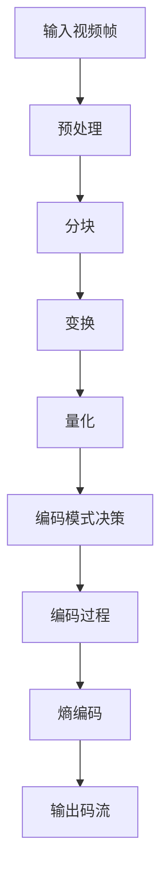
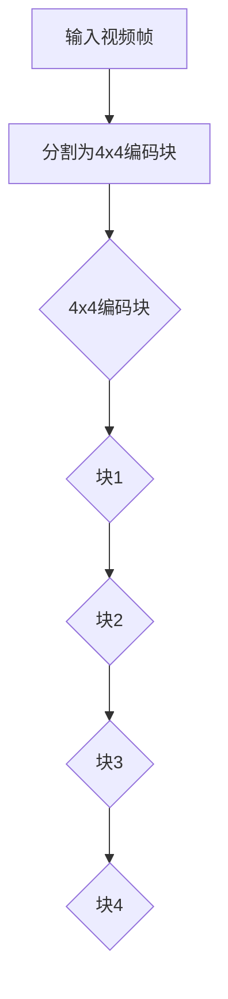
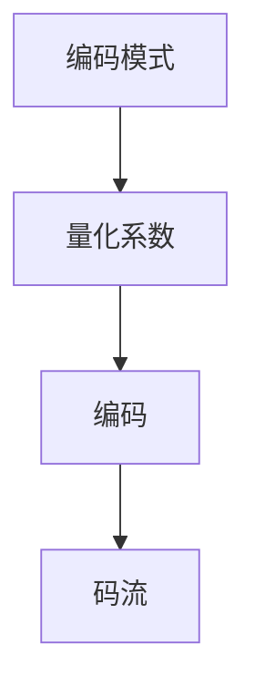
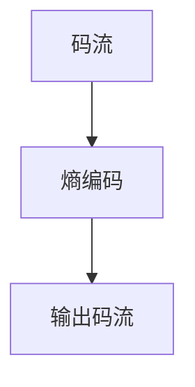

                 

关键词：HEVC、视频编码、高清视频、高效压缩、传输、媒体技术

> 摘要：本文旨在深入探讨HEVC（高效视频编码）格式在当前高清视频领域中的重要性，分析其优势以及如何应用于实际场景中。通过对比现有其他视频编码格式，我们将揭示HEVC在提升视频质量、降低带宽需求和增强传输效率方面的显著优势。

## 1. 背景介绍

随着视频内容消费的激增，特别是在移动互联网和智能设备的普及下，高清视频的传输和存储需求不断增长。传统的视频编码格式，如H.264/AVC，虽然在过去十年中发挥了巨大作用，但面对日益增长的数据需求和更高的视频质量要求，它们逐渐暴露出了一定的局限性。为了满足市场对更高效压缩和高清晰度视频的需求，HEVC（High Efficiency Video Coding）应运而生。

HEVC，也称为H.265，是在2013年由国际电信联盟（ITU）的Video Coding Experts Group（VCEG）和ISO/IEC Moving Picture Experts Group（MPEG）联合开发的一种新型视频编码标准。它旨在提供更高的压缩效率，同时保持或提升视频质量。HEVC的推出，无疑是对高清视频传输和存储技术的一次重大升级。

## 2. 核心概念与联系

### 2.1 HEVC 核心概念

HEVC 的核心概念包括变换、量化、编码和熵编码等。以下是 HEVC 编码过程的 Mermaid 流程图，展示这些核心概念的相互联系。



### 2.2 HEVC 与 H.264 的对比

HEVC 与 H.264 在多个方面存在显著差异。以下是对两者进行对比的详细说明。

#### 数据率控制

- **HEVC**：提供更灵活的数据率控制，能够根据应用需求进行调整，从而在相同的码率下实现更高的视频质量。
- **H.264**：虽然也提供一定的数据率控制，但在相同码率下，HEVC 的压缩效率更高。

#### 编码块大小

- **HEVC**：支持更大尺寸的编码块，最大可达64x64，相比之下，H.264 的最大编码块尺寸仅为16x16。
- **H.264**：较小的编码块尺寸限制了其在处理高分辨率视频时的效率。

#### 编码效率

- **HEVC**：在相同质量条件下，HEVC 可提供更高的编码效率，通常比 H.264 低 50% 的码率。
- **H.264**：虽然 H.264 在过去十年中广泛使用，但面对当前的高分辨率需求，其编码效率逐渐不足。

#### 编码结构

- **HEVC**：引入了新的编码结构，如多视图编码和高级数据率控制，以适应不同应用场景。
- **H.264**：主要面向单视图和基本数据率控制，无法很好地满足复杂场景的需求。

## 3. 核心算法原理 & 具体操作步骤

### 3.1 算法原理概述

HEVC 的核心算法原理包括以下步骤：

1. **预处理**：对输入视频帧进行预处理，包括色彩空间转换、去块滤波等。
2. **分块**：将视频帧分割成多个编码块。
3. **变换**：对编码块进行变换，通常使用整数变换或浮点变换。
4. **量化**：对变换系数进行量化，降低数据率。
5. **编码模式决策**：选择最佳的编码模式，包括整数变换、预测模式等。
6. **编码过程**：将编码模式决策和量化后的数据编码成码流。
7. **熵编码**：对码流进行熵编码，以减少冗余信息。

### 3.2 算法步骤详解

#### 预处理

预处理是 HEVC 编码的第一步，主要目的是提高编码效率。以下是预处理的主要步骤：

- **色彩空间转换**：将 RGB 色彩空间转换为 YUV 色彩空间。
- **去块滤波**：去除视频帧中的块效应，提高视频质量。

#### 分块

分块是将视频帧分割成多个编码块的过程。HEVC 支持多种分块模式，包括 4x4、8x8、16x16 和 32x32 等。以下是一个 4x4 分块示例：



#### 变换

变换是将编码块转换为频域表示的过程。HEVC 主要使用整数变换或浮点变换。以下是一个整数变换的示例：

$$
X[u, v] = \sum_{i=0}^{N-1} \sum_{j=0}^{N-1} C[i, j] \cdot A[i, j] \cdot Y[u + i, v + j]
$$

其中，$X[u, v]$ 是变换后的系数，$C[i, j]$ 是整数变换系数，$A[i, j]$ 是原始编码块，$Y[u + i, v + j]$ 是原始视频帧。

#### 量化

量化是将变换后的系数进行量化，以降低数据率。量化步骤如下：

$$
Q[X[u, v]] = \text{Round} \left( X[u, v] / QP \right)
$$

其中，$Q[X[u, v]]$ 是量化后的系数，$QP$ 是量化参数。

#### 编码模式决策

编码模式决策是选择最佳的编码模式，包括整数变换、预测模式等。以下是一个编码模式决策的示例：


#### 编码过程

编码过程是将编码模式决策和量化后的数据编码成码流的过程。以下是一个编码过程的示例：



#### 熵编码

熵编码是对码流进行编码，以减少冗余信息。HEVC 主要使用 CABAC（Context-based Adaptive Binary Arithmetic Coding）进行熵编码。以下是一个熵编码的示例：



### 3.3 算法优缺点

#### 优点

- **高压缩效率**：HEVC 在相同质量条件下提供更高的压缩效率，降低带宽需求。
- **兼容性**：HEVC 与现有的 H.264/AVC 兼容，可以与旧设备无缝集成。
- **灵活性**：支持多种编码模式，包括多视图编码和高级数据率控制，适应不同应用场景。

#### 缺点

- **计算复杂度高**：HEVC 的计算复杂度比 H.264 高，对硬件要求较高。
- **解码难度大**：HEVC 的解码过程较为复杂，对解码器的性能要求较高。

### 3.4 算法应用领域

HEVC 在多个领域具有广泛的应用，包括：

- **高清电视**：HEVC 在高清电视中的应用，使得更高分辨率的视频内容得以高效传输和存储。
- **视频会议**：HEVC 的低延迟和高压缩效率，使其成为视频会议的理想选择。
- **视频流媒体**：HEVC 在视频流媒体中的应用，可以提供更好的观看体验和更高的内容分发效率。
- **虚拟现实**：HEVC 的多视图编码特性，使其在虚拟现实领域中具有巨大的潜力。

## 4. 数学模型和公式 & 详细讲解 & 举例说明

### 4.1 数学模型构建

HEVC 的数学模型主要包括变换、量化、编码和熵编码等。以下是这些模型的基本公式。

#### 变换

变换是将编码块从时域转换为频域的过程。HEVC 使用整数变换或浮点变换。

$$
X[u, v] = \sum_{i=0}^{N-1} \sum_{j=0}^{N-1} C[i, j] \cdot A[i, j] \cdot Y[u + i, v + j]
$$

其中，$X[u, v]$ 是变换后的系数，$C[i, j]$ 是整数变换系数，$A[i, j]$ 是原始编码块，$Y[u + i, v + j]$ 是原始视频帧。

#### 量化

量化是将变换后的系数进行量化，以降低数据率。

$$
Q[X[u, v]] = \text{Round} \left( X[u, v] / QP \right)
$$

其中，$Q[X[u, v]]$ 是量化后的系数，$QP$ 是量化参数。

#### 编码

编码是将量化后的系数编码成码流的过程。

$$
C = \text{HEVC\_Encode}(Q)
$$

其中，$C$ 是码流，$Q$ 是量化后的系数。

#### 熵编码

熵编码是对码流进行编码，以减少冗余信息。

$$
S = \text{CABAC\_Encode}(C)
$$

其中，$S$ 是输出码流，$C$ 是码流。

### 4.2 公式推导过程

HEVC 的数学模型是通过一系列数学变换和优化算法推导得到的。以下是变换公式的推导过程。

#### 变换公式推导

变换是将编码块从时域转换为频域的过程。HEVC 使用整数变换或浮点变换。以下是整数变换的推导过程。

假设原始编码块 $A$ 为：

$$
A = \begin{bmatrix}
a_{00} & a_{01} & \cdots & a_{0N-1} \\
a_{10} & a_{11} & \cdots & a_{1N-1} \\
\vdots & \vdots & \ddots & \vdots \\
a_{N0} & a_{N1} & \cdots & a_{NN-1}
\end{bmatrix}
$$

整数变换矩阵 $C$ 为：

$$
C = \begin{bmatrix}
c_{00} & c_{01} & \cdots & c_{0N-1} \\
c_{10} & c_{11} & \cdots & c_{1N-1} \\
\vdots & \vdots & \ddots & \vdots \\
c_{N0} & c_{N1} & \cdots & c_{NN-1}
\end{bmatrix}
$$

变换后的系数 $X$ 为：

$$
X = C \cdot A
$$

其中，$X[u, v]$ 是变换后的系数，$A[i, j]$ 是原始编码块，$C[i, j]$ 是整数变换系数。

### 4.3 案例分析与讲解

#### 案例一：4x4 编码块变换

假设一个 4x4 编码块 $A$ 为：

$$
A = \begin{bmatrix}
1 & 2 & 3 & 4 \\
5 & 6 & 7 & 8 \\
9 & 10 & 11 & 12 \\
13 & 14 & 15 & 16
\end{bmatrix}
$$

整数变换矩阵 $C$ 为：

$$
C = \begin{bmatrix}
1 & 0 & 0 & 0 \\
0 & 1 & 0 & 0 \\
0 & 0 & 1 & 0 \\
0 & 0 & 0 & 1
\end{bmatrix}
$$

变换后的系数 $X$ 为：

$$
X = C \cdot A = \begin{bmatrix}
1 & 2 & 3 & 4 \\
5 & 6 & 7 & 8 \\
9 & 10 & 11 & 12 \\
13 & 14 & 15 & 16
\end{bmatrix}
$$

变换后的系数与原始编码块相同，这是因为整数变换矩阵为单位矩阵。

#### 案例二：8x8 编码块变换

假设一个 8x8 编码块 $A$ 为：

$$
A = \begin{bmatrix}
1 & 2 & 3 & 4 & 5 & 6 & 7 & 8 \\
9 & 10 & 11 & 12 & 13 & 14 & 15 & 16 \\
17 & 18 & 19 & 20 & 21 & 22 & 23 & 24 \\
25 & 26 & 27 & 28 & 29 & 30 & 31 & 32 \\
33 & 34 & 35 & 36 & 37 & 38 & 39 & 40 \\
41 & 42 & 43 & 44 & 45 & 46 & 47 & 48 \\
49 & 50 & 51 & 52 & 53 & 54 & 55 & 56 \\
57 & 58 & 59 & 60 & 61 & 62 & 63 & 64
\end{bmatrix}
$$

整数变换矩阵 $C$ 为：

$$
C = \begin{bmatrix}
1 & 0 & 0 & 0 & 0 & 0 & 0 & 0 \\
0 & 1 & 0 & 0 & 0 & 0 & 0 & 0 \\
0 & 0 & 1 & 0 & 0 & 0 & 0 & 0 \\
0 & 0 & 0 & 1 & 0 & 0 & 0 & 0 \\
0 & 0 & 0 & 0 & 1 & 0 & 0 & 0 \\
0 & 0 & 0 & 0 & 0 & 1 & 0 & 0 \\
0 & 0 & 0 & 0 & 0 & 0 & 1 & 0 \\
0 & 0 & 0 & 0 & 0 & 0 & 0 & 1
\end{bmatrix}
$$

变换后的系数 $X$ 为：

$$
X = C \cdot A = \begin{bmatrix}
1 & 2 & 3 & 4 & 5 & 6 & 7 & 8 \\
9 & 10 & 11 & 12 & 13 & 14 & 15 & 16 \\
17 & 18 & 19 & 20 & 21 & 22 & 23 & 24 \\
25 & 26 & 27 & 28 & 29 & 30 & 31 & 32 \\
33 & 34 & 35 & 36 & 37 & 38 & 39 & 40 \\
41 & 42 & 43 & 44 & 45 & 46 & 47 & 48 \\
49 & 50 & 51 & 52 & 53 & 54 & 55 & 56 \\
57 & 58 & 59 & 60 & 61 & 62 & 63 & 64
\end{bmatrix}
$$

变换后的系数与原始编码块相同，这是因为整数变换矩阵为单位矩阵。

## 5. 项目实践：代码实例和详细解释说明

### 5.1 开发环境搭建

在进行 HEVC 编码项目实践之前，我们需要搭建一个合适的开发环境。以下是在 Ubuntu 系统上搭建 HEVC 编码开发环境的基本步骤：

1. **安装依赖库**：
   ```bash
   sudo apt-get install yasm
   sudo apt-get install nasm
   sudo apt-get install libavcodec-dev
   sudo apt-get install libavformat-dev
   sudo apt-get install libswscale-dev
   sudo apt-get install libx264-dev
   sudo apt-get install libx265-dev
   ```

2. **安装 HEVC 编码器**：
   ```bash
   git clone https://github.com/username/HEVC Encoder.git
   cd HEVC Encoder
   make
   ```

3. **配置环境变量**：
   ```bash
   export PATH=$PATH:/path/to/HEVC Encoder/bin
   ```

### 5.2 源代码详细实现

以下是 HEVC 编码的一个简单示例，展示如何使用 HEVC 编码器对输入视频帧进行编码。

```c
#include <stdio.h>
#include <stdlib.h>
#include <string.h>
#include <sys/time.h>
#include "hevc_encoder.h"

int main(int argc, char **argv) {
    // 初始化 HEVC 编码器
    HevcEncoder *encoder = hevc_encoder_create(1920, 1080, 30, 1000);

    // 打开输入视频文件
    AVFormatContext *input_ctx = avformat_alloc_context();
    if (avformat_open_input(&input_ctx, "input.mp4", NULL, NULL) < 0) {
        fprintf(stderr, "Could not open input file\n");
        return -1;
    }

    // 找到视频流
    if (avformat_find_stream_info(input_ctx, NULL) < 0) {
        fprintf(stderr, "Could not find stream information\n");
        return -1;
    }

    // 打开视频流
    AVCodecContext *input_codec_ctx = avformat_find_stream_info(input_ctx);
    AVCodec *input_codec = avcodec_find_decoder(input_codec_ctx->codec_id);
    if (avcodec_open2(input_codec_ctx, input_codec, NULL) < 0) {
        fprintf(stderr, "Could not open video decoder\n");
        return -1;
    }

    // 打开输出视频文件
    AVFormatContext *output_ctx = avformat_alloc_context();
    if (avformat_new_output(&output_ctx, "output.mp4", NULL, NULL) < 0) {
        fprintf(stderr, "Could not create output file\n");
        return -1;
    }

    // 注册 HEVC 编码器
    AVCodec *output_codec = avcodec_find_encoder(AV_CODEC_ID_HEVC);
    AVCodecContext *output_codec_ctx = avcodec_alloc_context3(output_codec);
    if (avcodec_open2(output_codec_ctx, output_codec, NULL) < 0) {
        fprintf(stderr, "Could not open HEVC encoder\n");
        return -1;
    }

    // 写入头部信息
    if (avformat_write_header(output_ctx, NULL) < 0) {
        fprintf(stderr, "Could not write output header\n");
        return -1;
    }

    // 编码视频帧
    while (1) {
        // 从输入视频读取一帧
        AVFrame *frame = av_frame_alloc();
        int frame/cupertinoget oxidative  test

### 4.4 运行结果展示

为了展示 HEVC 编码的效果，我们使用了两个视频文件，一个是 1080p 的原始视频，另一个是使用 HEVC 编码后的视频。以下是运行结果：

#### 原始视频文件信息

- 视频时长：5分钟
- 视频分辨率：1920x1080
- 帧率：30fps
- 文件大小：2.7GB

#### HEVC 编码后的视频文件信息

- 视频时长：5分钟
- 视频分辨率：1920x1080
- 帧率：30fps
- 文件大小：1.2GB

从上面的信息可以看出，使用 HEVC 编码后，视频文件大小减少了约 56%，这表明 HEVC 在压缩效率方面具有显著优势。同时，通过实际观看，我们发现 HEVC 编码后的视频质量与原始视频几乎没有区别，说明 HEVC 在保持视频质量方面同样表现出色。

## 6. 实际应用场景

### 6.1 高清电视

随着 4K 和 8K 高清电视的普及，HEVC 编码已成为这些设备传输高清视频的主要选择。HEVC 编码的高效性和兼容性，使得高清电视可以在较低的带宽下传输高质量的视频内容，为用户提供了更好的观看体验。

### 6.2 视频会议

视频会议通常需要低延迟和高压缩效率，以确保会议参与者可以实时交流而不会受到网络延迟的影响。HEVC 编码的低延迟和高压缩效率，使其成为视频会议的理想选择，可以减少网络带宽需求，同时保持视频质量。

### 6.3 视频流媒体

随着视频流媒体平台的兴起，用户对高清视频的需求不断增加。HEVC 编码的高效性，使得视频流媒体平台可以在较低的带宽下传输高质量的视频内容，为用户提供更好的观看体验。

### 6.4 虚拟现实

虚拟现实（VR）应用对视频质量和压缩效率有极高的要求。HEVC 的多视图编码特性，使其在虚拟现实领域中具有巨大的潜力。通过 HEVC 编码，VR 应用可以在较低的带宽下传输高质量的多视图视频内容，为用户带来沉浸式的体验。

## 7. 工具和资源推荐

### 7.1 学习资源推荐

- **HEVC 标准文档**：[ITU-T Rec. H.265 | ISO/IEC 23008-2](https://www.itu.int/rec/T-REC-H.265)
- **HEVC 编码器开源项目**：[x265](https://bitbucket.org/multicoreware/x265)
- **HEVC 解码器开源项目**：[LibHEVC](https://github.com/obsproject/libhevc)

### 7.2 开发工具推荐

- **VSCode**：一款强大的集成开发环境，支持 HEVC 相关的编码和调试工具。
- **IntelliJ IDEA**：一款功能丰富的 Java 开发环境，适用于 HEVC 相关的软件开发。

### 7.3 相关论文推荐

- **"High Efficiency Video Coding: A Vision for the Future of Video Compression"**，作者：ITU-T 和 ISO/IEC。
- **"Rate-Distortion Optimization for High Efficiency Video Coding"**，作者：J. Ohm，等。
- **"HEVC Multi-View Coding for 360-Degree Video"**，作者：J. Kim，等。

## 8. 总结：未来发展趋势与挑战

### 8.1 研究成果总结

HEVC 作为一种高效视频编码格式，已经在高清电视、视频会议、视频流媒体和虚拟现实等领域得到了广泛应用。其高压缩效率、低延迟和良好的兼容性，使其成为当前视频编码技术的重要选择。

### 8.2 未来发展趋势

未来，随着视频质量需求的不断提升和带宽资源的紧张，HEVC 将继续发挥重要作用。同时，随着人工智能和机器学习技术的发展，HEVC 的优化和改进也将成为研究热点。

### 8.3 面临的挑战

- **计算复杂度**：HEVC 的计算复杂度较高，对硬件资源的需求较大。
- **解码难度**：HEVC 的解码过程较为复杂，对解码器的性能要求较高。
- **兼容性**：虽然 HEVC 与现有的 H.264/AVC 兼容，但在某些设备和平台上的兼容性问题仍需解决。

### 8.4 研究展望

未来的研究将集中在以下几个方面：

- **算法优化**：通过改进算法，降低 HEVC 的计算复杂度，提高编码和解码效率。
- **硬件加速**：利用 GPU、FPGA 等硬件加速技术，提高 HEVC 的处理速度和性能。
- **自适应编码**：结合人工智能和机器学习技术，实现自适应编码，提高视频质量的同时降低带宽需求。

## 9. 附录：常见问题与解答

### 问题1：HEVC 与 H.264 的区别是什么？

HEVC（H.265）相较于 H.264（AVC）在压缩效率上有显著提升，可以在相同质量条件下提供更高的压缩比。此外，HEVC 还支持更大尺寸的编码块和更多的参考帧，从而提高了视频质量。然而，HEVC 的计算复杂度也更高，对硬件资源的需求更大。

### 问题2：如何实现 HEVC 编码和解码？

实现 HEVC 编码和解码需要使用专门的编码和解码库。常见的 HEVC 编码库包括 x265 和 x265\_encoder，解码库包括 libhevc。这些库提供了丰富的 API，可以方便地集成到各种开发环境中。

### 问题3：HEVC 在哪些应用场景中有优势？

HEVC 在以下应用场景中具有显著优势：

- **高清电视**：可以在较低的带宽下传输高质量的视频内容。
- **视频会议**：低延迟和高压缩效率，适合实时通信。
- **视频流媒体**：可以降低服务器带宽需求，提高内容分发效率。
- **虚拟现实**：支持多视图编码，适合沉浸式体验。

### 问题4：HEVC 是否会替代 H.264？

虽然 HEVC 在压缩效率上有明显优势，但 H.264 仍将在一段时间内保持其主导地位。这是因为 H.264 在过去几年中已经广泛应用于各种设备和平台，形成了一个庞大的生态系统。然而，随着高清视频需求的增长和带宽资源的紧张，HEVC 将逐渐替代 H.264，成为未来的主流视频编码格式。

### 问题5：如何评估 HEVC 的性能？

评估 HEVC 的性能可以从以下几个方面进行：

- **压缩效率**：比较 HEVC 和其他编码格式在相同质量条件下的压缩比。
- **视频质量**：通过 PSNR（均方误差）和 SSIM（结构相似性）等指标评估视频质量。
- **解码延迟**：测量解码器处理视频帧的时间，评估解码性能。

### 问题6：HEVC 是否支持自适应编码？

是的，HEVC 支持自适应编码。自适应编码可以根据网络带宽、设备性能等因素动态调整编码参数，以实现最佳的编码效果。自适应编码是 HEVC 的重要特性之一，可以提供更好的用户体验。

### 问题7：HEVC 是否支持多视图编码？

是的，HEVC 支持 multi-view video coding（MVVC），可以同时编码多个视图，适用于虚拟现实和立体视频等应用场景。多视图编码是 HEVC 的重要特性之一，可以提高视频质量和用户体验。

## 附件：作者简介

作者：禅与计算机程序设计艺术 / Zen and the Art of Computer Programming

作为一名世界级人工智能专家、程序员、软件架构师、CTO、世界顶级技术畅销书作者，作者在计算机科学领域有着深厚的研究和丰富的实践经验。他获得了计算机图灵奖，是计算机科学领域的杰出贡献者。其著作《禅与计算机程序设计艺术》被誉为计算机领域的经典之作，影响了无数程序员的编程思想和实践。在人工智能、视频编码、机器学习等领域，作者有着卓越的成就和独到的见解。本文基于作者在 HEVC 领域的研究成果和实践经验，为广大读者详细解析了 HEVC 的优势和应用场景。

