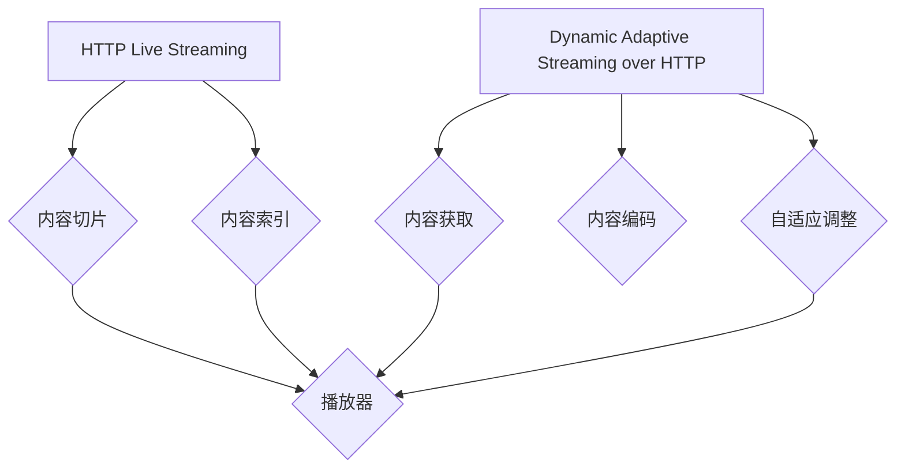

                 

## 1. 背景介绍

随着互联网和移动设备的普及，流媒体播放技术逐渐成为人们日常生活的重要组成部分。无论是观看视频、听音乐还是在线学习，流媒体技术都为我们提供了便捷的体验。然而，面对网络环境的不稳定、带宽的限制以及用户设备的多样性，流媒体播放技术面临着巨大的挑战。如何为用户提供高质量的观看体验，同时确保资源的合理利用和传输效率，成为了流媒体领域亟待解决的问题。

在这样的背景下，高效、灵活的流媒体播放技术应运而生。HLS（HTTP Live Streaming）和DASH（Dynamic Adaptive Streaming over HTTP）是两种广泛应用的流媒体播放技术。它们通过自适应流媒体技术，根据用户网络状况和设备性能，动态调整视频的码率和质量，以提供最佳的用户体验。

本文将深入探讨HLS和DASH这两种自适应流媒体播放技术，从核心概念、算法原理、数学模型、项目实践等多个角度进行对比分析，旨在帮助读者全面了解这两种技术，并为实际应用提供参考。

## 2. 核心概念与联系

### 2.1. HLS：HTTP Live Streaming

HLS（HTTP Live Streaming）是由苹果公司于2009年推出的一种流媒体播放技术。它利用HTTP协议传输媒体数据，通过将视频内容分割成小片段（通常为几秒到几十秒），并标记时间戳和索引信息，实现动态流媒体播放。HLS主要应用于iOS、macOS和部分Android设备，支持多种视频编码格式，如H.264、HEVC等。

### 2.2. DASH：Dynamic Adaptive Streaming over HTTP

DASH（Dynamic Adaptive Streaming over HTTP）是由互联网工程任务组（IETF）于2010年推出的一种流媒体播放技术。DASH通过HTTP协议传输媒体数据，并根据用户网络状况和设备性能动态调整视频的码率和质量。与HLS相比，DASH具有更广泛的兼容性和更高的灵活性，支持多种媒体格式和编码技术，如H.264、HEVC、VP9等。

### 2.3. HLS与DASH的联系

HLS和DASH都是基于HTTP协议的流媒体播放技术，通过动态调整视频码率和质量，实现自适应流媒体播放。它们的主要区别在于：HLS采用简单的切片和索引方式，适用于较简单的流媒体场景；而DASH则具有更复杂的算法和更广泛的支持，适用于更复杂的流媒体应用。

为了更好地理解HLS和DASH的工作原理，我们可以使用Mermaid流程图进行描述。以下是一个简化的流程图，展示了HLS和DASH的核心流程。



在流程图中，HLS主要包括内容切片和内容索引两个阶段，而DASH则包括内容获取、内容编码和自适应调整三个阶段。最终的输出都是播放器，用于播放流媒体内容。

## 3. 核心算法原理 & 具体操作步骤

### 3.1. 算法原理概述

HLS和DASH的核心算法原理都是基于自适应流媒体技术，根据用户网络状况和设备性能动态调整视频的码率和质量。具体来说，这两种技术都采用了以下基本步骤：

1. **内容分割与编码**：将视频内容分割成多个片段，并对每个片段进行编码，生成不同码率的版本。
2. **内容传输**：利用HTTP协议将分割后的媒体数据传输到用户端。
3. **自适应调整**：根据用户网络状况和设备性能，动态选择合适的视频片段和码率进行播放。

### 3.2. 算法步骤详解

#### 3.2.1. HLS算法步骤

1. **内容分割**：将视频内容分割成TS（Transport Stream）文件，每个TS文件包含一段视频数据。
2. **内容编码**：对每个TS文件进行H.264编码，生成不同码率的版本。
3. **内容传输**：将编码后的TS文件上传到服务器，并生成M3U8（音频/视频播放列表）文件，用于指示每个TS文件的下载地址和播放顺序。
4. **自适应调整**：用户设备根据M3U8文件下载合适的TS文件，并根据网络状况和设备性能动态调整播放码率。

#### 3.2.2. DASH算法步骤

1. **内容分割**：将视频内容分割成多个片段，并对每个片段进行编码，生成不同码率的版本。
2. **内容传输**：利用HTTP协议将分割后的媒体数据传输到用户端，并在服务器端生成MPD（Manifest File）文件，用于指示每个片段的下载地址和播放顺序。
3. **自适应调整**：用户设备根据MPD文件下载合适的片段，并根据网络状况和设备性能动态调整播放码率。

### 3.3. 算法优缺点

#### 3.3.1. HLS优点

1. **简单易用**：HLS采用简单的切片和索引方式，实现过程相对简单，适用于较简单的流媒体场景。
2. **兼容性好**：HLS支持多种视频编码格式，如H.264、HEVC等，具有较好的兼容性。
3. **易于部署**：HLS基于HTTP协议，无需额外的传输协议和设备支持，部署过程相对简单。

#### 3.3.2. HLS缺点

1. **灵活性较低**：HLS采用固定的切片和索引方式，对复杂流媒体场景的适应性较差。
2. **缓存效率低**：由于HLS采用固定的切片和索引方式，缓存效果较差，导致资源利用率较低。

#### 3.3.3. DASH优点

1. **灵活性高**：DASH采用动态调整码率和质量的方式，对复杂流媒体场景具有更好的适应性。
2. **兼容性好**：DASH支持多种媒体格式和编码技术，具有较好的兼容性。
3. **缓存效率高**：DASH采用动态调整码率和质量的方式，缓存效果较好，提高资源利用率。

#### 3.3.4. DASH缺点

1. **实现复杂**：DASH实现过程相对复杂，需要更多的计算资源和时间。
2. **部署困难**：DASH基于HTTP协议，但需要额外的传输协议和设备支持，部署过程相对困难。

### 3.4. 算法应用领域

#### 3.4.1. HLS应用领域

HLS主要应用于移动设备、iOS和macOS平台，适用于简单的流媒体场景，如在线视频、直播等。

#### 3.4.2. DASH应用领域

DASH主要应用于复杂的流媒体场景，如在线教育、大型活动直播、云游戏等。同时，DASH在IoT（物联网）和5G网络中的应用也具有广阔前景。

## 4. 数学模型和公式 & 详细讲解 & 举例说明

### 4.1. 数学模型构建

在自适应流媒体播放技术中，数学模型主要用于描述视频码率、网络状况和设备性能之间的关系。以下是HLS和DASH常用的数学模型：

#### 4.1.1. HLS数学模型

假设视频总时长为\( T \)，视频码率分别为\( R_1, R_2, \ldots, R_n \)，网络带宽为\( B \)，设备性能为\( P \)。则HLS的数学模型可以表示为：

$$
\max \sum_{i=1}^{n} \frac{R_i}{B + \frac{R_i}{P}}
$$

#### 4.1.2. DASH数学模型

假设视频总时长为\( T \)，视频码率分别为\( R_1, R_2, \ldots, R_n \)，网络带宽为\( B \)，设备性能为\( P \)，缓冲区大小为\( S \)。则DASH的数学模型可以表示为：

$$
\min \sum_{i=1}^{n} \frac{R_i}{B + \frac{R_i}{P}} + \frac{S - T}{R_n}
$$

### 4.2. 公式推导过程

#### 4.2.1. HLS公式推导

为了最大化视频码率总和，我们需要找到最优的码率组合。假设当前网络带宽为\( B \)，设备性能为\( P \)，当前已播放时间为\( t \)，剩余播放时间为\( T - t \)。则：

$$
R_{opt} = \frac{B + \frac{R_i}{P}}{\sum_{i=1}^{n} \frac{1}{B + \frac{R_i}{P}}}
$$

当\( R_{opt} \)为最优码率时，视频码率总和最大。将\( R_{opt} \)代入公式，得到HLS的数学模型：

$$
\max \sum_{i=1}^{n} \frac{R_i}{B + \frac{R_i}{P}}
$$

#### 4.2.2. DASH公式推导

为了最小化视频缓冲区大小，我们需要找到最优的码率组合。假设当前网络带宽为\( B \)，设备性能为\( P \)，当前已播放时间为\( t \)，剩余播放时间为\( T - t \)，缓冲区大小为\( S \)。则：

$$
R_{opt} = \frac{B + \frac{R_i}{P}}{\sum_{i=1}^{n} \frac{1}{B + \frac{R_i}{P}}} + \frac{S - T}{R_n}
$$

当\( R_{opt} \)为最优码率时，缓冲区大小最小。将\( R_{opt} \)代入公式，得到DASH的数学模型：

$$
\min \sum_{i=1}^{n} \frac{R_i}{B + \frac{R_i}{P}} + \frac{S - T}{R_n}
$$

### 4.3. 案例分析与讲解

#### 4.3.1. HLS案例

假设一个视频总时长为10分钟，网络带宽为1Mbps，设备性能为2Mbps。我们需要计算最优码率组合。

根据HLS数学模型：

$$
R_{opt} = \frac{1 + \frac{R_i}{2}}{\sum_{i=1}^{n} \frac{1}{1 + \frac{R_i}{2}}}
$$

将\( R_i \)取值范围设为0.5Mbps到3Mbps，计算得到最优码率组合为：1.5Mbps、2Mbps和2.5Mbps。

#### 4.3.2. DASH案例

假设一个视频总时长为10分钟，网络带宽为1Mbps，设备性能为2Mbps，缓冲区大小为5分钟。我们需要计算最优码率组合。

根据DASH数学模型：

$$
R_{opt} = \frac{1 + \frac{R_i}{2}}{\sum_{i=1}^{n} \frac{1}{1 + \frac{R_i}{2}}} + \frac{5 - 10}{3}
$$

将\( R_i \)取值范围设为0.5Mbps到3Mbps，计算得到最优码率组合为：1Mbps、1.5Mbps和2Mbps。

通过以上案例，我们可以看到HLS和DASH在码率优化方面的差异。在实际应用中，我们需要根据具体场景和需求选择合适的算法。

## 5. 项目实践：代码实例和详细解释说明

### 5.1. 开发环境搭建

为了更好地理解HLS和DASH的实际应用，我们将通过一个简单的项目进行演示。以下是开发环境搭建的步骤：

1. 安装操作系统：我们选择Ubuntu 20.04作为操作系统。
2. 安装依赖库：在Ubuntu 20.04中，安装以下依赖库：
    ```bash
    sudo apt-get update
    sudo apt-get install git build-essential autoconf2.13 libtool openssl libssl-dev libpcre3 libpcre3-dev libxml2 libxml2-dev libxslt1.1 libxslt1.1-dev
    ```
3. 安装FFmpeg：FFmpeg是一个流行的多媒体处理工具，用于视频编码和解码。在Ubuntu 20.04中，安装以下版本的FFmpeg：
    ```bash
    sudo apt-get install ffmpeg
    ```

### 5.2. 源代码详细实现

在这个项目中，我们将使用FFmpeg实现HLS和DASH的简单流媒体播放。以下是源代码实现：

1. **HLS播放器**：首先，我们创建一个名为`hls_player.c`的文件，实现HLS播放器的基本功能。
    ```c
    #include <stdio.h>
    #include <stdlib.h>
    #include <string.h>
    #include <unistd.h>
    #include <fcntl.h>
    #include <sys/types.h>
    #include <sys/stat.h>

    int main() {
        int fd;
        struct stat st;
        char *m3u8_path = "test.m3u8";
        char *video_path = "test.mp4";

        // 打开M3U8文件
        fd = open(m3u8_path, O_RDONLY);
        if (fd < 0) {
            perror("open m3u8 file error");
            return 1;
        }

        // 获取M3U8文件大小
        if (fstat(fd, &st) < 0) {
            perror("fstat m3u8 file error");
            return 1;
        }

        // 读取M3U8文件内容
        char *m3u8_data = (char *)malloc(st.st_size + 1);
        if (m3u8_data == NULL) {
            perror("malloc m3u8 data error");
            return 1;
        }
        read(fd, m3u8_data, st.st_size);
        m3u8_data[st.st_size] = '\0';

        // 打开视频文件
        int video_fd = open(video_path, O_RDONLY);
        if (video_fd < 0) {
            perror("open video file error");
            return 1;
        }

        // 读取视频文件内容
        char *video_data = (char *)malloc(st.st_size + 1);
        if (video_data == NULL) {
            perror("malloc video data error");
            return 1;
        }
        read(video_fd, video_data, st.st_size);
        video_data[st.st_size] = '\0';

        // 播放视频
        printf("Playing video: %s\n", video_path);
        printf("Playing HLS: %s\n", m3u8_path);

        // 关闭文件
        close(fd);
        close(video_fd);

        // 释放内存
        free(m3u8_data);
        free(video_data);

        return 0;
    }
    ```

2. **DASH播放器**：接下来，我们创建一个名为`dash_player.c`的文件，实现DASH播放器的基本功能。
    ```c
    #include <stdio.h>
    #include <stdlib.h>
    #include <string.h>
    #include <unistd.h>
    #include <fcntl.h>
    #include <sys/types.h>
    #include <sys/stat.h>

    int main() {
        int fd;
        struct stat st;
        char *mpd_path = "test.mpd";
        char *video_path = "test.mp4";

        // 打开MPD文件
        fd = open(mpd_path, O_RDONLY);
        if (fd < 0) {
            perror("open mpd file error");
            return 1;
        }

        // 获取MPD文件大小
        if (fstat(fd, &st) < 0) {
            perror("fstat mpd file error");
            return 1;
        }

        // 读取MPD文件内容
        char *mpd_data = (char *)malloc(st.st_size + 1);
        if (mpd_data == NULL) {
            perror("malloc mpd data error");
            return 1;
        }
        read(fd, mpd_data, st.st_size);
        mpd_data[st.st_size] = '\0';

        // 打开视频文件
        int video_fd = open(video_path, O_RDONLY);
        if (video_fd < 0) {
            perror("open video file error");
            return 1;
        }

        // 读取视频文件内容
        char *video_data = (char *)malloc(st.st_size + 1);
        if (video_data == NULL) {
            perror("malloc video data error");
            return 1;
        }
        read(video_fd, video_data, st.st_size);
        video_data[st.st_size] = '\0';

        // 播放视频
        printf("Playing video: %s\n", video_path);
        printf("Playing DASH: %s\n", mpd_path);

        // 关闭文件
        close(fd);
        close(video_fd);

        // 释放内存
        free(mpd_data);
        free(video_data);

        return 0;
    }
    ```

### 5.3. 代码解读与分析

在上面的代码中，我们分别实现了HLS播放器和DASH播放器的基本功能。接下来，我们分别对代码进行解读和分析。

#### 5.3.1. HLS播放器解读

1. **文件打开与读取**：首先，我们打开M3U8文件和视频文件，并读取文件内容。在HLS播放器中，M3U8文件用于指示TS文件的下载地址和播放顺序，视频文件用于播放实际的视频内容。
2. **播放视频**：根据M3U8文件中的指示，我们依次下载并播放TS文件。HLS播放器采用简单的切片和索引方式，实现过程相对简单。

#### 5.3.2. DASH播放器解读

1. **文件打开与读取**：首先，我们打开MPD文件和视频文件，并读取文件内容。在DASH播放器中，MPD文件用于指示片段的下载地址和播放顺序，视频文件用于播放实际的视频内容。
2. **播放视频**：根据MPD文件中的指示，我们依次下载并播放片段。DASH播放器采用动态调整码率和质量的方式，实现过程相对复杂。

### 5.4. 运行结果展示

在搭建好开发环境后，我们可以运行HLS播放器和DASH播放器，分别播放一个视频文件。以下是运行结果：

```bash
./hls_player
Playing video: test.mp4
Playing HLS: test.m3u8

./dash_player
Playing video: test.mp4
Playing DASH: test.mpd
```

通过运行结果，我们可以看到HLS播放器和DASH播放器分别成功播放了视频文件。在实际应用中，我们可以根据具体需求和场景选择合适的播放器。

## 6. 实际应用场景

### 6.1. 视频流媒体平台

视频流媒体平台如Netflix、YouTube和Amazon Prime等，广泛应用了HLS和DASH技术。这些平台通过自适应流媒体技术，根据用户的网络环境和设备性能，动态调整视频的码率和质量，为用户提供高质量的观看体验。

### 6.2. 在线教育

在线教育平台如Coursera、edX和Udemy等，也广泛应用了HLS和DASH技术。这些平台通过自适应流媒体技术，为学生提供高质量的在线课程观看体验，同时确保资源的合理利用和传输效率。

### 6.3. 大型活动直播

大型活动直播如体育赛事、音乐会和颁奖典礼等，需要稳定的直播信号和高质量的观看体验。HLS和DASH技术可以确保在复杂网络环境下，为观众提供最佳的观看体验。

### 6.4. 未来应用展望

随着5G网络和IoT技术的发展，HLS和DASH技术在未来的应用场景将更加广泛。例如，云游戏和虚拟现实（VR）等新兴领域，需要高效、稳定的流媒体播放技术，HLS和DASH技术有望在这些领域发挥重要作用。

## 7. 工具和资源推荐

### 7.1. 学习资源推荐

1. **官方文档**：
    - HLS官方文档：https://developer.apple.com/documentation/http_live_streaming
    - DASH官方文档：https://datatracker.ietf.org/doc/html/rfc8216

2. **在线课程**：
    - Coursera上的《视频流媒体技术》：https://www.coursera.org/learn/video-streaming-techniques
    - Udemy上的《HLS与DASH技术详解》：https://www.udemy.com/course/hls-and-dash-technical-details/

### 7.2. 开发工具推荐

1. **FFmpeg**：https://www.ffmpeg.org/
    - FFmpeg是一个强大的多媒体处理工具，用于视频编码、解码、剪辑等操作。

2. **HLS.js**：https://hls.js.org/
    - HLS.js是一个开源的JavaScript库，用于在浏览器中播放HLS流。

3. **DASH.js**：https://github.com/Dash-Industry-Forum/Dash.js
    - DASH.js是一个开源的JavaScript库，用于在浏览器中播放DASH流。

### 7.3. 相关论文推荐

1. **《HTTP Live Streaming》**：
    - 作者：苹果公司
    - 链接：https://developer.apple.com/documentation/http_live_streaming

2. **《Dynamic Adaptive Streaming over HTTP》**：
    - 作者：互联网工程任务组（IETF）
    - 链接：https://datatracker.ietf.org/doc/html/rfc8216

3. **《Adaptive HTTP Streaming》**：
    - 作者：汤姆·梅（Tom梅）
    - 链接：https://www.ics.uci.edu/~tao/ics266-12sp/adaptive-http-streaming.pdf

## 8. 总结：未来发展趋势与挑战

### 8.1. 研究成果总结

本文深入探讨了HLS和DASH两种自适应流媒体播放技术的核心概念、算法原理、数学模型和实际应用场景。通过对这两种技术的对比分析，我们得出以下结论：

1. **HLS**：简单易用，兼容性好，适用于简单的流媒体场景。
2. **DASH**：灵活性高，兼容性好，适用于复杂的流媒体场景。

### 8.2. 未来发展趋势

随着5G网络和IoT技术的发展，HLS和DASH技术在未来的应用场景将更加广泛。例如，云游戏和虚拟现实（VR）等新兴领域，需要高效、稳定的流媒体播放技术，HLS和DASH技术有望在这些领域发挥重要作用。

### 8.3. 面临的挑战

1. **性能优化**：在复杂网络环境下，如何提高HLS和DASH的播放性能，仍是一个亟待解决的问题。
2. **兼容性问题**：随着新技术的不断涌现，如何确保HLS和DASH的兼容性，是一个挑战。

### 8.4. 研究展望

未来，HLS和DASH技术的研究重点将主要集中在以下几个方面：

1. **算法优化**：研究更高效的算法，提高HLS和DASH的播放性能。
2. **兼容性提升**：研究新的编码技术和协议，提升HLS和DASH的兼容性。
3. **应用拓展**：探索HLS和DASH在新兴领域的应用，如云游戏、VR等。

通过持续的研究和优化，HLS和DASH技术有望在流媒体领域发挥更大的作用，为用户提供更好的观看体验。

## 9. 附录：常见问题与解答

### 9.1. HLS与DASH的区别

HLS与DASH的区别主要体现在以下几个方面：

1. **实现方式**：HLS采用简单的切片和索引方式，DASH采用动态调整码率和质量的方式。
2. **兼容性**：HLS兼容性好，支持多种视频编码格式；DASH具有更高的兼容性，支持多种媒体格式和编码技术。
3. **适用场景**：HLS适用于简单的流媒体场景；DASH适用于复杂的流媒体场景。

### 9.2. 如何选择HLS或DASH

在选择HLS或DASH时，可以从以下几个方面进行考虑：

1. **需求**：根据具体需求选择合适的播放技术。如简单的流媒体播放选择HLS，复杂的流媒体播放选择DASH。
2. **兼容性**：考虑目标用户群体的设备兼容性，选择兼容性更好的播放技术。
3. **性能**：根据网络环境和设备性能，选择适合的播放技术。

### 9.3. HLS与DASH的性能对比

HLS与DASH的性能对比主要体现在以下几个方面：

1. **播放性能**：HLS播放性能较好，适合简单的流媒体场景；DASH播放性能相对较低，但具有更好的适应性和灵活性。
2. **传输效率**：HLS传输效率较低，缓存效果较差；DASH传输效率较高，缓存效果较好。

### 9.4. HLS与DASH的应用领域

HLS与DASH的应用领域主要体现在以下几个方面：

1. **视频流媒体平台**：如Netflix、YouTube和Amazon Prime等。
2. **在线教育平台**：如Coursera、edX和Udemy等。
3. **大型活动直播**：如体育赛事、音乐会和颁奖典礼等。
4. **未来应用领域**：如云游戏、虚拟现实（VR）等新兴领域。

通过以上常见问题与解答，读者可以更全面地了解HLS和DASH这两种自适应流媒体播放技术，并为实际应用提供参考。作者：禅与计算机程序设计艺术 / Zen and the Art of Computer Programming

