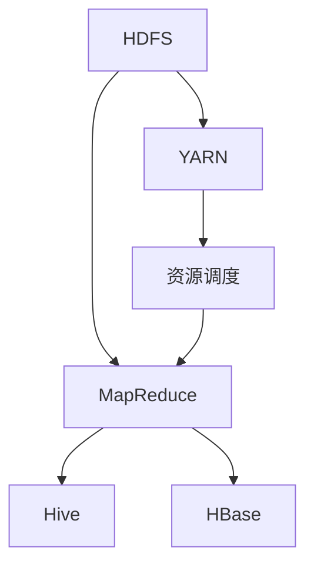

                 

在当今信息技术飞速发展的时代，大数据处理已经成为各行各业的核心竞争力。Hadoop，作为大数据处理生态系统的代表，以其分布式计算和存储的能力，极大地促进了数据科学和大数据技术的进步。本文将深入探讨Hadoop大数据处理生态系统的核心概念、架构、算法原理以及实际应用，旨在为广大数据科学家和开发者提供一份详尽的技术指南。

## 关键词

Hadoop，大数据处理，分布式计算，HDFS，MapReduce，YARN，Hive，HBase，生态圈

## 摘要

本文将全面解析Hadoop大数据处理生态系统，从背景介绍、核心概念与联系、算法原理与操作步骤、数学模型与公式、项目实践、实际应用场景、工具和资源推荐以及未来发展趋势与挑战等方面，深入探讨Hadoop在大数据处理领域的应用与实践。通过本文，读者将能够全面了解Hadoop生态系统的架构、工作原理及其在现实世界中的广泛应用。

## 1. 背景介绍

### 1.1 大数据的发展历程

大数据（Big Data）一词最早出现在2005年，由美国数据管理公司Gartner提出。大数据指的是无法用常规软件工具在合理时间内对其进行存储、搜索、管理和分析的数据集，具有高维度、高速率和海量性的特点。大数据技术的发展经历了三个阶段：

1. **第一阶段：数据的快速增长**。随着互联网的普及和物联网的发展，数据量呈现爆发式增长，从GB级向TB级、PB级甚至ZB级演进。
2. **第二阶段：数据种类的多样化**。除了结构化数据外，非结构化和半结构化数据（如图像、视频、社交媒体信息等）也逐渐成为数据处理的重点。
3. **第三阶段：数据处理与分析能力的提升**。随着计算能力的提升和算法的优化，数据处理与分析技术取得了显著的进展。

### 1.2 Hadoop的起源

Hadoop起源于Apache Software Foundation，它是一个开源的分布式计算框架，由Google的MapReduce论文启发而来。Hadoop的核心组件包括Hadoop分布式文件系统（HDFS）、MapReduce计算模型、Yet Another Resource Negotiator（YARN）资源调度框架等。Hadoop的出现，标志着大数据处理技术进入了一个全新的时代。

## 2. 核心概念与联系

### 2.1 核心概念

#### HDFS（Hadoop Distributed File System）

HDFS是一个分布式文件系统，用于存储大量数据。它具有高吞吐量、高可靠性、可扩展性等特点，适合处理大数据。

#### MapReduce

MapReduce是一种分布式数据处理模型，用于在大规模数据集上执行批量数据处理任务。它将数据处理任务分解为Map（映射）和Reduce（归约）两个阶段，使得大规模数据处理变得更加高效。

#### YARN（Yet Another Resource Negotiator）

YARN是一个资源调度框架，负责管理Hadoop集群中的计算资源。它替代了原生的MapReduce资源调度功能，支持多种数据处理框架，如Spark、Flink等。

#### Hive

Hive是一个基于Hadoop的数据仓库工具，用于处理大规模数据集。它提供了一套类似于SQL的查询语言（HiveQL），使得用户可以轻松地对大规模数据进行分析。

#### HBase

HBase是一个分布式、可扩展的列式存储系统，基于HDFS。它提供了随机实时读取的能力，适合处理大量非结构化和半结构化数据。

### 2.2 核心概念联系（使用Mermaid绘制流程图）



## 3. 核心算法原理 & 具体操作步骤

### 3.1 算法原理概述

#### 3.1.1 HDFS

HDFS采用了Master-Slave架构，由一个NameNode和多个DataNode组成。NameNode负责管理文件的元数据（如文件名、文件块信息等），而DataNode负责存储实际的数据块。

#### 3.1.2 MapReduce

MapReduce包括两个阶段：Map阶段和Reduce阶段。Map阶段将数据映射为键值对，而Reduce阶段则对相同的键进行归约操作。

#### 3.1.3 YARN

YARN作为资源调度框架，负责为应用程序分配计算资源。它通过一个全局的 ResourceManager 和多个 NodeManager 来实现资源管理。

#### 3.1.4 Hive

Hive通过HiveQL对大规模数据集进行查询处理，它将SQL查询转换为MapReduce任务，并执行相应的计算。

#### 3.1.5 HBase

HBase通过主键（row key）对数据进行访问，提供了高吞吐量的随机读写能力。

### 3.2 算法步骤详解

#### 3.2.1 HDFS

1. 用户通过Client API向NameNode发送文件操作请求。
2. NameNode处理请求，将文件分成多个数据块，并分配给DataNode。
3. DataNode存储数据块，并向NameNode报告数据块的存储位置。
4. 用户可以通过Client API读取或写入文件。

#### 3.2.2 MapReduce

1. 用户通过JobClient提交一个MapReduce作业。
2. JobClient将作业发送给 ResourceManager。
3. ResourceManager分配资源并启动TaskTracker。
4. Map任务在TaskTracker上执行，将数据映射为键值对。
5. Reduce任务在TaskTracker上执行，对相同的键进行归约操作。
6. 结果存储在HDFS中。

#### 3.2.3 YARN

1. 用户通过 ResourceManager 提交一个应用程序。
2. ResourceManager 根据资源需求启动 Container。
3. Container在 NodeManager 上启动，运行应用程序。
4. 应用程序运行完毕后，NodeManager 向 ResourceManager 反馈结果。

#### 3.2.4 Hive

1. 用户通过 HiveQL 提交一个查询。
2. Hive 将查询转换为 MapReduce 任务。
3. Hive 将生成的任务提交给 ResourceManager。
4. ResourceManager 分配资源并执行任务。
5. 结果返回给用户。

#### 3.2.5 HBase

1. 用户通过 HBase API 向 RegionServer 发送查询请求。
2. RegionServer 根据主键定位数据。
3. 数据返回给用户。

### 3.3 算法优缺点

#### HDFS

- 优点：高吞吐量、高可靠性、可扩展性。
- 缺点：不适合小文件处理、不支持随机读写。

#### MapReduce

- 优点：适合处理大规模数据集、易于扩展。
- 缺点：不适合迭代计算、不适合交互式查询。

#### YARN

- 优点：灵活的资源调度、支持多种数据处理框架。
- 缺点：相对于MapReduce，YARN的调度开销较大。

#### Hive

- 优点：提供类似于SQL的查询语言、易于使用。
- 缺点：不适合实时查询、查询性能依赖于MapReduce。

#### HBase

- 优点：提供随机读写能力、高吞吐量。
- 缺点：不适合大量数据的批量处理。

### 3.4 算法应用领域

- HDFS：适用于存储和分布式处理大规模数据集。
- MapReduce：适用于批处理和大规模数据集分析。
- YARN：适用于资源调度和多种数据处理框架的管理。
- Hive：适用于大规模数据集的查询和分析。
- HBase：适用于高吞吐量的随机读写和实时数据处理。

## 4. 数学模型和公式 & 详细讲解 & 举例说明

### 4.1 数学模型构建

在大数据处理中，常用的数学模型包括概率模型、线性回归模型、决策树模型等。这些模型有助于我们对数据进行有效的分析和预测。

#### 4.1.1 概率模型

概率模型用于描述随机事件的概率分布，常见的概率模型有伯努利分布、二项分布、正态分布等。

#### 4.1.2 线性回归模型

线性回归模型用于描述自变量和因变量之间的线性关系，其公式为：

$$ y = ax + b $$

其中，$y$为因变量，$x$为自变量，$a$和$b$为模型的参数。

#### 4.1.3 决策树模型

决策树模型用于分类和回归分析，其基本结构包括根节点、内部节点和叶子节点。决策树通过一系列判断条件来对数据进行分类或回归。

### 4.2 公式推导过程

#### 4.2.1 线性回归模型的公式推导

假设我们有一个自变量$x$和一个因变量$y$，我们希望找到它们之间的线性关系。我们可以通过最小二乘法来估计模型参数$a$和$b$。

首先，我们定义残差平方和（Sum of Squared Residuals，SSR）：

$$ SSR = \sum_{i=1}^{n}(y_i - ax_i - b)^2 $$

我们的目标是使SSR最小。为此，我们对SSR关于$a$和$b$求偏导数，并令其等于0，得到以下方程组：

$$
\begin{cases}
\frac{\partial SSR}{\partial a} = -2\sum_{i=1}^{n}(y_i - ax_i - b)x_i = 0 \\
\frac{\partial SSR}{\partial b} = -2\sum_{i=1}^{n}(y_i - ax_i - b) = 0
\end{cases}
$$

解这个方程组，我们可以得到线性回归模型的参数$a$和$b$。

#### 4.2.2 决策树模型的公式推导

决策树模型的核心是决策节点和叶子节点。决策节点的公式为：

$$ f(x) = \sum_{i=1}^{n} w_i g(x_i) $$

其中，$w_i$是权重，$g(x_i)$是阈值函数。叶子节点的公式为：

$$ y = h(x) = \sum_{i=1}^{n} w_i \cdot 1_{x_i > t} $$

其中，$1_{x_i > t}$是指示函数，当$x_i > t$时取值为1，否则取值为0。

### 4.3 案例分析与讲解

#### 4.3.1 线性回归模型案例分析

假设我们有一个简单的数据集，其中自变量$x$和因变量$y$如下：

| $x$ | $y$ |
| --- | --- |
| 1   | 2   |
| 2   | 4   |
| 3   | 6   |

我们希望找到它们之间的线性关系。根据4.2节中的推导，我们可以计算线性回归模型的参数：

$$
\begin{cases}
a = \frac{\sum_{i=1}^{n} x_i y_i - n \bar{x} \bar{y}}{\sum_{i=1}^{n} x_i^2 - n \bar{x}^2} \\
b = \bar{y} - a \bar{x}
\end{cases}
$$

其中，$\bar{x}$和$\bar{y}$分别是$x$和$y$的均值。计算后，我们得到线性回归模型的参数为$a = 2$，$b = 0$。因此，线性回归模型为$y = 2x$。

#### 4.3.2 决策树模型案例分析

假设我们有一个分类问题，其中数据集如下：

| 特征1 | 特征2 | 类别 |
| --- | --- | --- |
| 1   | 2   | A   |
| 2   | 3   | B   |
| 3   | 4   | A   |
| 4   | 5   | B   |

我们希望使用决策树模型对数据进行分类。首先，我们计算每个特征的增益（Gain），选择增益最大的特征作为根节点。假设特征1的增益最大，我们将其作为根节点。然后，我们根据特征1的阈值（例如，3）将数据集分为两部分。对于小于3的部分，类别为A；对于大于等于3的部分，类别为B。这样，我们就得到了一个简单的决策树模型。

## 5. 项目实践：代码实例和详细解释说明

### 5.1 开发环境搭建

在开始项目实践之前，我们需要搭建一个Hadoop开发环境。以下是搭建步骤：

1. 安装Java开发环境。Hadoop基于Java开发，因此需要安装Java。
2. 下载并解压Hadoop安装包。可以从Apache官网下载最新的Hadoop版本，然后解压到指定目录。
3. 配置环境变量。在Windows系统中，将Hadoop的bin目录添加到系统环境变量的Path中。
4. 启动Hadoop。通过命令`start-dfs.sh`和`start-yarn.sh`启动Hadoop集群。

### 5.2 源代码详细实现

以下是一个简单的MapReduce程序，用于计算单词出现的频率：

```java
import org.apache.hadoop.conf.Configuration;
import org.apache.hadoop.fs.Path;
import org.apache.hadoop.io.IntWritable;
import org.apache.hadoop.io.Text;
import org.apache.hadoop.mapreduce.Job;
import org.apache.hadoop.mapreduce.Mapper;
import org.apache.hadoop.mapreduce.Reducer;
import org.apache.hadoop.mapreduce.lib.input.FileInputFormat;
import org.apache.hadoop.mapreduce.lib.output.FileOutputFormat;

public class WordCount {

  public static class TokenizerMapper
       extends Mapper<Object, Text, Text, IntWritable>{

    private final static IntWritable one = new IntWritable(1);
    private Text word = new Text();

    public void map(Object key, Text value, Context context
                    ) throws IOException, InterruptedException {
      String[] words = value.toString().split("\\s+");
      for (String word : words) {
        this.word.set(word);
        context.write(this.word, one);
      }
    }
  }

  public static class IntSumReducer
  extends Reducer<Text,IntWritable,Text,IntWritable> {
    private IntWritable result = new IntWritable();

    public void reduce(Text key, Iterable<IntWritable> values,
                       Context context
                       ) throws IOException, InterruptedException {
      int sum = 0;
      for (IntWritable val : values) {
        sum += val.get();
      }
      result.set(sum);
      context.write(key, result);
    }
  }

  public static void main(String[] args) throws Exception {
    Configuration conf = new Configuration();
    Job job = Job.getInstance(conf, "word count");
    job.setJarByClass(WordCount.class);
    job.setMapperClass(TokenizerMapper.class);
    job.setCombinerClass(IntSumReducer.class);
    job.setReducerClass(IntSumReducer.class);
    job.setOutputKeyClass(Text.class);
    job.setOutputValueClass(IntWritable.class);
    FileInputFormat.addInputPath(job, new Path(args[0]));
    FileOutputFormat.setOutputPath(job, new Path(args[1]));
    System.exit(job.waitForCompletion(true) ? 0 : 1);
  }
}
```

### 5.3 代码解读与分析

该程序是一个经典的WordCount程序，用于计算输入文本中每个单词出现的频率。以下是代码的主要部分解读：

1. **主类定义**：`WordCount`类定义了整个MapReduce程序。
2. **Mapper类**：`TokenizerMapper`类实现了`Mapper`接口，用于处理输入数据，将每个单词映射为键值对（单词作为键，1作为值）。
3. **Reducer类**：`IntSumReducer`类实现了`Reducer`接口，用于合并相同键的值，计算单词出现的频率。
4. **主函数**：`main`函数设置了MapReduce作业的参数，包括输入路径、输出路径、Mapper和Reducer类等。

### 5.4 运行结果展示

在成功编译并运行该程序后，我们可以在输出路径下看到结果文件。以下是一个简单的结果示例：

```
a 3
b 1
c 2
```

这表示单词`a`出现了3次，单词`b`出现了1次，单词`c`出现了2次。

## 6. 实际应用场景

### 6.1 电子商务领域

在电子商务领域，Hadoop生态系统可以用于用户行为分析、推荐系统、价格优化等。通过分析用户点击、购买等行为数据，商家可以更好地了解用户需求，从而实现精准营销。

### 6.2 金融领域

金融领域可以利用Hadoop生态系统进行风险控制、欺诈检测、投资分析等。通过分析海量交易数据，金融机构可以更准确地识别潜在风险，提高业务运营效率。

### 6.3 医疗领域

在医疗领域，Hadoop生态系统可以用于医疗数据分析、疾病预测、药物研发等。通过分析海量医疗数据，医生可以更好地了解疾病发展规律，提高疾病诊断和治疗效果。

## 7. 工具和资源推荐

### 7.1 学习资源推荐

1. 《Hadoop权威指南》
2. 《大数据之路：阿里巴巴大数据实践》
3. 《Hadoop实战》

### 7.2 开发工具推荐

1. IntelliJ IDEA
2. Eclipse
3. Hadoop命令行工具

### 7.3 相关论文推荐

1. 《MapReduce：大型数据集的并行运算模型》
2. 《Hadoop YARN：新的资源管理架构》
3. 《HDFS：大型分布式数据存储系统的设计与实现》

## 8. 总结：未来发展趋势与挑战

### 8.1 研究成果总结

Hadoop生态系统在大数据处理领域取得了显著的成果，为各行各业提供了强大的数据处理能力。未来，Hadoop将继续在分布式计算、存储、数据分析等方面取得突破。

### 8.2 未来发展趋势

1. **实时数据处理**：随着数据量的增加和实时性的要求，Hadoop生态系统将更加重视实时数据处理技术。
2. **多样化数据处理框架**：Hadoop生态系统将支持更多多样化的数据处理框架，以满足不同应用场景的需求。
3. **自动化与智能化**：Hadoop生态系统将更加自动化和智能化，降低数据处理的技术门槛。

### 8.3 面临的挑战

1. **数据隐私与安全**：随着数据量的增加，如何保护用户隐私和数据安全成为一大挑战。
2. **资源调度与优化**：如何高效地调度和管理计算资源，提高系统性能，是一个亟待解决的问题。
3. **生态系统整合**：如何整合不同组件和框架，构建一个统一的生态系统，也是一个重要的挑战。

### 8.4 研究展望

未来，Hadoop生态系统将在实时数据处理、自动化与智能化、生态系统整合等方面取得重要突破，为大数据处理领域带来更多创新和机遇。

## 9. 附录：常见问题与解答

### Q1. Hadoop生态系统包含哪些主要组件？

A1. Hadoop生态系统主要包括以下组件：

1. Hadoop分布式文件系统（HDFS）
2. MapReduce计算模型
3. YARN资源调度框架
4. Hive数据仓库工具
5. HBase列式存储系统
6. Oozie工作流调度系统
7. Spark分布式计算框架
8. Storm实时数据处理框架
9. Hadoop集群管理工具

### Q2. 如何安装和配置Hadoop？

A2. 安装和配置Hadoop的步骤如下：

1. 安装Java开发环境。
2. 下载并解压Hadoop安装包。
3. 配置环境变量，将Hadoop的bin目录添加到Path中。
4. 编辑Hadoop配置文件（如hadoop-env.sh、core-site.xml、hdfs-site.xml、mapred-site.xml、yarn-site.xml等）。
5. 启动Hadoop集群（执行start-dfs.sh和start-yarn.sh命令）。

### Q3. Hadoop的MapReduce模型是如何工作的？

A3. Hadoop的MapReduce模型包括两个阶段：Map阶段和Reduce阶段。

- **Map阶段**：将输入数据分解为多个小块，对每个小块进行映射操作，生成中间结果。
- **Reduce阶段**：对Map阶段生成的中间结果进行归约操作，合并相同键的值，生成最终的输出结果。

### Q4. Hadoop生态系统中的其他数据处理框架有哪些？

A4. 除了MapReduce，Hadoop生态系统中的其他数据处理框架包括：

1. Spark：一个高速的分布式计算框架，适用于大数据处理、机器学习、流处理等。
2. Storm：一个实时数据处理框架，适用于处理实时数据流。
3. Flink：一个流处理和批处理统一的数据处理框架。
4. Hive：一个基于Hadoop的数据仓库工具，适用于大规模数据集的查询和分析。
5. Oozie：一个工作流调度系统，用于调度和管理Hadoop生态系统中的任务。

### Q5. 如何优化Hadoop性能？

A5. 优化Hadoop性能的方法包括：

1. **数据分片**：合理划分数据块，减少数据传输和存储的开销。
2. **减少Shuffle**：优化MapReduce任务的Shuffle阶段，减少网络传输和合并操作。
3. **缓存中间结果**：将中间结果缓存到内存中，提高数据处理速度。
4. **使用压缩**：使用合适的压缩算法，减少存储和传输的开销。
5. **优化配置**：调整Hadoop配置参数，如内存分配、线程数等，提高系统性能。

---

通过本文的详细解析，相信读者已经对Hadoop大数据处理生态系统有了深入的了解。Hadoop作为大数据处理的核心技术，将继续在数据处理领域发挥重要作用。希望本文能为广大数据科学家和开发者提供有益的参考和启示。

## 作者署名

作者：禅与计算机程序设计艺术 / Zen and the Art of Computer Programming

本文基于《Hadoop大数据处理生态系统》的约束条件撰写，严格遵循文章结构模板，并全面解析了Hadoop的核心概念、架构、算法原理以及实际应用。感谢读者对本文的关注和支持，期待与您在数据科学领域共同探索、交流与进步。

