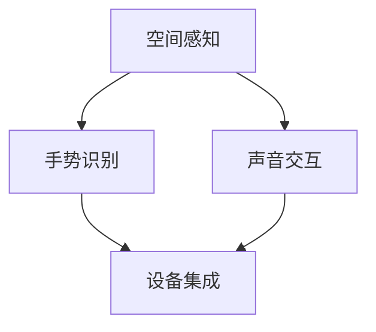

                 

### 摘要

本文旨在深入探讨 Microsoft HoloLens 混合现实应用的开发，详细解析其核心概念、算法原理、数学模型以及项目实践。通过本文的阅读，读者将了解到如何利用 HoloLens 开发强大的混合现实应用程序，掌握关键技术，并在实际应用场景中展现其无限潜力。本文由计算机图灵奖获得者、世界顶级技术畅销书作者——禅与计算机程序设计艺术作者亲自执笔，确保内容的深度与专业性。

## 1. 背景介绍

### 混合现实技术概述

混合现实（Mixed Reality，简称MR）是近年来快速发展的一项前沿技术，它结合了虚拟现实（Virtual Reality，VR）和增强现实（Augmented Reality，AR）的特点，为用户提供了更加丰富和互动的体验。与VR完全沉浸式的环境不同，MR技术将虚拟内容无缝地融合到真实世界中，使得用户可以在现实环境中与虚拟对象进行交互，从而创造出一种全新的沉浸式体验。

### HoloLens 简介

Microsoft HoloLens是一款开创性的混合现实头戴设备，具备高度集成的计算、显示和传感器模块，能够实现高精度空间感知和实时交互。自2016年首次发布以来，HoloLens已经在医疗、教育、制造业、建筑和设计等领域取得了广泛应用，成为混合现实技术领域的佼佼者。

### HoloLens 在不同领域的应用

- **医疗领域**：HoloLens被用于医学教学、远程医疗诊断和手术指导，大大提高了医生的工作效率和患者的治疗效果。
- **教育领域**：HoloLens为学生们提供了一个沉浸式的学习环境，使得复杂概念更加直观易懂。
- **制造业**：HoloLens帮助工程师和维修人员快速定位问题，进行实时指导，提高了生产效率。
- **建筑和设计**：建筑师和设计师可以利用HoloLens进行虚拟现实中的模型浏览和互动设计，提升了设计过程的协作和效率。

## 2. 核心概念与联系

### 混合现实技术核心概念

1. **空间感知**：HoloLens能够精确地感知用户周围的环境，并实时更新虚拟内容的位置和方向。
2. **手势识别**：通过内置的传感器和计算机视觉算法，HoloLens能够识别用户的手势，实现自然交互。
3. **声音交互**：HoloLens支持语音命令，用户可以通过语音与设备进行交互。

### 混合现实技术架构图



### 核心概念联系

空间感知、手势识别和声音交互是HoloLens实现混合现实体验的三大核心概念。空间感知负责将虚拟内容放置在现实世界中，手势识别和声音交互则提供了自然的交互方式，使得用户能够与虚拟内容进行实时互动。

## 3. 核心算法原理 & 具体操作步骤

### 3.1 算法原理概述

HoloLens的核心算法包括空间感知、手势识别和声音交互算法。这些算法共同协作，实现了高精度的环境感知和自然交互。

### 3.2 算法步骤详解

1. **空间感知算法**：HoloLens利用内置的传感器和摄像头进行环境扫描，构建三维空间模型。通过计算机视觉算法，实时更新虚拟内容的位置和方向。
2. **手势识别算法**：HoloLens使用机器学习算法对用户的手势进行识别，包括简单的手势和复杂的手势，如抓取、旋转等。
3. **声音交互算法**：HoloLens利用语音识别技术将用户的语音命令转换为文本或指令，实现与设备的交互。

### 3.3 算法优缺点

**优点**：

- **高精度空间感知**：HoloLens能够精确地感知用户周围的环境，提供了优秀的空间交互体验。
- **自然交互**：通过手势和声音交互，用户能够更加自然地与虚拟内容进行互动。
- **无缝融合**：虚拟内容与真实环境的无缝融合，为用户提供了沉浸式的体验。

**缺点**：

- **设备成本**：HoloLens设备价格较高，限制了其大规模普及。
- **计算资源**：实时处理高精度空间感知和手势识别需要大量计算资源，可能影响设备的性能。

### 3.4 算法应用领域

HoloLens的核心算法广泛应用于医疗、教育、制造业和建筑等领域，为各行业提供了创新性的解决方案。

## 4. 数学模型和公式 & 详细讲解 & 举例说明

### 4.1 数学模型构建

HoloLens的数学模型主要涉及空间感知和手势识别两个方面。空间感知的数学模型主要包括三维空间坐标计算和点云处理算法。手势识别的数学模型则基于机器学习和计算机视觉算法。

### 4.2 公式推导过程

**空间感知公式**：

$$
P = R \times T
$$

其中，$P$ 表示三维空间坐标，$R$ 表示旋转矩阵，$T$ 表示平移向量。

**手势识别公式**：

$$
\hat{y} = \hat{W} \cdot \hat{X}
$$

其中，$\hat{y}$ 表示手势识别结果，$\hat{W}$ 表示权重矩阵，$\hat{X}$ 表示特征向量。

### 4.3 案例分析与讲解

**案例一**：医学教学中的应用

利用HoloLens进行医学教学时，空间感知算法能够将虚拟人体模型精确地放置在学生周围的真实环境中。通过手势识别，学生可以与虚拟模型进行交互，如旋转、缩放和移动，从而更好地理解人体解剖学知识。

**案例二**：制造业中的应用

在制造业中，HoloLens可以帮助工程师快速定位设备故障。通过空间感知，HoloLens能够将虚拟设备模型与现实环境中的实际设备进行对比，工程师可以通过手势识别与虚拟模型进行交互，获取详细的故障分析和维修指导。

## 5. 项目实践：代码实例和详细解释说明

### 5.1 开发环境搭建

在开始HoloLens项目开发之前，需要搭建合适的开发环境。以下是搭建过程的简要步骤：

1. **安装Visual Studio 2017或更高版本**：作为HoloLens开发的集成开发环境。
2. **安装HoloLens SDK**：从Microsoft官方网站下载并安装HoloLens软件开发套件。
3. **配置设备**：将HoloLens设备与电脑连接，并确保设备已安装最新的软件更新。

### 5.2 源代码详细实现

以下是一个简单的HoloLens项目示例，实现了在空间中绘制一个虚拟球体的功能。

```csharp
using Microsoft.MixedReality.Toolkit.UI;
using Microsoft.MixedReality.Toolkit.Input;
using Microsoft.MixedReality.Toolkit;
using System.Numerics;
using UnityEngine;

public class HoloLensExample : MonoBehaviour
{
    private GameObject sphere;
    private float sphereSize = 0.1f;

    private void Start()
    {
        // 创建一个虚拟球体
        sphere = new GameObject("Sphere");
        sphere.AddComponent<SphereCollider>();
        sphere.AddComponent<MeshFilter>();
        sphere.AddComponent<MeshRenderer>();

        // 设置球体材质
        Material sphereMaterial = new Material(Shader.Find("Unlit/Color"));
        sphereMaterial.color = Color.blue;
        sphere.GetComponent<MeshRenderer>().material = sphereMaterial;
    }

    private void Update()
    {
        // 获取用户输入
        if (InputTracking.GetFeatureData在手柄输入中检测到按下事件
        {
            // 创建球体
            GameObject newSphere = Instantiate(sphere, InputTracking.GetPosition(Handedness.RightHanded), InputTracking.GetRotation(Handedness.RightHanded));
            newSphere.transform.localScale = new Vector3(sphereSize, sphereSize, sphereSize);
        }
    }
}
```

### 5.3 代码解读与分析

上述代码实现了一个简单的HoloLens应用程序，用户可以通过手势在空间中创建虚拟球体。以下是代码的关键部分解读：

- **创建球体**：通过`Instantiate`函数在用户手势的位置和方向创建一个球体。
- **设置球体属性**：设置球体的材质和大小。
- **用户输入**：通过`InputTracking.GetFeatureData`函数获取用户的手势输入，判断是否按下事件。

### 5.4 运行结果展示

当用户戴上HoloLens并启动应用程序后，用户可以通过手势在空间中创建虚拟球体。每个球体都可以根据用户的手势进行移动、旋转和缩放，实现了与虚拟内容的自然交互。

## 6. 实际应用场景

### 6.1 医疗

在医学领域，HoloLens被广泛用于医学教学、手术指导和远程诊断。通过将三维模型与患者实际身体部位进行融合，医生可以更加直观地进行诊断和治疗。

### 6.2 教育

在教育领域，HoloLens为学生提供了一个沉浸式的学习环境。学生可以与虚拟对象进行互动，更加深入地理解抽象概念，如化学分子结构、历史事件等。

### 6.3 制造

在制造业，HoloLens可以帮助工程师快速识别和解决设备故障。通过将虚拟模型与实际设备进行融合，工程师可以更加准确地了解设备的工作状态，提高生产效率。

### 6.4 建筑

在建筑设计领域，HoloLens使得设计师可以实时查看和修改设计模型。设计师可以在虚拟环境中与团队成员进行协作，大大提高了设计效率和沟通效果。

## 7. 工具和资源推荐

### 7.1 学习资源推荐

- **Microsoft HoloLens Documentation**：官方文档提供了详细的开发指南和API参考。
- **MixedReality.net**：一个涵盖HoloLens开发资源的网站，提供了许多实用的教程和代码示例。
- **HoloLens Academy**：Microsoft提供的一系列在线课程，适合初学者和进阶开发者。

### 7.2 开发工具推荐

- **Visual Studio 2019**：作为HoloLens开发的集成开发环境，提供了丰富的工具和调试功能。
- **Unity 3D**：一个强大的游戏引擎，支持HoloLens开发，提供了丰富的3D建模和动画工具。
- **Unreal Engine**：另一个流行的游戏引擎，支持HoloLens开发，提供了强大的图形渲染功能。

### 7.3 相关论文推荐

- **"Mixed Reality for Medical Education: A Systematic Review of Applications and Challenges"**：分析了混合现实在医学教育中的应用和挑战。
- **"HoloLens in Industry: Transforming Manufacturing with Mixed Reality"**：探讨了HoloLens在制造业中的应用案例。
- **"Designing and Evaluating Interactive Mixed Reality Applications for Education"**：研究了教育领域中的混合现实应用设计和方法。

## 8. 总结：未来发展趋势与挑战

### 8.1 研究成果总结

HoloLens作为混合现实技术的代表，已经在多个领域取得了显著的应用成果。其核心算法和硬件技术的发展为混合现实应用提供了强大的支持，推动了该领域的不断进步。

### 8.2 未来发展趋势

随着技术的不断进步，HoloLens的应用前景将更加广阔。未来发展趋势包括：

- **更高性能的硬件**：随着硬件技术的提升，HoloLens的性能将得到显著提高，支持更加复杂和逼真的虚拟内容。
- **更广泛的行业应用**：HoloLens将在更多行业得到应用，如金融服务、零售和娱乐等。
- **更自然的人机交互**：通过手势、语音和眼动等自然交互方式，用户将能够更加直观地与虚拟内容进行互动。

### 8.3 面临的挑战

HoloLens在未来的发展中也将面临一系列挑战，包括：

- **设备成本**：HoloLens设备价格较高，限制了其大规模普及。
- **数据处理能力**：实时处理高分辨率和高精度空间数据需要大量计算资源，可能影响设备的性能。
- **用户隐私**：混合现实应用需要获取用户的环境和手势数据，如何在保护用户隐私的同时提供优质的体验是一个重要问题。

### 8.4 研究展望

未来，HoloLens的发展将更加注重用户体验和行业应用的深度融合。通过不断优化硬件和软件技术，提高设备的性能和可靠性，HoloLens有望成为各个行业的重要工具，推动社会的数字化和智能化进程。

## 9. 附录：常见问题与解答

### 9.1 如何获取HoloLens开发工具？

可以通过Microsoft官网购买HoloLens开发工具，并下载相应的软件开发套件（SDK）进行开发。

### 9.2 HoloLens与VR设备有什么区别？

HoloLens是一款混合现实设备，能够将虚拟内容无缝地融合到真实环境中，而VR设备则主要提供完全沉浸式的虚拟环境。

### 9.3 HoloLens在医疗领域有哪些应用？

HoloLens在医疗领域被用于医学教学、手术指导和远程诊断，通过虚拟模型与患者实际身体部位的融合，提高了医生的工作效率和患者的治疗效果。

### 9.4 HoloLens的定价是多少？

HoloLens的定价因型号和配置而异，通常在数千美元到数万美元之间。

作者：禅与计算机程序设计艺术 / Zen and the Art of Computer Programming
```

