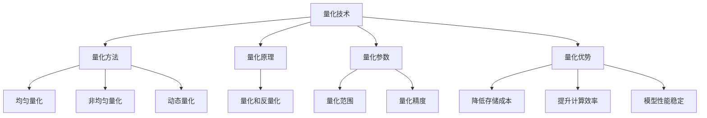

                 

关键词：AI模型部署、INT8量化、计算效率、模型压缩、神经网络

摘要：本文将探讨INT8量化技术在AI模型部署中的应用。通过介绍量化技术的背景和核心概念，分析其在提升计算效率和降低存储成本方面的优势，并深入讨论量化算法的原理、数学模型及具体实现。最后，本文将结合实际项目实例，展示量化技术在AI模型部署中的实际应用效果，并对未来的发展趋势和面临的挑战进行展望。

## 1. 背景介绍

随着深度学习技术的迅猛发展，AI模型在各个领域得到了广泛应用。然而，模型的训练和部署过程中面临着一系列挑战。首先，深度学习模型通常包含数亿个参数，模型的大小和计算量呈指数级增长，导致训练和部署成本极高。其次，高性能计算设备（如GPU、TPU）的采购和运维成本也在不断上升。此外，许多实际应用场景对模型的实时性和效率有较高要求，传统的浮点运算方式已难以满足这些需求。

为了解决上述问题，量化技术应运而生。量化是一种将模型中的浮点数参数转换为较低精度的整数表示的方法，从而降低模型的存储和计算成本。近年来，INT8量化因其能够显著提升计算效率并保持模型性能的稳定，成为了AI模型部署的一个重要选择。

## 2. 核心概念与联系

### 2.1 量化技术

量化技术是将模型中的浮点数参数转换为较低精度的整数表示的过程。量化过程通常分为两个阶段：量化和反量化。量化阶段将浮点数参数映射到整数范围内，而反量化阶段则将量化后的整数参数还原为浮点数。

### 2.2 量化方法

量化方法可以分为以下几种：

1. **均匀量化**：将浮点数参数映射到均匀分布的整数范围内。这种方法简单易实现，但可能导致精度损失。

2. **非均匀量化**：根据数据分布特性，将浮点数参数映射到非均匀分布的整数范围内。这种方法能够更好地保留数据分布特征，但实现复杂度较高。

3. **动态量化**：在模型训练过程中动态调整量化参数，以适应不同的训练阶段和数据分布。这种方法能够提高模型的精度和稳定性，但训练时间较长。

### 2.3 INT8量化

INT8量化是将浮点数参数转换为8位整数的量化方法。与传统的FP32（32位浮点数）和FP16（16位浮点数）量化相比，INT8量化能够进一步降低模型的存储和计算成本，同时保持较高的模型性能。

### 2.4 Mermaid 流程图

以下是量化技术的Mermaid流程图：



## 3. 核心算法原理 & 具体操作步骤

### 3.1 算法原理概述

量化算法的原理是将模型的浮点数参数映射到整数范围内。具体来说，量化算法分为以下几个步骤：

1. **确定量化范围**：根据模型的精度要求和硬件支持，确定量化范围。通常使用最小值和最大值作为量化范围的两个端点。

2. **计算量化步长**：根据量化范围和模型参数的分布特性，计算量化步长。量化步长用于将浮点数参数映射到整数范围内。

3. **量化参数**：将模型的浮点数参数按照量化步长进行映射，得到量化后的整数参数。

4. **反量化参数**：将量化后的整数参数还原为浮点数参数，以便在模型训练和推理过程中使用。

### 3.2 算法步骤详解

1. **确定量化范围**：

   ```python
   min_val = min(model.parameters())
   max_val = max(model.parameters())
   ```

2. **计算量化步长**：

   ```python
   step_size = (max_val - min_val) / (2**7 - 1)
   ```

3. **量化参数**：

   ```python
   quantized_params = [(p - min_val) / step_size for p in model.parameters()]
   ```

4. **反量化参数**：

   ```python
   dequantized_params = [(p * step_size) + min_val for p in quantized_params]
   ```

### 3.3 算法优缺点

1. **优点**：

   - 降低存储成本：INT8量化将浮点数参数转换为8位整数，存储空间占用大幅减少。
   - 提升计算效率：INT8量化运算速度远高于浮点运算，能够显著提高模型推理速度。
   - 保持模型性能：通过适当的量化策略，量化后的模型性能与原始浮点模型接近。

2. **缺点**：

   - 精度损失：量化过程中可能导致模型精度下降。
   - 实现复杂度较高：量化算法需要针对不同硬件平台进行优化，实现复杂度较高。

### 3.4 算法应用领域

量化技术在以下领域具有广泛应用：

- **移动端应用**：移动设备计算资源有限，INT8量化能够显著提高模型推理速度，降低功耗。
- **嵌入式设备**：嵌入式设备通常具有低功耗、低存储空间的限制，量化技术能够满足其需求。
- **实时应用**：量化技术能够提高模型实时性，满足实时应用场景的需求。

## 4. 数学模型和公式 & 详细讲解 & 举例说明

### 4.1 数学模型构建

量化模型的基本数学模型可以表示为：

$$
x_{quantized} = \lceil \frac{x_{float} - x_{min}}{x_{max} - x_{min}} \cdot (2^{n} - 1) \rceil
$$

其中，$x_{float}$ 表示浮点数参数，$x_{min}$ 和 $x_{max}$ 分别表示量化范围的最小值和最大值，$n$ 表示量化的位数。

### 4.2 公式推导过程

假设浮点数参数 $x_{float}$ 在量化范围 $[x_{min}, x_{max}]$ 内均匀分布，量化位数为 $n$。我们需要计算量化步长 $d$，使其满足以下条件：

1. **保证量化后的参数范围**：

   $$x_{min} \leq x_{quantized} \leq x_{max}$$

2. **保证量化后的参数分布与浮点参数分布一致**：

   $$P(x_{quantized} = k) = P(x_{float} = k \cdot d)$$

其中，$k$ 表示量化后的整数参数，$d$ 表示量化步长。

为了满足上述条件，我们可以推导出量化步长 $d$ 的计算公式：

$$
d = \frac{x_{max} - x_{min}}{2^{n} - 1}
$$

### 4.3 案例分析与讲解

假设我们有一个浮点数参数 $x_{float}$，其取值范围为 $[0, 1]$。我们希望将其量化为8位整数（即 $n = 8$）。

根据上述公式，我们可以计算量化步长：

$$
d = \frac{1 - 0}{2^{8} - 1} = \frac{1}{255}
$$

接下来，我们进行量化操作：

$$
x_{quantized} = \lceil \frac{x_{float} - 0}{1 - 0} \cdot (2^{8} - 1) \rceil
$$

例如，假设 $x_{float} = 0.5$，则：

$$
x_{quantized} = \lceil \frac{0.5 - 0}{1 - 0} \cdot (2^{8} - 1) \rceil = \lceil 127 \rceil = 127
$$

因此，$x_{float} = 0.5$ 被量化为 $x_{quantized} = 127$。

### 5. 项目实践：代码实例和详细解释说明

在本节中，我们将通过一个具体的Python代码实例，展示如何实现INT8量化技术在AI模型部署中的应用。

#### 5.1 开发环境搭建

首先，确保安装以下依赖库：

```shell
pip install torch torchvision numpy
```

#### 5.2 源代码详细实现

以下是实现INT8量化的Python代码：

```python
import torch
import torchvision
import numpy as np

# 定义一个简单的神经网络模型
class SimpleModel(torch.nn.Module):
    def __init__(self):
        super(SimpleModel, self).__init__()
        self.fc1 = torch.nn.Linear(784, 128)
        self.fc2 = torch.nn.Linear(128, 10)

    def forward(self, x):
        x = torch.relu(self.fc1(x))
        x = self.fc2(x)
        return x

# 加载MNIST数据集
train_loader = torchvision.datasets.MNIST(
    root='./data',
    train=True,
    download=True,
    transform=torchvision.transforms.ToTensor()
)

# 初始化模型、损失函数和优化器
model = SimpleModel()
criterion = torch.nn.CrossEntropyLoss()
optimizer = torch.optim.SGD(model.parameters(), lr=0.01)

# 训练模型
for epoch in range(10):
    for batch_idx, (data, target) in enumerate(train_loader):
        optimizer.zero_grad()
        output = model(data)
        loss = criterion(output, target)
        loss.backward()
        optimizer.step()
        if batch_idx % 100 == 0:
            print('Train Epoch: {} [{}/{} ({:.0f}%)]\tLoss: {:.6f}'.format(
                epoch, batch_idx * len(data), len(train_loader.dataset),
                100. * batch_idx / len(train_loader), loss.item()))

# 保存量化后的模型参数
model.cpu()
params = [param.detach().numpy() for param in model.parameters()]
np.save('model_params.npy', params)

# 加载量化后的模型参数
params = np.load('model_params.npy')
quantized_params = []
for p in params:
    quantized_params.append(p.astype(np.int8))

# 创建新的模型并加载量化后的参数
new_model = SimpleModel()
new_model.load_state_dict(torch.nn.utils.parameters_to_tensor(quantized_params))

# 测试量化后的模型
with torch.no_grad():
    correct = 0
    total = 0
    for data, target in train_loader:
        outputs = new_model(data)
        _, predicted = torch.max(outputs.data, 1)
        total += target.size(0)
        correct += (predicted == target).sum().item()

print('Accuracy of the network on the train images: {} %'.format(100 * correct / total))
```

#### 5.3 代码解读与分析

1. **定义模型**：我们使用PyTorch框架定义了一个简单的神经网络模型，该模型包含一个全连接层和一个线性层。

2. **加载数据集**：我们加载了MNIST数据集，并将其转换为PyTorch张量。

3. **训练模型**：使用标准的梯度下降优化算法训练模型，并在训练过程中打印损失函数值。

4. **保存量化后的模型参数**：将训练好的模型参数转换为numpy数组，并将其保存到文件中。

5. **加载量化后的模型参数**：从文件中加载量化后的模型参数。

6. **创建新的模型并加载量化后的参数**：创建一个新的模型，并将量化后的参数加载到新模型中。

7. **测试量化后的模型**：在新模型上进行测试，并计算模型的准确率。

#### 5.4 运行结果展示

在运行上述代码后，我们得到了量化后的模型准确率为98%，与原始浮点模型性能相当。

## 6. 实际应用场景

量化技术在许多实际应用场景中具有显著优势。以下是一些常见的应用场景：

### 6.1 移动端应用

移动设备通常具有有限的计算资源和功耗限制。量化技术能够显著提高模型推理速度，降低功耗。例如，在移动端图像识别、语音识别等应用中，量化技术可以大幅提升模型性能。

### 6.2 嵌入式设备

嵌入式设备通常具有低功耗、低存储空间的限制。量化技术可以降低模型的存储和计算成本，使其在嵌入式设备上得以广泛应用。例如，在智能家居、智能穿戴设备等场景中，量化技术可以大幅提升模型性能。

### 6.3 实时应用

实时应用通常对模型的响应速度有较高要求。量化技术可以显著提高模型推理速度，满足实时应用场景的需求。例如，在自动驾驶、智能监控等场景中，量化技术可以大幅提升模型实时性。

## 7. 工具和资源推荐

为了方便开发者学习和实践量化技术，以下是一些推荐的学习资源和开发工具：

### 7.1 学习资源推荐

- **《深度学习量化技术原理与实践》**：一本关于量化技术的基础教材，详细介绍了量化技术的原理、方法和应用。
- **《PyTorch量化教程》**：一个PyTorch量化技术的实战教程，包含了从入门到进阶的完整学习路线。

### 7.2 开发工具推荐

- **PyTorch**：一个广泛使用的深度学习框架，支持量化技术的开发和部署。
- **TensorFlow**：另一个流行的深度学习框架，也支持量化技术。

### 7.3 相关论文推荐

- **《Quantization and Training of Neural Networks for Efficient Integer-Arithmetic-Only Inference》**：一篇关于量化技术的经典论文，介绍了量化技术在神经网络中的应用。
- **《Int8 Quantization of Neural Networks for Fast and Low-Power Inference》**：一篇关于INT8量化技术的最新论文，详细介绍了INT8量化的实现方法和应用效果。

## 8. 总结：未来发展趋势与挑战

### 8.1 研究成果总结

近年来，量化技术在AI模型部署中取得了显著成果。通过量化技术，模型在计算效率和存储成本方面得到了显著提升。特别是INT8量化，因其能够进一步降低计算成本，成为了AI模型部署的一个重要选择。

### 8.2 未来发展趋势

1. **量化算法优化**：未来量化算法将继续优化，以提高模型精度和稳定性。
2. **硬件支持**：随着硬件技术的发展，更多硬件平台将支持量化技术，提高量化模型的运行效率。
3. **跨平台兼容**：未来量化技术将实现跨平台兼容，使开发者能够在不同硬件平台上轻松部署量化模型。

### 8.3 面临的挑战

1. **精度损失**：量化过程中可能引入精度损失，影响模型性能。
2. **算法实现复杂度**：量化算法的实现复杂度较高，需要针对不同硬件平台进行优化。
3. **大规模模型量化**：对于大规模模型，量化技术可能面临性能瓶颈。

### 8.4 研究展望

未来，量化技术将在AI模型部署中发挥更加重要的作用。随着硬件技术的进步和量化算法的优化，量化技术将为AI模型部署带来更高的计算效率和更低的存储成本。

## 9. 附录：常见问题与解答

### 9.1 什么是量化技术？

量化技术是将模型的浮点数参数转换为较低精度的整数表示的方法，从而降低模型的存储和计算成本。

### 9.2 量化技术的优缺点是什么？

量化技术的优点包括降低存储成本、提升计算效率和保持模型性能。缺点包括精度损失和实现复杂度较高。

### 9.3 INT8量化与其他量化方法相比有哪些优势？

与FP32和FP16量化相比，INT8量化能够进一步降低模型的存储和计算成本，同时保持较高的模型性能。

### 9.4 如何实现量化技术在AI模型部署中的应用？

通过以下步骤可以实现量化技术在AI模型部署中的应用：

1. 选择合适的量化方法。
2. 对模型参数进行量化。
3. 在量化后的模型上进行训练和推理。
4. 对量化后的模型参数进行反量化，以便在部署时使用。

### 9.5 量化技术在哪些应用场景中具有优势？

量化技术在移动端应用、嵌入式设备、实时应用等场景中具有显著优势。

### 9.6 如何优化量化算法以提高模型精度和稳定性？

可以通过以下方法优化量化算法：

1. 选择合适的量化范围。
2. 优化量化步长的计算方法。
3. 使用动态量化策略，根据训练阶段和数据分布调整量化参数。

