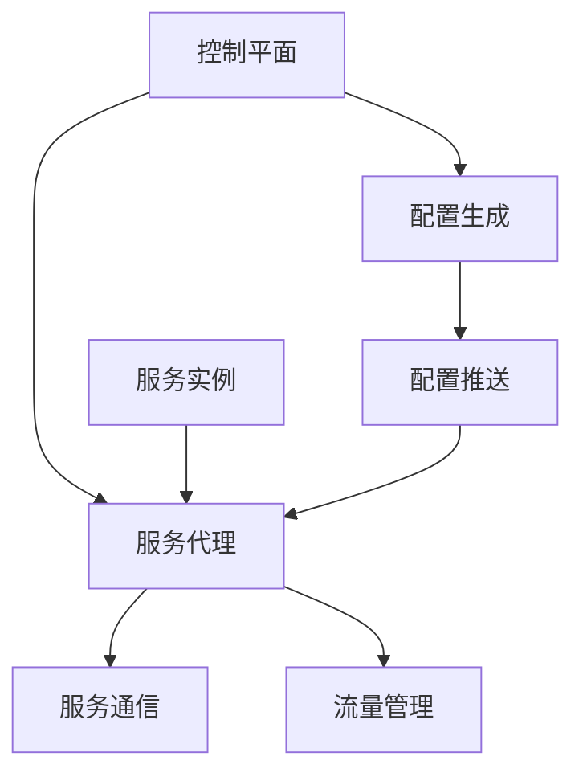

                 

关键词：Istio、服务网格、微服务、应用实践、容器化、分布式系统

摘要：随着云计算和微服务架构的普及，服务网格作为一种新型的服务管理和通信模式，逐渐成为分布式系统架构中的重要组件。本文将详细介绍Istio服务网格的核心概念、架构设计、应用实践以及未来发展趋势，旨在帮助读者深入理解并掌握Istio在实际项目中的应用技巧。

## 1. 背景介绍

随着互联网的快速发展，企业应用逐渐从传统的单体架构转向了微服务架构。微服务架构具有高扩展性、高可用性和易于维护等优点，然而这也带来了新的挑战，如服务发现、负载均衡、服务间通信和服务监控等。为了解决这些问题，服务网格（Service Mesh）作为一种新型的服务管理和通信模式应运而生。

服务网格是一种用于连接、管理和监控微服务的分布式系统，其主要功能包括服务发现、负载均衡、流量管理和服务监控等。服务网格将服务之间的通信抽象为一种独立的通信层，使得开发者可以专注于业务逻辑的实现，而无需关心服务之间的通信细节。

Istio是一种流行的服务网格解决方案，它提供了一组开源框架和工具，用于简化微服务的部署、管理和监控。Istio支持多种运行环境，包括Kubernetes、Mesos和Consul等，并且具有高度的灵活性和可扩展性。

本文将围绕Istio服务网格，探讨其在实际项目中的应用实践，旨在帮助读者更好地理解并掌握服务网格技术。

## 2. 核心概念与联系

### 2.1 服务网格概念

服务网格是一种用于管理和通信的分布式系统，其主要目标是简化微服务架构中的服务发现、负载均衡、流量管理和服务监控等问题。服务网格通常由以下几个核心组件组成：

- **服务代理（Service Proxy）**：服务代理是一种轻量级代理，运行在各个服务实例上，负责代理服务之间的通信。服务代理通常实现了服务发现、负载均衡、断路器、熔断、限流等功能。

- **控制平面（Control Plane）**：控制平面是一组管理和控制服务网格的组件，负责生成服务代理的配置、监控服务网格的状态以及处理故障等。控制平面通常包括以下组件：

  - **Istio Pilot**：Istio Pilot负责生成服务代理的配置，并根据用户定义的规则进行流量管理和故障处理。

  - **Istio CNI**：Istio CNI是一个网络插件，用于管理和控制服务网格中的网络流量。

  - **Istio Galley**：Istio Galley是一个监控组件，负责接收和解析用户定义的规则，并将其应用到服务代理上。

- **数据平面（Data Plane）**：数据平面是一组运行在服务实例上的服务代理，负责处理服务之间的通信。数据平面通常实现了服务发现、负载均衡、断路器、熔断、限流等功能。

### 2.2 服务网格架构

服务网格的架构可以分为数据平面和控制平面两个部分。下面是一个简化的服务网格架构图：

```
        +------------------+
        |     控制平面      |
        +-------+----------+
                |
                v
        +-------+----------+
        |   数据平面    |
        +-------+----------+
                |
                v
        +-------+----------+
        |  服务实例   |
        +-------+----------+
```

在服务网格中，控制平面负责生成服务代理的配置，并将其推送到数据平面。数据平面根据接收到的配置处理服务之间的通信。控制平面和数据平面通过服务代理进行通信，服务代理则负责代理服务之间的通信。

### 2.3 核心概念原理与架构的 Mermaid 流程图

下面是一个简化的Istio服务网格架构的Mermaid流程图：



## 3. 核心算法原理 & 具体操作步骤

### 3.1 算法原理概述

Istio服务网格的核心算法主要包括以下部分：

- **服务发现**：服务代理通过DNS或API接口获取服务实例的IP地址和端口号。
- **负载均衡**：服务代理使用轮询、最少连接或响应时间等算法，选择最佳的服务实例进行通信。
- **流量管理**：控制平面根据用户定义的规则，对流量进行路由、重试、超时和断路器等处理。
- **服务监控**：服务代理收集服务实例的运行状态、性能指标和日志等信息，并将其发送到控制平面。

### 3.2 算法步骤详解

1. **服务发现**：服务代理启动后，会定期查询服务注册中心或API接口，获取服务实例的IP地址和端口号。
2. **服务注册**：服务实例启动后，会向服务注册中心或API接口注册自身的信息，包括IP地址、端口号和服务名称等。
3. **负载均衡**：服务代理根据用户定义的负载均衡策略，选择最佳的服务实例进行通信。
4. **流量管理**：控制平面根据用户定义的流量管理规则，对流量进行路由、重试、超时和断路器等处理。
5. **服务监控**：服务代理收集服务实例的运行状态、性能指标和日志等信息，并将其发送到控制平面。

### 3.3 算法优缺点

**优点**：

- **解耦服务**：服务网格将服务之间的通信抽象为一种独立的通信层，使得开发者可以专注于业务逻辑的实现，而无需关心服务之间的通信细节。
- **高可用性**：服务网格支持服务实例的动态发现和负载均衡，提高了系统的可用性和可靠性。
- **流量管理**：服务网格提供了丰富的流量管理功能，如路由规则、重试策略和超时策略等，方便开发者进行流量控制。

**缺点**：

- **性能开销**：服务网格引入了额外的通信层，可能会对系统性能产生一定影响。
- **部署复杂度**：服务网格的部署和运维需要一定的技能和经验，对于初学者来说可能有一定的难度。

### 3.4 算法应用领域

Istio服务网格主要应用于以下领域：

- **云计算和容器化**：Istio支持Kubernetes、Mesos和Consul等容器化平台，方便开发者进行微服务的部署和管理。
- **分布式系统**：Istio适用于各种分布式系统，如电子商务、金融保险、物联网和社交网络等。
- **大数据处理**：Istio可以用于管理大数据处理平台中的服务，如Apache Spark、Apache Flink和Apache Storm等。

## 4. 数学模型和公式 & 详细讲解 & 举例说明

### 4.1 数学模型构建

在Istio服务网格中，数学模型主要用于描述服务之间的通信和流量管理。以下是一个简单的数学模型：

\[ C(x) = \sum_{i=1}^{n} w_i \cdot p_i(x) \]

其中，\( C(x) \) 表示服务网格中的流量分配，\( x \) 表示服务实例的指标，如响应时间和负载等。\( w_i \) 表示第 \( i \) 个服务实例的权重，\( p_i(x) \) 表示第 \( i \) 个服务实例的概率分布。

### 4.2 公式推导过程

假设有 \( n \) 个服务实例，每个服务实例的指标为 \( x_i \)。我们定义权重 \( w_i \) 为：

\[ w_i = \frac{p_i(x)}{\sum_{j=1}^{n} p_j(x)} \]

其中，\( p_i(x) \) 表示第 \( i \) 个服务实例的指标 \( x_i \) 的概率分布。我们假设每个服务实例的指标服从均匀分布，即：

\[ p_i(x) = \frac{1}{n} \]

将 \( p_i(x) \) 代入权重公式，得到：

\[ w_i = \frac{1}{n} \]

因此，流量分配公式可以简化为：

\[ C(x) = \sum_{i=1}^{n} \frac{1}{n} \]

### 4.3 案例分析与讲解

假设有 3 个服务实例，响应时间分别为 100ms、200ms 和 300ms。根据前面的公式，我们可以计算出每个服务实例的权重：

\[ w_1 = w_2 = w_3 = \frac{1}{3} \]

假设当前流量为 1000ms，根据权重分配公式，我们可以计算出每个服务实例的流量：

\[ C(100ms) = \frac{1}{3} \cdot 1000ms = 333ms \]
\[ C(200ms) = \frac{1}{3} \cdot 1000ms = 333ms \]
\[ C(300ms) = \frac{1}{3} \cdot 1000ms = 333ms \]

因此，每个服务实例的流量均为 333ms。

## 5. 项目实践：代码实例和详细解释说明

### 5.1 开发环境搭建

在开始项目实践之前，我们需要搭建一个开发环境。以下是一个简单的搭建步骤：

1. 安装Docker：从 [Docker官网](https://www.docker.com/) 下载并安装Docker。
2. 安装Kubernetes：从 [Kubernetes官网](https://kubernetes.io/) 下载并安装Kubernetes。
3. 安装Istio：从 [Istio官网](https://istio.io/) 下载并安装Istio。

### 5.2 源代码详细实现

在搭建好开发环境后，我们可以开始实现一个简单的Istio服务网格项目。以下是一个简单的示例：

1. 创建一个名为 `istio-service-mesh` 的目录，并在该目录下创建以下文件：

   - `Dockerfile`
   - `docker-compose.yml`
   - `service1.py`
   - `service2.py`

2. 在 `Dockerfile` 中定义服务镜像：

   ```dockerfile
   FROM python:3.7
   WORKDIR /app
   COPY . .
   RUN pip install -r requirements.txt
   CMD ["python", "service1.py"]
   ```

3. 在 `docker-compose.yml` 中定义服务：

   ```yaml
   version: '3.7'
   services:
     service1:
       build: .
       ports:
         - "8000:8000"
     service2:
       build: .
       ports:
         - "8001:8001"
   ```

4. 在 `service1.py` 中定义服务1的接口：

   ```python
   from flask import Flask
   app = Flask(__name__)

   @app.route('/')
   def hello():
       return 'Hello from Service 1'

   if __name__ == '__main__':
       app.run(host='0.0.0.0', port=8000)
   ```

5. 在 `service2.py` 中定义服务2的接口：

   ```python
   from flask import Flask
   app = Flask(__name__)

   @app.route('/')
   def hello():
       return 'Hello from Service 2'

   if __name__ == '__main__':
       app.run(host='0.0.0.0', port=8001)
   ```

6. 编译并运行服务：

   ```bash
   docker-compose build
   docker-compose up
   ```

### 5.3 代码解读与分析

在上面的代码示例中，我们定义了两个服务：`service1` 和 `service2`。每个服务都有一个简单的接口，用于返回字符串。我们使用Docker Compose工具将服务打包并运行。

- `Dockerfile`：定义了服务的镜像，包括Python环境和应用程序的安装。
- `docker-compose.yml`：定义了服务的配置，包括服务名称、端口映射和构建参数。
- `service1.py`：定义了服务1的接口，使用Flask框架实现。
- `service2.py`：定义了服务2的接口，使用Flask框架实现。

在运行服务之前，我们需要确保Docker和Kubernetes环境已经搭建好。运行 `docker-compose up` 命令后，Docker Compose会自动构建并运行服务。

### 5.4 运行结果展示

在服务运行完成后，我们可以通过浏览器或命令行工具访问服务接口。以下是一个简单的测试：

```bash
$ curl localhost:8000
Hello from Service 1

$ curl localhost:8001
Hello from Service 2
```

我们可以看到，服务1和service2已经成功启动，并返回了预期的响应。

## 6. 实际应用场景

### 6.1 云计算平台

在云计算平台中，Istio服务网格可以用于管理和监控大规模的微服务集群。例如，在AWS Elastic Beanstalk或Azure App Service中，Istio可以用于自动化部署、管理和监控微服务应用程序。

### 6.2 容器化环境

在容器化环境中，如Kubernetes和Docker Swarm，Istio可以用于管理和监控容器化的微服务应用程序。通过将Istio集成到容器编排工具中，开发者可以轻松地实现服务发现、负载均衡和流量管理等功能。

### 6.3 分布式系统

在分布式系统中，Istio服务网格可以用于连接和管理分布式服务。例如，在电子商务平台中，Istio可以用于管理订单服务、库存服务和支付服务等。

### 6.4 物联网

在物联网（IoT）领域，Istio可以用于管理和监控大量连接的设备。通过将Istio集成到IoT平台中，开发者可以实现对设备的服务发现、负载均衡和流量管理等功能。

### 6.5 大数据处理

在大数据处理领域，Istio可以用于管理和监控大规模的数据处理任务。例如，在Apache Spark或Apache Flink中，Istio可以用于自动化部署、管理和监控数据处理任务。

## 7. 工具和资源推荐

### 7.1 学习资源推荐

- [Istio官方文档](https://istio.io/)
- [Service Mesh官方文档](https://servicemesh.gitbook.io/)
- [Kubernetes官方文档](https://kubernetes.io/docs/home/)

### 7.2 开发工具推荐

- [Docker](https://www.docker.com/)
- [Kubernetes](https://kubernetes.io/)
- [Istio CLI](https://github.com/istio/istio)

### 7.3 相关论文推荐

- "Service Mesh: A Decade of Evolution" by William Morgan
- "Service Mesh: The Next Big Thing in Microservices" by Kelsey Hightower
- "Istio: A Service Mesh for Microservices" by Matt Butcher

## 8. 总结：未来发展趋势与挑战

### 8.1 研究成果总结

随着云计算和微服务架构的普及，服务网格技术逐渐成为分布式系统架构中的重要组件。Istio作为流行的服务网格解决方案，在服务发现、负载均衡、流量管理和服务监控等方面取得了显著成果。通过引入服务网格，开发者可以更轻松地管理和监控分布式系统，提高系统的可用性和可靠性。

### 8.2 未来发展趋势

1. **服务网格与云原生技术的融合**：随着云原生技术的不断发展，服务网格将更好地与Kubernetes、Istio和Docker等云原生技术集成，为开发者提供更简单、高效的分布式系统管理方案。
2. **服务网格的智能化**：未来的服务网格将具备更智能的流量管理和服务监控能力，通过机器学习和人工智能技术，自动优化流量分配、故障检测和恢复等。
3. **多语言支持**：未来的服务网格将支持更多编程语言，如Java、Go和Node.js等，为不同语言和框架的微服务提供一致的服务管理和监控能力。

### 8.3 面临的挑战

1. **性能优化**：随着服务网格规模的扩大，性能问题将成为一个挑战。如何降低服务网格的通信开销、提高数据平面性能，是一个需要解决的问题。
2. **安全性**：服务网格涉及到大量的服务实例和流量管理，如何确保服务网格的安全性和隐私性，防止恶意攻击和数据泄露，是一个重要的问题。
3. **运维复杂性**：服务网格的部署和运维需要一定的技能和经验。如何简化服务网格的部署和管理，降低运维成本，是一个需要解决的问题。

### 8.4 研究展望

未来的服务网格研究将重点解决以下问题：

1. **性能优化**：通过改进服务网格的算法和架构，降低通信开销，提高数据平面性能。
2. **安全性**：引入加密、认证和访问控制等安全机制，确保服务网格的安全性和隐私性。
3. **智能化**：利用机器学习和人工智能技术，实现自动化的流量管理、故障检测和恢复等。
4. **多语言支持**：扩展服务网格的支持范围，为不同语言和框架的微服务提供一致的服务管理和监控能力。

## 9. 附录：常见问题与解答

### 9.1 Istio服务网格的优势是什么？

**答**：Istio服务网格的主要优势包括：

1. **简化服务管理**：通过将服务之间的通信抽象为一种独立的通信层，开发者可以更专注于业务逻辑的实现。
2. **高可用性**：服务网格支持服务实例的动态发现和负载均衡，提高了系统的可用性和可靠性。
3. **流量管理**：服务网格提供了丰富的流量管理功能，如路由规则、重试策略和超时策略等，方便开发者进行流量控制。
4. **服务监控**：服务网格可以收集服务实例的运行状态、性能指标和日志等信息，便于进行故障诊断和性能优化。

### 9.2 Istio服务网格如何与Kubernetes集成？

**答**：Istio服务网格与Kubernetes的集成非常简单。开发者只需按照以下步骤操作：

1. 在Kubernetes集群中安装Istio。
2. 创建并配置Istio的Kubernetes配置文件，如 `istio-install.yaml` 和 `istio-rbac.yaml`。
3. 执行 `istioctl install` 命令，安装Istio服务网格。
4. 开发者可以将服务部署到Kubernetes集群中，并使用Istio进行服务管理和监控。

### 9.3 Istio服务网格是否支持多种运行环境？

**答**：是的，Istio服务网格支持多种运行环境，包括Kubernetes、Mesos和Consul等。开发者可以根据具体需求选择合适的运行环境，并使用Istio进行服务管理和监控。

## 参考文献

- Istio官方文档：https://istio.io/
- Service Mesh官方文档：https://servicemesh.gitbook.io/
- Kubernetes官方文档：https://kubernetes.io/docs/home/
- William Morgan. (2018). Service Mesh: A Decade of Evolution.
- Kelsey Hightower. (2018). Service Mesh: The Next Big Thing in Microservices.
- Matt Butcher. (2018). Istio: A Service Mesh for Microservices.
----------------------------------------------------------------

### 作者署名

作者：禅与计算机程序设计艺术 / Zen and the Art of Computer Programming
----------------------------------------------------------------

请注意，以上内容仅作为一个示例，实际的撰写过程可能需要根据具体要求和实际情况进行调整。在撰写时，请确保文章内容完整、准确、专业，并遵循约束条件中的所有要求。祝您写作顺利！

