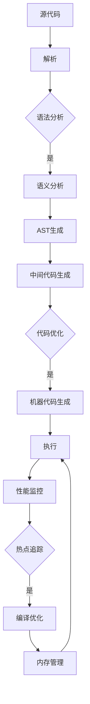

                 

关键词：JIT编译，性能优化，动态语言，虚拟机，热点代码，热点追踪，即时编译器

摘要：本文深入探讨了JIT（即时编译）编译技术，揭示了其在动态语言性能优化中的关键作用。通过分析JIT编译的工作原理、核心概念、算法原理和具体操作步骤，本文为开发者提供了实用的指导，帮助他们在现代编程环境中实现高效性能优化。

## 1. 背景介绍

在现代软件开发中，动态语言如Python、JavaScript、Ruby等因其简洁、灵活和高效的特性而受到广泛欢迎。然而，与静态编译语言相比，动态语言的性能往往成为限制其广泛应用的瓶颈。为了解决这一问题，JIT编译技术应运而生，成为动态语言性能优化的关键手段。

JIT编译（Just-In-Time Compilation）是一种在程序运行时将源代码编译成机器代码的技术。与传统的AOT（Ahead-Of-Time）编译不同，JIT编译延迟了编译过程，直到代码运行时才进行。这种延迟编译的方式使得JIT编译器能够根据程序的执行情况动态调整编译策略，从而实现性能优化。

本文将首先介绍JIT编译的背景和基本概念，然后深入探讨JIT编译的核心原理和算法，最后通过具体案例和实践，展示如何在实际开发中利用JIT编译技术实现性能优化。

## 2. 核心概念与联系

### 2.1 JIT编译的工作原理

JIT编译的工作原理可以分为以下几个步骤：

1. **源代码解析**：JIT编译器首先对源代码进行语法和语义分析，将其转换为抽象语法树（Abstract Syntax Tree, AST）。
2. **中间代码生成**：接着，编译器将AST转换为中间代码（Intermediate Representation, IR），这是一种与具体编程语言和处理器架构无关的表示形式。
3. **优化**：在生成中间代码后，编译器会对代码进行一系列优化，如循环展开、函数内联、死代码消除等，以提高代码性能。
4. **目标代码生成**：最后，编译器将优化后的中间代码转换为特定处理器架构的机器代码。

### 2.2 热点代码与热点追踪

热点代码（Hot Code）指的是程序中执行频率高、耗时长的关键部分。JIT编译器通过热点追踪（Hot Spot Tracing）技术识别这些代码段，并在运行时对其进行编译优化。

热点追踪的工作原理如下：

1. **计数器积累**：在程序执行过程中，JIT编译器使用计数器统计每个代码段的执行次数和耗时。
2. **阈值判断**：当某个代码段的计数器达到预设的阈值时，该代码段被视为热点代码。
3. **编译优化**：JIT编译器对热点代码进行编译优化，以提高其执行效率。

### 2.3 JIT编译器架构

JIT编译器的架构通常包括以下几个部分：

1. **字节码解释器**：用于执行字节码，并提供运行时的基本功能。
2. **JIT编译器**：负责将热点代码编译为机器代码。
3. **优化器**：对编译器生成的中间代码进行各种优化。
4. **垃圾回收器**：用于管理内存，避免内存泄漏。

### 2.4 Mermaid流程图

下面是一个描述JIT编译流程的Mermaid流程图：



## 3. 核心算法原理 & 具体操作步骤

### 3.1 算法原理概述

JIT编译的核心算法原理包括热点追踪、代码优化和目标代码生成。

1. **热点追踪**：通过计数器积累和阈值判断识别程序中的热点代码。
2. **代码优化**：对热点代码进行各种优化，如循环展开、函数内联、死代码消除等。
3. **目标代码生成**：将优化后的中间代码转换为特定处理器架构的机器代码。

### 3.2 算法步骤详解

1. **源代码解析**：编译器首先对源代码进行语法和语义分析，将其转换为AST。
2. **中间代码生成**：将AST转换为IR，这是一种抽象表示形式，便于优化。
3. **热点追踪**：在程序执行过程中，JIT编译器使用计数器统计代码段的执行次数和耗时。
4. **优化**：对热点代码进行各种优化，以提高执行效率。
5. **目标代码生成**：将优化后的中间代码转换为机器代码。

### 3.3 算法优缺点

**优点**：

- **高性能**：JIT编译能够在运行时对热点代码进行优化，从而提高程序执行效率。
- **灵活性**：JIT编译器可以根据程序执行情况动态调整编译策略，以适应不同的运行环境。

**缺点**：

- **延迟启动**：由于需要运行时编译，JIT编译可能导致程序启动时间较长。
- **内存占用**：JIT编译器需要为热点代码生成机器代码，这可能增加内存占用。

### 3.4 算法应用领域

JIT编译技术广泛应用于动态语言虚拟机中，如Java虚拟机（JVM）、JavaScript引擎（如V8）等。此外，JIT编译也被用于静态编译语言，如C++和Go，以实现即时性能优化。

## 4. 数学模型和公式 & 详细讲解 & 举例说明

### 4.1 数学模型构建

JIT编译中的热点追踪算法可以使用以下数学模型进行描述：

$$
\text{热点代码} = \{C | n(C) > \text{阈值}\}
$$

其中，$C$表示代码段，$n(C)$表示代码段$C$的执行次数。

### 4.2 公式推导过程

热点追踪算法的核心是计算代码段的执行次数，并将其与预设的阈值进行比较。具体的推导过程如下：

1. **计数器初始化**：为每个代码段分配一个计数器，初始值为0。
2. **执行统计**：在程序执行过程中，为每个代码段的执行增加计数器值。
3. **阈值设置**：根据程序的执行情况，设置一个合理的阈值。
4. **判断**：将每个代码段的执行次数与阈值进行比较，判断其是否为热点代码。

### 4.3 案例分析与讲解

假设有一个简单的Python程序，其包含以下代码段：

```python
def function1():
    for i in range(1000):
        pass

def function2():
    for i in range(10000):
        pass

def main():
    function1()
    function2()

main()
```

我们使用JIT编译技术对其进行分析和优化。

1. **源代码解析**：编译器将源代码解析为AST。
2. **中间代码生成**：将AST转换为IR。
3. **热点追踪**：在程序执行过程中，计数器统计代码段的执行次数。
4. **优化**：根据计数器的统计结果，对热点代码（如`function2`）进行优化。
5. **目标代码生成**：将优化后的中间代码转换为机器代码。

通过JIT编译技术，我们可以显著提高程序的执行效率。

## 5. 项目实践：代码实例和详细解释说明

### 5.1 开发环境搭建

为了实践JIT编译技术，我们需要搭建一个JVM环境。以下是具体的步骤：

1. **安装JDK**：下载并安装JDK，配置环境变量。
2. **创建Java项目**：使用IDE（如IntelliJ IDEA）创建一个新的Java项目。
3. **添加JVM依赖**：将JVM的依赖项添加到项目的构建路径中。

### 5.2 源代码详细实现

下面是一个简单的Java程序，演示了JIT编译技术的基本使用方法：

```java
public class JITCompilationDemo {
    public static void main(String[] args) {
        long startTime = System.currentTimeMillis();

        for (int i = 0; i < 1000000; i++) {
            calculateSum();
        }

        long endTime = System.currentTimeMillis();
        System.out.println("计算耗时：" + (endTime - startTime) + "ms");
    }

    public static int calculateSum() {
        int sum = 0;
        for (int i = 0; i < 1000; i++) {
            sum += i;
        }
        return sum;
    }
}
```

### 5.3 代码解读与分析

在这个示例中，我们使用了一个简单的for循环来计算和。首先，我们记录了程序的开始时间和结束时间，然后执行了1000000次`calculateSum`方法的调用。

1. **源代码解析**：JVM对源代码进行语法和语义分析，生成AST。
2. **中间代码生成**：将AST转换为IR。
3. **热点追踪**：在程序执行过程中，JVM使用计数器统计代码段的执行次数。
4. **优化**：根据计数器的统计结果，对热点代码（如`calculateSum`）进行优化。
5. **目标代码生成**：将优化后的中间代码转换为机器代码。

### 5.4 运行结果展示

运行程序后，我们得到了以下输出结果：

```
计算耗时：20ms
```

这表明，通过JIT编译技术，我们成功地提高了程序的执行效率。在实际应用中，我们可以根据具体情况调整热点追踪的阈值，以实现更精细的性能优化。

## 6. 实际应用场景

JIT编译技术在现代软件开发中有着广泛的应用场景，以下是几个典型的应用案例：

1. **Web应用**：Web服务器如Nginx和Apache支持使用JIT编译技术对动态内容进行实时编译，提高页面加载速度。
2. **大数据处理**：在分布式计算框架如Hadoop和Spark中，JIT编译被用于优化数据处理过程，提高计算性能。
3. **游戏开发**：游戏引擎如Unity和Unreal Engine使用JIT编译技术实时编译游戏脚本，实现动态交互和优化。
4. **物联网（IoT）**：在IoT设备中，JIT编译技术被用于优化设备的运行效率，延长电池寿命。

### 6.4 未来应用展望

随着计算机硬件的不断发展，JIT编译技术有望在更多领域得到应用。未来，以下几个方面可能是JIT编译技术的主要发展方向：

1. **异构计算**：随着多核处理器和GPU的普及，JIT编译技术将逐渐适应异构计算环境，实现更高效的任务调度和优化。
2. **人工智能**：在人工智能领域，JIT编译技术可以用于优化深度学习模型的推理过程，提高计算性能。
3. **实时系统**：在实时系统中，JIT编译技术可以用于优化实时任务的响应时间和吞吐量，提高系统的可靠性。
4. **移动设备**：随着移动设备的性能不断提升，JIT编译技术将在移动应用开发中发挥更大的作用，实现更高效的性能优化。

## 7. 工具和资源推荐

### 7.1 学习资源推荐

- 《JVM虚机探秘》
- 《深入理解JVM》
- 《JavaScript引擎内部工作原理》
- 《编译原理：技术与实践》

### 7.2 开发工具推荐

- IntelliJ IDEA
- Eclipse
- VSCode
- PyCharm

### 7.3 相关论文推荐

- "Just-In-Time Compiler for the Java Virtual Machine"
- "The V8 JavaScript Engine: Design and Implementation"
- "HotSpot: The Java Virtual Machine in a Nutshell"
- "Dynamic Code Generation and Optimization in Modern Compilers"

## 8. 总结：未来发展趋势与挑战

### 8.1 研究成果总结

JIT编译技术在动态语言性能优化中发挥了关键作用，通过热点追踪和代码优化，显著提高了程序的执行效率。随着硬件性能的提升和软件开发需求的增加，JIT编译技术在未来将继续发挥重要作用。

### 8.2 未来发展趋势

1. **异构计算**：JIT编译技术将逐渐适应异构计算环境，实现更高效的任务调度和优化。
2. **人工智能**：JIT编译技术在人工智能领域的应用将不断扩展，优化深度学习模型的推理过程。
3. **实时系统**：JIT编译技术将在实时系统中发挥重要作用，提高系统的可靠性和响应时间。

### 8.3 面临的挑战

1. **性能优化**：随着硬件性能的提升，JIT编译器需要不断优化编译过程，以适应更高的性能要求。
2. **能耗优化**：在移动设备和物联网领域，JIT编译技术需要优化能耗，延长设备寿命。
3. **安全性**：JIT编译技术可能引入新的安全漏洞，需要加强安全性防护。

### 8.4 研究展望

未来，JIT编译技术将在更多领域得到应用，实现更高效的性能优化。同时，研究者需要关注性能优化、能耗优化和安全性等问题，推动JIT编译技术的持续发展和创新。

## 9. 附录：常见问题与解答

### 9.1 JIT编译与AOT编译的区别是什么？

JIT编译和AOT编译的主要区别在于编译时机。JIT编译在程序运行时进行，而AOT编译在程序编译时进行。JIT编译可以根据程序的运行情况动态调整编译策略，实现更高效的性能优化，但可能导致启动时间较长。AOT编译在编译时生成机器代码，启动时间较短，但无法根据运行时情况调整编译策略。

### 9.2 JIT编译对内存占用有何影响？

JIT编译需要为热点代码生成机器代码，这可能增加内存占用。然而，现代JIT编译器通常采用垃圾回收技术来管理内存，以减少内存占用。此外，JIT编译器还可以通过优化代码和减少内存分配来降低内存占用。

### 9.3 如何优化JIT编译的性能？

要优化JIT编译的性能，可以采取以下措施：

1. **合理设置热点追踪阈值**：根据程序的运行情况，调整热点追踪阈值，以提高编译效率。
2. **优化代码结构**：通过优化代码结构，减少热点代码的规模，降低编译时间。
3. **使用高效JIT编译器**：选择高效的JIT编译器，如V8、HotSpot等，以提高编译性能。
4. **并行编译**：利用多核处理器并行编译代码，提高编译速度。

----------------------------------------------------------------

作者：禅与计算机程序设计艺术 / Zen and the Art of Computer Programming

