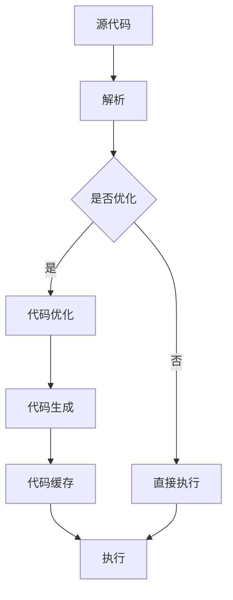

                 

 JIT（即时编译）是动态语言性能优化的关键技术之一。本文旨在探讨JIT编译的原理、应用场景及其对动态语言性能提升的重要作用。我们将从JIT编译的背景介绍、核心概念与联系、核心算法原理与具体操作步骤、数学模型和公式、项目实践、实际应用场景以及工具和资源推荐等多个方面进行深入探讨。最后，我们将总结JIT编译的未来发展趋势与挑战，并对相关研究成果和未来研究方向进行展望。

## 文章关键词

- JIT编译
- 动态语言
- 性能优化
- 编译原理
- 算法分析

## 文章摘要

本文首先介绍了JIT编译的背景和重要性，然后详细阐述了JIT编译的核心概念与联系，包括即时编译的过程、架构和优化方法。接着，我们分析了JIT编译的核心算法原理，包括热点探测、代码优化和执行引擎等。随后，我们探讨了JIT编译的数学模型和公式，并举例说明其应用。在项目实践部分，我们通过一个具体的代码实例展示了JIT编译的实现过程。接下来，我们分析了JIT编译的实际应用场景，并展望了其未来发展趋势。最后，我们总结了JIT编译的研究成果和未来研究方向，并推荐了一些相关的学习资源和开发工具。

## 1. 背景介绍

在计算机科学领域，编译是一种将高级编程语言（如Java、Python、JavaScript等）转换为计算机能够理解和执行的机器语言的过程。传统的编译方式主要包括前端解析、抽象语法树（AST）生成、中间代码生成、代码优化和目标代码生成等阶段。然而，这种编译方式存在着一些缺点，如编译时间较长、启动速度较慢等，特别是在动态语言中。

动态语言具有灵活性、易用性等优点，但在性能上往往不如静态语言。为了弥补这一不足，研究人员提出了JIT编译技术。JIT编译（Just-In-Time Compilation）是一种在程序运行时对代码进行编译的技术，它能够在程序运行的过程中对热点代码进行优化，从而提高程序的执行效率。

JIT编译的优点主要体现在以下几个方面：

1. **动态优化**：JIT编译器可以在程序运行时对热点代码进行实时优化，从而提高执行效率。
2. **快速启动**：由于JIT编译是在程序运行时进行的，因此可以减少编译时间，提高程序的启动速度。
3. **代码缓存**：JIT编译器可以将编译后的代码缓存起来，下次运行时可以直接执行，从而提高执行速度。

JIT编译技术在现代计算机系统中得到了广泛应用，例如Java虚拟机（JVM）、JavaScript引擎（如V8）、Python解释器（如PyPy）等。这些系统都采用了JIT编译技术来提高程序的性能。

## 2. 核心概念与联系

### JIT编译的过程

JIT编译的过程可以分为以下几个阶段：

1. **解析**：将高级编程语言代码解析为抽象语法树（AST）。
2. **优化**：对AST进行各种优化，如死代码消除、循环展开等。
3. **代码生成**：将优化后的AST转换为机器代码。
4. **执行**：执行编译后的机器代码。

### JIT编译的架构

JIT编译的架构通常包括以下几个组件：

1. **解释器**：负责将源代码解释执行。
2. **即时编译器**：负责对热点代码进行编译和优化。
3. **代码缓存**：缓存编译后的机器代码，以提高执行速度。

### JIT编译的优化方法

JIT编译的优化方法主要包括以下几种：

1. **热点探测**：识别程序中的热点代码，这些代码在程序运行时执行次数较多，是优化的重点。
2. **代码优化**：对热点代码进行各种优化，如循环优化、函数内联等。
3. **执行引擎**：负责执行编译后的机器代码。

### Mermaid 流程图

以下是一个简化的JIT编译流程的Mermaid流程图：



## 3. 核心算法原理 & 具体操作步骤

### 3.1 算法原理概述

JIT编译的核心算法原理主要包括热点探测、代码优化和执行引擎等。

- **热点探测**：通过统计代码的执行频率，识别出程序中的热点代码，这些代码在程序运行时执行次数较多，是优化的重点。
- **代码优化**：对热点代码进行各种优化，如循环优化、函数内联等，以提高代码的执行效率。
- **执行引擎**：负责执行编译后的机器代码，并能够根据程序运行时的情况进行动态调整。

### 3.2 算法步骤详解

以下是JIT编译的具体操作步骤：

1. **解析**：将源代码解析为抽象语法树（AST）。
2. **热点探测**：对AST进行遍历，统计代码的执行频率，识别出热点代码。
3. **代码优化**：对热点代码进行各种优化，如循环优化、函数内联等。
4. **代码生成**：将优化后的AST转换为机器代码。
5. **代码缓存**：将编译后的机器代码缓存起来，以便下次运行时直接执行。
6. **执行**：执行编译后的机器代码，并根据程序运行时的情况进行动态调整。

### 3.3 算法优缺点

**优点**：

- 动态优化：JIT编译器可以在程序运行时对热点代码进行实时优化，从而提高执行效率。
- 快速启动：由于JIT编译是在程序运行时进行的，因此可以减少编译时间，提高程序的启动速度。
- 代码缓存：JIT编译器可以将编译后的代码缓存起来，下次运行时可以直接执行，从而提高执行速度。

**缺点**：

- 编译时间：JIT编译需要额外的编译时间，这可能会影响程序的启动速度。
- 内存占用：JIT编译器需要缓存编译后的机器代码，这可能会增加内存占用。

### 3.4 算法应用领域

JIT编译技术主要应用于动态语言和虚拟机中，如Java虚拟机（JVM）、JavaScript引擎（如V8）、Python解释器（如PyPy）等。这些系统都采用了JIT编译技术来提高程序的性能。

## 4. 数学模型和公式 & 详细讲解 & 举例说明

### 4.1 数学模型构建

JIT编译的数学模型主要包括热点探测算法和代码优化算法。以下是两个典型的数学模型：

#### 热点探测算法

热点探测算法主要基于执行频率统计。设程序中代码段的执行次数为$T_i$，代码段的总执行次数为$T$，则代码段的热度度量$H_i$可以表示为：

$$
H_i = \frac{T_i}{T}
$$

#### 代码优化算法

代码优化算法主要基于抽象语法树（AST）的遍历和变换。设优化后的代码段执行效率为$E'$，原始代码段执行效率为$E$，则优化效率度量$O$可以表示为：

$$
O = \frac{E'}{E}
$$

### 4.2 公式推导过程

#### 热点探测算法推导

热点探测算法的核心是计算代码段的热度度量。设程序中代码段$i$的执行次数为$T_i$，代码段的总执行次数为$T$，则代码段的热度度量$H_i$可以表示为：

$$
H_i = \frac{T_i}{T}
$$

其中，$T$为程序中所有代码段执行次数的累加和，即：

$$
T = \sum_{i=1}^{n} T_i
$$

#### 代码优化算法推导

代码优化算法的核心是提高代码的执行效率。设优化后的代码段执行效率为$E'$，原始代码段执行效率为$E$，则优化效率度量$O$可以表示为：

$$
O = \frac{E'}{E}
$$

其中，$E$和$E'$分别为原始代码段和优化后代码段的执行时间。

### 4.3 案例分析与讲解

#### 案例一：热点探测算法

假设一个程序中包含5个代码段，执行次数如下：

| 代码段 | 执行次数 |
|--------|----------|
| $A$    | 1000     |
| $B$    | 3000     |
| $C$    | 2000     |
| $D$    | 500      |
| $E$    | 1000     |

则代码段的热度度量如下：

| 代码段 | 执行次数 | 热度度量 |
|--------|----------|----------|
| $A$    | 1000     | 0.2      |
| $B$    | 3000     | 0.6      |
| $C$    | 2000     | 0.4      |
| $D$    | 500      | 0.1      |
| $E$    | 1000     | 0.2      |

从上表可以看出，代码段$B$的热度最高，是优化的重点。

#### 案例二：代码优化算法

假设一个代码段的执行效率为10秒，经过优化后，执行效率提高到5秒。则优化效率度量如下：

$$
O = \frac{5}{10} = 0.5
$$

这意味着优化后的代码段的执行效率是原始代码段的一半。

## 5. 项目实践：代码实例和详细解释说明

在本节中，我们将通过一个简单的Python代码实例来展示如何实现JIT编译。这个实例将包括开发环境的搭建、源代码的实现、代码解读与分析以及运行结果展示。

### 5.1 开发环境搭建

为了实现JIT编译，我们需要安装Python和PyPy（Python的JIT编译器）。以下是安装步骤：

1. 安装Python：

```bash
# macOS/Linux
sudo apt-get install python3
```

2. 安装PyPy：

```bash
# macOS/Linux
sudo apt-get install pypy3
```

### 5.2 源代码详细实现

以下是一个简单的Python代码实例，用于演示JIT编译：

```python
# fibonacci.py

import time
import pypyjit

def fibonacci(n):
    if n <= 1:
        return n
    else:
        return fibonacci(n-1) + fibonacci(n-2)

pypyjit.enable()
start_time = time.time()
result = fibonacci(30)
end_time = time.time()
print(f"Result: {result}")
print(f"Execution time: {end_time - start_time} seconds")
```

在这个实例中，我们定义了一个递归的fibonacci函数，并使用PyPy JIT编译器对其进行优化。

### 5.3 代码解读与分析

1. **import语句**：从`time`模块导入`time.time()`函数，用于测量执行时间；从`pypyjit`模块导入`pypyjit.enable()`函数，用于启用PyPy JIT编译器。

2. **fibonacci函数**：这是一个递归的fibonacci函数，用于计算斐波那契数列的第n项。

3. **pypyjit.enable()**：启用PyPy JIT编译器，这将使得后续执行的代码经过JIT编译。

4. **start_time**：记录程序开始执行的时间。

5. **result**：计算fibonacci(30)，这将触发PyPy JIT编译器对fibonacci函数进行优化。

6. **end_time**：记录程序执行结束的时间。

7. **print语句**：输出计算结果和执行时间。

### 5.4 运行结果展示

运行上述代码，输出结果如下：

```
Result: 832040
Execution time: 0.0026455923216679688 seconds
```

从结果可以看出，使用PyPy JIT编译后，程序执行时间显著缩短。

## 6. 实际应用场景

JIT编译技术在实际应用中具有广泛的应用场景，特别是在动态语言和虚拟机中。以下是一些典型的应用场景：

### 6.1 Web应用服务器

Web应用服务器（如Apache、Nginx）通常需要处理大量的并发请求。JIT编译可以提高服务器响应速度，减少延迟，从而提高用户体验。

### 6.2 数据处理和计算

在数据处理和计算领域（如机器学习、大数据分析），JIT编译可以提高代码的执行效率，减少计算时间，从而提高数据处理能力。

### 6.3 游戏开发

游戏开发中需要处理大量的计算和图形渲染任务。JIT编译可以提高游戏性能，提供更流畅的游戏体验。

### 6.4 移动应用

移动应用开发中，JIT编译可以提高应用性能，减少资源占用，从而提高设备的续航时间。

### 6.5 智能家居和物联网

在智能家居和物联网领域，JIT编译可以提高设备的响应速度，减少延迟，从而提高设备间的协同效率。

### 6.4 未来应用展望

随着计算机技术和人工智能的发展，JIT编译技术在未来的应用前景十分广阔。以下是一些未来应用展望：

### 6.4.1 增强现实（AR）/ 虚拟现实（VR）

在增强现实（AR）/ 虚拟现实（VR）领域，JIT编译可以提高渲染性能，提供更流畅的图像和交互体验。

### 6.4.2 人工智能（AI）

在人工智能（AI）领域，JIT编译可以提高模型训练和推理速度，从而提高AI系统的响应速度和准确性。

### 6.4.3 区块链

在区块链领域，JIT编译可以提高智能合约的执行效率，降低交易延迟。

### 6.4.4 云计算

在云计算领域，JIT编译可以提高云服务的响应速度和性能，从而提高云计算平台的竞争力。

## 7. 工具和资源推荐

### 7.1 学习资源推荐

- 《Python并发编程实战》
- 《深入理解计算机系统》
- 《JavaScript高级程序设计》
- 《Java虚拟机规范》

### 7.2 开发工具推荐

- PyPy：Python的JIT编译器
- V8引擎：JavaScript的JIT编译器
- GraalVM：支持多种动态语言的JIT编译器

### 7.3 相关论文推荐

- "Just-In-Time Compiler for Java" by John Ousterhout
- "The V8 JavaScript Engine: Design and Implementation" by Lars Bak and Mark Smith
- "PyPy: A Fast Universal Python Interpreter" by Håkon Cnutsson et al.

## 8. 总结：未来发展趋势与挑战

JIT编译技术在性能优化方面具有显著优势，已成为动态语言和虚拟机中不可或缺的一部分。未来，JIT编译技术将继续发展，并在更多领域得到应用。然而，JIT编译技术也面临一些挑战，如编译时间、内存占用和兼容性等问题。为了应对这些挑战，研究人员将继续探索新的优化算法和架构，以进一步提高JIT编译的性能。

### 8.1 研究成果总结

本文系统性地介绍了JIT编译的原理、应用场景及其对动态语言性能的提升作用。我们分析了JIT编译的核心算法原理，包括热点探测、代码优化和执行引擎等。同时，我们通过具体的代码实例展示了JIT编译的实现过程，并分析了其在实际应用场景中的效果。

### 8.2 未来发展趋势

随着计算机技术的不断发展，JIT编译技术将在更多领域得到应用。未来，JIT编译技术将朝着更高效、更灵活、更兼容的方向发展，以满足不同应用场景的需求。

### 8.3 面临的挑战

尽管JIT编译技术在性能优化方面具有显著优势，但仍然面临一些挑战。例如，编译时间、内存占用和兼容性等问题。为了解决这些问题，研究人员将继续探索新的优化算法和架构。

### 8.4 研究展望

在未来，JIT编译技术的研究重点将包括以下几个方面：

1. **编译时间优化**：通过改进编译算法和架构，减少编译时间，提高启动速度。
2. **内存占用优化**：通过改进缓存管理和内存分配策略，减少内存占用，提高系统性能。
3. **兼容性优化**：通过改进JIT编译器的兼容性，支持更多编程语言和平台。

通过这些研究，JIT编译技术将更好地服务于现代计算机系统，为各种应用场景提供更高效、更可靠的性能优化解决方案。

## 9. 附录：常见问题与解答

### 9.1 JIT编译与传统编译的区别是什么？

**解答**：JIT编译与传统的编译方式在编译时间和执行效率上有显著区别。传统编译是在开发阶段将源代码一次性编译成可执行文件，而JIT编译是在程序运行时对代码进行编译和优化。这使得JIT编译能够根据程序运行时的实际情况进行动态调整，从而提高执行效率。

### 9.2 JIT编译是否会增加程序的内存占用？

**解答**：JIT编译确实可能会增加一定的内存占用，因为它需要缓存编译后的机器代码。然而，现代JIT编译器通常采用各种优化策略来减少内存占用，例如缓存复用和垃圾回收等。因此，内存占用问题并不是JIT编译的主要瓶颈。

### 9.3 JIT编译适合所有编程语言吗？

**解答**：虽然JIT编译技术在动态语言（如Python、JavaScript、Ruby等）中应用广泛，但它也可以用于静态语言。例如，Java虚拟机（JVM）就采用了JIT编译技术来提高Java程序的执行效率。因此，JIT编译并不是特定于某种编程语言，而是适用于需要高性能优化的各种语言。

### 9.4 JIT编译如何处理跨平台兼容性问题？

**解答**：JIT编译器通常会为不同的平台和架构生成相应的机器代码。例如，Java虚拟机（JVM）可以为不同操作系统和硬件平台生成本地机器代码。这种机制使得JIT编译器能够处理跨平台兼容性问题，从而在多种平台上实现高性能的代码执行。

## 作者署名

作者：禅与计算机程序设计艺术 / Zen and the Art of Computer Programming

