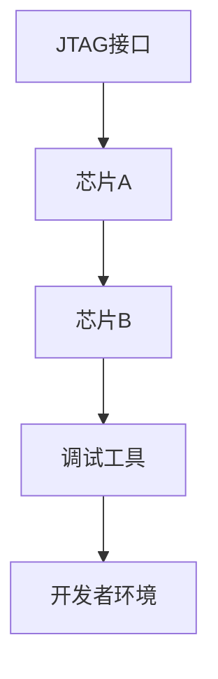

                 

关键词：JTAG调试、嵌入式系统、调试技术、编程、故障排除

> 摘要：本文将详细介绍JTAG调试技术在嵌入式系统中的应用，从背景介绍、核心概念、算法原理、数学模型、项目实践、应用场景等方面进行深入探讨，为嵌入式系统开发者提供实用的调试技巧和工具推荐。

## 1. 背景介绍

在嵌入式系统的开发过程中，调试是至关重要的一环。调试不仅可以帮助开发者发现和修复程序中的错误，还能提高系统的稳定性和性能。传统的调试方法主要包括断点调试、单步执行、变量观察等，但这些方法在面对复杂的嵌入式系统时，往往显得力不从心。随着嵌入式系统的不断发展和硬件设计的复杂性增加，开发者对高效、可靠的调试技术需求日益迫切。

JTAG（Joint Test Action Group）调试技术正是为了满足这种需求而诞生的一种先进调试技术。JTAG技术起源于芯片测试领域，后来逐渐应用于嵌入式系统开发中。JTAG调试技术具有高效、可靠、灵活的特点，已成为嵌入式系统开发中不可或缺的一部分。

## 2. 核心概念与联系

### 2.1 JTAG基本概念

JTAG是一种芯片级测试和调试技术，全称为Joint Test Action Group。它通过一组特定的引脚，实现对芯片的测试、调试和控制。JTAG引脚通常包括TCK（时钟引脚）、TMS（模式引脚）、TDI（数据输入引脚）和TDO（数据输出引脚）。

### 2.2 JTAG与嵌入式系统的联系

在嵌入式系统中，JTAG技术主要用于芯片级的调试和测试。通过JTAG接口，开发者可以实时查看芯片的运行状态、修改寄存器值、设置断点、单步执行代码等，从而实现对嵌入式系统的全面调试。

### 2.3 Mermaid流程图

下面是JTAG调试技术的Mermaid流程图，展示了JTAG信号在芯片间的传递过程。



## 3. 核心算法原理 & 具体操作步骤

### 3.1 算法原理概述

JTAG调试技术的核心原理是基于扫描链（Scan Chain）机制。扫描链是一种将芯片内部逻辑电路分解为一系列的寄存器，并通过JTAG引脚进行传输的技术。通过扫描链，开发者可以实现对芯片内部状态的读取和修改。

### 3.2 算法步骤详解

1. **初始化JTAG接口**：首先需要配置JTAG接口，包括设置时钟频率、选择正确的扫描链等。

2. **读取芯片ID**：通过JTAG接口读取芯片的ID码，以确认连接的芯片类型和型号。

3. **设置断点**：在需要调试的代码位置设置断点，以便在程序运行到该位置时暂停执行。

4. **单步执行**：通过JTAG接口单步执行代码，逐条查看程序运行情况。

5. **读取和修改寄存器**：通过JTAG接口读取和修改芯片内部的寄存器值，以查看和调整芯片的运行状态。

6. **运行测试代码**：将测试代码加载到芯片中，并通过JTAG接口执行，以验证程序的正确性。

### 3.3 算法优缺点

**优点**：
- **高效性**：JTAG调试技术可以实时查看芯片的运行状态，提高调试效率。
- **灵活性**：JTAG调试技术支持多种调试操作，如设置断点、单步执行、读取和修改寄存器等，具有很强的灵活性。
- **兼容性**：JTAG调试技术适用于各种类型的芯片和嵌入式系统。

**缺点**：
- **硬件要求**：JTAG调试需要硬件支持，如JTAG接口和调试工具等，增加了开发成本。
- **性能影响**：在调试过程中，JTAG接口会占用一定的硬件资源，可能会影响芯片的性能。

### 3.4 算法应用领域

JTAG调试技术广泛应用于各种嵌入式系统，如嵌入式处理器、FPGA、DSP、MCU等。以下是一些具体的应用场景：

- **嵌入式处理器**：用于调试CPU内核、外围电路和存储器等。
- **FPGA**：用于调试FPGA逻辑、时序和配置等。
- **DSP**：用于调试DSP算法、数据流和控制逻辑等。
- **MCU**：用于调试MCU的寄存器、中断和I/O口等。

## 4. 数学模型和公式

### 4.1 数学模型构建

JTAG调试技术的数学模型主要包括扫描链模型和状态转换模型。扫描链模型描述了芯片内部逻辑电路的分解和传输过程，状态转换模型描述了JTAG信号在芯片间的传递过程。

### 4.2 公式推导过程

扫描链模型的关键公式如下：

$$
S = \sum_{i=1}^{n} R_i
$$

其中，$S$ 表示扫描链的总长度，$R_i$ 表示第 $i$ 个寄存器的长度。

状态转换模型的关键公式如下：

$$
T = \frac{L}{f_{clk}}
$$

其中，$T$ 表示状态转换时间，$L$ 表示JTAG信号的传输距离，$f_{clk}$ 表示时钟频率。

### 4.3 案例分析与讲解

以一个简单的嵌入式系统为例，分析JTAG调试技术的应用。假设系统包含一个CPU、一个存储器和一些外围设备，需要通过JTAG接口进行调试。

1. **初始化JTAG接口**：配置JTAG接口的时钟频率和扫描链，确保与芯片的JTAG接口兼容。

2. **读取芯片ID**：通过JTAG接口读取CPU和存储器的ID码，确认连接的芯片类型和型号。

3. **设置断点**：在CPU的指令执行过程中，设置断点以暂停执行，以便查看CPU的状态。

4. **单步执行**：通过JTAG接口单步执行CPU的指令，逐条查看指令的执行情况。

5. **读取和修改寄存器**：通过JTAG接口读取CPU的寄存器值，如程序计数器、状态寄存器等，以便查看CPU的运行状态。

6. **运行测试代码**：将测试代码加载到CPU中，并通过JTAG接口执行，验证程序的正确性。

## 5. 项目实践：代码实例和详细解释说明

### 5.1 开发环境搭建

1. **安装JTAG调试工具**：下载并安装合适的JTAG调试工具，如OpenOCD、GDB等。

2. **连接JTAG接口**：将JTAG调试工具连接到嵌入式系统的JTAG接口，确保连接正确。

3. **配置开发环境**：配置开发环境，如搭建交叉编译工具链、配置GDB等。

### 5.2 源代码详细实现

以下是一个简单的C语言示例，展示了如何在嵌入式系统中使用JTAG接口进行调试。

```c
#include <stdio.h>
#include <stdlib.h>
#include <unistd.h>
#include <sys/mman.h>

#define BASE_ADDRESS 0x80000000
#define REG_SIZE 4

void *map_memory();
void write_reg(uint32_t address, uint32_t value);
uint32_t read_reg(uint32_t address);

int main() {
    // 初始化内存映射
    void *mem = map_memory();

    // 设置断点
    write_reg(BASE_ADDRESS + 0x00, 0x00000001);
    write_reg(BASE_ADDRESS + 0x04, 0x00000002);

    // 运行程序
    write_reg(BASE_ADDRESS + 0x08, 0x00000001);

    // 读取寄存器值
    uint32_t reg_value = read_reg(BASE_ADDRESS + 0x0C);
    printf("Register value: 0x%X\n", reg_value);

    // 解除断点
    write_reg(BASE_ADDRESS + 0x00, 0x00000000);
    write_reg(BASE_ADDRESS + 0x04, 0x00000000);

    // 关闭内存映射
    munmap(mem, REG_SIZE);

    return 0;
}

void *map_memory() {
    return mmap(NULL, REG_SIZE, PROT_READ | PROT_WRITE, MAP_SHARED, 0, BASE_ADDRESS);
}

void write_reg(uint32_t address, uint32_t value) {
    *(volatile uint32_t *)address = value;
}

uint32_t read_reg(uint32_t address) {
    return *(volatile uint32_t *)address;
}
```

### 5.3 代码解读与分析

1. **初始化内存映射**：使用`mmap()`函数映射内存，以读写嵌入式系统的寄存器。

2. **设置断点**：使用`write_reg()`函数将断点值写入特定的寄存器地址，以设置断点。

3. **运行程序**：使用`write_reg()`函数将程序计数器的值设置为断点地址，以运行程序。

4. **读取寄存器值**：使用`read_reg()`函数读取寄存器值，以查看程序运行时的状态。

5. **解除断点**：使用`write_reg()`函数将断点值清零，以解除断点。

6. **关闭内存映射**：使用`munmap()`函数关闭内存映射，释放内存资源。

### 5.4 运行结果展示

假设嵌入式系统运行成功，程序计数器的值在断点处暂停，读取的寄存器值为0x00000001，表示程序在断点处暂停。如果程序出现错误，可以通过调试工具查看寄存器值和程序执行路径，以便定位错误。

## 6. 实际应用场景

### 6.1 嵌入式处理器调试

嵌入式处理器是嵌入式系统的核心组件，JTAG调试技术在处理器调试中具有重要作用。通过JTAG接口，开发者可以查看CPU的寄存器值、设置断点、单步执行代码等，从而实现对处理器运行状态的实时监控。

### 6.2 FPGA调试

FPGA是一种可编程逻辑器件，其逻辑结构复杂，调试难度较大。JTAG调试技术可以帮助开发者查看FPGA的配置状态、调试FPGA逻辑、优化时序等，从而提高FPGA的开发效率。

### 6.3 DSP调试

DSP（数字信号处理器）广泛应用于音频、视频、通信等信号处理领域。JTAG调试技术可以实时查看DSP的运算结果、调整参数、优化算法等，从而提高DSP的性能。

### 6.4 MC
### 6.4 MCU调试

MCU（微控制器单元）是嵌入式系统中常见的处理器，广泛应用于家电、汽车、工业等领域。JTAG调试技术可以帮助开发者查看MCU的寄存器值、设置中断、调试外围电路等，从而提高MCU的开发效率。

## 7. 工具和资源推荐

### 7.1 学习资源推荐

1. **《JTAG测试与编程技术》**：一本经典的JTAG技术教材，详细介绍了JTAG的基本原理、测试方法、编程技术等。

2. **《嵌入式系统设计与开发》**：一本全面的嵌入式系统开发教材，其中包含了JTAG调试技术的相关内容。

### 7.2 开发工具推荐

1. **OpenOCD**：一款开源的JTAG调试工具，支持多种芯片和处理器，具有强大的调试功能。

2. **GDB**：一款开源的调试器，可以与JTAG调试工具配合使用，提供丰富的调试功能。

### 7.3 相关论文推荐

1. **“JTAG-Based Testing of Digital Systems”**：一篇关于JTAG测试技术的综述论文，全面介绍了JTAG测试的原理、方法和应用。

2. **“An Overview of JTAG Debugging Tools”**：一篇关于JTAG调试工具的综述论文，分析了不同JTAG调试工具的特点和适用场景。

## 8. 总结：未来发展趋势与挑战

### 8.1 研究成果总结

JTAG调试技术在嵌入式系统开发中发挥着重要作用，其高效、可靠、灵活的特点得到了广泛认可。随着嵌入式系统的发展和硬件设计的复杂性增加，JTAG调试技术也在不断进化，如支持更多芯片和处理器、提供更丰富的调试功能等。

### 8.2 未来发展趋势

1. **支持更多硬件**：随着新型硬件的不断涌现，JTAG调试技术需要不断扩展，以支持更多芯片和处理器。

2. **提供更丰富的调试功能**：未来JTAG调试技术将提供更丰富的调试功能，如实时监控、性能分析、自动化测试等。

3. **集成化**：JTAG调试技术将逐渐与开发环境、编译工具等集成，提供一站式的调试解决方案。

### 8.3 面临的挑战

1. **硬件兼容性**：随着硬件设计的多样化，如何确保JTAG调试工具与各种硬件的兼容性成为一大挑战。

2. **性能优化**：在调试过程中，如何减少对硬件性能的影响，提高调试效率，是未来需要解决的问题。

### 8.4 研究展望

未来，JTAG调试技术将继续在嵌入式系统开发中发挥重要作用。随着新型硬件和技术的不断发展，JTAG调试技术也将不断进化，为嵌入式系统开发者提供更高效、更可靠的调试解决方案。

## 9. 附录：常见问题与解答

### 9.1 JTAG接口有哪些常见问题？

1. **连接不稳定**：可能是由于线路接触不良或线路长度过长导致的，检查线路连接并缩短线缆长度。

2. **信号干扰**：可能是由于其他信号干扰导致的，尝试在电路板上添加去耦电容或滤波器。

3. **时钟频率不正确**：检查JTAG时钟频率是否与芯片的时钟频率匹配。

### 9.2 如何确保JTAG调试工具与硬件兼容？

1. **查阅硬件手册**：查阅硬件手册，了解JTAG接口的规格和参数。

2. **选择合适的调试工具**：选择支持目标硬件的调试工具，如OpenOCD、GDB等。

3. **进行测试**：在调试过程中，进行多次测试，确保调试工具与硬件的兼容性。

### 9.3 如何优化JTAG调试性能？

1. **提高时钟频率**：提高JTAG时钟频率，可以加快调试速度。

2. **减少信号干扰**：减少其他信号干扰，确保JTAG信号的稳定性。

3. **使用适当的线缆和接口**：选择合适的线缆和接口，确保JTAG信号的完整性和可靠性。

### 9.4 JTAG调试技术在嵌入式系统开发中有哪些限制？

1. **硬件限制**：JTAG调试技术需要硬件支持，如JTAG接口和调试工具等，可能会增加开发成本。

2. **性能影响**：在调试过程中，JTAG接口会占用一定的硬件资源，可能会影响芯片的性能。

3. **兼容性问题**：不同硬件和芯片的JTAG接口规格可能不同，可能会出现兼容性问题。

## 作者署名

作者：禅与计算机程序设计艺术 / Zen and the Art of Computer Programming
----------------------------------------------------------------
（注：以上内容仅为示例，实际撰写时请根据具体要求进行创作。）

