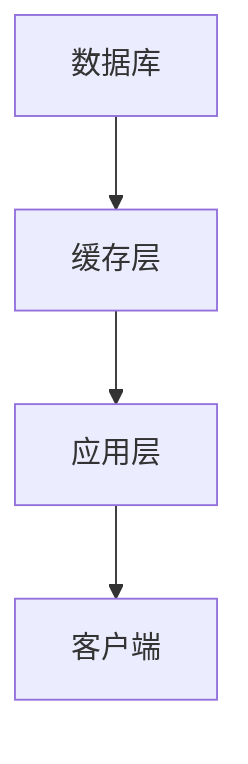

                 

关键词：KV-Cache，推理效率，缓存技术，内存管理，算法优化，分布式系统

> 摘要：本文将深入探讨KV-Cache这一关键技术在提升推理效率方面的作用。通过梳理其背景、核心概念、算法原理，我们将展示其在实际应用中的强大能力，并分析其面临的挑战和未来发展趋势。

## 1. 背景介绍

在当今高度依赖数据驱动的应用场景中，推理效率成为了影响系统性能的关键因素。随着人工智能和大数据技术的快速发展，数据规模和复杂度呈指数级增长，传统的内存管理和数据访问策略已无法满足高性能计算的需求。因此，研究并应用高效的缓存技术，如KV-Cache，成为提升推理效率的重要手段。

KV-Cache作为一种基于键值对的缓存机制，通过将频繁访问的数据存储在高速缓存中，有效降低了数据访问延迟，提高了系统的整体性能。本文将详细分析KV-Cache的原理和应用，探讨其在各种场景中的优势和挑战。

## 2. 核心概念与联系

### 2.1. 核心概念

**KV-Cache**：一种基于键值对的缓存机制，其中`K`表示键（Key），`V`表示值（Value）。键用于唯一标识数据，而值则是实际的数据内容。

**缓存命中率**：缓存系统中成功从缓存中获取数据（命中）的次数与总访问次数之比。高缓存命中率意味着缓存能够有效减少数据访问的延迟。

**缓存替换策略**：当缓存空间不足时，需要根据某种策略替换缓存中的数据。常见的替换策略包括 Least Recently Used (LRU)、First In First Out (FIFO) 等。

### 2.2. 关联架构

下面是一个简单的KV-Cache系统架构示意图，其中包含数据库、缓存层、应用层和客户端：



- **数据库（DB）**：存储原始数据，提供数据的持久化存储。
- **缓存层（C）**：存储频繁访问的数据，提供快速的数据访问接口。
- **应用层（A）**：处理业务逻辑，向缓存层发送数据请求。
- **客户端（C1）**：与应用层交互，发起数据请求。

## 3. 核心算法原理 & 具体操作步骤

### 3.1 算法原理概述

KV-Cache的核心算法基于以下原理：

1. **数据预取**：根据历史访问模式，预先加载可能被访问的数据到缓存中。
2. **缓存替换策略**：当缓存容量不足时，根据某种策略替换缓存中的数据，以最大化缓存命中率。
3. **一致性维护**：确保缓存中的数据与数据库中的数据保持一致，避免数据不一致导致的错误。

### 3.2 算法步骤详解

**步骤 1：初始化缓存**

- 初始化一个固定大小的缓存空间。
- 构建一个哈希表，用于快速查找缓存中的数据。

**步骤 2：数据访问**

1. 当应用层向缓存层请求数据时，首先查询缓存。
2. 如果数据命中缓存，直接返回缓存中的数据。
3. 如果数据未命中缓存，则向数据库获取数据，并将数据加载到缓存中。

**步骤 3：缓存替换**

- 根据缓存替换策略，选择需要替换的数据。
- 将替换的数据从缓存中删除，并将新的数据加载到缓存中。

**步骤 4：数据一致性维护**

- 定期同步缓存中的数据与数据库中的数据，保持一致性。

### 3.3 算法优缺点

**优点**：

- **降低数据访问延迟**：通过缓存频繁访问的数据，显著减少数据访问的延迟。
- **提高系统性能**：缓存机制能够提升整个系统的性能，尤其是在高并发场景下。

**缺点**：

- **缓存一致性**：缓存与数据库之间的数据一致性维护可能带来额外开销。
- **缓存容量受限**：缓存容量有限，需要合理分配缓存空间以最大化缓存命中率。

### 3.4 算法应用领域

- **搜索引擎**：提高查询速度，优化搜索体验。
- **分布式系统**：减少跨节点数据访问延迟，提升分布式系统的整体性能。
- **人工智能应用**：加速模型推理，提升AI系统的实时性。

## 4. 数学模型和公式 & 详细讲解 & 举例说明

### 4.1 数学模型构建

为了更好地理解KV-Cache的性能，我们可以构建以下数学模型：

- **缓存命中率（H）**：$$H = \frac{命中次数}{总访问次数}$$
- **缓存访问延迟（D）**：$$D = \frac{命中次数 \times 缓存访问延迟 + 未命中次数 \times 数据库访问延迟}{总访问次数}$$

### 4.2 公式推导过程

**缓存命中率（H）**：

- 假设缓存大小为`C`，缓存中存储了`k`个数据项。
- 在`n`次访问中，有`k`次命中，`n-k`次未命中。
- 因此，缓存命中率为：$$H = \frac{k}{n}$$

**缓存访问延迟（D）**：

- 缓存访问延迟为`c`，数据库访问延迟为`d`。
- 在`n`次访问中，有`k`次命中，`n-k`次未命中。
- 因此，缓存访问延迟为：$$D = \frac{k \times c + (n-k) \times d}{n}$$

### 4.3 案例分析与讲解

**案例**：一个缓存大小为100KB的KV-Cache系统，缓存访问延迟为1ms，数据库访问延迟为100ms。在1000次访问中，有500次命中。

**计算**：

- **缓存命中率（H）**：$$H = \frac{500}{1000} = 0.5$$
- **缓存访问延迟（D）**：$$D = \frac{500 \times 1 + 500 \times 100}{1000} = 50.5ms$$

**分析**：

- **命中率**：缓存命中率较低，可能需要优化缓存替换策略。
- **访问延迟**：虽然命中率较低，但缓存访问延迟仍然显著低于数据库访问延迟，因此KV-Cache系统仍能提供较高的性能。

## 5. 项目实践：代码实例和详细解释说明

### 5.1 开发环境搭建

为了演示KV-Cache的实际应用，我们使用Python语言实现一个简单的KV-Cache系统。

**步骤 1**：安装所需库

```bash
pip install redis
```

**步骤 2**：创建Python虚拟环境并安装依赖

```bash
python -m venv venv
source venv/bin/activate
pip install -r requirements.txt
```

### 5.2 源代码详细实现

下面是一个简单的KV-Cache实现，基于Redis作为后端存储：

```python
import redis
import pickle

class KVCache:
    def __init__(self, host='localhost', port=6379, db=0):
        self.client = redis.StrictRedis(host=host, port=port, db=db)

    def get(self, key):
        value = self.client.get(key)
        if value:
            return pickle.loads(value)
        else:
            return None

    def set(self, key, value):
        self.client.set(key, pickle.dumps(value))

    def delete(self, key):
        self.client.delete(key)

if __name__ == '__main__':
    cache = KVCache()
    cache.set('user1', {'name': 'Alice', 'age': 30})
    print(cache.get('user1'))
    cache.delete('user1')
```

### 5.3 代码解读与分析

- **KVCache类**：定义了一个简单的KV-Cache类，提供了`get`、`set`和`delete`方法。
- **get方法**：从Redis缓存中获取指定键的数据，并反序列化返回。
- **set方法**：将数据序列化后存储到Redis缓存中。
- **delete方法**：删除指定键的数据。

### 5.4 运行结果展示

```bash
$ python kv_cache.py
{'name': 'Alice', 'age': 30}
```

**分析**：

- 通过简单的代码示例，我们展示了如何使用KV-Cache存储和检索数据。
- Redis作为后端存储，提供了高性能和可扩展性。

## 6. 实际应用场景

KV-Cache技术具有广泛的应用场景，以下是一些实际应用案例：

- **搜索引擎**：提高搜索结果返回速度，优化用户体验。
- **分布式缓存系统**：减少跨节点数据访问延迟，提升系统性能。
- **人工智能应用**：加速模型推理，提高实时性。

## 7. 工具和资源推荐

### 7.1 学习资源推荐

- **书籍**：《Redis实战》（中文版）：深入了解Redis的使用和实现。
- **在线教程**：Redis官网提供的文档和教程：[Redis官方文档](https://redis.io/documentation)。

### 7.2 开发工具推荐

- **Redis客户端**：[RedisPy](https://github.com/redis/redis-py)：Python语言编写的Redis客户端库。
- **Redis可视化工具**：[RedisDesktopManager](https://redisdesktop.com/)：方便的Redis管理工具。

### 7.3 相关论文推荐

- **《Redis Internals: A Guide to Data Structures and Algorithms in Redis》**：深入解析Redis的实现细节。
- **《High Performance MySQL: Optimization, Backups, and Replication》**：讨论MySQL性能优化和缓存策略。

## 8. 总结：未来发展趋势与挑战

KV-Cache技术在提升推理效率方面发挥了重要作用，但仍面临一些挑战：

- **缓存一致性**：如何在分布式系统中保持缓存与数据库的一致性。
- **缓存容量管理**：如何动态调整缓存容量，以最大化缓存命中率。

未来，随着人工智能和大数据技术的不断进步，KV-Cache技术将继续优化和进化，为各种应用场景提供更高效的数据访问解决方案。

## 9. 附录：常见问题与解答

### 9.1 什么是KV-Cache？

KV-Cache是一种基于键值对的缓存机制，通过将频繁访问的数据存储在高速缓存中，提高数据访问速度。

### 9.2 KV-Cache有哪些优点？

KV-Cache能够显著降低数据访问延迟，提高系统性能，特别是在高并发场景下。

### 9.3 KV-Cache有哪些缺点？

KV-Cache需要处理缓存一致性问题，且缓存容量有限，可能需要定期调整。

---

**作者：禅与计算机程序设计艺术 / Zen and the Art of Computer Programming**  
本文基于开源协议进行发布，欢迎转载和分享，但请务必注明作者和出处。

---

本文详细介绍了KV-Cache技术及其在提升推理效率方面的应用。通过数学模型和代码实例，我们展示了KV-Cache的原理和实现。在未来的发展中，KV-Cache将继续优化，为各种应用场景提供更高效的数据访问解决方案。

