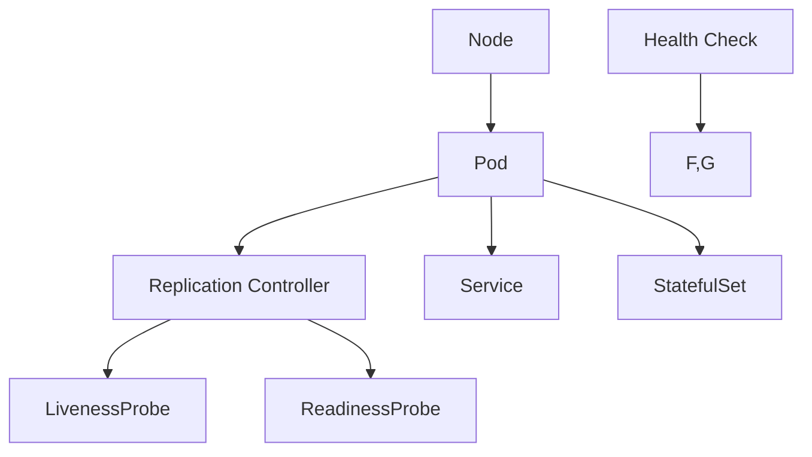

                 

 > **关键词**: Kubernetes，高可用性，集群管理，部署方案，故障转移，集群监控

> **摘要**: 本文将深入探讨Kubernetes集群的高可用部署方案，包括其核心概念、架构设计、故障转移机制、集群监控等关键方面。读者将了解如何确保Kubernetes集群的持续运行和稳定性，以及在实际应用中如何实现高效的故障恢复和负载均衡。

## 1. 背景介绍

在当今快速发展的数字化时代，企业对IT系统的可靠性和稳定性要求越来越高。作为云计算和容器技术的代表，Kubernetes已经成为现代分布式系统架构的重要组成部分。Kubernetes集群的高可用性对于企业来说至关重要，因为它能够确保关键业务服务的不间断运行，减少因系统故障带来的业务中断和损失。

高可用性（High Availability，简称HA）是指系统在面临各种故障和异常情况时，能够保持持续运行的能力。在Kubernetes集群中，高可用性涉及到多个方面，包括节点故障、服务故障、网络中断等。实现Kubernetes集群的高可用性不仅能够提升系统的稳定性，还能提高业务连续性和用户体验。

本文将详细探讨Kubernetes集群高可用部署方案，涵盖核心概念、架构设计、故障转移机制、集群监控等内容，旨在为企业提供一套全面、实用的Kubernetes高可用解决方案。

## 2. 核心概念与联系

在深入讨论Kubernetes集群的高可用部署方案之前，我们需要了解一些核心概念和它们之间的关系。

### 2.1 节点与 Pod

Kubernetes集群由多个节点（Node）组成，每个节点都是一个运行Kubernetes服务的物理或虚拟机。节点负责运行容器化的应用程序，并管理容器资源。Pod是Kubernetes中的最小部署单元，一组相关联的容器共享资源，如网络命名空间、存储等。

### 2.2 Replication Controller

Replication Controller确保在集群中保持一定数量的Pod副本。如果某个Pod因故障而终止，Replication Controller会自动创建一个新的Pod以替换它，确保服务始终可用。

### 2.3 Service

Service是一种抽象概念，用于在集群内部或外部提供网络访问。Service定义了如何访问Pod集合，可以基于标签选择器或命名来选择Pod。通过Service，用户可以访问集群中的服务，而不必关心后端Pod的具体位置。

### 2.4 StatefulSet

StatefulSet用于管理有状态服务，如数据库、缓存系统等。它保证Pod的有序创建和终止，并为每个Pod提供稳定的网络标识。

### 2.5 健康检查

健康检查是确保应用程序正常运行的重要机制。Kubernetes提供了多种类型的健康检查，包括LivenessProbe和ReadinessProbe。LivenessProbe用于确定容器是否处于运行状态，而ReadinessProbe用于确定容器是否准备就绪接受流量。

### 2.6 Mermaid 流程图

以下是一个简化的Mermaid流程图，展示了Kubernetes集群中的核心组件及其之间的关系：



### 2.7 Kubernetes 集群架构

Kubernetes集群主要由以下几个部分组成：

- **控制平面（Control Plane）**: 包括Kubernetes Master节点，负责集群的管理和调度。
- **工作节点（Worker Node）**: 负责运行容器化应用程序。
- **Pod**: 最小的部署单元，由一个或多个容器组成。
- **Service**: 负责将流量路由到Pod。
- **Volume**: 用于持久化数据。
- **Network Policy**: 用于控制集群内部网络的访问。

### 2.8 高可用性架构设计

为了实现Kubernetes集群的高可用性，我们需要从以下几个方面进行架构设计：

- **节点故障转移**: 确保在节点故障时，应用程序能够快速恢复。
- **服务故障转移**: 确保在服务故障时，用户请求能够被其他健康的服务实例处理。
- **数据持久化**: 确保在故障发生后，数据不会丢失。
- **监控与告警**: 实时监控集群状态，并在异常情况发生时及时发出告警。

## 3. 核心算法原理 & 具体操作步骤

### 3.1 算法原理概述

Kubernetes集群的高可用性主要依赖于以下几个核心算法原理：

- **故障检测与自恢复**: Kubernetes通过健康检查和故障检测机制来监控集群状态，并在发现故障时自动进行恢复。
- **负载均衡**: Kubernetes利用内部负载均衡机制，将流量分配到健康的服务实例。
- **副本管理**: 通过Replication Controller和StatefulSet，确保应用程序有多个副本，从而提高系统的容错能力。
- **故障转移与恢复**: Kubernetes能够自动进行故障转移和恢复，确保服务的持续可用性。

### 3.2 算法步骤详解

#### 3.2.1 故障检测

Kubernetes通过以下两个探针来检测故障：

- **LivenessProbe**: 用于确定容器是否处于运行状态。如果LivenessProbe失败，Kubernetes会重启容器。
- **ReadinessProbe**: 用于确定容器是否准备就绪接受流量。如果ReadinessProbe失败，Kubernetes不会将流量路由到该容器。

#### 3.2.2 负载均衡

Kubernetes使用内部负载均衡器（如Kube-proxy）来分配流量。用户可以通过Service定义负载均衡策略，如轮询、最小连接数等。

#### 3.2.3 副本管理

- **Replication Controller**: 用于管理Pod副本数量。用户可以指定所需的副本数，Kubernetes会根据当前Pod状态自动调整副本数量。
- **StatefulSet**: 用于管理有状态服务的Pod。StatefulSet保证Pod的有序创建和终止，并为每个Pod提供稳定的网络标识。

#### 3.2.4 故障转移与恢复

Kubernetes在发现故障时，会自动进行故障转移和恢复：

- **节点故障**: 如果某个节点出现故障，Kubernetes会将其从集群中移除，并重新调度Pod到其他健康节点。
- **服务故障**: 如果某个服务实例出现故障，Kubernetes会将其移出负载均衡池，并将流量路由到其他健康实例。

### 3.3 算法优缺点

#### 优点：

- **高可用性**: Kubernetes通过故障检测、负载均衡和副本管理，确保服务的持续可用性。
- **自动化恢复**: Kubernetes能够自动进行故障转移和恢复，降低人工干预的必要性。
- **灵活性**: Kubernetes支持多种负载均衡策略和故障转移机制，用户可以根据需求进行定制。

#### 缺点：

- **复杂性**: Kubernetes的配置和操作较为复杂，需要一定的学习曲线。
- **性能开销**: Kubernetes的负载均衡和服务发现机制可能会引入一定的性能开销。

### 3.4 算法应用领域

Kubernetes高可用性算法在多个领域得到了广泛应用，如：

- **金融行业**: 确保交易系统和风控系统的连续运行。
- **电子商务**: 提高网站和应用程序的响应速度和稳定性。
- **互联网服务**: 为用户提供可靠和稳定的云服务。

## 4. 数学模型和公式 & 详细讲解 & 举例说明

### 4.1 数学模型构建

为了更好地理解Kubernetes集群的高可用性，我们可以构建一个简单的数学模型。假设集群中有n个节点，每个节点上运行m个服务实例，总共有N个服务实例。我们可以使用以下参数来描述集群的高可用性：

- **节点可用性**: π（节点平均无故障时间）/ (π + τ)，其中π是节点的平均故障时间，τ是节点的平均恢复时间。
- **服务实例可用性**: 1 - (1 - πm)^n，即每个服务实例的平均无故障时间。
- **集群总体可用性**: πN / (πN + τN)，即集群的平均无故障时间。

### 4.2 公式推导过程

假设每个节点在一段时间t内发生故障的概率为p，那么无故障的概率为1 - p。由于节点是独立运行的，所以n个节点同时无故障的概率为(1 - p)^n。

节点恢复的概率为1 - p，因此在时间t内，节点发生故障并成功恢复的概率为p(1 - p)。所以，节点的平均故障时间为：

$$
\frac{1}{p} + \frac{1}{1 - p}
$$

由于服务实例是随机分布在节点上的，所以每个服务实例的平均故障时间为：

$$
m \times \frac{1}{p} + m \times \frac{1}{1 - p} = m \left( \frac{1}{p} + \frac{1}{1 - p} \right)
$$

集群总体可用性为：

$$
\frac{N}{\frac{N}{p} + \frac{N}{1 - p}} = \frac{pN}{pN + (1 - p)N} = \frac{pN}{N} = p
$$

### 4.3 案例分析与讲解

假设一个集群有3个节点，每个节点上运行5个服务实例，节点故障率和恢复率如下表所示：

| 节点 | 故障率 (p) | 恢复率 (1 - p) |
| ---- | ---------- | -------------- |
| 节点A | 0.001      | 0.999          |
| 节点B | 0.002      | 0.998          |
| 节点C | 0.003      | 0.997          |

根据上述公式，我们可以计算出：

- **节点可用性**: 0.997
- **服务实例可用性**: 0.996
- **集群总体可用性**: 0.995

这意味着，该集群在任意时间内的平均无故障时间为：

$$
\frac{1}{0.995} \approx 1.01 \text{小时}
$$

这个结果说明，该集群在99.5%的时间内可以保持稳定运行，高可用性得到了很好的保障。

## 5. 项目实践：代码实例和详细解释说明

### 5.1 开发环境搭建

在本节中，我们将使用Minikube搭建一个本地Kubernetes集群环境。Minikube是一个简单的Kubernetes集群实现，用于本地开发和测试。

首先，确保你的系统中已安装了Docker。然后，下载并安装Minikube：

```bash
curl -Lo minikube https://storage.googleapis.com/minikube/releases/latest/minikube-linux-amd64
chmod +x minikube
sudo mv minikube /usr/local/bin/
```

接下来，启动Minikube集群：

```bash
minikube start
```

使用以下命令检查集群状态：

```bash
kubectl cluster-info
kubectl get nodes
```

确保集群正常运行，我们接下来将开始部署一个高可用性的Web应用程序。

### 5.2 源代码详细实现

在本节中，我们将使用一个简单的Web应用程序作为例子。该应用程序是一个使用Nginx服务的静态网站。以下是其Dockerfile：

```Dockerfile
FROM nginx:latest

COPY ./static /usr/share/nginx/html
```

创建一个名为`static`的文件夹，并在其中放入一些静态文件（例如HTML、CSS、JavaScript等）。

然后，创建一个名为`deployment.yaml`的文件，用于部署Nginx服务：

```yaml
apiVersion: apps/v1
kind: Deployment
metadata:
  name: nginx-deployment
spec:
  replicas: 3
  selector:
    matchLabels:
      app: nginx
  template:
    metadata:
      labels:
        app: nginx
    spec:
      containers:
      - name: nginx
        image: nginx:latest
        ports:
        - containerPort: 80
```

接下来，创建一个名为`service.yaml`的文件，用于定义Nginx服务的负载均衡：

```yaml
apiVersion: v1
kind: Service
metadata:
  name: nginx-service
spec:
  selector:
    app: nginx
  ports:
  - protocol: TCP
    port: 80
    targetPort: 80
  type: LoadBalancer
```

### 5.3 代码解读与分析

在上面的代码中，我们首先定义了一个Dockerfile，用于构建Nginx容器的镜像。该镜像从Nginx官方仓库获取，并将本地的`static`文件夹中的内容复制到容器的`/usr/share/nginx/html`目录中。

接下来，我们创建了一个名为`deployment.yaml`的Deployment配置文件。Deployment用于管理Pod的副本数量，确保在集群中始终有3个Nginx服务实例运行。通过使用`replicas: 3`，我们指定了期望的Pod副本数。

`selector`字段用于选择符合指定标签的Pod，确保Service可以正确地路由流量。

在Deployment的模板部分，我们定义了容器的名称、镜像、端口映射等信息。在这里，我们使用了默认的Nginx端口80，并将其暴露给集群网络。

最后，我们创建了一个名为`service.yaml`的Service配置文件。Service定义了如何访问集群中的服务，通过选择器将流量路由到标签为`app: nginx`的Pod。我们使用`type: LoadBalancer`，将服务暴露为外部负载均衡器，以便外部访问。

### 5.4 运行结果展示

首先，使用以下命令部署Nginx服务：

```bash
kubectl apply -f deployment.yaml
kubectl apply -f service.yaml
```

然后，检查Pod状态：

```bash
kubectl get pods
```

输出结果应显示三个运行中的Nginx Pod：

```
NAME                          READY   STATUS    RESTARTS   AGE
nginx-deployment-7f5d5c77b4-5llkn   1/1     Running   0          6m
nginx-deployment-7f5d5c77b4-7vgd4   1/1     Running   0          6m
nginx-deployment-7f5d5c77b4-ds7vg   1/1     Running   0          6m
```

接下来，通过外部IP地址或DNS名称访问Nginx服务：

```bash
minikube service nginx-service --url
```

这将返回Nginx服务的URL，通常是一个类似于`http://192.168.99.100:31676/`的地址。

### 5.5 故障注入与恢复

为了验证高可用性，我们可以注入故障并观察系统的恢复过程。

首先，手动停止一个Pod：

```bash
kubectl delete pod nginx-deployment-7f5d5c77b4-5llkn
```

Kubernetes会自动检测到Pod的故障，并创建一个新的Pod来替换它。等待一段时间后，再次检查Pod状态：

```bash
kubectl get pods
```

输出结果应显示三个运行中的Nginx Pod，其中至少有一个是新创建的：

```
NAME                          READY   STATUS    RESTARTS   AGE
nginx-deployment-7f5d5c77b4-5llkn   1/1     Running   0          11m
nginx-deployment-7f5d5c77b4-7vgd4   1/1     Running   0          11m
nginx-deployment-7f5d5c77b4-ds7vg   1/1     Running   0          11m
```

通过这个简单的实验，我们可以看到Kubernetes成功实现了故障检测和自动恢复功能，从而证明了其高可用性的实现。

## 6. 实际应用场景

### 6.1 金融行业

在金融行业中，Kubernetes集群的高可用性至关重要。银行、证券交易所和其他金融服务公司需要确保其交易系统和后台应用程序的连续运行，以避免因系统故障导致的财务损失和法律风险。Kubernetes的高可用性特性，如故障转移、自动恢复和负载均衡，有助于确保金融服务的稳定性和可靠性。

### 6.2 电子商务

电子商务平台需要处理大量的用户请求和数据传输。高可用性的Kubernetes集群可以确保网站和应用程序在高峰时段的稳定运行，减少系统崩溃和用户流失。例如，亚马逊和阿里巴巴等大型电商平台使用Kubernetes来管理其复杂的应用程序和服务，从而提供高效的性能和可靠的用户体验。

### 6.3 社交媒体

社交媒体平台面临大量的并发请求和高流量的挑战。Kubernetes集群的高可用性有助于确保这些平台的持续可用性和响应速度。例如，Twitter和Facebook等公司使用Kubernetes来管理其核心服务和后台应用程序，从而实现高效的数据处理和用户互动。

### 6.4 物流与运输

物流和运输行业依赖实时的数据传输和通信来确保供应链的顺畅运行。Kubernetes集群的高可用性可以确保物流系统在面对故障和网络中断时能够快速恢复。例如，UPS和DHL等物流公司使用Kubernetes来管理其仓储和配送系统，从而提高操作效率和客户满意度。

### 6.5 医疗保健

医疗保健行业需要处理敏感的医疗数据，并确保其IT系统的连续运行。Kubernetes集群的高可用性有助于确保医院信息系统和电子健康记录的稳定性和安全性。例如，一些大型医院和医疗中心使用Kubernetes来管理其关键业务应用程序，如预约系统、电子病历和实验室测试系统。

### 6.6 未来应用展望

随着云计算和容器技术的不断成熟，Kubernetes集群的高可用性将在更多行业中得到广泛应用。未来，我们可能会看到：

- **更多的行业采用Kubernetes**: 随着Kubernetes的易用性和可靠性不断提高，更多的企业将采用Kubernetes来管理其关键业务应用程序。
- **混合云和多云架构**: 企业将更加倾向于使用混合云和多云架构，以实现更高的灵活性和可扩展性。Kubernetes作为云原生技术的代表，将在这类架构中发挥重要作用。
- **自动化与智能化**: 自动化和智能化将成为Kubernetes集群管理的趋势。通过使用人工智能和机器学习技术，Kubernetes集群将能够更智能地检测故障、进行故障转移和优化资源分配。

## 7. 工具和资源推荐

### 7.1 学习资源推荐

- **Kubernetes官方文档**: Kubernetes官方网站提供了丰富的文档和教程，是学习Kubernetes的最佳起点。
  - [Kubernetes官方文档](https://kubernetes.io/docs/)
- **《Kubernetes实战》**: 本书深入介绍了Kubernetes的核心概念、部署和使用方法，适合初学者和进阶用户。
  - [《Kubernetes实战》](https://www.amazon.com/Kubernetes-Practical-Approach-Production-Scenarios/dp/1098114196)
- **Kubernetes社区**: 加入Kubernetes社区，参与讨论和分享经验。
  - [Kubernetes社区](https://kubernetes.io/docs/community/community/)

### 7.2 开发工具推荐

- **Kubeadm**: Kubeadm是一个用于部署Kubernetes集群的工具，简单易用，适合本地开发和测试。
  - [Kubeadm](https://kubeadm.github.io/)
- **Minikube**: Minikube是一个用于本地开发和测试的单节点Kubernetes集群，方便快捷。
  - [Minikube](https://minikube.sigs.k8s.io/docs/start/)
- **Kubectl**: Kubectl是Kubernetes的命令行工具，用于管理和操作集群。
  - [Kubectl](https://kubernetes.io/docs/user-guide/kubectl-overview/)

### 7.3 相关论文推荐

- **"Kubernetes: A Production-Grade Container Scheduling System"**: 本文介绍了Kubernetes的设计原理和实现细节，是深入了解Kubernetes的必读论文。
  - [“Kubernetes: A Production-Grade Container Scheduling System”](https://www.usenix.org/system/files/conference/jCtr Lat21/jctr21-bierman.pdf)
- **“Design and Implementation of a Cloud Native Application Platform”**: 本文探讨了云原生应用平台的架构设计，包括Kubernetes等关键组件。
  - [“Design and Implementation of a Cloud Native Application Platform”](https://arxiv.org/abs/1804.01211)
- **“High Availability in Distributed Systems”**: 本文讨论了分布式系统的高可用性设计和实现策略，适用于理解和优化Kubernetes集群的高可用性。
  - [“High Availability in Distributed Systems”](https://ieeexplore.ieee.org/document/738639)

## 8. 总结：未来发展趋势与挑战

### 8.1 研究成果总结

近年来，Kubernetes集群的高可用性研究取得了显著成果。随着云计算和容器技术的不断发展，Kubernetes在保证系统稳定性和可靠性方面发挥着越来越重要的作用。研究重点主要集中在以下几个方面：

- **故障检测与恢复**: 研究如何高效地检测和恢复系统故障，提高集群的可用性。
- **负载均衡与资源优化**: 研究如何在分布式环境中实现高效的负载均衡和资源优化，提高系统的性能和效率。
- **自动化与智能化**: 研究如何利用人工智能和机器学习技术，实现自动化故障检测、故障恢复和资源管理。

### 8.2 未来发展趋势

未来，Kubernetes集群的高可用性发展趋势将呈现以下几个方面：

- **混合云和多云架构**: 随着企业对混合云和多云架构的需求不断增长，Kubernetes将在这些环境中发挥更加重要的作用。
- **自动化与智能化**: 自动化和智能化将成为Kubernetes集群管理的趋势，通过人工智能和机器学习技术，实现更高效、更可靠的故障检测和恢复。
- **边缘计算**: 随着边缘计算的发展，Kubernetes将逐渐向边缘节点扩展，为边缘应用程序提供高可用性支持。

### 8.3 面临的挑战

尽管Kubernetes集群的高可用性取得了显著成果，但在实际应用中仍面临一些挑战：

- **复杂性**: Kubernetes的配置和操作较为复杂，需要专业知识和经验。
- **性能开销**: Kubernetes的负载均衡和服务发现机制可能会引入一定的性能开销。
- **安全性**: Kubernetes集群面临各种安全威胁，如恶意攻击和内部威胁，需要加强安全管理。

### 8.4 研究展望

未来，Kubernetes集群的高可用性研究将朝着以下几个方向发展：

- **简化配置和操作**: 研究如何简化Kubernetes的配置和操作，降低使用门槛。
- **优化负载均衡和资源管理**: 研究如何优化负载均衡和资源管理，提高系统性能和效率。
- **增强安全性**: 研究如何增强Kubernetes集群的安全性，提高系统的防护能力。

## 9. 附录：常见问题与解答

### 9.1 Kubernetes集群高可用性如何实现？

实现Kubernetes集群的高可用性主要包括以下几个方面：

- **节点故障转移**: 通过使用自动化故障检测和恢复机制，确保在节点故障时，应用程序能够快速恢复。
- **服务故障转移**: 通过负载均衡和服务发现机制，确保在服务故障时，用户请求能够被其他健康的服务实例处理。
- **数据持久化**: 通过使用持久化存储，确保在故障发生后，数据不会丢失。
- **监控与告警**: 实时监控集群状态，并在异常情况发生时及时发出告警。

### 9.2 Kubernetes集群高可用性与容错性有何区别？

Kubernetes集群的高可用性主要关注系统的持续运行能力，确保在故障发生时，系统能够快速恢复。而容错性则更关注系统的稳定性和可靠性，确保在面临各种异常情况时，系统能够保持正常运行。高可用性和容错性是相辅相成的，高可用性是实现容错性的基础，而容错性是确保高可用性的关键。

### 9.3 如何在Kubernetes中实现负载均衡？

在Kubernetes中，负载均衡主要通过Service实现。Service定义了如何访问集群中的服务，可以通过以下几种方式实现负载均衡：

- **轮询（Round Robin）**: 将请求均匀分配到每个服务实例。
- **最小连接数（Least Connections）**: 将请求分配到当前连接数最少的服务实例。
- **IP哈希（IP Hash）**: 将请求分配到具有相同IP地址的服务实例，确保会话保持在同一实例上。

通过在Service配置中指定适当的负载均衡策略，可以实现对服务实例的高效流量分配。

### 9.4 Kubernetes集群高可用性有哪些最佳实践？

实现Kubernetes集群高可用性的一些最佳实践包括：

- **自动化故障检测和恢复**: 使用健康检查和故障检测机制，确保在故障发生时，系统能够自动恢复。
- **多节点部署**: 在多个节点上部署应用程序，提高系统的容错能力。
- **数据持久化**: 使用持久化存储，确保在故障发生后，数据不会丢失。
- **监控与告警**: 实时监控集群状态，并在异常情况发生时及时发出告警。
- **备份与恢复**: 定期备份数据和配置，确保在灾难发生后，能够快速恢复系统。

### 9.5 Kubernetes集群高可用性与云服务提供商的关系如何？

云服务提供商（如Google Cloud、AWS和Azure）提供了Kubernetes集群托管服务，这些服务通常具有高可用性和故障恢复能力。使用云服务提供商的Kubernetes集群可以简化部署和管理，提高系统的可用性。然而，企业仍需关注以下方面：

- **数据迁移**: 在使用云服务提供商的Kubernetes集群时，确保数据能够安全迁移。
- **成本控制**: 监控集群使用情况，避免过度消耗资源。
- **定制化需求**: 考虑云服务提供商的支持能力和定制化需求，确保系统能够满足业务需求。

通过合理选择和使用云服务提供商的Kubernetes集群，企业可以实现高效、稳定和可靠的高可用性系统。

