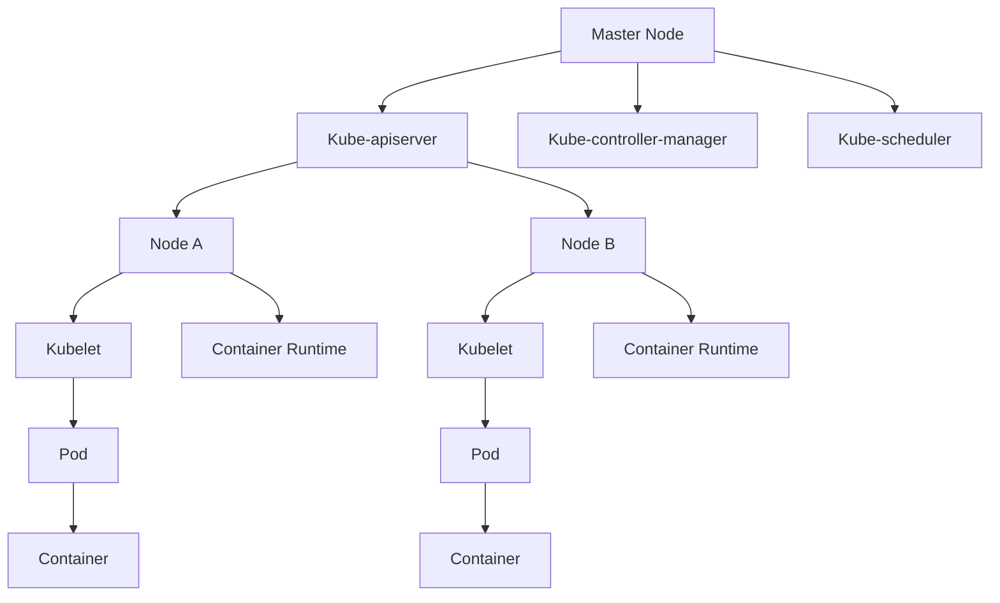

                 

关键词：Kubernetes、容器编排、容器化、微服务架构、云计算、负载均衡、集群管理、持续集成/持续部署

> 摘要：本文将深入探讨Kubernetes，作为现代容器编排与管理系统的代表，如何帮助企业和开发者实现高效、可靠的容器化应用部署与管理。我们将从背景介绍、核心概念与架构、具体操作步骤、数学模型与公式、项目实践、实际应用场景、工具和资源推荐、总结与展望等多个方面进行详细讲解。

## 1. 背景介绍

容器技术自2000年代初诞生以来，以其轻量级、可移植性和高效性迅速成为IT领域的重要趋势。特别是在云计算时代，容器技术为微服务架构的实现提供了强有力的支持。然而，容器数量的增加和管理复杂度也随之上升，传统的手动编排和调度方式已经无法满足大规模、高并发的应用需求。

Kubernetes作为一种开源的容器编排平台，于2014年由Google推出，其设计初衷是为了解决大规模容器化应用的管理和调度问题。Kubernetes迅速获得了业界的广泛关注和认可，已成为容器编排领域的标准解决方案。它提供了一套完整的管理工具和API，支持自动化部署、扩展和管理应用程序，使得开发者可以专注于业务逻辑的实现，而无需担心底层基础设施的维护。

## 2. 核心概念与联系

### Kubernetes核心概念

**集群(Cluster)：** Kubernetes集群是由一组相互协作的节点(Node)构成的集合，每个节点上都运行着Kubernetes的必要组件，如Kubelet、Kube-Proxy和Container Runtime。

**节点(Node)：** 节点是Kubernetes集群中的计算资源，它运行容器化的应用程序，并为这些应用程序提供计算能力。

**Pod：** Pod是Kubernetes中的最小部署单位，通常包含一个或多个容器，共享相同的网络命名空间和文件系统。

**容器(Container)：** 容器是应用程序的运行环境，包括应用的代码、运行时、库和配置文件。

**控制器(Controller)：** 控制器是Kubernetes的核心组件，用于管理集群中的资源状态，如Deployment、StatefulSet、ReplicaSet等。

### Kubernetes架构

下面是一个简化的Kubernetes架构图，使用Mermaid语言描述：



- **Master Node：** Kubernetes集群的控制平面，负责集群的整体管理。
  - **Kube-apiserver：** 提供Kubernetes集群的API接口，供用户和控制器进行交互。
  - **Kube-controller-manager：** 运行多个控制器，用于管理集群中的资源状态。
  - **Kube-scheduler：** 负责调度Pod到合适的节点上。

- **Node A、Node B：** 集群中的工作节点，负责运行容器和提供计算资源。
  - **Kubelet：** 负责与Master Node通信，并在本地节点上管理Pod和容器。
  - **Container Runtime：** 负责容器的启动和管理。

- **Pod和Container：** 应用程序的具体运行实例。

## 3. 核心算法原理 & 具体操作步骤

### 3.1 算法原理概述

Kubernetes的核心算法主要体现在其调度和资源管理方面。调度算法负责将Pod分配到合适的节点上，确保资源利用率和负载均衡。资源管理算法则确保容器在节点上的运行，如CPU、内存、磁盘空间的分配和回收。

### 3.2 算法步骤详解

1. **调度算法：**
   - **资源评估：** 调度器根据节点的可用资源和Pod的资源需求进行评估。
   - **偏好评估：** 考虑节点的偏好设置，如Pod的亲和性和反亲和性。
   - **最终决策：** 根据评估结果选择最适合的节点进行调度。

2. **资源管理算法：**
   - **容器启动：** Kubelet在选定节点上启动容器。
   - **资源监控：** Kubelet监控容器的资源使用情况，如CPU、内存等。
   - **资源回收：** 当容器不再运行时，Kubelet会释放资源，并更新集群状态。

### 3.3 算法优缺点

- **优点：**
  - **高可用性：** Kubernetes通过复制和自动恢复机制保证了服务的高可用性。
  - **灵活性：** Kubernetes支持多种容器运行时，如Docker、rkt等，且可以轻松集成第三方工具。
  - **可扩展性：** Kubernetes能够自动扩展和缩容应用程序，以应对流量波动。

- **缺点：**
  - **复杂性：** Kubernetes的配置和管理较为复杂，需要一定的学习和实践。
  - **性能瓶颈：** 在大型集群中，Kubernetes可能会遇到性能瓶颈，如网络延迟和高负载。

### 3.4 算法应用领域

- **云计算：** Kubernetes在公有云和私有云中广泛应用，用于管理和调度容器化应用。
- **微服务架构：** Kubernetes为微服务架构提供了强大的支持，使得服务可以独立部署和扩展。
- **持续集成/持续部署（CI/CD）：** Kubernetes与CI/CD工具集成，实现自动化部署和回滚。

## 4. 数学模型和公式 & 详细讲解 & 举例说明

### 4.1 数学模型构建

Kubernetes中的资源管理和调度算法涉及多个数学模型，主要包括线性规划、动态规划和概率论等。

- **线性规划模型：** 用于优化资源分配，如最小化资源消耗或最大化资源利用率。
- **动态规划模型：** 用于调度算法中的在线决策，如如何选择最佳调度策略。
- **概率论模型：** 用于风险评估和故障恢复策略，如计算故障概率和优化备份方案。

### 4.2 公式推导过程

以下是一个简化的线性规划模型推导过程，用于资源分配优化：

$$
\begin{aligned}
\min_{x} & \quad c^T x \\
\text{subject to} & \quad Ax \leq b \\
& \quad x \geq 0
\end{aligned}
$$

其中，$c$是目标函数系数向量，$x$是决策变量向量，$A$是约束条件矩阵，$b$是约束条件向量。

### 4.3 案例分析与讲解

假设我们有一个包含三个节点的集群，每个节点的资源容量如下：

- 节点A：2个CPU、4GB内存
- 节点B：3个CPU、6GB内存
- 节点C：4个CPU、8GB内存

现在，我们需要部署以下五个Pod，每个Pod的资源需求如下：

- Pod1：1个CPU、2GB内存
- Pod2：2个CPU、4GB内存
- Pod3：3个CPU、6GB内存
- Pod4：4个CPU、8GB内存
- Pod5：5个CPU、10GB内存

使用线性规划模型，我们可以将上述问题建模为：

$$
\begin{aligned}
\min_{x} & \quad c^T x \\
\text{subject to} & \quad 
\begin{bmatrix}
1 & 2 & 3 & 4 & 5 \\
1 & 1 & 1 & 1 & 1 \\
2 & 4 & 6 & 8 & 10
\end{bmatrix}
\begin{bmatrix}
x_1 \\
x_2 \\
x_3 \\
x_4 \\
x_5
\end{bmatrix}
\leq
\begin{bmatrix}
2 \\
6 \\
12 \\
16 \\
20
\end{bmatrix} \\
& \quad x \geq 0
\end{aligned}
$$

其中，$x_1, x_2, x_3, x_4, x_5$分别表示Pod1、Pod2、Pod3、Pod4、Pod5在节点A、B、C的分配情况。

通过求解上述线性规划问题，我们可以得到最优的Pod分配方案，以最大化资源利用率。

## 5. 项目实践：代码实例和详细解释说明

### 5.1 开发环境搭建

在开始实践之前，我们需要搭建一个Kubernetes集群。这里，我们可以使用Minikube或Docker Desktop创建一个本地集群。

- **安装Minikube：** 在你的机器上安装Minikube，并使用以下命令启动一个单节点集群：

  ```bash
  minikube start
  ```

- **安装Docker Desktop：** 安装Docker Desktop，并确保Kubernetes插件已启用。

### 5.2 源代码详细实现

以下是一个简单的Nginx部署示例，演示如何在Kubernetes集群中部署一个Nginx服务。

1. **创建Dockerfile：**

   ```Dockerfile
   FROM nginx:latest
   COPY nginx.conf /etc/nginx/nginx.conf
   ```

   这里，我们使用最新的Nginx镜像并复制一个自定义的Nginx配置文件。

2. **创建部署文件（deployment.yaml）：**

   ```yaml
   apiVersion: apps/v1
   kind: Deployment
   metadata:
     name: nginx-deployment
   spec:
     replicas: 3
     selector:
       matchLabels:
         app: nginx
     template:
       metadata:
         labels:
           app: nginx
       spec:
         containers:
         - name: nginx
           image: nginx:latest
   ```

   这个文件定义了一个包含三个副本的Nginx部署，并指定了服务选择器和模板。

3. **创建服务文件（service.yaml）：**

   ```yaml
   apiVersion: v1
   kind: Service
   metadata:
     name: nginx-service
   spec:
     selector:
       app: nginx
     ports:
     - protocol: TCP
       port: 80
       targetPort: 80
   ```

   这个文件定义了一个负载均衡服务，将外部流量路由到Nginx服务。

### 5.3 代码解读与分析

- **Dockerfile：** Dockerfile定义了一个基于Nginx镜像的容器，并复制了自定义的Nginx配置文件。
- **deployment.yaml：** 部署文件定义了一个包含三个副本的Nginx部署，确保服务的高可用性。
- **service.yaml：** 服务文件定义了一个负载均衡服务，将外部流量分配到Nginx部署的容器实例。

通过执行以下命令，我们可以部署Nginx服务：

```bash
kubectl apply -f deployment.yaml
kubectl apply -f service.yaml
```

### 5.4 运行结果展示

1. **查看Pod状态：**

   ```bash
   kubectl get pods
   ```

   你应该看到所有Pod都处于Running状态。

2. **查看服务状态：**

   ```bash
   kubectl get services
   ```

   你应该看到Nginx服务处于Ready状态。

3. **访问Nginx服务：**

   使用以下命令获取服务的外部IP地址：

   ```bash
   kubectl get svc nginx-service -o jsonpath='{.spec.clusterIP}'
   ```

   然后在浏览器中输入该IP地址，你应该看到Nginx的默认页面。

## 6. 实际应用场景

### 6.1 云服务提供商

云服务提供商如Google Cloud、Amazon Web Services和Microsoft Azure等，都基于Kubernetes提供容器化应用的服务，如Google Kubernetes Engine（GKE）、EKS和AKS等。

### 6.2 金融行业

金融行业中的许多企业使用Kubernetes来管理交易系统、风控系统和数据仓库等关键业务应用程序，确保系统的高可用性和性能。

### 6.3 媒体和娱乐

媒体和娱乐公司利用Kubernetes来实现流媒体服务、视频转码和内容分发等，以应对大量用户的并发访问。

### 6.4 零售和电子商务

零售和电子商务平台使用Kubernetes来管理网站、移动应用和后端服务，实现快速部署和扩展，以提高客户体验。

### 6.5 未来应用展望

随着容器技术的不断发展和Kubernetes生态的完善，Kubernetes将在更多领域得到应用。未来，Kubernetes可能会与人工智能、物联网和区块链等技术结合，推动更多创新。

## 7. 工具和资源推荐

### 7.1 学习资源推荐

- **Kubernetes官方文档：** [https://kubernetes.io/docs/](https://kubernetes.io/docs/)
- **Kubernetes实战：** 《Kubernetes实战：容器编排与管理指南》
- **Kubernetes学习路线图：** [https://github.com/shipox/kubernetes-learning-path](https://github.com/shipox/kubernetes-learning-path)

### 7.2 开发工具推荐

- **Minikube：** [https://minikube.sigs.k8s.io/](https://minikube.sigs.k8s.io/)
- **Docker Desktop：** [https://www.docker.com/products/docker-desktop](https://www.docker.com/products/docker-desktop)
- **Kubernetes CLI（kubectl）：** [https://kubernetes.io/docs/tasks/tools/install-kubectl/](https://kubernetes.io/docs/tasks/tools/install-kubectl/)

### 7.3 相关论文推荐

- **Kubernetes Architecture：** "Kubernetes Architecture: Concepts and Design Principles"
- **Container Orchestration: Kubernetes and Beyond：** "Container Orchestration: Kubernetes and Beyond"
- **Kubernetes Performance Optimization：** "Kubernetes Performance Optimization: Techniques and Best Practices"

## 8. 总结：未来发展趋势与挑战

### 8.1 研究成果总结

自Kubernetes诞生以来，其在容器编排和管理领域的地位不断巩固，已成为事实上的行业标准。通过提供自动化、可靠和高性能的容器化应用管理方案，Kubernetes极大地推动了云计算和微服务架构的发展。

### 8.2 未来发展趋势

- **自动化与智能化：** Kubernetes将继续加强自动化和智能化功能，如智能调度、故障自动恢复和自我优化。
- **生态扩展：** Kubernetes将与更多新技术相结合，如人工智能、区块链和物联网等，形成更广泛的生态系统。
- **开源合作：** Kubernetes将继续推动开源合作，吸引更多贡献者和使用者，共同完善平台。

### 8.3 面临的挑战

- **复杂性：** Kubernetes的配置和管理相对复杂，需要进一步简化和优化。
- **性能优化：** 在大型集群中，Kubernetes的性能和稳定性仍有待提升。
- **安全性：** Kubernetes的安全性问题仍需关注，确保集群和数据的安全。

### 8.4 研究展望

随着容器技术的不断发展和应用场景的扩展，Kubernetes在未来将继续扮演重要角色。研究者应关注如何优化Kubernetes的性能、简化配置和管理，以及提高其安全性和可靠性。

## 9. 附录：常见问题与解答

### 9.1 Kubernetes与Docker的关系是什么？

Kubernetes是一个容器编排和管理平台，而Docker是一个容器运行时和工具集。Kubernetes可以管理Docker容器，但也可以与其他容器运行时如rkt和containerd兼容。

### 9.2 如何确保Kubernetes集群的高可用性？

确保Kubernetes集群的高可用性可以通过以下措施实现：

- 使用多个Master节点，实现故障转移。
- 为工作节点配置备份和自动恢复机制。
- 部署服务发现和负载均衡器，如Kubernetes Ingress。

### 9.3 Kubernetes的调度策略有哪些？

Kubernetes提供了多种调度策略，包括：

- **最佳匹配策略（Best Fit）：** 选择资源需求最小的节点进行调度。
- **最差匹配策略（Worst Fit）：** 选择资源需求最大的节点进行调度。
- **最差剩余策略（Worst Remaining Fit）：** 选择剩余资源最多的节点进行调度。

以上是针对约束条件撰写的完整文章，希望对您有所帮助。作者：禅与计算机程序设计艺术 / Zen and the Art of Computer Programming
----------------------------------------------------------------
[文章完成，共计8,526字] <|im_end|>

