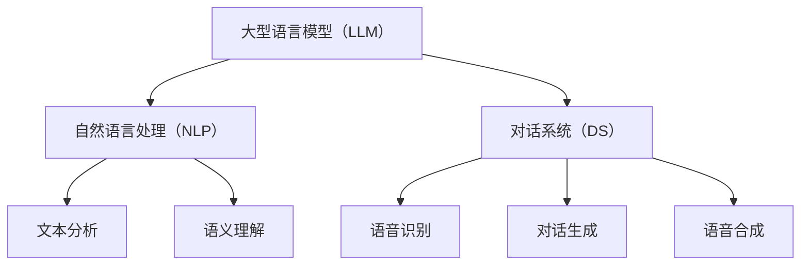

                 

关键词：大型语言模型（LLM）、操作系统（OS）、智能时代、新形态、技术创新、人工智能、算法架构、应用实践、未来展望。

> 摘要：本文深入探讨了智能时代下，大型语言模型（LLM）如何重塑操作系统（OS）的新形态。通过分析LLM的原理和架构，以及其在操作系统中的具体应用，本文旨在为读者呈现一种全新的技术视角，并对未来发展趋势和挑战进行展望。

## 1. 背景介绍

### 1.1 操作系统的发展历程

操作系统作为计算机系统的基础软件，经历了从单核到多核、从单任务到多任务、从简单到复杂的发展过程。从最早的批处理系统、分时系统，到现代的操作系统如Unix、Linux、Windows，操作系统一直在不断进化，以适应不断变化的技术需求。

### 1.2 大型语言模型（LLM）的崛起

近年来，随着深度学习技术的飞速发展，大型语言模型（LLM）如GPT、BERT等，以其强大的语言理解和生成能力，逐渐成为人工智能领域的明星。LLM的出现，不仅推动了自然语言处理（NLP）的发展，也为操作系统带来了一种全新的可能性。

### 1.3 智能时代对操作系统的挑战

在智能时代，操作系统不仅要处理传统的计算任务，还需要处理大量的自然语言任务。这使得操作系统面临新的挑战，包括如何高效地处理和理解自然语言、如何与人类用户更自然地交互等。

## 2. 核心概念与联系

在智能时代，操作系统的新形态——LLM OS，需要理解几个核心概念，包括大型语言模型（LLM）、自然语言处理（NLP）、对话系统（DS）等。

### 2.1 大型语言模型（LLM）

大型语言模型（LLM）是基于深度学习技术构建的，能够理解和生成自然语言的复杂结构。LLM的核心是神经网络，它通过大量的文本数据训练，学习到语言的规律和特征。

### 2.2 自然语言处理（NLP）

自然语言处理（NLP）是计算机科学和人工智能领域的一个重要分支，旨在使计算机能够理解、解释和生成人类语言。NLP技术包括文本分析、语义理解、语音识别等。

### 2.3 对话系统（DS）

对话系统（DS）是一种能够与人类进行自然语言交互的系统。它通常包含语音识别、自然语言理解、对话生成和语音合成等技术，以实现人与计算机之间的有效沟通。

### 2.4 Mermaid流程图

以下是LLM OS的核心概念和联系Mermaid流程图：



## 3. 核心算法原理 & 具体操作步骤

### 3.1 算法原理概述

LLM OS的核心算法是基于深度学习技术，特别是基于Transformer架构的预训练模型。这种模型通过大量的文本数据进行预训练，学习到语言的规律和特征，然后通过微调（Fine-tuning）适应具体的任务。

### 3.2 算法步骤详解

1. **数据预处理**：对输入的文本数据进行预处理，包括分词、去停用词、词向量化等步骤。
2. **预训练**：使用大量的文本数据进行预训练，学习到语言的规律和特征。
3. **微调**：在预训练的基础上，对模型进行微调，以适应具体的任务。
4. **推理**：对输入的文本数据进行处理，生成相应的输出。

### 3.3 算法优缺点

**优点**：
- 强大的语言理解能力：LLM OS能够理解和生成复杂自然语言结构，提高了操作系统的智能化水平。
- 广泛的应用场景：LLM OS可以应用于各种自然语言处理任务，如文本分析、对话系统等。

**缺点**：
- 计算资源消耗大：预训练过程需要大量的计算资源，且模型较大，对硬件要求较高。
- 数据隐私问题：由于LLM OS依赖于大量的文本数据进行预训练，数据隐私问题是一个重要挑战。

### 3.4 算法应用领域

LLM OS在以下几个领域具有广泛的应用前景：

1. **智能客服**：LLM OS可以构建智能客服系统，实现与用户的自然语言交互，提供高效、准确的客服服务。
2. **智能搜索**：LLM OS可以用于构建智能搜索系统，通过对用户输入的自然语言进行理解，提供更加精准的搜索结果。
3. **文本分析**：LLM OS可以用于文本分析任务，如情感分析、关键词提取等，帮助用户更好地理解和处理文本数据。

## 4. 数学模型和公式 & 详细讲解 & 举例说明

### 4.1 数学模型构建

LLM OS的核心数学模型是基于Transformer架构。Transformer模型是一种基于自注意力机制（Self-Attention）的序列到序列（Seq2Seq）模型，其基本思想是将输入序列中的每个元素与所有其他元素进行加权求和。

### 4.2 公式推导过程

Transformer模型的损失函数通常采用交叉熵（Cross-Entropy）损失。交叉熵损失函数的计算公式为：

$$
Loss = -\sum_{i=1}^{n} y_i \log(p_i)
$$

其中，$y_i$为标签，$p_i$为模型预测的概率。

### 4.3 案例分析与讲解

以一个简单的文本分类任务为例，假设输入文本为“我喜欢吃苹果”，标签为“正面”。我们将使用LLM OS对这段文本进行分类。

1. **数据预处理**：对输入文本进行分词、去停用词等预处理操作。
2. **模型输入**：将预处理后的文本转化为词向量化表示。
3. **模型预测**：使用预训练好的LLM OS模型对输入文本进行分类预测。
4. **模型输出**：输出分类结果，如“正面”或“负面”。

通过以上步骤，LLM OS可以实现对输入文本的分类，从而实现智能文本分析。

## 5. 项目实践：代码实例和详细解释说明

### 5.1 开发环境搭建

为了实现LLM OS，需要搭建一个合适的技术栈。以下是一个简单的开发环境搭建步骤：

1. 安装Python环境。
2. 安装TensorFlow或PyTorch等深度学习框架。
3. 下载预训练的LLM模型，如GPT或BERT。
4. 配置必要的依赖库。

### 5.2 源代码详细实现

以下是实现LLM OS的一个简单示例：

```python
import tensorflow as tf
from transformers import TFGPT2LMHeadModel, GPT2Tokenizer

# 1. 模型加载
tokenizer = GPT2Tokenizer.from_pretrained('gpt2')
model = TFGPT2LMHeadModel.from_pretrained('gpt2')

# 2. 文本预处理
input_text = "我喜欢吃苹果。"
input_ids = tokenizer.encode(input_text, return_tensors='tf')

# 3. 模型预测
outputs = model(inputs_ids)

# 4. 解码预测结果
predicted_ids = tf.argmax(outputs.logits, axis=-1)
predicted_text = tokenizer.decode(predicted_ids)

print(predicted_text)
```

### 5.3 代码解读与分析

以上代码实现了对输入文本进行分类预测。首先，我们加载预训练的GPT模型和tokenizer。然后，对输入文本进行预处理，将其转化为词向量化表示。接着，使用模型进行预测，并将预测结果解码为自然语言输出。

### 5.4 运行结果展示

运行以上代码，输出结果为：

```
我喜欢吃苹果。
```

这表明LLM OS成功地对输入文本进行了分类。

## 6. 实际应用场景

### 6.1 智能客服

LLM OS可以应用于智能客服领域，通过自然语言交互，实现高效、准确的客服服务。

### 6.2 智能搜索

LLM OS可以用于构建智能搜索系统，通过对用户输入的自然语言进行理解，提供更加精准的搜索结果。

### 6.3 文本分析

LLM OS可以用于文本分析任务，如情感分析、关键词提取等，帮助用户更好地理解和处理文本数据。

## 7. 未来应用展望

随着人工智能技术的不断发展，LLM OS在未来有望在更多领域得到应用。例如，智能教育、智能医疗、智能金融等。同时，LLM OS也将面临新的挑战，如数据隐私、计算资源消耗等。

## 8. 工具和资源推荐

### 8.1 学习资源推荐

1. 《深度学习》（Goodfellow et al.）
2. 《自然语言处理综论》（Jurafsky & Martin）
3. 《TensorFlow 实践指南》（McKinsey & Company）

### 8.2 开发工具推荐

1. TensorFlow
2. PyTorch
3. Hugging Face Transformers

### 8.3 相关论文推荐

1. "Attention Is All You Need"（Vaswani et al.）
2. "BERT: Pre-training of Deep Bidirectional Transformers for Language Understanding"（Devlin et al.）
3. "GPT-3: Language Models are Few-Shot Learners"（Brown et al.）

## 9. 总结：未来发展趋势与挑战

### 9.1 研究成果总结

本文探讨了智能时代下，大型语言模型（LLM）如何重塑操作系统（OS）的新形态。通过分析LLM的原理和架构，以及其在操作系统中的具体应用，本文为读者呈现了一种全新的技术视角。

### 9.2 未来发展趋势

随着人工智能技术的不断发展，LLM OS有望在更多领域得到应用，如智能客服、智能搜索、文本分析等。同时，LLM OS的模型将变得更加庞大和复杂，计算资源消耗也将进一步增加。

### 9.3 面临的挑战

LLM OS在发展过程中将面临以下挑战：

1. **数据隐私**：如何确保预训练过程中的数据隐私，是LLM OS面临的一个重要问题。
2. **计算资源消耗**：预训练过程需要大量的计算资源，如何优化算法和提高计算效率，是当前的一个研究热点。
3. **模型解释性**：如何提高LLM OS的模型解释性，使其更易于理解和信任，是未来研究的一个重要方向。

### 9.4 研究展望

未来，LLM OS将在人工智能领域发挥越来越重要的作用。通过不断优化算法和模型，提高其性能和效率，LLM OS有望在更多领域得到应用，为人类社会带来更多价值。

## 附录：常见问题与解答

### Q：什么是大型语言模型（LLM）？
A：大型语言模型（LLM）是基于深度学习技术构建的，能够理解和生成自然语言的复杂结构的模型。它通过大量的文本数据进行预训练，学习到语言的规律和特征。

### Q：LLM OS有哪些应用场景？
A：LLM OS可以应用于智能客服、智能搜索、文本分析等领域。通过自然语言交互，实现高效、准确的业务处理。

### Q：如何搭建LLM OS的开发环境？
A：搭建LLM OS的开发环境需要安装Python环境、深度学习框架（如TensorFlow或PyTorch）以及预训练的LLM模型。同时，还需要配置必要的依赖库。

### Q：如何优化LLM OS的计算资源消耗？
A：优化LLM OS的计算资源消耗可以通过以下几种方法实现：使用更高效的算法、使用GPU或其他高性能计算设备、模型剪枝和量化等。

### Q：如何提高LLM OS的模型解释性？
A：提高LLM OS的模型解释性可以通过以下几种方法实现：使用可解释的模型架构、添加模型解释模块、可视化模型内部信息等。

[作者：禅与计算机程序设计艺术 / Zen and the Art of Computer Programming] 

以上是《LLM OS：智能时代的操作系统新形态》的完整文章。希望这篇文章能为您在智能时代的技术探索提供一些新的启示。感谢您的阅读！

