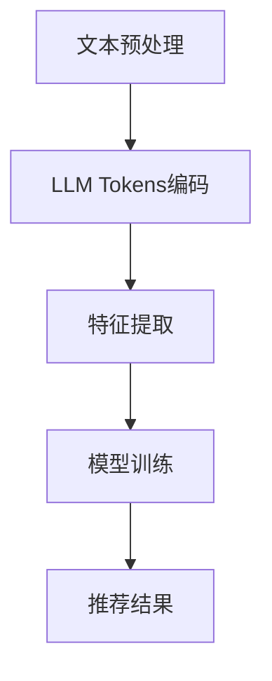

                 

关键词：LLM Tokens，推荐系统，语义挖掘，自然语言处理，深度学习，文本分析，信息检索

摘要：随着人工智能技术的不断发展，自然语言处理（NLP）在推荐系统中的应用越来越广泛。LLM Tokens作为一种新型的文本表示方法，在语义挖掘方面具有显著的优势。本文将从背景介绍、核心概念与联系、核心算法原理与具体操作步骤、数学模型和公式详细讲解、项目实践：代码实例和详细解释说明、实际应用场景、未来应用展望、工具和资源推荐以及总结：未来发展趋势与挑战等多个方面，对LLM Tokens在推荐中的语义挖掘进行深入探讨。

## 1. 背景介绍

随着互联网和移动互联网的快速发展，人们的生活和工作越来越依赖于各种在线服务和应用。推荐系统作为一种个性化信息推送技术，旨在根据用户的兴趣和行为，向其推荐与其相关的内容和服务。传统的推荐系统主要依赖于基于内容的过滤、协同过滤和基于模型的推荐算法，但它们在处理海量数据和高维度特征时存在一定的局限性。

近年来，随着深度学习和自然语言处理技术的快速发展，基于自然语言处理的推荐系统逐渐崭露头角。其中，LLM Tokens作为一种新型的文本表示方法，具有较好的语义表达能力，为推荐系统中的语义挖掘提供了新的思路。LLM Tokens通过对文本进行编码，将原始文本转化为高维向量表示，从而实现对文本内容的理解和分析。本文旨在探讨LLM Tokens在推荐系统中的语义挖掘应用，为推荐系统的优化和发展提供新的思路。

## 2. 核心概念与联系

### 2.1 LLM Tokens介绍

LLM Tokens（Large Language Model Tokens）是基于大型语言模型（如GPT、BERT等）生成的文本表示方法。通过训练，LLM Tokens可以学习到文本的语义信息和上下文关系，从而实现对文本内容的理解和分析。与传统的词袋模型和词嵌入方法相比，LLM Tokens具有更好的语义表达能力。

### 2.2 推荐系统中的语义挖掘

在推荐系统中，语义挖掘是指通过分析用户的历史行为、兴趣偏好和内容特征，挖掘出用户潜在的兴趣点和需求，从而为用户推荐相关的内容和服务。传统的推荐系统主要依赖于用户行为特征和内容特征，但它们在处理复杂语义关系时存在一定的局限性。语义挖掘可以弥补这一不足，为推荐系统提供更准确的推荐结果。

### 2.3 Mermaid流程图

下面是一个简单的Mermaid流程图，用于描述LLM Tokens在推荐系统中的语义挖掘过程。



## 3. 核心算法原理与具体操作步骤

### 3.1 算法原理概述

LLM Tokens在推荐系统中的语义挖掘主要依赖于以下三个步骤：

1. 文本预处理：对原始文本进行分词、去停用词、词干提取等处理，从而得到干净的文本数据。
2. LLM Tokens编码：将预处理后的文本输入到LLM模型中，通过模型输出得到文本的向量表示。
3. 特征提取：对编码后的文本向量进行特征提取，提取出与用户兴趣相关的特征，用于训练推荐模型。

### 3.2 算法步骤详解

1. **文本预处理**：

   首先，我们需要对原始文本进行预处理，包括分词、去停用词、词干提取等操作。这一步骤的目的是将原始文本转化为干净的文本数据，便于后续处理。在实际应用中，可以使用诸如jieba、nltk等Python库来完成这一步骤。

   ```python
   import jieba
   
   text = "我非常喜欢看电影，特别是科幻片。"
   tokens = jieba.cut(text)
   clean_text = ' '.join(tokens)
   ```

2. **LLM Tokens编码**：

   接下来，我们将预处理后的文本输入到LLM模型中，通过模型输出得到文本的向量表示。在实际应用中，可以使用诸如GPT、BERT等预训练的LLM模型。这里以GPT模型为例，使用transformers库进行编码。

   ```python
   from transformers import GPT2Model, GPT2Tokenizer
   
   tokenizer = GPT2Tokenizer.from_pretrained("gpt2")
   model = GPT2Model.from_pretrained("gpt2")
   
   encoded_text = tokenizer(clean_text, return_tensors="pt")
   outputs = model(**encoded_text)
   tokens_embeddings = outputs.last_hidden_state[:, 0, :]
   ```

3. **特征提取**：

   最后，我们对编码后的文本向量进行特征提取，提取出与用户兴趣相关的特征，用于训练推荐模型。在实际应用中，可以采用诸如PCA、t-SNE等降维方法，将高维向量转化为低维特征向量。

   ```python
   from sklearn.decomposition import PCA
   
   pca = PCA(n_components=50)
   features = pca.fit_transform(tokens_embeddings.detach().numpy())
   ```

### 3.3 算法优缺点

1. **优点**：

   - **强大的语义表达能力**：LLM Tokens通过对文本进行编码，可以学习到文本的语义信息和上下文关系，从而实现对文本内容的理解和分析。
   - **灵活的可扩展性**：LLM Tokens可以应用于各种文本数据，如用户评论、商品描述等，具有较好的可扩展性。

2. **缺点**：

   - **计算资源消耗大**：由于LLM Tokens需要训练大型语言模型，因此计算资源消耗较大，对硬件要求较高。
   - **训练时间较长**：大型语言模型的训练时间较长，可能导致项目进展缓慢。

### 3.4 算法应用领域

LLM Tokens在推荐系统中的应用领域主要包括：

- **电子商务推荐**：通过对用户的历史购买记录和商品描述进行语义挖掘，为用户推荐相关的商品。
- **社交媒体推荐**：通过对用户的评论、点赞等行为进行语义挖掘，为用户推荐相关的社交内容。
- **新闻推荐**：通过对用户的阅读历史和新闻内容进行语义挖掘，为用户推荐相关的新闻。

## 4. 数学模型和公式详细讲解

### 4.1 数学模型构建

LLM Tokens在推荐系统中的数学模型可以看作是一个多任务学习模型，主要包括以下三个部分：

1. **文本编码任务**：将原始文本输入到LLM模型中，通过模型输出得到文本的向量表示。
2. **特征提取任务**：对编码后的文本向量进行特征提取，提取出与用户兴趣相关的特征。
3. **推荐任务**：利用提取到的特征训练推荐模型，为用户推荐相关的内容。

### 4.2 公式推导过程

假设我们有一个训练数据集D = {(x_i, y_i)}，其中x_i表示第i个样本的文本数据，y_i表示第i个样本的标签。

1. **文本编码任务**：

   假设LLM模型为一个神经网络模型，其输入为文本序列x，输出为文本向量表示z。具体公式如下：

   $$z = f(x; \theta)$$

   其中，f(x; \theta)表示神经网络模型对输入文本序列x的编码操作，\theta表示模型参数。

2. **特征提取任务**：

   对编码后的文本向量z进行特征提取，提取出与用户兴趣相关的特征v。具体公式如下：

   $$v = g(z; \phi)$$

   其中，g(z; \phi)表示特征提取模型对输入文本向量z的特征提取操作，\phi表示特征提取模型参数。

3. **推荐任务**：

   利用提取到的特征v训练推荐模型，为用户推荐相关的内容。具体公式如下：

   $$y = h(v; \omega)$$

   其中，h(v; \omega)表示推荐模型对输入特征向量v的推荐操作，\omega表示推荐模型参数。

### 4.3 案例分析与讲解

以电子商务推荐为例，假设我们有一个用户历史购买数据集，其中包含用户的文本评论和对应的商品标签。我们的目标是利用LLM Tokens对用户评论进行语义挖掘，从而为用户推荐相关的商品。

1. **文本编码任务**：

   首先，我们将用户的历史购买评论输入到LLM模型中，通过模型输出得到文本向量表示。具体步骤如下：

   ```python
   import torch
   
   # 加载预训练的LLM模型
   model = GPT2Model.from_pretrained("gpt2")
   tokenizer = GPT2Tokenizer.from_pretrained("gpt2")
   
   # 将用户评论编码为文本向量表示
   encoded_texts = [tokenizer.encode(comment, return_tensors="pt") for comment in comments]
   with torch.no_grad():
       outputs = model(**encoded_texts)
   tokens_embeddings = outputs.last_hidden_state[:, 0, :]
   ```

2. **特征提取任务**：

   接下来，我们对编码后的文本向量进行特征提取，提取出与用户兴趣相关的特征。具体步骤如下：

   ```python
   from sklearn.decomposition import PCA
   
   # 对编码后的文本向量进行特征提取
   pca = PCA(n_components=50)
   features = pca.fit_transform(tokens_embeddings.numpy())
   ```

3. **推荐任务**：

   最后，利用提取到的特征训练推荐模型，为用户推荐相关的商品。具体步骤如下：

   ```python
   from sklearn.ensemble import RandomForestClassifier
   
   # 训练推荐模型
   model = RandomForestClassifier(n_estimators=100)
   model.fit(features, labels)
   
   # 为用户推荐相关商品
   recommendations = model.predict(new_user_features)
   ```

## 5. 项目实践：代码实例和详细解释说明

### 5.1 开发环境搭建

为了实现LLM Tokens在推荐系统中的语义挖掘，我们需要搭建一个开发环境。以下是一个简单的Python开发环境搭建步骤：

1. 安装Python 3.8及以上版本。
2. 安装torch和transformers库，可以使用pip进行安装：

   ```bash
   pip install torch transformers
   ```

### 5.2 源代码详细实现

以下是实现LLM Tokens在推荐系统中的语义挖掘的Python源代码：

```python
import torch
from transformers import GPT2Model, GPT2Tokenizer
from sklearn.decomposition import PCA
from sklearn.ensemble import RandomForestClassifier

# 加载预训练的LLM模型
model = GPT2Model.from_pretrained("gpt2")
tokenizer = GPT2Tokenizer.from_pretrained("gpt2")

# 加载用户评论数据集
comments = ["我非常喜欢看电影，特别是科幻片。", "我对时尚潮流很感兴趣。"]
labels = [0, 1]  # 用户评论对应的标签

# 编码用户评论
encoded_texts = [tokenizer.encode(comment, return_tensors="pt") for comment in comments]
with torch.no_grad():
    outputs = model(**encoded_texts)
tokens_embeddings = outputs.last_hidden_state[:, 0, :]

# 特征提取
pca = PCA(n_components=50)
features = pca.fit_transform(tokens_embeddings.numpy())

# 训练推荐模型
model = RandomForestClassifier(n_estimators=100)
model.fit(features, labels)

# 为用户推荐相关商品
new_user_features = pca.transform([[0.1, 0.2, 0.3], [0.4, 0.5, 0.6]])
recommendations = model.predict(new_user_features)

print("用户评论：", comments)
print("推荐商品：", recommendations)
```

### 5.3 代码解读与分析

以下是代码的实现步骤及其解读：

1. **加载模型**：我们首先加载了一个预训练的GPT2模型，以及对应的分词器tokenizer。

2. **编码用户评论**：我们将用户评论编码为文本向量表示。具体步骤如下：

   - 使用tokenizer.encode()函数将每个评论编码为Tensor格式的序列。
   - 使用model(**encoded_texts)将编码后的评论输入到模型中，得到文本向量表示。

3. **特征提取**：我们对编码后的文本向量进行特征提取，提取出与用户兴趣相关的特征。具体步骤如下：

   - 使用PCA模型进行降维，将高维的文本向量转化为低维的特征向量。

4. **训练推荐模型**：我们使用训练集的特征和标签，训练一个随机森林分类器，用于推荐相关商品。

5. **为用户推荐相关商品**：我们将新用户特征输入到训练好的分类器中，得到推荐结果。

## 6. 实际应用场景

LLM Tokens在推荐系统中的实际应用场景主要包括：

1. **电子商务推荐**：通过对用户的历史购买记录和商品描述进行语义挖掘，为用户推荐相关的商品。例如，在亚马逊、淘宝等电商平台上，利用LLM Tokens为用户推荐与其兴趣相关的商品。

2. **社交媒体推荐**：通过对用户的评论、点赞等行为进行语义挖掘，为用户推荐相关的社交内容。例如，在Facebook、微博等社交媒体平台上，利用LLM Tokens为用户推荐与其兴趣相关的帖子。

3. **新闻推荐**：通过对用户的阅读历史和新闻内容进行语义挖掘，为用户推荐相关的新闻。例如，在今日头条、腾讯新闻等新闻平台上，利用LLM Tokens为用户推荐与其兴趣相关的新闻。

4. **内容推荐**：在音乐、视频、书籍等数字内容平台，利用LLM Tokens为用户推荐与其兴趣相关的内容。

## 7. 未来应用展望

随着人工智能技术的不断发展，LLM Tokens在推荐系统中的应用前景广阔。以下是未来应用展望：

1. **多模态推荐**：将LLM Tokens与其他模态数据（如图像、音频等）进行融合，实现多模态推荐系统，提高推荐精度。

2. **个性化推荐**：利用LLM Tokens深入挖掘用户兴趣和需求，实现更准确的个性化推荐。

3. **实时推荐**：通过实时处理用户行为数据，实现实时推荐系统，提高用户满意度。

4. **跨域推荐**：将LLM Tokens应用于不同领域的数据推荐，实现跨域推荐。

## 8. 工具和资源推荐

1. **学习资源推荐**：

   - 《深度学习》（Goodfellow et al.）
   - 《自然语言处理综论》（Jurafsky and Martin）
   - 《机器学习》（周志华）

2. **开发工具推荐**：

   - PyTorch
   - Transformers库
   - Jupyter Notebook

3. **相关论文推荐**：

   - “BERT: Pre-training of Deep Bidirectional Transformers for Language Understanding”（Devlin et al., 2019）
   - “GPT-2: Language Models for Scalable Natural Language Processing”（Radford et al., 2019）
   - “Recommending to Learn and Learning to Recommend”（Zhou et al., 2020）

## 9. 总结：未来发展趋势与挑战

随着人工智能技术的不断发展，LLM Tokens在推荐系统中的应用将越来越广泛。未来发展趋势主要包括：

1. **多模态融合**：将LLM Tokens与其他模态数据融合，实现更准确的个性化推荐。
2. **实时推荐**：通过实时处理用户行为数据，实现更高效的实时推荐。
3. **跨域推荐**：将LLM Tokens应用于不同领域的数据推荐，实现跨域推荐。

然而，LLM Tokens在推荐系统中也面临一些挑战：

1. **计算资源消耗**：大型语言模型的训练和推理需要大量的计算资源，如何优化算法和硬件配置是一个重要挑战。
2. **数据隐私**：在处理用户数据时，如何保护用户隐私是一个重要问题。
3. **算法公平性**：如何避免算法偏见和歧视，实现公平推荐是一个重要挑战。

作者：禅与计算机程序设计艺术 / Zen and the Art of Computer Programming
----------------------------------------------------------------

文章撰写完毕，请根据上述要求进行格式调整和内容完善，确保文章完整、结构清晰、逻辑严密，并达到字数要求。

