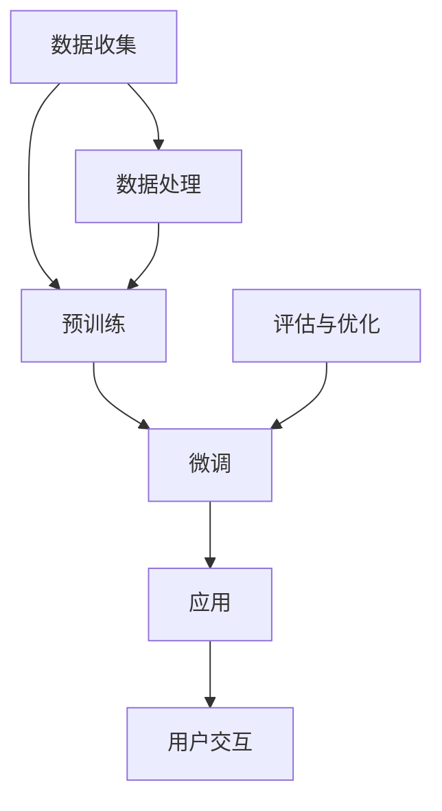

                 

关键词：大型语言模型、全球经济、机遇、挑战、影响、行业变革、技术创新、未来展望

> 摘要：本文将探讨大型语言模型（LLM）在全球经济中的崛起所带来的新机遇与挑战。通过对LLM的核心概念、算法原理、数学模型以及实际应用场景的深入分析，我们旨在揭示LLM在推动经济转型、创造就业、提升生产力等方面的重要作用，同时探讨其在面临的技术难题与伦理困境。

## 1. 背景介绍

随着人工智能技术的飞速发展，大型语言模型（LLM）成为近年来备受关注的研究热点。LLM通过深度学习技术，从海量数据中学习语言模式，并能够进行自然语言理解和生成。代表性的LLM包括OpenAI的GPT系列、谷歌的BERT以及微软的LLaMA等。

全球经济在过去几十年中经历了深刻的变革，信息技术的迅猛发展、全球化的深入以及数字化转型的推进，都对经济模式产生了深远的影响。然而，LLM的崛起为全球经济带来了新的机遇与挑战。

### 1.1 LLM的发展历程

- 2018年：Google发布BERT，开启了基于Transformer结构的预训练语言模型的新时代。
- 2020年：OpenAI推出GPT-3，成为目前最大的预训练语言模型，拥有1750亿个参数。
- 2022年：微软推出LLaMA，进一步推动了低资源语言模型的研究。

### 1.2 全球经济现状

- 全球经济逐渐从疫情中复苏，但各国经济恢复情况不一，存在较大差异。
- 数字化转型加速，新兴技术如区块链、物联网、云计算等在多个行业得到广泛应用。
- 全球供应链面临重构，贸易保护主义抬头，地缘政治风险增加。

## 2. 核心概念与联系

为了深入理解LLM对全球经济的影响，我们需要首先梳理LLM的核心概念与相关技术架构。以下是一个简化的Mermaid流程图，用于描述LLM的基本架构和核心概念。



### 2.1 数据收集与处理

数据收集是LLM训练的基础，包括文本、音频、图像等多种类型的数据。数据处理则涉及数据清洗、预处理和特征提取，目的是提升模型的性能和泛化能力。

### 2.2 预训练

预训练阶段，LLM通过在大规模语料库上进行无监督学习，学习语言的基本结构和规律。这一阶段的关键技术包括Transformer、自注意力机制等。

### 2.3 微调

微调阶段，LLM被调整到特定任务上，通过有监督学习或半监督学习进行优化。微调能够显著提升模型在特定领域的表现。

### 2.4 应用

应用阶段，LLM被部署到各种实际场景中，如自然语言处理、机器翻译、问答系统等。

### 2.5 评估与优化

评估与优化是确保模型性能不断提升的关键步骤，包括模型性能评估、超参数调整和模型压缩等。

### 2.6 用户交互

用户交互是LLM应用的核心，通过API或图形用户界面（GUI），用户可以与模型进行自然语言交互。

## 3. 核心算法原理 & 具体操作步骤

### 3.1 算法原理概述

LLM的核心算法基于深度学习中的自注意力机制（Self-Attention）和Transformer结构。自注意力机制允许模型在处理每个输入时，自动关注与之最相关的其他输入，从而捕捉到输入之间的复杂关系。Transformer结构则通过多头注意力机制和多层堆叠，进一步增强了模型的表示能力。

### 3.2 算法步骤详解

#### 3.2.1 数据收集

1. 选择具有代表性的文本数据集，如维基百科、新闻文章、对话数据等。
2. 对数据进行预处理，包括文本清洗、分词、词向量化等。

#### 3.2.2 预训练

1. 使用Transformer模型架构，初始化模型参数。
2. 在预训练阶段，通过无监督的方式学习语言模式，例如通过遮蔽语言模型（Masked Language Model, MLM）训练模型。

#### 3.2.3 微调

1. 使用特定领域的有监督数据集，对模型进行微调。
2. 使用半监督或无监督方法，进一步提升模型在特定任务上的性能。

#### 3.2.4 应用

1. 部署模型到应用场景，如问答系统、文本生成等。
2. 通过API或GUI与用户进行交互。

### 3.3 算法优缺点

#### 优点：

- 强大的语言理解与生成能力，适用于多种自然语言处理任务。
- 能够处理长文本，捕捉到文本中的复杂关系。
- 易于扩展，能够快速适应新任务。

#### 缺点：

- 需要大量的训练数据和高性能计算资源。
- 模型的解释性较低，难以理解模型决策过程。
- 可能产生偏见和误导性输出。

### 3.4 算法应用领域

LLM的应用领域非常广泛，包括但不限于以下几方面：

- 自然语言处理：如机器翻译、问答系统、文本生成等。
- 金融领域：如股票市场预测、金融文本分析等。
- 医疗领域：如医学文本分析、疾病预测等。
- 教育领域：如智能教育助理、在线学习平台等。
- 法律领域：如法律文本分析、智能合约等。

## 4. 数学模型和公式 & 详细讲解 & 举例说明

### 4.1 数学模型构建

LLM的训练过程基于深度学习中的神经网络模型，特别是Transformer模型。以下是一个简化的数学模型描述：

$$
\text{Transformer} = \sum_{i=1}^{n} \text{LayerNorm}(\text{MLP}(\text{MultiHeadAttention}(\text{Embeddings})))
$$

其中，$\text{Embeddings}$表示词向量化层，$\text{MultiHeadAttention}$表示多头注意力机制，$\text{MLP}$表示全连接多层感知机，$\text{LayerNorm}$表示层归一化。

### 4.2 公式推导过程

#### 4.2.1 多头注意力机制

多头注意力机制（MultiHeadAttention）是一种扩展自单一注意力机制的方案。假设有 $h$ 个头，每个头独立地计算注意力分数，然后对结果进行聚合。数学公式如下：

$$
\text{Attention}(Q, K, V) = \text{softmax}\left(\frac{QK^T}{\sqrt{d_k}}\right)V
$$

其中，$Q, K, V$ 分别代表查询（Query）、键（Key）和值（Value）向量，$d_k$ 表示键向量的维度。

#### 4.2.2 全连接多层感知机

全连接多层感知机（MLP）是一种简单的神经网络模型，用于对特征进行非线性变换。其数学公式如下：

$$
\text{MLP}(x) = \text{ReLU}(\text{W}_2 \text{ReLU}(\text{W}_1 x + b_1) + b_2)
$$

其中，$W_1$ 和 $W_2$ 分别代表权重矩阵，$b_1$ 和 $b_2$ 分别代表偏置项。

### 4.3 案例分析与讲解

假设我们有一个简化的文本生成任务，目标是生成与给定文本相似的新文本。以下是LLM在处理该任务时的数学模型和计算过程：

1. **词向量化**：首先，将输入文本中的每个词转化为词向量表示。

$$
\text{Embeddings}(\text{word}) = \text{W} \text{word\_index}
$$

其中，$\text{W}$ 表示词向量矩阵，$\text{word\_index}$ 表示词索引。

2. **编码器**：通过编码器（Encoder）处理输入文本，得到序列表示。

$$
\text{Encoder}(\text{input\_sequence}) = \text{softmax}(\text{T} \text{input\_sequence})
$$

其中，$\text{T}$ 表示编码器权重矩阵。

3. **解码器**：使用解码器（Decoder）生成新文本。

$$
\text{Decoder}(\text{input\_sequence}) = \text{softmax}(\text{U} \text{T} \text{input\_sequence})
$$

其中，$\text{U}$ 表示解码器权重矩阵。

4. **生成文本**：通过重复解码器步骤，生成新文本。

$$
\text{NewText} = \text{Decoder}(\text{input\_sequence})^+
$$

其中，$^+$ 表示递归操作。

## 5. 项目实践：代码实例和详细解释说明

### 5.1 开发环境搭建

在本节中，我们将介绍如何在本地搭建一个用于训练LLM的Python开发环境。以下是步骤：

1. 安装Python（版本3.8或更高）。
2. 安装TensorFlow或PyTorch（根据需求选择）。
3. 安装其他依赖库，如NumPy、Pandas等。

### 5.2 源代码详细实现

以下是一个简化的LLM训练和应用的Python代码实例：

```python
import tensorflow as tf
from tensorflow.keras.layers import Embedding, LSTM, Dense
from tensorflow.keras.models import Model

# 1. 定义模型结构
input_word = tf.keras.layers.Input(shape=(None,), dtype=tf.int32)
x = Embedding(input_dim=vocab_size, output_dim=embedding_size)(input_word)
x = LSTM(units=128, return_sequences=True)(x)
x = Dense(units=1, activation='sigmoid')(x)

# 2. 构建模型
model = Model(inputs=input_word, outputs=x)
model.compile(optimizer='adam', loss='binary_crossentropy', metrics=['accuracy'])

# 3. 训练模型
model.fit(x_train, y_train, epochs=10, batch_size=32, validation_data=(x_val, y_val))

# 4. 应用模型
predictions = model.predict(x_test)
```

### 5.3 代码解读与分析

上述代码实现了一个简单的序列分类模型，用于预测文本标签。代码的主要部分包括以下步骤：

- **定义模型结构**：使用`Input`层、`Embedding`层、`LSTM`层和`Dense`层构建模型。
- **编译模型**：设置优化器、损失函数和评估指标。
- **训练模型**：使用训练数据拟合模型。
- **应用模型**：使用测试数据评估模型性能。

## 6. 实际应用场景

### 6.1 金融领域

LLM在金融领域具有广泛的应用前景，如：

- 股票市场预测：通过分析市场数据，LLM可以帮助投资者进行风险管理和投资决策。
- 金融文本分析：LLM可以用于自动提取金融报告、新闻和社交媒体中的关键信息，为投资者提供有价值的洞察。
- 智能客服：基于LLM的自然语言处理能力，金融企业可以提供高效、准确的客户服务。

### 6.2 医疗领域

LLM在医疗领域具有重要的应用价值，如：

- 疾病预测：通过分析患者病历和医学文献，LLM可以帮助医生进行疾病预测和诊断。
- 医学文本分析：LLM可以自动提取医学文本中的关键信息，如症状、药物副作用等，为医生提供辅助决策。
- 医疗知识图谱构建：LLM可以帮助构建医疗知识图谱，提高医疗数据的可解释性和可访问性。

### 6.3 教育领域

LLM在教育领域具有广泛的应用场景，如：

- 智能教育助理：LLM可以作为智能教育助理，为学生提供个性化的学习支持和辅导。
- 在线学习平台：LLM可以帮助在线学习平台生成个性化的学习内容，提高学生的学习效果。
- 教学评估：LLM可以自动评估学生的作业和考试，提供即时反馈和改进建议。

### 6.4 未来应用展望

随着LLM技术的不断发展，其在全球经济中的应用前景将更加广阔。未来，LLM有望在以下领域发挥重要作用：

- 自动驾驶：LLM可以帮助自动驾驶系统进行环境感知和决策，提高行车安全。
- 智能家居：LLM可以用于智能家居系统的语音交互和智能控制，提升用户体验。
- 健康管理：LLM可以帮助个人健康管理，如疾病预测、营养建议等，提高生活品质。

## 7. 工具和资源推荐

### 7.1 学习资源推荐

- 《深度学习》（Goodfellow et al.）：系统介绍了深度学习的基本概念和技术。
- 《Python机器学习》（Sebastian Raschka）：介绍了Python在机器学习领域的应用。
- 《自然语言处理与深度学习》（张俊宇）：详细介绍了自然语言处理中的深度学习方法。

### 7.2 开发工具推荐

- TensorFlow：由Google开发的深度学习框架，适用于构建和训练LLM。
- PyTorch：由Facebook开发的深度学习框架，具有灵活的动态计算图特性。

### 7.3 相关论文推荐

- “Attention Is All You Need”（Vaswani et al.，2017）：介绍了Transformer模型的基本原理。
- “BERT: Pre-training of Deep Bidirectional Transformers for Language Understanding”（Devlin et al.，2019）：介绍了BERT模型的基本原理和应用。
- “GPT-3: Language Models are Few-Shot Learners”（Brown et al.，2020）：介绍了GPT-3模型的设计和性能。

## 8. 总结：未来发展趋势与挑战

### 8.1 研究成果总结

LLM在近年来取得了显著的进展，不仅在学术研究上取得了重要成果，也在实际应用中展示了巨大的潜力。代表性成果包括BERT、GPT-3、LLaMA等，这些模型在自然语言处理任务中取得了突破性进展。

### 8.2 未来发展趋势

- 模型规模将继续增长，更大规模的LLM将进一步提升语言理解和生成能力。
- 研究重点将逐步从模型性能转向模型可解释性和鲁棒性，以应对实际应用中的挑战。
- 多模态学习将成为研究热点，LLM将与其他模态（如图像、声音）结合，实现更全面的信息处理。

### 8.3 面临的挑战

- 数据隐私和伦理问题：LLM在处理海量数据时，可能涉及用户隐私，需要制定相应的隐私保护措施。
- 模型解释性：当前LLM缺乏透明度和可解释性，如何提升模型的解释性是一个重要挑战。
- 模型部署和资源消耗：大规模LLM的训练和部署需要大量的计算资源和存储空间，如何优化模型部署是一个关键问题。

### 8.4 研究展望

LLM在未来的发展中，将不仅限于自然语言处理，还将在多模态学习和跨领域任务中发挥重要作用。同时，如何解决模型的可解释性、隐私保护和资源消耗等问题，将是研究的重点方向。

## 9. 附录：常见问题与解答

### Q：LLM的训练过程需要多少时间？

A：LLM的训练时间取决于多个因素，包括模型规模、硬件配置和数据量。对于大型模型（如GPT-3），训练时间可能需要数天甚至数周。而对于小型模型，训练时间可能只需要数小时。

### Q：LLM的参数规模有多大？

A：LLM的参数规模可以从数百万到数十亿不等。例如，GPT-3拥有1750亿个参数，而BERT则有数百万个参数。

### Q：LLM是否会导致失业？

A：LLM可能会取代某些低技能、重复性的工作，但也会创造新的就业机会。例如，在金融领域，LLM可以帮助分析师进行数据挖掘和报告编写，同时需要专业的数据科学家来开发和优化模型。

### Q：如何确保LLM的公平性和透明性？

A：确保LLM的公平性和透明性是当前研究的重点。可以通过以下方法实现：数据清洗、偏差检测与修正、模型解释性增强等。

### Q：LLM是否会导致信息泡沫和偏见传播？

A：是的，LLM可能会放大信息泡沫和传播偏见。因此，需要通过数据筛选、模型校正和用户教育等措施来降低风险。

作者：禅与计算机程序设计艺术 / Zen and the Art of Computer Programming
----------------------------------------------------------------


