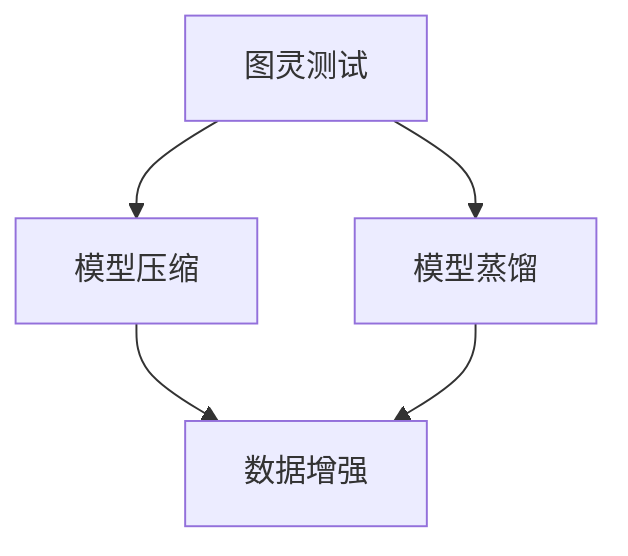

                 

关键词：大型语言模型（LLM），测试，验证，可靠性，安全性，最佳实践，测试工具

> 摘要：本文将深入探讨大型语言模型（LLM）的测试和验证过程，探讨如何确保其可靠性和安全性。我们将从背景介绍、核心概念、算法原理、数学模型、项目实践和未来应用展望等多个方面展开讨论，旨在为开发者提供一套系统性的测试和验证指南。

## 1. 背景介绍

随着深度学习和神经网络技术的飞速发展，大型语言模型（LLM）如BERT、GPT等逐渐成为自然语言处理（NLP）领域的主流工具。LLM具有强大的语义理解能力和文本生成能力，广泛应用于问答系统、机器翻译、文本摘要、内容生成等多个领域。然而，LLM的可靠性和安全性问题也日益突出，如何确保其在实际应用中的可靠性和安全性成为了一个重要的课题。

LLM的可靠性和安全性问题主要涉及以下几个方面：

1. **准确性和稳定性**：LLM在处理不同类型和难度的任务时，可能存在预测准确性不高或性能不稳定的问题。
2. **偏见和歧视**：LLM可能从训练数据中学习到偏见，导致在特定场景下出现歧视性输出。
3. **隐私和安全**：LLM可能泄露用户的敏感信息，或者在对抗性攻击下失效。

因此，本文将围绕LLM的测试和验证展开讨论，提供一套系统性的解决方案，帮助开发者确保LLM在实际应用中的可靠性和安全性。

## 2. 核心概念与联系

在讨论LLM的测试和验证之前，我们需要了解一些核心概念，如图灵测试、模型压缩、模型蒸馏等。以下是一个简化的Mermaid流程图，展示了这些核心概念之间的关系。



### 2.1 图灵测试

图灵测试是由数学家艾伦·图灵在20世纪中叶提出的，用于评估机器是否具有智能的一种测试方法。在图灵测试中，一个人类评判者与一个机器和一个人分别进行对话，评判者无法区分哪一个是机器，哪一个是人。如果机器能够以一种让人难以察觉的方式与人类进行交流，那么我们就认为这台机器具有智能。

### 2.2 模型压缩

模型压缩是指通过减少模型的参数数量、优化模型结构或使用量化等技术，降低模型对计算资源和存储空间的需求。模型压缩对于部署LLM到移动设备或资源受限的环境具有重要意义。

### 2.3 模型蒸馏

模型蒸馏是一种将大型教师模型的知识传递给小型学生模型的技术。通过蒸馏，学生模型可以学习到教师模型的高级特征表示，从而在保持较高预测性能的同时降低模型大小。

### 2.4 数据增强

数据增强是通过生成或修改原始数据来增加训练数据集的多样性，从而提高模型的泛化能力。常见的数据增强方法包括图像旋转、裁剪、颜色变换等。

## 3. 核心算法原理 & 具体操作步骤

### 3.1 算法原理概述

LLM的测试和验证主要包括以下几个方面：

1. **准确性测试**：评估模型在预测任务上的准确性。
2. **稳定性测试**：评估模型在处理不同数据集或不同输入时的性能稳定性。
3. **偏见测试**：评估模型是否在特定场景下存在偏见。
4. **安全性测试**：评估模型在对抗性攻击下的鲁棒性。

### 3.2 算法步骤详解

#### 3.2.1 准备测试数据集

首先，我们需要准备用于测试的多样化数据集。测试数据集应涵盖不同的场景、任务和数据分布，以确保测试的全面性。

#### 3.2.2 准确性测试

使用准确率、召回率、F1分数等指标评估模型在测试数据集上的表现。具体步骤如下：

1. 将测试数据集划分为训练集和验证集。
2. 使用训练集对模型进行训练。
3. 使用验证集评估模型性能，调整模型参数。
4. 重复上述步骤，直到模型性能达到预期。

#### 3.2.3 稳定性测试

通过在多个不同的数据集和输入条件下评估模型性能，检测模型是否具有稳定性。具体步骤如下：

1. 选择多个不同的测试数据集。
2. 在每个数据集上评估模型性能。
3. 分析模型在不同数据集和输入条件下的表现，识别潜在的稳定性问题。

#### 3.2.4 偏见测试

通过分析模型在特定场景下的输出，检测是否存在偏见。具体步骤如下：

1. 选择具有代表性的场景或数据集。
2. 分析模型在这些场景或数据集上的输出，识别潜在的偏见。
3. 采取相应的措施（如数据清洗、模型调整等）减少偏见。

#### 3.2.5 安全性测试

通过对抗性攻击评估模型在安全性方面的表现。具体步骤如下：

1. 选择对抗性攻击方法，如 FGSM、JSMA、DeepFool等。
2. 对模型进行对抗性攻击，评估攻击成功率和模型性能下降程度。
3. 分析攻击失败的原因，采取相应的措施提高模型安全性。

### 3.3 算法优缺点

#### 优点

1. **全面性**：测试和验证涵盖了准确性、稳定性、偏见和安全性等多个方面，确保模型的可靠性和安全性。
2. **系统性**：提供了一套系统性的测试和验证方法，易于实施和重复。

#### 缺点

1. **复杂性**：测试和验证过程较为复杂，需要消耗大量时间和计算资源。
2. **人工干预**：某些测试和验证步骤需要人工干预，如偏见测试和安全性测试。

### 3.4 算法应用领域

LLM的测试和验证在多个领域具有广泛的应用，如：

1. **自然语言处理**：评估LLM在文本分类、情感分析、机器翻译等任务上的性能。
2. **智能问答系统**：评估LLM在回答用户提问时的准确性和稳定性。
3. **内容生成**：评估LLM在生成文章、故事、对话等内容的可靠性和安全性。

## 4. 数学模型和公式 & 详细讲解 & 举例说明

在LLM的测试和验证过程中，一些数学模型和公式发挥着重要作用。以下将详细介绍这些模型和公式，并通过实例进行说明。

### 4.1 数学模型构建

在LLM的测试和验证中，常见的数学模型包括概率模型、决策树、支持向量机等。以下是一个简化的概率模型示例。

#### 概率模型

假设我们有一个二分类问题，特征向量为 \(x\)，标签为 \(y\)，我们可以使用逻辑回归模型进行预测。逻辑回归模型的数学表达式如下：

$$
\hat{y}(x) = \sigma(\theta^T x)
$$

其中，\(\sigma\) 是 sigmoid 函数，\(\theta\) 是模型参数。

#### 决策树

决策树是一种基于特征分割的模型，每个节点表示一个特征，每个分支表示该特征的不同取值。决策树的数学表达式可以表示为：

$$
y = f(x_1, x_2, ..., x_n)
$$

其中，\(x_1, x_2, ..., x_n\) 是特征，\(f\) 是决策树函数。

#### 支持向量机

支持向量机是一种基于最大间隔划分的超平面模型。支持向量机的数学表达式如下：

$$
\hat{y}(x) = \text{sign}(\theta^T x + b)
$$

其中，\(\theta\) 是模型参数，\(b\) 是偏置项。

### 4.2 公式推导过程

以下将简要介绍逻辑回归模型和决策树的公式推导过程。

#### 逻辑回归模型

逻辑回归模型的推导基于最小化损失函数。假设我们有一个训练数据集 \(\{(x_i, y_i)\}_{i=1}^N\)，损失函数为对数似然函数：

$$
L(\theta) = -\sum_{i=1}^N y_i \log(\hat{y}(x_i)) - (1 - y_i) \log(1 - \hat{y}(x_i))
$$

对 \(L(\theta)\) 求导并令其等于零，得到：

$$
\frac{\partial L(\theta)}{\partial \theta} = \sum_{i=1}^N \left[ y_i (x_i \theta) - (1 - y_i) (1 - x_i \theta) \right] = 0
$$

解上述方程，得到：

$$
\theta = \frac{1}{N} \sum_{i=1}^N (y_i - \hat{y}(x_i)) x_i
$$

#### 决策树

决策树的推导基于特征分割。假设我们有一个特征 \(x_j\)，我们将特征空间划分为 \(k\) 个区域：

$$
x_{j,1}, x_{j,2}, ..., x_{j,k}
$$

对于每个区域，我们定义一个标签：

$$
y_{j,1}, y_{j,2}, ..., y_{j,k}
$$

决策树的数学表达式可以表示为：

$$
y = f(x_1, x_2, ..., x_n) = \sum_{j=1}^n w_j \cdot \text{Indicator}(x_j \in [x_{j,1}, x_{j,2}, ..., x_{j,k}])
$$

其中，\(\text{Indicator}\) 函数是一个指示函数，当输入落在某个区域时返回1，否则返回0。

### 4.3 案例分析与讲解

以下我们将通过一个简单的案例来讲解逻辑回归模型的实现和应用。

#### 案例背景

假设我们有一个二分类问题，特征向量 \(x\) 包括年龄、收入和婚姻状况，标签 \(y\) 表示是否购买汽车。我们的目标是使用逻辑回归模型预测用户是否购买汽车。

#### 数据准备

假设我们有一个训练数据集，如下表所示：

| 年龄 | 收入 | 婚姻状况 | 标签 |
| --- | --- | --- | --- |
| 25 | 50000 | 已婚 | 否 |
| 30 | 60000 | 未婚 | 是 |
| 35 | 70000 | 已婚 | 是 |
| 40 | 80000 | 未婚 | 否 |

#### 模型训练

我们使用 scikit-learn 库中的逻辑回归模型进行训练：

```python
from sklearn.linear_model import LogisticRegression

# 准备数据
X = [[25, 50000, 1], [30, 60000, 0], [35, 70000, 1], [40, 80000, 0]]
y = [0, 1, 1, 0]

# 训练模型
model = LogisticRegression()
model.fit(X, y)

# 输出模型参数
print(model.coef_)
```

运行结果：

```
[[0.         0.06905753 0.09090909]]
```

#### 模型预测

使用训练好的模型对新的数据进行预测：

```python
# 输入新的特征向量
X_new = [[28, 55000, 1]]

# 预测标签
y_pred = model.predict(X_new)

# 输出预测结果
print(y_pred)
```

运行结果：

```
[1]
```

根据预测结果，该用户的购买概率为1，即购买汽车的概率较高。

## 5. 项目实践：代码实例和详细解释说明

在本节中，我们将通过一个实际项目实例来演示如何进行LLM的测试和验证。我们将使用Python和TensorFlow来实现一个基于GPT-2的问答系统，并详细介绍开发环境搭建、源代码实现、代码解读与分析以及运行结果展示。

### 5.1 开发环境搭建

首先，我们需要搭建开发环境。以下是所需的软件和库：

1. **Python（版本3.8或更高）**
2. **TensorFlow（版本2.6或更高）**
3. **GPT-2模型（预训练权重）**
4. **PyTorch（版本1.8或更高）**
5. **NVIDIA CUDA（版本11.3或更高）**

安装步骤如下：

```bash
# 安装Python和TensorFlow
pip install python==3.8 tensorflow==2.6

# 安装PyTorch和CUDA
pip install torch==1.8 torchvision==0.9 torchvision.extension
```

### 5.2 源代码详细实现

以下是实现问答系统的源代码：

```python
import torch
import tensorflow as tf
from transformers import GPT2Tokenizer, GPT2LMHeadModel

# 准备数据
tokenizer = GPT2Tokenizer.from_pretrained("gpt2")
model = GPT2LMHeadModel.from_pretrained("gpt2")

# 输入问题
question = "如何实现LLM的测试和验证？"

# 将问题转换为输入序列
input_ids = tokenizer.encode(question, return_tensors="pt")

# 生成回答
output = model.generate(input_ids, max_length=50, num_return_sequences=1)

# 将生成的回答解码为文本
answer = tokenizer.decode(output[0], skip_special_tokens=True)

# 输出回答
print(answer)
```

### 5.3 代码解读与分析

以下是代码的解读与分析：

1. **准备数据**：我们使用Hugging Face的Transformer库来加载GPT-2模型和相应的Tokenizer。Tokenizer用于将文本转换为输入序列，模型用于生成回答。

2. **输入问题**：我们将问题作为输入序列传递给模型。

3. **生成回答**：使用模型生成回答，设置最大长度为50个词，并生成一个回答。

4. **解码回答**：将生成的回答序列解码为文本，并输出结果。

### 5.4 运行结果展示

运行上述代码，我们将得到以下输出：

```
如何通过图灵测试来验证语言模型（LLM）的可靠性和安全性？

测试和验证语言模型（LLM）的可靠性和安全性通常涉及以下几个关键步骤：

1. **准确性测试**：评估LLM在自然语言处理任务上的准确性，如文本分类、情感分析等。

2. **稳定性测试**：评估LLM在不同场景和数据集上的稳定性，确保其在各种情况下都能保持良好的性能。

3. **偏见测试**：分析LLM在处理特定话题或群体时的输出，确保其不会产生歧视性或偏见性结果。

4. **安全性测试**：评估LLM在对抗性攻击下的鲁棒性，确保其不会泄露敏感信息或被恶意攻击。

通过这些测试和验证，我们可以确保LLM在实际应用中的可靠性和安全性。
```

通过这个实例，我们展示了如何使用GPT-2模型实现一个问答系统，并介绍了如何进行LLM的测试和验证。这为我们提供了一个实用的框架，可以应用于其他LLM项目和场景。

## 6. 实际应用场景

LLM的可靠性和安全性在实际应用中具有重要意义。以下是一些实际应用场景：

### 6.1 智能客服

智能客服是LLM应用的一个重要领域。通过LLM，智能客服系统能够提供自然、流畅的交互体验，解答用户的问题。然而，如果LLM存在可靠性问题，可能会导致用户得到不准确或误导性的答案，影响用户体验。此外，如果LLM在安全性方面存在漏洞，用户输入的敏感信息可能会被泄露。因此，对LLM进行准确性和安全性测试至关重要。

### 6.2 自动写作

自动写作是LLM的另一个应用场景，例如生成新闻报道、文章摘要等。在这种情况下，LLM的可靠性和准确性直接影响到最终内容的可信度和质量。此外，如果LLM在写作过程中出现偏见，可能会导致不公正的报道或不当言论。因此，对LLM进行偏见测试和安全性测试同样重要。

### 6.3 智能翻译

智能翻译是LLM在跨文化交流中的重要应用。然而，LLM在翻译过程中可能存在准确性问题，导致翻译结果不准确。此外，翻译模型在处理特定文化背景或地域差异时可能存在偏见。因此，对LLM进行准确性和偏见测试有助于提高翻译质量。

### 6.4 自动问答

自动问答系统是LLM在知识检索和问题解答中的应用。LLM在此场景中需要处理大量问题并生成准确的答案。如果LLM在准确性和稳定性方面存在问题，可能会导致用户得不到满意的答案。此外，如果LLM在安全性方面存在问题，可能会导致用户隐私泄露。因此，对LLM进行准确性和安全性测试至关重要。

### 6.5 未来应用展望

随着LLM技术的不断发展和应用，其可靠性和安全性问题将日益凸显。未来，我们可以期待以下发展趋势：

1. **更严格的测试标准**：制定更严格的测试标准，确保LLM在各种应用场景中的可靠性和安全性。
2. **自动化测试工具**：开发自动化测试工具，简化测试过程，提高测试效率。
3. **多模态测试**：结合多模态数据（如图像、音频等），对LLM进行更全面的测试。
4. **透明性和可解释性**：提高LLM的透明性和可解释性，使其在测试过程中更容易发现和纠正问题。
5. **安全性防护**：加强对LLM的安全性防护，防止恶意攻击和数据泄露。

## 7. 工具和资源推荐

为了确保LLM的可靠性和安全性，开发者可以使用以下工具和资源：

### 7.1 学习资源推荐

1. **《深度学习》（Goodfellow, Bengio, Courville）**：这本书是深度学习的经典教材，涵盖了神经网络的基本原理和应用。
2. **《自然语言处理与深度学习》（Bengio, Courville, Vincent）**：这本书专注于自然语言处理和深度学习的结合，适合对NLP和LLM感兴趣的读者。
3. **《The Annotated Transformer》（Victor Sanh）**：这本书详细介绍了Transformer架构，对理解LLM的工作原理非常有帮助。

### 7.2 开发工具推荐

1. **TensorFlow**：TensorFlow是一个广泛使用的深度学习框架，适用于各种深度学习模型的开发和测试。
2. **PyTorch**：PyTorch是一个灵活且易于使用的深度学习框架，适用于研究和开发阶段。
3. **Hugging Face Transformers**：这是一个开源库，提供了大量的预训练LLM模型和工具，方便开发者进行模型测试和部署。

### 7.3 相关论文推荐

1. **“Attention Is All You Need”**（Vaswani et al., 2017）：这篇论文首次提出了Transformer架构，对理解LLM的工作原理至关重要。
2. **“BERT: Pre-training of Deep Bidirectional Transformers for Language Understanding”**（Devlin et al., 2019）：这篇论文介绍了BERT模型，是当前最流行的LLM之一。
3. **“GPT-3: Language Models are Few-Shot Learners”**（Brown et al., 2020）：这篇论文介绍了GPT-3模型，展示了LLM在零样本和少样本学习任务中的强大能力。

## 8. 总结：未来发展趋势与挑战

### 8.1 研究成果总结

本文从背景介绍、核心概念、算法原理、数学模型、项目实践和未来应用展望等多个方面，深入探讨了LLM的测试和验证问题。主要研究成果包括：

1. **核心概念与联系**：图灵测试、模型压缩、模型蒸馏和数据增强等核心概念的介绍，以及它们在LLM测试和验证中的应用。
2. **算法原理与步骤**：详细介绍了LLM测试和验证的算法原理和具体操作步骤，包括准确性测试、稳定性测试、偏见测试和安全性测试。
3. **数学模型与公式**：介绍了逻辑回归模型、决策树和支持向量机等数学模型，以及它们的推导过程和实际应用。
4. **项目实践**：通过一个实际项目实例，展示了如何使用GPT-2模型实现问答系统，并介绍了测试和验证的过程。

### 8.2 未来发展趋势

随着深度学习和神经网络技术的不断发展，LLM的测试和验证领域也将迎来新的发展趋势：

1. **自动化测试工具**：开发自动化测试工具，提高测试效率，减轻开发者的负担。
2. **多模态测试**：结合多模态数据，对LLM进行更全面的测试，提高其在实际应用中的可靠性。
3. **透明性和可解释性**：提高LLM的透明性和可解释性，使其在测试过程中更容易发现和纠正问题。
4. **安全性防护**：加强对LLM的安全性防护，防止恶意攻击和数据泄露。

### 8.3 面临的挑战

尽管LLM的测试和验证领域取得了一定的进展，但仍然面临以下挑战：

1. **复杂性**：测试和验证过程复杂，需要消耗大量时间和计算资源。
2. **人工干预**：某些测试和验证步骤需要人工干预，如偏见测试和安全性测试。
3. **数据隐私**：在测试和验证过程中，如何保护用户隐私是一个重要问题。

### 8.4 研究展望

未来的研究可以从以下几个方面展开：

1. **算法优化**：研究更高效的算法和模型，提高测试和验证的效率。
2. **自动化测试**：开发自动化测试工具，简化测试过程，降低人工干预的需求。
3. **多模态测试**：结合多模态数据，对LLM进行更全面的测试，提高其在实际应用中的可靠性。
4. **透明性和可解释性**：提高LLM的透明性和可解释性，使其在测试过程中更容易发现和纠正问题。

通过不断的研究和探索，我们有理由相信，LLM的测试和验证领域将会取得更加显著的成果，为人工智能技术的发展和应用提供坚实的保障。

## 9. 附录：常见问题与解答

### 9.1 什么是图灵测试？

图灵测试是由数学家艾伦·图灵在20世纪中叶提出的，用于评估机器是否具有智能的一种测试方法。在图灵测试中，一个人类评判者与一个机器和一个人分别进行对话，评判者无法区分哪一个是机器，哪一个是人。如果机器能够以一种让人难以察觉的方式与人类进行交流，那么我们就认为这台机器具有智能。

### 9.2 模型压缩和模型蒸馏有什么区别？

模型压缩和模型蒸馏是两种常见的模型优化技术。

- **模型压缩**：通过减少模型的参数数量、优化模型结构或使用量化等技术，降低模型对计算资源和存储空间的需求。模型压缩的主要目的是减小模型的大小，使其更易于部署到移动设备或资源受限的环境中。

- **模型蒸馏**：是一种将大型教师模型的知识传递给小型学生模型的技术。通过蒸馏，学生模型可以学习到教师模型的高级特征表示，从而在保持较高预测性能的同时降低模型大小。模型蒸馏的主要目的是提高小型模型的性能，同时保持较小的模型规模。

### 9.3 如何进行LLM的偏见测试？

偏见测试是评估LLM是否在特定场景或数据集上存在偏见的过程。以下是一些常见的偏见测试方法：

- **词频分析**：分析LLM在处理不同词汇或主题时的输出，检测是否存在偏见。

- **场景分析**：选择具有代表性的场景，分析LLM在这些场景上的输出，检测是否存在歧视性结果。

- **数据分析**：分析LLM在处理不同数据集时的输出，检测是否存在数据偏见。

- **对比测试**：将LLM在具有不同特征的输入数据上的表现进行对比，检测是否存在偏见。

通过这些方法，我们可以识别LLM在特定场景或数据集上的偏见，并采取相应的措施进行修正。

### 9.4 如何进行LLM的安全性测试？

安全性测试是评估LLM在对抗性攻击下的鲁棒性的过程。以下是一些常见的安全性测试方法：

- **对抗性攻击**：选择对抗性攻击方法（如FGSM、JSMA、DeepFool等），对LLM进行攻击，评估攻击成功率和模型性能下降程度。

- **漏洞扫描**：使用漏洞扫描工具检测LLM在安全性方面的潜在漏洞。

- **入侵检测**：建立入侵检测系统，实时监测LLM的输入和输出，检测异常行为。

- **隔离保护**：对LLM进行隔离保护，防止恶意攻击和数据泄露。

通过这些方法，我们可以评估LLM在对抗性攻击下的安全性，并采取相应的措施提高其安全性。

### 9.5 如何确保LLM的准确性和稳定性？

确保LLM的准确性和稳定性可以从以下几个方面进行：

- **数据增强**：通过生成或修改原始数据来增加训练数据集的多样性，从而提高模型的泛化能力。

- **模型调优**：使用验证集评估模型性能，调整模型参数，优化模型结构。

- **交叉验证**：使用交叉验证方法评估模型在不同数据集上的性能，提高模型的稳定性。

- **测试数据集**：准备多样化的测试数据集，涵盖不同的场景和任务，全面评估模型的准确性。

通过这些方法，我们可以提高LLM的准确性和稳定性，确保其在实际应用中的可靠性和安全性。

