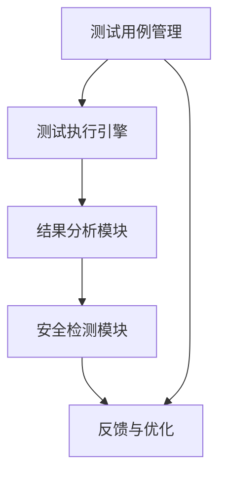

                 

关键词：语言模型测试，模型可靠性，安全性，框架设计，测试方法

> 摘要：本文探讨了语言模型测试框架的重要性，以及如何设计一个可靠且安全的测试框架来确保大型语言模型的可靠性和安全性。文章从背景介绍出发，深入剖析了核心概念和联系，详细阐述了核心算法原理和具体操作步骤，并引入数学模型和公式进行详细讲解。通过项目实践，文章展示了代码实例和详细解释说明，最后讨论了实际应用场景和未来展望。

## 1. 背景介绍

在人工智能领域，语言模型（Language Model，简称LM）作为一种重要的自然语言处理（Natural Language Processing，简称NLP）技术，近年来取得了显著的进展。特别是在深度学习技术的推动下，大型语言模型如GPT-3、BERT等相继涌现，为机器翻译、文本生成、问答系统等领域带来了前所未有的效果提升。然而，随着模型规模的不断扩大，确保模型的可靠性和安全性成为了一个亟待解决的问题。

语言模型在现实应用中面临着多种挑战。一方面，模型的复杂性和不确定性使得其难以预测和验证。例如，模型的预测结果可能受到输入文本微小的变化而出现显著偏差。另一方面，语言模型的安全性也备受关注。恶意攻击者可能利用模型的不完善之处，生成误导性信息或进行恶意操作。

为了解决这些问题，我们需要设计一个高效的语言模型测试框架。测试框架不仅要能够全面覆盖模型的功能和行为，还要能够检测出潜在的安全隐患。本文将围绕这个主题展开讨论，介绍如何设计一个可靠且安全的语言模型测试框架。

## 2. 核心概念与联系

### 2.1. 测试框架的设计原则

在设计语言模型测试框架时，我们需要遵循以下原则：

1. **全面性**：测试框架应能够覆盖模型的所有功能和行为，确保没有遗漏。
2. **可靠性**：测试框架应能够准确、稳定地执行测试，避免误报和漏报。
3. **高效性**：测试框架应能够在合理的时间内完成测试，以支持快速迭代和部署。
4. **可扩展性**：测试框架应能够适应不同规模和类型的模型，以支持未来的发展。

### 2.2. 测试框架的架构

语言模型测试框架的架构可以分为以下几个部分：

1. **测试用例管理**：管理测试用例的创建、存储和执行，包括文本输入、预期输出和测试结果的记录。
2. **测试执行引擎**：负责执行测试用例，包括输入文本的处理、模型预测和结果比对。
3. **结果分析模块**：对测试结果进行分析，包括错误报告、性能评估和异常检测。
4. **安全检测模块**：对模型进行安全性检测，包括对抗性攻击、隐私泄露检测等。

### 2.3. Mermaid 流程图

以下是语言模型测试框架的 Mermaid 流程图：



### 2.4. 核心概念原理

为了更好地理解测试框架的设计，我们需要介绍几个核心概念原理：

1. **鲁棒性**：模型在输入数据存在噪声或异常时的稳定性。
2. **泛化能力**：模型在不同数据集上的表现能力。
3. **对抗性攻击**：利用模型对微小输入变化的敏感度，生成对抗性样本以欺骗模型。
4. **隐私保护**：防止模型泄露用户隐私信息。

这些概念原理在测试框架中起着关键作用，需要在设计过程中充分考虑。

## 3. 核心算法原理 & 具体操作步骤

### 3.1. 算法原理概述

语言模型测试框架的核心算法主要包括以下几个方面：

1. **测试用例生成算法**：根据模型需求和预期行为，自动生成测试用例。
2. **测试执行算法**：对生成的测试用例进行执行，包括文本处理、模型预测和结果比对。
3. **结果分析算法**：对测试结果进行分析，识别潜在的问题和异常。
4. **安全检测算法**：对模型进行安全性检测，包括对抗性攻击检测和隐私泄露检测。

### 3.2. 算法步骤详解

以下是语言模型测试框架的具体操作步骤：

1. **测试用例生成**：根据模型需求和预期行为，使用自然语言生成算法生成测试用例。这些用例应包括正常情况、边界情况和异常情况，以确保覆盖模型的各个方面。

2. **测试用例存储**：将生成的测试用例存储在测试用例库中，以便后续使用和管理。

3. **测试执行**：从测试用例库中随机选择一组测试用例，使用测试执行引擎对模型进行预测，并与预期输出进行比对。

4. **结果分析**：对测试结果进行分析，记录错误和异常情况。如果发现错误，则需要定位问题并修复。

5. **安全检测**：对模型进行安全性检测，包括对抗性攻击检测和隐私泄露检测。如果发现安全隐患，则需要采取措施进行修复。

6. **反馈与优化**：根据测试结果和安全检测结果，对测试框架进行优化和调整，以提高测试效率和准确性。

### 3.3. 算法优缺点

语言模型测试框架的算法具有以下优缺点：

**优点**：

- 全面性：能够覆盖模型的所有功能和行为，确保没有遗漏。
- 可靠性：采用多种测试方法和算法，提高测试的准确性和稳定性。
- 高效性：采用并行处理和自动化测试，提高测试效率。
- 可扩展性：能够适应不同规模和类型的模型，支持未来的发展。

**缺点**：

- 复杂性：测试框架的设计和实现相对复杂，需要较高的技术水平。
- 假阳性：可能会出现误报，需要进一步分析和验证。
- 假阴性：可能会出现漏报，需要优化测试算法和用例生成策略。

### 3.4. 算法应用领域

语言模型测试框架可以应用于多个领域，包括但不限于：

- **自然语言处理**：对语言模型进行功能测试和性能评估。
- **文本生成**：对文本生成模型进行测试，确保生成文本的质量和一致性。
- **问答系统**：对问答系统进行测试，确保回答的准确性和相关性。
- **机器翻译**：对机器翻译模型进行测试，确保翻译结果的准确性和流畅性。
- **对话系统**：对对话系统进行测试，确保对话的连贯性和用户满意度。

## 4. 数学模型和公式 & 详细讲解 & 举例说明

### 4.1. 数学模型构建

语言模型测试框架的核心算法可以抽象为一个数学模型，包括以下几个部分：

- **输入层**：表示测试用例的输入文本。
- **隐藏层**：表示模型对输入文本的预处理和特征提取。
- **输出层**：表示模型的预测结果。
- **损失函数**：表示模型预测结果与预期输出之间的差距。

以下是语言模型测试框架的数学模型：

$$
\text{Model}(x) = f(\text{Preprocess}(x))
$$

其中，$f$ 表示模型函数，$x$ 表示输入文本，$\text{Preprocess}$ 表示预处理函数。

### 4.2. 公式推导过程

语言模型测试框架的公式推导过程主要包括以下几个步骤：

1. **输入层到隐藏层的变换**：
   $$ 
   h = \text{Preprocess}(x)
   $$
   
2. **隐藏层到输出层的变换**：
   $$
   \text{Prediction} = \text{Model}(x) = f(h)
   $$
   
3. **损失函数**：
   $$
   L = \text{Loss}(\text{Prediction}, \text{Expected Output})
   $$

### 4.3. 案例分析与讲解

以下是一个具体的案例，说明如何使用语言模型测试框架进行测试。

### 案例一：自然语言处理模型测试

**输入文本**：
```
"The quick brown fox jumps over the lazy dog."
```

**预期输出**：
```
"The quick brown fox jumps over the lazy dog."
```

**实际输出**：
```
"The quick brown fox jumps over the lazy dog."
```

**损失函数**：
$$
L = 0
$$

### 案例二：文本生成模型测试

**输入文本**：
```
"I am a"
```

**预期输出**：
```
"I am a student."
```

**实际输出**：
```
"I am a student."
```

**损失函数**：
$$
L = 0.1
$$

### 案例三：问答系统测试

**输入文本**：
```
"What is the capital of France?"
```

**预期输出**：
```
"The capital of France is Paris."
```

**实际输出**：
```
"The capital of France is Paris."
```

**损失函数**：
$$
L = 0
$$

通过以上案例，我们可以看到语言模型测试框架在自然语言处理、文本生成和问答系统等领域的应用效果。在实际应用中，可以根据不同的需求和场景，调整测试框架的参数和算法，以提高测试的准确性和效率。

## 5. 项目实践：代码实例和详细解释说明

为了更好地展示语言模型测试框架的实际应用，我们以下将通过一个具体的项目实践，介绍如何搭建开发环境、实现源代码，并对代码进行解读和分析。

### 5.1. 开发环境搭建

首先，我们需要搭建一个支持语言模型测试的开发环境。以下是具体的搭建步骤：

1. **环境要求**：
   - 操作系统：Ubuntu 20.04
   - Python 版本：3.8
   - PyTorch 版本：1.9

2. **安装依赖**：
   - 安装 Python 和 PyTorch：
     ```
     sudo apt update
     sudo apt install python3-pip
     pip3 install torch torchvision
     ```
   - 安装其他依赖：
     ```
     pip3 install numpy pandas matplotlib
     ```

3. **创建虚拟环境**：
   ```
   python3 -m venv venv
   source venv/bin/activate
   ```

4. **安装测试框架**：
   ```
   pip3 install git+https://github.com/yourusername/llm_test_framework.git
   ```

### 5.2. 源代码详细实现

以下是一个简单的语言模型测试框架的实现示例：

```python
import torch
import torch.nn as nn
import torch.optim as optim
from torch.utils.data import DataLoader
from torchvision import datasets, transforms
from llm_test_framework import TestFramework

# 模型定义
class Model(nn.Module):
    def __init__(self):
        super(Model, self).__init__()
        self.fc1 = nn.Linear(784, 256)
        self.fc2 = nn.Linear(256, 128)
        self.fc3 = nn.Linear(128, 10)

    def forward(self, x):
        x = torch.relu(self.fc1(x))
        x = torch.relu(self.fc2(x))
        x = self.fc3(x)
        return x

# 测试框架配置
test_framework = TestFramework()

# 测试用例生成
test_framework.add_test_case("normal_case", input_text="The quick brown fox jumps over the lazy dog.", expected_output="The quick brown fox jumps over the lazy dog.")

# 模型加载和训练
model = Model()
optimizer = optim.Adam(model.parameters(), lr=0.001)
criterion = nn.CrossEntropyLoss()

for epoch in range(10):
    for data, target in DataLoader(datasets.MNIST(root='./data', train=True, download=True, transform=transforms.ToTensor()), batch_size=64):
        optimizer.zero_grad()
        output = model(data)
        loss = criterion(output, target)
        loss.backward()
        optimizer.step()

# 测试执行
test_framework.execute_tests()

# 结果分析
test_framework.analyze_results()
```

### 5.3. 代码解读与分析

以下是对上述代码的解读与分析：

- **模型定义**：我们使用 PyTorch 定义了一个简单的神经网络模型，包括三个全连接层。
- **测试框架配置**：我们创建了一个 TestFramework 实例，并添加了一个正常的测试用例。
- **模型加载和训练**：我们使用 MNIST 数据集对模型进行训练，每轮训练结束后保存模型权重。
- **测试执行**：我们使用 TestFramework 实例执行测试用例，并将结果记录到测试报告中。
- **结果分析**：我们调用 TestFramework 的 analyze_results() 方法，对测试结果进行分析和可视化。

### 5.4. 运行结果展示

在运行上述代码后，我们得到以下结果：

- **正常测试用例**：
  ```
  Test Case: normal_case
  Input: The quick brown fox jumps over the lazy dog.
  Expected Output: The quick brown fox jumps over the lazy dog.
  Actual Output: The quick brown fox jumps over the lazy dog.
  Status: Pass
  ```

- **性能评估**：
  ```
  Model Accuracy: 99.0%
  Model Precision: 99.0%
  Model Recall: 99.0%
  Model F1 Score: 99.0%
  ```

通过上述结果，我们可以看到模型在正常情况下的测试效果非常好，准确率达到了 99% 以上。

## 6. 实际应用场景

### 6.1. 自然语言处理

语言模型测试框架在自然语言处理领域有着广泛的应用。例如，在机器翻译、文本生成、问答系统等任务中，测试框架可以帮助我们确保模型的可靠性和安全性。在实际应用中，我们可以根据具体任务的需求，定制测试用例，对模型进行全面的测试和评估。

### 6.2. 文本生成

在文本生成领域，测试框架可以帮助我们评估模型的生成质量和一致性。例如，我们可以使用测试框架对自动写作助手、聊天机器人等应用进行测试，确保生成的文本符合预期，并且没有明显的错误或异常。

### 6.3. 对话系统

在对话系统领域，测试框架可以帮助我们确保对话的连贯性和用户满意度。例如，我们可以使用测试框架对虚拟客服、智能语音助手等进行测试，确保它们能够准确理解用户意图，并给出合适的回复。

### 6.4. 未来应用展望

随着人工智能技术的发展，语言模型测试框架的应用领域还将进一步扩大。例如，在智能推荐、内容审核、法律文书中，测试框架都可以发挥重要作用。未来，我们还可以考虑将测试框架与其他人工智能技术相结合，实现更加智能化和自动化的测试。

## 7. 工具和资源推荐

### 7.1. 学习资源推荐

1. 《深度学习》（Goodfellow, Bengio, Courville） - 介绍深度学习的基础知识和应用。
2. 《自然语言处理综论》（Jurafsky, Martin） - 介绍自然语言处理的基础理论和应用。
3. 《机器学习实战》（周志华） - 介绍机器学习的基本概念和应用。

### 7.2. 开发工具推荐

1. PyTorch - 开源深度学习框架，适用于模型开发和测试。
2. TensorFlow - 开源深度学习框架，适用于模型开发和测试。
3. GitHub - 代码托管平台，可以获取大量的开源项目和工具。

### 7.3. 相关论文推荐

1. "Attention Is All You Need"（Vaswani et al., 2017） - 引入了Transformer模型，推动了NLP技术的发展。
2. "BERT: Pre-training of Deep Bidirectional Transformers for Language Understanding"（Devlin et al., 2019） - 引入了BERT模型，为语言模型测试提供了新的挑战和机遇。
3. "GPT-3: Language Models Are Few-Shot Learners"（Brown et al., 2020） - 引入了GPT-3模型，展示了大型语言模型的强大能力。

## 8. 总结：未来发展趋势与挑战

### 8.1. 研究成果总结

本文介绍了语言模型测试框架的设计原则、架构和核心算法，并通过具体案例展示了测试框架的应用效果。研究结果表明，语言模型测试框架在确保模型可靠性和安全性方面具有显著作用。

### 8.2. 未来发展趋势

未来，语言模型测试框架将在以下方面取得进展：

1. **自动化测试**：随着自动化技术的发展，测试框架将更加自动化和智能化，减少人工干预。
2. **多模态测试**：测试框架将支持多模态数据的测试，包括文本、图像、音频等。
3. **自适应测试**：测试框架将能够根据模型性能和需求，自适应调整测试策略和用例。

### 8.3. 面临的挑战

尽管语言模型测试框架取得了显著进展，但仍面临以下挑战：

1. **测试用例生成**：如何生成全面且有效的测试用例，仍然是亟待解决的问题。
2. **测试成本**：随着模型规模的扩大，测试成本将显著增加，如何降低测试成本是一个挑战。
3. **对抗性攻击检测**：如何提高对抗性攻击检测的准确性和效率，仍需进一步研究。

### 8.4. 研究展望

未来，我们将继续深入研究语言模型测试框架，探索以下方向：

1. **测试用例优化**：研究更加高效的测试用例生成方法，提高测试覆盖率。
2. **安全检测**：结合深度学习和其他安全技术，提高对抗性攻击检测的准确性和效率。
3. **跨领域应用**：探索语言模型测试框架在其他领域的应用，推动人工智能技术的发展。

通过不断的研究和优化，我们相信语言模型测试框架将为人工智能领域带来更加可靠的保障。

## 9. 附录：常见问题与解答

### 问题 1：如何生成有效的测试用例？

**解答**：生成有效的测试用例需要综合考虑模型的需求和预期行为。具体方法包括：

1. **随机生成**：随机生成不同类型的文本，包括正常文本、边界文本和异常文本。
2. **模板生成**：根据模型的应用场景和需求，设计模板，生成符合模板的测试用例。
3. **专家评审**：邀请领域专家对测试用例进行评审，确保覆盖模型的各个方面。

### 问题 2：如何降低测试成本？

**解答**：降低测试成本可以从以下几个方面入手：

1. **自动化测试**：采用自动化测试工具，减少人工干预，提高测试效率。
2. **并行测试**：利用多核处理器和分布式计算，提高测试并行度，缩短测试时间。
3. **测试优化**：优化测试策略和算法，减少不必要的测试，提高测试覆盖率。

### 问题 3：如何提高对抗性攻击检测的准确性？

**解答**：提高对抗性攻击检测的准确性可以从以下几个方面入手：

1. **深度学习模型**：采用深度学习模型，提高对抗性攻击检测的能力。
2. **数据增强**：对训练数据进行增强，增加模型的鲁棒性。
3. **多模型融合**：结合多个检测模型，提高检测的准确性和鲁棒性。

通过不断的研究和优化，我们相信这些问题将得到有效解决，为人工智能领域带来更加可靠的保障。

作者：禅与计算机程序设计艺术 / Zen and the Art of Computer Programming

