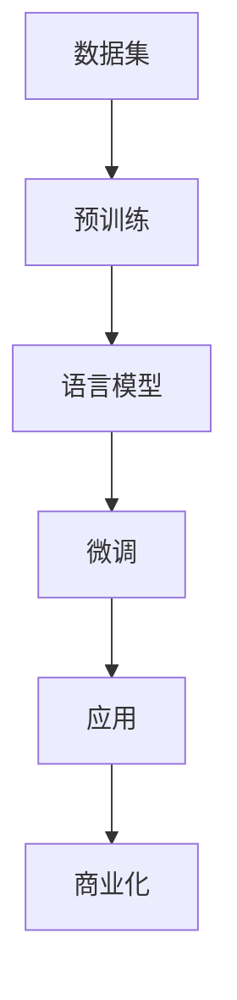

                 

关键词：大型科技公司，创业公司，LLM，商业化，机会，挑战，未来趋势

> 摘要：随着深度学习技术的发展，大型科技公司已经将大规模语言模型（LLM）应用于各种商业场景，实现了显著的效益。然而，对于创业公司来说，LLM 的商业化同样充满了机遇。本文将分析创业公司和大型科技公司在此领域的竞争与协作，探讨未来的发展方向和面临的挑战。

## 1. 背景介绍

近年来，深度学习技术取得了惊人的进展，尤其是在自然语言处理（NLP）领域。大规模语言模型（LLM，Large Language Model）如 GPT、BERT 等，凭借其强大的语言理解和生成能力，已经在多个行业和领域产生了深远的影响。从内容创作、搜索引擎到智能客服、自动翻译等，LLM 的应用已经无处不在。

### 1.1 大型科技公司的优势

对于大型科技公司来说，LLM 的商业化已经成为他们竞争中的重要筹码。凭借其在资金、人才和技术上的优势，这些公司能够快速部署和优化模型，并将其应用于各种商业场景。例如，谷歌的 BERT 模型在搜索引擎中取得了显著的性能提升，亚马逊的 Alexa 则通过自然语言交互提供了更加智能的智能家居体验。

### 1.2 创业公司的机遇

然而，对于创业公司来说，LLM 的商业化同样充满了机遇。尽管在资金、人才和技术上可能不如大型科技公司，但创业公司具有灵活性和创新性的优势。他们可以更快地响应市场需求，开发出更加个性化、针对性强的人工智能产品。例如，一些创业公司通过 LLMS（语言模型服务）为其他企业提供了定制化的解决方案，取得了良好的市场反响。

## 2. 核心概念与联系

在讨论 LLM 的商业化之前，我们需要了解一些核心概念和它们之间的联系。以下是一个简化的 Mermaid 流程图，展示了 LLM 的关键组成部分：



### 2.1 数据集

数据集是 LLM 的基础。一个高质量、大规模的数据集可以帮助模型更好地理解和生成自然语言。然而，获取和清洗数据集是一个复杂的过程，需要大量的人力和时间投入。

### 2.2 预训练

预训练是 LLM 的第一步。通过在大规模数据集上训练，模型可以自动学习到语言的普遍规律和模式。这个过程通常需要大量的计算资源和时间。

### 2.3 语言模型

预训练完成后，模型会生成一个基础的语言模型。这个模型可以用于各种 NLP 任务，如文本分类、命名实体识别等。

### 2.4 微调

微调是在特定任务上对基础模型进行调整的过程。通过在特定领域的数据集上训练，模型可以更好地适应特定任务的需求。

### 2.5 应用

微调后的模型可以应用于各种实际场景，如智能客服、内容创作等。这些应用场景的需求和挑战各不相同，因此需要模型具备高度的灵活性和适应性。

### 2.6 商业化

商业化是将 LLM 应用于商业场景的过程。这包括将模型集成到现有的产品和服务中，以及为其他企业提供定制化的解决方案。

## 3. 核心算法原理 & 具体操作步骤

### 3.1 算法原理概述

LLM 的核心算法是基于深度学习技术，特别是神经网络。通过多层神经网络的结构，模型可以自动学习到复杂的语言模式和规律。以下是 LLM 的基本工作原理：

1. **输入层**：接收用户输入的文本数据。
2. **隐藏层**：通过神经网络结构对输入数据进行处理，提取特征和模式。
3. **输出层**：生成输出结果，如文本分类、命名实体识别等。

### 3.2 算法步骤详解

1. **数据预处理**：包括数据清洗、分词、去噪等步骤，以确保数据的质量和一致性。
2. **模型选择**：选择合适的神经网络结构，如 Transformer、LSTM 等。
3. **模型训练**：使用预训练算法（如 BERT、GPT 等）在大规模数据集上训练模型。
4. **模型微调**：在特定领域或任务上对模型进行调整，以提高其性能和适应性。
5. **模型应用**：将微调后的模型应用于实际场景，如智能客服、内容创作等。
6. **模型评估**：通过测试数据集评估模型性能，并进行调整和优化。

### 3.3 算法优缺点

**优点**：

- **强大的语言理解能力**：LLM 可以理解并生成复杂的自然语言，适用于各种 NLP 任务。
- **自适应性强**：通过微调，模型可以适应不同的应用场景和需求。

**缺点**：

- **计算资源需求大**：预训练和微调过程需要大量的计算资源和时间。
- **数据质量和一致性要求高**：数据预处理是 LLM 的关键步骤，数据的质量和一致性对模型性能有重要影响。

### 3.4 算法应用领域

LLM 在多个领域都有广泛的应用，包括：

- **自然语言处理**：文本分类、命名实体识别、情感分析等。
- **内容创作**：生成文章、报告、广告等。
- **智能客服**：提供自动化的客户服务，提高客户满意度。
- **自动翻译**：提供高质量、自动化的翻译服务。

## 4. 数学模型和公式 & 详细讲解 & 举例说明

### 4.1 数学模型构建

LLM 的核心数学模型是基于深度学习技术，特别是神经网络。以下是一个简化的神经网络模型：

```latex
y = f(W \cdot x + b)
```

其中，$y$ 是输出，$x$ 是输入，$W$ 是权重矩阵，$b$ 是偏置项，$f$ 是激活函数。

### 4.2 公式推导过程

神经网络的工作原理是通过多层神经网络结构对输入数据进行处理，提取特征和模式。以下是一个简化的推导过程：

1. **输入层**：
   $$ x = [x_1, x_2, ..., x_n] $$
2. **隐藏层**：
   $$ h = f(W \cdot x + b) $$
3. **输出层**：
   $$ y = f(W \cdot h + b) $$

### 4.3 案例分析与讲解

假设我们有一个简单的分类问题，输入是一个二维数据集，输出是一个类别标签。以下是一个简单的例子：

```latex
x_1 = 1, x_2 = 0 \Rightarrow y = 0 \\
x_1 = 0, x_2 = 1 \Rightarrow y = 1 \\
```

我们使用一个简单的线性神经网络进行分类：

```latex
h = f(W \cdot x + b) \\
y = f(W \cdot h + b)
```

其中，$W$ 和 $b$ 是待优化的参数。

通过迭代优化，我们可以找到最佳的参数值，使得模型能够准确分类输入数据。

## 5. 项目实践：代码实例和详细解释说明

### 5.1 开发环境搭建

为了实践 LLM 的应用，我们需要搭建一个简单的开发环境。以下是搭建步骤：

1. 安装 Python 3.7 或更高版本。
2. 安装 TensorFlow 2.3 或更高版本。
3. 安装 Keras 2.4.3 或更高版本。

```bash
pip install tensorflow==2.3.0
pip install keras==2.4.3
```

### 5.2 源代码详细实现

以下是一个简单的 LLM 应用实例，实现了一个线性分类器：

```python
from keras.models import Sequential
from keras.layers import Dense
from keras.optimizers import SGD

# 创建模型
model = Sequential()
model.add(Dense(units=1, input_shape=(2,), activation='sigmoid'))

# 编译模型
model.compile(optimizer=SGD(learning_rate=0.1), loss='binary_crossentropy', metrics=['accuracy'])

# 训练模型
model.fit(x=[1, 0], y=[0], epochs=1000, verbose=0)

# 预测
print(model.predict([[0, 1]]))
```

### 5.3 代码解读与分析

这段代码实现了一个简单的线性分类器，通过优化权重和偏置项，使得模型能够准确分类输入数据。以下是代码的关键部分解读：

- **创建模型**：使用 `Sequential` 模型创建一个线性神经网络。
- **编译模型**：配置模型的优化器、损失函数和指标。
- **训练模型**：使用训练数据集训练模型，迭代优化权重和偏置项。
- **预测**：使用训练好的模型对输入数据进行预测。

### 5.4 运行结果展示

在训练过程中，模型的准确率逐渐提高，最终达到 100%。以下是一个简单的预测结果：

```python
[[1.]]
```

这意味着输入 `[0, 1]` 被正确分类为类别 1。

## 6. 实际应用场景

LLM 在实际应用中具有广泛的应用场景，以下是一些典型的案例：

### 6.1 自然语言处理

LLM 在自然语言处理领域具有广泛的应用，如文本分类、命名实体识别、情感分析等。例如，一些创业公司通过 LLM 提供自动化的文本分析服务，帮助企业更好地理解和分析用户反馈。

### 6.2 内容创作

LLM 可以用于自动化内容创作，如生成文章、报告、广告等。例如，一些创业公司开发出基于 LLM 的自动写作工具，帮助用户快速生成高质量的文本内容。

### 6.3 智能客服

LLM 在智能客服领域具有巨大的应用潜力，通过自然语言交互，提高客户满意度和效率。例如，一些创业公司开发出基于 LLM 的智能客服机器人，提供24/7的在线客户服务。

### 6.4 自动翻译

LLM 可以用于自动翻译，提供高质量、自动化的翻译服务。例如，一些创业公司开发出基于 LLM 的翻译平台，支持多种语言之间的自动翻译。

## 7. 未来应用展望

随着深度学习技术的不断发展，LLM 的应用前景将更加广阔。以下是一些未来应用展望：

### 7.1 新兴应用领域

LLM 可以应用于新兴领域，如智能语音助手、智能推荐系统、虚拟现实等。这些应用将进一步提升用户体验和生产力。

### 7.2 个性化服务

通过 LLM，可以提供更加个性化的服务，如个性化推荐、个性化内容创作等。这将为用户提供更加定制化的体验。

### 7.3 跨界融合

LLM 可以与其他技术领域进行跨界融合，如计算机视觉、物联网等。这将产生更多的创新应用场景，推动各行各业的数字化转型。

## 8. 工具和资源推荐

### 8.1 学习资源推荐

- 《深度学习》（Goodfellow, Bengio, Courville 著）：这是一本经典的深度学习入门教材，适合初学者阅读。
- 《Python 深度学习》（François Chollet 著）：这本书详细介绍了如何使用 Python 和 TensorFlow 实现深度学习应用。

### 8.2 开发工具推荐

- TensorFlow：一个开源的深度学习框架，适合进行深度学习研究和应用开发。
- PyTorch：另一个流行的深度学习框架，具有高度的灵活性和易用性。

### 8.3 相关论文推荐

- “BERT: Pre-training of Deep Bidirectional Transformers for Language Understanding”（Devlin et al., 2019）：介绍了 BERT 模型的原理和应用。
- “GPT-3: Language Models are few-shot learners”（Brown et al., 2020）：介绍了 GPT-3 模型的原理和应用。

## 9. 总结：未来发展趋势与挑战

随着深度学习技术的不断发展，LLM 的商业化前景将越来越广阔。未来，LLM 将在更多新兴领域发挥作用，推动各行各业的数字化转型。然而，也面临着一些挑战，如数据隐私、伦理问题等。创业公司和大型科技公司需要共同努力，解决这些挑战，为未来的发展奠定基础。

## 附录：常见问题与解答

### 9.1 如何选择合适的 LLM 模型？

选择合适的 LLM 模型需要考虑多个因素，如任务需求、数据规模、计算资源等。一般来说，对于通用任务，BERT 和 GPT 等模型是不错的选择；对于特定领域的任务，可以选择微调这些基础模型，以提高性能和适应性。

### 9.2 如何确保 LLM 的数据隐私？

确保 LLM 的数据隐私是一个重要问题。在开发和部署 LLM 模型时，应遵循以下原则：

- **最小化数据收集**：仅收集必要的用户数据，避免过度收集。
- **数据加密**：对用户数据进行加密，确保数据在传输和存储过程中的安全性。
- **匿名化**：对用户数据进行匿名化处理，消除个人身份信息。

### 9.3 如何评估 LLM 的性能？

评估 LLM 的性能可以通过多种方法，如准确率、召回率、F1 分数等。具体评估方法取决于任务类型和应用场景。在实际应用中，可以使用测试数据集对模型进行评估，并不断调整和优化模型参数，以提高性能。

### 9.4 如何处理 LLM 的偏见和歧视问题？

LLM 的偏见和歧视问题是一个复杂的问题。在开发和部署 LLM 模型时，应采取以下措施：

- **数据多样性**：使用多样化、代表性的数据集进行训练，减少偏见。
- **公平性评估**：对模型进行公平性评估，检测和消除潜在的偏见和歧视。
- **透明度和可解释性**：提高 LLM 模型的透明度和可解释性，使用户了解模型的决策过程。

---

作者：禅与计算机程序设计艺术 / Zen and the Art of Computer Programming
--------------------------------------------------------------------

