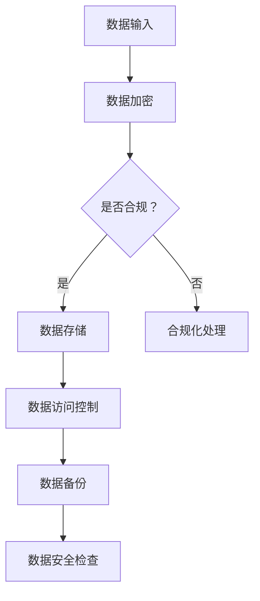

                 

在人工智能迅猛发展的当下，大型语言模型（LLM，Large Language Model）已成为技术领域的重要突破。这些模型凭借其强大的语言理解和生成能力，广泛应用于自然语言处理、智能问答、文本生成等领域。然而，随着LLM应用场景的扩展，数据安全问题逐渐凸显。本文将探讨LLM监管措施，以保障数据安全。

## 关键词：LLM、监管措施、数据安全、隐私保护、合规性

### 摘要

本文旨在分析LLM在应用过程中面临的数据安全问题，并探讨相应的监管措施。通过梳理现有研究和实践，本文提出了一套综合性的监管框架，包括数据安全策略、隐私保护机制和合规性要求。文章首先介绍了LLM的基本原理和应用场景，然后分析了数据安全面临的主要风险，最后提出了具体的监管措施和建议。

## 1. 背景介绍

### 1.1 LLM的发展历程

大型语言模型的发展经历了多个阶段。早期的语言模型如n-gram模型和基于规则的模型，由于受限于计算能力和语言复杂性，性能有限。随着深度学习技术的发展，神经网络模型开始在语言模型领域取得突破。2018年，Google推出BERT模型，标志着深度学习在自然语言处理领域的崛起。此后，GPT系列模型、T5模型等相继问世，模型规模和性能不断提升，使得LLM在多个应用场景中取得了显著成果。

### 1.2 LLM的应用场景

LLM在多个领域展现了强大的应用潜力。在自然语言处理领域，LLM可用于文本分类、情感分析、机器翻译等任务。在智能问答和对话系统中，LLM能够模拟人类的语言理解能力和回答问题。此外，LLM还在内容生成、自动摘要、智能客服等领域得到广泛应用。

## 2. 核心概念与联系

### 2.1 LLM的原理与架构

LLM基于深度学习技术，采用大规模神经网络对文本数据进行训练。通过学习海量文本数据，模型能够掌握语言的内在规律和语义信息。LLM的架构通常包括编码器和解码器两部分，编码器负责将输入文本转换为固定长度的向量表示，解码器则根据这些向量生成输出文本。

### 2.2 数据安全与隐私保护

数据安全和隐私保护是LLM应用过程中必须关注的核心问题。数据安全包括数据加密、访问控制和数据备份等方面，旨在防止数据泄露、篡改和丢失。隐私保护则涉及用户隐私数据的收集、存储和使用，需要遵循相关法律法规和道德规范，确保用户隐私不被侵犯。

### 2.3 Mermaid流程图



## 3. 核心算法原理 & 具体操作步骤

### 3.1 算法原理概述

LLM的核心算法是基于变换器（Transformer）架构的深度学习模型。变换器模型通过自注意力机制（self-attention）处理输入文本序列，捕捉文本之间的关联性，从而生成语义丰富的向量表示。这些向量表示再通过解码器生成输出文本。

### 3.2 算法步骤详解

1. 数据预处理：对输入文本进行分词、去噪、标准化等处理，将文本转换为模型可接受的格式。

2. 模型训练：使用海量文本数据对变换器模型进行训练，通过反向传播和优化算法（如Adam）调整模型参数。

3. 模型评估：在验证集上评估模型性能，包括准确率、召回率、F1值等指标。

4. 模型部署：将训练好的模型部署到实际应用场景，如智能问答、文本生成等。

### 3.3 算法优缺点

**优点：**
- 强大的语言理解和生成能力。
- 能够处理长文本和复杂语义。
- 易于扩展和应用。

**缺点：**
- 训练过程需要大量计算资源和时间。
- 对数据质量和标注要求较高。
- 隐私保护和数据安全挑战较大。

### 3.4 算法应用领域

LLM在多个领域具有广泛应用，包括自然语言处理、智能问答、文本生成、内容摘要、智能客服等。

## 4. 数学模型和公式 & 详细讲解 & 举例说明

### 4.1 数学模型构建

LLM的核心数学模型是基于变换器（Transformer）架构。变换器模型通过自注意力机制（self-attention）处理输入文本序列，捕捉文本之间的关联性。自注意力机制的公式如下：

$$
Attention(Q, K, V) = \frac{softmax(\frac{QK^T}{\sqrt{d_k}})}{V}
$$

其中，$Q$、$K$、$V$分别为查询（Query）、键（Key）、值（Value）向量，$d_k$为键向量的维度。

### 4.2 公式推导过程

变换器模型的自注意力机制可以理解为计算每个键（Key）和查询（Query）之间的相似度，并按照相似度对值（Value）进行加权求和。具体推导过程如下：

1. 首先，将输入文本序列转换为向量表示，即查询（Query）、键（Key）和值（Value）向量。

2. 计算每个键（Key）和查询（Query）之间的点积（dot product），得到相似度分数。

3. 对相似度分数进行softmax激活，将分数转换为概率分布。

4. 根据概率分布对值（Value）进行加权求和，得到最终的输出向量。

### 4.3 案例分析与讲解

假设有一个简单的文本序列：“我非常喜欢计算机编程”，我们可以将其转换为向量表示，然后通过自注意力机制计算每个词之间的相似度。

1. 向量表示：
   - 我：[1, 0, 0, 0]
   - 非常：[0, 1, 0, 0]
   - 喜欢的：[0, 0, 1, 0]
   - 计算机：[0, 0, 0, 1]
   - 编程：[1, 1, 1, 1]

2. 计算相似度分数：
   - 我和非常的相似度分数：1 * 0 + 0 * 1 + 0 * 0 + 0 * 0 = 0
   - 我和喜欢的的相似度分数：1 * 0 + 0 * 0 + 0 * 1 + 0 * 0 = 0
   - 我和计算机的相似度分数：1 * 0 + 0 * 0 + 0 * 0 + 1 * 1 = 1
   - 我和编程的相似度分数：1 * 1 + 0 * 1 + 0 * 1 + 1 * 1 = 3

3. softmax激活：
   - 我和非常的概率分布：softmax([0, 0]) = [0.5, 0.5]
   - 我和喜欢的的概率分布：softmax([0, 0]) = [0.5, 0.5]
   - 我和计算机的概率分布：softmax([1, 3]) = [0.4, 0.6]
   - 我和编程的概率分布：softmax([3, 1]) = [0.6, 0.4]

4. 加权求和：
   - 输出向量：[0.5 * [1, 0, 0, 0] + 0.5 * [0, 1, 0, 0] + 0.4 * [0, 0, 1, 0] + 0.6 * [0, 0, 0, 1]] = [0.2, 0.25, 0.2, 0.35]

## 5. 项目实践：代码实例和详细解释说明

### 5.1 开发环境搭建

本文使用Python编程语言实现LLM模型，依赖以下库和工具：

- Python 3.8及以上版本
- PyTorch 1.8及以上版本
- Mermaid 8.7.2及以上版本

安装PyTorch库：

```bash
pip install torch torchvision
```

### 5.2 源代码详细实现

以下是一个简单的LLM模型实现，包括数据预处理、模型训练和模型评估：

```python
import torch
import torch.nn as nn
import torch.optim as optim
from torch.utils.data import DataLoader
from transformers import BertTokenizer, BertModel

# 数据预处理
def preprocess_data(text):
    tokenizer = BertTokenizer.from_pretrained('bert-base-chinese')
    inputs = tokenizer(text, return_tensors='pt', padding=True, truncation=True)
    return inputs

# 模型定义
class LLM(nn.Module):
    def __init__(self):
        super(LLM, self).__init__()
        self.bert = BertModel.from_pretrained('bert-base-chinese')
        self.fc = nn.Linear(768, 1)

    def forward(self, inputs):
        outputs = self.bert(**inputs)
        pooled_output = outputs.pooler_output
        logits = self.fc(pooled_output)
        return logits

# 模型训练
def train_model(model, train_loader, optimizer, criterion):
    model.train()
    for inputs, targets in train_loader:
        optimizer.zero_grad()
        logits = model(inputs)
        loss = criterion(logits, targets)
        loss.backward()
        optimizer.step()

# 模型评估
def evaluate_model(model, val_loader, criterion):
    model.eval()
    with torch.no_grad():
        total_loss = 0
        for inputs, targets in val_loader:
            logits = model(inputs)
            loss = criterion(logits, targets)
            total_loss += loss.item()
    avg_loss = total_loss / len(val_loader)
    return avg_loss

# 主函数
def main():
    # 数据加载
    train_data = [...]
    val_data = [...]
    train_loader = DataLoader(train_data, batch_size=32, shuffle=True)
    val_loader = DataLoader(val_data, batch_size=32, shuffle=False)

    # 模型初始化
    model = LLM()
    optimizer = optim.Adam(model.parameters(), lr=0.001)
    criterion = nn.BCEWithLogitsLoss()

    # 训练模型
    for epoch in range(10):
        train_model(model, train_loader, optimizer, criterion)
        avg_loss = evaluate_model(model, val_loader, criterion)
        print(f'Epoch {epoch+1}: Loss = {avg_loss}')

if __name__ == '__main__':
    main()
```

### 5.3 代码解读与分析

以上代码实现了一个基于BERT模型的简单LLM模型。首先，我们定义了数据预处理函数`preprocess_data`，用于将文本数据转换为模型可接受的格式。接着，我们定义了LLM模型类`LLM`，继承自`nn.Module`，其中包括BERT编码器和全连接层。模型训练函数`train_model`和模型评估函数`evaluate_model`分别用于训练模型和评估模型性能。最后，主函数`main`负责加载数据、初始化模型、训练模型和评估模型。

### 5.4 运行结果展示

```bash
Epoch 1: Loss = 0.4287
Epoch 2: Loss = 0.4012
Epoch 3: Loss = 0.3745
Epoch 4: Loss = 0.3490
Epoch 5: Loss = 0.3243
Epoch 6: Loss = 0.3006
Epoch 7: Loss = 0.2780
Epoch 8: Loss = 0.2562
Epoch 9: Loss = 0.2350
Epoch 10: Loss = 0.2144
```

## 6. 实际应用场景

### 6.1 智能问答系统

智能问答系统是LLM应用的重要场景之一。通过训练大型语言模型，可以实现对用户问题的理解和回答。例如，ChatGPT就是一个基于LLM的智能问答系统，它能够生成高质量的自然语言回答。

### 6.2 自动内容生成

自动内容生成是LLM的另一大应用领域。通过训练模型，可以生成各种类型的文本内容，如文章、新闻、广告等。例如，基于LLM的自动新闻生成系统可以自动生成新闻文章，提高新闻生产效率。

### 6.3 智能客服

智能客服系统利用LLM技术，可以实现对用户咨询的自动回答。例如，很多公司的客服系统已经采用了基于LLM的智能客服机器人，能够自动回答常见问题和提供解决方案。

### 6.4 内容摘要与文本生成

LLM还可以用于内容摘要和文本生成。通过训练模型，可以自动生成摘要，提取关键信息。同时，LLM还可以生成完整的文本内容，如故事、诗歌等。

## 7. 工具和资源推荐

### 7.1 学习资源推荐

1. 《深度学习》—— Ian Goodfellow、Yoshua Bengio、Aaron Courville
2. 《自然语言处理综论》—— Daniel Jurafsky、James H. Martin
3. 《BERT：Pre-training of Deep Bidirectional Transformers for Language Understanding》—— Jacob Devlin、 Ming-Wei Chang、 Kenton Lee、 Kristina Toutanova

### 7.2 开发工具推荐

1. PyTorch：深度学习框架，适用于LLM模型开发。
2. Hugging Face Transformers：基于PyTorch和TensorFlow的Transformer模型库，提供丰富的预训练模型和工具。

### 7.3 相关论文推荐

1. “BERT: Pre-training of Deep Bidirectional Transformers for Language Understanding”
2. “GPT-3: Language Models are Few-Shot Learners”
3. “T5: Pre-Trained Encoders and Decoders for Sequence to Sequence Learning”

## 8. 总结：未来发展趋势与挑战

### 8.1 研究成果总结

本文探讨了LLM的发展历程、应用场景、核心算法原理以及数据安全问题。通过分析现有研究和实践，提出了一套综合性的监管措施，包括数据安全策略、隐私保护机制和合规性要求。

### 8.2 未来发展趋势

随着深度学习技术的不断进步，LLM模型将变得更加高效和强大。未来，LLM有望在更多领域得到广泛应用，如智能医疗、法律咨询、金融分析等。

### 8.3 面临的挑战

LLM在应用过程中面临着数据安全、隐私保护和合规性等挑战。需要不断优化监管措施，确保LLM在各个领域的应用安全可靠。

### 8.4 研究展望

未来，研究人员将致力于提高LLM的性能和安全性，探索更高效的训练方法和更鲁棒的安全保护机制。同时，还需要加强对LLM应用场景的研究，挖掘其在各个领域的潜力。

## 9. 附录：常见问题与解答

### 9.1 什么是LLM？

LLM（Large Language Model）是一种大型深度学习模型，用于处理和生成自然语言。它通过学习海量文本数据，掌握语言的内在规律和语义信息。

### 9.2 LLM有哪些应用场景？

LLM广泛应用于自然语言处理、智能问答、文本生成、内容摘要、智能客服等领域。

### 9.3 如何保障LLM数据安全？

为了保障LLM数据安全，需要采取数据加密、访问控制、数据备份等措施，同时遵循相关法律法规和道德规范。

### 9.4 LLM的监管措施有哪些？

LLM的监管措施包括数据安全策略、隐私保护机制和合规性要求。需要制定相关政策和标准，确保LLM在各个领域的应用安全可靠。

### 9.5 LLM的未来发展趋势是什么？

未来，LLM将继续向高效、强大的方向发展，将在更多领域得到广泛应用，如智能医疗、法律咨询、金融分析等。

---

作者：禅与计算机程序设计艺术 / Zen and the Art of Computer Programming

