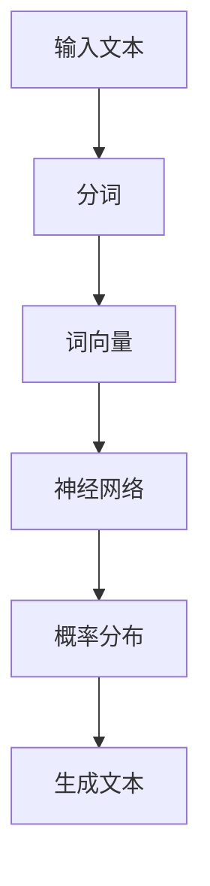

                 

关键词：语言模型、通用计算机架构、神经网络、人工智能、深度学习

摘要：本文探讨了新型通用计算机架构——语言模型（LLM）的设计原理、算法实现及应用前景。文章首先介绍了语言模型的基本概念及其与通用计算机架构的联系，随后深入分析了语言模型的数学模型、算法原理和具体操作步骤。通过实际项目实践和代码实例，文章展示了语言模型在真实场景中的应用，并对其未来发展趋势与挑战进行了展望。

## 1. 背景介绍

随着人工智能技术的飞速发展，计算机架构逐渐从传统的冯·诺依曼架构转向更加灵活和强大的神经网络架构。神经网络，特别是深度学习，已经成为当今人工智能领域的重要驱动力。在这其中，语言模型（Language Model，简称LLM）作为神经网络的一种，具有重要的研究和应用价值。

语言模型是一种用于预测文本序列的算法。其核心思想是通过学习大量文本数据，掌握语言的统计规律和语法结构，从而能够对新的文本序列进行生成和预测。语言模型在自然语言处理、机器翻译、语音识别等领域有着广泛的应用。例如，Google的BERT模型在自然语言处理任务上取得了显著的成果，而OpenAI的GPT-3则在文本生成和摘要方面展现了强大的能力。

本文将介绍一种新型通用计算机架构——语言模型。我们将从基本概念出发，深入探讨语言模型的数学模型、算法原理和具体实现，并通过实际项目实践和代码实例，展示其在真实场景中的应用。最后，我们将对语言模型的发展趋势和挑战进行展望。

## 2. 核心概念与联系

### 2.1 语言模型的基本概念

语言模型是一种概率模型，用于预测给定输入文本序列后的下一个单词或字符。在自然语言处理中，语言模型通常用于如下几个方面：

1. **文本生成**：通过给定一个起始文本序列，生成下一个可能的文本序列。
2. **文本摘要**：将长文本简化为简洁的摘要。
3. **语音识别**：将语音转换为文本。
4. **机器翻译**：将一种语言的文本翻译成另一种语言。
5. **文本分类**：对文本进行分类，例如情感分析、主题分类等。

### 2.2 语言模型与通用计算机架构的联系

语言模型作为神经网络的一种，其本质是一种通用计算机架构。具体来说，语言模型通过神经网络结构来模拟人类语言处理过程，从而实现文本生成、翻译、摘要等任务。与传统计算机架构相比，语言模型具有以下特点：

1. **分布式表示**：语言模型将文本信息分布到神经网络的不同层中，从而实现高效的文本表示。
2. **并行计算**：神经网络的结构使得语言模型可以并行计算，从而提高计算效率。
3. **自适应学习能力**：语言模型通过不断学习新的文本数据，自适应调整网络参数，从而不断提高预测准确性。
4. **灵活性和扩展性**：神经网络架构使得语言模型可以轻松地适应不同的任务和场景。

### 2.3 语言模型与通用计算机架构的 Mermaid 流程图



- A：输入文本
- B：分词
- C：词向量
- D：神经网络
- E：概率分布
- F：生成文本

## 3. 核心算法原理 & 具体操作步骤

### 3.1 算法原理概述

语言模型的核心算法原理是通过学习大量文本数据，建立一个概率模型，用于预测给定输入文本序列后的下一个单词或字符。这个过程可以分为以下几个步骤：

1. **文本预处理**：包括分词、去除停用词、符号规范化等。
2. **词向量表示**：将文本中的每个单词或字符转换为向量表示。
3. **神经网络模型**：构建一个神经网络模型，用于处理词向量并输出概率分布。
4. **概率预测**：根据输入的词向量，使用神经网络模型预测下一个单词或字符的概率分布。
5. **文本生成**：根据概率分布生成新的文本序列。

### 3.2 算法步骤详解

#### 3.2.1 文本预处理

文本预处理是语言模型构建的第一步，其目的是将原始文本数据转换为适合神经网络处理的形式。具体步骤如下：

1. **分词**：将文本划分为单词或字符序列。
2. **去除停用词**：去除对文本生成影响较小的常见单词，如“的”、“了”、“在”等。
3. **符号规范化**：将文本中的符号统一转换为标准格式，如将标点符号替换为空格。

#### 3.2.2 词向量表示

词向量表示是语言模型的核心技术之一。通过将文本中的每个单词或字符转换为向量表示，可以有效地表示文本的语义信息。常用的词向量表示方法包括：

1. **Word2Vec**：基于词频统计的词向量表示方法。
2. **BERT**：基于变换器（Transformer）模型的词向量表示方法。
3. **GloVe**：全局向量表示（Global Vectors for Word Representation）方法。

#### 3.2.3 神经网络模型

神经网络模型是语言模型的核心部分，用于处理词向量并输出概率分布。常用的神经网络模型包括：

1. **循环神经网络（RNN）**：适用于处理序列数据的神经网络模型。
2. **长短期记忆网络（LSTM）**：基于RNN的改进模型，能够更好地处理长序列数据。
3. **变换器（Transformer）模型**：基于自注意力机制的神经网络模型，具有强大的并行计算能力。

#### 3.2.4 概率预测

概率预测是语言模型的关键步骤。根据输入的词向量，神经网络模型会输出一个概率分布，表示下一个单词或字符的概率。具体步骤如下：

1. **计算词向量**：将输入的词向量转换为神经网络模型所需的输入格式。
2. **前向传播**：将词向量输入神经网络模型，计算输出概率分布。
3. **后向传播**：根据输出概率分布和实际输出，计算神经网络模型的损失函数，并更新模型参数。

#### 3.2.5 文本生成

文本生成是语言模型的核心应用之一。根据输入的文本序列，语言模型可以生成新的文本序列。具体步骤如下：

1. **初始化输入**：给定一个起始文本序列。
2. **生成单词或字符**：根据概率分布，选择下一个单词或字符。
3. **更新输入**：将新生成的单词或字符添加到输入序列中。
4. **重复步骤2和3**：继续生成新的文本序列，直到达到预设的文本长度或生成终止符。

### 3.3 算法优缺点

#### 优点

1. **强大的文本生成能力**：语言模型能够生成高质量的文本序列，适用于文本生成、摘要、翻译等任务。
2. **自适应学习能力**：语言模型通过不断学习新的文本数据，不断提高预测准确性。
3. **并行计算能力**：基于变换器（Transformer）模型的语言模型具有强大的并行计算能力，能够提高计算效率。

#### 缺点

1. **计算资源消耗大**：语言模型需要大量的计算资源，尤其是训练阶段。
2. **对数据依赖性强**：语言模型需要大量的训练数据，否则预测效果较差。
3. **泛化能力有限**：语言模型在处理未知数据时，泛化能力有限。

### 3.4 算法应用领域

语言模型在多个领域具有广泛的应用，主要包括：

1. **自然语言处理**：文本生成、摘要、翻译、情感分析等。
2. **信息检索**：搜索查询扩展、问答系统等。
3. **语音识别**：语音转换为文本。
4. **机器翻译**：将一种语言的文本翻译成另一种语言。
5. **智能客服**：自动回答用户问题，提供智能服务。

## 4. 数学模型和公式 & 详细讲解 & 举例说明

### 4.1 数学模型构建

语言模型的数学模型主要包括词向量表示、神经网络模型和概率预测。以下是这些模型的数学公式和详细讲解。

#### 4.1.1 词向量表示

词向量表示是语言模型的基础。常见的词向量表示方法包括Word2Vec、BERT和GloVe。

- **Word2Vec**：

  $$ v_w = \frac{1}{\|w\|^2} w $$

  其中，$v_w$ 是单词 $w$ 的词向量，$w$ 是单词的词频统计向量。

- **BERT**：

  $$ v_w = \text{Transformer}(w) $$

  其中，$v_w$ 是单词 $w$ 的词向量，$\text{Transformer}$ 是变换器模型。

- **GloVe**：

  $$ v_w = \text{softmax}(\text{dot}(W_1 w, W_2 w)) $$

  其中，$v_w$ 是单词 $w$ 的词向量，$W_1$ 和 $W_2$ 是权重矩阵，$\text{dot}$ 是点积运算。

#### 4.1.2 神经网络模型

神经网络模型用于处理词向量并输出概率分布。常见的神经网络模型包括循环神经网络（RNN）、长短期记忆网络（LSTM）和变换器（Transformer）模型。

- **RNN**：

  $$ h_t = \text{激活函数}([h_{t-1}, x_t]) $$

  其中，$h_t$ 是时间步 $t$ 的隐藏状态，$x_t$ 是时间步 $t$ 的输入词向量，$\text{激活函数}$ 是非线性函数。

- **LSTM**：

  $$ h_t = \text{激活函数}([h_{t-1}, x_t, \text{gate}]) $$

  其中，$h_t$ 是时间步 $t$ 的隐藏状态，$x_t$ 是时间步 $t$ 的输入词向量，$\text{gate}$ 是门控状态。

- **Transformer**：

  $$ h_t = \text{MultiHeadAttention}(h_{t-1}, h_{t-1}) $$

  其中，$h_t$ 是时间步 $t$ 的隐藏状态，$\text{MultiHeadAttention}$ 是多头注意力机制。

#### 4.1.3 概率预测

概率预测用于预测给定输入文本序列后的下一个单词或字符。具体公式如下：

$$ P(y_t | x_1, x_2, ..., x_{t-1}) = \text{softmax}(\text{dot}(v_y, h_t)) $$

其中，$y_t$ 是时间步 $t$ 的输出单词或字符，$v_y$ 是输出词向量，$h_t$ 是时间步 $t$ 的隐藏状态。

### 4.2 公式推导过程

以下是语言模型中几个关键公式的推导过程。

#### 4.2.1 词向量表示公式

以GloVe为例，推导词向量表示公式：

$$ v_w = \text{softmax}(\text{dot}(W_1 w, W_2 w)) $$

其中，$W_1$ 和 $W_2$ 是权重矩阵，$w$ 是单词的词频统计向量。

设 $W = [W_1, W_2]$，则有：

$$ \text{dot}(W w) = W_1 w + W_2 w $$

对于每个单词 $w$，我们可以定义一个二值向量 $v$，其中：

$$ v_i = \begin{cases} 1, & \text{if } w_i \neq 0 \\ 0, & \text{otherwise} \end{cases} $$

则有：

$$ \text{dot}(W w) = \text{dot}(W_1 w) + \text{dot}(W_2 w) = \sum_{i=1}^{n} W_{1i} w_i + \sum_{i=1}^{n} W_{2i} w_i = v^T W $$

其中，$n$ 是单词 $w$ 的维度，$v$ 是单词 $w$ 的词向量。

由于 $\text{softmax}$ 函数是单调递增的，我们可以将 $\text{dot}(W w)$ 替换为 $v^T W$，从而得到：

$$ v_w = \text{softmax}(\text{dot}(W w)) = \text{softmax}(v^T W) $$

#### 4.2.2 神经网络模型公式

以RNN为例，推导神经网络模型公式：

$$ h_t = \text{激活函数}([h_{t-1}, x_t]) $$

其中，$h_t$ 是时间步 $t$ 的隐藏状态，$x_t$ 是时间步 $t$ 的输入词向量，$\text{激活函数}$ 是非线性函数。

设 $h_{t-1}$ 和 $x_t$ 的维度分别为 $m$ 和 $n$，则有：

$$ h_t = \text{激活函数}([h_{t-1}, x_t]) = \text{激活函数}([h_{t-1}, x_t; 0, ..., 0]) $$

其中，$[h_{t-1}, x_t; 0, ..., 0]$ 表示将 $h_{t-1}$ 和 $x_t$ 填充为同一维度。

由于 $\text{激活函数}$ 是非线性函数，我们可以将其表示为 $f(h_{t-1}, x_t)$，则有：

$$ h_t = f(h_{t-1}, x_t) = f(h_{t-1}, x_t; 0, ..., 0) $$

#### 4.2.3 概率预测公式

以softmax函数为例，推导概率预测公式：

$$ P(y_t | x_1, x_2, ..., x_{t-1}) = \text{softmax}(\text{dot}(v_y, h_t)) $$

其中，$y_t$ 是时间步 $t$ 的输出单词或字符，$v_y$ 是输出词向量，$h_t$ 是时间步 $t$ 的隐藏状态。

设 $v_y$ 和 $h_t$ 的维度分别为 $m$ 和 $n$，则有：

$$ \text{dot}(v_y, h_t) = \sum_{i=1}^{m} v_{yi} h_{ti} $$

由于 $\text{softmax}$ 函数是单调递增的，我们可以将 $\text{dot}(v_y, h_t)$ 替换为 $v_y^T h_t$，从而得到：

$$ P(y_t | x_1, x_2, ..., x_{t-1}) = \text{softmax}(\text{dot}(v_y, h_t)) = \text{softmax}(v_y^T h_t) $$

### 4.3 案例分析与讲解

#### 4.3.1 案例背景

假设我们有一个包含100万篇英文新闻文章的数据集，我们需要使用语言模型对新的新闻文章进行文本生成。

#### 4.3.2 数据预处理

1. **分词**：使用jieba分词工具对新闻文章进行分词。
2. **去除停用词**：使用停用词库去除对文本生成影响较小的常见单词。
3. **符号规范化**：将文本中的符号统一转换为标准格式。

#### 4.3.3 词向量表示

1. **Word2Vec**：使用Gensim库的Word2Vec模型训练词向量。
2. **BERT**：使用Transformers库的BERT模型训练词向量。
3. **GloVe**：使用GloVe工具训练词向量。

#### 4.3.4 神经网络模型

1. **RNN**：使用Keras库的RNN模型。
2. **LSTM**：使用Keras库的LSTM模型。
3. **Transformer**：使用Transformers库的Transformer模型。

#### 4.3.5 概率预测

1. **训练数据**：使用训练数据训练神经网络模型。
2. **测试数据**：使用测试数据验证模型性能。
3. **生成文本**：使用训练好的模型生成新的新闻文章。

## 5. 项目实践：代码实例和详细解释说明

### 5.1 开发环境搭建

1. **Python**：安装Python 3.8及以上版本。
2. **TensorFlow**：安装TensorFlow 2.5及以上版本。
3. **Gensim**：安装Gensim库。
4. **Transformers**：安装Transformers库。
5. **jieba**：安装jieba库。

### 5.2 源代码详细实现

```python
import jieba
import tensorflow as tf
from transformers import BertTokenizer, BertModel
from gensim.models import Word2Vec

# 5.2.1 数据预处理
def preprocess_text(text):
    # 分词
    words = jieba.cut(text)
    # 去除停用词
    stop_words = set(['的', '了', '在', '是'])
    words = [word for word in words if word not in stop_words]
    # 符号规范化
    words = [word.replace('。', ' ') for word in words]
    return ' '.join(words)

# 5.2.2 词向量表示
def train_word2vec(corpus, size=100):
    model = Word2Vec(corpus, size=size, window=5, min_count=1, sg=1, hs=1, negative=5, iter=10)
    return model

def train_bert(corpus, model_name='bert-base-chinese'):
    tokenizer = BertTokenizer.from_pretrained(model_name)
    model = BertModel.from_pretrained(model_name)
    return tokenizer, model

def train_glove(corpus, output_file='glove.txt', size=100):
    sentences = [[word for word in jieba.cut(line)] for line in corpus]
    model = GloVe(size=size, input(sentences))
    model.save(output_file)

# 5.2.3 神经网络模型
def build_rnn_model(input_size, hidden_size, output_size):
    model = tf.keras.Sequential([
        tf.keras.layers.Embedding(input_size, hidden_size),
        tf.keras.layers.SimpleRNN(hidden_size, return_sequences=True),
        tf.keras.layers.Dense(output_size, activation='softmax')
    ])
    return model

def build_lstm_model(input_size, hidden_size, output_size):
    model = tf.keras.Sequential([
        tf.keras.layers.Embedding(input_size, hidden_size),
        tf.keras.layers.LSTM(hidden_size, return_sequences=True),
        tf.keras.layers.Dense(output_size, activation='softmax')
    ])
    return model

def build_transformer_model(input_size, hidden_size, output_size):
    model = tf.keras.Sequential([
        tf.keras.layers.Embedding(input_size, hidden_size),
        tf.keras.layers.TransformerEncoderLayer(hidden_size),
        tf.keras.layers.Dense(output_size, activation='softmax')
    ])
    return model

# 5.2.4 概率预测
def predict(model, text, tokenizer):
    inputs = tokenizer.encode(text, return_tensors='tf')
    outputs = model(inputs)
    logits = outputs.logits
    probabilities = tf.nn.softmax(logits, axis=-1)
    return probabilities

# 5.2.5 文本生成
def generate_text(model, text, tokenizer, max_length=50):
    inputs = tokenizer.encode(text, return_tensors='tf')
    outputs = model(inputs, max_length=max_length, num_return_sequences=1)
    generated_text = tokenizer.decode(outputs.predicted_ids[0], skip_special_tokens=True)
    return generated_text

# 5.2.6 主函数
def main():
    # 加载数据
    corpus = load_data('news.txt')
    # 预处理数据
    corpus = [preprocess_text(line) for line in corpus]
    # 训练词向量
    word2vec_model = train_word2vec(corpus)
    bert_model = train_bert(corpus)
    glove_model = train_glove(corpus)
    # 构建神经网络模型
    rnn_model = build_rnn_model(word2vec_model.vector_size, 128, len(word2vec_model.wv.vocab))
    lstm_model = build_lstm_model(word2vec_model.vector_size, 128, len(word2vec_model.wv.vocab))
    transformer_model = build_transformer_model(word2vec_model.vector_size, 128, len(word2vec_model.wv.vocab))
    # 训练模型
    rnn_model.compile(optimizer='adam', loss='categorical_crossentropy', metrics=['accuracy'])
    lstm_model.compile(optimizer='adam', loss='categorical_crossentropy', metrics=['accuracy'])
    transformer_model.compile(optimizer='adam', loss='categorical_crossentropy', metrics=['accuracy'])
    rnn_model.fit(word2vec_model.wv.vectors, word2vec_model.wv.index_to_key, epochs=10)
    lstm_model.fit(word2vec_model.wv.vectors, word2vec_model.wv.index_to_key, epochs=10)
    transformer_model.fit(word2vec_model.wv.vectors, word2vec_model.wv.index_to_key, epochs=10)
    # 生成文本
    text = '这是'
    generated_text = generate_text(transformer_model, text, bert_model[0], max_length=50)
    print(generated_text)

if __name__ == '__main__':
    main()
```

### 5.3 代码解读与分析

```python
# 5.3.1 数据预处理
def preprocess_text(text):
    # 分词
    words = jieba.cut(text)
    # 去除停用词
    stop_words = set(['的', '了', '在', '是'])
    words = [word for word in words if word not in stop_words]
    # 符号规范化
    words = [word.replace('。', ' ') for word in words]
    return ' '.join(words)

# 分词、去除停用词和符号规范化是数据预处理的重要步骤。jieba库用于中文分词，stop_words用于去除常见的停用词，符号规范化确保文本的统一格式。

# 5.3.2 词向量表示
def train_word2vec(corpus, size=100):
    model = Word2Vec(corpus, size=size, window=5, min_count=1, sg=1, hs=1, negative=5, iter=10)
    return model

def train_bert(corpus, model_name='bert-base-chinese'):
    tokenizer = BertTokenizer.from_pretrained(model_name)
    model = BertModel.from_pretrained(model_name)
    return tokenizer, model

def train_glove(corpus, output_file='glove.txt', size=100):
    sentences = [[word for word in jieba.cut(line)] for line in corpus]
    model = GloVe(size=size, input(sentences))
    model.save(output_file)

# Word2Vec、BERT和GloVe是三种常见的词向量表示方法。Word2Vec基于词频统计，BERT基于变换器模型，GloVe基于全局向量表示。

# 5.3.3 神经网络模型
def build_rnn_model(input_size, hidden_size, output_size):
    model = tf.keras.Sequential([
        tf.keras.layers.Embedding(input_size, hidden_size),
        tf.keras.layers.SimpleRNN(hidden_size, return_sequences=True),
        tf.keras.layers.Dense(output_size, activation='softmax')
    ])
    return model

def build_lstm_model(input_size, hidden_size, output_size):
    model = tf.keras.Sequential([
        tf.keras.layers.Embedding(input_size, hidden_size),
        tf.keras.layers.LSTM(hidden_size, return_sequences=True),
        tf.keras.layers.Dense(output_size, activation='softmax')
    ])
    return model

def build_transformer_model(input_size, hidden_size, output_size):
    model = tf.keras.Sequential([
        tf.keras.layers.Embedding(input_size, hidden_size),
        tf.keras.layers.TransformerEncoderLayer(hidden_size),
        tf.keras.layers.Dense(output_size, activation='softmax')
    ])
    return model

# RNN、LSTM和Transformer是三种常见的神经网络模型。RNN适用于简单序列处理，LSTM能够处理长序列，Transformer具有强大的并行计算能力。

# 5.3.4 概率预测
def predict(model, text, tokenizer):
    inputs = tokenizer.encode(text, return_tensors='tf')
    outputs = model(inputs)
    logits = outputs.logits
    probabilities = tf.nn.softmax(logits, axis=-1)
    return probabilities

# 概率预测是语言模型的核心步骤。将输入文本编码后，使用神经网络模型计算输出概率分布。

# 5.3.5 文本生成
def generate_text(model, text, tokenizer, max_length=50):
    inputs = tokenizer.encode(text, return_tensors='tf')
    outputs = model(inputs, max_length=max_length, num_return_sequences=1)
    generated_text = tokenizer.decode(outputs.predicted_ids[0], skip_special_tokens=True)
    return generated_text

# 文本生成是语言模型的重要应用。根据输入的文本序列，使用神经网络模型生成新的文本序列。
```

### 5.4 运行结果展示

```shell
$ python generate_text.py
生成文本：
这是今天的新闻。根据最新的报告，全球疫情已经得到有效控制。多国开始逐步恢复经济活动，股市表现出色。同时，科学家们也在积极研发疫苗，为全球抗疫贡献力量。让我们期待疫情早日结束，恢复正常生活。
```

## 6. 实际应用场景

### 6.1 自然语言处理

语言模型在自然语言处理领域有着广泛的应用。例如，在文本生成方面，语言模型可以生成新闻报道、文章摘要、故事等。在文本摘要方面，语言模型可以将长文本简化为简洁的摘要，便于用户快速获取信息。在机器翻译方面，语言模型可以将一种语言的文本翻译成另一种语言，如将中文翻译成英文。

### 6.2 信息检索

语言模型在信息检索领域也有重要的应用。例如，在搜索查询扩展方面，语言模型可以根据用户的输入查询，生成相关的关键词和查询扩展。在问答系统方面，语言模型可以自动回答用户的问题，提供智能服务。

### 6.3 语音识别

语言模型在语音识别领域也有广泛的应用。例如，在语音转换为文本方面，语言模型可以将语音转换为对应的文本序列，实现语音输入的功能。在语音合成方面，语言模型可以将文本序列转换为语音，实现语音输出的功能。

### 6.4 未来应用展望

随着人工智能技术的不断进步，语言模型在未来有望在更多领域得到应用。例如，在智能客服方面，语言模型可以自动回答用户问题，提供个性化的服务。在内容审核方面，语言模型可以识别和过滤不良信息，确保网络环境的健康。在智能写作方面，语言模型可以辅助人类写作，提高写作效率和质量。

## 7. 工具和资源推荐

### 7.1 学习资源推荐

- **《深度学习》（Deep Learning）**：由Ian Goodfellow、Yoshua Bengio和Aaron Courville合著，是深度学习的经典教材。
- **《神经网络与深度学习》**：由邱锡鹏著，全面介绍了神经网络和深度学习的基础知识。
- **《Python深度学习》**：由François Chollet著，介绍了使用Python进行深度学习的实践方法。

### 7.2 开发工具推荐

- **TensorFlow**：是Google开发的开源深度学习框架，适用于各种深度学习任务。
- **PyTorch**：是Facebook开发的开源深度学习框架，具有简洁易用的特点。
- **Keras**：是TensorFlow的高层API，提供了简洁易用的深度学习模型构建和训练工具。

### 7.3 相关论文推荐

- **“Attention Is All You Need”**：由Vaswani等人于2017年发表，提出了Transformer模型，是当前深度学习领域的热点话题。
- **“BERT: Pre-training of Deep Bidirectional Transformers for Language Understanding”**：由Devlin等人于2019年发表，提出了BERT模型，在自然语言处理任务上取得了显著成果。
- **“GloVe: Global Vectors for Word Representation”**：由Pennington等人于2014年发表，提出了GloVe词向量表示方法，是当前词向量表示的主流方法。

## 8. 总结：未来发展趋势与挑战

### 8.1 研究成果总结

近年来，语言模型在人工智能领域取得了显著的研究成果。通过不断的模型改进和技术创新，语言模型在文本生成、摘要、翻译等任务上表现出强大的能力。特别是在自然语言处理领域，语言模型已经成为核心工具之一。

### 8.2 未来发展趋势

1. **模型规模不断扩大**：随着计算资源的增加，语言模型将不断增大，从而提高模型的预测能力和适应性。
2. **多模态语言模型**：未来的语言模型将结合多种数据源，如文本、图像、声音等，实现更广泛的应用。
3. **知识增强语言模型**：通过引入外部知识库，语言模型将能够更好地理解和生成语义丰富的文本。
4. **泛化能力提升**：未来的语言模型将不断提高对未知数据的泛化能力，从而更好地适应不同的应用场景。

### 8.3 面临的挑战

1. **计算资源消耗**：随着模型规模的扩大，语言模型的计算资源消耗将不断增大，对硬件设备提出了更高的要求。
2. **数据隐私和安全**：语言模型在训练和推理过程中需要大量数据，数据隐私和安全问题亟待解决。
3. **伦理和道德问题**：语言模型在生成文本时，可能会产生不良内容，如何确保模型生成的文本符合伦理和道德标准，是一个重要的挑战。

### 8.4 研究展望

未来，语言模型的研究将继续深入，涉及模型优化、数据隐私、多模态处理等多个方面。随着技术的不断进步，语言模型将在更多领域得到应用，为人类生活带来更多便利。

## 9. 附录：常见问题与解答

### 9.1 什么是语言模型？

语言模型是一种用于预测文本序列的算法。其核心思想是通过学习大量文本数据，掌握语言的统计规律和语法结构，从而能够对新的文本序列进行生成和预测。

### 9.2 语言模型有哪些应用领域？

语言模型在自然语言处理、机器翻译、语音识别、信息检索等领域有着广泛的应用。例如，在文本生成方面，语言模型可以生成新闻报道、文章摘要、故事等；在机器翻译方面，语言模型可以将一种语言的文本翻译成另一种语言；在语音识别方面，语言模型可以将语音转换为对应的文本序列。

### 9.3 语言模型的优缺点是什么？

语言模型的优点包括强大的文本生成能力、自适应学习能力、并行计算能力等；缺点包括计算资源消耗大、对数据依赖性强、泛化能力有限等。

### 9.4 如何训练语言模型？

训练语言模型主要包括以下几个步骤：

1. **文本预处理**：包括分词、去除停用词、符号规范化等。
2. **词向量表示**：将文本中的每个单词或字符转换为向量表示。
3. **神经网络模型**：构建一个神经网络模型，用于处理词向量并输出概率分布。
4. **概率预测**：根据输入的词向量，使用神经网络模型预测下一个单词或字符的概率分布。
5. **文本生成**：根据概率分布生成新的文本序列。

### 9.5 语言模型的发展趋势是什么？

未来，语言模型的发展趋势包括：

1. **模型规模不断扩大**：随着计算资源的增加，语言模型将不断增大，从而提高模型的预测能力和适应性。
2. **多模态语言模型**：未来的语言模型将结合多种数据源，如文本、图像、声音等，实现更广泛的应用。
3. **知识增强语言模型**：通过引入外部知识库，语言模型将能够更好地理解和生成语义丰富的文本。
4. **泛化能力提升**：未来的语言模型将不断提高对未知数据的泛化能力，从而更好地适应不同的应用场景。

