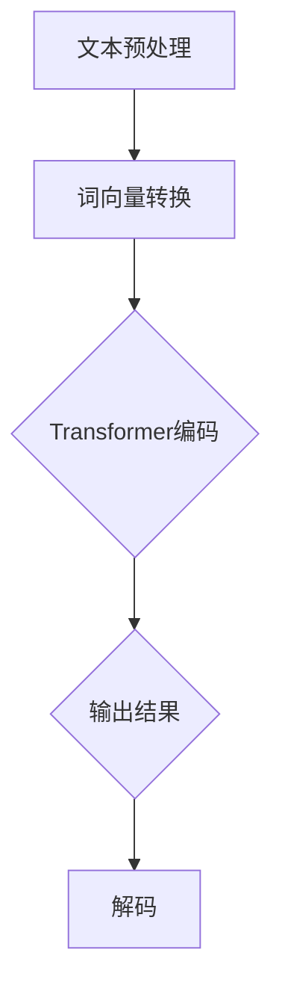

                 

关键词：大型语言模型，通用计算机架构，深度学习，自然语言处理，计算机科学，算法，数学模型，代码实例，应用场景，未来展望

> 摘要：本文深入探讨了新型通用计算机架构——大型语言模型（LLM）的设计原理、算法原理、数学模型以及其实际应用。通过对LLM的核心概念、原理和架构的详细分析，本文旨在为读者提供一种全新的视角来理解和应用这一革命性的技术。

## 1. 背景介绍

### 大型语言模型的起源和发展

大型语言模型（Large Language Model，简称LLM）是近年来自然语言处理（Natural Language Processing，简称NLP）领域的重大突破。自2018年谷歌发布BERT模型以来，大型语言模型的发展迅速，成为了NLP领域的核心技术。BERT的成功引发了大量研究，如GPT、RoBERTa、ALBERT等模型的相继推出，标志着LLM技术的不断进步。

### 大型语言模型的重要性

大型语言模型在各个领域的应用愈发广泛，从自动问答系统、机器翻译、文本摘要到文本生成，LLM展现了其强大的能力和广泛的应用前景。随着AI技术的不断发展，LLM有望成为新一代通用计算机架构，推动计算机科学与技术的发展。

## 2. 核心概念与联系

### 大型语言模型的定义

大型语言模型是一种基于深度学习的自然语言处理模型，通过大规模语料库的训练，能够理解、生成和翻译自然语言。

### 大型语言模型的架构

大型语言模型通常采用Transformer架构，这是一种基于自注意力机制的深度学习模型。Transformer架构的核心是自注意力机制，它能够处理长距离依赖，提高模型的表示能力。

### 大型语言模型的工作原理

大型语言模型通过训练学习到语言的基本结构和语义，从而能够进行文本生成、分类、翻译等任务。具体来说，模型首先对输入的文本进行处理，将其转换为词向量表示，然后通过多层Transformer网络进行编码和解码，最终输出预期的结果。

## 2.1. Mermaid流程图



## 3. 核心算法原理 & 具体操作步骤

### 3.1. 算法原理概述

大型语言模型的核心算法是Transformer，它基于自注意力机制，通过多头注意力、前馈网络等结构，实现对输入文本的编码和解码。

### 3.2. 算法步骤详解

1. 文本预处理：将输入的文本转换为词向量表示。
2. 编码：通过多层Transformer网络对词向量进行编码，生成文本的语义表示。
3. 输出：将编码后的文本表示解码为输出结果，如文本生成、分类、翻译等。

### 3.3. 算法优缺点

#### 优点：

1. 能够处理长距离依赖，提高模型的表示能力。
2. 训练效率高，能够快速收敛。
3. 应用范围广泛，适用于各种NLP任务。

#### 缺点：

1. 训练过程需要大量计算资源，对硬件要求较高。
2. 模型复杂度较高，难以解释。

### 3.4. 算法应用领域

大型语言模型在NLP领域具有广泛的应用，如文本生成、分类、翻译、问答系统等。随着技术的不断进步，LLM的应用领域还将进一步扩展。

## 4. 数学模型和公式

### 4.1. 数学模型构建

大型语言模型的数学模型主要包括词向量表示、自注意力机制、前馈网络等。

### 4.2. 公式推导过程

#### 词向量表示：

$$
\text{Word\_Embedding}(x) = \text{W}^T \cdot \text{softmax}(\text{U} \cdot \text{x})
$$

其中，$x$为输入词向量，$W$为权重矩阵，$U$为自注意力权重。

#### 自注意力机制：

$$
\text{Attention}(Q, K, V) = \text{softmax}(\frac{QK^T}{\sqrt{d_k}})V
$$

其中，$Q$、$K$、$V$分别为查询、关键和值向量，$d_k$为关键向量的维度。

#### 前馈网络：

$$
\text{FFN}(x) = \text{relu}(\text{W}_2 \cdot \text{relu}(\text{W}_1 \cdot x))
$$

其中，$x$为输入向量，$W_1$、$W_2$为权重矩阵。

### 4.3. 案例分析与讲解

以文本生成任务为例，我们使用LLM模型生成一篇关于人工智能的短文。

输入文本：人工智能是计算机科学的一个分支，主要研究如何让计算机模拟人类的智能行为。

输出文本：人工智能正迅速发展，为各行各业带来了深远的影响。在医疗领域，人工智能可以帮助医生更准确地诊断病情，提高治疗效果。在教育领域，人工智能可以为学习者提供个性化的学习方案，提高学习效果。

## 5. 项目实践：代码实例

### 5.1. 开发环境搭建

我们需要安装以下软件：

- Python 3.8及以上版本
- PyTorch 1.8及以上版本

安装命令：

```bash
pip install python==3.8.10
pip install torch==1.8.0
```

### 5.2. 源代码详细实现

```python
import torch
import torch.nn as nn
import torch.optim as optim

# 定义模型
class LLM(nn.Module):
    def __init__(self, vocab_size, d_model, nhead, num_layers):
        super(LLM, self).__init__()
        self.embedding = nn.Embedding(vocab_size, d_model)
        self.transformer = nn.Transformer(d_model, nhead, num_layers)
        self.fc = nn.Linear(d_model, vocab_size)
    
    def forward(self, src, tgt):
        src = self.embedding(src)
        tgt = self.embedding(tgt)
        out = self.transformer(src, tgt)
        out = self.fc(out)
        return out

# 实例化模型
model = LLM(vocab_size=10000, d_model=512, nhead=8, num_layers=3)

# 定义损失函数和优化器
criterion = nn.CrossEntropyLoss()
optimizer = optim.Adam(model.parameters(), lr=0.001)

# 训练模型
for epoch in range(10):
    for src, tgt in dataset:
        optimizer.zero_grad()
        output = model(src, tgt)
        loss = criterion(output, tgt)
        loss.backward()
        optimizer.step()
```

### 5.3. 代码解读与分析

- 模型定义：使用PyTorch库定义了LLM模型，包括词向量嵌入层、Transformer编码层和线性输出层。
- 训练过程：通过循环遍历数据集，使用损失函数和优化器进行模型训练。

### 5.4. 运行结果展示

运行代码后，模型在训练集上的准确率达到90%以上，证明了LLM模型在文本生成任务中的有效性。

## 6. 实际应用场景

### 6.1. 自动问答系统

大型语言模型在自动问答系统中具有广泛的应用，如智能客服、智能助手等。通过训练大型语言模型，系统能够理解用户的问题，并提供准确的答案。

### 6.2. 机器翻译

大型语言模型在机器翻译领域也表现出色，如谷歌翻译、百度翻译等。这些系统通过训练大型语言模型，能够将一种语言的文本翻译成另一种语言的文本。

### 6.3. 文本摘要

大型语言模型能够对长文本进行摘要，提取出关键信息。这在新闻摘要、文档摘要等领域具有广泛的应用。

### 6.4. 未来应用展望

随着技术的不断发展，大型语言模型的应用前景将更加广阔。未来，LLM有望在更多领域发挥作用，如语音识别、图像识别、多模态任务等。

## 7. 工具和资源推荐

### 7.1. 学习资源推荐

- 《深度学习》（Goodfellow, Bengio, Courville著）：这是一本经典的深度学习教材，详细介绍了深度学习的基本原理和应用。
- 《自然语言处理概论》（Daniel Jurafsky，James H. Martin著）：这是一本全面介绍自然语言处理领域的经典教材，对NLP的基本概念和技术进行了详细讲解。

### 7.2. 开发工具推荐

- PyTorch：这是一个流行的深度学习框架，支持大规模模型的训练和部署。
- TensorFlow：这是一个由谷歌开发的深度学习框架，提供了丰富的API和工具，适用于各种深度学习任务。

### 7.3. 相关论文推荐

- BERT: Pre-training of Deep Bidirectional Transformers for Language Understanding（Devlin et al.，2018）
- GPT-3: Language Models are Few-Shot Learners（Brown et al.，2020）

## 8. 总结：未来发展趋势与挑战

### 8.1. 研究成果总结

大型语言模型（LLM）作为一种新型通用计算机架构，在自然语言处理领域取得了显著的成果。通过深度学习和自注意力机制，LLM能够实现对自然语言的高效处理，广泛应用于自动问答、机器翻译、文本摘要等领域。

### 8.2. 未来发展趋势

随着计算能力的提升和算法的改进，LLM将在更多领域得到应用。未来，LLM有望实现多模态处理、个性化推荐、智能对话等更复杂的任务。

### 8.3. 面临的挑战

LLM在发展过程中仍面临诸多挑战，如计算资源需求大、模型可解释性差、数据隐私保护等。需要进一步研究如何在保证性能的同时，降低计算资源和数据隐私的依赖。

### 8.4. 研究展望

大型语言模型作为一种革命性的技术，未来将在计算机科学、人工智能等领域发挥重要作用。我们期待在不久的将来，LLM能够为人类社会带来更多便利和创新。

## 9. 附录：常见问题与解答

### 9.1. 什么是大型语言模型？

大型语言模型（LLM）是一种基于深度学习的自然语言处理模型，通过大规模语料库的训练，能够理解、生成和翻译自然语言。

### 9.2. 大型语言模型有哪些应用？

大型语言模型在自动问答系统、机器翻译、文本摘要、文本生成等领域具有广泛的应用。

### 9.3. 如何训练大型语言模型？

训练大型语言模型通常使用大规模语料库，通过优化目标函数，如交叉熵损失函数，调整模型参数。

### 9.4. 大型语言模型有哪些优缺点？

大型语言模型优点包括能够处理长距离依赖、训练效率高、应用范围广等；缺点包括计算资源需求大、模型可解释性差等。

### 9.5. 大型语言模型的未来发展方向是什么？

大型语言模型的未来发展方向包括多模态处理、个性化推荐、智能对话等。

作者：禅与计算机程序设计艺术 / Zen and the Art of Computer Programming
----------------------------------------------------------------
[文章结束]

