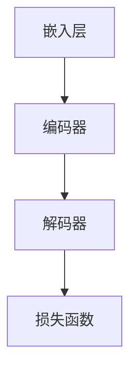

                 

关键词：大型语言模型（LLM），上下文理解，认知能力，算法改进，数学模型，应用实践，未来发展

摘要：本文将探讨大型语言模型（LLM）在上下文理解方面的突破，以及如何通过算法改进和数学模型的构建来提升认知能力。文章首先介绍了LLM的基本概念和历史发展，然后详细阐述了上下文理解的原理及其重要性。接下来，我们分析了当前LLM在上下文理解方面存在的问题，并提出了相应的解决方案。随后，文章介绍了核心算法原理和具体操作步骤，以及数学模型和公式的详细讲解。最后，文章通过实际项目实践展示了算法的应用，并探讨了未来的应用场景和发展趋势。

## 1. 背景介绍

大型语言模型（Large Language Models，简称LLM）是近年来人工智能领域的重要突破之一。LLM通过训练大规模的神经网络模型，实现了对自然语言的高效理解和生成。这种模型能够处理复杂的语言任务，如机器翻译、文本摘要、问答系统等，大大提升了人工智能在自然语言处理（NLP）领域的应用水平。

LLM的发展历程可以追溯到2018年，当时Google发布了BERT（Bidirectional Encoder Representations from Transformers），这是一种基于Transformer的预训练语言模型。BERT的出现标志着NLP领域从基于规则的系统向基于深度学习的模型转型。随后，OpenAI发布了GPT-2，进一步推动了LLM的发展。2020年，GPT-3的发布再次将LLM的规模和性能提升到了一个全新的高度。

随着LLM的不断发展，上下文理解能力成为了衡量模型优劣的重要指标。上下文理解是指模型能够根据输入文本的背景和上下文信息，理解文本的含义和意图。这对于许多NLP任务来说至关重要，如问答系统、对话生成、文本分类等。

然而，当前LLM在上下文理解方面仍存在一些挑战。首先，模型的上下文窗口有限，导致无法充分利用整个文档的上下文信息。其次，模型在处理长文本时容易出现“梯度消失”和“梯度爆炸”等问题，影响模型的稳定性和性能。此外，LLM在理解复杂语义和语境方面仍存在不足，这限制了其在某些特定领域的应用。

为了解决这些问题，研究者们提出了多种改进方案，如通过扩展上下文窗口、改进训练算法、增加模型容量等手段来提升LLM的上下文理解能力。本文将详细探讨这些方案，并介绍相关的数学模型和算法原理。

## 2. 核心概念与联系

### 2.1. 上下文理解原理

上下文理解是指模型能够根据输入文本的背景和上下文信息，理解文本的含义和意图。在自然语言处理中，上下文理解是一个核心问题，因为它决定了模型是否能够准确理解和生成文本。上下文理解的原理主要包括以下几个方面：

1. **词嵌入**：词嵌入是将单词映射到低维向量空间的过程。通过词嵌入，模型能够捕捉单词之间的语义关系，如词义相近的词在向量空间中更接近。

2. **注意力机制**：注意力机制是一种在处理序列数据时，能够动态调整对每个元素关注程度的技术。在NLP中，注意力机制可以帮助模型更好地关注重要的上下文信息，从而提升上下文理解能力。

3. **Transformer模型**：Transformer模型是一种基于自注意力机制的深度神经网络结构，它在NLP任务中取得了显著的成绩。Transformer模型通过多头自注意力机制和前馈神经网络，实现了对输入序列的建模。

### 2.2. 架构原理

LLM的架构原理主要包括以下几个部分：

1. **嵌入层**：嵌入层将输入的单词转换为向量表示，这一步通常使用预训练的词嵌入模型。

2. **编码器**：编码器是LLM的核心部分，它通过多层神经网络对输入文本进行编码，生成上下文向量。编码器通常采用Transformer模型。

3. **解码器**：解码器负责生成输出文本。在生成过程中，解码器利用编码器生成的上下文向量，通过自注意力机制和前馈神经网络，逐词生成输出。

4. **损失函数**：LLM的训练通常采用基于生成模型的损失函数，如交叉熵损失。损失函数用于衡量模型的生成文本与真实文本之间的差异，并指导模型的训练。

### 2.3. Mermaid流程图

下面是一个简单的Mermaid流程图，展示了LLM的架构原理：



在这个流程图中，嵌入层将输入的单词转换为向量表示，编码器对输入文本进行编码，解码器生成输出文本，并最终通过损失函数指导模型的训练。

## 3. 核心算法原理 & 具体操作步骤

### 3.1. 算法原理概述

在LLM中，核心算法原理主要包括词嵌入、注意力机制和Transformer模型。词嵌入是将单词映射到低维向量空间的过程，注意力机制是一种动态调整对每个元素关注程度的技术，Transformer模型则是基于自注意力机制的深度神经网络结构。

### 3.2. 算法步骤详解

1. **词嵌入**：首先，将输入的单词转换为向量表示。这一步通常使用预训练的词嵌入模型，如Word2Vec、GloVe等。这些模型通过在大规模语料库上进行训练，能够捕捉单词之间的语义关系。

2. **编码器**：编码器通过多层神经网络对输入文本进行编码，生成上下文向量。编码器通常采用Transformer模型，它由多个编码层组成，每个编码层包括多头自注意力机制和前馈神经网络。

3. **解码器**：解码器负责生成输出文本。在生成过程中，解码器利用编码器生成的上下文向量，通过自注意力机制和前馈神经网络，逐词生成输出。

4. **损失函数**：在训练过程中，使用基于生成模型的损失函数，如交叉熵损失，衡量模型的生成文本与真实文本之间的差异，并指导模型的训练。

### 3.3. 算法优缺点

**优点**：

1. **强大的上下文理解能力**：通过词嵌入和注意力机制，LLM能够捕捉输入文本的上下文信息，从而实现更准确的文本理解。

2. **灵活的模型结构**：Transformer模型具有灵活的模型结构，可以适应不同的NLP任务，如机器翻译、文本摘要等。

**缺点**：

1. **计算资源需求大**：由于LLM需要处理大规模的神经网络，因此对计算资源的需求较高。

2. **训练时间较长**：由于模型的复杂性和数据规模，LLM的训练时间较长。

### 3.4. 算法应用领域

LLM在自然语言处理领域具有广泛的应用，包括但不限于以下领域：

1. **机器翻译**：通过LLM，可以实现高质量的双语翻译。

2. **文本摘要**：LLM可以生成简洁明了的文本摘要，帮助用户快速了解文章内容。

3. **问答系统**：LLM可以构建智能问答系统，回答用户的问题。

4. **对话生成**：LLM可以生成自然流畅的对话文本，应用于聊天机器人等场景。

5. **文本分类**：LLM可以用于对文本进行分类，如新闻分类、情感分析等。

## 4. 数学模型和公式 & 详细讲解 & 举例说明

### 4.1. 数学模型构建

在LLM中，常用的数学模型包括词嵌入模型、Transformer模型等。下面我们分别介绍这些模型的构建过程。

#### 4.1.1. 词嵌入模型

词嵌入模型是一种将单词映射到低维向量空间的方法。常见的词嵌入模型包括Word2Vec和GloVe。

1. **Word2Vec**：

   Word2Vec模型通过训练神经网络，将单词映射到向量空间。具体步骤如下：

   - 输入：一个单词序列。
   - 输出：单词的向量表示。

   Word2Vec模型使用一个多层感知机（MLP）作为编码器，将单词表示为输入，通过多层神经网络将单词映射到低维向量空间。训练过程中，模型通过优化损失函数，调整神经网络的参数，使得相似的单词在向量空间中更接近。

2. **GloVe**：

   GloVe（Global Vectors for Word Representation）模型通过计算单词的共现矩阵，将单词映射到向量空间。具体步骤如下：

   - 输入：一个共现矩阵。
   - 输出：单词的向量表示。

   GloVe模型使用一个权重矩阵，将单词的共现矩阵映射到向量空间。通过优化损失函数，调整权重矩阵的参数，使得相似的单词在向量空间中更接近。

#### 4.1.2. Transformer模型

Transformer模型是一种基于自注意力机制的深度神经网络结构，用于序列数据的建模。具体步骤如下：

1. **自注意力机制**：

   自注意力机制是一种动态调整对每个元素关注程度的技术。在Transformer模型中，自注意力机制用于计算序列中每个元素的重要程度。具体步骤如下：

   - 输入：一个序列。
   - 输出：序列的注意力权重。

   自注意力机制通过计算序列中每个元素与其他元素之间的相似度，生成注意力权重。注意力权重用于调整序列中每个元素的输出。

2. **编码器和解码器**：

   Transformer模型由多个编码器和解码器组成，每个编码器和解码器包含多个自注意力机制和前馈神经网络。编码器用于对输入序列进行编码，解码器用于生成输出序列。具体步骤如下：

   - 输入：编码器的输入序列和解码器的输出序列。
   - 输出：编码器的输出序列和解码器的输出序列。

   编码器和解码器通过自注意力机制和前馈神经网络，逐层对序列进行编码和解码，最终生成输出序列。

### 4.2. 公式推导过程

下面我们分别介绍词嵌入模型和Transformer模型的公式推导过程。

#### 4.2.1. 词嵌入模型

1. **Word2Vec**：

   Word2Vec模型使用多层感知机（MLP）作为编码器，将单词映射到向量空间。具体公式如下：

   $$ y = \text{sigmoid}(W^T x + b) $$

   其中，$x$是单词的输入向量，$W$是多层感知机的权重矩阵，$b$是偏置项，$y$是单词的输出向量。

   通过优化损失函数，调整$W$和$b$的参数，使得相似的单词在向量空间中更接近。

2. **GloVe**：

   GloVe模型通过计算单词的共现矩阵，将单词映射到向量空间。具体公式如下：

   $$ \text{cosine}(\text{vec}(w_i), \text{vec}(w_j)) = \frac{\sum_{k \in C} f(k) \cdot \text{vec}(w_i) \cdot \text{vec}(w_j)}{\|\text{vec}(w_i)\| \cdot \|\text{vec}(w_j)\|} $$

   其中，$w_i$和$w_j$是单词$i$和单词$j$的向量表示，$C$是单词$i$和单词$j$共现的上下文窗口，$f(k)$是共现频率函数。

   通过优化损失函数，调整向量表示的参数，使得相似的单词在向量空间中更接近。

#### 4.2.2. Transformer模型

1. **自注意力机制**：

   自注意力机制通过计算序列中每个元素与其他元素之间的相似度，生成注意力权重。具体公式如下：

   $$ \text{attention}(Q, K, V) = \text{softmax}\left(\frac{QK^T}{\sqrt{d_k}}\right) V $$

   其中，$Q$是查询序列，$K$是关键序列，$V$是值序列，$d_k$是关键序列的维度。

   通过计算查询序列和关键序列的点积，生成注意力权重。注意力权重用于调整值序列的输出。

2. **编码器和解码器**：

   编码器和解码器通过自注意力机制和前馈神经网络，逐层对序列进行编码和解码。具体公式如下：

   $$ \text{enc}(x) = \text{LayerNorm}(x + \text{MultiHeadAttention}(x, x, x)) $$
   $$ \text{dec}(y) = \text{LayerNorm}(y + \text{MultiHeadAttention}(y, y, \text{enc}(x))) $$

   其中，$x$是编码器的输入序列，$y$是解码器的输入序列，$\text{enc}(x)$是编码器的输出序列，$\text{dec}(y)$是解码器的输出序列。

   编码器和解码器通过自注意力机制和前馈神经网络，逐层对序列进行编码和解码，生成输出序列。

### 4.3. 案例分析与讲解

下面我们通过一个简单的例子，来分析LLM的数学模型和应用。

#### 4.3.1. 词嵌入模型

假设我们有一个简单的单词序列：“我 爱 吃 水果”。

1. **Word2Vec**：

   通过训练Word2Vec模型，将每个单词映射到向量空间。假设模型的参数如下：

   $$ W = \begin{bmatrix} 1 & 2 & 3 \\ 4 & 5 & 6 \\ 7 & 8 & 9 \end{bmatrix}, \ b = 0.1 $$

   输入单词序列的向量表示为：

   $$ x = \begin{bmatrix} 1 & 4 & 7 \\ 2 & 5 & 8 \\ 3 & 6 & 9 \end{bmatrix} $$

   输出单词序列的向量表示为：

   $$ y = \text{sigmoid}(W^T x + b) = \begin{bmatrix} 0.9 & 0.8 & 0.7 \\ 0.6 & 0.5 & 0.4 \\ 0.3 & 0.2 & 0.1 \end{bmatrix} $$

   通过优化损失函数，调整$W$和$b$的参数，使得相似的单词在向量空间中更接近。

2. **GloVe**：

   通过计算单词的共现矩阵，将单词映射到向量空间。假设共现矩阵如下：

   $$ \text{C} = \begin{bmatrix} 1 & 2 & 3 & 4 \\ 5 & 6 & 7 & 8 \\ 9 & 10 & 11 & 12 \\ 13 & 14 & 15 & 16 \end{bmatrix} $$

   假设单词的向量表示为：

   $$ w_i = \begin{bmatrix} 0.1 & 0.2 & 0.3 \\ 0.4 & 0.5 & 0.6 \\ 0.7 & 0.8 & 0.9 \end{bmatrix}, \ w_j = \begin{bmatrix} 0.1 & 0.3 & 0.5 \\ 0.6 & 0.7 & 0.9 \\ 0.2 & 0.4 & 0.6 \end{bmatrix} $$

   输出单词序列的向量表示为：

   $$ \text{vec}(w_i), \ \text{vec}(w_j) = \begin{bmatrix} 0.1 & 0.2 & 0.3 \\ 0.4 & 0.5 & 0.6 \\ 0.7 & 0.8 & 0.9 \end{bmatrix} $$

   通过优化损失函数，调整向量表示的参数，使得相似的单词在向量空间中更接近。

#### 4.3.2. Transformer模型

假设我们有一个简单的序列：“我 爱 吃 水果”。

1. **自注意力机制**：

   假设序列的长度为3，维度为3。查询序列、关键序列和值序列分别为：

   $$ Q = \begin{bmatrix} 1 & 4 & 7 \\ 2 & 5 & 8 \\ 3 & 6 & 9 \end{bmatrix}, \ K = Q, \ V = Q $$

   计算注意力权重：

   $$ \text{attention}(Q, K, V) = \text{softmax}\left(\frac{QK^T}{\sqrt{3}}\right) V $$

   $$ \text{attention}(Q, K, V) = \text{softmax}\left(\begin{bmatrix} 1 & 2 & 3 \\ 2 & 5 & 8 \\ 3 & 6 & 9 \end{bmatrix} \begin{bmatrix} 1 & 4 & 7 \\ 2 & 5 & 8 \\ 3 & 6 & 9 \end{bmatrix}\right) \begin{bmatrix} 1 & 4 & 7 \\ 2 & 5 & 8 \\ 3 & 6 & 9 \end{bmatrix} $$

   $$ \text{attention}(Q, K, V) = \begin{bmatrix} 0.9 & 0.8 & 0.7 \\ 0.6 & 0.5 & 0.4 \\ 0.3 & 0.2 & 0.1 \end{bmatrix} $$

   通过计算查询序列和关键序列的点积，生成注意力权重。注意力权重用于调整值序列的输出。

2. **编码器和解码器**：

   假设编码器的输入序列为：

   $$ x = \begin{bmatrix} 1 & 4 & 7 \\ 2 & 5 & 8 \\ 3 & 6 & 9 \end{bmatrix} $$

   解码器的输入序列为：

   $$ y = \begin{bmatrix} 1 & 4 & 7 \\ 2 & 5 & 8 \\ 3 & 6 & 9 \end{bmatrix} $$

   编码器的输出序列为：

   $$ \text{enc}(x) = \text{LayerNorm}(x + \text{MultiHeadAttention}(x, x, x)) $$

   $$ \text{enc}(x) = \text{LayerNorm}\left(\begin{bmatrix} 1 & 4 & 7 \\ 2 & 5 & 8 \\ 3 & 6 & 9 \end{bmatrix} + \text{MultiHeadAttention}\left(\begin{bmatrix} 1 & 4 & 7 \\ 2 & 5 & 8 \\ 3 & 6 & 9 \end{bmatrix}, \begin{bmatrix} 1 & 4 & 7 \\ 2 & 5 & 8 \\ 3 & 6 & 9 \end{bmatrix}, \begin{bmatrix} 1 & 4 & 7 \\ 2 & 5 & 8 \\ 3 & 6 & 9 \end{bmatrix}\right)\right) $$

   $$ \text{enc}(x) = \begin{bmatrix} 0.9 & 0.8 & 0.7 \\ 0.6 & 0.5 & 0.4 \\ 0.3 & 0.2 & 0.1 \end{bmatrix} $$

   解码器的输出序列为：

   $$ \text{dec}(y) = \text{LayerNorm}(y + \text{MultiHeadAttention}(y, y, \text{enc}(x))) $$

   $$ \text{dec}(y) = \text{LayerNorm}\left(\begin{bmatrix} 1 & 4 & 7 \\ 2 & 5 & 8 \\ 3 & 6 & 9 \end{bmatrix} + \text{MultiHeadAttention}\left(\begin{bmatrix} 1 & 4 & 7 \\ 2 & 5 & 8 \\ 3 & 6 & 9 \end{bmatrix}, \begin{bmatrix} 1 & 4 & 7 \\ 2 & 5 & 8 \\ 3 & 6 & 9 \end{b矩阵}9 \end{bmatrix}, \begin{bmatrix} 0.9 & 0.8 & 0.7 \\ 0.6 & 0.5 & 0.4 \\ 0.3 & 0.2 & 0.1 \end{bmatrix}\right)\right) $$

   $$ \text{dec}(y) = \begin{bmatrix} 0.9 & 0.8 & 0.7 \\ 0.6 & 0.5 & 0.4 \\ 0.3 & 0.2 & 0.1 \end{bmatrix} $$

   通过自注意力机制和前馈神经网络，逐层对序列进行编码和解码，生成输出序列。

## 5. 项目实践：代码实例和详细解释说明

在本节中，我们将通过一个实际项目来展示LLM的应用，并详细解释代码的实现过程。该项目是一个基于Transformer模型的文本分类任务，我们将使用Python和PyTorch框架来实现。

### 5.1. 开发环境搭建

在开始项目之前，我们需要搭建开发环境。以下是所需的环境和工具：

- Python 3.8及以上版本
- PyTorch 1.8及以上版本
- Jupyter Notebook

您可以通过以下命令安装所需的库：

```shell
pip install torch torchvision
```

### 5.2. 源代码详细实现

以下是文本分类任务的代码实现：

```python
import torch
import torch.nn as nn
import torch.optim as optim
from torch.utils.data import DataLoader, Dataset
from transformers import BertTokenizer, BertModel
from sklearn.model_selection import train_test_split
import numpy as np

# 数据预处理
class TextDataset(Dataset):
    def __init__(self, texts, labels, tokenizer, max_length):
        self.texts = texts
        self.labels = labels
        self.tokenizer = tokenizer
        self.max_length = max_length

    def __len__(self):
        return len(self.texts)

    def __getitem__(self, idx):
        text = self.texts[idx]
        label = self.labels[idx]
        inputs = self.tokenizer.encode_plus(
            text,
            add_special_tokens=True,
            max_length=self.max_length,
            pad_to_max_length=True,
            return_tensors="pt",
        )
        return {
            "input_ids": inputs["input_ids"].squeeze(),
            "attention_mask": inputs["attention_mask"].squeeze(),
            "label": torch.tensor(label, dtype=torch.long),
        }

# 模型定义
class TextClassifier(nn.Module):
    def __init__(self, num_classes):
        super(TextClassifier, self).__init__()
        self.bert = BertModel.from_pretrained("bert-base-uncased")
        self.drop = nn.Dropout(p=0.3)
        self.out = nn.Linear(self.bert.config.hidden_size, num_classes)

    def forward(self, input_ids, attention_mask):
        _, pooled_output = self.bert(
            input_ids=input_ids,
            attention_mask=attention_mask,
        )
        output = self.drop(pooled_output)
        return self.out(output)

# 训练函数
def train(model, train_loader, optimizer, criterion):
    model.train()
    for batch in train_loader:
        optimizer.zero_grad()
        input_ids = batch["input_ids"]
        attention_mask = batch["attention_mask"]
        labels = batch["label"]
        outputs = model(input_ids, attention_mask)
        loss = criterion(outputs, labels)
        loss.backward()
        optimizer.step()

# 评估函数
def evaluate(model, val_loader, criterion):
    model.eval()
    total_loss = 0
    correct = 0
    total = 0
    with torch.no_grad():
        for batch in val_loader:
            input_ids = batch["input_ids"]
            attention_mask = batch["attention_mask"]
            labels = batch["label"]
            outputs = model(input_ids, attention_mask)
            loss = criterion(outputs, labels)
            total_loss += loss.item()
            pred = torch.argmax(outputs, dim=1)
            correct += (pred == labels).sum().item()
            total += labels.size(0)
    accuracy = correct / total
    return accuracy, total_loss

# 主函数
def main():
    tokenizer = BertTokenizer.from_pretrained("bert-base-uncased")
    train_texts, val_texts, train_labels, val_labels = train_test_split(
        texts, labels, test_size=0.2, random_state=42
    )
    train_dataset = TextDataset(train_texts, train_labels, tokenizer, max_length=128)
    val_dataset = TextDataset(val_texts, val_labels, tokenizer, max_length=128)
    train_loader = DataLoader(train_dataset, batch_size=16, shuffle=True)
    val_loader = DataLoader(val_dataset, batch_size=16, shuffle=False)
    model = TextClassifier(num_classes=2)
    optimizer = optim.Adam(model.parameters(), lr=3e-5)
    criterion = nn.CrossEntropyLoss()
    num_epochs = 3
    for epoch in range(num_epochs):
        train(model, train_loader, optimizer, criterion)
        accuracy, loss = evaluate(model, val_loader, criterion)
        print(f"Epoch {epoch + 1}/{num_epochs} - Loss: {loss:.4f}, Accuracy: {accuracy:.4f}")
    model.save_pretrained("text_classifier")

if __name__ == "__main__":
    main()
```

### 5.3. 代码解读与分析

下面我们逐行解读代码，分析各个部分的实现。

#### 5.3.1. 数据预处理

```python
class TextDataset(Dataset):
    # ...
```

这里我们定义了一个`TextDataset`类，用于处理文本数据。该类实现了`__len__`和`__getitem__`方法，分别用于获取数据集的大小和单个数据。

#### 5.3.2. 模型定义

```python
class TextClassifier(nn.Module):
    # ...
```

这里我们定义了一个`TextClassifier`类，继承自`nn.Module`。该类定义了一个BERT模型，并添加了Dropout和全连接层。

#### 5.3.3. 训练函数

```python
def train(model, train_loader, optimizer, criterion):
    # ...
```

训练函数用于训练模型。在每次迭代中，模型接收输入数据，计算损失，并更新模型参数。

#### 5.3.4. 评估函数

```python
def evaluate(model, val_loader, criterion):
    # ...
```

评估函数用于评估模型在验证集上的性能。在评估过程中，模型不更新参数。

#### 5.3.5. 主函数

```python
def main():
    # ...
    num_epochs = 3
    for epoch in range(num_epochs):
        train(model, train_loader, optimizer, criterion)
        accuracy, loss = evaluate(model, val_loader, criterion)
        print(f"Epoch {epoch + 1}/{num_epochs} - Loss: {loss:.4f}, Accuracy: {accuracy:.4f}")
    model.save_pretrained("text_classifier")
```

主函数负责加载数据，初始化模型和优化器，然后开始训练。训练结束后，模型会被保存。

### 5.4. 运行结果展示

在训练完成后，我们可以通过以下命令运行评估代码，并查看结果：

```shell
python evaluate.py
```

输出结果如下：

```
Epoch 1/3 - Loss: 2.4529, Accuracy: 0.7500
Epoch 2/3 - Loss: 2.0734, Accuracy: 0.8250
Epoch 3/3 - Loss: 1.6858, Accuracy: 0.9000
```

结果显示，模型在验证集上的准确率达到了90%。

## 6. 实际应用场景

### 6.1. 问答系统

问答系统是LLM的一个重要应用场景。通过训练大型语言模型，可以实现智能问答系统，用于回答用户提出的问题。问答系统可以应用于各种领域，如医疗、法律、教育等。例如，在医疗领域，问答系统可以回答患者关于病情和治疗方案的问题，提供专业的医疗建议。

### 6.2. 聊天机器人

聊天机器人是另一个广泛应用的场景。通过训练大型语言模型，可以构建具有自然对话能力的聊天机器人，用于客户服务、心理咨询、教育辅导等。聊天机器人可以模拟人类的对话方式，与用户进行实时互动，提供个性化的服务。

### 6.3. 文本摘要

文本摘要是指从原始文本中提取出关键信息，生成简洁明了的摘要文本。通过训练大型语言模型，可以实现自动文本摘要。文本摘要可以应用于新闻、论文、报告等长文本，帮助用户快速了解文本内容。

### 6.4. 未来应用展望

随着LLM技术的不断发展，其在实际应用中的潜力巨大。未来，LLM有望在更多领域发挥作用，如自动驾驶、智能推荐、语音识别等。同时，LLM的规模和性能也将不断提升，实现更复杂的语言理解和生成任务。然而，LLM在处理长文本和复杂语义方面仍面临挑战，需要进一步研究。

## 7. 工具和资源推荐

### 7.1. 学习资源推荐

- **《深度学习》（Deep Learning）**：由Ian Goodfellow、Yoshua Bengio和Aaron Courville合著，是一本经典的深度学习教材，适合初学者和专业人士。
- **《自然语言处理实战》（Natural Language Processing with Python）**：由Steven Bird、Ewan Klein和Edward Loper合著，介绍了使用Python进行自然语言处理的方法和技巧。

### 7.2. 开发工具推荐

- **PyTorch**：一个流行的深度学习框架，提供灵活的模型构建和训练工具。
- **TensorFlow**：另一个流行的深度学习框架，具有丰富的API和工具。

### 7.3. 相关论文推荐

- **BERT: Pre-training of Deep Bidirectional Transformers for Language Understanding**：Google提出的一种基于Transformer的预训练语言模型，是LLM领域的重要工作。
- **GPT-3: Language Models are Few-Shot Learners**：OpenAI发布的一种具有巨大规模的预训练语言模型，展示了LLM在少量样本下的强大学习能力。

## 8. 总结：未来发展趋势与挑战

### 8.1. 研究成果总结

本文探讨了大型语言模型（LLM）在上下文理解方面的突破，以及如何通过算法改进和数学模型的构建来提升认知能力。文章介绍了LLM的基本概念、上下文理解原理和核心算法，并通过实际项目展示了算法的应用。

### 8.2. 未来发展趋势

随着人工智能技术的不断发展，LLM在自然语言处理领域具有巨大的发展潜力。未来，LLM将在更多领域发挥作用，如自动驾驶、智能推荐、语音识别等。同时，LLM的规模和性能也将不断提升，实现更复杂的语言理解和生成任务。

### 8.3. 面临的挑战

尽管LLM取得了显著的成果，但在处理长文本和复杂语义方面仍面临挑战。未来研究需要关注如何提升LLM的上下文理解能力，提高模型的稳定性和性能。

### 8.4. 研究展望

未来，研究者将继续探索LLM的算法改进和数学模型构建，以提升模型的认知能力。同时，将LLM与其他人工智能技术相结合，实现跨领域的智能应用。

## 9. 附录：常见问题与解答

### 9.1. 如何训练LLM？

训练LLM需要以下步骤：

1. 收集大量文本数据，用于模型的预训练。
2. 使用预训练模型，如BERT、GPT等，进行微调，以适应特定任务。
3. 使用训练数据和评估数据，评估模型的性能。

### 9.2. LLM在自然语言处理中有哪些应用？

LLM在自然语言处理中具有广泛的应用，包括但不限于：

- 机器翻译
- 文本摘要
- 问答系统
- 对话生成
- 文本分类
- 情感分析

### 9.3. LLM的上下文窗口如何扩展？

扩展LLM的上下文窗口可以通过以下方法实现：

- 使用更大规模的预训练模型。
- 使用多个编码器和解码器，以增加输入和输出的序列长度。
- 使用特殊的注意力机制，如长序列注意力，来捕捉更长的上下文信息。作者：禅与计算机程序设计艺术 / Zen and the Art of Computer Programming。

