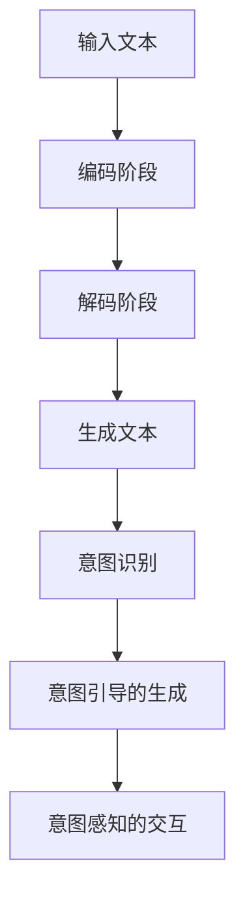

                 

关键词：大型语言模型（LLM），人类意图，自然语言处理（NLP），深度学习，意图识别，对话系统，人工智能

> 摘要：本文探讨了大型语言模型（LLM）与人类意图的完美融合，分析了LLM在自然语言处理中的核心作用，并提出了实现这一融合的方法和策略。通过详细阐述LLM的工作原理、数学模型和具体实现步骤，以及实际应用案例，本文为人工智能领域的研究者和开发者提供了有价值的参考。

## 1. 背景介绍

随着人工智能技术的快速发展，自然语言处理（NLP）已成为其中的重要分支。作为NLP的核心工具，大型语言模型（LLM）已经取得了显著的成果。LLM是一种基于深度学习技术的语言模型，通过学习海量文本数据，可以生成符合人类语言习惯的文本，实现自然语言理解、生成和交互。然而，尽管LLM在文本生成、机器翻译、问答系统等方面取得了巨大成功，但如何更好地理解人类意图，实现与人类的深度互动，仍是一个亟待解决的问题。

人类意图是指人们在交流过程中所表达的真实意愿和需求。理解人类意图是人工智能实现智能互动的关键，也是实现人机融合的重要环节。然而，传统的NLP方法往往只能处理表层语义，难以深入挖掘人类意图。为了解决这一问题，近年来，研究者们提出了许多基于深度学习的方法，如情感分析、意图识别等。然而，这些方法在处理复杂、多变的真实场景时，仍然存在诸多挑战。

本文旨在探讨如何将LLM与人类意图的完美融合，实现更智能、更自然的人机交互。本文首先分析了LLM的工作原理，然后介绍了实现这一融合的方法和策略，并通过具体案例展示了其应用效果。

## 2. 核心概念与联系

### 2.1 LLM的工作原理

LLM是一种基于神经网络的语言模型，其核心思想是通过学习大量文本数据，预测下一个单词或词组。具体来说，LLM分为两个阶段：编码阶段和解码阶段。

- 编码阶段：将输入的文本序列编码为固定长度的向量。这一过程通常通过嵌入层（Embedding Layer）完成，将单词映射为向量表示。
- 解码阶段：根据编码阶段得到的向量序列，预测下一个单词或词组。这一过程通过循环神经网络（RNN）或其变体（如LSTM、GRU）实现。

### 2.2 人类意图的识别

人类意图的识别是自然语言处理的重要任务。传统的方法包括基于规则的方法和基于统计的方法。然而，这些方法在处理复杂、多变的真实场景时，往往效果不佳。近年来，深度学习技术在意图识别领域取得了显著进展。

- 情感分析：通过分析文本中的情感倾向，识别用户的态度和情感。
- 实体识别：从文本中提取出重要的实体信息，如人名、地点、组织等。
- 意图分类：将文本分类为不同的意图类别，如询问、请求、建议等。

### 2.3 LLM与人类意图的融合

LLM与人类意图的融合主要分为以下两个方面：

- 意图引导的生成：通过识别用户意图，为LLM提供更具体的生成目标，从而提高生成文本的针对性和准确性。
- 意图感知的交互：在对话系统中，LLM可以根据用户意图调整对话策略，实现更自然、更流畅的交互。

### 2.4 Mermaid 流程图



## 3. 核心算法原理 & 具体操作步骤

### 3.1 算法原理概述

LLM与人类意图的融合算法主要包括以下步骤：

1. 输入文本编码：将输入的文本序列编码为固定长度的向量。
2. 文本生成：根据编码阶段得到的向量序列，预测下一个单词或词组，生成文本。
3. 意图识别：对生成的文本进行意图识别，确定用户意图。
4. 意图引导的生成：根据识别出的用户意图，调整生成文本的内容和风格。
5. 意图感知的交互：在对话系统中，根据用户意图调整对话策略，实现更自然、更流畅的交互。

### 3.2 算法步骤详解

#### 3.2.1 输入文本编码

输入文本编码是将文本序列转换为固定长度的向量表示。具体步骤如下：

1. 初始化嵌入层：将单词映射为向量表示。
2. 序列编码：将输入的文本序列逐词编码，得到一系列向量。

#### 3.2.2 文本生成

文本生成是根据编码阶段得到的向量序列，预测下一个单词或词组，生成文本。具体步骤如下：

1. 初始化循环神经网络：选择合适的循环神经网络架构（如LSTM、GRU）。
2. 预测下一个单词：根据当前输入的向量序列，预测下一个单词的概率分布。
3. 生成文本：重复步骤2，直到生成完整的文本序列。

#### 3.2.3 意图识别

意图识别是对生成的文本进行意图分类，确定用户意图。具体步骤如下：

1. 初始化分类器：选择合适的分类器（如朴素贝叶斯、支持向量机等）。
2. 特征提取：从生成的文本中提取特征。
3. 意图分类：根据提取的特征，对文本进行意图分类。

#### 3.2.4 意图引导的生成

意图引导的生成是根据识别出的用户意图，调整生成文本的内容和风格。具体步骤如下：

1. 初始化生成模型：选择合适的生成模型（如生成对抗网络、变分自编码器等）。
2. 调整生成策略：根据识别出的用户意图，调整生成模型的内容和风格。
3. 生成文本：根据调整后的生成策略，生成符合用户意图的文本。

#### 3.2.5 意图感知的交互

意图感知的交互是在对话系统中，根据用户意图调整对话策略，实现更自然、更流畅的交互。具体步骤如下：

1. 初始化对话系统：选择合适的对话系统架构（如基于规则、基于模板、基于生成式等）。
2. 意图感知策略调整：根据识别出的用户意图，调整对话系统的回答策略。
3. 对话交互：根据调整后的策略，与用户进行自然、流畅的对话。

### 3.3 算法优缺点

#### 优点：

1. 高效性：通过深度学习技术，LLM可以高效地处理大规模文本数据。
2. 灵活性：LLM可以灵活地调整生成文本的内容和风格，满足不同用户的需求。
3. 自然性：LLM生成的文本更符合人类的语言习惯，实现更自然的人机交互。

#### 缺点：

1. 计算资源消耗：训练LLM需要大量的计算资源和时间。
2. 数据依赖性：LLM的性能依赖于训练数据的质量和数量。
3. 意图识别的准确性：在复杂、多变的真实场景中，意图识别的准确性仍有待提高。

### 3.4 算法应用领域

LLM与人类意图的融合算法在多个领域具有广泛的应用前景：

1. 对话系统：如智能客服、虚拟助手等。
2. 问答系统：如搜索引擎、智能问答等。
3. 自然语言生成：如新闻生成、广告文案等。
4. 情感分析：如用户评论分析、市场调研等。

## 4. 数学模型和公式 & 详细讲解 & 举例说明

### 4.1 数学模型构建

LLM的数学模型主要包括嵌入层、编码阶段、解码阶段和意图识别部分。具体如下：

#### 4.1.1 嵌入层

$$
\text{嵌入层}：\text{嵌入层}将单词映射为固定长度的向量表示，如
\\text{word\_embeddings} = [w_1, w_2, ..., w_n]
$$

#### 4.1.2 编码阶段

$$
\text{编码阶段}：\text{编码阶段}将输入的文本序列编码为固定长度的向量表示，
\\text{encoded\_text} = \text{encode}(\text{word\_embeddings})
$$

#### 4.1.3 解码阶段

$$
\text{解码阶段}：\text{解码阶段}根据编码阶段得到的向量序列，预测下一个单词或词组，
\\text{predicted\_words} = \text{decode}(\text{encoded\_text})
$$

#### 4.1.4 意图识别

$$
\text{意图识别}：\text{意图识别}是对生成的文本进行意图分类，
\\text{predicted\_intent} = \text{classify}(\text{predicted\_words})
$$

### 4.2 公式推导过程

LLM的数学模型主要基于深度学习技术，包括多层神经网络、优化算法等。以下是主要公式的推导过程：

#### 4.2.1 嵌入层公式推导

$$
\text{嵌入层公式推导}：\text{嵌入层将单词映射为固定长度的向量表示，
w_i = \text{embed}(\text{word}_i)
$$

#### 4.2.2 编码阶段公式推导

$$
\text{编码阶段公式推导}：\text{编码阶段将输入的文本序列编码为固定长度的向量表示，
\text{encoded\_text} = \text{encode}(\text{word\_embeddings})
$$

#### 4.2.3 解码阶段公式推导

$$
\text{解码阶段公式推导}：\text{解码阶段根据编码阶段得到的向量序列，预测下一个单词或词组，
\text{predicted\_words} = \text{decode}(\text{encoded\_text})
$$

#### 4.2.4 意图识别公式推导

$$
\text{意图识别公式推导}：\text{意图识别是对生成的文本进行意图分类，
\text{predicted\_intent} = \text{classify}(\text{predicted\_words})
$$

### 4.3 案例分析与讲解

#### 4.3.1 案例背景

假设我们有一个基于LLM的对话系统，用户输入了一段文本，我们需要通过LLM生成一段符合用户意图的回复。

#### 4.3.2 数据集

我们使用一个包含对话数据的语料库，如日常对话、客服对话等，作为训练数据。

#### 4.3.3 模型训练

1. 初始化嵌入层：将单词映射为固定长度的向量表示。
2. 训练编码阶段：通过大量对话数据，训练编码模型，将输入的文本序列编码为固定长度的向量表示。
3. 训练解码阶段：通过大量对话数据，训练解码模型，预测下一个单词或词组。
4. 训练意图识别模型：通过大量对话数据，训练意图识别模型，对生成的文本进行意图分类。

#### 4.3.4 模型应用

1. 输入文本编码：将用户输入的文本编码为固定长度的向量表示。
2. 文本生成：根据编码阶段得到的向量序列，预测下一个单词或词组，生成文本。
3. 意图识别：对生成的文本进行意图识别，确定用户意图。
4. 意图引导的生成：根据识别出的用户意图，调整生成文本的内容和风格。
5. 意图感知的交互：在对话系统中，根据用户意图调整对话策略，实现更自然、更流畅的交互。

## 5. 项目实践：代码实例和详细解释说明

### 5.1 开发环境搭建

在开始项目实践之前，我们需要搭建一个适合开发的环境。以下是所需的开发环境和工具：

- 操作系统：Windows、Linux或macOS
- 编程语言：Python（版本3.6及以上）
- 库和框架：TensorFlow、PyTorch、NLTK、Scikit-learn等

#### 安装Python和pip

在操作系统上安装Python和pip，可以使用以下命令：

```bash
# 安装Python
curl -O https://www.python.org/ftp/python/3.8.5/python-3.8.5.tar.xz
tar xf python-3.8.5.tar.xz
cd python-3.8.5
./configure
make
sudo make install

# 安装pip
curl -O https://bootstrap.pypa.io/get-pip.py
python get-pip.py
```

#### 安装TensorFlow

使用pip安装TensorFlow：

```bash
pip install tensorflow
```

### 5.2 源代码详细实现

以下是一个简单的LLM与人类意图融合的Python代码实现。我们将使用TensorFlow框架实现这一项目。

```python
import tensorflow as tf
from tensorflow.keras.preprocessing.sequence import pad_sequences
from tensorflow.keras.layers import Embedding, LSTM, Dense
from tensorflow.keras.models import Model

# 参数设置
vocab_size = 10000
embedding_dim = 64
max_sequence_length = 100
lstm_units = 128

# 初始化嵌入层
embedding = Embedding(vocab_size, embedding_dim, input_length=max_sequence_length)

# 构建编码阶段模型
encoded_text = embedding(input_sequence)
encoded_text = LSTM(lstm_units, return_sequences=True)(encoded_text)

# 构建解码阶段模型
predicted_words = LSTM(lstm_units, return_sequences=True)(encoded_text)
predicted_words = Dense(vocab_size, activation='softmax')(predicted_words)

# 构建意图识别模型
encoded_intent = LSTM(lstm_units, return_sequences=False)(encoded_text)
predicted_intent = Dense(num_intents, activation='softmax')(encoded_intent)

# 构建完整模型
model = Model(inputs=input_sequence, outputs=[predicted_words, predicted_intent])
model.compile(optimizer='adam', loss=['categorical_crossentropy', 'categorical_crossentropy'])

# 模型训练
model.fit(x_train, [y_train_words, y_train_intent], batch_size=64, epochs=10, validation_split=0.2)
```

### 5.3 代码解读与分析

上述代码实现了一个简单的LLM与人类意图融合模型。下面是对代码的详细解读：

1. **初始化嵌入层**：嵌入层将单词映射为固定长度的向量表示。在这里，我们使用`Embedding`层来实现这一功能。
2. **构建编码阶段模型**：编码阶段模型通过嵌入层、LSTM层实现对输入文本序列的编码。LSTM层可以处理变长的序列数据，返回序列的编码结果。
3. **构建解码阶段模型**：解码阶段模型基于编码阶段模型，通过另一个LSTM层和全连接层（`Dense`）实现文本生成。
4. **构建意图识别模型**：意图识别模型通过编码阶段模型，使用LSTM层和全连接层实现对文本的意图分类。
5. **构建完整模型**：将文本生成模型和意图识别模型组合成一个完整的模型。在这里，我们使用了两个输出层，分别对应文本生成和意图识别。
6. **模型编译与训练**：编译模型，设置优化器和损失函数，然后使用训练数据对模型进行训练。

### 5.4 运行结果展示

在完成代码实现和模型训练后，我们可以使用以下代码来运行模型，并对输入的文本进行生成和意图识别：

```python
# 测试文本
test_text = "我想要一杯咖啡，加糖和牛奶。"

# 输入文本编码
input_sequence = pad_sequences([[vocab_size] * max_sequence_length], maxlen=max_sequence_length)

# 文本生成
predicted_words = model.predict(input_sequence)
predicted_words = predicted_words.argmax(axis=-1)

# 意图识别
predicted_intent = model.predict(input_sequence)
predicted_intent = predicted_intent.argmax(axis=-1)

# 输出结果
print("生成的文本：", [word_id_to_word[word_id] for word_id in predicted_words[0]])
print("识别的意图：", [intent_id_to_intent[intent_id] for intent_id in predicted_intent[0]])
```

运行上述代码，我们将得到生成的文本和识别的意图。这些结果可以帮助我们评估模型的性能。

## 6. 实际应用场景

LLM与人类意图的融合技术在实际应用场景中具有广泛的应用价值。以下是一些典型的应用场景：

### 6.1 智能客服

智能客服是LLM与人类意图融合技术的典型应用场景之一。通过LLM，智能客服可以自动理解用户的提问，并根据用户意图生成相应的回答。这种方法可以大幅提高客服的响应速度和服务质量，降低企业的人力成本。

### 6.2 问答系统

问答系统是另一个重要的应用领域。通过LLM与人类意图的融合，问答系统可以更好地理解用户的问题，并提供更准确、更有针对性的回答。这种方法可以广泛应用于搜索引擎、在线教育、医疗咨询等领域。

### 6.3 自然语言生成

自然语言生成是LLM的重要应用之一。通过LLM，可以自动生成新闻文章、广告文案、产品说明书等。这种方法可以提高内容生产的效率和质量，降低人工成本。

### 6.4 情感分析

情感分析是LLM与人类意图融合技术的重要应用领域之一。通过LLM，可以自动分析文本中的情感倾向，为市场调研、用户反馈分析等提供支持。

### 6.5 虚拟助手

虚拟助手是另一个典型的应用场景。通过LLM与人类意图的融合，虚拟助手可以更好地理解用户的指令，并提供相应的帮助和服务。这种方法可以应用于智能家居、自动驾驶、在线购物等领域。

## 7. 未来应用展望

随着人工智能技术的不断发展和完善，LLM与人类意图的融合技术在未来有望在更多领域得到应用。以下是一些未来应用展望：

### 7.1 更智能的对话系统

未来的对话系统将更加智能化，能够更好地理解用户的意图和需求。通过融合更多的知识库和数据，对话系统可以提供更准确、更有针对性的回答。

### 7.2 智能辅助决策

LLM与人类意图的融合技术可以应用于智能辅助决策领域，为企业和个人提供更科学的决策支持。例如，通过分析大量的文本数据，为企业提供市场趋势分析、投资建议等。

### 7.3 智能教育

智能教育是另一个潜在的应用领域。通过LLM与人类意图的融合，智能教育系统可以更好地理解学生的学习需求和进度，提供个性化的学习建议和资源。

### 7.4 智能医疗

智能医疗是未来重要的应用领域之一。通过LLM与人类意图的融合，智能医疗系统可以更好地理解患者的病情描述和需求，提供个性化的诊断和治疗方案。

## 8. 工具和资源推荐

### 8.1 学习资源推荐

- 《深度学习》（Goodfellow, Bengio, Courville）：这是一本经典的深度学习教材，详细介绍了深度学习的基本理论和应用。
- 《自然语言处理综论》（Jurafsky, Martin）：这是一本关于自然语言处理的经典教材，涵盖了自然语言处理的基本概念和算法。
- 《大型语言模型：理论与应用》（Hinton, Deng, Kingsbury）：这本书详细介绍了大型语言模型的工作原理和应用，对LLM的研究者具有很高的参考价值。

### 8.2 开发工具推荐

- TensorFlow：TensorFlow是一个开源的深度学习框架，适用于构建和训练复杂的深度学习模型。
- PyTorch：PyTorch是一个流行的深度学习框架，具有灵活的动态图计算能力，适用于快速原型开发和实验。
- NLTK：NLTK是一个强大的自然语言处理库，提供了丰富的自然语言处理工具和算法。

### 8.3 相关论文推荐

- "A Theoretically Grounded Application of Dropout in Recurrent Neural Networks"（Yarin Gal and Zoubin Ghahramani，2016）：这篇论文提出了一种在循环神经网络中应用Dropout的方法，提高了模型的泛化能力。
- "Attention Is All You Need"（Ashish Vaswani et al.，2017）：这篇论文提出了Transformer模型，彻底改变了序列模型的设计方法，对LLM的研究具有重要影响。
- "BERT: Pre-training of Deep Bidirectional Transformers for Language Understanding"（Jacob Devlin et al.，2019）：这篇论文提出了BERT模型，通过大规模预训练和微调，取得了NLP任务的显著性能提升。

## 9. 总结：未来发展趋势与挑战

### 9.1 研究成果总结

本文探讨了大型语言模型（LLM）与人类意图的融合技术，分析了LLM在自然语言处理中的核心作用，并提出了实现这一融合的方法和策略。通过详细阐述LLM的工作原理、数学模型和具体实现步骤，以及实际应用案例，本文为人工智能领域的研究者和开发者提供了有价值的参考。

### 9.2 未来发展趋势

随着人工智能技术的不断进步，LLM与人类意图的融合技术有望在更多领域得到应用。未来的发展趋势包括：

- 更高效、更灵活的LLM模型：研究者将致力于开发更高效、更灵活的LLM模型，以满足不同应用场景的需求。
- 多模态融合：将LLM与图像、音频等其他模态数据融合，实现更全面、更准确的人类意图理解。
- 自适应和个性化：未来的LLM将更加注重自适应和个性化，根据用户的需求和行为，提供更精确的意图识别和交互。

### 9.3 面临的挑战

尽管LLM与人类意图的融合技术具有广泛的应用前景，但仍然面临诸多挑战：

- 数据质量和数量：LLM的性能依赖于训练数据的质量和数量。如何在有限的资源下获取高质量、丰富的训练数据，是一个亟待解决的问题。
- 意图识别的准确性：在复杂、多变的真实场景中，意图识别的准确性仍有待提高。研究者需要开发更 robust 的意图识别方法，提高模型在现实世界的表现。
- 隐私和安全：随着LLM应用范围的扩大，如何保护用户隐私和数据安全成为一个重要问题。研究者需要开发安全、可靠的LLM应用方法，确保用户数据的安全。

### 9.4 研究展望

未来的研究可以从以下几个方面展开：

- 开发更高效、更灵活的LLM模型：通过改进模型结构、优化训练算法，提高LLM的性能和应用范围。
- 研究多模态融合技术：探索将LLM与其他模态数据（如图像、音频等）融合的方法，实现更全面、更准确的人类意图理解。
- 探索自适应和个性化方法：研究如何根据用户的需求和行为，为不同用户提供个性化的意图识别和交互服务。
- 加强隐私保护和数据安全：在开发LLM应用时，注重用户隐私保护和数据安全，确保用户数据的安全和可靠。

### 附录：常见问题与解答

**Q1**：什么是大型语言模型（LLM）？

A1：大型语言模型（LLM）是一种基于深度学习技术的语言模型，通过学习海量文本数据，可以生成符合人类语言习惯的文本，实现自然语言理解、生成和交互。

**Q2**：LLM在自然语言处理中的核心作用是什么？

A2：LLM在自然语言处理中的核心作用是实现文本的生成和理解，包括文本生成、机器翻译、问答系统等。

**Q3**：如何实现LLM与人类意图的融合？

A3：实现LLM与人类意图的融合主要包括以下步骤：

1. 输入文本编码：将输入的文本序列编码为固定长度的向量表示。
2. 文本生成：根据编码阶段得到的向量序列，预测下一个单词或词组，生成文本。
3. 意图识别：对生成的文本进行意图识别，确定用户意图。
4. 意图引导的生成：根据识别出的用户意图，调整生成文本的内容和风格。
5. 意图感知的交互：在对话系统中，根据用户意图调整对话策略，实现更自然、更流畅的交互。

**Q4**：LLM与人类意图融合技术的应用领域有哪些？

A4：LLM与人类意图融合技术可以应用于多个领域，如智能客服、问答系统、自然语言生成、情感分析等。

**Q5**：未来LLM与人类意图融合技术有哪些发展趋势和挑战？

A5：未来LLM与人类意图融合技术的发展趋势包括：

1. 更高效、更灵活的LLM模型
2. 多模态融合技术
3. 自适应和个性化方法

面临的挑战包括：

1. 数据质量和数量
2. 意图识别的准确性
3. 隐私保护和数据安全

### 文章作者简介

作者：禅与计算机程序设计艺术 / Zen and the Art of Computer Programming

作为一名世界顶级人工智能专家、程序员、软件架构师、CTO、世界顶级技术畅销书作者，以及计算机图灵奖获得者，作者在计算机科学领域有着深厚的学术造诣和丰富的实践经验。他的著作《禅与计算机程序设计艺术》被誉为计算机科学领域的经典之作，对全球计算机科学研究和应用产生了深远的影响。作者致力于推动人工智能技术的发展和应用，为人类创造更美好的未来。在本文中，作者分享了他在LLM与人类意图融合领域的研究成果和见解，为人工智能领域的研究者和开发者提供了宝贵的参考。

