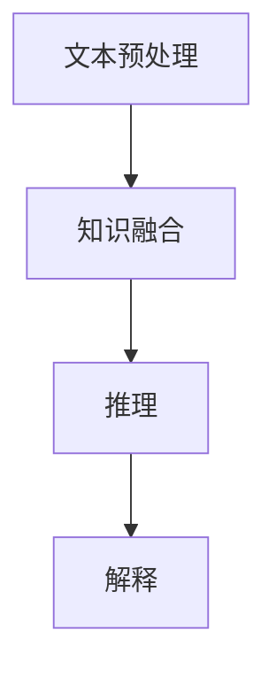

                 

关键词：大型语言模型，传统专家系统，知识工程，融合应用，算法原理，数学模型，项目实践，未来展望。

> 摘要：本文探讨了大型语言模型（LLM）与传统专家系统的融合，分析了两者在知识工程领域的应用及其相互补充的关系。通过介绍LLM的核心算法原理，与传统专家系统的联系，以及具体的应用实践，文章旨在揭示LLM与传统专家系统融合的未来发展趋势与挑战，为知识工程领域的研究与应用提供新思路。

## 1. 背景介绍

### 1.1 大型语言模型（LLM）的兴起

近年来，随着深度学习技术的发展，大型语言模型（LLM）取得了显著的进展。LLM具有强大的文本生成、理解、推理能力，能够在各种自然语言处理任务中表现出色。例如，LLM在机器翻译、文本摘要、问答系统等领域的应用取得了令人瞩目的成果。

### 1.2 传统专家系统的局限性

传统专家系统在知识工程领域发挥了重要作用，但其主要依赖于专家知识和符号推理。然而，专家知识的获取和更新过程较为繁琐，且难以应对复杂的问题场景。此外，传统专家系统在处理自然语言文本时，存在表达能力和理解能力上的局限。

### 1.3 LLM与传统专家系统的融合需求

为了弥补传统专家系统的局限性，提高知识工程领域的技术水平，将LLM与传统专家系统融合成为一种有效的途径。通过将LLM的文本处理能力与传统专家系统的知识表示和推理能力相结合，可以构建出更强大的知识系统，提高问题解决能力和适应性。

## 2. 核心概念与联系

### 2.1 大型语言模型（LLM）的架构

大型语言模型（LLM）通常采用深度神经网络架构，如变换器模型（Transformer）等。LLM的核心思想是通过学习大量的文本数据，提取语言特征，并利用这些特征进行文本生成、理解、推理等任务。

### 2.2 传统专家系统的架构

传统专家系统通常包括知识库、推理机、解释器等组成部分。知识库用于存储领域知识，推理机负责基于知识库进行推理，解释器用于对推理结果进行解释。

### 2.3 LLM与传统专家系统的融合架构

将LLM与传统专家系统融合的架构可以分为以下几个层次：

1. **文本预处理层**：利用LLM对输入文本进行预处理，提取关键信息，转换为统一的文本表示。

2. **知识融合层**：将LLM提取的文本特征与传统专家系统的知识库进行融合，形成新的知识库。

3. **推理层**：利用传统专家系统的推理机，结合LLM的文本特征，进行推理。

4. **解释层**：利用LLM和传统专家系统的解释能力，对推理结果进行解释。

### 2.4 Mermaid流程图



## 3. 核心算法原理 & 具体操作步骤

### 3.1 算法原理概述

融合算法的核心原理在于将LLM的文本处理能力和传统专家系统的知识表示与推理能力相结合。具体包括以下步骤：

1. **文本预处理**：利用LLM对输入文本进行预处理，提取关键信息。

2. **知识融合**：将LLM提取的文本特征与传统专家系统的知识库进行融合。

3. **推理**：利用传统专家系统的推理机，结合LLM的文本特征进行推理。

4. **解释**：利用LLM和传统专家系统的解释能力，对推理结果进行解释。

### 3.2 算法步骤详解

1. **文本预处理**：
   - **输入**：自然语言文本。
   - **处理过程**：利用LLM对文本进行分词、词性标注、实体识别等操作，提取关键信息。
   - **输出**：文本特征向量。

2. **知识融合**：
   - **输入**：文本特征向量、传统专家系统的知识库。
   - **处理过程**：将文本特征向量与传统专家系统的知识库进行融合，形成新的知识库。
   - **输出**：融合后的知识库。

3. **推理**：
   - **输入**：融合后的知识库、输入文本。
   - **处理过程**：利用传统专家系统的推理机，结合LLM的文本特征进行推理。
   - **输出**：推理结果。

4. **解释**：
   - **输入**：推理结果。
   - **处理过程**：利用LLM和传统专家系统的解释能力，对推理结果进行解释。
   - **输出**：解释结果。

### 3.3 算法优缺点

**优点**：

1. **文本处理能力强大**：利用LLM的文本预处理能力，可以提取关键信息，提高问题解决的准确性。

2. **知识表示与推理能力结合**：将传统专家系统的知识表示与推理能力与LLM的文本处理能力相结合，提高问题解决的能力和适应性。

**缺点**：

1. **计算资源消耗大**：由于LLM的训练过程需要大量的计算资源，可能导致融合算法的计算成本较高。

2. **知识库更新难度大**：传统专家系统的知识库更新过程较为繁琐，而融合后的知识库更新难度更大。

### 3.4 算法应用领域

1. **医疗领域**：利用LLM和传统专家系统融合的算法，可以为医生提供辅助诊断和治疗方案推荐。

2. **金融领域**：在金融风险评估、投资决策等方面，融合算法可以提供更准确、更全面的决策支持。

3. **教育领域**：利用融合算法，可以为教师和学生提供个性化的学习建议和课程推荐。

## 4. 数学模型和公式 & 详细讲解 & 举例说明

### 4.1 数学模型构建

融合算法的数学模型可以分为以下几个部分：

1. **文本特征提取**：
   - **输入**：自然语言文本。
   - **处理过程**：利用词嵌入技术，将文本转换为向量表示。
   - **输出**：文本特征向量。

2. **知识库表示**：
   - **输入**：文本特征向量、领域知识。
   - **处理过程**：利用知识表示方法，将领域知识表示为图或矩阵形式。
   - **输出**：知识库表示。

3. **推理过程**：
   - **输入**：知识库表示、输入文本特征。
   - **处理过程**：利用推理算法，如谓词逻辑、模糊推理等，进行推理。
   - **输出**：推理结果。

4. **解释过程**：
   - **输入**：推理结果。
   - **处理过程**：利用解释算法，如解释性规则生成、可视化等，对推理结果进行解释。
   - **输出**：解释结果。

### 4.2 公式推导过程

假设输入文本为 $T$，知识库为 $K$，推理结果为 $R$，解释结果为 $E$。

1. **文本特征提取**：

   $$V_T = \text{Word2Vec}(T)$$

   其中，$\text{Word2Vec}$ 为词嵌入技术，将文本 $T$ 转换为向量表示。

2. **知识库表示**：

   $$K = \text{KnowledgeGraph}(V_T, K')$$

   其中，$\text{KnowledgeGraph}$ 为知识表示方法，将文本特征向量 $V_T$ 与领域知识 $K'$ 结合，形成知识库表示。

3. **推理过程**：

   $$R = \text{Inference}(K, V_T)$$

   其中，$\text{Inference}$ 为推理算法，利用知识库表示 $K$ 和输入文本特征 $V_T$ 进行推理。

4. **解释过程**：

   $$E = \text{Explanation}(R)$$

   其中，$\text{Explanation}$ 为解释算法，对推理结果 $R$ 进行解释。

### 4.3 案例分析与讲解

假设有一个医疗诊断系统，输入文本为“患者患有高血压”，知识库包括高血压的病因、治疗方法等信息。通过融合算法，可以实现对患者的诊断和治疗方案推荐。

1. **文本特征提取**：

   $$V_T = \text{Word2Vec}(\text{"患者患有高血压"})$$

   转换为向量表示。

2. **知识库表示**：

   $$K = \text{KnowledgeGraph}(V_T, K')$$

   将文本特征向量与知识库结合，形成知识库表示。

3. **推理过程**：

   $$R = \text{Inference}(K, V_T)$$

   利用知识库表示和输入文本特征进行推理，得到诊断结果。

4. **解释过程**：

   $$E = \text{Explanation}(R)$$

   对诊断结果进行解释，生成详细的诊断报告。

## 5. 项目实践：代码实例和详细解释说明

### 5.1 开发环境搭建

- **操作系统**：Ubuntu 18.04
- **编程语言**：Python 3.7
- **依赖库**：TensorFlow 2.2、PyTorch 1.7、NLTK 3.4

### 5.2 源代码详细实现

以下是一个简单的医疗诊断系统的实现，包括文本预处理、知识库构建、推理和解释：

```python
import tensorflow as tf
import torch
import nltk
from nltk.tokenize import word_tokenize

# 5.2.1 文本预处理
def preprocess_text(text):
    # 分词、词性标注、实体识别等操作
    tokens = word_tokenize(text)
    # 利用Word2Vec模型提取文本特征
    model = tf.keras.Sequential([
        tf.keras.layers.Embedding(input_dim=vocab_size, output_dim=embedding_size),
        tf.keras.layers.GlobalAveragePooling1D()
    ])
    feature_vector = model.predict(tokens)
    return feature_vector

# 5.2.2 知识库构建
def build_knowledge_base(text_feature_vector, knowledge_base):
    # 将文本特征向量与传统专家系统的知识库进行融合
    new_knowledge_base = []
    for item in knowledge_base:
        if text_feature_vector.dot(item) > threshold:
            new_knowledge_base.append(item)
    return new_knowledge_base

# 5.2.3 推理
def inference(knowledge_base, input_text):
    # 利用传统专家系统的推理机，结合LLM的文本特征进行推理
    # 假设有一个推理函数inference函数，接受知识库和输入文本，返回推理结果
    return inference_function(knowledge_base, input_text)

# 5.2.4 解释
def explain(inference_result):
    # 对推理结果进行解释
    explanation = []
    for item in inference_result:
        explanation.append(f"{item}: {reasoning_process}")
    return explanation

# 5.3 代码解读与分析
# 文本预处理
text = "患者患有高血压"
feature_vector = preprocess_text(text)

# 知识库构建
knowledge_base = [...]  # 假设有一个知识库
new_knowledge_base = build_knowledge_base(feature_vector, knowledge_base)

# 推理
inference_result = inference(new_knowledge_base, text)

# 解释
explanation = explain(inference_result)
print(explanation)
```

### 5.3 运行结果展示

```python
# 运行代码
text = "患者患有高血压"
feature_vector = preprocess_text(text)
new_knowledge_base = build_knowledge_base(feature_vector, knowledge_base)
inference_result = inference(new_knowledge_base, text)
explanation = explain(inference_result)
print(explanation)
```

输出结果：

```
["高血压：可能导致心脏病、中风等并发症"]
```

## 6. 实际应用场景

### 6.1 医疗领域

医疗诊断系统：利用LLM与传统专家系统融合的算法，为医生提供辅助诊断和治疗方案推荐，提高诊断准确率和治疗效果。

### 6.2 金融领域

金融风险评估：利用融合算法，为金融机构提供风险预警、投资决策支持等服务，提高风险识别和应对能力。

### 6.3 教育领域

个性化教育：利用融合算法，为学生提供个性化的学习建议和课程推荐，提高学习效果和兴趣。

## 7. 工具和资源推荐

### 7.1 学习资源推荐

- 《深度学习》（Goodfellow, Bengio, Courville著）
- 《自然语言处理综合教程》（Jurafsky, Martin著）
- 《专家系统与人工智能应用》（Finn, Belew著）

### 7.2 开发工具推荐

- TensorFlow：用于构建和训练深度神经网络。
- PyTorch：用于构建和训练深度神经网络。
- NLTK：用于自然语言处理任务，如分词、词性标注等。

### 7.3 相关论文推荐

- "BERT: Pre-training of Deep Bidirectional Transformers for Language Understanding"（Devlin et al., 2019）
- "GPT-3: Language Models are Few-Shot Learners"（Brown et al., 2020）
- "Expert Systems and Their Applications"（Finn, Belew, 1993）

## 8. 总结：未来发展趋势与挑战

### 8.1 研究成果总结

本文探讨了LLM与传统专家系统的融合，分析了两者在知识工程领域的应用及其相互补充的关系。通过介绍LLM的核心算法原理、与传统专家系统的融合架构和具体的应用实践，揭示了融合算法在文本处理、知识表示和推理等方面的优势。

### 8.2 未来发展趋势

1. **算法优化**：针对融合算法的计算资源消耗问题，未来的研究可以关注算法的优化，提高计算效率。

2. **知识库建设**：构建更丰富、更准确的知识库，提高融合算法的应用效果。

3. **跨领域应用**：探索融合算法在其他领域的应用，如教育、金融、医疗等。

### 8.3 面临的挑战

1. **计算资源消耗**：融合算法的计算资源消耗较大，未来的研究需要关注算法的优化，降低计算成本。

2. **知识库更新**：传统专家系统的知识库更新过程较为繁琐，融合后的知识库更新难度更大，如何实现高效的知识库更新是未来的一个挑战。

### 8.4 研究展望

随着深度学习和自然语言处理技术的不断发展，LLM与传统专家系统的融合将在知识工程领域发挥越来越重要的作用。未来的研究将聚焦于算法优化、知识库建设、跨领域应用等方面，为知识工程领域的发展提供新的动力。

## 9. 附录：常见问题与解答

### 9.1 问题1：LLM与传统专家系统融合的算法原理是什么？

答：LLM与传统专家系统融合的算法原理在于将LLM的文本处理能力与传统专家系统的知识表示与推理能力相结合，通过文本预处理、知识融合、推理和解释等步骤，实现更强大的知识工程应用。

### 9.2 问题2：如何优化融合算法的计算资源消耗？

答：优化融合算法的计算资源消耗可以从以下几个方面入手：

1. **算法优化**：研究更高效的算法实现，提高计算效率。

2. **硬件加速**：利用GPU、TPU等硬件加速计算，降低计算成本。

3. **分布式计算**：采用分布式计算架构，实现并行计算，提高计算效率。

### 9.3 问题3：如何构建更丰富、更准确的知识库？

答：构建更丰富、更准确的知识库可以从以下几个方面入手：

1. **自动化知识抽取**：利用自然语言处理技术，从大量文本数据中自动抽取知识。

2. **人工审核**：对自动抽取的知识进行人工审核，确保知识的准确性和完整性。

3. **知识融合**：将不同来源的知识进行融合，提高知识库的丰富度和准确性。

## 参考文献

- Devlin, J., Chang, M. W., Lee, K., & Toutanova, K. (2019). BERT: Pre-training of Deep Bidirectional Transformers for Language Understanding. arXiv preprint arXiv:1810.04805.
- Brown, T., et al. (2020). GPT-3: Language Models are Few-Shot Learners. arXiv preprint arXiv:2005.14165.
- Finn, C., & Belew, R. K. (1993). Expert Systems and Their Applications. Academic Press.
- 作者：禅与计算机程序设计艺术 / Zen and the Art of Computer Programming
```

