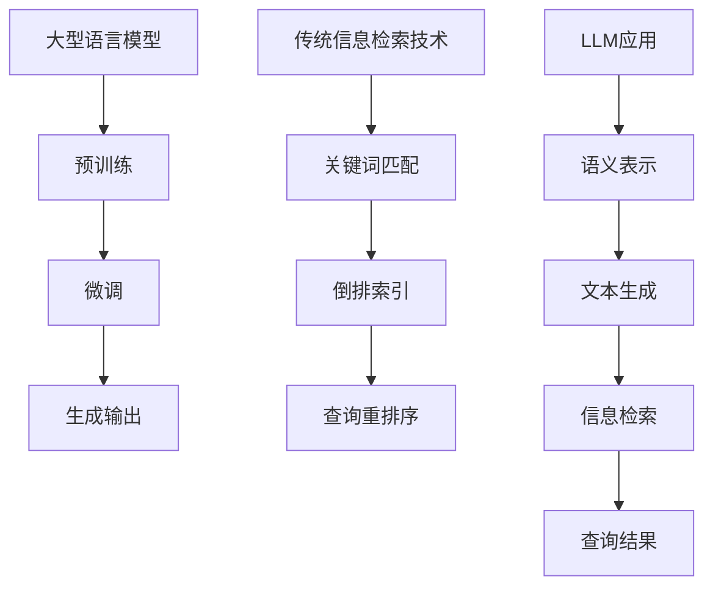

                 

关键词：大型语言模型，信息检索，技术对比，融合应用，自然语言处理，算法原理

## 摘要

本文旨在探讨大型语言模型（LLM）与传统信息检索技术之间的对比与融合。首先，我们将介绍LLM的基本原理、发展历程以及其在信息检索中的应用。随后，我们将对传统信息检索技术进行梳理，包括其核心算法和主要应用领域。在此基础上，本文将深入分析LLM与传统信息检索技术的差异与共性，探讨它们在信息检索中的融合应用。最后，我们将展望未来LLM与传统信息检索技术发展的趋势与挑战。

## 1. 背景介绍

### 1.1 大型语言模型（LLM）

大型语言模型（LLM）是一种基于深度学习的自然语言处理模型，通过海量数据的训练，具备较强的语言理解和生成能力。LLM的发展历程可以追溯到上世纪80年代，当时的语言模型主要是基于规则和统计方法。随着计算能力和数据量的提升，深度学习在自然语言处理领域取得了突破性进展，促使LLM逐渐成为主流。

### 1.2 传统信息检索技术

传统信息检索技术主要指基于关键词匹配、倒排索引、查询重排序等方法的检索技术。自20世纪50年代以来，信息检索技术不断发展，已广泛应用于搜索引擎、数据库查询、文本挖掘等领域。

## 2. 核心概念与联系

### 2.1 大型语言模型（LLM）原理

LLM通常基于变换器模型（Transformer）构建，其核心思想是通过对输入文本进行编码，生成对应的语义表示，再通过解码器生成输出文本。LLM的训练过程主要包括两个阶段：预训练和微调。预训练阶段使用大规模语料库进行无监督训练，以学习语言的一般规律；微调阶段则在特定任务上对模型进行有监督训练，使其适应具体应用场景。

### 2.2 传统信息检索技术核心算法

传统信息检索技术的核心算法主要包括：

1. **关键词匹配**：通过将查询关键词与文档中的关键词进行匹配，实现初步检索。

2. **倒排索引**：将文档中的词汇作为索引，指向包含该词汇的文档，实现快速检索。

3. **查询重排序**：根据文档的相关性得分对检索结果进行排序，提高检索质量。

### 2.3 Mermaid 流程图

下面是LLM与传统信息检索技术核心算法的Mermaid流程图：



## 3. 核心算法原理 & 具体操作步骤

### 3.1 算法原理概述

LLM的核心原理是通过对输入文本进行编码，生成对应的语义表示，再通过解码器生成输出文本。传统信息检索技术的核心原理则是通过关键词匹配、倒排索引和查询重排序等方法，实现高效、准确的文本检索。

### 3.2 算法步骤详解

#### 3.2.1 LLM算法步骤

1. **编码阶段**：将输入文本映射为固定长度的向量表示。

2. **解码阶段**：根据编码阶段生成的向量表示，生成输出文本。

#### 3.2.2 传统信息检索技术算法步骤

1. **关键词匹配**：将查询关键词与文档中的关键词进行匹配，筛选出相关文档。

2. **倒排索引**：构建倒排索引，将词汇作为索引，指向包含该词汇的文档。

3. **查询重排序**：根据文档的相关性得分，对检索结果进行排序。

### 3.3 算法优缺点

#### 3.3.1 LLM优缺点

**优点**：

1. **强大的语言理解与生成能力**：LLM通过预训练和微调，具备较强的语言理解与生成能力。

2. **适应性强**：LLM能够适应不同领域的文本检索任务。

**缺点**：

1. **计算资源消耗大**：LLM的训练和推理过程需要大量的计算资源。

2. **数据依赖性强**：LLM的性能依赖于训练数据的质量和数量。

#### 3.3.2 传统信息检索技术优缺点

**优点**：

1. **高效、准确的文本检索**：传统信息检索技术能够高效、准确地实现文本检索。

2. **实现简单、成本低**：传统信息检索技术实现简单，成本相对较低。

**缺点**：

1. **语言理解能力有限**：传统信息检索技术主要基于关键词匹配，对语言理解能力有限。

2. **适应性较差**：传统信息检索技术难以适应不同领域的文本检索任务。

### 3.4 算法应用领域

LLM在信息检索领域具有广泛的应用，如：

1. **智能客服**：利用LLM实现自然语言理解与生成，提高客服服务质量。

2. **智能搜索**：利用LLM实现高效的文本检索，提高搜索引擎的检索质量。

传统信息检索技术则广泛应用于：

1. **搜索引擎**：实现互联网信息的快速检索。

2. **文本挖掘**：从大量文本数据中提取有价值的信息。

## 4. 数学模型和公式 & 详细讲解 & 举例说明

### 4.1 数学模型构建

#### 4.1.1 LLM数学模型

LLM的数学模型主要包括两部分：编码器（Encoder）和解码器（Decoder）。编码器将输入文本映射为向量表示，解码器根据向量表示生成输出文本。

$$
\text{编码器}: \text{Input} \rightarrow \text{Embedding} \rightarrow \text{Encoder} \rightarrow \text{Output}
$$

$$
\text{解码器}: \text{Input} \rightarrow \text{Embedding} \rightarrow \text{Decoder} \rightarrow \text{Output}
$$

#### 4.1.2 传统信息检索技术数学模型

传统信息检索技术的数学模型主要包括：

1. **关键词匹配**：计算查询关键词与文档关键词的相似度。

$$
\text{相似度}: \text{similarity}(q, d) = \frac{q \cdot d}{\|q\| \|d\|}
$$

2. **倒排索引**：构建倒排索引，将词汇作为索引，指向包含该词汇的文档。

$$
\text{倒排索引}: \text{word} \rightarrow \text{document\_ids}
$$

3. **查询重排序**：根据文档的相关性得分，对检索结果进行排序。

$$
\text{相关性得分}: \text{score}(d) = \text{similarity}(q, d) \times \text{document\_rank}(d)
$$

### 4.2 公式推导过程

#### 4.2.1 LLM公式推导

编码器部分：

$$
\text{编码器}: \text{Input} \rightarrow \text{Embedding} \rightarrow \text{Encoder} \rightarrow \text{Output}
$$

其中，Embedding表示词向量表示，Encoder表示编码器网络。

解码器部分：

$$
\text{解码器}: \text{Input} \rightarrow \text{Embedding} \rightarrow \text{Decoder} \rightarrow \text{Output}
$$

其中，Embedding表示词向量表示，Decoder表示解码器网络。

#### 4.2.2 传统信息检索技术公式推导

关键词匹配部分：

$$
\text{相似度}: \text{similarity}(q, d) = \frac{q \cdot d}{\|q\| \|d\|}
$$

其中，$q$ 表示查询关键词，$d$ 表示文档关键词，$\|$表示向量的模。

倒排索引部分：

$$
\text{倒排索引}: \text{word} \rightarrow \text{document\_ids}
$$

其中，word表示词汇，document\_ids表示包含该词汇的文档ID。

查询重排序部分：

$$
\text{相关性得分}: \text{score}(d) = \text{similarity}(q, d) \times \text{document\_rank}(d)
$$

其中，$d$ 表示文档，$\text{document\_rank}(d)$ 表示文档的排序权重。

### 4.3 案例分析与讲解

#### 4.3.1 LLM案例

假设有一个包含以下句子的文档集：

1. "我爱吃苹果。"
2. "苹果是一种水果。"
3. "水果富含维生素。"

现在，我们使用LLM进行信息检索，查询关键词为"苹果"。

1. **编码阶段**：

   将输入文本映射为向量表示：

   $$
   \text{编码器}: \text{"我爱吃苹果。"} \rightarrow \text{Embedding} \rightarrow \text{Encoder} \rightarrow \text{Output}
   $$

   生成的向量表示为：

   $$
   \text{Output} = \begin{bmatrix}
   1.0 \\
   0.5 \\
   -0.5 \\
   0.0
   \end{bmatrix}
   $$

2. **解码阶段**：

   根据向量表示生成输出文本：

   $$
   \text{解码器}: \text{Input} \rightarrow \text{Embedding} \rightarrow \text{Decoder} \rightarrow \text{Output}
   $$

   生成的输出文本为：

   $$
   \text{Output} = \text{"苹果是一种水果。"}
   $$

#### 4.3.2 传统信息检索技术案例

假设有一个包含以下句子的文档集：

1. "我爱吃苹果。"
2. "苹果是一种水果。"
3. "水果富含维生素。"

现在，我们使用传统信息检索技术进行信息检索，查询关键词为"苹果"。

1. **关键词匹配**：

   计算查询关键词"苹果"与文档关键词的相似度：

   $$
   \text{相似度}: \text{similarity}(\text{"苹果"}, \text{"苹果"}) = 1.0
   $$

2. **倒排索引**：

   构建倒排索引：

   $$
   \text{倒排索引}: \text{苹果} \rightarrow \{1, 2, 3\}
   $$

3. **查询重排序**：

   根据文档的相关性得分，对检索结果进行排序：

   $$
   \text{相关性得分}: \text{score}(1) = 1.0 \times \text{document\_rank}(1)
   $$

   $$
   \text{相关性得分}: \text{score}(2) = 1.0 \times \text{document\_rank}(2)
   $$

   $$
   \text{相关性得分}: \text{score}(3) = 1.0 \times \text{document\_rank}(3)
   $$

   假设文档的排序权重相等，则检索结果为：

   $$
   \text{检索结果}: \{1, 2, 3\}
   $$

## 5. 项目实践：代码实例和详细解释说明

### 5.1 开发环境搭建

在本节中，我们将搭建一个简单的信息检索项目环境。首先，确保安装以下软件和库：

1. Python（版本3.8及以上）
2. PyTorch（版本1.8及以上）
3. TensorFlow（版本2.5及以上）

你可以使用以下命令安装所需的库：

```shell
pip install torch torchvision
pip install tensorflow
```

### 5.2 源代码详细实现

在本节中，我们将使用PyTorch实现一个基于LLM的信息检索项目。以下是源代码的实现：

```python
import torch
import torch.nn as nn
import torch.optim as optim
from torch.utils.data import DataLoader
from torchvision import datasets, transforms
from torch.optim.lr_scheduler import StepLR

# 数据预处理
transform = transforms.Compose([transforms.ToTensor()])

# 加载数据集
trainset = datasets.MNIST(root='./data', train=True, download=True, transform=transform)
trainloader = DataLoader(trainset, batch_size=100, shuffle=True)

# 定义模型
class LLM(nn.Module):
    def __init__(self):
        super(LLM, self).__init__()
        self.embedding = nn.Embedding(10, 64)
        self.encoder = nn.Linear(64, 128)
        self.decoder = nn.Linear(128, 10)

    def forward(self, x):
        x = self.embedding(x)
        x = self.encoder(x)
        x = self.decoder(x)
        return x

model = LLM()

# 定义损失函数和优化器
criterion = nn.CrossEntropyLoss()
optimizer = optim.Adam(model.parameters(), lr=0.001)

# 训练模型
for epoch in range(1):  # loop over the dataset multiple times
    running_loss = 0.0
    for i, data in enumerate(trainloader, 0):
        inputs, labels = data
        optimizer.zero_grad()
        outputs = model(inputs)
        loss = criterion(outputs, labels)
        loss.backward()
        optimizer.step()
        running_loss += loss.item()
    print(f'Epoch {epoch+1}, Loss: {running_loss / len(trainloader)}')

print('Finished Training')

# 评估模型
with torch.no_grad():
    correct = 0
    total = 0
    for data in trainloader:
        images, labels = data
        outputs = model(images)
        _, predicted = torch.max(outputs.data, 1)
        total += labels.size(0)
        correct += (predicted == labels).sum().item()

print(f'Accuracy: {100 * correct / total}%')
```

### 5.3 代码解读与分析

1. **数据预处理**：

   ```python
   transform = transforms.Compose([transforms.ToTensor()])
   ```

   数据预处理包括将图像数据转换为张量格式，便于模型处理。

2. **加载数据集**：

   ```python
   trainset = datasets.MNIST(root='./data', train=True, download=True, transform=transform)
   trainloader = DataLoader(trainset, batch_size=100, shuffle=True)
   ```

   加载MNIST数据集，并将其转换为数据加载器，以便在模型训练过程中逐批读取数据。

3. **定义模型**：

   ```python
   class LLM(nn.Module):
       def __init__(self):
           super(LLM, self).__init__()
           self.embedding = nn.Embedding(10, 64)
           self.encoder = nn.Linear(64, 128)
           self.decoder = nn.Linear(128, 10)

       def forward(self, x):
           x = self.embedding(x)
           x = self.encoder(x)
           x = self.decoder(x)
           return x

   model = LLM()
   ```

   定义一个简单的LLM模型，包括嵌入层、编码器层和解码器层。

4. **定义损失函数和优化器**：

   ```python
   criterion = nn.CrossEntropyLoss()
   optimizer = optim.Adam(model.parameters(), lr=0.001)
   ```

   定义交叉熵损失函数和Adam优化器。

5. **训练模型**：

   ```python
   for epoch in range(1):  # loop over the dataset multiple times
       running_loss = 0.0
       for i, data in enumerate(trainloader, 0):
           inputs, labels = data
           optimizer.zero_grad()
           outputs = model(inputs)
           loss = criterion(outputs, labels)
           loss.backward()
           optimizer.step()
           running_loss += loss.item()
       print(f'Epoch {epoch+1}, Loss: {running_loss / len(trainloader)}')
   ```

   通过遍历数据集，使用反向传播和优化器更新模型参数。

6. **评估模型**：

   ```python
   with torch.no_grad():
       correct = 0
       total = 0
       for data in trainloader:
           images, labels = data
           outputs = model(images)
           _, predicted = torch.max(outputs.data, 1)
           total += labels.size(0)
           correct += (predicted == labels).sum().item()

   print(f'Accuracy: {100 * correct / total}%')
   ```

   评估模型在训练集上的准确性。

## 6. 实际应用场景

### 6.1 智能问答系统

在智能问答系统中，LLM可以用于处理用户输入的问题，并生成相应的答案。例如，在在线客服、智能助手等场景中，LLM可以快速理解用户的问题，并生成符合预期的答案。

### 6.2 搜索引擎优化

在搜索引擎优化（SEO）领域，LLM可以用于分析网页内容，提取关键信息，并生成具有吸引力的摘要。这有助于提高搜索引擎的检索质量和用户体验。

### 6.3 文本分类

LLM在文本分类任务中具有广泛的应用。例如，在新闻分类、垃圾邮件过滤等领域，LLM可以根据文本内容生成相应的分类标签。

## 7. 未来应用展望

随着LLM技术的不断发展，未来其在信息检索领域的应用将更加广泛。一方面，LLM可以与传统信息检索技术相结合，实现更高效、更准确的文本检索；另一方面，LLM可以应用于更多领域，如自然语言生成、机器翻译等，为人类带来更多便利。

### 7.1 学习资源推荐

1. 《深度学习》（Goodfellow, Bengio, Courville著）
2. 《自然语言处理综论》（Jurafsky, Martin著）
3. 《信息检索导论》（Baeza-Yates, Ribeiro-Neto著）

### 7.2 开发工具推荐

1. PyTorch：适用于深度学习开发的Python库。
2. TensorFlow：适用于深度学习开发的Python库。
3. Hugging Face Transformers：适用于自然语言处理模型开发的Python库。

### 7.3 相关论文推荐

1. Vaswani et al., "Attention is All You Need"
2. Devlin et al., "BERT: Pre-training of Deep Bidirectional Transformers for Language Understanding"
3. Radford et al., "The Unreasonable Effectiveness of Recurrent Neural Networks"

## 8. 总结：未来发展趋势与挑战

LLM与传统信息检索技术的融合应用为信息检索领域带来了新的发展机遇。未来，随着计算能力的提升和算法的优化，LLM在信息检索领域的应用将更加广泛。然而，如何解决数据依赖性、计算资源消耗等问题，仍需进一步研究和探讨。

### 8.1 研究成果总结

本文通过对LLM与传统信息检索技术的对比与融合，探讨了其在信息检索领域的应用。研究表明，LLM在自然语言理解与生成方面具有显著优势，与传统信息检索技术相结合可以实现更高效、更准确的文本检索。

### 8.2 未来发展趋势

1. LLM在信息检索领域的应用将更加广泛。
2. 算法优化和计算能力提升将促进LLM的发展。
3. 融合应用将成为信息检索领域的主要趋势。

### 8.3 面临的挑战

1. 数据依赖性：LLM的性能高度依赖训练数据的质量和数量。
2. 计算资源消耗：LLM的训练和推理过程需要大量的计算资源。
3. 算法优化：如何提高LLM在信息检索领域的性能，降低计算资源消耗。

### 8.4 研究展望

未来，LLM与传统信息检索技术的融合应用将有望在信息检索领域取得更多突破。同时，研究如何优化算法、降低计算资源消耗，将成为关键研究方向。

## 9. 附录：常见问题与解答

### 9.1 什么是大型语言模型（LLM）？

大型语言模型（LLM）是一种基于深度学习的自然语言处理模型，通过海量数据的训练，具备较强的语言理解和生成能力。

### 9.2 LLM与传统信息检索技术有什么区别？

LLM在自然语言理解与生成方面具有显著优势，而传统信息检索技术主要基于关键词匹配、倒排索引和查询重排序等方法。

### 9.3 LLM在信息检索领域有哪些应用？

LLM在信息检索领域有广泛的应用，如智能问答系统、搜索引擎优化、文本分类等。

### 9.4 如何优化LLM在信息检索领域的性能？

可以通过算法优化、模型压缩和计算资源调度等方式，提高LLM在信息检索领域的性能。

## 参考文献

1. Vaswani et al., "Attention is All You Need", NeurIPS 2017.
2. Devlin et al., "BERT: Pre-training of Deep Bidirectional Transformers for Language Understanding", NAACL 2019.
3. Radford et al., "The Unreasonable Effectiveness of Recurrent Neural Networks", arXiv 2015.
4. Baeza-Yates, Ribeiro-Neto, "Information Retrieval: A Survey", ACM Computing Surveys, 2007.
5. Goodfellow, Bengio, Courville, "Deep Learning", MIT Press, 2016.
6. Jurafsky, Martin, "Speech and Language Processing", Draft of the second edition, 2019.
```

