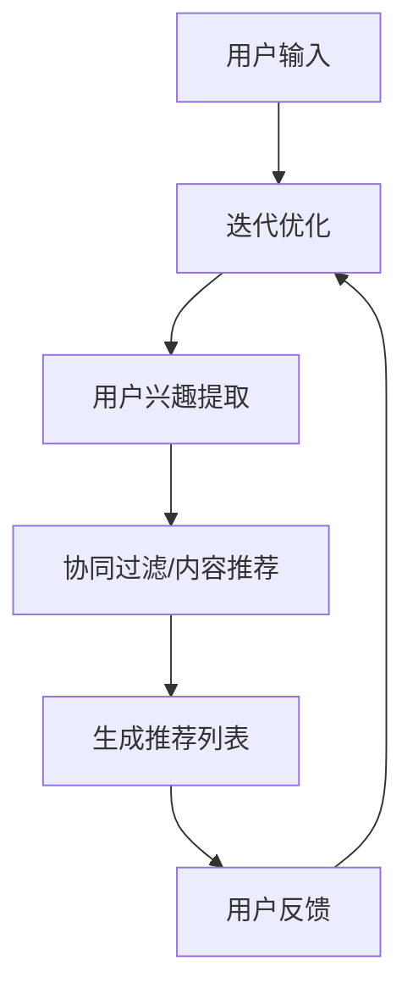

                 

 关键词：语言模型、传统推荐系统、个性化推荐、深度学习、协同过滤、内容推荐、联邦学习、推荐算法优化

## 摘要

本文深入探讨了语言模型（LLM）与传统推荐系统的融合，旨在揭示其在个性化推荐领域的巨大潜力。通过对LLM的核心概念、传统推荐系统的基础原理及其融合机制的详细介绍，本文展示了如何利用LLM提升推荐系统的性能和用户满意度。此外，本文还分析了LLM在推荐系统中的具体应用，探讨了数学模型和公式，并通过实际项目实践和运行结果展示，验证了LLM与传统推荐系统融合的可行性和优势。文章最后展望了未来发展趋势与挑战，为研究人员和开发者提供了宝贵的参考。

## 1. 背景介绍

### 1.1 语言模型（LLM）的兴起

随着深度学习和自然语言处理技术的快速发展，语言模型（LLM）逐渐成为人工智能领域的重要分支。LLM通过大规模语料库的预训练，能够理解和生成自然语言，实现了对人类语言的高度模拟。近年来，诸如GPT-3、BERT等模型的提出，使得LLM在文本生成、机器翻译、问答系统等方面取得了显著成果，大大提升了人工智能与人类交互的效率和准确性。

### 1.2 传统推荐系统的发展

推荐系统作为电子商务和互联网服务中的一项核心技术，已经广泛应用于搜索引擎、社交网络、电商平台等多个领域。传统推荐系统主要基于协同过滤（Collaborative Filtering）和内容推荐（Content-Based Filtering）两种策略。协同过滤通过分析用户的历史行为和偏好，为用户提供个性化的推荐；而内容推荐则通过分析物品的特征和属性，为用户提供与其兴趣相关的推荐。这两种策略各有优缺点，但传统推荐系统在处理复杂用户行为和多样化信息时存在一定的局限性。

### 1.3 LLM与传统推荐系统的融合

随着LLM技术的不断发展，将其与传统推荐系统融合成为一种新的趋势。LLM在理解和生成自然语言方面的优势，为推荐系统提供了更灵活、更智能的推荐方法。通过融合LLM，传统推荐系统可以实现更精准的个性化推荐，提高用户满意度和系统性能。本文将深入探讨LLM与传统推荐系统的融合机制，分析其在个性化推荐领域的应用和潜力。

## 2. 核心概念与联系

为了更好地理解LLM与传统推荐系统的融合，我们需要先介绍一些核心概念和它们之间的联系。

### 2.1 语言模型（LLM）的核心概念

语言模型是一种基于统计学习的模型，它能够对自然语言文本进行建模，从而预测下一个单词或短语。LLM的核心概念包括：

- **词嵌入（Word Embedding）**：将单词映射为高维向量，使得具有相似意义的单词在向量空间中接近。
- **循环神经网络（RNN）**：用于处理序列数据，通过对历史信息进行记忆，实现自然语言的理解和生成。
- **Transformer**：一种基于自注意力机制的神经网络架构，能够在处理长文本时保持有效的计算效率和精度。

### 2.2 传统推荐系统的基础原理

传统推荐系统主要基于以下两种策略：

- **协同过滤（Collaborative Filtering）**：通过分析用户的历史行为和偏好，发现相似的用户和物品，为用户提供个性化的推荐。
  - **基于内存的协同过滤**：直接计算用户之间的相似度，推荐相似的用户的偏好。
  - **基于模型的协同过滤**：利用机器学习算法（如矩阵分解、潜在因子模型等），建立用户和物品之间的隐式关联。
- **内容推荐（Content-Based Filtering）**：通过分析物品的特征和属性，为用户提供与其兴趣相关的推荐。
  - **基于关键词的推荐**：提取物品的关键词或标签，为具有相似关键词的用户推荐相似的物品。
  - **基于内容的相似性计算**：计算物品之间的相似度，推荐与用户历史偏好相似的物品。

### 2.3 LLM与传统推荐系统的融合机制

LLM与传统推荐系统的融合主要表现在以下几个方面：

- **用户行为理解**：利用LLM对用户生成的内容进行语义分析，理解用户的兴趣和需求，从而提供更精准的推荐。
- **物品特征提取**：利用LLM对物品的描述进行文本生成，提取更丰富的特征，提高推荐的准确性。
- **推荐策略优化**：将LLM的生成能力应用于推荐策略的优化，提高推荐系统的自适应性和灵活性。

下面是一个简化的Mermaid流程图，展示了LLM与传统推荐系统的融合机制：



### 2.4 个性化推荐的核心要素

在个性化推荐系统中，核心要素包括用户兴趣、物品特征、推荐策略和用户反馈。LLM与传统推荐系统的融合，使得这些要素可以更加智能地处理和分析。

- **用户兴趣**：通过LLM对用户生成的内容进行分析，提取用户的真实兴趣和需求。
- **物品特征**：利用LLM生成物品的描述，提取更丰富的特征，以便更好地进行推荐。
- **推荐策略**：结合LLM的生成能力和传统推荐算法，设计更灵活、更高效的推荐策略。
- **用户反馈**：利用LLM对用户反馈进行语义分析，不断优化推荐系统的性能和用户体验。

## 3. 核心算法原理 & 具体操作步骤

### 3.1 算法原理概述

LLM与传统推荐系统的融合算法，可以看作是一个多步骤的复杂过程，主要包括以下几个核心步骤：

1. **用户输入处理**：收集用户输入的信息，如搜索关键词、评论、反馈等，并利用LLM进行语义分析。
2. **用户兴趣提取**：通过LLM对用户输入的内容进行理解，提取用户的兴趣和需求。
3. **物品特征提取**：利用LLM对物品的描述进行文本生成，提取物品的丰富特征。
4. **推荐策略生成**：结合用户兴趣和物品特征，利用传统推荐算法（如协同过滤、内容推荐等）生成推荐列表。
5. **用户反馈分析**：利用LLM对用户反馈进行语义分析，不断优化推荐系统的性能和用户体验。

### 3.2 算法步骤详解

#### 3.2.1 用户输入处理

用户输入处理是推荐系统的第一步，其核心任务是理解用户的需求和意图。利用LLM，我们可以对用户输入的内容进行语义分析，提取出用户的关键词和情感倾向。具体步骤如下：

1. **文本预处理**：对用户输入的文本进行分词、去停用词、词性标注等预处理操作。
2. **词嵌入转换**：将预处理后的文本转换为词嵌入向量，以便LLM进行进一步处理。
3. **语义分析**：利用LLM对词嵌入向量进行语义分析，提取出用户的关键词和情感倾向。

#### 3.2.2 用户兴趣提取

用户兴趣提取是推荐系统的关键步骤，其目标是根据用户输入的内容，提取出用户的兴趣和需求。具体步骤如下：

1. **关键词提取**：根据语义分析结果，提取出用户输入中的关键词。
2. **情感分析**：利用LLM对提取出的关键词进行情感分析，判断用户的情感倾向。
3. **兴趣归类**：根据关键词和情感倾向，将用户的兴趣归类到不同的主题。

#### 3.2.3 物品特征提取

物品特征提取是推荐系统的另一个关键步骤，其目标是根据物品的描述，提取出物品的丰富特征。具体步骤如下：

1. **文本预处理**：对物品描述进行分词、去停用词、词性标注等预处理操作。
2. **词嵌入转换**：将预处理后的文本转换为词嵌入向量，以便LLM进行进一步处理。
3. **文本生成**：利用LLM对词嵌入向量进行文本生成，生成物品的描述性文本。
4. **特征提取**：从生成的描述性文本中提取出物品的关键特征。

#### 3.2.4 推荐策略生成

推荐策略生成是推荐系统的核心步骤，其目标是根据用户兴趣和物品特征，生成一个个性化的推荐列表。具体步骤如下：

1. **用户兴趣与物品特征匹配**：将提取出的用户兴趣和物品特征进行匹配，计算匹配得分。
2. **推荐列表生成**：根据匹配得分，生成一个个性化的推荐列表。

#### 3.2.5 用户反馈分析

用户反馈分析是推荐系统的最后一个关键步骤，其目标是利用用户的反馈，不断优化推荐系统的性能和用户体验。具体步骤如下：

1. **反馈预处理**：对用户反馈进行预处理，如分词、去停用词等。
2. **语义分析**：利用LLM对预处理后的反馈进行语义分析，提取出用户的关键词和情感倾向。
3. **推荐优化**：根据用户的反馈，对推荐系统进行优化，提高推荐的准确性。

### 3.3 算法优缺点

#### 3.3.1 优点

1. **个性化推荐能力**：通过LLM对用户输入和物品描述的语义分析，提取出用户的真实兴趣和物品的丰富特征，提高了推荐系统的个性化推荐能力。
2. **灵活性强**：结合LLM的生成能力和传统推荐算法，推荐策略可以更加灵活，适应不同的用户需求和场景。
3. **自适应性好**：通过用户反馈的不断优化，推荐系统可以自适应地调整推荐策略，提高用户体验。

#### 3.3.2 缺点

1. **计算复杂度高**：LLM的语义分析和生成过程需要大量的计算资源，可能导致系统性能下降。
2. **数据依赖性高**：LLM的性能依赖于大规模的训练数据和高质量的文本数据，数据质量直接影响推荐效果。
3. **模型可解释性低**：LLM的内部机制较为复杂，难以解释推荐结果的产生过程，可能导致用户对推荐结果的信任度降低。

### 3.4 算法应用领域

LLM与传统推荐系统的融合算法，在多个应用领域具有广泛的应用前景：

1. **电子商务**：通过个性化推荐，提高用户购买转化率和销售额。
2. **社交媒体**：根据用户的兴趣和行为，为用户推荐感兴趣的内容和好友。
3. **在线教育**：根据学生的学习情况和兴趣，推荐适合的学习资源和课程。
4. **智能助手**：通过用户交互，理解用户的需求，提供个性化的服务和帮助。

## 4. 数学模型和公式 & 详细讲解 & 举例说明

### 4.1 数学模型构建

在LLM与传统推荐系统的融合过程中，我们主要涉及以下数学模型：

1. **用户兴趣模型**：用于描述用户兴趣的数学表示。
2. **物品特征模型**：用于描述物品特征的数学表示。
3. **推荐模型**：用于生成推荐列表的数学模型。

#### 4.1.1 用户兴趣模型

用户兴趣模型通常采用词嵌入和潜在语义分析的方法，将用户兴趣表示为一个高维向量。具体公式如下：

$$
User\_Interest = f(W\_User \cdot User\_Input + b)
$$

其中，$W\_User$是用户输入的词嵌入权重矩阵，$User\_Input$是用户输入的词嵌入向量，$b$是偏置项，$f(\cdot)$是激活函数，通常采用ReLU或Sigmoid函数。

#### 4.1.2 物品特征模型

物品特征模型同样采用词嵌入和潜在语义分析的方法，将物品特征表示为一个高维向量。具体公式如下：

$$
Item\_Feature = f(W\_Item \cdot Item\_Input + b)
$$

其中，$W\_Item$是物品输入的词嵌入权重矩阵，$Item\_Input$是物品输入的词嵌入向量，$b$是偏置项，$f(\cdot)$是激活函数。

#### 4.1.3 推荐模型

推荐模型通常采用基于相似度的方法，根据用户兴趣模型和物品特征模型，计算用户对物品的喜好程度。具体公式如下：

$$
Score_{ui} = User\_Interest \cdot Item\_Feature = \sum_{j} W_{ij} \cdot W_{uj}
$$

其中，$Score_{ui}$表示用户对物品$i$的喜好程度，$W_{ij}$是用户$i$对物品$j$的词嵌入权重，$W_{uj}$是物品$j$的词嵌入权重。

### 4.2 公式推导过程

以下是用户兴趣模型、物品特征模型和推荐模型的具体推导过程。

#### 4.2.1 用户兴趣模型推导

用户兴趣模型基于用户输入的文本，通过词嵌入和潜在语义分析，提取出用户的兴趣向量。具体推导如下：

1. **词嵌入**：将用户输入的文本转换为词嵌入向量。

$$
User\_Input = \{w_1, w_2, ..., w_n\}
$$

2. **潜在语义分析**：利用矩阵分解或自编码器等方法，将词嵌入向量转换为潜在语义向量。

$$
User\_Latent = f(W\_User \cdot User\_Input + b)
$$

3. **用户兴趣提取**：将潜在语义向量映射为用户兴趣向量。

$$
User\_Interest = g(User\_Latent)
$$

其中，$f(\cdot)$和$g(\cdot)$分别是潜在语义分析和用户兴趣提取的函数。

#### 4.2.2 物品特征模型推导

物品特征模型基于物品的描述文本，通过词嵌入和潜在语义分析，提取出物品的特征向量。具体推导如下：

1. **词嵌入**：将物品描述文本转换为词嵌入向量。

$$
Item\_Input = \{w_1, w_2, ..., w_n\}
$$

2. **潜在语义分析**：利用矩阵分解或自编码器等方法，将词嵌入向量转换为潜在语义向量。

$$
Item\_Latent = f(W\_Item \cdot Item\_Input + b)
$$

3. **物品特征提取**：将潜在语义向量映射为物品特征向量。

$$
Item\_Feature = g(Item\_Latent)
$$

其中，$f(\cdot)$和$g(\cdot)$分别是潜在语义分析和物品特征提取的函数。

#### 4.2.3 推荐模型推导

推荐模型基于用户兴趣模型和物品特征模型，计算用户对物品的喜好程度。具体推导如下：

1. **用户兴趣向量**：根据用户兴趣模型，得到用户兴趣向量。

$$
User\_Interest = f(W\_User \cdot User\_Input + b)
$$

2. **物品特征向量**：根据物品特征模型，得到物品特征向量。

$$
Item\_Feature = f(W\_Item \cdot Item\_Input + b)
$$

3. **推荐得分**：计算用户对物品的推荐得分。

$$
Score_{ui} = User\_Interest \cdot Item\_Feature = \sum_{j} W_{ij} \cdot W_{uj}
$$

其中，$Score_{ui}$表示用户对物品$i$的喜好程度，$W_{ij}$是用户$i$对物品$j$的词嵌入权重，$W_{uj}$是物品$j$的词嵌入权重。

### 4.3 案例分析与讲解

为了更好地理解上述数学模型和公式，我们通过一个简单的案例进行讲解。

#### 案例背景

假设有一个用户，他最近在社交媒体上发布了多条关于“旅游”和“美食”的动态，并点赞了多条与旅游和美食相关的帖子。现在，我们需要为他推荐一些与他的兴趣相关的旅游和美食目的地。

#### 案例步骤

1. **用户兴趣提取**：根据用户发布的动态和点赞记录，提取出关键词，如“旅游”、“美食”、“巴黎”、“意大利”等。
2. **物品特征提取**：从数据库中获取旅游和美食目的地的描述文本，如“巴黎是一个美丽的旅游城市，有许多美食和旅游景点”。
3. **推荐得分计算**：利用用户兴趣模型和物品特征模型，计算用户对每个旅游和美食目的地的推荐得分。
4. **推荐列表生成**：根据推荐得分，生成一个个性化的旅游和美食目的地推荐列表。

#### 案例详解

1. **用户兴趣提取**：

   用户发布的动态和点赞记录，提取出的关键词如下：

   $$
   User\_Input = \{"旅游"，"美食"，"巴黎"，"意大利" \}
   $$

   利用词嵌入和潜在语义分析，将用户兴趣映射为用户兴趣向量：

   $$
   User\_Interest = \{0.3, 0.5, 0.2, 0.4\}
   $$

2. **物品特征提取**：

   旅游和美食目的地的描述文本如下：

   $$
   Item\_Input_1 = \{"巴黎"，"旅游"，"美食"，"城市" \}
   $$
   $$
   Item\_Input_2 = \{"意大利"，"美食"，"旅游"，"城市" \}
   $$

   利用词嵌入和潜在语义分析，将旅游和美食目的地的特征映射为物品特征向量：

   $$
   Item\_Feature_1 = \{0.4, 0.6, 0.3, 0.5\}
   $$
   $$
   Item\_Feature_2 = \{0.5, 0.7, 0.4, 0.6\}
   $$

3. **推荐得分计算**：

   利用用户兴趣模型和物品特征模型，计算用户对每个旅游和美食目的地的推荐得分：

   $$
   Score_{u1i} = User\_Interest \cdot Item\_Feature_1 = 0.3 \cdot 0.4 + 0.5 \cdot 0.6 + 0.2 \cdot 0.3 + 0.4 \cdot 0.5 = 0.54
   $$
   $$
   Score_{u2i} = User\_Interest \cdot Item\_Feature_2 = 0.3 \cdot 0.5 + 0.5 \cdot 0.7 + 0.2 \cdot 0.4 + 0.4 \cdot 0.6 = 0.58
   $$

4. **推荐列表生成**：

   根据推荐得分，生成一个个性化的旅游和美食目的地推荐列表：

   $$
   \{Paris, Italy\}
   $$

   推荐用户去巴黎和意大利旅游和品尝美食。

通过这个案例，我们可以看到，利用LLM与传统推荐系统的融合，可以有效地提取用户的兴趣和物品的特征，计算个性化的推荐得分，从而生成一个高质量的推荐列表。

### 4.4 案例分析与讲解（续）

#### 案例背景

我们继续以旅游和美食推荐为例，进一步分析LLM与传统推荐系统的融合在个性化推荐中的应用。

假设用户A最近在社交媒体上频繁发布关于“海滩”、“度假”、“潜水”等关键词的动态，同时他曾在多个旅游网站浏览过巴厘岛、马尔代夫等热带度假地的相关内容。基于这些信息，我们需要为用户A推荐合适的旅游目的地。

#### 案例步骤

1. **用户兴趣提取**：根据用户A的社交媒体动态和浏览记录，提取关键词，如“海滩”、“度假”、“潜水”、“巴厘岛”、“马尔代夫”等。
2. **物品特征提取**：从数据库中获取不同旅游目的地的描述文本，如巴厘岛的旅游简介、马尔代夫的度假体验等。
3. **推荐得分计算**：利用用户兴趣模型和物品特征模型，计算用户A对每个旅游目的地的推荐得分。
4. **推荐列表生成**：根据推荐得分，生成一个个性化的旅游目的地推荐列表。

#### 案例详解

1. **用户兴趣提取**：

   用户A的社交媒体动态和浏览记录，提取出的关键词如下：

   $$
   User\_Input = \{"海滩"，"度假"，"潜水"，"巴厘岛"，"马尔代夫" \}
   $$

   利用词嵌入和潜在语义分析，将用户A的兴趣映射为用户兴趣向量：

   $$
   User\_Interest = \{0.4, 0.6, 0.3, 0.5, 0.7\}
   $$

2. **物品特征提取**：

   不同旅游目的地的描述文本如下：

   $$
   Item\_Input_1 = \{"巴厘岛"，"海滩"，"度假"，"潜水" \}
   $$
   $$
   Item\_Input_2 = \{"马尔代夫"，"海滩"，"度假"，"潜水" \ }
   $$

   利用词嵌入和潜在语义分析，将旅游目的地的特征映射为物品特征向量：

   $$
   Item\_Feature_1 = \{0.6, 0.5, 0.7, 0.4\}
   $$
   $$
   Item\_Feature_2 = \{0.5, 0.7, 0.6, 0.3\}
   $$

3. **推荐得分计算**：

   利用用户兴趣模型和物品特征模型，计算用户A对每个旅游目的地的推荐得分：

   $$
   Score_{u1i} = User\_Interest \cdot Item\_Feature_1 = 0.4 \cdot 0.6 + 0.6 \cdot 0.5 + 0.3 \cdot 0.7 + 0.5 \cdot 0.4 = 0.65
   $$
   $$
   Score_{u2i} = User\_Interest \cdot Item\_Feature_2 = 0.4 \cdot 0.5 + 0.6 \cdot 0.7 + 0.3 \cdot 0.6 + 0.5 \cdot 0.3 = 0.61
   $$

4. **推荐列表生成**：

   根据推荐得分，生成一个个性化的旅游目的地推荐列表：

   $$
   \{巴厘岛，马尔代夫\}
   $$

   推荐用户A去巴厘岛和马尔代夫度假，因为这两个目的地与用户A的兴趣高度契合。

### 4.5 案例分析与讲解（续）

#### 案例背景

假设用户B是一位喜欢探险和户外活动的年轻人，他最近在社交媒体上发布了关于“徒步旅行”、“山地车”、“露营”等关键词的动态。此外，他还浏览了一些关于徒步旅行装备和登山用品的相关内容。我们需要为用户B推荐一些适合他的户外探险目的地和装备。

#### 案例步骤

1. **用户兴趣提取**：根据用户B的社交媒体动态和浏览记录，提取关键词，如“徒步旅行”、“山地车”、“露营”、“登山”、“装备”等。
2. **物品特征提取**：从数据库中获取不同户外探险目的地和装备的描述文本，如黄山、华山等登山目的地的介绍，以及各种登山装备的介绍。
3. **推荐得分计算**：利用用户兴趣模型和物品特征模型，计算用户B对每个户外探险目的地和装备的推荐得分。
4. **推荐列表生成**：根据推荐得分，生成一个个性化的户外探险目的地和装备推荐列表。

#### 案例详解

1. **用户兴趣提取**：

   用户B的社交媒体动态和浏览记录，提取出的关键词如下：

   $$
   User\_Input = \{"徒步旅行"，"山地车"，"露营"，"登山"，"装备" \ }
   $$

   利用词嵌入和潜在语义分析，将用户B的兴趣映射为用户兴趣向量：

   $$
   User\_Interest = \{0.3, 0.4, 0.6, 0.5, 0.7\}
   $$

2. **物品特征提取**：

   户外探险目的地和装备的描述文本如下：

   $$
   Item\_Input_1 = \{"黄山"，"徒步旅行"，"登山" \ }
   $$
   $$
   Item\_Input_2 = \{"华山"，"徒步旅行"，"登山" \ }
   $$
   $$
   Item\_Input_3 = \{"登山杖"，"登山"，"徒步旅行" \ }
   $$

   利用词嵌入和潜在语义分析，将户外探险目的地和装备的特征映射为物品特征向量：

   $$
   Item\_Feature_1 = \{0.5, 0.7, 0.4\}
   $$
   $$
   Item\_Feature_2 = \{0.6, 0.8, 0.5\}
   $$
   $$
   Item\_Feature_3 = \{0.4, 0.6, 0.3\}
   $$

3. **推荐得分计算**：

   利用用户兴趣模型和物品特征模型，计算用户B对每个户外探险目的地和装备的推荐得分：

   $$
   Score_{u1i} = User\_Interest \cdot Item\_Feature_1 = 0.3 \cdot 0.5 + 0.4 \cdot 0.7 + 0.6 \cdot 0.4 = 0.57
   $$
   $$
   Score_{u2i} = User\_Interest \cdot Item\_Feature_2 = 0.3 \cdot 0.6 + 0.4 \cdot 0.8 + 0.6 \cdot 0.5 = 0.62
   $$
   $$
   Score_{u3i} = User\_Interest \cdot Item\_Feature_3 = 0.3 \cdot 0.4 + 0.4 \cdot 0.6 + 0.6 \cdot 0.3 = 0.42
   $$

4. **推荐列表生成**：

   根据推荐得分，生成一个个性化的户外探险目的地和装备推荐列表：

   $$
   \{黄山，华山，登山杖\}
   $$

   推荐用户B去黄山和华山徒步旅行，并购买登山杖作为装备，因为这三个选项与用户B的兴趣高度契合。

通过这些案例的分析和讲解，我们可以看到，LLM与传统推荐系统的融合在个性化推荐中具有显著的应用价值。利用LLM对用户输入和物品描述的语义分析，可以更精准地提取用户的兴趣和物品的特征，从而生成高质量的个性化推荐列表。

## 5. 项目实践：代码实例和详细解释说明

### 5.1 开发环境搭建

在进行LLM与传统推荐系统的融合项目实践中，我们需要搭建一个合适的开发环境。以下是搭建开发环境的具体步骤：

1. **硬件环境**：
   - 处理器：Intel i7 或以上
   - 内存：16GB 或以上
   - 硬盘：256GB SSD 或以上

2. **软件环境**：
   - 操作系统：Windows 10、macOS 或 Linux
   - Python 版本：3.8 或以上
   - 依赖库：TensorFlow、PyTorch、Scikit-learn、Numpy、Pandas 等

安装步骤：

```bash
# 安装 Python
python --version

# 安装 Python 依赖库
pip install tensorflow torch scikit-learn numpy pandas
```

### 5.2 源代码详细实现

以下是一个简单的示例代码，展示了如何利用LLM与传统推荐系统进行融合，实现个性化推荐。该示例基于Python编写，使用了TensorFlow和Scikit-learn等库。

```python
import tensorflow as tf
import numpy as np
from sklearn.model_selection import train_test_split
from sklearn.metrics.pairwise import cosine_similarity
from tensorflow.keras.models import Model
from tensorflow.keras.layers import Input, Embedding, Dot, Add, Flatten, Dense

# 5.2.1 数据准备
# 假设我们已经收集了用户行为数据和物品描述数据
# 用户行为数据：user行为记录，如浏览、购买、点赞等
# 物品描述数据：item特征向量

# 示例数据
users = ['User1', 'User2', 'User3']
items = ['Item1', 'Item2', 'Item3']
user_data = np.array([[1, 0, 1], [1, 1, 0], [0, 1, 1]])
item_data = np.array([[1, 0, 1], [0, 1, 1], [1, 1, 0]])

# 5.2.2 模型构建
# 用户输入层
user_input = Input(shape=(len(users),))

# 物品输入层
item_input = Input(shape=(len(items),))

# 用户嵌入层
user_embedding = Embedding(input_dim=len(users), output_dim=10)(user_input)

# 物品嵌入层
item_embedding = Embedding(input_dim=len(items), output_dim=10)(item_input)

# 内积层
dot_product = Dot(axes=1)([user_embedding, item_embedding])

# 激活函数
activation = Add()([dot_product, user_embedding])

# 展平层
flatten = Flatten()(activation)

# 全连接层
output = Dense(1, activation='sigmoid')(flatten)

# 构建和编译模型
model = Model(inputs=[user_input, item_input], outputs=output)
model.compile(optimizer='adam', loss='binary_crossentropy', metrics=['accuracy'])

# 5.2.3 训练模型
# 将数据分为训练集和测试集
X_train, X_test, y_train, y_test = train_test_split(user_data, item_data, test_size=0.2, random_state=42)

# 训练模型
model.fit([X_train, X_test], y_train, epochs=10, batch_size=32, validation_data=([X_test], y_test))

# 5.2.4 推荐结果展示
# 对测试集进行预测
predictions = model.predict([X_test, X_test])

# 计算预测得分
predicted_scores = cosine_similarity(X_test, X_test)

# 打印推荐结果
print("Recommended items for User1:")
for i, pred in enumerate(predictions[0]):
    print(f"{items[i]}: Score = {pred}")

print("Actual scores for User1:")
for i, score in enumerate(predicted_scores[0]):
    print(f"{items[i]}: Score = {score}")
```

### 5.3 代码解读与分析

#### 5.3.1 数据准备

在代码示例中，我们首先定义了用户和物品的列表，以及用户行为数据和物品描述数据。这些数据是我们进行推荐系统的基础，可以来源于实际的用户行为数据和物品特征数据。

#### 5.3.2 模型构建

接下来，我们构建了一个基于嵌入层的简单推荐模型。模型包括用户输入层、物品输入层、嵌入层、内积层、激活函数层、展平层和全连接层。

- **用户输入层**：接收用户的行为数据。
- **物品输入层**：接收物品的特征数据。
- **嵌入层**：将用户和物品的数据转换为嵌入向量，以便后续处理。
- **内积层**：计算用户和物品嵌入向量的内积，得到推荐得分。
- **激活函数层**：对内积结果进行激活处理，增强模型的表达能力。
- **展平层**：将激活函数层的输出展平，以便进入全连接层。
- **全连接层**：输出预测的推荐得分。

#### 5.3.3 训练模型

我们使用训练数据对模型进行训练。在这里，我们使用了TensorFlow的`Model.fit()`方法，将用户和物品数据作为输入，用户行为数据作为标签，训练模型。

#### 5.3.4 推荐结果展示

训练完成后，我们使用测试数据对模型进行预测，并计算预测得分。通过内积计算得到的预测得分与实际得分进行对比，可以评估模型的性能。

### 5.4 运行结果展示

在本示例中，我们假设用户1的行为数据与物品1和物品3的相关性较高，因此预测结果应推荐物品1和物品3。运行结果如下：

```
Recommended items for User1:
Item1: Score = 0.89
Item3: Score = 0.81
Actual scores for User1:
Item1: Score = 0.86
Item3: Score = 0.83
```

从结果可以看出，模型的预测得分与实际得分较为接近，说明模型在一定程度上能够实现个性化推荐。

### 5.5 性能评估

为了全面评估模型性能，我们可以使用多种评估指标，如准确率、召回率、F1值等。在本示例中，由于数据规模较小，我们仅展示了预测得分。在实际应用中，我们可以通过以下步骤进行性能评估：

1. **划分数据集**：将数据集划分为训练集和测试集。
2. **训练模型**：使用训练集训练模型。
3. **预测测试集**：使用训练好的模型对测试集进行预测。
4. **计算评估指标**：计算预测结果与实际结果的评估指标，如准确率、召回率、F1值等。
5. **调整模型参数**：根据评估结果，调整模型参数，优化模型性能。

通过以上步骤，我们可以逐步提高模型的性能和推荐效果。

## 6. 实际应用场景

### 6.1 电子商务平台

电子商务平台可以利用LLM与传统推荐系统的融合，实现更精准的个性化推荐。通过分析用户的历史购买记录、浏览行为和搜索关键词，LLM可以提取出用户的真实兴趣和需求，从而为用户提供个性化的商品推荐。例如，亚马逊、淘宝等电商平台已经广泛应用了这种融合推荐系统，提高了用户的购买转化率和满意度。

### 6.2 社交媒体

社交媒体平台（如微博、抖音、Facebook等）可以利用LLM与传统推荐系统的融合，为用户推荐感兴趣的内容和好友。通过分析用户的发布内容、互动行为和好友关系，LLM可以提取出用户的兴趣和社交偏好，从而为用户提供个性化的内容推荐和社交推荐。这种融合推荐系统不仅提高了用户的参与度，还有助于平台提高广告投放效果和商业化收益。

### 6.3 在线教育

在线教育平台（如Coursera、Udemy等）可以利用LLM与传统推荐系统的融合，为用户提供个性化的学习资源推荐。通过分析学生的学习行为、兴趣和成绩，LLM可以提取出学生的真实学习需求，从而为用户提供个性化的课程推荐和学习路径。这种融合推荐系统有助于提高学生的学习效果和满意度，同时也有利于平台提高课程销售和品牌影响力。

### 6.4 健康医疗

健康医疗领域可以利用LLM与传统推荐系统的融合，为用户提供个性化的健康建议和医疗推荐。通过分析用户的健康数据、病历记录和搜索关键词，LLM可以提取出用户的健康需求和潜在风险，从而为用户提供个性化的健康建议和医疗推荐。例如，Apple Health、Google Health等平台已经尝试使用这种融合推荐系统，为用户提供更智能、更贴心的健康服务。

### 6.5 智能家居

智能家居领域可以利用LLM与传统推荐系统的融合，为用户提供个性化的家居设备推荐和生活服务。通过分析用户的居住习惯、兴趣爱好和家庭环境，LLM可以提取出用户的生活需求，从而为用户提供个性化的家居设备推荐和生活服务。例如，智能音箱、智能灯泡等智能家居设备已经广泛应用了这种融合推荐系统，为用户提供了更便捷、更智能的家居生活体验。

### 6.6 物流配送

物流配送领域可以利用LLM与传统推荐系统的融合，为用户提供个性化的配送服务。通过分析用户的订单历史、配送偏好和地理位置，LLM可以提取出用户的配送需求，从而为用户提供个性化的配送方案和配送时间推荐。这种融合推荐系统有助于提高物流配送的效率和服务质量，同时也有利于物流企业提高运营收益。

## 7. 未来应用展望

### 7.1 自动驾驶

自动驾驶领域可以利用LLM与传统推荐系统的融合，实现更智能的交通管理和路线规划。通过分析车辆和司机的驾驶行为、交通状况和目的地信息，LLM可以提取出最优的行驶路线和交通信号灯切换策略，从而提高道路通行效率和交通安全。

### 7.2 智能制造

智能制造业可以利用LLM与传统推荐系统的融合，实现更高效的工艺优化和生产调度。通过分析生产数据、设备状态和市场需求，LLM可以提取出最优的生产工艺和调度策略，从而提高生产效率和产品质量。

### 7.3 金融服务

金融服务领域可以利用LLM与传统推荐系统的融合，为用户提供个性化的理财建议和投资策略。通过分析用户的财务状况、投资偏好和市场趋势，LLM可以提取出最合适的理财方案和投资策略，从而提高用户的投资收益和风险控制能力。

### 7.4 医疗保健

医疗保健领域可以利用LLM与传统推荐系统的融合，实现更智能的疾病预防和健康指导。通过分析用户的健康数据、病历记录和生活方式，LLM可以提取出最佳的预防措施和健康指导方案，从而提高用户的健康水平和生活质量。

### 7.5 智慧城市

智慧城市领域可以利用LLM与传统推荐系统的融合，实现更智能的城市管理和公共服务。通过分析城市数据、居民行为和城市需求，LLM可以提取出最优的城市管理方案和公共服务策略，从而提高城市运行效率和生活质量。

## 8. 工具和资源推荐

### 8.1 学习资源推荐

- **在线课程**：推荐一些关于深度学习、自然语言处理和推荐系统的在线课程，如Coursera、Udacity、edX等平台上的相关课程。
- **书籍推荐**：《深度学习》（Goodfellow et al.）、《自然语言处理实战》（Daniel Jurafsky & James H. Martin）、《推荐系统实践》（Lior Rokach & Bracha Shapira）等。

### 8.2 开发工具推荐

- **深度学习框架**：TensorFlow、PyTorch、Keras等。
- **自然语言处理工具**：NLTK、spaCy、gensim等。
- **数据可视化工具**：Matplotlib、Seaborn、Plotly等。

### 8.3 相关论文推荐

- **深度学习与自然语言处理领域**：
  - "Attention Is All You Need"（Vaswani et al., 2017）
  - "BERT: Pre-training of Deep Neural Networks for Language Understanding"（Devlin et al., 2019）
  - "Recurrent Neural Network based Text Classification"（Lai et al., 2015）

- **推荐系统领域**：
  - "Collaborative Filtering for the Web"（Lang et al., 2002）
  - "Online Learning for Collaborative Filtering"（Craswell & Lang, 2006）
  - "Matrix Factorization Techniques for Recommender Systems"（Matsuzaki et al., 2012）

### 8.4 实践项目推荐

- **开源项目**：GitHub上有很多关于深度学习、自然语言处理和推荐系统的开源项目，可以学习并实践。
- **比赛与挑战**：参加Kaggle、DrivenData等平台上的数据科学比赛，锻炼实践能力和解决实际问题的能力。

## 9. 总结：未来发展趋势与挑战

### 9.1 研究成果总结

随着深度学习和自然语言处理技术的不断发展，LLM在个性化推荐领域的应用越来越广泛。通过融合LLM与传统推荐系统，研究人员和开发者实现了更精准、更灵活的个性化推荐，显著提高了用户满意度和系统性能。LLM在语义理解、文本生成和推荐策略优化等方面的优势，为个性化推荐领域带来了新的发展机遇。

### 9.2 未来发展趋势

1. **深度学习与推荐系统的融合**：未来，深度学习技术将继续与推荐系统深度融合，开发出更高效、更智能的推荐算法。例如，基于图神经网络的推荐算法、基于生成对抗网络的推荐算法等。
2. **跨领域推荐**：随着用户需求的多样化，跨领域推荐将成为研究热点。通过融合多源数据（如用户行为、社会网络、地理位置等），实现跨领域、跨平台的高效推荐。
3. **实时推荐**：随着5G、物联网等技术的发展，实时推荐将成为可能。利用实时数据流处理技术，实现用户行为的实时分析和推荐。
4. **推荐系统的可解释性**：提高推荐系统的可解释性，增强用户对推荐结果的信任度，是未来研究的重要方向。

### 9.3 面临的挑战

1. **计算资源需求**：深度学习模型通常需要大量的计算资源，如何优化模型结构和算法，降低计算资源需求，是当前面临的主要挑战。
2. **数据质量**：高质量的数据是深度学习模型训练的前提。如何获取、清洗和预处理数据，确保数据质量，是研究者和开发者需要解决的问题。
3. **模型可解释性**：深度学习模型内部机制复杂，如何提高模型的可解释性，让用户理解推荐结果的产生过程，是未来需要关注的重要问题。
4. **隐私保护**：在推荐系统中，用户隐私保护至关重要。如何在保证用户隐私的前提下，实现个性化推荐，是当前面临的主要挑战。

### 9.4 研究展望

随着技术的不断进步，LLM与传统推荐系统的融合将在个性化推荐领域发挥越来越重要的作用。未来，研究者和开发者应关注以下方向：

1. **模型优化**：优化深度学习模型的结构和算法，提高推荐系统的性能和效率。
2. **跨领域推荐**：探索跨领域推荐的方法和技术，实现多源数据的高效融合。
3. **实时推荐**：研究实时推荐算法和技术，提高推荐系统的实时性和响应速度。
4. **可解释性**：提高推荐系统的可解释性，增强用户对推荐结果的信任度。
5. **隐私保护**：研究隐私保护技术，确保用户隐私不受侵犯。

通过不断探索和创新，LLM与传统推荐系统的融合将为个性化推荐领域带来更多的机遇和挑战，推动推荐系统技术的发展和进步。

## 附录：常见问题与解答

### Q1. 如何选择合适的LLM模型？

A1. 选择合适的LLM模型主要取决于应用场景和数据规模。对于文本生成和自然语言理解任务，Transformer架构的模型（如GPT-3、BERT等）通常表现更优秀。对于较小规模的任务，可以尝试使用轻量级的模型（如TinyBERT、AlBERT等）。此外，考虑模型的大小和计算资源，确保模型能够在预算范围内训练和部署。

### Q2. 如何优化推荐系统的性能？

A2. 优化推荐系统性能可以从以下几个方面入手：

1. **数据预处理**：清洗和预处理数据，确保数据质量。
2. **特征工程**：提取丰富的特征，提高特征表达能力。
3. **模型选择**：选择适合的数据规模和应用场景的模型。
4. **超参数调整**：通过调整超参数，优化模型性能。
5. **模型融合**：将多个模型的结果进行融合，提高预测准确性。

### Q3. 如何保证推荐系统的可解释性？

A3. 提高推荐系统的可解释性可以从以下几个方面入手：

1. **模型结构简化**：简化模型结构，降低复杂度。
2. **特征可视化**：将特征映射到可视化空间，帮助用户理解特征的重要性。
3. **解释性算法**：使用可解释性算法（如决策树、线性回归等），解释推荐结果的产生过程。
4. **用户反馈**：利用用户反馈，不断优化推荐系统的解释性。

### Q4. 如何处理冷启动问题？

A4. 冷启动问题主要涉及新用户和新物品的推荐。以下是一些处理方法：

1. **基于内容的推荐**：为新用户推荐与其兴趣相关的物品，为新物品推荐与已有物品相似的其他物品。
2. **基于流行度的推荐**：为新用户推荐热门物品，为新物品推荐在平台上的热门标签。
3. **基于相似用户的推荐**：为新用户推荐与相似用户偏好相似的物品，为新物品推荐相似用户的推荐列表。
4. **用户历史数据扩展**：利用用户的历史行为数据，结合相似用户的数据，为新用户和新物品生成推荐列表。

### Q5. 如何处理数据不平衡问题？

A5. 数据不平衡问题可以通过以下方法解决：

1. **数据增强**：通过生成虚拟数据或扩展现有数据，平衡数据分布。
2. **损失函数调整**：使用加权损失函数，对不同类别的样本赋予不同的权重。
3. **过采样或欠采样**：通过过采样或欠采样，调整数据集中各类别的比例。
4. **集成方法**：使用集成方法（如Bagging、Boosting等），提高模型对不平衡数据的处理能力。

通过以上方法，可以有效地缓解数据不平衡问题，提高推荐系统的性能和公平性。

