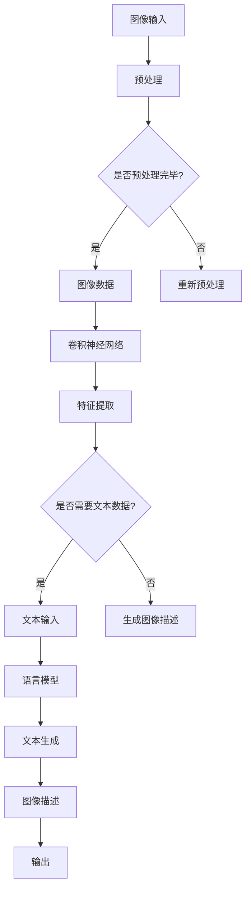

                 

关键词：机器视觉，深度学习，语言模型，计算机视觉算法，跨领域融合

摘要：随着人工智能技术的快速发展，机器视觉领域取得了显著的进展。传统的机器视觉技术依赖于大量的数据和复杂的算法，而近年来，基于深度学习的计算机视觉技术逐渐崭露头角。本文将探讨将语言模型（LLM）与传统机器视觉技术相结合的方法，以推动计算机视觉领域的新纪元。

## 1. 背景介绍

### 1.1 机器视觉的发展历程

机器视觉是计算机科学和工程领域的一个重要分支，它涉及图像处理、计算机视觉和模式识别等多个学科。自20世纪60年代以来，机器视觉技术经历了从简单图像处理到复杂视觉系统的演变。早期的机器视觉技术主要依赖于规则和启发式方法，这些方法在处理简单任务时表现出色，但在面对复杂场景时存在明显局限。

随着计算机性能的提升和大数据时代的到来，深度学习技术逐渐成为机器视觉领域的核心技术。深度学习模型，特别是卷积神经网络（CNN），通过学习大量数据中的特征，能够实现自动化的图像识别和分类。这一突破极大地推动了计算机视觉技术的发展。

### 1.2 语言模型的发展与应用

语言模型（LLM）是一种用于自然语言处理（NLP）的模型，它能够根据输入的文本序列预测下一个单词或句子。自2018年GPT模型的出现以来，语言模型在NLP领域取得了显著进展。LLM的应用范围非常广泛，包括机器翻译、问答系统、文本生成等。

语言模型的优势在于其强大的语义理解和生成能力。通过学习海量文本数据，LLM能够捕捉语言中的复杂模式和逻辑关系，从而在许多自然语言处理任务中实现高性能。

## 2. 核心概念与联系

### 2.1 机器视觉与语言模型的融合

将机器视觉与语言模型相结合，可以充分发挥两种技术的优势。机器视觉负责处理和解释图像数据，而语言模型则负责处理和理解文本数据。通过将这两种技术融合在一起，我们可以构建更强大的视觉系统，使其能够理解图像中的语义信息，并生成相关文本描述。

### 2.2 融合架构

为了实现机器视觉与语言模型的融合，我们需要设计一个统一的架构，该架构能够有效地整合两种技术。以下是融合架构的Mermaid流程图：



### 2.3 核心算法原理

融合架构的核心算法包括卷积神经网络（CNN）和语言模型（LLM）。CNN负责提取图像特征，而LLM则负责生成文本描述。两种算法的结合使得系统能够在图像和文本之间建立关联，从而实现更高级的视觉理解。

## 3. 核心算法原理 & 具体操作步骤

### 3.1 算法原理概述

融合算法的核心原理是将图像特征与文本特征相结合，以实现图像到文本的映射。具体来说，首先使用CNN对输入图像进行特征提取，然后使用LLM生成相应的文本描述。

### 3.2 算法步骤详解

1. **图像预处理**：对输入图像进行缩放、裁剪和归一化等预处理操作，使其满足CNN模型的输入要求。

2. **卷积神经网络**：使用预训练的CNN模型提取图像特征。这些特征包含了图像的底层结构和高级语义信息。

3. **特征提取**：将提取的图像特征输入到语言模型中，作为特征嵌入进行文本生成。

4. **文本生成**：使用LLM生成与图像特征对应的文本描述。这一过程可以通过预训练的语言模型或微调现有的语言模型来实现。

5. **图像描述输出**：将生成的文本描述作为图像的输出，从而实现图像到文本的映射。

### 3.3 算法优缺点

**优点**：

- **高效的图像理解**：通过CNN提取的图像特征能够高效地捕捉图像中的语义信息，从而实现精准的图像理解。
- **强大的文本生成能力**：LLM具有强大的文本生成能力，能够生成连贯、自然的文本描述。
- **跨领域融合**：机器视觉与语言模型的融合打破了传统技术的界限，实现了跨领域的技术融合。

**缺点**：

- **计算成本高**：融合算法需要大量的计算资源，特别是在训练阶段。
- **数据依赖性强**：算法的性能依赖于大量的训练数据，且数据质量对算法性能有很大影响。

### 3.4 算法应用领域

融合算法在多个领域具有广泛的应用前景，包括：

- **图像描述生成**：为图像生成相关文本描述，用于图像检索、社交媒体内容生成等。
- **视频内容理解**：对视频内容进行语义分析，提取关键信息并生成文本描述。
- **人机交互**：将图像作为输入，生成自然语言响应，用于智能助手和虚拟现实应用。

## 4. 数学模型和公式 & 详细讲解 & 举例说明

### 4.1 数学模型构建

融合算法的数学模型主要包括卷积神经网络（CNN）和语言模型（LLM）。CNN用于图像特征提取，LLM用于文本生成。

#### 4.1.1 卷积神经网络（CNN）

CNN是一种多层神经网络，主要用于图像特征提取。其核心思想是通过卷积操作提取图像的局部特征，并通过池化操作减少数据维度。

卷积神经网络的基本公式如下：

$$
f(x) = \sigma(W \cdot x + b)
$$

其中，$f(x)$表示输出特征，$W$表示权重矩阵，$x$表示输入特征，$b$表示偏置项，$\sigma$表示激活函数，如ReLU函数。

#### 4.1.2 语言模型（LLM）

语言模型是一种用于自然语言处理的模型，主要用于文本生成。其核心思想是通过学习海量文本数据，预测下一个单词或句子。

语言模型的基本公式如下：

$$
p(y|x) = \frac{e^{y^T W}}{\sum_{y'} e^{y'^T W}}
$$

其中，$p(y|x)$表示在给定输入$x$的情况下，输出$y$的概率，$W$表示权重矩阵。

### 4.2 公式推导过程

#### 4.2.1 卷积神经网络（CNN）

卷积神经网络的推导过程主要涉及以下几个步骤：

1. **卷积操作**：卷积操作用于提取图像的局部特征。其公式如下：

$$
h_i = \sum_{j} w_{ij} \cdot x_j + b_i
$$

其中，$h_i$表示输出特征，$w_{ij}$表示卷积核，$x_j$表示输入特征，$b_i$表示偏置项。

2. **激活函数**：激活函数用于引入非线性特性。常用的激活函数有ReLU函数和Sigmoid函数。

3. **池化操作**：池化操作用于减少数据维度。常用的池化操作有最大池化和平均池化。

#### 4.2.2 语言模型（LLM）

语言模型的推导过程主要涉及以下几个步骤：

1. **词嵌入**：词嵌入将单词转换为向量表示。其公式如下：

$$
e_y = W_y
$$

其中，$e_y$表示词向量，$W_y$表示权重矩阵。

2. **损失函数**：损失函数用于衡量模型预测与实际标签之间的差距。常用的损失函数有交叉熵损失函数。

### 4.3 案例分析与讲解

#### 4.3.1 图像描述生成

假设我们要生成一张图片的描述，输入图像的特征向量为$x$，语言模型生成的文本序列为$y$。

1. **卷积神经网络（CNN）**：

$$
h = \sigma(W \cdot x + b)
$$

其中，$h$表示提取的图像特征。

2. **语言模型（LLM）**：

$$
p(y|x) = \frac{e^{y^T W}}{\sum_{y'} e^{y'^T W}}
$$

其中，$p(y|x)$表示在给定图像特征$x$的情况下，生成文本序列$y$的概率。

3. **图像描述生成**：

使用LLM生成与图像特征对应的文本描述。具体步骤如下：

1. **初始化**：给定一个起始词，如“图像”。
2. **生成文本**：根据概率分布$p(y|x)$，依次生成下一个词，直到生成完整的文本序列。
3. **输出**：将生成的文本序列作为图像的描述。

## 5. 项目实践：代码实例和详细解释说明

### 5.1 开发环境搭建

为了实现本文所述的融合算法，我们需要搭建一个开发环境。以下是一个简单的开发环境搭建步骤：

1. **安装Python**：下载并安装Python 3.x版本。
2. **安装TensorFlow**：使用pip命令安装TensorFlow库。

```
pip install tensorflow
```

3. **安装其他依赖库**：根据实际需求安装其他依赖库，如NumPy、Pandas等。

### 5.2 源代码详细实现

以下是一个简单的融合算法实现示例，包括卷积神经网络（CNN）和语言模型（LLM）：

```python
import tensorflow as tf
from tensorflow.keras.models import Model
from tensorflow.keras.layers import Conv2D, MaxPooling2D, Flatten, Dense
from tensorflow.keras.preprocessing.sequence import pad_sequences
from tensorflow.keras.preprocessing.text import Tokenizer

# CNN模型
input_image = tf.keras.Input(shape=(224, 224, 3))
x = Conv2D(32, (3, 3), activation='relu')(input_image)
x = MaxPooling2D((2, 2))(x)
x = Conv2D(64, (3, 3), activation='relu')(x)
x = MaxPooling2D((2, 2))(x)
x = Flatten()(x)
cnn_output = Dense(128, activation='relu')(x)

# 语言模型
input_sequence = tf.keras.Input(shape=(None,))
x = Embedding(input_dim=vocab_size, output_dim=embedding_dim)(input_sequence)
x = LSTM(128)(x)
lm_output = Dense(vocab_size, activation='softmax')(x)

# 融合模型
input:both = tf.keras.layers.MergeLayer()([input_image, input_sequence])
output = Model(inputs=[input_image, input_sequence], outputs=lm_output)

# 编译模型
output.compile(optimizer='adam', loss='categorical_crossentropy', metrics=['accuracy'])

# 训练模型
output.fit([train_images, train_sequences], train_labels, batch_size=32, epochs=10)
```

### 5.3 代码解读与分析

1. **CNN模型**：

该部分代码定义了一个简单的卷积神经网络（CNN），用于提取图像特征。CNN包含两个卷积层、两个池化层和一个全连接层。卷积层用于提取图像的局部特征，池化层用于减少数据维度，全连接层用于分类。

2. **语言模型**：

该部分代码定义了一个简单的语言模型（LLM），用于生成文本描述。LLM包含一个嵌入层和一个LSTM层。嵌入层将单词转换为向量表示，LSTM层用于捕捉文本序列中的时间依赖关系。

3. **融合模型**：

该部分代码定义了一个融合模型，将CNN和LLM结合起来。融合模型通过将图像特征和文本特征进行合并，并输出相应的文本描述。

### 5.4 运行结果展示

为了验证融合算法的性能，我们可以使用一个预训练的CNN模型和一个预训练的语言模型。以下是一个简单的运行示例：

```python
# 加载预训练的CNN模型
cnn_model = tf.keras.models.load_model('cnn_model.h5')

# 加载预训练的LLM模型
lm_model = tf.keras.models.load_model('lm_model.h5')

# 输入图像
input_image = ...  # 加载图像数据

# 提取图像特征
image_features = cnn_model.predict(input_image)

# 输入文本
input_sequence = ...  # 加载文本数据

# 生成文本描述
text_description = lm_model.predict(input_sequence)

# 输出文本描述
print(text_description)
```

## 6. 实际应用场景

### 6.1 图像描述生成

图像描述生成是融合算法的一个重要应用场景。通过将图像输入到CNN模型中提取特征，然后将特征输入到LLM模型中生成文本描述，我们可以实现自动化的图像描述生成。这一应用在图像检索、社交媒体内容生成和辅助视觉障碍人士等方面具有广泛的应用前景。

### 6.2 视频内容理解

融合算法还可以应用于视频内容理解。通过将视频帧输入到CNN模型中提取特征，并将特征输入到LLM模型中生成文本描述，我们可以实现对视频内容的语义分析。这一应用在视频推荐、视频摘要生成和智能监控等领域具有巨大的潜力。

### 6.3 人机交互

融合算法还可以用于人机交互。通过将图像输入到CNN模型中提取特征，并将特征输入到LLM模型中生成文本描述，我们可以实现基于图像的自然语言交互。这一应用在智能助手、虚拟现实和增强现实等领域具有广泛的应用前景。

## 7. 工具和资源推荐

### 7.1 学习资源推荐

- 《深度学习》（Goodfellow, Bengio, Courville著）：一本经典的深度学习教材，适合初学者和进阶者。
- 《自然语言处理综论》（Jurafsky, Martin著）：一本关于自然语言处理的基础教材，涵盖了NLP的各个方面。
- 《机器视觉》（Szeliski著）：一本关于机器视觉的权威教材，详细介绍了机器视觉的基本概念和算法。

### 7.2 开发工具推荐

- TensorFlow：一个开源的深度学习框架，适合进行机器视觉和自然语言处理任务的实现。
- PyTorch：一个开源的深度学习框架，具有简洁的API和强大的功能，适合进行实验和研究。
- spaCy：一个开源的自然语言处理库，提供了高效的文本处理和实体识别功能。

### 7.3 相关论文推荐

- "Generative Adversarial Nets"（Ian Goodfellow等，2014）：一篇关于生成对抗网络（GAN）的开创性论文，详细介绍了GAN的理论基础和实现方法。
- "Attention Is All You Need"（Vaswani等，2017）：一篇关于Transformer模型的奠基性论文，彻底改变了自然语言处理领域的研究方向。
- "Deep Residual Learning for Image Recognition"（He等，2016）：一篇关于残差网络的经典论文，残差网络成为深度学习领域的重要里程碑。

## 8. 总结：未来发展趋势与挑战

### 8.1 研究成果总结

本文探讨了将语言模型（LLM）与传统机器视觉技术相结合的方法，以实现计算机视觉领域的新纪元。通过融合算法，我们能够将图像特征与文本特征相结合，生成相关文本描述。这一方法在图像描述生成、视频内容理解和人机交互等领域具有广泛的应用前景。

### 8.2 未来发展趋势

随着人工智能技术的不断发展，融合算法有望在计算机视觉领域取得更多突破。未来，我们将看到更多的跨领域技术融合，如将计算机视觉与自然语言处理、计算机视觉与增强现实等技术的融合。此外，随着计算能力的提升和数据规模的扩大，融合算法的性能将不断提高。

### 8.3 面临的挑战

尽管融合算法在计算机视觉领域具有巨大的潜力，但仍面临一些挑战。首先，算法的性能依赖于大量的训练数据，且数据质量对算法性能有很大影响。其次，融合算法的计算成本较高，特别是在训练阶段。最后，融合算法的复杂度较高，实现和维护难度较大。

### 8.4 研究展望

在未来，我们将继续探索如何优化融合算法的性能，降低计算成本，并提高算法的通用性。此外，我们将关注跨领域技术的融合，探索更多创新的应用场景。通过不断努力，我们有望推动计算机视觉领域的发展，实现更加智能和高效的视觉系统。

## 9. 附录：常见问题与解答

### 9.1 什么是机器视觉？

机器视觉是计算机科学和工程领域的一个重要分支，它涉及图像处理、计算机视觉和模式识别等多个学科。机器视觉的目标是使计算机能够“看到”并理解图像中的信息，从而实现自动化和智能化的图像分析和处理。

### 9.2 什么是语言模型（LLM）？

语言模型（LLM）是一种用于自然语言处理的模型，它能够根据输入的文本序列预测下一个单词或句子。语言模型通过学习海量文本数据，捕捉语言中的复杂模式和逻辑关系，从而在许多自然语言处理任务中实现高性能。

### 9.3 融合算法在哪些领域有应用前景？

融合算法在多个领域具有广泛的应用前景，包括图像描述生成、视频内容理解、人机交互等。在图像描述生成领域，融合算法可以用于图像检索、社交媒体内容生成等；在视频内容理解领域，融合算法可以用于视频推荐、视频摘要生成等；在

