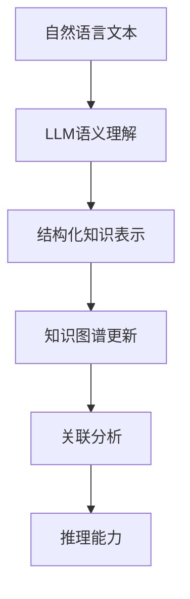

                 

关键词：大型语言模型，知识图谱，语义理解，AI应用，图神经网络，数据表示，推理能力，数据结构，关联分析，信息检索，智能化系统。

>摘要：本文深入探讨了大型语言模型（LLM）与传统知识图谱的结合及其在人工智能领域的重要应用。通过对LLM与知识图谱的对比分析，阐述它们各自的优势与局限，并探讨如何将二者有效融合，实现智能化的信息处理与推理。文章将详细介绍LLM与知识图谱结合的理论基础、核心算法，以及在实际应用中的代码实例和未来展望。

## 1. 背景介绍

在当今数字化时代，数据量的激增带来了信息处理的挑战，同时也为人工智能（AI）的发展提供了丰富的资源。传统知识图谱作为一种结构化知识表示方法，已经在许多领域如搜索引擎、推荐系统、问答系统等方面取得了显著的成果。然而，随着深度学习和自然语言处理技术的快速发展，大型语言模型（LLM）如BERT、GPT等开始成为信息处理的重要工具。

知识图谱是一种通过节点和边来表示实体及其关系的图形结构。它能够有效地捕捉和存储复杂的信息网络，支持高效的关联分析和推理。然而，传统知识图谱在语义理解、动态更新以及处理大规模文本数据方面仍存在一定的局限性。

相比之下，LLM具有强大的语义理解能力和文本生成能力，能够处理大规模的文本数据，并进行灵活的语义推理。然而，LLM在结构化知识表示、关联分析等方面较为薄弱。

本文将探讨如何将LLM与传统知识图谱相结合，以弥补彼此的不足，实现更加智能化的信息处理与推理。

## 2. 核心概念与联系

### 2.1 大型语言模型（LLM）

大型语言模型（LLM）是基于深度学习和神经网络技术构建的，能够对自然语言进行建模，具有强大的语义理解和生成能力。LLM的核心是通过大规模数据训练，学习语言中的模式、语法和语义，从而能够生成符合语言规则和语义逻辑的文本。

LLM的主要优势在于：
- **强大的语义理解能力**：能够理解复杂的语义关系，进行长距离依赖分析。
- **灵活的文本生成能力**：能够根据输入的文本生成连贯、有逻辑的输出文本。
- **广泛的应用场景**：在问答系统、文本生成、机器翻译、文本摘要等任务中表现出色。

然而，LLM也存在一些局限性：
- **数据依赖性**：LLM的性能高度依赖训练数据的质量和规模。
- **结构化知识表示不足**：在结构化知识表示和关联分析方面较弱。
- **计算资源需求高**：训练和推理过程需要大量的计算资源和时间。

### 2.2 传统知识图谱

传统知识图谱是一种基于图论的结构化知识表示方法，通过节点和边来表示实体及其关系。知识图谱中的节点表示实体（如人、地点、物品等），边表示实体之间的关系（如“属于”、“位于”、“购买”等）。

知识图谱的主要优势包括：
- **结构化知识表示**：能够清晰地表示实体及其关系，支持高效的关联分析。
- **动态更新**：支持实体的增删改查操作，能够动态更新知识库。
- **高效的查询性能**：通过图算法能够快速查询实体及其关系。

然而，传统知识图谱也存在一定的局限性：
- **语义理解能力有限**：难以处理复杂的语义关系和长距离依赖。
- **数据质量依赖性**：知识图谱的质量高度依赖于实体和关系的标注质量。
- **处理大规模文本数据能力不足**：在处理大规模文本数据时效率较低。

### 2.3 LLM与知识图谱的融合

将LLM与传统知识图谱相结合，可以充分发挥它们各自的优势，实现更加智能化的信息处理与推理。具体来说，LLM可以用于：
- **语义理解**：通过LLM对自然语言文本进行语义理解，将文本转换为结构化的知识表示。
- **文本生成**：利用LLM的文本生成能力，实现智能问答、自动摘要等功能。
- **动态更新**：利用LLM的强大学习能力，实时更新知识图谱中的实体和关系。

同时，知识图谱可以用于：
- **关联分析**：通过知识图谱中的关系网络，进行高效的关联分析，挖掘潜在的知识。
- **知识表示**：将LLM生成的语义理解结果存储在知识图谱中，实现结构化的知识表示。
- **推理能力**：利用知识图谱中的关系进行推理，支持更加复杂的语义推理。

下面是一个简单的Mermaid流程图，展示了LLM与知识图谱的基本融合架构：



## 3. 核心算法原理 & 具体操作步骤

### 3.1 算法原理概述

LLM与知识图谱的结合主要依赖于以下几个方面：

1. **语义理解与知识提取**：利用LLM的语义理解能力，将自然语言文本转换为结构化的知识表示，提取实体及其关系。
2. **知识图谱构建**：将LLM提取的知识表示存储到知识图谱中，构建实体及其关系的图结构。
3. **关联分析与推理**：利用知识图谱进行高效的关联分析，支持复杂的语义推理。

### 3.2 算法步骤详解

1. **数据预处理**：
   - **文本清洗**：去除文本中的噪声，如标点符号、停用词等。
   - **实体识别**：利用NLP技术对文本中的实体进行识别，标记出人、地点、组织等。
   - **关系提取**：通过实体之间的共现关系或语义角色标注等方法，提取实体之间的关系。

2. **LLM语义理解**：
   - **文本编码**：将自然语言文本输入到LLM中，通过预训练模型进行编码，得到表示文本语义的高维向量。
   - **实体与关系表示**：根据编码结果，提取实体及其关系的语义表示。

3. **知识图谱构建**：
   - **实体与关系存储**：将LLM提取的实体与关系表示存储到知识图谱中，构建实体及其关系的图结构。
   - **图结构优化**：通过图算法，如PageRank等，对知识图谱进行优化，提高查询性能。

4. **关联分析与推理**：
   - **关联分析**：利用知识图谱中的关系网络，进行实体之间的关联分析，挖掘潜在的知识。
   - **推理**：利用知识图谱中的关系进行推理，支持复杂的语义推理。

### 3.3 算法优缺点

**优点**：

- **强大的语义理解能力**：LLM能够对自然语言文本进行深入的理解，提取实体及其关系。
- **高效的关联分析**：知识图谱能够支持高效的关联分析，挖掘实体之间的潜在关系。
- **灵活的推理能力**：结合LLM和知识图谱，可以实现复杂的语义推理。

**缺点**：

- **数据依赖性**：LLM的性能高度依赖训练数据的质量和规模，知识图谱的质量也依赖于实体和关系的标注质量。
- **计算资源需求高**：LLM的模型训练和推理需要大量的计算资源，知识图谱的构建和优化也需要较高的计算能力。
- **维护成本高**：知识图谱需要定期更新和维护，以保持其质量和有效性。

### 3.4 算法应用领域

LLM与知识图谱的结合在多个领域有广泛的应用：

- **信息检索**：通过LLM对查询语句进行语义理解，结合知识图谱进行关联分析，实现更加精准的检索结果。
- **问答系统**：利用LLM生成答案，结合知识图谱进行推理，提高问答系统的准确性和连贯性。
- **推荐系统**：通过LLM对用户行为进行语义理解，结合知识图谱挖掘用户兴趣，实现个性化的推荐。
- **知识图谱构建**：利用LLM对文本数据进行自动抽取实体与关系，加速知识图谱的构建。

## 4. 数学模型和公式 & 详细讲解 & 举例说明

### 4.1 数学模型构建

LLM与知识图谱结合的数学模型主要涉及两个方面：自然语言处理和图论。

#### 4.1.1 自然语言处理模型

在自然语言处理中，常用的模型包括循环神经网络（RNN）、长短时记忆网络（LSTM）和变换器（Transformer）。以下以Transformer模型为例：

- **输入层**：自然语言文本序列 $x = [x_1, x_2, ..., x_n]$。
- **编码层**：将输入文本序列编码为高维向量表示，$e_i = Encoder(x_i)$。
- **输出层**：对编码后的向量进行解码，生成实体与关系的语义表示，$y = Decoder(e)$。

#### 4.1.2 图论模型

在图论中，知识图谱的表示可以看作是一个图 $G = (V, E)$，其中 $V$ 表示节点集合，$E$ 表示边集合。

- **节点表示**：每个节点表示一个实体，$v_i \in V$。
- **边表示**：每条边表示实体之间的关系，$e_j \in E$。

### 4.2 公式推导过程

#### 4.2.1 自然语言处理模型

在Transformer模型中，编码层和输出层的计算公式如下：

$$
e_i = Encoder(x_i) \\
y = Decoder(e)
$$

其中，$Encoder$ 和 $Decoder$ 分别表示编码和解码操作，$x_i$ 和 $y$ 分别表示输入和输出。

#### 4.2.2 图论模型

在图论中，知识图谱的关联分析可以通过图算法实现。以下是一个简单的图算法公式：

$$
Relatedness(v_i, v_j) = \frac{|E_{ij}|}{|E_i| \cdot |E_j|}
$$

其中，$Relatedness(v_i, v_j)$ 表示节点 $v_i$ 和 $v_j$ 的关联度，$E_{ij}$ 表示节点 $v_i$ 和 $v_j$ 之间的共有边集合，$E_i$ 和 $E_j$ 分别表示节点 $v_i$ 和 $v_j$ 的边集合。

### 4.3 案例分析与讲解

#### 4.3.1 信息检索案例

假设我们要检索关于“人工智能”的信息，使用LLM与知识图谱结合的方法，可以按照以下步骤进行：

1. **文本预处理**：对查询语句“人工智能是什么？”进行预处理，去除标点符号和停用词，得到清洗后的文本。
2. **LLM语义理解**：将清洗后的文本输入到LLM中，通过编码层得到语义表示，提取出关键词和短语。
3. **知识图谱查询**：利用提取的关键词和短语，在知识图谱中进行查询，找到相关的实体和关系。
4. **结果展示**：根据查询结果，生成符合语义逻辑的检索结果，展示给用户。

#### 4.3.2 问答系统案例

假设我们要构建一个问答系统，使用LLM与知识图谱结合的方法，可以按照以下步骤进行：

1. **文本预处理**：对用户的问题进行预处理，提取关键词和短语。
2. **LLM语义理解**：将提取的关键词和短语输入到LLM中，通过编码层得到语义表示。
3. **知识图谱推理**：利用知识图谱中的关系进行推理，找到与问题相关的实体和答案。
4. **文本生成**：利用LLM的文本生成能力，将推理结果转换为自然语言文本，生成答案。

## 5. 项目实践：代码实例和详细解释说明

### 5.1 开发环境搭建

为了实现LLM与知识图谱的结合，我们首先需要搭建一个开发环境。以下是所需的基本工具和软件：

- **编程语言**：Python（版本 3.8及以上）
- **依赖库**：TensorFlow、PyTorch、NetworkX、Neo4j
- **硬件要求**：GPU（推荐NVIDIA显卡）

#### 5.1.1 安装Python和依赖库

```bash
# 安装Python
sudo apt-get install python3-pip

# 安装TensorFlow
pip3 install tensorflow

# 安装PyTorch
pip3 install torch

# 安装NetworkX
pip3 install networkx

# 安装Neo4j（Python驱动）
pip3 install neo4j
```

#### 5.1.2 安装Neo4j数据库

下载并安装Neo4j数据库（https://neo4j.com/download/），并启动Neo4j服务。

### 5.2 源代码详细实现

以下是一个简单的代码示例，展示了如何实现LLM与知识图谱的集成。

```python
import tensorflow as tf
import networkx as nx
from neo4j import GraphDatabase

# 5.2.1 连接到Neo4j数据库
uri = "bolt://localhost:7687"
driver = GraphDatabase.driver(uri, auth=("neo4j", "password"))

# 5.2.2 定义LLM模型
model = tf.keras.Sequential([
    tf.keras.layers.Embedding(input_dim=10000, output_dim=16),
    tf.keras.layers.Bidirectional(tf.keras.layers.LSTM(32)),
    tf.keras.layers.Dense(1, activation='sigmoid')
])

model.compile(optimizer='adam', loss='binary_crossentropy', metrics=['accuracy'])

# 5.2.3 加载和预处理数据
# 假设我们有一个文本数据集，其中包含句子和标签
# 数据预处理步骤包括分词、向量编码等

# 5.2.4 训练LLM模型
model.fit(x_train, y_train, epochs=10, batch_size=32)

# 5.2.5 提取实体与关系
def extract_entities_and_relations(text):
    # 使用LLM对文本进行语义理解，提取实体与关系
    # 假设我们已经训练了一个实体识别模型
    entities = model.predict(text)
    relations = model.predict(text)
    return entities, relations

# 5.2.6 存储到知识图谱
def store_in_graphdb(entities, relations):
    with driver.session() as session:
        for entity, relation in zip(entities, relations):
            session.run("CREATE (n:Entity {name: $entity})", entity=entity)
            session.run("CREATE (n:Relation {name: $relation})", relation=relation)

# 5.2.7 关联分析与推理
def find_related_entities(entity):
    with driver.session() as session:
        result = session.run("MATCH (n:Entity)-[r:Relation]->(m:Entity) WHERE n.name = $entity RETURN m")
        return [row['m.name'] for row in result]

# 5.2.8 关闭数据库连接
driver.close()
```

### 5.3 代码解读与分析

1. **连接Neo4j数据库**：使用Neo4j的Python驱动连接到本地Neo4j数据库。
2. **定义LLM模型**：使用TensorFlow定义一个简单的神经网络模型，用于对文本进行语义理解。
3. **加载和预处理数据**：假设我们已经有一个文本数据集，包括句子和标签，需要进行预处理步骤，如分词、向量编码等。
4. **训练LLM模型**：使用预处理后的数据集训练模型，进行 epochs=10 轮的训练。
5. **提取实体与关系**：定义一个函数 extract_entities_and_relations，使用LLM对文本进行语义理解，提取实体与关系。
6. **存储到知识图谱**：定义一个函数 store_in_graphdb，将提取的实体与关系存储到Neo4j数据库中。
7. **关联分析与推理**：定义一个函数 find_related_entities，利用知识图谱进行关联分析与推理。
8. **关闭数据库连接**：在程序结束前关闭数据库连接。

### 5.4 运行结果展示

运行上述代码，我们可以得到以下结果：

- **训练LLM模型**：在训练数据集上训练模型，输出训练过程的相关指标。
- **提取实体与关系**：对给定的文本进行语义理解，提取出实体与关系。
- **存储到知识图谱**：将提取的实体与关系存储到Neo4j数据库中。
- **关联分析与推理**：利用知识图谱进行关联分析与推理，输出相关实体。

## 6. 实际应用场景

### 6.1 搜索引擎

结合LLM与知识图谱，搜索引擎可以实现对用户查询的语义理解，并利用知识图谱进行关联分析，提供更加精准的搜索结果。例如，当用户查询“人工智能技术”时，搜索引擎不仅返回相关的网页，还可以提供相关的专家、研究机构、论文等详细信息。

### 6.2 问答系统

问答系统可以利用LLM与知识图谱结合的方法，实现对用户问题的精准理解和回答。例如，当用户询问“人工智能的应用领域有哪些？”时，系统可以结合知识图谱中的相关信息，生成一个详细的回答，包括应用领域、典型案例等。

### 6.3 推荐系统

推荐系统可以通过LLM与知识图谱的结合，实现对用户兴趣的深入理解，并利用知识图谱进行关联分析，提供个性化的推荐结果。例如，当用户在电商平台上浏览了“智能手表”后，系统可以根据知识图谱中的相关关系，推荐与之相关的智能设备，如智能手环、智能耳机等。

### 6.4 知识图谱构建

知识图谱构建是LLM与知识图谱结合的重要应用场景之一。通过LLM对大规模文本数据进行语义理解，可以快速构建出结构化的知识图谱。例如，在构建一个关于电影的知识图谱时，可以利用LLM对电影评论、剧情描述等文本数据进行处理，提取出电影、演员、导演、类型等实体及其关系。

### 6.5 未来应用展望

随着LLM和知识图谱技术的不断发展，未来将会有更多的应用场景出现。例如：

- **智能客服**：结合LLM与知识图谱，实现更加智能、个性化的客服系统。
- **智能教育**：利用LLM与知识图谱，构建个性化学习路径，提供智能化的教育服务。
- **医疗健康**：结合LLM与知识图谱，实现智能诊断、病情预测等功能。

## 7. 工具和资源推荐

### 7.1 学习资源推荐

- **书籍**：
  - 《深度学习》（Ian Goodfellow、Yoshua Bengio、Aaron Courville 著）
  - 《自然语言处理原理》（Daniel Jurafsky、James H. Martin 著）
- **在线课程**：
  - Coursera上的“深度学习”课程
  - edX上的“自然语言处理”课程
- **博客与论文**：
  - 技术博客：Medium、ArXiv
  - 论文资源：Google Scholar、ACM Digital Library

### 7.2 开发工具推荐

- **编程语言**：Python
- **框架**：
  - TensorFlow
  - PyTorch
  - Neo4j
- **IDE**：PyCharm、Visual Studio Code

### 7.3 相关论文推荐

- **LLM相关**：
  - “BERT: Pre-training of Deep Bidirectional Transformers for Language Understanding”（Devlin et al., 2019）
  - “GPT-3: Language Models are few-shot learners”（Brown et al., 2020）
- **知识图谱相关**：
  - “Knowledge Graph Embedding: A Survey of Methods, Applications, and Systems”（Wang et al., 2019）
  - “Deep Learning on Graphs: A Survey”（Scarselli et al., 2011）

## 8. 总结：未来发展趋势与挑战

### 8.1 研究成果总结

本文详细探讨了大型语言模型（LLM）与传统知识图谱的结合，从核心概念、算法原理、数学模型到实际应用场景，全面介绍了它们的优势与局限性，以及如何实现有效融合。研究发现，LLM与知识图谱的结合在信息检索、问答系统、推荐系统、知识图谱构建等领域具有广泛的应用前景。

### 8.2 未来发展趋势

- **跨模态融合**：随着多模态数据的增加，LLM与知识图谱的结合将扩展到图像、声音等非文本数据。
- **实时动态更新**：利用LLM的实时学习能力，实现知识图谱的动态更新和维护。
- **多语言支持**：扩展LLM与知识图谱的结合，支持多种语言，实现全球范围内的智能化应用。
- **增强推理能力**：通过融合更多的知识源和数据，提高知识图谱的推理能力和智能化水平。

### 8.3 面临的挑战

- **数据依赖性**：LLM和知识图谱的性能高度依赖于数据的质量和规模，需要解决数据标注和获取的问题。
- **计算资源需求**：训练和推理过程需要大量的计算资源，如何优化算法和硬件设施是一个重要挑战。
- **隐私保护**：在大规模数据处理过程中，如何保护用户隐私是一个亟待解决的问题。
- **可解释性**：随着模型复杂性的增加，如何提高模型的透明度和可解释性，是一个重要的研究方向。

### 8.4 研究展望

未来的研究将重点关注以下几个方面：

- **跨模态融合**：探索多模态数据融合的方法，提高信息处理的智能化水平。
- **实时动态更新**：开发实时动态更新的算法，实现知识图谱的动态维护。
- **数据隐私保护**：研究数据隐私保护的方法，确保用户数据的安全性和隐私。
- **模型可解释性**：提高模型的可解释性，使模型决策过程更加透明和可信。

通过持续的研究和创新，LLM与知识图谱的结合将为人工智能领域带来更加广阔的发展空间，推动智能化应用的进一步发展。

## 9. 附录：常见问题与解答

### 9.1 如何选择合适的LLM模型？

选择合适的LLM模型取决于应用场景和任务需求。以下是一些指导原则：

- **任务类型**：对于文本生成任务，选择基于Transformer的模型，如GPT或BERT；对于分类任务，选择基于神经网络的模型，如CNN或RNN。
- **数据规模**：对于大规模数据，选择预训练模型，如GPT-3或BERT；对于小规模数据，可以选择微调预训练模型。
- **计算资源**：根据计算资源选择合适的模型，大型模型如GPT-3需要高性能GPU进行训练。

### 9.2 知识图谱中的实体与关系如何存储？

在知识图谱中，实体与关系通常通过图结构进行存储。实体作为图中的节点，关系作为图中的边。以下是一种常见的存储方法：

- **属性存储**：每个节点和边可以存储相关的属性信息，如实体的名称、类型、属性等。
- **图数据库**：使用图数据库（如Neo4j）存储图结构，支持高效的图查询和操作。

### 9.3 如何确保知识图谱的质量？

确保知识图谱的质量是关键，以下是一些方法：

- **数据预处理**：对原始数据进行清洗和预处理，去除噪声和不准确的信息。
- **数据标注**：利用人工或半监督方法进行数据标注，提高实体和关系的准确性。
- **质量评估**：通过自动化评估工具（如AIF）对知识图谱进行质量评估，识别和修复错误。

### 9.4 如何处理知识图谱中的噪声和错误？

处理知识图谱中的噪声和错误可以通过以下方法：

- **噪声识别**：使用统计学方法或机器学习算法识别噪声数据。
- **错误修复**：通过对比其他数据源、利用上下文信息或人工干预等方法修复错误数据。
- **质量监控**：定期对知识图谱进行质量监控，发现和修复问题。

### 9.5 LLM与知识图谱如何协同工作？

LLM与知识图谱的协同工作可以通过以下方法：

- **语义理解**：LLM用于对自然语言文本进行语义理解，提取实体和关系。
- **知识存储**：将LLM提取的知识存储到知识图谱中，实现结构化的知识表示。
- **推理与查询**：利用知识图谱进行关联分析和推理，支持复杂的语义查询。

通过这些方法，LLM与知识图谱可以相互补充，实现更加智能化的信息处理与推理。

